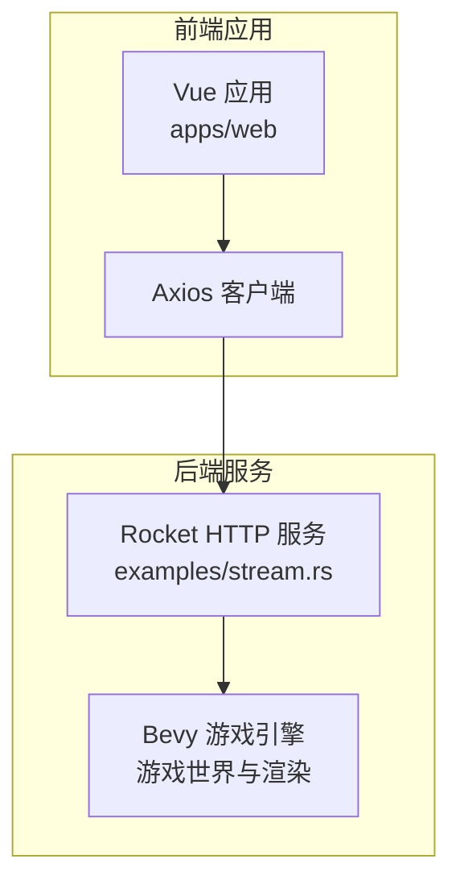
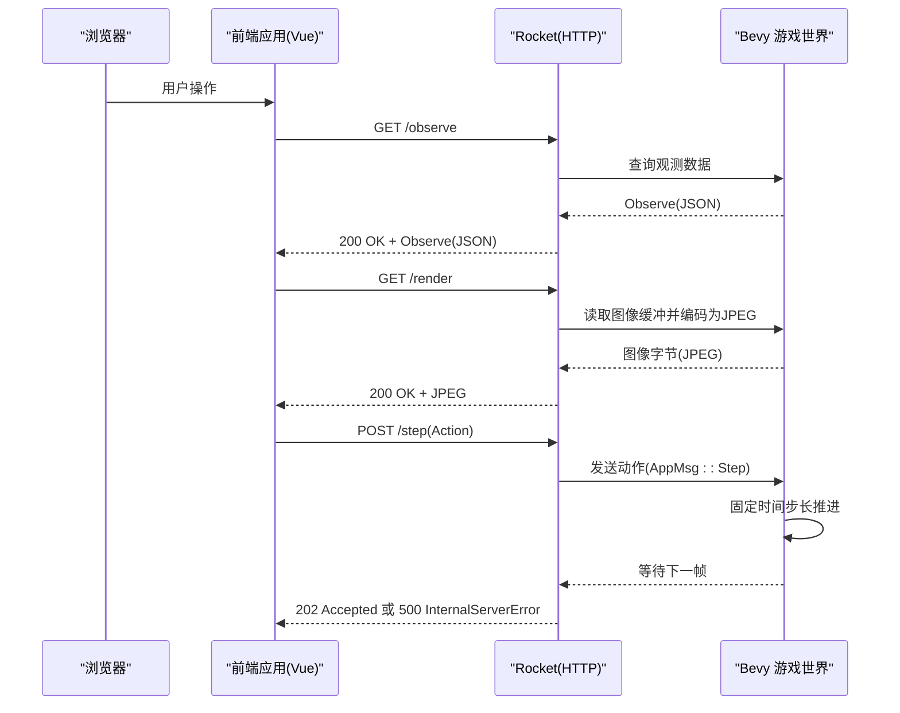
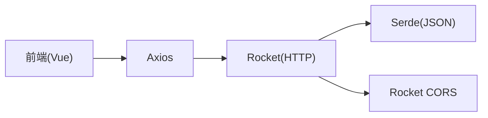

# API参考

<cite>
**本文引用的文件**
- [examples/stream.rs](file://examples/stream.rs)
- [Cargo.toml](file://Cargo.toml)
- [apps/web/src/composables/useClient.ts](file://apps/web/src/composables/useClient.ts)
- [apps/web/src/pages/play.vue](file://apps/web/src/pages/play.vue)
- [apps/web/.env.development](file://apps/web/.env.development)
- [src/core/action.rs](file://src/core/action.rs)
- [src/core/attack.rs](file://src/core/attack.rs)
- [src/abilities/fiora_passive.rs](file://src/abilities/fiora_passive.rs)
</cite>

## 目录
1. [简介](#简介)
2. [项目结构](#项目结构)
3. [核心组件](#核心组件)
4. [架构总览](#架构总览)
5. [详细组件分析](#详细组件分析)
6. [依赖分析](#依赖分析)
7. [性能考虑](#性能考虑)
8. [故障排查指南](#故障排查指南)
9. [结论](#结论)
10. [附录](#附录)

## 简介
本文件为 moon-lol 项目的 API 参考文档，聚焦于通过 Rocket 框架暴露的 HTTP 端点，涵盖以下三个核心 RESTful 接口：
- GET /render：获取当前渲染图像（JPEG）
- POST /step：提交一步动作（Action），驱动游戏世界前进一帧
- GET /observe：查询当前观测状态（Observe）

同时，文档说明了 CORS 配置、错误码、数据序列化格式（JSON）、客户端调用示例（curl 与 JavaScript fetch），以及与前端 Web 应用的集成方式。

## 项目结构
moon-lol 使用 Bevy 引擎驱动游戏逻辑，Rocket 提供 HTTP 服务，前端 Vue 应用通过 HTTP 与后端交互。API 服务由 examples/stream.rs 中的 Rocket 应用提供，前端位于 apps/web，通过环境变量配置后端地址。

图表来源
- [examples/stream.rs](file://examples/stream.rs#L329-L420)
- [apps/web/src/composables/useClient.ts](file://apps/web/src/composables/useClient.ts#L1-L232)
- [apps/web/.env.development](file://apps/web/.env.development#L1-L1)

章节来源
- [examples/stream.rs](file://examples/stream.rs#L329-L420)
- [apps/web/src/composables/useClient.ts](file://apps/web/src/composables/useClient.ts#L1-L232)
- [apps/web/.env.development](file://apps/web/.env.development#L1-L1)

## 核心组件
- HTTP 服务（Rocket）
  - 提供 /render、/step、/observe 三个路由
  - 启用 CORS 允许跨域访问
- 游戏世界（Bevy）
  - 承载游戏状态、渲染输出、物理与战斗逻辑
  - 通过通道接收外部动作并推进固定时间步长
- 前端（Vue + Axios）
  - 通过 /observe 获取观测数据，通过 /render 获取图像，通过 /step 提交动作
  - 通过环境变量配置后端基础 URL

章节来源
- [examples/stream.rs](file://examples/stream.rs#L286-L327)
- [examples/stream.rs](file://examples/stream.rs#L329-L420)
- [apps/web/src/composables/useClient.ts](file://apps/web/src/composables/useClient.ts#L1-L232)
- [apps/web/.env.development](file://apps/web/.env.development#L1-L1)

## 架构总览
下图展示了从浏览器到后端服务再到 Bevy 游戏世界的调用链路与数据流。

图表来源
- [examples/stream.rs](file://examples/stream.rs#L286-L327)
- [examples/stream.rs](file://examples/stream.rs#L329-L420)

## 详细组件分析

### /render 接口
- 方法与路径
  - GET /render
- 请求头
  - 无特殊要求；启用 CORS 后可跨域访问
- 请求体
  - 无
- 响应
  - 成功：200 OK，Content-Type: image/jpeg，Body: JPEG 图像字节
  - 未就绪：404 Not Found
- 错误码
  - 404：图像尚未生成
  - 500：内部错误（如编码失败）
- 数据序列化
  - 二进制 JPEG（非 JSON）
- 连接生命周期
  - 短连接；每次请求独立获取当前帧图像
- 客户端示例
  - curl
    - curl -i "http://localhost:8000/render"
  - JavaScript fetch
    - fetch("http://localhost:8000/render").then(r => r.blob());

章节来源
- [examples/stream.rs](file://examples/stream.rs#L302-L315)

### /step 接口
- 方法与路径
  - POST /step
- 请求头
  - Content-Type: application/json
- 请求体 JSON Schema
  - 顶层对象为 Action 枚举，支持以下变体：
    - Move: { position: [number, number] }
    - Attack: { entity: number }
    - Stop: {}
    - Skill: { index: number, point: [number, number] }
    - SkillLevelUp: { index: number }
  - 注意：当不携带请求体时，视为“无动作”，系统仍推进一帧
- 响应
  - 成功：202 Accepted
  - 失败：500 InternalServerError
- 错误码
  - 500：内部错误（如通道发送失败）
- 数据序列化
  - JSON
- 连接生命周期
  - 短连接；提交动作后立即返回
- 客户端示例
  - curl
    - curl -X POST "http://localhost:8000/step" -H "Content-Type: application/json" -d '{"Move":[100,200]}'
    - curl -X POST "http://localhost:8000/step" -H "Content-Type: application/json" -d '{"Attack":123}'
    - curl -X POST "http://localhost:8000/step" -H "Content-Type: application/json" -d '{}'
  - JavaScript fetch
    - fetch("http://localhost:8000/step", { method: "POST", headers: {"Content-Type":"application/json"}, body: JSON.stringify({Move:[100,200]}) })

章节来源
- [examples/stream.rs](file://examples/stream.rs#L286-L300)
- [src/core/action.rs](file://src/core/action.rs#L48-L55)

### /observe 接口
- 方法与路径
  - GET /observe
- 请求头
  - 无特殊要求；启用 CORS 后可跨域访问
- 请求体
  - 无
- 响应
  - 成功：200 OK，Content-Type: application/json，Body: Observe 对象
  - 未就绪：404 Not Found
- 错误码
  - 404：观测数据尚未生成
- 数据序列化
  - JSON
- 连接生命周期
  - 短连接；每次请求独立获取当前帧观测
- 客户端示例
  - curl
    - curl "http://localhost:8000/observe"
  - JavaScript fetch
    - fetch("http://localhost:8000/observe").then(r => r.json())

Observe JSON Schema
- time: number
- myself: {
  position: [number, number]
  attack_state: { status: string, target: number|null } | null
}
- minions: {
  entity: number
  position: [number, number]
  health: number
  vital: {
    direction: string
    active_timer: { elapsed: number, duration: number, finished: boolean }
    remove_timer: { elapsed: number, duration: number, finished: boolean }
    timeout_red_triggered: boolean
  }
}

章节来源
- [examples/stream.rs](file://examples/stream.rs#L317-L327)
- [src/core/attack.rs](file://src/core/attack.rs#L55-L61)
- [src/abilities/fiora_passive.rs](file://src/abilities/fiora_passive.rs#L40-L46)

### WebSocket 或流式通信机制
- 当前实现未提供 WebSocket 或 Server-Sent Events 流式推送
- /render 采用短连接拉取 JPEG 图像；/observe 采用短连接获取 JSON 状态
- 若需实时流，可在前端轮询或自行扩展 Rocket SSE/WS 支持

章节来源
- [examples/stream.rs](file://examples/stream.rs#L302-L327)

### 认证机制
- 未实现认证与授权
- CORS 已启用，允许任意来源跨域访问

章节来源
- [examples/stream.rs](file://examples/stream.rs#L405-L415)

### 速率限制策略
- 仓库未实现速率限制
- 建议在生产环境中引入限流中间件或网关层

章节来源
- [examples/stream.rs](file://examples/stream.rs#L416-L420)

### 版本控制方案
- 未实现 API 版本控制
- 建议通过路径前缀（如 /v1/）或自定义 Header 进行版本管理

章节来源
- [examples/stream.rs](file://examples/stream.rs#L416-L420)

## 依赖分析
- Rocket 与 CORS
  - 依赖 rocket 与 rocket_cors，启用 CORS 并挂载路由
- JSON 序列化
  - 依赖 serde 与 serde_json，用于 Action 与 Observe 的编解码
- 前端依赖
  - axios 用于 HTTP 请求；ollama 用于工具函数推理（与 API 无关）

图表来源
- [Cargo.toml](file://Cargo.toml#L55-L63)
- [examples/stream.rs](file://examples/stream.rs#L27-L32)
- [apps/web/src/composables/useClient.ts](file://apps/web/src/composables/useClient.ts#L1-L20)

章节来源
- [Cargo.toml](file://Cargo.toml#L55-L63)
- [examples/stream.rs](file://examples/stream.rs#L27-L32)
- [apps/web/src/composables/useClient.ts](file://apps/web/src/composables/useClient.ts#L1-L20)

## 性能考虑
- /render
  - 图像来自 GPU 缓冲拷贝至 CPU，随后 JPEG 编码，建议降低刷新频率避免阻塞
- /step
  - 每次提交动作都会触发一次固定时间步长推进，建议前端按帧率节流
- /observe
  - 读取当前帧观测，建议缓存并在必要时刷新

[本节为通用指导，无需具体文件分析]

## 故障排查指南
- 404 Not Found
  - /render：图像尚未生成；稍后再试或先调用一次 /render
  - /observe：观测数据尚未生成；先调用一次 /observe
- 500 Internal Server Error
  - /step：通道发送失败或内部异常
  - /render：图像编码失败
- CORS 问题
  - 若浏览器报跨域错误，请确认后端已正确挂载 CORS
- 端口与地址
  - 前端默认使用 VITE_BASE_URL=http://localhost:8000；请确保后端监听该端口

章节来源
- [examples/stream.rs](file://examples/stream.rs#L302-L327)
- [apps/web/.env.development](file://apps/web/.env.development#L1-L1)

## 结论
moon-lol 的 API 以 Rocket 提供的三元接口为核心：/render、/step、/observe，配合 CORS 与 JSON/二进制数据格式，满足前端可视化与 RL 训练场景。当前未实现认证、速率限制与版本控制，建议在生产环境补充相应安全与治理措施。

[本节为总结性内容，无需具体文件分析]

## 附录

### 客户端调用示例（curl）
- 获取观测
  - curl "http://localhost:8000/observe"
- 提交动作（移动）
  - curl -X POST "http://localhost:8000/step" -H "Content-Type: application/json" -d '{"Move":[100,200]}'
- 提交动作（攻击）
  - curl -X POST "http://localhost:8000/step" -H "Content-Type: application/json" -d '{"Attack":123}'
- 提交动作（无动作）
  - curl -X POST "http://localhost:8000/step" -H "Content-Type: application/json" -d '{}'
- 获取图像
  - curl -i "http://localhost:8000/render"

章节来源
- [examples/stream.rs](file://examples/stream.rs#L286-L327)

### 客户端调用示例（JavaScript fetch）
- 获取观测
  - fetch("http://localhost:8000/observe").then(r => r.json())
- 提交动作（移动）
  - fetch("http://localhost:8000/step", { method: "POST", headers: {"Content-Type":"application/json"}, body: JSON.stringify({Move:[100,200]}) })
- 提交动作（攻击）
  - fetch("http://localhost:8000/step", { method: "POST", headers: {"Content-Type":"application/json"}, body: JSON.stringify({Attack:123}) })
- 提交动作（无动作）
  - fetch("http://localhost:8000/step", { method: "POST", headers: {"Content-Type":"application/json"}, body: JSON.stringify({}) })
- 获取图像
  - fetch("http://localhost:8000/render").then(r => r.blob())

章节来源
- [apps/web/src/composables/useClient.ts](file://apps/web/src/composables/useClient.ts#L62-L105)
- [apps/web/src/composables/useClient.ts](file://apps/web/src/composables/useClient.ts#L152-L184)