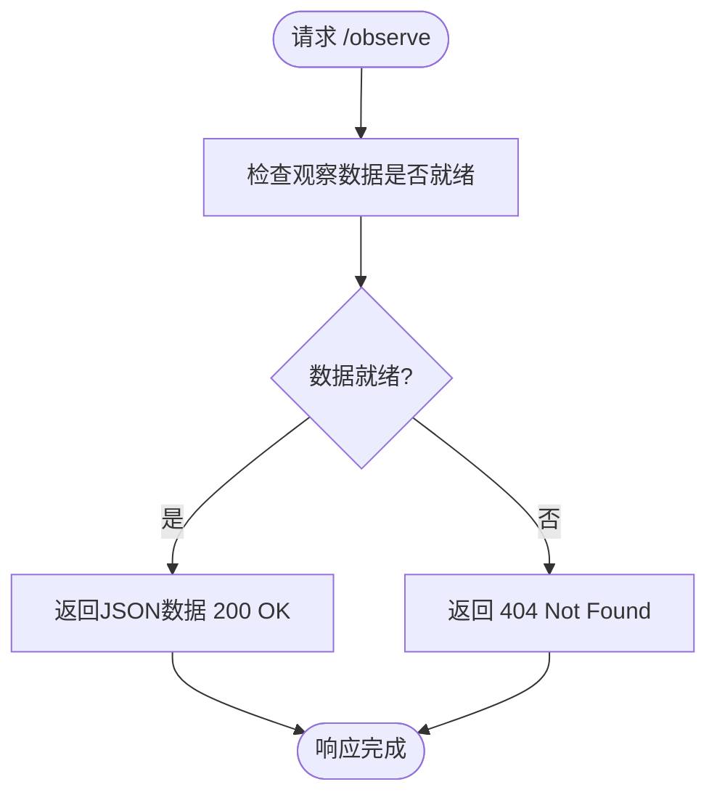

# /observe 端点

<cite>
**本文档引用的文件**  
- [stream.rs](file://examples/stream.rs#L261-L518)
- [useClient.ts](file://apps/web/src/composables/useClient.ts#L17-L24)
- [play.vue](file://apps/web/src/pages/play.vue#L66-L77)
- [attack.rs](file://src/core/attack.rs#L57-L80)
- [fiora_passive.rs](file://src/abilities/fiora_passive.rs#L88-L269)
</cite>

## 目录
1. [简介](#简介)
2. [端点详情](#端点详情)
3. [响应数据结构](#响应数据结构)
4. [状态未就绪处理](#状态未就绪处理)
5. [数据提取与序列化机制](#数据提取与序列化机制)
6. [前端JavaScript示例](#前端javascript示例)
7. [AI状态观测空间应用](#ai状态观测空间应用)

## 简介
`/observe` 端点是游戏系统中的一个关键API，用于提供当前游戏状态的实时摘要。该端点通过HTTP GET方法暴露，返回一个包含游戏时间、玩家自身状态和目标小兵状态的JSON对象。此功能主要用于外部监控和AI决策系统，使客户端能够获取必要的游戏信息以进行状态评估和行动规划。

**Section sources**
- [stream.rs](file://examples/stream.rs#L317-L327)

## 端点详情
`/observe` 端点通过HTTP GET方法访问，请求路径为`/observe`，响应内容类型为`application/json`。该端点由Rocket Web框架实现，作为游戏服务器的一部分运行。当客户端发出请求时，服务器会从共享状态中获取最新的观察数据并返回。


**Diagram sources**
- [stream.rs](file://examples/stream.rs#L317-L327)

**Section sources**
- [stream.rs](file://examples/stream.rs#L317-L327)

## 响应数据结构
`/observe` 端点返回的JSON响应包含三个主要字段：`time`、`myself`和`minions`。

- `time`: 当前游戏经过的时间（秒）
- `myself`: 玩家自身状态，包含位置和攻击状态
- `minions`: 目标小兵状态，包含实体ID、位置、生命值和破绽状态


**Diagram sources**
- [stream.rs](file://examples/stream.rs#L262-L275)

**Section sources**
- [stream.rs](file://examples/stream.rs#L262-L275)

## 状态未就绪处理
当游戏状态尚未准备好时，`/observe` 端点会返回HTTP 404 Not Found状态码。这种情况通常发生在游戏初始化阶段或当观察数据尚未被更新时。服务器通过检查共享的观察数据互斥锁来确定状态是否就绪。



**Diagram sources**
- [stream.rs](file://examples/stream.rs#L319-L325)

**Section sources**
- [stream.rs](file://examples/stream.rs#L319-L325)

## 数据提取与序列化机制
`/observe` 端点的数据提取机制基于Bevy引擎的ECS架构。服务器通过Bevy的Query系统从World中提取特定实体的组件数据，并将其序列化为JSON格式。

数据提取过程如下：
1. 通过Query系统查询玩家实体，获取其Transform和AttackState组件
2. 通过Query系统查询目标小兵实体，获取其Transform、Health和Vital组件
3. 将提取的数据组装成Observe结构体
4. 通过共享的Arc<Mutex>将数据传递给HTTP服务器


**Diagram sources**
- [stream.rs](file://examples/stream.rs#L484-L518)

**Section sources**
- [stream.rs](file://examples/stream.rs#L484-L518)

## 前端JavaScript示例
前端通过axios库调用`/observe`端点获取游戏状态，并将其用于UI显示和AI决策。

```javascript
async function getObservation() {
  const res = await http.get("/observe");
  return res.data;
}

// 在Vue组件中使用
const clientStore = useClientStore();
clientStore.observation = await getObservation();
```


**Diagram sources**
- [useClient.ts](file://apps/web/src/composables/useClient.ts#L62-L65)
- [play.vue](file://apps/web/src/pages/play.vue#L66-L77)

**Section sources**
- [useClient.ts](file://apps/web/src/composables/useClient.ts#L62-L65)
- [play.vue](file://apps/web/src/pages/play.vue#L66-L77)

## AI状态观测空间应用
`/observe` 端点的响应数据构成了AI系统的状态观测空间，为AI决策提供了必要的信息。

AI系统利用这些数据进行：
- 位置决策：基于玩家和小兵的位置计算最优移动路径
- 攻击决策：基于攻击状态和冷却时间决定是否发起攻击
- 破绽利用：基于Vital组件的方向信息，判断是否处于破绽的有效方向
- 战术规划：结合游戏时间和生命值变化，制定长期战术


**Diagram sources**
- [stream.rs](file://examples/stream.rs#L262-L275)
- [fiora_passive.rs](file://src/abilities/fiora_passive.rs#L88-L269)

**Section sources**
- [stream.rs](file://examples/stream.rs#L262-L275)
- [fiora_passive.rs](file://src/abilities/fiora_passive.rs#L88-L269)