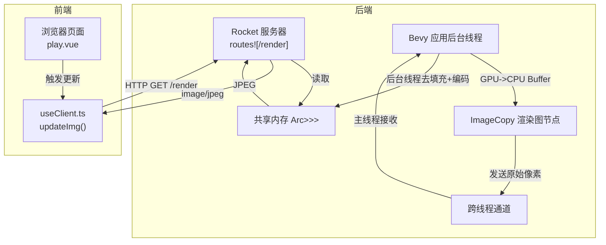
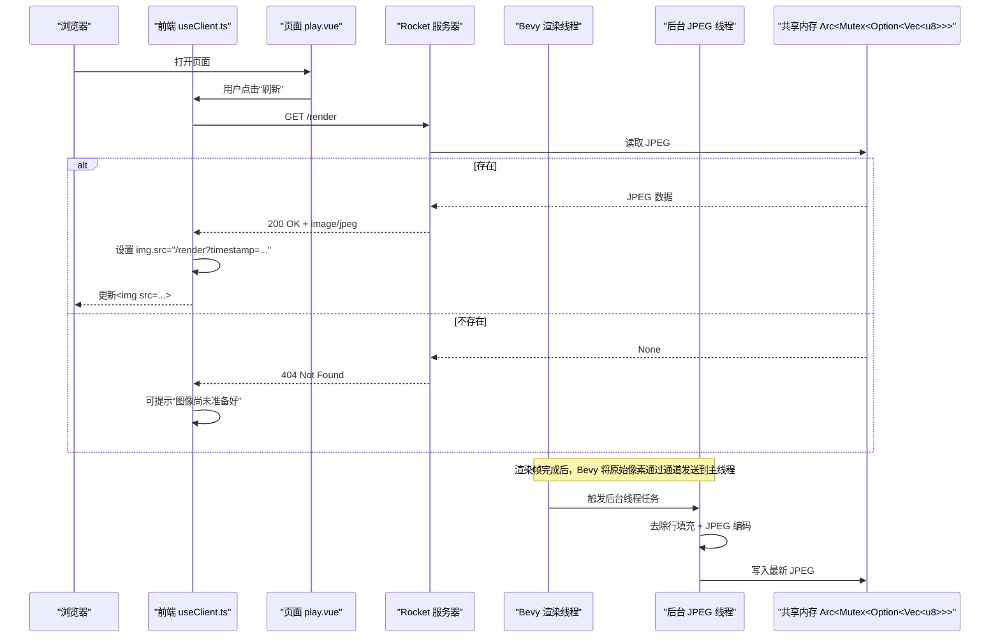
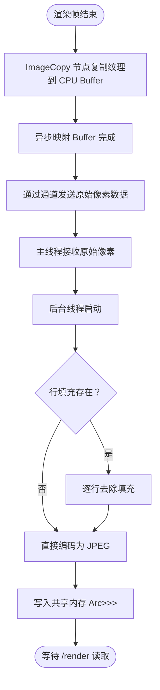
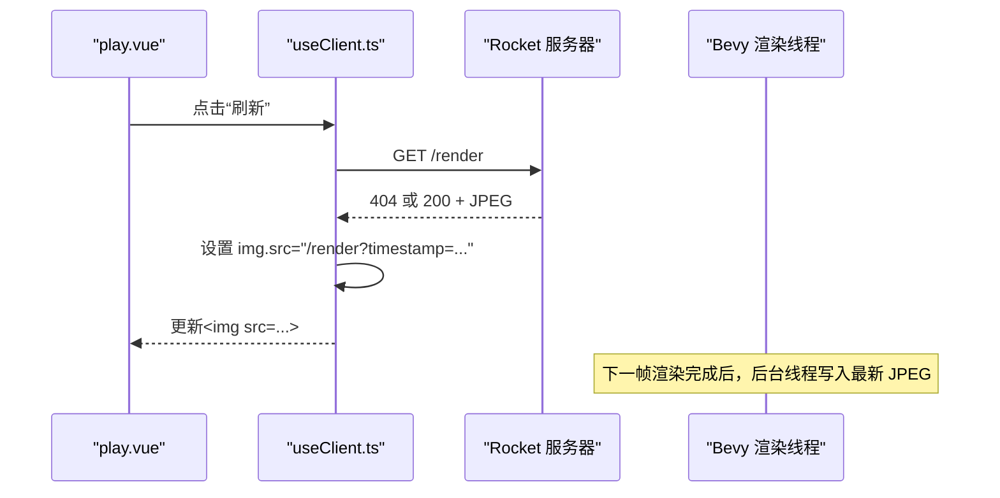

# /render 端点

<cite>
**本文引用的文件列表**
- [stream.rs](file://examples/stream.rs)
- [useClient.ts](file://apps/web/src/composables/useClient.ts)
- [play.vue](file://apps/web/src/pages/play.vue)
- [Cargo.toml](file://Cargo.toml)
</cite>

## 目录
1. [简介](#简介)
2. [项目结构](#项目结构)
3. [核心组件](#核心组件)
4. [架构总览](#架构总览)
5. [详细组件分析](#详细组件分析)
6. [依赖分析](#依赖分析)
7. [性能考虑](#性能考虑)
8. [故障排查指南](#故障排查指南)
9. [结论](#结论)
10. [附录](#附录)

## 简介
本文件面向 `/render` API 端点，提供完整的技术文档与使用说明。该端点通过 HTTP GET 方法提供当前游戏场景的渲染图像，响应为 JPEG 格式的二进制图像流，Content-Type 为 image/jpeg。当图像尚未生成时返回 404 Not Found。其内部机制包括：
- Bevy 渲染线程通过 ImageCopy 系统将 GPU 纹理复制到 CPU 可访问的 Buffer；
- 通过通道将原始像素数据发送到主线程；
- 后台线程去除行填充并编码为 JPEG，存入共享 Arc<Mutex<Option<Vec<u8>>>> 中；
- Rocket HTTP 服务器从共享内存取出 JPEG 并返回给客户端。

该端点具备流式传输特性，适合在 Web 界面中实时显示游戏画面。

## 项目结构
与 /render 端点直接相关的代码位于示例工程 examples/stream.rs，以及前端应用 apps/web 中的 useClient.ts 与 play.vue。Cargo.toml 指明了 Rocket、image 等关键依赖。

图表来源
- [stream.rs](file://examples/stream.rs#L301-L315)
- [stream.rs](file://examples/stream.rs#L422-L481)
- [useClient.ts](file://apps/web/src/composables/useClient.ts#L152-L155)
- [play.vue](file://apps/web/src/pages/play.vue#L126-L140)

章节来源
- [Cargo.toml](file://Cargo.toml#L55-L63)
- [stream.rs](file://examples/stream.rs#L301-L315)
- [useClient.ts](file://apps/web/src/composables/useClient.ts#L152-L155)
- [play.vue](file://apps/web/src/pages/play.vue#L126-L140)

## 核心组件
- Rocket 路由与控制器
  - /render 路由：从共享内存读取 JPEG，存在则返回 image/jpeg；不存在返回 404。
  - CORS 配置允许跨域访问。
- Bevy 渲染管线与 ImageCopy
  - 在渲染图中插入 ImageCopy 节点，将渲染目标纹理复制到 CPU Buffer；
  - 使用跨线程通道将原始像素数据发送至主线程；
  - 主线程调度后台线程进行去行填充与 JPEG 编码，写回共享内存。
- 前端集成
  - useClient.ts 提供 updateImg()，先请求 /render，再设置 img 的 src 为带时间戳的 /render；
  - play.vue 展示图像并提供刷新按钮。

章节来源
- [stream.rs](file://examples/stream.rs#L301-L315)
- [stream.rs](file://examples/stream.rs#L110-L132)
- [stream.rs](file://examples/stream.rs#L134-L253)
- [stream.rs](file://examples/stream.rs#L422-L481)
- [useClient.ts](file://apps/web/src/composables/useClient.ts#L152-L155)
- [play.vue](file://apps/web/src/pages/play.vue#L126-L140)

## 架构总览
下图展示 /render 端点的端到端调用链路与数据流。

图表来源
- [stream.rs](file://examples/stream.rs#L301-L315)
- [stream.rs](file://examples/stream.rs#L422-L481)
- [useClient.ts](file://apps/web/src/composables/useClient.ts#L152-L155)
- [play.vue](file://apps/web/src/pages/play.vue#L126-L140)

## 详细组件分析

### /render 路由与响应
- 请求路径：/render
- 方法：GET
- 成功响应：200 OK，Content-Type: image/jpeg，Body: JPEG 图像字节流
- 失败响应：404 Not Found（图像尚未生成）
- 实现要点：
  - 从共享内存 Arc<Mutex<Option<Vec<u8>>>> 中读取 JPEG；
  - 若为空则返回 404，否则返回 JPEG 二进制与正确的 Content-Type。

章节来源
- [stream.rs](file://examples/stream.rs#L301-L315)

### Bevy 渲染管线与 ImageCopy
- ImageCopy 渲染图节点
  - 将渲染目标纹理复制到 CPU Buffer；
  - 计算对齐后的每行字节数，确保拷贝布局正确；
  - 使用异步 map 与队列提交完成 GPU->CPU 的数据搬运。
- 主线程接收与分发
  - 从通道接收原始像素数据；
  - 调度后台线程进行去行填充与 JPEG 编码；
  - 将最终 JPEG 写入共享内存。
- 去行填充与 JPEG 编码
  - 根据像素格式计算每行字节数与对齐字节数；
  - 若存在行填充，按高度逐行切片并裁剪到无填充长度；
  - 使用图像库将 RGBA 原始数据转为 JPEG，质量参数为 80；
  - 写入共享内存供 /render 端点读取。

图表来源
- [stream.rs](file://examples/stream.rs#L134-L253)
- [stream.rs](file://examples/stream.rs#L422-L481)

章节来源
- [stream.rs](file://examples/stream.rs#L134-L253)
- [stream.rs](file://examples/stream.rs#L422-L481)

### 前端集成与实时显示
- useClient.ts
  - 先请求 /render 以触发一次渲染帧；
  - 再设置 img 的 src 为带时间戳的 /render，避免浏览器缓存导致不刷新。
- play.vue
  - 使用  展示游戏画面；
  - 提供“刷新”按钮，调用 useClient.updateImg()。

图表来源
- [useClient.ts](file://apps/web/src/composables/useClient.ts#L152-L155)
- [play.vue](file://apps/web/src/pages/play.vue#L126-L140)

章节来源
- [useClient.ts](file://apps/web/src/composables/useClient.ts#L152-L155)
- [play.vue](file://apps/web/src/pages/play.vue#L126-L140)

## 依赖分析
- Rocket 与 CORS
  - Rocket 提供路由定义与 HTTP 服务；
  - CORS 配置允许跨域请求，便于前端直连后端。
- 图像处理
  - image crate 提供 JPEG 编码能力；
  - zune-jpeg 作为底层 JPEG 编码实现之一。
- Bevy 渲染与资源
  - Bevy 的渲染设备、命令队列与纹理格式用于 GPU->CPU 拷贝；
  - RenderGraph 插入 ImageCopy 节点，控制渲染流程。

章节来源
- [Cargo.toml](file://Cargo.toml#L55-L63)
- [stream.rs](file://examples/stream.rs#L1-L33)

## 性能考虑
- 行填充去除
  - 由于 GPU 纹理对齐策略，CPU Buffer 每行可能存在填充字节；
  - 去除填充需按高度逐行切片裁剪，时间复杂度 O(H*W)。
- JPEG 编码
  - 使用高质量参数（80），编码成本较高；
  - 建议在必要时降低质量或分辨率以提升帧率。
- 流式传输
  - /render 返回二进制流，适合浏览器边接收边解码显示；
  - 前端通过带时间戳的 URL 避免缓存，保证实时性。
- 线程模型
  - GPU->CPU 拷贝与 JPEG 编码分离到后台线程，避免阻塞渲染主循环。

[本节为通用性能建议，不直接分析具体文件]

## 故障排查指南
- 404 Not Found
  - 可能原因：当前帧尚未生成图像或后台线程尚未完成编码；
  - 建议：稍后重试，或确认 /render 请求已触发渲染帧。
- 图像空白或黑屏
  - 可能原因：渲染目标尺寸或格式配置错误；
  - 建议：检查渲染目标纹理描述与像素格式，确保与 GPU 纹理一致。
- 编码失败
  - 可能原因：原始像素数据为空或格式不匹配；
  - 建议：检查 ImageCopy 是否成功复制，以及后台线程的去填充逻辑。
- CORS 问题
  - 可能原因：前端与后端跨域未正确配置；
  - 建议：确认 CORS 配置允许 GET/POST/OPTIONS 方法与任意来源。

章节来源
- [stream.rs](file://examples/stream.rs#L301-L315)
- [stream.rs](file://examples/stream.rs#L422-L481)
- [Cargo.toml](file://Cargo.toml#L55-L63)

## 结论
/render 端点通过 Bevy 渲染线程与 Rocket HTTP 服务器的协作，实现了从 GPU 纹理到 JPEG 图像的高效转换与流式传输。其设计兼顾实时性与可维护性：渲染线程负责数据搬运，主线程负责调度，后台线程负责编码，HTTP 层仅负责读取与返回。前端通过简单的一次请求与带时间戳的 URL 即可实现实时画面刷新。

[本节为总结性内容，不直接分析具体文件]

## 附录

### curl 示例
- 获取当前帧图像（首次可能返回 404，直到第一帧完成）：
  - curl -i http://localhost:8000/render
- 强制刷新并获取最新帧：
  - 先请求一次 /render，再请求一次 /render 并保存为文件：
    - curl -L http://localhost:8000/render > frame.jpg

[本节为使用示例，不直接分析具体文件]

### HTML 中直接使用 
- 在 HTML 页面中直接嵌入：
  - 
- 注意：
  - 为避免浏览器缓存导致画面不更新，建议每次刷新时附加时间戳参数；
  - 首次加载可能返回 404，需等待一帧后再尝试。

[本节为使用示例，不直接分析具体文件]