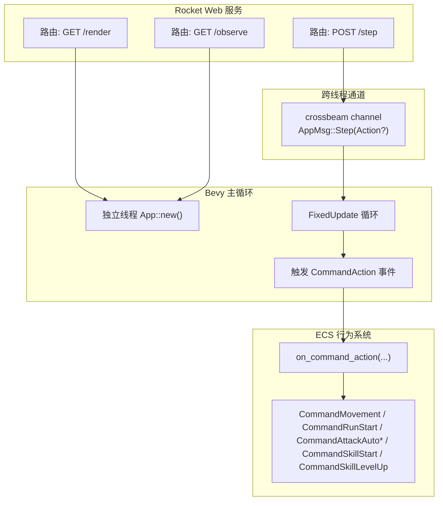
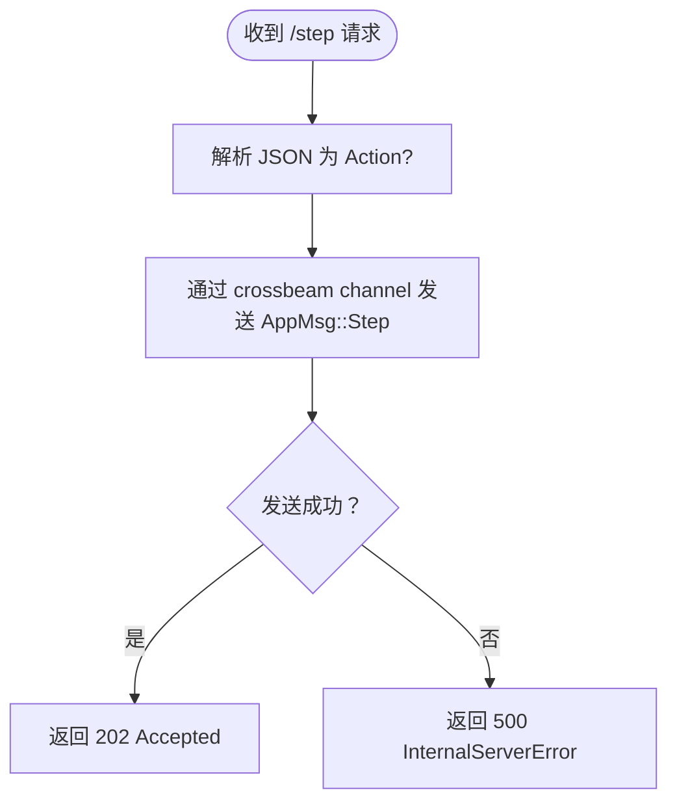
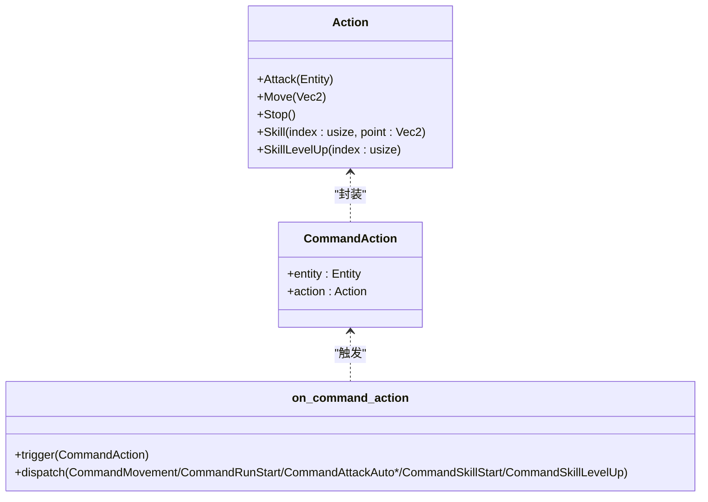
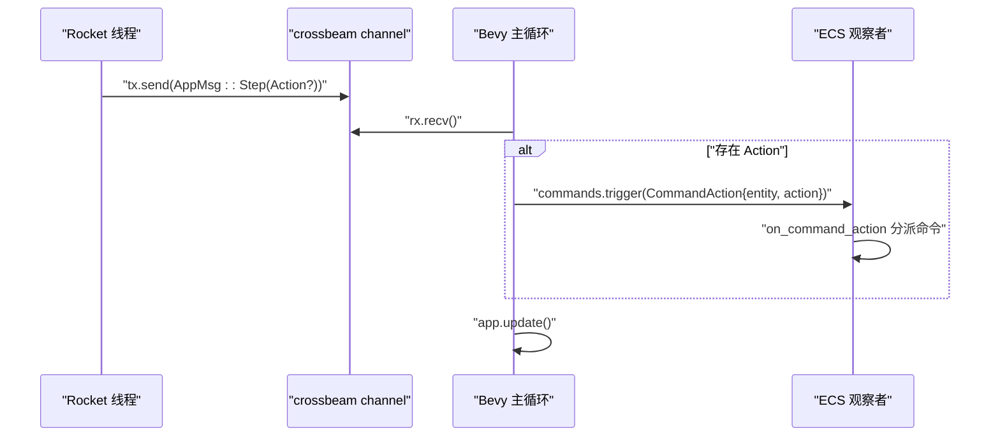
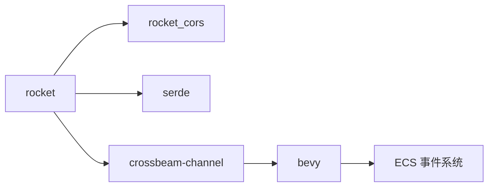

# /step 端点

<cite>
**本文引用的文件**
- [examples/stream.rs](file://examples/stream.rs)
- [src/core/action.rs](file://src/core/action.rs)
- [apps/web/src/composables/useClient.ts](file://apps/web/src/composables/useClient.ts)
- [Cargo.toml](file://Cargo.toml)
- [src/server/gym.rs](file://src/server/gym.rs)
</cite>

## 目录
1. [简介](#简介)
2. [项目结构](#项目结构)
3. [核心组件](#核心组件)
4. [架构总览](#架构总览)
5. [详细组件分析](#详细组件分析)
6. [依赖关系分析](#依赖关系分析)
7. [性能考量](#性能考量)
8. [故障排查指南](#故障排查指南)
9. [结论](#结论)
10. [附录](#附录)

## 简介
本文件面向外部控制器（如AI训练环境或Web前端）与游戏模拟器之间的交互，系统性地说明 /step API 端点的设计与使用方式。该端点通过 HTTP POST 方法接收一个可选的 Action 对象，用于驱动游戏逻辑的单步执行；当请求体为空时，表示“不下发动作”，仅推进模拟器一帧。端点将动作消息经由 crossbeam channel 传入 Bevy 主循环，触发 CommandAction 事件，从而驱动角色执行移动、攻击、技能释放等行为。响应状态码包括 202 Accepted（成功入队）与 500 InternalServerError（发送失败）。同时，文档提供 curl 与 JavaScript fetch 的调用示例，并阐述该端点在 AI 训练环境中的定位与作用。

## 项目结构
- /step 端点位于 Rocket Web 服务中，路由挂载在根路径下，配合 /render 与 /observe 提供图像与观测数据接口，形成完整的训练/演示环境。
- Bevy 主循环在独立线程中运行，通过 crossbeam channel 接收来自 HTTP 服务的动作消息，随后在固定更新周期内触发 ECS 事件，驱动游戏逻辑。



图表来源
- [examples/stream.rs](file://examples/stream.rs#L286-L300)
- [examples/stream.rs](file://examples/stream.rs#L330-L420)
- [src/core/action.rs](file://src/core/action.rs#L43-L96)

章节来源
- [examples/stream.rs](file://examples/stream.rs#L286-L300)
- [examples/stream.rs](file://examples/stream.rs#L330-L420)

## 核心组件
- /step HTTP 端点：接收 JSON 请求体，解析为 Action 枚举（可为空），通过 crossbeam channel 发送 AppMsg::Step 到 Bevy 主循环，返回 202 或 500。
- Action 枚举：定义了游戏中可执行的动作集合，包括 Attack、Move、Stop、Skill、SkillLevelUp。
- CommandAction 事件：承载实体与动作，由 on_command_action 观察者转换为具体 ECS 命令，驱动角色行为。
- Bevy 主循环：在独立线程中运行，接收 AppMsg 并在每帧 update 中处理，确保动作与渲染同步推进。
- CORS 配置：允许跨域访问，便于前端或外部控制器直接调用。

章节来源
- [src/core/action.rs](file://src/core/action.rs#L43-L96)
- [examples/stream.rs](file://examples/stream.rs#L286-L300)
- [examples/stream.rs](file://examples/stream.rs#L330-L420)

## 架构总览
下图展示了 /step 端点从请求到游戏逻辑执行的关键流程，以及与 Bevy 主循环、ECS 事件系统的交互。

```mermaid
sequenceDiagram
participant Client as "外部控制器/前端"
participant HTTP as "Rocket 路由"
participant Chan as "crossbeam channel"
participant Loop as "Bevy 主循环"
participant ECS as "ECS 观察者 on_command_action"
participant Game as "游戏逻辑"
Client->>HTTP : "POST /step {Action?}"
HTTP->>Chan : "AppMsg : : Step(Action?)"
alt "发送成功"
HTTP-->>Client : "202 Accepted"
else "发送失败"
HTTP-->>Client : "500 InternalServerError"
end
Loop->>Chan : "rx.recv()"
Loop->>Loop : "app.update()"
Loop->>ECS : "world.commands().trigger(CommandAction)"
ECS->>Game : "分派为具体命令移动/攻击/技能等"
```

图表来源
- [examples/stream.rs](file://examples/stream.rs#L286-L300)
- [examples/stream.rs](file://examples/stream.rs#L378-L402)
- [src/core/action.rs](file://src/core/action.rs#L43-L96)

## 详细组件分析

### /step 端点定义与行为
- 请求路径：/step
- 方法：POST
- Content-Type：application/json
- 请求体：JSON 格式的 Action 枚举（可选）
  - 若省略请求体或请求体为空，则视为“不下发动作”，仅推进一帧
  - 否则，解析为 Action 枚举并下发至 Bevy 主循环
- 响应：
  - 202 Accepted：动作已成功入队
  - 500 InternalServerError：发送失败（通道阻塞或关闭）



图表来源
- [examples/stream.rs](file://examples/stream.rs#L286-L300)

章节来源
- [examples/stream.rs](file://examples/stream.rs#L286-L300)

### Action 枚举与 CommandAction 事件
- Action 定义：包含 Attack、Move、Stop、Skill、SkillLevelUp 等变体，用于描述玩家意图
- CommandAction：携带实体与 Action，作为 ECS 事件源
- on_command_action：根据 Action 变体触发相应 ECS 命令，如 CommandMovement、CommandRunStart、CommandAttackAuto*、CommandSkillStart、CommandSkillLevelUp



图表来源
- [src/core/action.rs](file://src/core/action.rs#L43-L96)

章节来源
- [src/core/action.rs](file://src/core/action.rs#L43-L96)

### Bevy 主循环与事件触发
- Rocket 在独立线程中启动 Bevy App，使用 crossbeam channel 接收 AppMsg
- 收到 AppMsg::Step(Action?) 后，若存在 Action，则查询场景中 Controller 组件对应的实体，触发 CommandAction 事件
- 每次循环调用 app.update()，保证渲染与逻辑同步推进



图表来源
- [examples/stream.rs](file://examples/stream.rs#L330-L420)
- [examples/stream.rs](file://examples/stream.rs#L378-L402)

章节来源
- [examples/stream.rs](file://examples/stream.rs#L330-L420)
- [examples/stream.rs](file://examples/stream.rs#L378-L402)

### CORS 与路由挂载
- CORS 允许所有来源与方法（GET、POST、OPTIONS），并允许所有请求头
- 路由挂载：/step、/render、/observe

章节来源
- [examples/stream.rs](file://examples/stream.rs#L405-L420)

## 依赖关系分析
- Rocket 与 rocket_cors：提供 HTTP 服务与跨域支持
- crossbeam-channel：提供高性能无锁通道，用于 Rocket 线程与 Bevy 主循环之间的消息传递
- Bevy：游戏引擎，负责渲染与 ECS 事件系统
- serde：序列化/反序列化 Action 枚举
- tokio：异步运行时（在工作区依赖中可见）



图表来源
- [Cargo.toml](file://Cargo.toml#L12-L63)

章节来源
- [Cargo.toml](file://Cargo.toml#L12-L63)

## 性能考量
- 通道容量：当前示例使用有界通道，建议根据外部控制器吞吐量与帧率调整容量，避免阻塞
- 固定更新周期：Bevy 使用手动时间步长策略，确保每帧推进稳定
- 渲染与观测：/render 与 /observe 与 /step 并行提供，注意图像编码与观测数据的生成开销
- 错误处理：发送失败返回 500，外部控制器应具备重试与降级策略

[本节为通用性能建议，不直接分析具体文件]

## 故障排查指南
- 500 InternalServerError
  - 可能原因：crossbeam 通道阻塞或关闭；Bevy 主循环未启动或崩溃
  - 排查步骤：确认 Rocket 与 Bevy 线程均正常运行；检查通道容量与消费速度
- 202 Accepted 但无动作生效
  - 可能原因：请求体为空或 Action 解析失败；控制器未正确设置实体
  - 排查步骤：确认请求体为合法 JSON；检查场景中是否存在 Controller 组件对应的实体
- CORS 问题
  - 可能原因：浏览器跨域限制
  - 排查步骤：确认 CORS 配置允许来源与方法

章节来源
- [examples/stream.rs](file://examples/stream.rs#L286-L300)
- [examples/stream.rs](file://examples/stream.rs#L405-L420)

## 结论
/step 端点为外部控制器提供了与 Bevy 游戏模拟器交互的统一入口。通过 crossbeam channel 将动作消息安全地传递至主循环，并以 ECS 事件形式解耦为具体行为，既满足实时性要求，又保持了良好的扩展性。结合 /render 与 /observe，该端点构成了完整的 AI 训练与演示环境基础。

[本节为总结性内容，不直接分析具体文件]

## 附录

### API 定义
- 路径：/step
- 方法：POST
- 请求头：
  - Content-Type: application/json
- 请求体：
  - JSON 格式的 Action 枚举（可选）
  - 可省略或为空，表示“不下发动作”
- 响应：
  - 202 Accepted：动作已成功入队
  - 500 InternalServerError：发送失败

章节来源
- [examples/stream.rs](file://examples/stream.rs#L286-L300)

### curl 示例
- 不下发动作（仅推进一帧）
  - curl -X POST http://localhost:8000/step
- 下发动作（示例：移动到坐标 [x,y]）
  - curl -X POST http://localhost:8000/step -H "Content-Type: application/json" -d '{"Move":[x,y]}'
- 下发动作（示例：对实体 entity 进行普通攻击）
  - curl -X POST http://localhost:8000/step -H "Content-Type: application/json" -d '{"Attack":entity}'

章节来源
- [examples/stream.rs](file://examples/stream.rs#L286-L300)

### JavaScript fetch 示例
- 不下发动作（仅推进一帧）
  - fetch('http://localhost:8000/step', { method: 'POST' })
- 下发动作（示例：移动到坐标 [x,y]）
  - fetch('http://localhost:8000/step', { method: 'POST', headers: { 'Content-Type': 'application/json' }, body: JSON.stringify({ Move: [x, y] }) })
- 下发动作（示例：对实体 entity 进行普通攻击）
  - fetch('http://localhost:8000/step', { method: 'POST', headers: { 'Content-Type': 'application/json' }, body: JSON.stringify({ Attack: entity }) })

章节来源
- [apps/web/src/composables/useClient.ts](file://apps/web/src/composables/useClient.ts#L152-L184)

### 在 AI 训练环境中的作用
- 作为外部控制器与游戏模拟器的交互入口，提供确定性的单步驱动能力
- 与 /observe 和 /render 配合，支持观测-决策-执行的闭环训练流程
- 通过 Action 枚举抽象，便于在不同控制器（人类玩家、AI模型、脚本）之间复用

章节来源
- [src/core/action.rs](file://src/core/action.rs#L43-L96)
- [src/server/gym.rs](file://src/server/gym.rs#L1-L14)