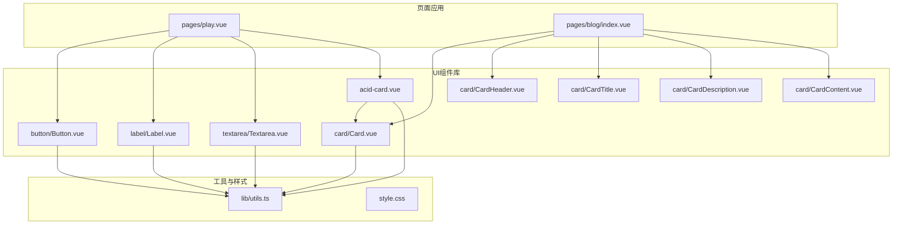
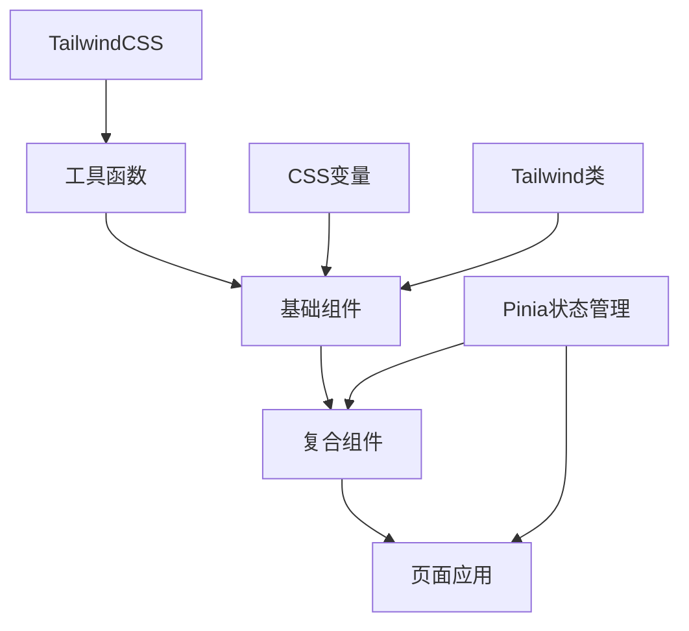
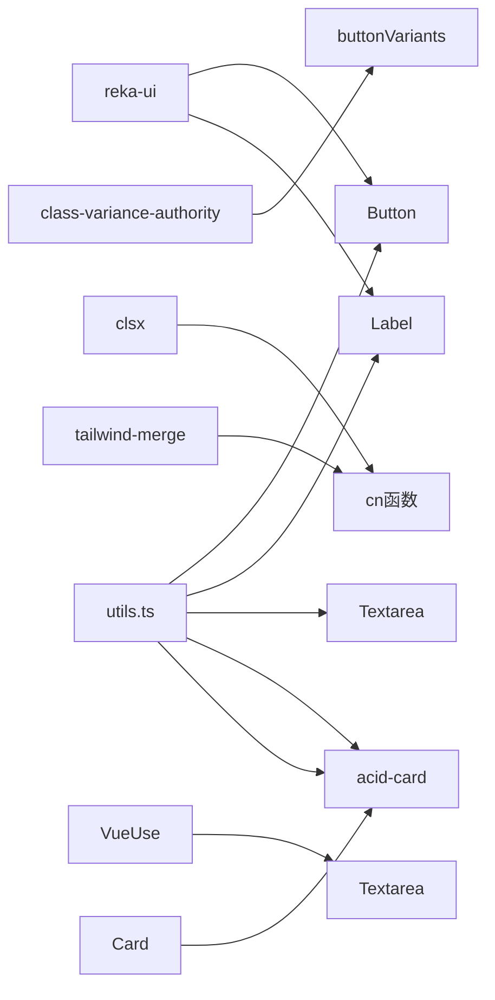

# UI组件库

<cite>
**本文档中引用的文件**  
- [Button.vue](file://apps/web/src/components/ui/button/Button.vue)
- [button/index.ts](file://apps/web/src/components/ui/button/index.ts)
- [Card.vue](file://apps/web/src/components/ui/card/Card.vue)
- [CardHeader.vue](file://apps/web/src/components/ui/card/CardHeader.vue)
- [CardTitle.vue](file://apps/web/src/components/ui/card/CardTitle.vue)
- [CardDescription.vue](file://apps/web/src/components/ui/card/CardDescription.vue)
- [CardContent.vue](file://apps/web/src/components/ui/card/CardContent.vue)
- [card/index.ts](file://apps/web/src/components/ui/card/index.ts)
- [Label.vue](file://apps/web/src/components/ui/label/Label.vue)
- [label/index.ts](file://apps/web/src/components/ui/label/index.ts)
- [Textarea.vue](file://apps/web/src/components/ui/textarea/Textarea.vue)
- [textarea/index.ts](file://apps/web/src/components/ui/textarea/index.ts)
- [acid-card.vue](file://apps/web/src/components/ui/acid-card.vue)
- [play.vue](file://apps/web/src/pages/play.vue)
- [blog/index.vue](file://apps/web/src/pages/blog/index.vue)
- [utils.ts](file://apps/web/src/lib/utils.ts)
- [style.css](file://apps/web/src/style.css)
- [useClient.ts](file://apps/web/src/composables/useClient.ts)
</cite>

## 目录
1. [简介](#简介)
2. [项目结构](#项目结构)
3. [核心组件](#核心组件)
4. [架构概览](#架构概览)
5. [详细组件分析](#详细组件分析)
6. [依赖分析](#依赖分析)
7. [性能考虑](#性能考虑)
8. [故障排除指南](#故障排除指南)
9. [结论](#结论)

## 简介
本文档详细说明了基于Vue3实现的UI组件库，重点介绍Button、Card、Label、Textarea等基础UI组件以及项目特有的acid-card.vue组件。文档涵盖每个组件的视觉表现、交互行为、使用场景、属性（props）、事件（emitted events）、插槽（slots）和公开方法（public methods）。同时提供使用示例、样式定制方法以及与Pinia状态管理的集成方式。

## 项目结构
UI组件库位于`apps/web/src/components/ui/`目录下，采用模块化组织结构。每个组件都有独立的目录，包含主组件文件和相关的子组件或工具文件。组件通过index.ts文件导出，便于统一导入使用。



**Diagram sources**
- [Button.vue](file://apps/web/src/components/ui/button/Button.vue)
- [Card.vue](file://apps/web/src/components/ui/card/Card.vue)
- [Label.vue](file://apps/web/src/components/ui/label/Label.vue)
- [Textarea.vue](file://apps/web/src/components/ui/textarea/Textarea.vue)
- [acid-card.vue](file://apps/web/src/components/ui/acid-card.vue)
- [play.vue](file://apps/web/src/pages/play.vue)
- [blog/index.vue](file://apps/web/src/pages/blog/index.vue)

**Section sources**
- [Button.vue](file://apps/web/src/components/ui/button/Button.vue)
- [Card.vue](file://apps/web/src/components/ui/card/Card.vue)
- [Label.vue](file://apps/web/src/components/ui/label/Label.vue)
- [Textarea.vue](file://apps/web/src/components/ui/textarea/Textarea.vue)
- [acid-card.vue](file://apps/web/src/components/ui/acid-card.vue)

## 核心组件
本UI组件库提供了多个可复用的基础组件，包括Button、Card、Label、Textarea等，以及一个具有项目特色的acid-card组件。这些组件都遵循一致的设计语言和交互模式，支持TailwindCSS类的覆盖和CSS变量的定制。

**Section sources**
- [Button.vue](file://apps/web/src/components/ui/button/Button.vue)
- [Card.vue](file://apps/web/src/components/ui/card/Card.vue)
- [Label.vue](file://apps/web/src/components/ui/label/Label.vue)
- [Textarea.vue](file://apps/web/src/components/ui/textarea/Textarea.vue)
- [acid-card.vue](file://apps/web/src/components/ui/acid-card.vue)

## 架构概览
UI组件库采用分层架构设计，底层是TailwindCSS样式系统和工具函数，中层是基础UI组件，上层是复合组件和页面应用。组件间通过props传递数据，通过emitted events进行通信，并利用Pinia进行全局状态管理。



**Diagram sources**
- [style.css](file://apps/web/src/style.css)
- [utils.ts](file://apps/web/src/lib/utils.ts)
- [button/index.ts](file://apps/web/src/components/ui/button/index.ts)
- [card/index.ts](file://apps/web/src/components/ui/card/index.ts)

## 详细组件分析

### Button组件分析
Button组件是一个可高度定制的按钮元素，支持多种变体和尺寸。它使用class-variance-authority库来管理不同的样式变体。

#### 属性（Props）
- `variant`: 按钮变体，可选值包括default、destructive、outline、secondary、ghost、acid
- `size`: 按钮尺寸，可选值包括default、sm、lg、icon、icon-sm、icon-lg
- `class`: 自定义CSS类，用于进一步样式定制

#### 事件（Emitted Events）
- 无自定义事件，继承原生按钮事件

#### 插槽（Slots）
- 默认插槽：按钮内容

#### 公开方法（Public Methods）
- 无公开方法

#### 使用示例
```vue
<Button variant="acid" size="lg">酸性按钮</Button>
<Button variant="outline" size="sm">轮廓按钮</Button>
```

**Section sources**
- [Button.vue](file://apps/web/src/components/ui/button/Button.vue)
- [button/index.ts](file://apps/web/src/components/ui/button/index.ts)

### Card组件分析
Card组件是一个容器组件，用于展示相关内容块。它由多个子组件组成，包括CardHeader、CardTitle、CardDescription和CardContent。

#### 属性（Props）
- `class`: 自定义CSS类，用于进一步样式定制

#### 事件（Emitted Events）
- 无自定义事件

#### 插槽（Slots）
- 默认插槽：卡片内容

#### 子组件
- `CardHeader`: 卡片头部容器
- `CardTitle`: 卡片标题
- `CardDescription`: 卡片描述
- `CardContent`: 卡片内容区域

#### 使用示例
```vue
<Card>
  <CardHeader>
    <CardTitle>卡片标题</CardTitle>
    <CardDescription>卡片描述</CardDescription>
  </CardHeader>
  <CardContent>卡片内容</CardContent>
</Card>
```

**Section sources**
- [Card.vue](file://apps/web/src/components/ui/card/Card.vue)
- [CardHeader.vue](file://apps/web/src/components/ui/card/CardHeader.vue)
- [CardTitle.vue](file://apps/web/src/components/ui/card/CardTitle.vue)
- [CardDescription.vue](file://apps/web/src/components/ui/card/CardDescription.vue)
- [CardContent.vue](file://apps/web/src/components/ui/card/CardContent.vue)
- [card/index.ts](file://apps/web/src/components/ui/card/index.ts)

### Label组件分析
Label组件用于关联表单控件和其标签文本，提供更好的可访问性。

#### 属性（Props）
- `class`: 自定义CSS类，用于进一步样式定制

#### 事件（Emitted Events）
- 无自定义事件

#### 插槽（Slots）
- 默认插槽：标签文本

#### 使用示例
```vue
<Label for="input">输入标签</Label>
<input id="input" type="text" />
```

**Section sources**
- [Label.vue](file://apps/web/src/components/ui/label/Label.vue)
- [label/index.ts](file://apps/web/src/components/ui/label/index.ts)

### Textarea组件分析
Textarea组件是一个可双向绑定的文本区域组件，支持v-model语法。

#### 属性（Props）
- `class`: 自定义CSS类，用于进一步样式定制
- `defaultValue`: 默认值
- `modelValue`: 绑定值

#### 事件（Emitted Events）
- `update:modelValue`: 当模型值更新时触发

#### 插槽（Slots）
- 无插槽

#### 公开方法（Public Methods）
- 无公开方法

#### 使用示例
```vue
<Textarea v-model="text" placeholder="请输入内容" />
```

**Section sources**
- [Textarea.vue](file://apps/web/src/components/ui/textarea/Textarea.vue)
- [textarea/index.ts](file://apps/web/src/components/ui/textarea/index.ts)

### acid-card组件分析
acid-card是项目特有的卡片组件，具有独特的酸性主题样式，用于突出显示重要内容。

#### 属性（Props）
- `class`: 自定义CSS类，用于进一步样式定制

#### 事件（Emitted Events）
- 无自定义事件

#### 插槽（Slots）
- 默认插槽：卡片内容

#### 样式特性
- 背景色：acid-black
- 边框色：acid-lime/50
- 文本色：acid-lime
- 背景模糊效果：backdrop-blur-md
- 阴影效果：0_0_15px_rgba(204,255,0,0.1)
- 悬停效果：阴影增强至0_0_25px_rgba(204,255,0,0.2)

#### 使用示例
```vue
<acid-card>酸性主题卡片内容</acid-card>
```

**Section sources**
- [acid-card.vue](file://apps/web/src/components/ui/acid-card.vue)

## 依赖分析
UI组件库依赖于多个外部库和内部工具函数，形成了清晰的依赖关系网络。



**Diagram sources**
- [Button.vue](file://apps/web/src/components/ui/button/Button.vue)
- [Label.vue](file://apps/web/src/components/ui/label/Label.vue)
- [Textarea.vue](file://apps/web/src/components/ui/textarea/Textarea.vue)
- [Card.vue](file://apps/web/src/components/ui/card/Card.vue)
- [acid-card.vue](file://apps/web/src/components/ui/acid-card.vue)
- [utils.ts](file://apps/web/src/lib/utils.ts)
- [button/index.ts](file://apps/web/src/components/ui/button/index.ts)

**Section sources**
- [Button.vue](file://apps/web/src/components/ui/button/Button.vue)
- [Label.vue](file://apps/web/src/components/ui/label/Label.vue)
- [Textarea.vue](file://apps/web/src/components/ui/textarea/Textarea.vue)
- [Card.vue](file://apps/web/src/components/ui/card/Card.vue)
- [acid-card.vue](file://apps/web/src/components/ui/acid-card.vue)
- [utils.ts](file://apps/web/src/lib/utils.ts)

## 性能考虑
UI组件库在设计时考虑了性能优化，主要体现在以下几个方面：
- 使用`cn`工具函数合并CSS类，避免样式冲突
- 采用函数式组件设计，减少不必要的渲染
- 利用Vue3的Composition API优化响应式系统
- 通过合理的样式继承减少CSS重复
- 使用CSS变量实现主题切换，避免样式文件重复

## 故障排除指南
当使用UI组件库遇到问题时，可以参考以下常见问题的解决方案：

### 样式不生效
检查是否正确引入了TailwindCSS和自定义样式文件，确保`style.css`被正确加载。

### 组件无法导入
确认组件路径是否正确，检查`index.ts`文件中的导出声明。

### v-model绑定失效
对于Textarea组件，确保使用了正确的v-model语法，并检查`useVModel`是否正确工作。

### 主题切换异常
检查`dark`类是否正确应用到根元素，确认CSS变量是否正确设置。

**Section sources**
- [style.css](file://apps/web/src/style.css)
- [utils.ts](file://apps/web/src/lib/utils.ts)
- [Textarea.vue](file://apps/web/src/components/ui/textarea/Textarea.vue)

## 结论
本UI组件库提供了一套完整、可复用的Vue3组件，具有良好的可定制性和扩展性。通过合理的架构设计和样式管理，组件库能够满足项目多样化的UI需求。acid-card等特色组件的加入，为项目提供了独特的视觉识别。与Pinia状态管理的集成，使得组件能够方便地响应全局状态变化，提高了开发效率。