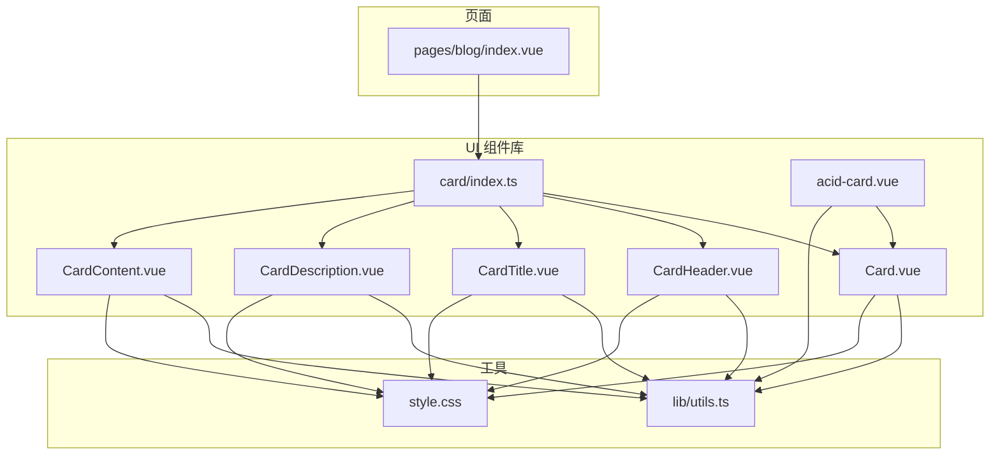
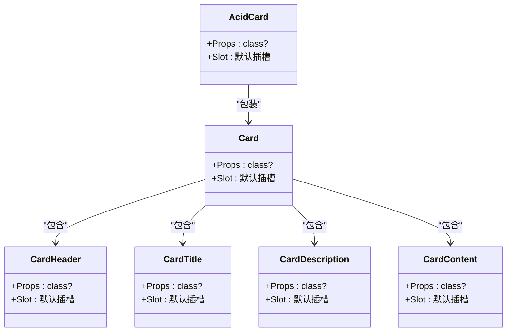
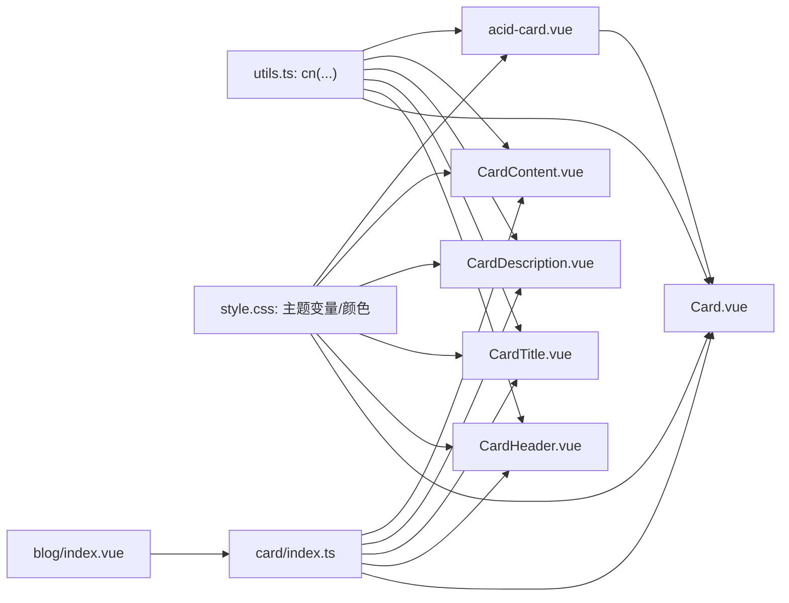
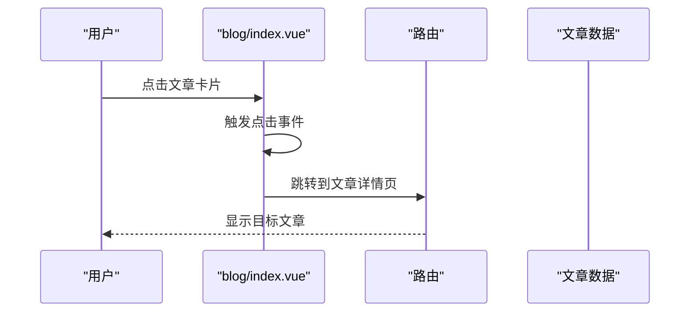

# 卡片组件 (Card)

<cite>
**本文引用的文件**
- [apps/web/src/components/ui/card/Card.vue](file://apps/web/src/components/ui/card/Card.vue)
- [apps/web/src/components/ui/card/CardHeader.vue](file://apps/web/src/components/ui/card/CardHeader.vue)
- [apps/web/src/components/ui/card/CardTitle.vue](file://apps/web/src/components/ui/card/CardTitle.vue)
- [apps/web/src/components/ui/card/CardDescription.vue](file://apps/web/src/components/ui/card/CardDescription.vue)
- [apps/web/src/components/ui/card/CardContent.vue](file://apps/web/src/components/ui/card/CardContent.vue)
- [apps/web/src/components/ui/card/index.ts](file://apps/web/src/components/ui/card/index.ts)
- [apps/web/src/components/ui/acid-card.vue](file://apps/web/src/components/ui/acid-card.vue)
- [apps/web/src/lib/utils.ts](file://apps/web/src/lib/utils.ts)
- [apps/web/src/style.css](file://apps/web/src/style.css)
- [apps/web/src/pages/blog/index.vue](file://apps/web/src/pages/blog/index.vue)
</cite>

## 目录
1. [简介](#简介)
2. [项目结构](#项目结构)
3. [核心组件](#核心组件)
4. [架构总览](#架构总览)
5. [组件详解](#组件详解)
6. [依赖关系分析](#依赖关系分析)
7. [性能与可维护性](#性能与可维护性)
8. [使用示例与最佳实践](#使用示例与最佳实践)
9. [故障排查](#故障排查)
10. [结论](#结论)

## 简介
本文件面向前端开发者与设计人员，系统化说明 Moon-Lol 项目中基于 Vue 3 的卡片组件体系（Card 及其子组件：CardHeader、CardTitle、CardDescription、CardContent）。文档覆盖：
- 组合式架构与职责划分
- Props、插槽与事件机制
- 在页面中的语义化 HTML 结构
- TailwindCSS 响应式布局与主题定制
- 在 blog/index.vue 中用于文章列表渲染的结构化用法

## 项目结构
卡片组件位于应用层 UI 组件库目录下，采用按功能模块化的组织方式，便于复用与扩展。index.ts 提供统一导出入口，便于在业务页面中按需引入。

图表来源
- [apps/web/src/components/ui/card/index.ts](file://apps/web/src/components/ui/card/index.ts#L1-L5)
- [apps/web/src/components/ui/card/Card.vue](file://apps/web/src/components/ui/card/Card.vue#L1-L18)
- [apps/web/src/components/ui/card/CardHeader.vue](file://apps/web/src/components/ui/card/CardHeader.vue#L1-L16)
- [apps/web/src/components/ui/card/CardTitle.vue](file://apps/web/src/components/ui/card/CardTitle.vue#L1-L16)
- [apps/web/src/components/ui/card/CardDescription.vue](file://apps/web/src/components/ui/card/CardDescription.vue#L1-L16)
- [apps/web/src/components/ui/card/CardContent.vue](file://apps/web/src/components/ui/card/CardContent.vue#L1-L16)
- [apps/web/src/components/ui/acid-card.vue](file://apps/web/src/components/ui/acid-card.vue#L1-L25)
- [apps/web/src/pages/blog/index.vue](file://apps/web/src/pages/blog/index.vue#L1-L69)
- [apps/web/src/lib/utils.ts](file://apps/web/src/lib/utils.ts#L1-L9)
- [apps/web/src/style.css](file://apps/web/src/style.css#L1-L265)

章节来源
- [apps/web/src/components/ui/card/index.ts](file://apps/web/src/components/ui/card/index.ts#L1-L5)
- [apps/web/src/components/ui/card/Card.vue](file://apps/web/src/components/ui/card/Card.vue#L1-L18)
- [apps/web/src/components/ui/card/CardHeader.vue](file://apps/web/src/components/ui/card/CardHeader.vue#L1-L16)
- [apps/web/src/components/ui/card/CardTitle.vue](file://apps/web/src/components/ui/card/CardTitle.vue#L1-L16)
- [apps/web/src/components/ui/card/CardDescription.vue](file://apps/web/src/components/ui/card/CardDescription.vue#L1-L16)
- [apps/web/src/components/ui/card/CardContent.vue](file://apps/web/src/components/ui/card/CardContent.vue#L1-L16)
- [apps/web/src/components/ui/acid-card.vue](file://apps/web/src/components/ui/acid-card.vue#L1-L25)
- [apps/web/src/pages/blog/index.vue](file://apps/web/src/pages/blog/index.vue#L1-L69)
- [apps/web/src/lib/utils.ts](file://apps/web/src/lib/utils.ts#L1-L9)
- [apps/web/src/style.css](file://apps/web/src/style.css#L1-L265)

## 核心组件
- Card：卡片根容器，承载边框、背景、阴影等通用视觉属性，内部通过默认插槽容纳子组件。
- CardHeader：卡片头部区域，负责标题与副标题的排版与间距。
- CardTitle：卡片标题，语义化使用 h3 元素，内置字号与字重样式。
- CardDescription：卡片描述文本，内置细文字体与弱前景色。
- CardContent：卡片内容区，处理内边距与顶部留白，适配多段内容布局。
- acid-card：主题化卡片包装器，基于 Card 扩展酸性主题色与动效。

章节来源
- [apps/web/src/components/ui/card/Card.vue](file://apps/web/src/components/ui/card/Card.vue#L1-L18)
- [apps/web/src/components/ui/card/CardHeader.vue](file://apps/web/src/components/ui/card/CardHeader.vue#L1-L16)
- [apps/web/src/components/ui/card/CardTitle.vue](file://apps/web/src/components/ui/card/CardTitle.vue#L1-L16)
- [apps/web/src/components/ui/card/CardDescription.vue](file://apps/web/src/components/ui/card/CardDescription.vue#L1-L16)
- [apps/web/src/components/ui/card/CardContent.vue](file://apps/web/src/components/ui/card/CardContent.vue#L1-L16)
- [apps/web/src/components/ui/acid-card.vue](file://apps/web/src/components/ui/acid-card.vue#L1-L25)

## 架构总览
卡片组件采用“容器 + 区域”的组合式设计，父组件 Card 负责全局外观与布局基线，子组件各自专注特定区域的语义与样式。通过 cn 工具函数合并类名，确保 TailwindCSS 类与外部传入 class 的兼容与覆盖顺序。

图表来源
- [apps/web/src/components/ui/card/Card.vue](file://apps/web/src/components/ui/card/Card.vue#L1-L18)
- [apps/web/src/components/ui/card/CardHeader.vue](file://apps/web/src/components/ui/card/CardHeader.vue#L1-L16)
- [apps/web/src/components/ui/card/CardTitle.vue](file://apps/web/src/components/ui/card/CardTitle.vue#L1-L16)
- [apps/web/src/components/ui/card/CardDescription.vue](file://apps/web/src/components/ui/card/CardDescription.vue#L1-L16)
- [apps/web/src/components/ui/card/CardContent.vue](file://apps/web/src/components/ui/card/CardContent.vue#L1-L16)
- [apps/web/src/components/ui/acid-card.vue](file://apps/web/src/components/ui/acid-card.vue#L1-L25)

## 组件详解

### Card（卡片根容器）
- 职责：提供卡片的基础外观（边框、背景、阴影），作为子组件的承载容器。
- Props
  - class?: HTML 属性 class 的类型别名，允许外部传入额外类名进行样式覆盖。
- 插槽
  - 默认插槽：用于放置 CardHeader、CardTitle、CardDescription、CardContent 等子组件。
- 事件：无显式事件绑定。
- 语义化结构：根元素为 div，使用语义化类名组合实现卡片外观。
- TailwindCSS 关键点
  - 使用主题变量与语义类名组合，保证在浅色/深色模式下的表现一致。
  - 通过 cn 合并外部 class，避免样式冲突。
- 适用场景
  - 信息展示、卡片式布局、内容分组与视觉隔离。

章节来源
- [apps/web/src/components/ui/card/Card.vue](file://apps/web/src/components/ui/card/Card.vue#L1-L18)
- [apps/web/src/lib/utils.ts](file://apps/web/src/lib/utils.ts#L1-L9)
- [apps/web/src/style.css](file://apps/web/src/style.css#L1-L265)

### CardHeader（卡片头部）
- 职责：卡片头部区域的布局与间距控制，通常包含标题与副标题。
- Props
  - class?: 外部传入的类名，用于覆盖或补充样式。
- 插槽
  - 默认插槽：放置标题、标签、时间等头部信息。
- 事件：无显式事件绑定。
- 语义化结构：div 容器，内置列向布局与间距，适配多行信息排列。
- TailwindCSS 关键点
  - 使用 flex-col 与 space-y-1.5 控制垂直间距。
  - 内置内边距 p-6，确保内容与卡片边缘保持合适距离。

章节来源
- [apps/web/src/components/ui/card/CardHeader.vue](file://apps/web/src/components/ui/card/CardHeader.vue#L1-L16)
- [apps/web/src/lib/utils.ts](file://apps/web/src/lib/utils.ts#L1-L9)

### CardTitle（卡片标题）
- 职责：卡片标题的语义化呈现，使用 h3 元素，内置字号与字重样式。
- Props
  - class?: 外部传入的类名，用于覆盖或补充样式。
- 插槽
  - 默认插槽：标题文本。
- 事件：无显式事件绑定。
- 语义化结构：h3 元素，内置“text-2xl font-semibold leading-none tracking-tight”等类名。
- TailwindCSS 关键点
  - 字号与字重组合，保证标题层级清晰且具有视觉权重。

章节来源
- [apps/web/src/components/ui/card/CardTitle.vue](file://apps/web/src/components/ui/card/CardTitle.vue#L1-L16)
- [apps/web/src/lib/utils.ts](file://apps/web/src/lib/utils.ts#L1-L9)

### CardDescription（卡片描述）
- 职责：卡片描述文本的呈现，内置细字体与弱前景色。
- Props
  - class?: 外部传入的类名，用于覆盖或补充样式。
- 插槽
  - 默认插槽：描述文本。
- 事件：无显式事件绑定。
- 语义化结构：p 元素，内置“text-sm text-muted-foreground”等类名。
- TailwindCSS 关键点
  - 使用“text-muted-foreground”与较小字号，突出正文内容。

章节来源
- [apps/web/src/components/ui/card/CardDescription.vue](file://apps/web/src/components/ui/card/CardDescription.vue#L1-L16)
- [apps/web/src/lib/utils.ts](file://apps/web/src/lib/utils.ts#L1-L9)

### CardContent（卡片内容）
- 职责：卡片内容区的布局与内边距控制，适配多段内容。
- Props
  - class?: 外部传入的类名，用于覆盖或补充样式。
- 插槽
  - 默认插槽：正文内容、列表、图片等。
- 事件：无显式事件绑定。
- 语义化结构：div 容器，内置 p-6 与 pt-0，确保内容区与标题区的间距合理。
- TailwindCSS 关键点
  - pt-0 避免标题下方重复留白，pt-0 与 p-6 的组合提升内容密度。

章节来源
- [apps/web/src/components/ui/card/CardContent.vue](file://apps/web/src/components/ui/card/CardContent.vue#L1-L16)
- [apps/web/src/lib/utils.ts](file://apps/web/src/lib/utils.ts#L1-L9)

### acid-card（主题化卡片包装器）
- 职责：在 Card 基础上叠加酸性主题色、阴影与过渡动画，形成独特的视觉风格。
- Props
  - class?: 外部传入的类名，用于进一步定制样式。
- 插槽
  - 默认插槽：传递给内部 Card。
- 事件：无显式事件绑定。
- 语义化结构：通过 cn 合并主题类名，实现背景、边框、阴影与动效的一致性。
- TailwindCSS 关键点
  - 使用自定义颜色变量与阴影效果，配合过渡动画增强交互体验。
  - 通过 backdrop-blur 实现磨砂玻璃效果。

章节来源
- [apps/web/src/components/ui/acid-card.vue](file://apps/web/src/components/ui/acid-card.vue#L1-L25)
- [apps/web/src/lib/utils.ts](file://apps/web/src/lib/utils.ts#L1-L9)
- [apps/web/src/style.css](file://apps/web/src/style.css#L1-L265)

## 依赖关系分析
- 组件间耦合
  - 子组件均依赖 Card 作为容器，形成“容器-区域”低耦合高内聚的关系。
  - acid-card 仅依赖 Card，不直接修改子组件行为，便于主题化扩展。
- 外部依赖
  - cn 工具函数来自 utils.ts，负责类名合并与冲突解决。
  - TailwindCSS 主题变量与自定义颜色在 style.css 中定义，保障跨组件一致性。
- 导出与导入
  - card/index.ts 统一导出各子组件，简化业务侧引入路径。

图表来源
- [apps/web/src/lib/utils.ts](file://apps/web/src/lib/utils.ts#L1-L9)
- [apps/web/src/style.css](file://apps/web/src/style.css#L1-L265)
- [apps/web/src/components/ui/card/index.ts](file://apps/web/src/components/ui/card/index.ts#L1-L5)
- [apps/web/src/pages/blog/index.vue](file://apps/web/src/pages/blog/index.vue#L1-L69)
- [apps/web/src/components/ui/acid-card.vue](file://apps/web/src/components/ui/acid-card.vue#L1-L25)

章节来源
- [apps/web/src/lib/utils.ts](file://apps/web/src/lib/utils.ts#L1-L9)
- [apps/web/src/style.css](file://apps/web/src/style.css#L1-L265)
- [apps/web/src/components/ui/card/index.ts](file://apps/web/src/components/ui/card/index.ts#L1-L5)
- [apps/web/src/pages/blog/index.vue](file://apps/web/src/pages/blog/index.vue#L1-L69)
- [apps/web/src/components/ui/acid-card.vue](file://apps/web/src/components/ui/acid-card.vue#L1-L25)

## 性能与可维护性
- 性能特性
  - 组件均为轻量级无状态容器，渲染开销极低。
  - 通过 cn 合并类名，避免重复计算与不必要的 DOM 变更。
- 可维护性
  - 统一的 Props 接口（class?）与默认插槽约定，降低使用成本。
  - 主题变量集中管理，便于统一升级与替换。
  - 子组件职责单一，易于测试与扩展。

[本节为通用指导，无需具体文件分析]

## 使用示例与最佳实践

### 在 blog/index.vue 中的文章列表渲染结构
当前 blog/index.vue 未直接使用 Card 组件，而是采用原生 div + TailwindCSS 实现文章卡片。若希望迁移到 Card 组件体系，可参考以下思路：
- 将每篇文章外层容器替换为 Card 或 acid-card，内部使用 CardHeader、CardTitle、CardDescription、CardContent 进行结构化组织。
- 通过 v-for 渲染文章列表，每条记录对应一个卡片实例。
- 使用点击事件跳转至文章详情页。

图表来源
- [apps/web/src/pages/blog/index.vue](file://apps/web/src/pages/blog/index.vue#L1-L69)

章节来源
- [apps/web/src/pages/blog/index.vue](file://apps/web/src/pages/blog/index.vue#L1-L69)

### TailwindCSS 响应式布局与主题定制
- 响应式布局
  - 使用 md:flex-row、md:items-start、md:justify-between 等断点类名，实现移动端纵向堆叠、桌面端横向对齐。
  - 使用 gap、p、pt、pb 等间距类名，保证不同屏幕尺寸下的可读性与层次感。
- 主题定制
  - 主题变量集中在 style.css，包括背景、前景、卡片、输入、边框、环形光晕等。
  - 自定义颜色如 acid-blue、acid-green、acid-pink、acid-dark 等，支持酸性风格主题。
  - 通过 @theme 与 :root 定义，结合暗色模式类名 .dark 实现双模式切换。

章节来源
- [apps/web/src/style.css](file://apps/web/src/style.css#L1-L265)

### 语义化 HTML 结构
- CardHeader 使用 div 容器承载标题与副标题信息，适合非标题层级的头部内容。
- CardTitle 使用 h3，明确语义层级，利于 SEO 与无障碍访问。
- CardDescription 使用 p，强调段落文本的弱化样式。
- CardContent 使用 div，承载正文、列表、图片等多样化内容。

章节来源
- [apps/web/src/components/ui/card/CardHeader.vue](file://apps/web/src/components/ui/card/CardHeader.vue#L1-L16)
- [apps/web/src/components/ui/card/CardTitle.vue](file://apps/web/src/components/ui/card/CardTitle.vue#L1-L16)
- [apps/web/src/components/ui/card/CardDescription.vue](file://apps/web/src/components/ui/card/CardDescription.vue#L1-L16)
- [apps/web/src/components/ui/card/CardContent.vue](file://apps/web/src/components/ui/card/CardContent.vue#L1-L16)

## 故障排查
- 类名冲突
  - 症状：外部传入的 class 未生效或被覆盖。
  - 解决：确认 cn 的调用顺序与优先级，确保外部 class 放置于末尾。
- 样式不生效
  - 症状：主题变量或颜色未正确应用。
  - 解决：检查 style.css 中的主题变量是否在当前模式下生效（浅色/深色）。
- 结构错位
  - 症状：标题与内容间距异常。
  - 解决：确认 CardHeader、CardContent 的使用顺序与内边距设置。

章节来源
- [apps/web/src/lib/utils.ts](file://apps/web/src/lib/utils.ts#L1-L9)
- [apps/web/src/style.css](file://apps/web/src/style.css#L1-L265)

## 结论
本卡片组件体系以“容器-区域”为核心思想，通过统一的 Props 与插槽约定，实现了高度可复用的信息展示组件。结合 TailwindCSS 主题变量与 acid-card 主题化包装器，既能满足常规卡片需求，也能快速实现风格化展示。建议在新页面中优先采用 Card 及其子组件进行结构化布局，以获得更好的可维护性与一致性。