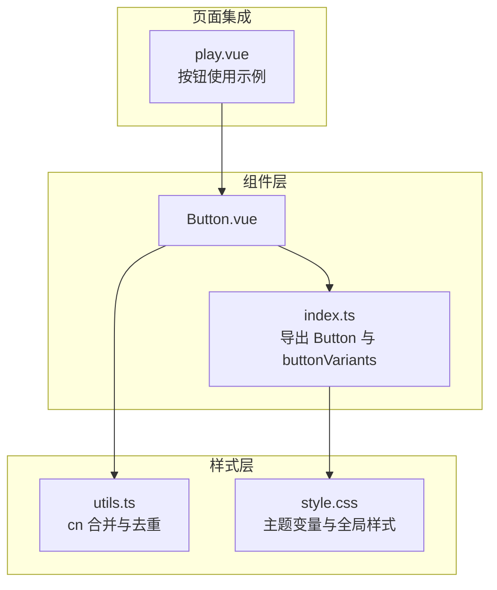
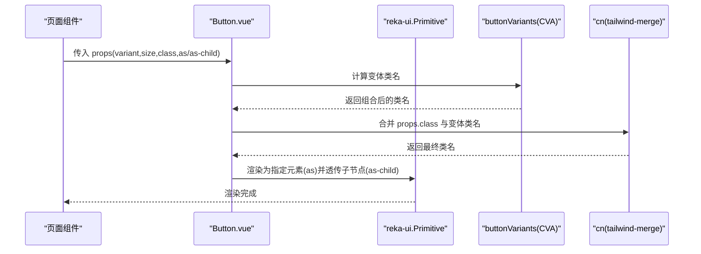
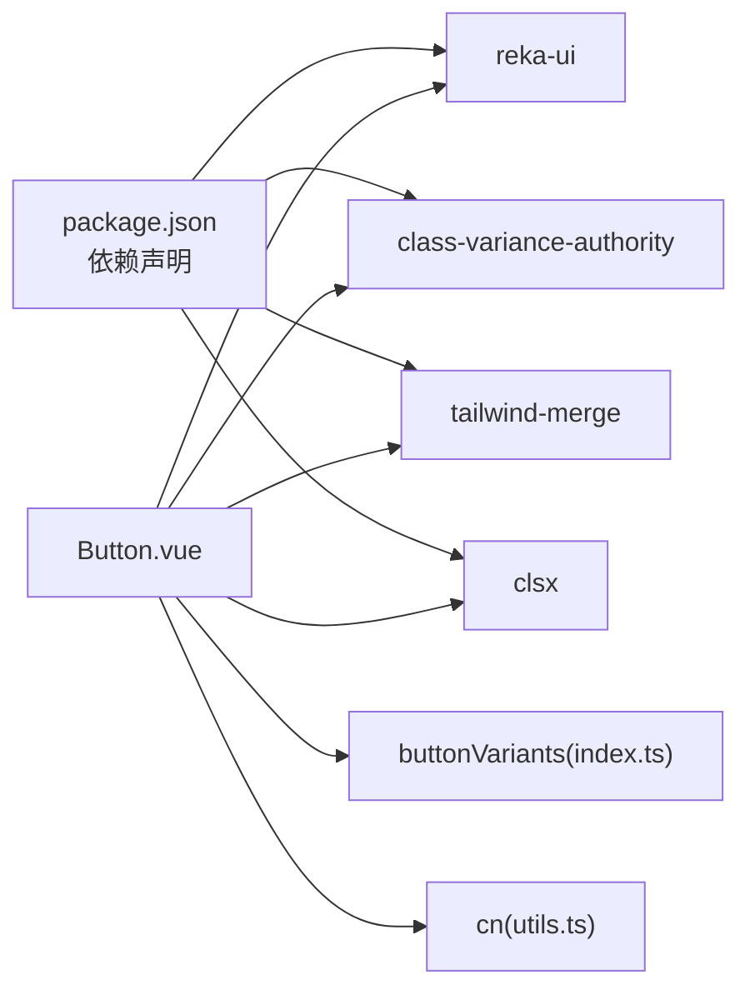

# 按钮组件 (Button)

<cite>
**本文引用的文件列表**
- [Button.vue](file://apps/web/src/components/ui/button/Button.vue)
- [index.ts](file://apps/web/src/components/ui/button/index.ts)
- [utils.ts](file://apps/web/src/lib/utils.ts)
- [play.vue](file://apps/web/src/pages/play.vue)
- [style.css](file://apps/web/src/style.css)
- [package.json](file://apps/web/package.json)
- [style.md](file://apps/web/style.md)
</cite>

## 目录
1. [简介](#简介)
2. [项目结构](#项目结构)
3. [核心组件](#核心组件)
4. [架构总览](#架构总览)
5. [组件详解](#组件详解)
6. [依赖关系分析](#依赖关系分析)
7. [性能与可用性](#性能与可用性)
8. [故障排查](#故障排查)
9. [结论](#结论)
10. [附录](#附录)

## 简介
本文件面向 Button 组件的使用者与维护者，围绕 apps/web/src/components/ui/button/Button.vue 的实现进行系统化说明。内容涵盖：
- 视觉样式与变体体系
- 交互行为（禁用、尺寸、聚焦环、悬停/按压态）
- 使用场景（表单、工具栏、博客页面）
- Props、事件与插槽
- 样式定制（Tailwind 类与 CSS 变量）
- 在 play.vue 等页面中的集成模式

## 项目结构
Button 组件位于前端工程 apps/web 下，采用“组件即样式变体”的设计，结合 Tailwind v4 与 CVA（Class Variance Authority）实现一致的视觉与交互体验。

图表来源
- [Button.vue](file://apps/web/src/components/ui/button/Button.vue#L1-L30)
- [index.ts](file://apps/web/src/components/ui/button/index.ts#L1-L37)
- [utils.ts](file://apps/web/src/lib/utils.ts#L1-L9)
- [style.css](file://apps/web/src/style.css#L1-L265)
- [play.vue](file://apps/web/src/pages/play.vue#L1-L298)

章节来源
- [Button.vue](file://apps/web/src/components/ui/button/Button.vue#L1-L30)
- [index.ts](file://apps/web/src/components/ui/button/index.ts#L1-L37)
- [utils.ts](file://apps/web/src/lib/utils.ts#L1-L9)
- [style.css](file://apps/web/src/style.css#L1-L265)
- [play.vue](file://apps/web/src/pages/play.vue#L1-L298)

## 核心组件
- 组件名称：Button
- 文件位置：apps/web/src/components/ui/button/Button.vue
- 导出入口：apps/web/src/components/ui/button/index.ts
- 样式变体：通过 CVA 定义 variant 与 size 两组变体，配合 cn 合并 Tailwind 类
- 依赖库：reka-ui（Primitive）、class-variance-authority、tailwind-merge、clsx

关键能力
- 支持多种变体（default、destructive、outline、secondary、ghost、acid）
- 支持多种尺寸（default、sm、lg、icon、icon-sm、icon-lg）
- 通过 as/as-child 控制渲染元素与子节点透传
- 内置禁用态与聚焦环样式
- 插槽：默认插槽承载按钮内容；可通过子元素自动适配图标尺寸

章节来源
- [Button.vue](file://apps/web/src/components/ui/button/Button.vue#L1-L30)
- [index.ts](file://apps/web/src/components/ui/button/index.ts#L1-L37)
- [package.json](file://apps/web/package.json#L1-L53)

## 架构总览
Button 的渲染链路如下：

图表来源
- [Button.vue](file://apps/web/src/components/ui/button/Button.vue#L1-L30)
- [index.ts](file://apps/web/src/components/ui/button/index.ts#L1-L37)
- [utils.ts](file://apps/web/src/lib/utils.ts#L1-L9)

## 组件详解

### Props 与默认值
- as: string | Component，默认 "button"
  - 作用：决定渲染为原生元素或自定义组件
- asChild: boolean，默认未设置
  - 作用：将子节点透传给内部元素，常用于语义化与无障碍
- variant: "default" | "destructive" | "outline" | "secondary" | "ghost" | "acid"
  - 默认值："default"
- size: "default" | "sm" | "lg" | "icon" | "icon-sm" | "icon-lg"
  - 默认值："default"
- class: string | undefined
  - 作用：追加自定义样式类，会被合并到最终类名中

注意
- 禁用态与聚焦环样式由变体规则统一管理，无需额外传参
- 图标尺寸与间距通过变体规则自动适配，无需手动传入

章节来源
- [Button.vue](file://apps/web/src/components/ui/button/Button.vue#L9-L17)
- [index.ts](file://apps/web/src/components/ui/button/index.ts#L6-L34)

### 变体与尺寸规则
- 变体（variant）
  - default：主操作，背景为主色，悬停有阴影与轻微透明度变化
  - destructive：危险/删除等破坏性操作，聚焦环带破坏色
  - outline：描边背景，悬停切换前景/背景色
  - secondary：次级操作，背景为次色
  - ghost：幽灵按钮，仅悬停态有背景
  - acid：霓虹风格，带发光阴影与过渡动画
- 尺寸（size）
  - default/sm/lg：常规高度与内边距
  - icon/icon-sm/icon-lg：正方形尺寸，适合纯图标按钮

章节来源
- [index.ts](file://apps/web/src/components/ui/button/index.ts#L6-L34)

### 事件与插槽
- 事件
  - click：由 reka-ui.Primitive 透传，可直接监听
- 插槽
  - 默认插槽：承载按钮文本或图标
  - 加载图标插槽：当前实现未显式声明具名插槽，但可通过在默认插槽中放置 SVG 图标实现加载态示意（建议做法）

章节来源
- [Button.vue](file://apps/web/src/components/ui/button/Button.vue#L20-L29)

### 交互行为与状态
- 禁用态：禁用时 pointer-events 被禁，透明度降低，不可交互
- 聚焦环：聚焦时显示 ring 色环，支持明暗主题差异
- 悬停/按压：各变体提供 hover/active 样式，acid 变体包含发光与颜色过渡
- 图标适配：当存在子 SVG 时，自动调整内边距与尺寸，避免拥挤

章节来源
- [index.ts](file://apps/web/src/components/ui/button/index.ts#L6-L19)
- [style.css](file://apps/web/src/style.css#L1-L265)

### 使用示例与场景

- 表单场景
  - 在表单提交、重置、下一步等操作中使用不同变体区分主次
  - 示例路径：apps/web/src/pages/play.vue 中的“启动/停止”“观察”“单步执行”等按钮
- 工具栏场景
  - 在播放页底部控制面板中，使用 small 尺寸与 outline/acid 变体突出功能入口
  - 示例路径：apps/web/src/pages/play.vue 底部控制区
- 博客页面场景
  - 博客列表页通常不直接使用 Button 组件，但可参考其样式体系在其他容器中复用相同变体与尺寸

章节来源
- [play.vue](file://apps/web/src/pages/play.vue#L1-L298)

### 样式定制指南

- 通过 Tailwind 类覆盖
  - 使用 class 追加自定义类名，cn 会自动合并与去重
  - 可叠加 hover/focus-visible 等修饰符实现局部增强
- 通过 CSS 变量与主题
  - 主题变量集中在 style.css，包括 primary/secondary/foreground/background 等
  - 暗色模式下，聚焦环与破坏色等视觉细节会自动切换
- 变体与尺寸扩展
  - 如需新增变体或尺寸，可在 index.ts 的 buttonVariants 中扩展
  - 注意保持与全局主题变量一致，避免视觉割裂

章节来源
- [utils.ts](file://apps/web/src/lib/utils.ts#L1-L9)
- [style.css](file://apps/web/src/style.css#L1-L265)
- [index.ts](file://apps/web/src/components/ui/button/index.ts#L6-L34)

### 在 play.vue 中的集成模式
- 引入与使用
  - 在页面顶部引入 Button 组件
  - 在模板中直接使用，绑定 click 事件与动态 variant/class
- 动态状态
  - 根据 store 状态切换 variant（如运行中使用 destructive，空闲使用 acid）
  - 使用 :disabled 绑定状态，实现禁用态
- 样式风格
  - 与页面整体霓虹风格保持一致，acid 变体用于强调关键操作

章节来源
- [play.vue](file://apps/web/src/pages/play.vue#L1-L298)

## 依赖关系分析

图表来源
- [package.json](file://apps/web/package.json#L1-L53)
- [Button.vue](file://apps/web/src/components/ui/button/Button.vue#L1-L30)
- [index.ts](file://apps/web/src/components/ui/button/index.ts#L1-L37)
- [utils.ts](file://apps/web/src/lib/utils.ts#L1-L9)

章节来源
- [package.json](file://apps/web/package.json#L1-L53)
- [Button.vue](file://apps/web/src/components/ui/button/Button.vue#L1-L30)
- [index.ts](file://apps/web/src/components/ui/button/index.ts#L1-L37)
- [utils.ts](file://apps/web/src/lib/utils.ts#L1-L9)

## 性能与可用性
- 性能
  - 变体计算在组件初始化时完成，渲染阶段仅做类名合并，开销极低
  - 图标与尺寸适配通过 CSS 选择器实现，避免 JS 计算
- 可用性
  - 焦点可见性与聚焦环遵循无障碍规范
  - 禁用态具备明确的视觉反馈与交互阻断
  - 变体与尺寸覆盖常见业务场景，减少重复样式代码

[本节为通用建议，不直接分析具体文件]

## 故障排查
- 点击事件无效
  - 检查是否在禁用态下使用了 :disabled
  - 确认未被上层容器阻止事件冒泡
- 样式冲突
  - 使用 class 追加样式时，确认 tailwind-merge 是否正确合并
  - 若出现意外覆盖，检查是否混用了旧版类名
- 变体/尺寸不生效
  - 确认传入的 variant/size 值在允许集合内
  - 检查全局主题变量是否被覆盖导致颜色异常

章节来源
- [Button.vue](file://apps/web/src/components/ui/button/Button.vue#L9-L17)
- [index.ts](file://apps/web/src/components/ui/button/index.ts#L6-L34)
- [utils.ts](file://apps/web/src/lib/utils.ts#L1-L9)

## 结论
Button 组件以 CVA 为核心，结合 reka-ui 的 Primitive 提供了高内聚、低耦合的按钮实现。通过统一的变体与尺寸体系，以及与 Tailwind v4 的深度整合，既能满足多样化的视觉需求，又能在多页面场景中保持一致的交互体验。建议在新业务中优先使用该组件，并通过扩展变体与尺寸来满足特定场景。

[本节为总结性内容，不直接分析具体文件]

## 附录

### Props 一览
- as: string | Component，默认 "button"
- asChild: boolean
- variant: "default" | "destructive" | "outline" | "secondary" | "ghost" | "acid"
- size: "default" | "sm" | "lg" | "icon" | "icon-sm" | "icon-lg"
- class: string

章节来源
- [Button.vue](file://apps/web/src/components/ui/button/Button.vue#L9-L17)
- [index.ts](file://apps/web/src/components/ui/button/index.ts#L6-L34)

### 变体与尺寸对照
- 变体：default、destructive、outline、secondary、ghost、acid
- 尺寸：default、sm、lg、icon、icon-sm、icon-lg

章节来源
- [index.ts](file://apps/web/src/components/ui/button/index.ts#L6-L34)

### 事件与插槽
- 事件：click（由 Primitive 透传）
- 插槽：默认插槽；可通过默认插槽放置图标实现加载态示意

章节来源
- [Button.vue](file://apps/web/src/components/ui/button/Button.vue#L20-L29)

### 页面集成示例路径
- 表单/工具栏：apps/web/src/pages/play.vue
- 博客页面：apps/web/src/pages/blog/index.vue（不直接使用 Button，可参考样式体系）

章节来源
- [play.vue](file://apps/web/src/pages/play.vue#L1-L298)
- [style.md](file://apps/web/style.md#L75-L90)