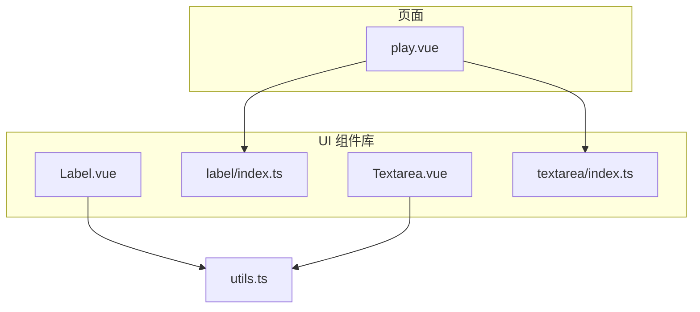
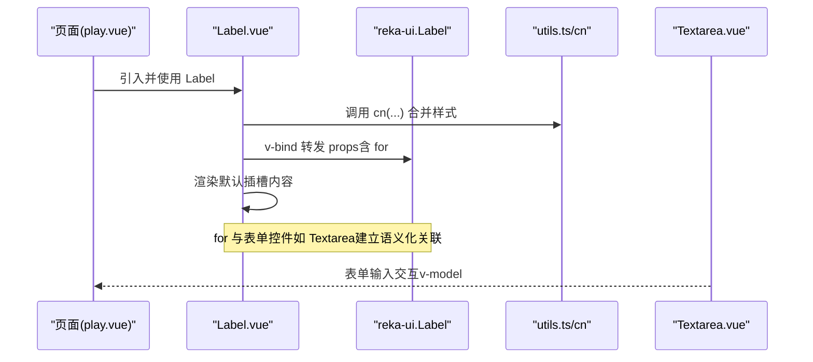
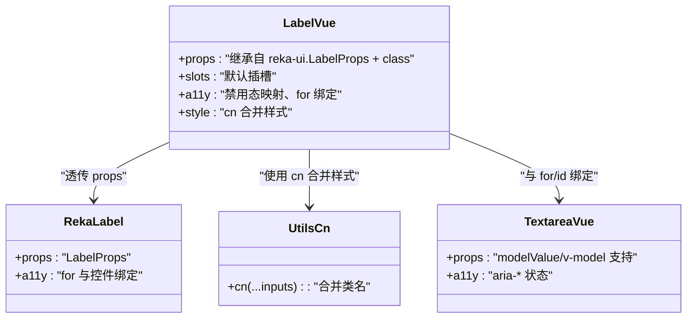
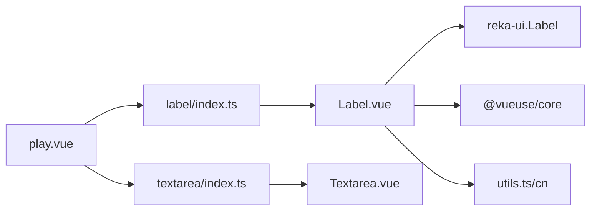

# 标签组件（Label）

<cite>
**本文引用的文件**
- [Label.vue](file://apps/web/src/components/ui/label/Label.vue)
- [index.ts](file://apps/web/src/components/ui/label/index.ts)
- [Textarea.vue](file://apps/web/src/components/ui/textarea/Textarea.vue)
- [play.vue](file://apps/web/src/pages/play.vue)
- [utils.ts](file://apps/web/src/lib/utils.ts)
</cite>

## 目录
1. [简介](#简介)
2. [项目结构](#项目结构)
3. [核心组件](#核心组件)
4. [架构总览](#架构总览)
5. [组件详解](#组件详解)
6. [依赖分析](#依赖分析)
7. [性能考量](#性能考量)
8. [故障排查指南](#故障排查指南)
9. [结论](#结论)
10. [附录](#附录)

## 简介
本文件围绕标签组件 Label 的实现进行系统化说明，重点覆盖：
- 作为表单控件关联标签的语义化作用与 for 属性绑定机制
- 组件的 props 类型与行为边界
- 插槽（默认插槽）的使用方式
- 可访问性（a11y）相关特性与最佳实践
- 在表单布局中与 Textarea 等组件的配合使用示例
- 在页面 play.vue 中的实际应用位置
- 通过 CSS 类扩展样式的思路与主题适配方法

## 项目结构
Label 组件位于前端应用的 UI 组件库目录下，采用“按需导出”的模块组织方式；同时在页面 play.vue 中直接引入并使用该组件。

图表来源
- [Label.vue](file://apps/web/src/components/ui/label/Label.vue#L1-L27)
- [index.ts](file://apps/web/src/components/ui/label/index.ts#L1-L2)
- [Textarea.vue](file://apps/web/src/components/ui/textarea/Textarea.vue#L1-L28)
- [play.vue](file://apps/web/src/pages/play.vue#L228-L235)
- [utils.ts](file://apps/web/src/lib/utils.ts#L1-L9)

章节来源
- [Label.vue](file://apps/web/src/components/ui/label/Label.vue#L1-L27)
- [index.ts](file://apps/web/src/components/ui/label/index.ts#L1-L2)
- [Textarea.vue](file://apps/web/src/components/ui/textarea/Textarea.vue#L1-L28)
- [play.vue](file://apps/web/src/pages/play.vue#L228-L235)
- [utils.ts](file://apps/web/src/lib/utils.ts#L1-L9)

## 核心组件
- 组件名称：Label
- 文件路径：apps/web/src/components/ui/label/Label.vue
- 导出入口：apps/web/src/components/ui/label/index.ts
- 功能定位：对 reka-ui 的 Label 进行二次封装，提供统一的样式与可访问性能力，并保留原生语义化标签的 for 绑定能力

章节来源
- [Label.vue](file://apps/web/src/components/ui/label/Label.vue#L1-L27)
- [index.ts](file://apps/web/src/components/ui/label/index.ts#L1-L2)

## 架构总览
Label 组件通过 v-bind 将外部传入的 props 转发给底层 reka-ui 的 Label，并在模板中注入 data-slot 与 class，从而实现：
- 语义化标签与表单控件的绑定（for）
- 默认插槽内容渲染
- 可访问性状态映射（禁用态、peer-disabled 等）
- 样式合并与主题扩展（通过 cn 工具函数）

图表来源
- [play.vue](file://apps/web/src/pages/play.vue#L228-L235)
- [Label.vue](file://apps/web/src/components/ui/label/Label.vue#L1-L27)
- [utils.ts](file://apps/web/src/lib/utils.ts#L1-L9)
- [Textarea.vue](file://apps/web/src/components/ui/textarea/Textarea.vue#L1-L28)

## 组件详解

### 语义化与绑定机制（for 与表单元素）
- Label 的核心语义是为表单控件提供可点击的关联标签，提升可访问性与交互体验。
- 通过将外部传入的 props（包含 for）透传给底层 reka-ui 的 Label，实现与目标表单控件的语义绑定。
- 在 play.vue 中，Label 与 Textarea 并列出现，形成“标签-输入框”的典型布局，用户点击标签即可聚焦对应输入框。

章节来源
- [Label.vue](file://apps/web/src/components/ui/label/Label.vue#L1-L27)
- [play.vue](file://apps/web/src/pages/play.vue#L11-L17)

### Props 列表与类型
- 外部传入的 props 来源于 reka-ui 的 LabelProps，结合本地扩展：
  - 继承自 reka-ui 的 LabelProps（用于语义化标签与表单控件绑定）
  - 额外支持 class（HTMLAttributes["class"]），用于样式扩展
- 关键点：
  - for：用于与表单控件（如 input、textarea）建立关联
  - class：用于追加或覆盖样式类名

章节来源
- [Label.vue](file://apps/web/src/components/ui/label/Label.vue#L1-L27)

### 插槽（Slots）
- 默认插槽：用于承载标签文本或其他内联内容
- 使用方式：在模板中包裹需要显示的内容，组件会将其渲染到标签内部

章节来源
- [Label.vue](file://apps/web/src/components/ui/label/Label.vue#L1-L27)

### 可访问性（a11y）特性
- 禁用态样式映射：
  - group-data-[disabled=true]：当父容器标记为 disabled 时，禁用指针事件并降低透明度
  - peer-disabled：当相邻表单控件处于 disabled 时，同步禁用指针事件与透明度
- 语义化绑定：
  - 通过 for 与表单控件建立关联，确保键盘导航与屏幕阅读器识别一致
- 交互一致性：
  - 点击标签触发聚焦，提升可用性与无障碍体验

章节来源
- [Label.vue](file://apps/web/src/components/ui/label/Label.vue#L1-L27)

### 样式与主题扩展
- 样式合并工具：cn（基于 clsx 与 tailwind-merge），用于安全地合并多个类名
- 默认样式包含：
  - 文本尺寸、行高、字重等基础排版
  - 禁用态与 peer-disabled 的视觉反馈
  - 与表单控件的协作样式（如与 Textarea 的布局对齐）
- 扩展建议：
  - 通过 class 属性追加主题色、字号、间距等
  - 与 Tailwind CSS 或自定义 CSS 搭配，满足不同主题需求

章节来源
- [Label.vue](file://apps/web/src/components/ui/label/Label.vue#L1-L27)
- [utils.ts](file://apps/web/src/lib/utils.ts#L1-L9)

### 在表单布局中与 Textarea 配合使用
- 典型布局：Label 在上，Textarea 在下，二者通过 for 与 id 建立语义绑定
- 在 play.vue 中，Label 用于标注“提示词注入”，紧邻 Textarea 输入框，形成清晰的表单结构
- 交互流程：点击 Label 自动聚焦到 Textarea，便于用户快速编辑

章节来源
- [play.vue](file://apps/web/src/pages/play.vue#L11-L17)
- [Textarea.vue](file://apps/web/src/components/ui/textarea/Textarea.vue#L1-L28)

### 在 play.vue 中的实际应用
- 页面中引入 Label 与 Textarea，并在相同布局中使用
- Label 作为静态文本标签，Textarea 作为可编辑输入域
- 二者共同构成“标签-输入”表单单元，提升界面可读性与交互效率

章节来源
- [play.vue](file://apps/web/src/pages/play.vue#L11-L17)
- [index.ts](file://apps/web/src/components/ui/label/index.ts#L1-L2)

### 代码级关系图

图表来源
- [Label.vue](file://apps/web/src/components/ui/label/Label.vue#L1-L27)
- [Textarea.vue](file://apps/web/src/components/ui/textarea/Textarea.vue#L1-L28)
- [utils.ts](file://apps/web/src/lib/utils.ts#L1-L9)

## 依赖分析
- 对外依赖
  - reka-ui：提供语义化 Label 组件与 LabelProps 类型
  - @vueuse/core：提供 reactiveOmit 与 useVModel 等工具
  - tailwindcss 与 clsx/tailwind-merge：提供 cn 工具函数，用于类名合并
- 内部依赖
  - utils.ts：cn 工具函数
  - label/index.ts：组件导出入口

图表来源
- [Label.vue](file://apps/web/src/components/ui/label/Label.vue#L1-L27)
- [index.ts](file://apps/web/src/components/ui/label/index.ts#L1-L2)
- [utils.ts](file://apps/web/src/lib/utils.ts#L1-L9)
- [play.vue](file://apps/web/src/pages/play.vue#L228-L235)
- [Textarea.vue](file://apps/web/src/components/ui/textarea/Textarea.vue#L1-L28)

章节来源
- [Label.vue](file://apps/web/src/components/ui/label/Label.vue#L1-L27)
- [index.ts](file://apps/web/src/components/ui/label/index.ts#L1-L2)
- [utils.ts](file://apps/web/src/lib/utils.ts#L1-L9)
- [play.vue](file://apps/web/src/pages/play.vue#L228-L235)
- [Textarea.vue](file://apps/web/src/components/ui/textarea/Textarea.vue#L1-L28)

## 性能考量
- 样式合并成本低：cn 仅在编译期/运行期进行类名合并，开销极小
- 透传 props：通过 reactiveOmit 仅剔除 class，避免额外计算
- 与表单控件联动：Label 本身不持有状态，渲染与交互由底层控件承担，整体性能稳定

[本节为通用指导，无需特定文件引用]

## 故障排查指南
- 现象：点击 Label 不聚焦到输入框
  - 排查：确认 for 值与目标控件的 id 是否一致
  - 参考：Label 透传 props，确保 for 正确传递
- 现象：禁用态下仍可点击
  - 排查：检查父容器是否正确设置 group-data-[disabled=true]，或相邻控件是否处于 peer-disabled 状态
- 现象：样式冲突或覆盖异常
  - 排查：确认 class 传入顺序与 cn 合并规则，避免重复类名导致的优先级问题
- 现象：主题样式未生效
  - 排查：确认 Tailwind 配置与主题类名是否正确，以及 cn 是否正确合并

章节来源
- [Label.vue](file://apps/web/src/components/ui/label/Label.vue#L1-L27)
- [Textarea.vue](file://apps/web/src/components/ui/textarea/Textarea.vue#L1-L28)

## 结论
Label 组件在本项目中承担了语义化标签与表单控件绑定的关键角色，通过透传 props、默认插槽与可访问性映射，实现了简洁而强大的表单标签能力。结合 Textarea 等控件，可在 play.vue 中构建清晰、易用且可访问的表单布局。通过 cn 工具与 class 扩展，可灵活适配不同主题风格。

[本节为总结性内容，无需特定文件引用]

## 附录

### Props 与 Slots 快速参考
- Props
  - 继承自 reka-ui.LabelProps（包含 for 等）
  - class：可选，用于追加样式类名
- Slots
  - 默认插槽：标签文本或内联内容

章节来源
- [Label.vue](file://apps/web/src/components/ui/label/Label.vue#L1-L27)

### 在 play.vue 中的应用片段路径
- Label 与 Textarea 的组合使用位置：第 11-17 行
- 组件导入位置：第 228-235 行

章节来源
- [play.vue](file://apps/web/src/pages/play.vue#L11-L17)
- [play.vue](file://apps/web/src/pages/play.vue#L228-L235)