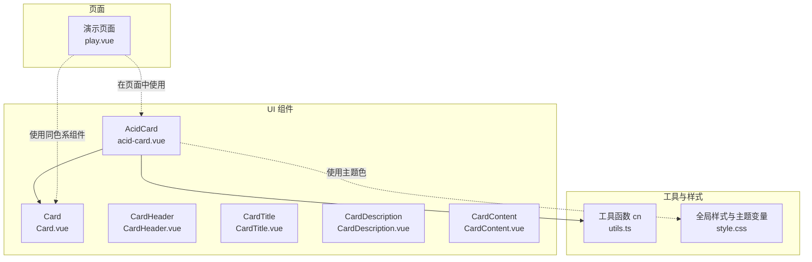
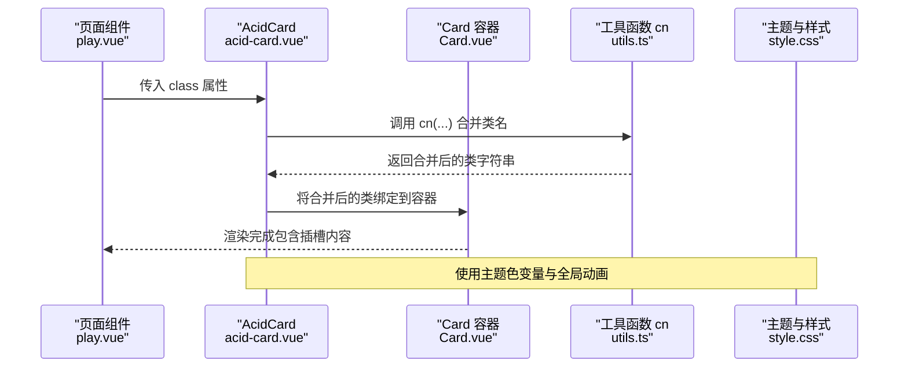
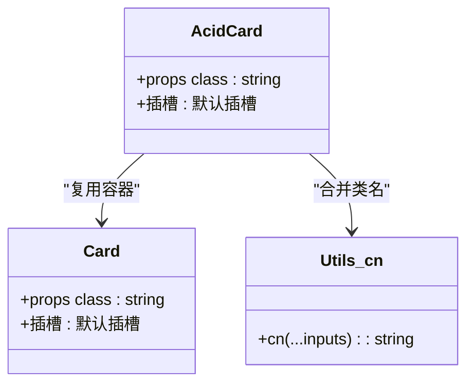
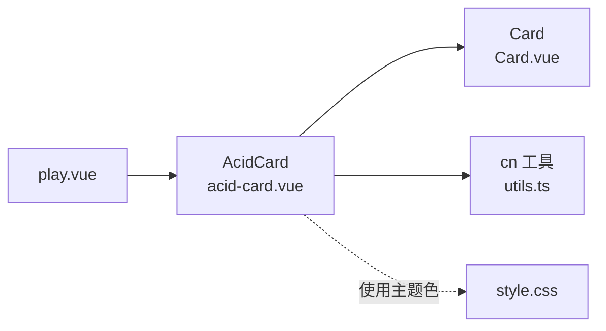

# 酸性风格卡片 (AcidCard)

<cite>
**本文引用的文件列表**
- [acid-card.vue](file://apps/web/src/components/ui/acid-card.vue)
- [Card.vue](file://apps/web/src/components/ui/card/Card.vue)
- [CardHeader.vue](file://apps/web/src/components/ui/card/CardHeader.vue)
- [CardTitle.vue](file://apps/web/src/components/ui/card/CardTitle.vue)
- [CardDescription.vue](file://apps/web/src/components/ui/card/CardDescription.vue)
- [CardContent.vue](file://apps/web/src/components/ui/card/CardContent.vue)
- [utils.ts](file://apps/web/src/lib/utils.ts)
- [style.css](file://apps/web/src/style.css)
- [play.vue](file://apps/web/src/pages/play.vue)
</cite>

## 目录
1. [简介](#简介)
2. [项目结构](#项目结构)
3. [核心组件](#核心组件)
4. [架构总览](#架构总览)
5. [详细组件分析](#详细组件分析)
6. [依赖关系分析](#依赖关系分析)
7. [性能考量](#性能考量)
8. [故障排查指南](#故障排查指南)
9. [结论](#结论)
10. [附录](#附录)

## 简介
本文件围绕项目特有组件“酸性风格卡片”（AcidCard）进行系统化说明。该组件以霓虹感、渐变背景与动态光效为核心视觉语言，强调低透明度、背景模糊与悬停增强的阴影效果，契合项目整体的赛博朋克/酸性美学。文档将从实现技术（CSS 动画、伪元素、Tailwind 高级类组合）、属性与插槽定义、在 play.vue 页面中的展示用途、品牌视觉语言体现、性能影响与优化建议等方面展开。

## 项目结构
AcidCard 位于前端应用层的 UI 组件目录中，采用“包装现有 Card 组件”的方式复用其结构与语义，同时叠加自定义样式与动效。其直接依赖：
- 基础 Card 组件：提供容器结构与基础样式
- 工具函数 cn：用于合并与去重 Tailwind 类名
- 全局样式：提供主题色变量与全局动画

图表来源
- [acid-card.vue](file://apps/web/src/components/ui/acid-card.vue#L1-L24)
- [Card.vue](file://apps/web/src/components/ui/card/Card.vue#L1-L18)
- [utils.ts](file://apps/web/src/lib/utils.ts#L1-L9)
- [style.css](file://apps/web/src/style.css#L114-L187)
- [play.vue](file://apps/web/src/pages/play.vue#L1-L298)

章节来源
- [acid-card.vue](file://apps/web/src/components/ui/acid-card.vue#L1-L24)
- [Card.vue](file://apps/web/src/components/ui/card/Card.vue#L1-L18)
- [utils.ts](file://apps/web/src/lib/utils.ts#L1-L9)
- [style.css](file://apps/web/src/style.css#L114-L187)
- [play.vue](file://apps/web/src/pages/play.vue#L1-L298)

## 核心组件
- 组件名称：AcidCard
- 组件类型：轻量包装型 UI 组件
- 外观特征：低不透明度背景、高亮边框、背景区块模糊、悬停增强阴影、过渡动画
- 动效特征：无内置独立动画，依赖父级 Card 的过渡与 hover 阴影增强；页面层面存在全局数据流背景动画与霓虹文本动效
- 适用场景：信息区块展示、状态面板、日志容器等

章节来源
- [acid-card.vue](file://apps/web/src/components/ui/acid-card.vue#L1-L24)
- [Card.vue](file://apps/web/src/components/ui/card/Card.vue#L1-L18)
- [play.vue](file://apps/web/src/pages/play.vue#L237-L298)

## 架构总览
AcidCard 的渲染流程基于 Vue 单文件组件，通过插槽承载内容，内部以 Card 为容器，结合 cn 合并类名，最终输出具备“酸性风格”的卡片容器。

图表来源
- [acid-card.vue](file://apps/web/src/components/ui/acid-card.vue#L1-L24)
- [Card.vue](file://apps/web/src/components/ui/card/Card.vue#L1-L18)
- [utils.ts](file://apps/web/src/lib/utils.ts#L1-L9)
- [style.css](file://apps/web/src/style.css#L114-L187)
- [play.vue](file://apps/web/src/pages/play.vue#L1-L298)

## 详细组件分析

### 组件实现与技术要点
- 组件继承与封装
  - 通过引入基础 Card 容器，复用其结构与默认样式，避免重复实现
  - 仅在类名层面叠加“酸性风格”外观，降低维护成本
- 类名合并策略
  - 使用 cn 函数对传入 class 与内置类名进行合并与冲突修复，确保 Tailwind 类优先级正确
- 视觉样式要点
  - 背景与边框：低不透明度背景、高亮边框、悬停增强阴影
  - 背景模糊：backdrop-blur 使内容区具有“磨砂玻璃”质感
  - 过渡动画：统一的过渡时长与缓动，提升交互体验
- 动效与全局样式
  - 组件本身不包含独立动画，但页面层面提供数据流背景动画与霓虹文本动效，二者共同构成“酸性风格”的完整动效体系

章节来源
- [acid-card.vue](file://apps/web/src/components/ui/acid-card.vue#L1-L24)
- [utils.ts](file://apps/web/src/lib/utils.ts#L1-L9)

### 组件类图（代码级）

图表来源
- [acid-card.vue](file://apps/web/src/components/ui/acid-card.vue#L1-L24)
- [Card.vue](file://apps/web/src/components/ui/card/Card.vue#L1-L18)
- [utils.ts](file://apps/web/src/lib/utils.ts#L1-L9)

### 插槽与属性定义
- 属性（Props）
  - class: 可选，用于向容器追加或覆盖样式类
- 插槽（Slots）
  - 默认插槽：承载卡片内容（如标题、描述、正文等）

章节来源
- [acid-card.vue](file://apps/web/src/components/ui/acid-card.vue#L6-L11)

### 在 play.vue 中的展示用途
- 页面背景与主题色
  - 页面根容器使用酸性主题色变量，营造统一的赛博朋克基调
- 数据流背景动画
  - 页面提供数据流背景动画类，用于营造“流动数据”的视觉氛围
- 霓虹文本动效
  - 页面提供霓虹文本动效类，用于标题与关键文案的强调
- AcidCard 的定位
  - 在 play.vue 中，AcidCard 作为内容容器被广泛使用，配合主题色与动效，形成一致的品牌视觉语言

章节来源
- [play.vue](file://apps/web/src/pages/play.vue#L1-L298)
- [style.css](file://apps/web/src/style.css#L114-L187)

### 使用示例与上下文
以下示例展示在不同上下文中启用或禁用动效的思路（以路径代替具体代码）：
- 禁用动效：通过传入 class 覆盖 hover 阴影与过渡类，达到静态展示效果
  - 示例路径：[play.vue](file://apps/web/src/pages/play.vue#L1-L298)
- 启用动效：保持默认类名，利用页面提供的全局动画与主题色，获得完整的“酸性风格”
  - 示例路径：[play.vue](file://apps/web/src/pages/play.vue#L1-L298)
- 与 Card 子组件组合：在 AcidCard 内使用 CardHeader、CardTitle、CardDescription、CardContent 等子组件，构建结构化内容
  - 示例路径：[CardHeader.vue](file://apps/web/src/components/ui/card/CardHeader.vue#L1-L16)、[CardTitle.vue](file://apps/web/src/components/ui/card/CardTitle.vue#L1-L16)、[CardDescription.vue](file://apps/web/src/components/ui/card/CardDescription.vue#L1-L16)、[CardContent.vue](file://apps/web/src/components/ui/card/CardContent.vue#L1-L16)

章节来源
- [play.vue](file://apps/web/src/pages/play.vue#L1-L298)
- [CardHeader.vue](file://apps/web/src/components/ui/card/CardHeader.vue#L1-L16)
- [CardTitle.vue](file://apps/web/src/components/ui/card/CardTitle.vue#L1-L16)
- [CardDescription.vue](file://apps/web/src/components/ui/card/CardDescription.vue#L1-L16)
- [CardContent.vue](file://apps/web/src/components/ui/card/CardContent.vue#L1-L16)

### 动画与伪元素使用说明
- CSS 动画
  - 组件自身未定义独立动画，主要依赖：
    - 过渡动画：统一的过渡时长与缓动，提升交互体验
    - 页面全局动画：数据流背景动画与霓虹文本动效
- 伪元素
  - 组件未使用伪元素；页面层面的按钮“Glitch”效果通过伪元素实现，可作为参考样式模式

章节来源
- [acid-card.vue](file://apps/web/src/components/ui/acid-card.vue#L1-L24)
- [play.vue](file://apps/web/src/pages/play.vue#L237-L298)

## 依赖关系分析
- 组件耦合
  - AcidCard 对 Card 的依赖为“样式复用”，耦合度低，便于替换或升级
  - 对 cn 的依赖为“类名合并”，属于通用工具函数，耦合度低
- 外部样式依赖
  - 依赖全局主题色变量与动画定义，保证视觉一致性
- 潜在循环依赖
  - 未发现循环依赖迹象
- 接口契约
  - 仅暴露 class 属性，接口简洁，易于扩展

图表来源
- [acid-card.vue](file://apps/web/src/components/ui/acid-card.vue#L1-L24)
- [Card.vue](file://apps/web/src/components/ui/card/Card.vue#L1-L18)
- [utils.ts](file://apps/web/src/lib/utils.ts#L1-L9)
- [style.css](file://apps/web/src/style.css#L114-L187)
- [play.vue](file://apps/web/src/pages/play.vue#L1-L298)

章节来源
- [acid-card.vue](file://apps/web/src/components/ui/acid-card.vue#L1-L24)
- [Card.vue](file://apps/web/src/components/ui/card/Card.vue#L1-L18)
- [utils.ts](file://apps/web/src/lib/utils.ts#L1-L9)
- [style.css](file://apps/web/src/style.css#L114-L187)
- [play.vue](file://apps/web/src/pages/play.vue#L1-L298)

## 性能考量
- 渲染性能
  - AcidCard 仅包裹一层容器，开销极低
  - 使用 backdrop-blur 会带来一定 GPU 开销，建议在低端设备上谨慎使用
- 动画性能
  - 过渡动画与页面全局动画均为轻量级，通常不会造成明显卡顿
  - 若在同一页面大量使用模糊与阴影，建议控制层级深度与数量
- 样式合并
  - cn 工具可有效避免类名冲突与冗余，减少样式计算复杂度
- 建议
  - 在移动端或低端设备上，可通过传入 class 覆盖 hover 阴影与过渡类，降低动效强度
  - 控制页面中同时启用的全局动画数量，避免过度消耗资源

[本节为通用性能指导，无需特定文件来源]

## 故障排查指南
- 类名未生效
  - 检查是否正确传入 class 属性，以及是否被 cn 正确合并
  - 参考路径：[acid-card.vue](file://apps/web/src/components/ui/acid-card.vue#L1-L24)、[utils.ts](file://apps/web/src/lib/utils.ts#L1-L9)
- 主题色显示异常
  - 确认当前主题环境（如深色模式）下主题变量是否正确映射
  - 参考路径：[style.css](file://apps/web/src/style.css#L114-L187)
- 动效缺失
  - 确认页面是否启用了全局数据流背景动画与霓虹文本动效
  - 参考路径：[play.vue](file://apps/web/src/pages/play.vue#L237-L298)
- 背景模糊导致卡顿
  - 在低端设备上减少模糊层级或禁用模糊
  - 参考路径：[acid-card.vue](file://apps/web/src/components/ui/acid-card.vue#L1-L24)

章节来源
- [acid-card.vue](file://apps/web/src/components/ui/acid-card.vue#L1-L24)
- [utils.ts](file://apps/web/src/lib/utils.ts#L1-L9)
- [style.css](file://apps/web/src/style.css#L114-L187)
- [play.vue](file://apps/web/src/pages/play.vue#L237-L298)

## 结论
AcidCard 以“轻量包装 + 主题复用”的方式实现了统一的“酸性风格”视觉语言。它通过 cn 工具与全局样式变量，将低透明度背景、高亮边框、背景区块模糊与悬停增强阴影有机结合，既保持了良好的可维护性，又强化了项目的品牌识别度。在实际使用中，建议根据设备性能与上下文需求灵活启用或禁用动效，以获得最佳的用户体验与性能平衡。

[本节为总结性内容，无需特定文件来源]

## 附录

### 属性与插槽速览
- 属性
  - class: 可选，用于追加或覆盖样式类
- 插槽
  - 默认插槽：承载卡片内容

章节来源
- [acid-card.vue](file://apps/web/src/components/ui/acid-card.vue#L6-L11)

### 与 Card 子组件组合使用
- CardHeader：卡片头部容器
- CardTitle：卡片标题
- CardDescription：卡片描述
- CardContent：卡片内容区

章节来源
- [CardHeader.vue](file://apps/web/src/components/ui/card/CardHeader.vue#L1-L16)
- [CardTitle.vue](file://apps/web/src/components/ui/card/CardTitle.vue#L1-L16)
- [CardDescription.vue](file://apps/web/src/components/ui/card/CardDescription.vue#L1-L16)
- [CardContent.vue](file://apps/web/src/components/ui/card/CardContent.vue#L1-L16)