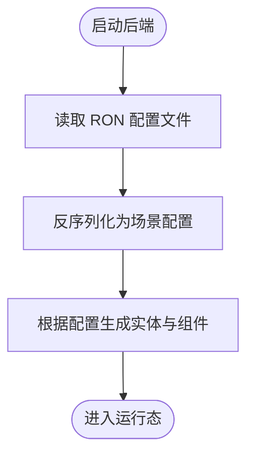

# 快速开始

<cite>
**本文引用的文件**
- [rust-toolchain.toml](file://rust-toolchain.toml)
- [Cargo.toml](file://Cargo.toml)
- [package.json](file://package.json)
- [apps/web/package.json](file://apps/web/package.json)
- [apps/web/vite.config.ts](file://apps/web/vite.config.ts)
- [apps/web/.env.development](file://apps/web/.env.development)
- [src/main.rs](file://src/main.rs)
- [src/server.rs](file://src/server.rs)
- [src/server/gym.rs](file://src/server/gym.rs)
- [src/core/resource.rs](file://src/core/resource.rs)
- [assets/games/classic_fiora.ron](file://assets/games/classic_fiora.ron)
- [examples/classic_fiora.rs](file://examples/classic_fiora.rs)
</cite>

## 目录
1. [简介](#简介)
2. [项目结构](#项目结构)
3. [核心组件](#核心组件)
4. [架构总览](#架构总览)
5. [详细组件分析](#详细组件分析)
6. [依赖关系分析](#依赖关系分析)
7. [性能注意事项](#性能注意事项)
8. [故障排除指南](#故障排除指南)
9. [结论](#结论)
10. [附录](#附录)

## 简介
本指南面向新开发者，帮助你在本地环境快速构建并运行 moon-lol 项目。你将学会：
- 基于 rust-toolchain.toml 配置 Rust 工具链
- 安装 Node.js 与 pnpm（用于前端）
- 分别构建后端（Rust）与前端（Vue/Vite）
- 启动命令示例与默认端口说明
- 从前端入口 apps/web/src/main.ts 到后端入口 src/main.rs 的启动流程
- 基础使用示例：加载 LoL 英雄模型并渲染显示
- 常见初始化问题与解决方案

## 项目结构
moon-lol 是一个多包工作区（Rust Workspace + Vue 前端），后端基于 Bevy 游戏引擎，前端采用 Vite + Vue。关键目录与职责如下：
- crates/*：Rust 子 crate，提供游戏逻辑、资源加载、LoL 数据转换等能力
- src/*：后端主应用入口与模块化插件系统
- apps/web/*：前端应用（Vue 3 + Vite），提供页面路由、状态管理与 UI 组件
- assets/*：游戏配置与资源（如 RON 配置文件）
- examples/*：示例程序，演示如何运行特定场景

图表来源
- [src/main.rs](file://src/main.rs#L1-L115)
- [Cargo.toml](file://Cargo.toml#L1-L63)
- [apps/web/vite.config.ts](file://apps/web/vite.config.ts#L1-L37)
- [apps/web/.env.development](file://apps/web/.env.development#L1-L1)

章节来源
- [Cargo.toml](file://Cargo.toml#L1-L63)
- [src/main.rs](file://src/main.rs#L1-L115)
- [apps/web/vite.config.ts](file://apps/web/vite.config.ts#L1-L37)
- [apps/web/.env.development](file://apps/web/.env.development#L1-L1)

## 核心组件
- Rust 工具链与工作区
  - 使用 rust-toolchain.toml 指定 rustfmt、clippy 等组件，确保团队工具一致
  - Cargo.toml 定义工作区成员与依赖，统一版本与特性
- 后端主入口
  - src/main.rs 初始化 Bevy App，注册大量插件（角色、战斗、动画、粒子、UI 等），并运行
- 前端主入口
  - apps/web/src/main.ts 创建 Vue 应用，挂载 Pinia 与路由，渲染 RouterView
- 开发环境变量
  - apps/web/.env.development 中定义 VITE_BASE_URL，默认指向 http://localhost:8000

章节来源
- [rust-toolchain.toml](file://rust-toolchain.toml#L1-L2)
- [Cargo.toml](file://Cargo.toml#L1-L63)
- [src/main.rs](file://src/main.rs#L56-L115)
- [apps/web/src/main.ts](file://apps/web/src/main.ts#L1-L17)
- [apps/web/.env.development](file://apps/web/.env.development#L1-L1)

## 架构总览
后端与前端通过 HTTP 协议进行通信（Rocket 提供 Web 服务，前端通过 axios 访问）。后端负责游戏世界与资源加载，前端负责界面与交互。

图表来源
- [src/server/gym.rs](file://src/server/gym.rs#L1-L14)
- [src/core/resource.rs](file://src/core/resource.rs#L44-L111)
- [apps/web/.env.development](file://apps/web/.env.development#L1-L1)

## 详细组件分析

### 后端启动流程（src/main.rs）
后端入口通过 Bevy 初始化 App，按顺序添加多个插件，最终调用 run 进入事件循环。插件涵盖角色、战斗、动画、粒子、UI 等模块，形成完整的模拟环境。

图表来源
- [src/main.rs](file://src/main.rs#L56-L115)

章节来源
- [src/main.rs](file://src/main.rs#L56-L115)

### 前端启动流程（apps/web/src/main.ts）
前端入口创建 Vue 应用，注入 Pinia（持久化插件）与路由，最后挂载到 DOM 元素上。

图表来源
- [apps/web/src/main.ts](file://apps/web/src/main.ts#L1-L17)

章节来源
- [apps/web/src/main.ts](file://apps/web/src/main.ts#L1-L17)

### 游戏配置与资源加载（assets/games/*.ron）
后端通过资源插件加载 RON 配置文件，解析角色皮肤、变换、阵营、属性等，动态生成游戏对象。

图表来源
- [src/core/resource.rs](file://src/core/resource.rs#L44-L111)
- [assets/games/classic_fiora.ron](file://assets/games/classic_fiora.ron#L1-L35)

章节来源
- [src/core/resource.rs](file://src/core/resource.rs#L44-L111)
- [assets/games/classic_fiora.ron](file://assets/games/classic_fiora.ron#L1-L35)

### 示例：加载 LoL 英雄并渲染
仓库提供了示例程序 examples/classic_fiora.rs，展示如何以最小窗口与指定配置启动一个 1v1 芙拉娅场景。你可以直接运行该示例验证资源加载与渲染是否正常。

章节来源
- [examples/classic_fiora.rs](file://examples/classic_fiora.rs#L1-L22)

## 依赖关系分析
- Rust 工作区与依赖
  - 工作区成员由 crates/* 组成，统一版本与特性，减少重复声明
  - 关键依赖包括 bevy、tokio、serde、league_* 系列 crate 等
- 前端依赖
  - Vue 3、Pinia、Vue Router、TailwindCSS、Axios 等
  - Vite 插件生态（自动导入、组件自动注册、路由生成、布局插件）

图表来源
- [Cargo.toml](file://Cargo.toml#L1-L63)
- [apps/web/package.json](file://apps/web/package.json#L1-L53)
- [apps/web/vite.config.ts](file://apps/web/vite.config.ts#L1-L37)

章节来源
- [Cargo.toml](file://Cargo.toml#L1-L63)
- [apps/web/package.json](file://apps/web/package.json#L1-L53)
- [apps/web/vite.config.ts](file://apps/web/vite.config.ts#L1-L37)

## 性能注意事项
- 使用 cargo run --release 构建发布版本，获得更佳性能
- 前端开发时启用 Vite 的预优化与缓存策略
- 大型资源（纹理、网格）建议按需加载与懒加载
- 合理拆分插件，避免一次性注册过多系统导致启动卡顿

## 故障排除指南
- 依赖下载失败（网络/镜像）
  - 建议使用 pnpm 并配置国内镜像源；若 Rust 下载缓慢，可考虑更换镜像或代理
  - 参考前端 pnpm 依赖与锁定文件，确保版本一致
- 端口冲突
  - 前端默认开发端口由 Vite 决定；Rocket 提供的 API 默认端口请在环境变量中确认
  - 在 apps/web/.env.development 中检查 VITE_BASE_URL 是否与后端 API 端口一致
- 资源路径错误
  - 确认 assets/games/*.ron 文件路径正确，后端会从 assets/ 目录读取配置
  - 若自定义了资源路径，请同步修改后端资源加载逻辑
- 示例运行失败
  - 使用 examples/classic_fiora.rs 验证最小可用场景，逐步排查资源缺失或配置错误

章节来源
- [apps/web/.env.development](file://apps/web/.env.development#L1-L1)
- [src/core/resource.rs](file://src/core/resource.rs#L44-L111)
- [examples/classic_fiora.rs](file://examples/classic_fiora.rs#L1-L22)

## 结论
通过本指南，你已掌握 moon-lol 的本地构建与运行方法：先配置 Rust 工具链，再安装 Node.js 与 pnpm，随后分别构建后端与前端。理解了前后端的启动流程与默认端口约定，并能基于示例快速验证资源加载与渲染。遇到问题时，可依据“故障排除指南”逐项定位与修复。

## 附录

### 分步操作指南
- 配置 Rust 工具链
  - 使用 rust-toolchain.toml 指定 rustfmt、clippy 等组件
- 安装 Node.js 与 pnpm
  - 安装 Node.js（推荐 LTS 版本）
  - 安装 pnpm（用于前端包管理）
- 构建后端（Rust）
  - 在项目根目录执行 cargo build 或 cargo run
  - 如需示例场景，可运行 cargo run --example classic_fiora
- 构建前端（Vue/Vite）
  - 在 apps/web 目录下执行 pnpm install 安装依赖
  - 执行 pnpm run dev 启动开发服务器
- 启动命令示例
  - 后端：cargo run（或 cargo run --example classic_fiora）
  - 前端：pnpm -C apps/web run dev
- 默认端口与通信方式
  - 前端开发服务器端口由 Vite 决定（通常为 5173）
  - Rocket 提供的 API 服务默认端口请在环境变量中确认
  - 前端通过 axios 访问后端 API，请求地址由 VITE_BASE_URL 指定

章节来源
- [rust-toolchain.toml](file://rust-toolchain.toml#L1-L2)
- [package.json](file://package.json#L1-L25)
- [apps/web/package.json](file://apps/web/package.json#L1-L53)
- [apps/web/.env.development](file://apps/web/.env.development#L1-L1)
- [examples/classic_fiora.rs](file://examples/classic_fiora.rs#L1-L22)