# 前后端接口集成

<cite>
**本文档引用的文件**  
- [stream.rs](file://examples/stream.rs)
- [play.vue](file://apps/web/src/pages/play.vue)
- [useClient.ts](file://apps/web/src/composables/useClient.ts)
- [action.rs](file://src/core/action.rs)
- [attack.rs](file://src/core/attack.rs)
- [life.rs](file://src/core/life.rs)
- [base/state.rs](file://src/core/base/state.rs)
</cite>

## 目录
1. [项目结构](#项目结构)
2. [核心通信机制](#核心通信机制)
3. [API端点详解](#api端点详解)
4. [前端请求实现](#前端请求实现)
5. [数据序列化与类型映射](#数据序列化与类型映射)
6. [游戏状态轮询与帧同步](#游戏状态轮询与帧同步)
7. [健壮性策略](#健壮性策略)
8. [错误处理与调试](#错误处理与调试)

## 项目结构

本项目采用前后端分离架构，前端位于`apps/web/`目录，后端基于Rust和Bevy引擎构建。前端使用Vue 3框架，通过HTTP API与后端进行通信。

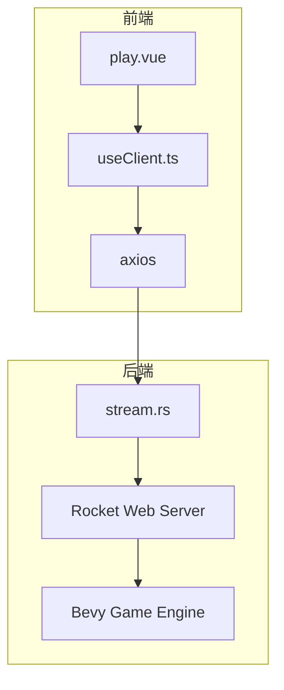

**图表来源**  
- [play.vue](file://apps/web/src/pages/play.vue)
- [useClient.ts](file://apps/web/src/composables/useClient.ts)
- [stream.rs](file://examples/stream.rs)

**本节来源**  
- [play.vue](file://apps/web/src/pages/play.vue)
- [stream.rs](file://examples/stream.rs)

## 核心通信机制

前后端通过HTTP API进行通信，后端使用Rocket框架提供RESTful接口，前端使用axios发送请求。通信的核心是三个主要端点：`/step`、`/render`和`/observe`，分别用于执行动作、获取渲染图像和观察游戏状态。

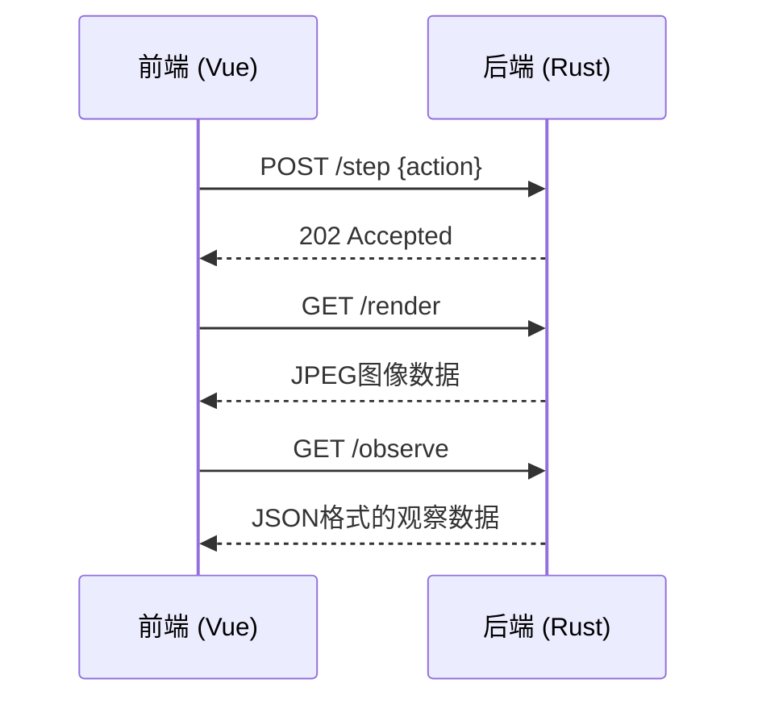

**图表来源**  
- [stream.rs](file://examples/stream.rs)
- [useClient.ts](file://apps/web/src/composables/useClient.ts)

**本节来源**  
- [stream.rs](file://examples/stream.rs)
- [useClient.ts](file://apps/web/src/composables/useClient.ts)

## API端点详解

后端通过`examples/stream.rs`文件定义了三个核心API端点，这些端点构成了前后端通信的基础。

### /step 端点

`/step`端点接收POST请求，用于向游戏引擎发送动作指令。该端点接受一个可选的`Action`对象作为JSON数据，将动作通过通道发送给Bevy应用。

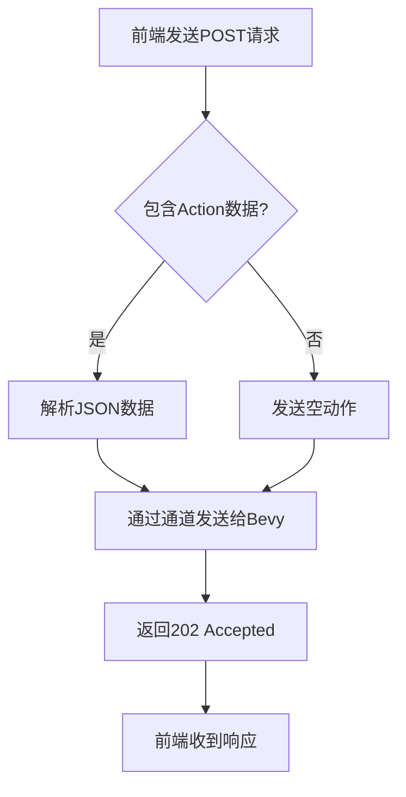

**图表来源**  
- [stream.rs](file://examples/stream.rs#L286-L300)

### /render 端点

`/render`端点提供GET请求，返回当前游戏画面的JPEG图像。后端将渲染的图像数据编码为JPEG格式，通过HTTP响应返回给前端。

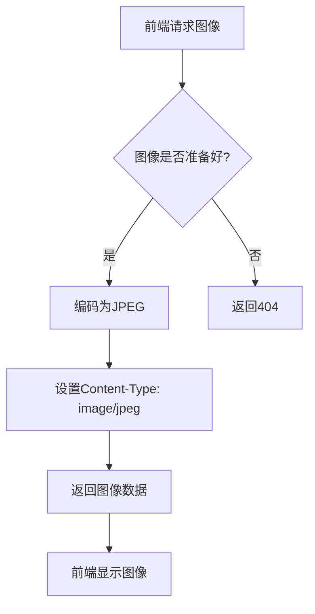

**图表来源**  
- [stream.rs](file://examples/stream.rs#L302-L315)

### /observe 端点

`/observe`端点提供GET请求，返回当前游戏状态的JSON数据。该数据包括时间戳、玩家自身状态和敌方单位状态。

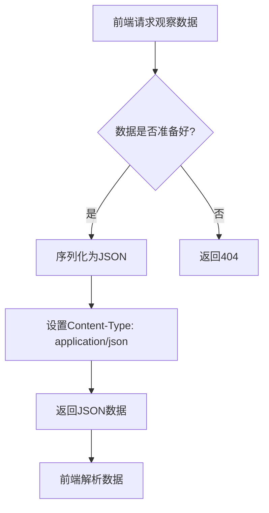

**图表来源**  
- [stream.rs](file://examples/stream.rs#L317-L327)

**本节来源**  
- [stream.rs](file://examples/stream.rs#L286-L327)

## 前端请求实现

前端在`apps/web/src/composables/useClient.ts`中实现了与后端通信的逻辑，使用axios库发送HTTP请求。

### HTTP客户端配置

前端使用axios创建了一个HTTP客户端，配置了基础URL，该URL从环境变量中读取。

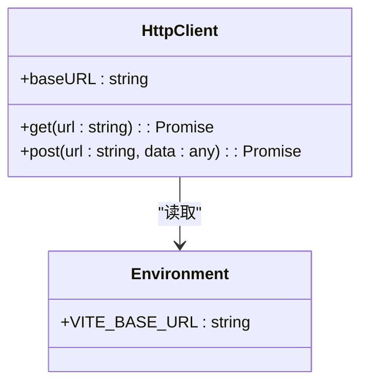

**图表来源**  
- [useClient.ts](file://apps/web/src/composables/useClient.ts#L5-L9)
- [.env.development](file://apps/web/.env.development)

### 请求方法实现

前端实现了多个请求方法，包括获取观察数据、发送动作指令和更新图像。

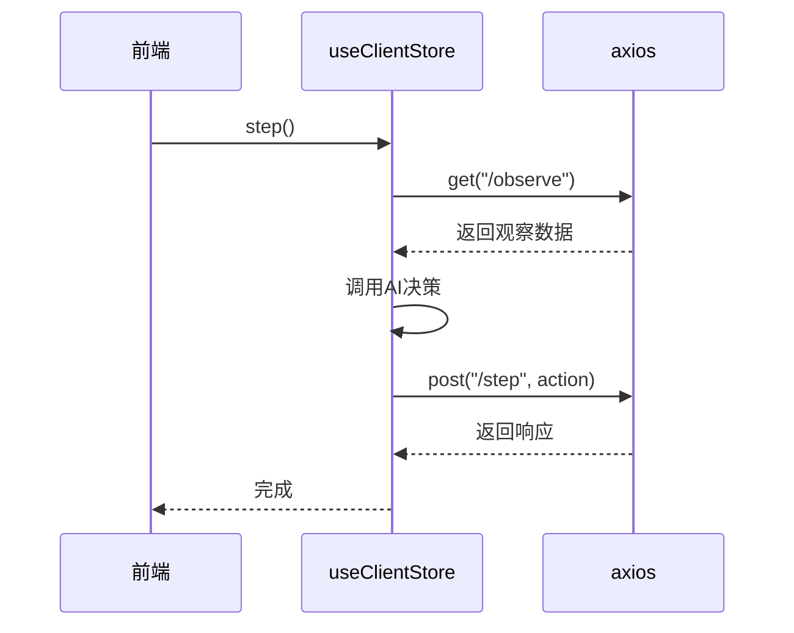

**图表来源**  
- [useClient.ts](file://apps/web/src/composables/useClient.ts#L157-L184)

**本节来源**  
- [useClient.ts](file://apps/web/src/composables/useClient.ts)
- [.env.development](file://apps/web/.env.development)

## 数据序列化与类型映射

前后端之间的数据交换需要确保类型的一致性，通过TypeScript类型定义和Rust的Serde库实现。

### 前端TypeScript类型

前端定义了与后端对应的数据类型，确保类型安全。

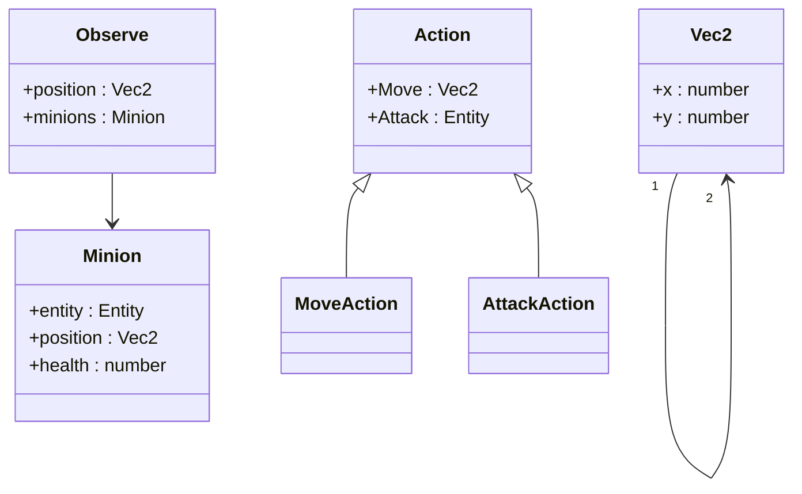

**图表来源**  
- [useClient.ts](file://apps/web/src/composables/useClient.ts#L11-L24)

### 后端Rust类型

后端使用Serde库进行序列化和反序列化，确保与前端的数据格式兼容。

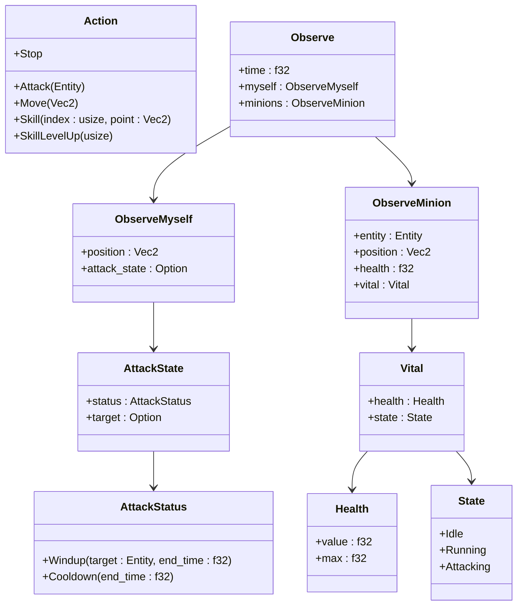

**图表来源**  
- [stream.rs](file://examples/stream.rs#L261-L280)
- [action.rs](file://src/core/action.rs#L49-L56)
- [attack.rs](file://src/core/attack.rs#L57-L76)
- [life.rs](file://src/core/life.rs#L16-L21)
- [base/state.rs](file://src/core/base/state.rs#L16-L22)

**本节来源**  
- [useClient.ts](file://apps/web/src/composables/useClient.ts#L11-L24)
- [stream.rs](file://examples/stream.rs#L261-L280)
- [action.rs](file://src/core/action.rs#L49-L56)

## 游戏状态轮询与帧同步

在`play.vue`组件中实现了游戏状态的轮询和帧同步机制，确保前端能够实时获取游戏状态。

### 轮询机制

前端通过定时器定期请求游戏状态，实现轮询机制。

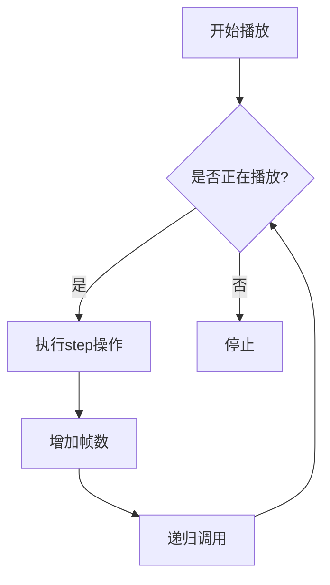

**图表来源**  
- [useClient.ts](file://apps/web/src/composables/useClient.ts#L196-L204)

### 帧同步实现

通过`thinkFrame`变量控制AI决策的频率，实现帧同步。

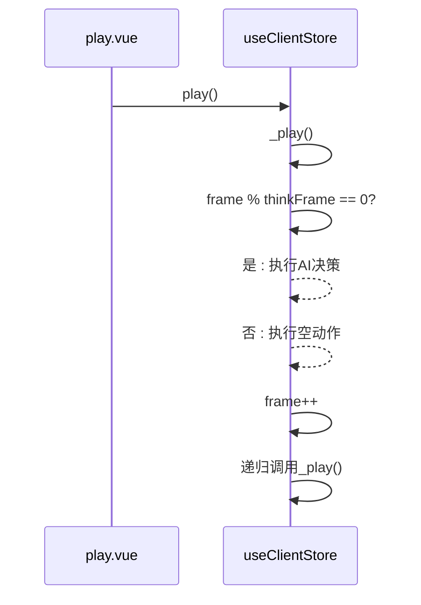

**图表来源**  
- [play.vue](file://apps/web/src/pages/play.vue)
- [useClient.ts](file://apps/web/src/composables/useClient.ts#L196-L204)

**本节来源**  
- [play.vue](file://apps/web/src/pages/play.vue)
- [useClient.ts](file://apps/web/src/composables/useClient.ts#L196-L204)

## 健壮性策略

为了确保通信的可靠性，实现了一系列健壮性策略，包括请求拦截、错误重试和超时处理。

### 错误处理

在请求过程中捕获异常，确保即使请求失败也不会导致应用崩溃。

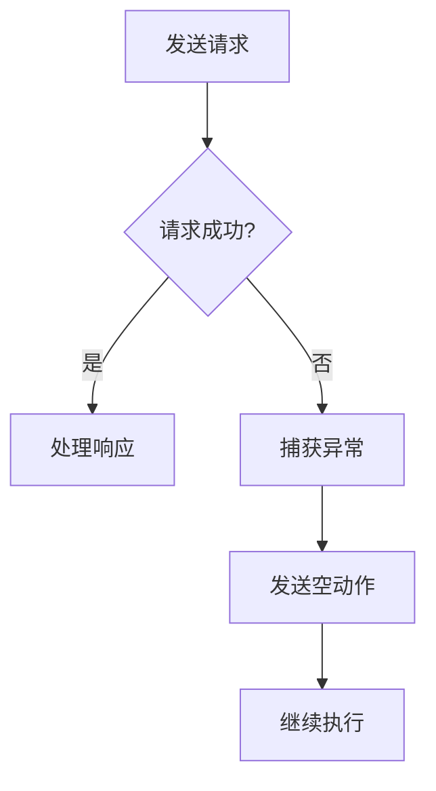

**图表来源**  
- [useClient.ts](file://apps/web/src/composables/useClient.ts#L181-L183)

### 请求拦截

通过axios拦截器可以统一处理请求和响应，添加认证信息或日志记录。

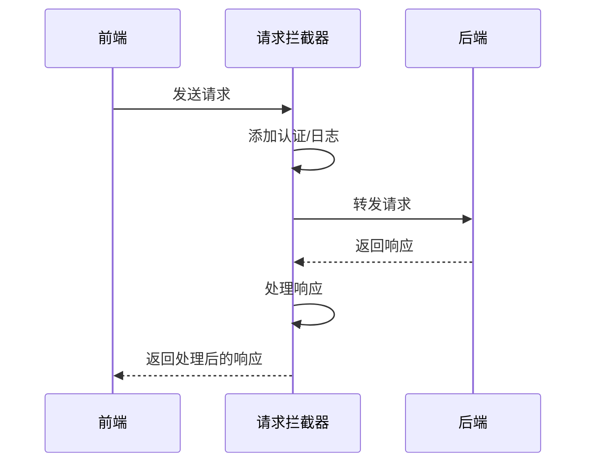

**本节来源**  
- [useClient.ts](file://apps/web/src/composables/useClient.ts#L181-L183)

## 错误处理与调试

系统实现了完善的错误处理和调试机制，确保问题能够被及时发现和解决。

### 后端日志

后端通过`info!`宏记录关键操作的日志，便于调试和监控。

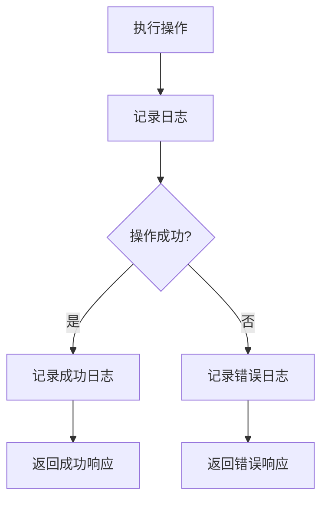

**图表来源**  
- [stream.rs](file://examples/stream.rs)

### 前端状态监控

前端通过Pinia状态管理库监控应用状态，便于调试和用户反馈。

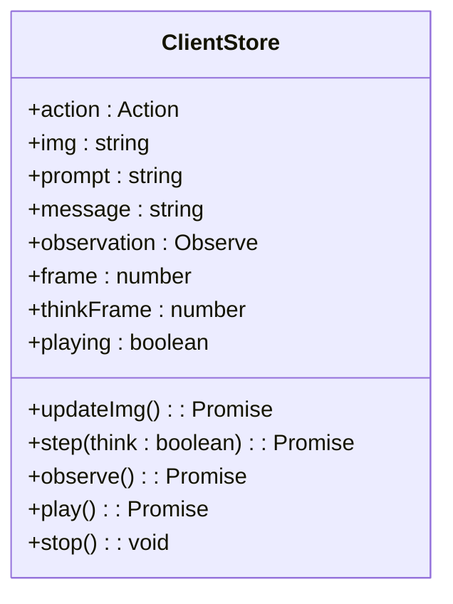

**图表来源**  
- [useClient.ts](file://apps/web/src/composables/useClient.ts#L110-L224)

**本节来源**  
- [stream.rs](file://examples/stream.rs)
- [useClient.ts](file://apps/web/src/composables/useClient.ts#L110-L224)