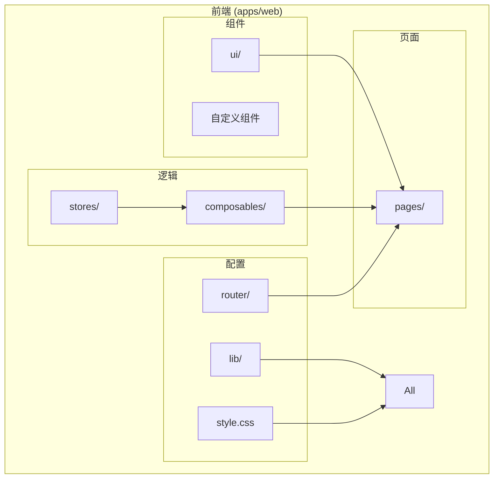
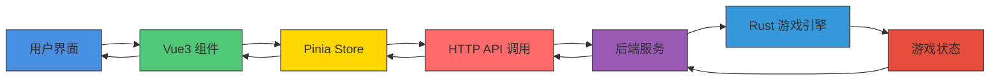
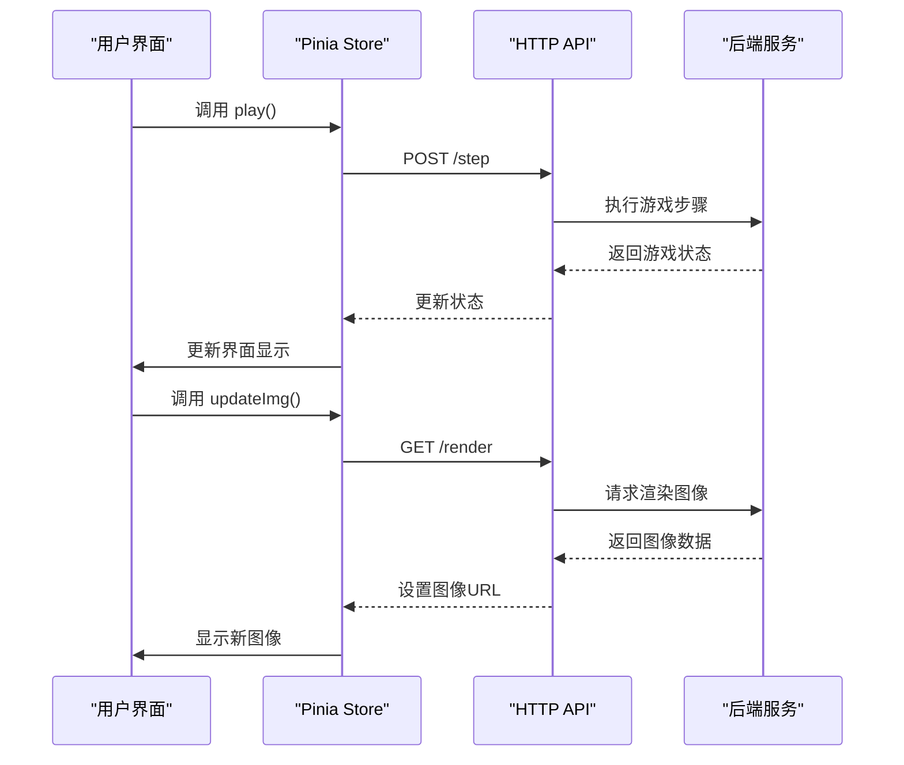
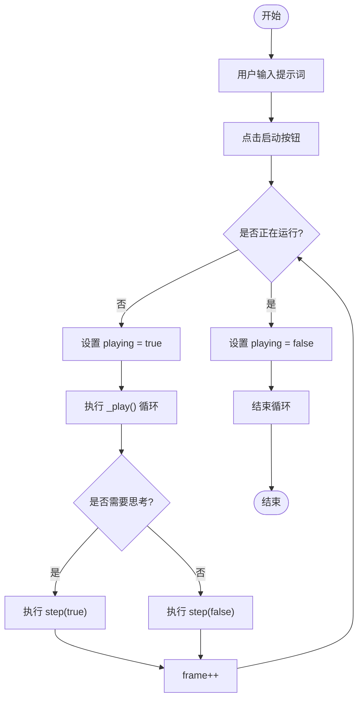
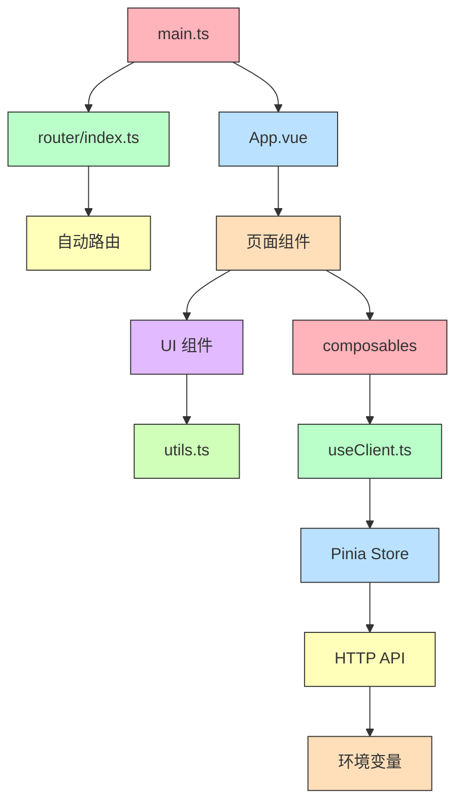

# 前端功能扩展

<cite>
**本文档引用的文件**  
- [Button.vue](file://apps/web/src/components/ui/button/Button.vue)
- [Card.vue](file://apps/web/src/components/ui/card/Card.vue)
- [index.ts](file://apps/web/src/components/ui/button/index.ts)
- [index.ts](file://apps/web/src/components/ui/card/index.ts)
- [play.vue](file://apps/web/src/pages/play.vue)
- [index.vue](file://apps/web/src/pages/index.vue)
- [index.ts](file://apps/web/src/router/index.ts)
- [main.ts](file://apps/web/src/main.ts)
- [style.css](file://apps/web/src/style.css)
- [utils.ts](file://apps/web/src/lib/utils.ts)
- [useClient.ts](file://apps/web/src/composables/useClient.ts)
- [vite.config.ts](file://apps/web/vite.config.ts)
- [.env.development](file://apps/web/.env.development)
</cite>

## 目录
1. [项目结构](#项目结构)
2. [核心组件](#核心组件)
3. [架构概述](#架构概述)
4. [详细组件分析](#详细组件分析)
5. [依赖分析](#依赖分析)
6. [性能考虑](#性能考虑)
7. [故障排除指南](#故障排除指南)
8. [结论](#结论)

## 项目结构

该项目采用模块化前端架构，主要分为组件、页面、路由、状态管理和工具库等部分。前端位于 `apps/web/` 目录下，使用 Vue3 和 Vite 构建，结合 TailwindCSS 实现现代化 UI 样式。

**Diagram sources**
- [Button.vue](file://apps/web/src/components/ui/button/Button.vue)
- [Card.vue](file://apps/web/src/components/ui/card/Card.vue)
- [play.vue](file://apps/web/src/pages/play.vue)
- [index.vue](file://apps/web/src/pages/index.vue)

**Section sources**
- [Button.vue](file://apps/web/src/components/ui/button/Button.vue)
- [Card.vue](file://apps/web/src/components/ui/card/Card.vue)
- [play.vue](file://apps/web/src/pages/play.vue)
- [index.vue](file://apps/web/src/pages/index.vue)

## 核心组件

项目中的核心UI组件遵循统一的设计规范，使用 Composition API 和 TypeScript 类型定义。所有组件都通过 `cn` 工具函数合并 TailwindCSS 类名，确保样式一致性。组件采用可组合的设计模式，支持通过 `as` 和 `as-child` 属性进行元素类型定制。

**Section sources**
- [Button.vue](file://apps/web/src/components/ui/button/Button.vue)
- [Card.vue](file://apps/web/src/components/ui/card/Card.vue)
- [utils.ts](file://apps/web/src/lib/utils.ts)

## 架构概述

系统采用前后端分离架构，前端基于 Vue3 框架构建，使用 Pinia 进行状态管理，Vue Router 实现路由控制。前端通过 HTTP API 与后端进行通信，获取游戏状态和执行操作。

**Diagram sources**
- [main.ts](file://apps/web/src/main.ts)
- [useClient.ts](file://apps/web/src/composables/useClient.ts)
- [index.ts](file://apps/web/src/router/index.ts)

**Section sources**
- [main.ts](file://apps/web/src/main.ts)
- [useClient.ts](file://apps/web/src/composables/useClient.ts)
- [index.ts](file://apps/web/src/router/index.ts)

## 详细组件分析

### 可视化面板组件分析

可视化面板组件实现了游戏状态的实时监控和交互控制，包含AI思维配置、决策日志和游戏视图三个主要区域。

#### 对于API/服务组件：

**Diagram sources**
- [play.vue](file://apps/web/src/pages/play.vue)
- [useClient.ts](file://apps/web/src/composables/useClient.ts)

**Section sources**
- [play.vue](file://apps/web/src/pages/play.vue)
- [useClient.ts](file://apps/web/src/composables/useClient.ts)

### 配置工具组件分析

配置工具组件允许用户通过文本输入框注入AI提示词，并通过按钮控件控制游戏流程。

#### 对于复杂逻辑组件：

**Diagram sources**
- [play.vue](file://apps/web/src/pages/play.vue)
- [useClient.ts](file://apps/web/src/composables/useClient.ts)

**Section sources**
- [play.vue](file://apps/web/src/pages/play.vue)
- [useClient.ts](file://apps/web/src/composables/useClient.ts)

## 依赖分析

项目依赖关系清晰，前端组件之间通过标准的 Vue 组件导入机制进行引用，状态管理通过 Pinia 实现集中式管理。

**Diagram sources**
- [main.ts](file://apps/web/src/main.ts)
- [vite.config.ts](file://apps/web/vite.config.ts)
- [package.json](file://apps/web/package.json)

**Section sources**
- [main.ts](file://apps/web/src/main.ts)
- [vite.config.ts](file://apps/web/vite.config.ts)
- [.env.development](file://apps/web/.env.development)

## 性能考虑

前端性能优化主要体现在以下几个方面：使用虚拟滚动减少DOM节点数量、通过Pinia持久化存储避免重复计算、利用Vite的按需编译特性加快开发构建速度。HTTP请求通过 axios 进行管理，支持请求拦截和响应缓存。UI渲染采用 Vue3 的响应式系统，确保只有受影响的组件才会重新渲染。

## 故障排除指南

常见问题包括API连接失败、图像无法加载和状态不同步。检查 `.env.development` 文件中的 `VITE_BASE_URL` 配置是否正确指向后端服务。确保后端服务正在运行并监听正确的端口。如果遇到样式问题，检查 TailwindCSS 类名是否正确应用，以及 `cn` 工具函数是否正常工作。对于状态管理问题，验证 Pinia store 的持久化配置是否正确设置。

**Section sources**
- [.env.development](file://apps/web/.env.development)
- [useClient.ts](file://apps/web/src/composables/useClient.ts)
- [main.ts](file://apps/web/src/main.ts)

## 结论

本项目提供了一个完整的前端扩展框架，支持添加可视化面板、配置工具和调试控制台等新功能。通过遵循现有的UI组件规范和架构模式，开发者可以快速集成新功能到现有系统中。建议在开发新组件时参考 `Button.vue` 和 `Card.vue` 的实现方式，使用相同的类型定义和样式约定，确保整体一致性。