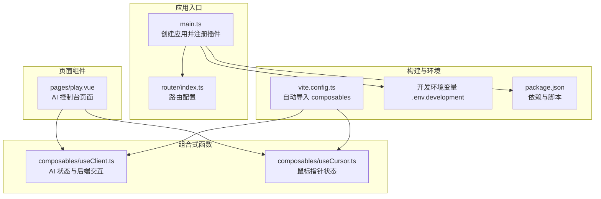
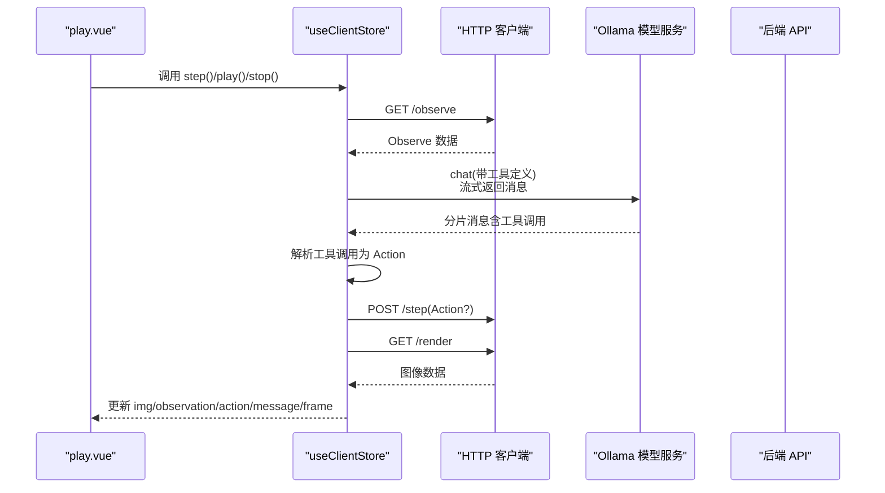
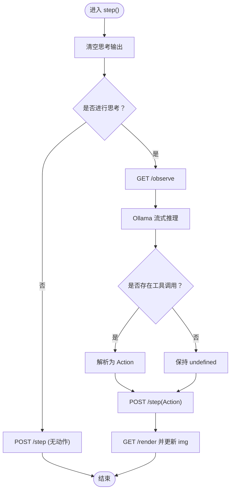
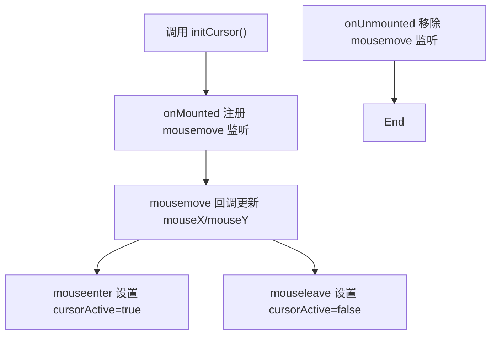
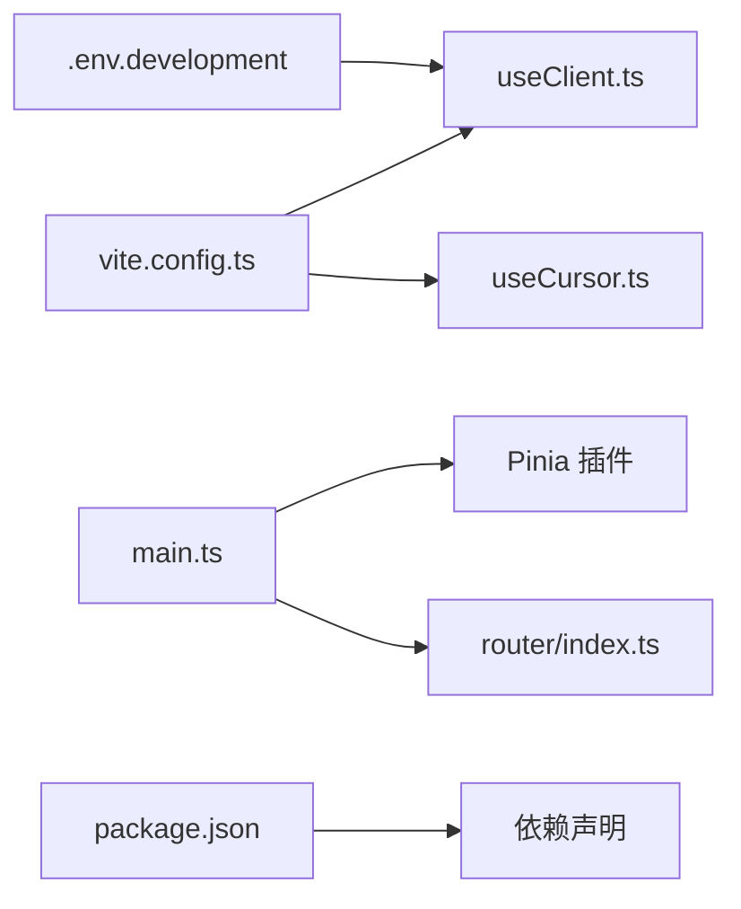

# 前端状态管理

<cite>
**本文引用的文件列表**
- [useClient.ts](file://apps/web/src/composables/useClient.ts)
- [useCursor.ts](file://apps/web/src/composables/useCursor.ts)
- [play.vue](file://apps/web/src/pages/play.vue)
- [main.ts](file://apps/web/src/main.ts)
- [index.ts](file://apps/web/src/router/index.ts)
- [vite.config.ts](file://apps/web/vite.config.ts)
- [.env.development](file://apps/web/.env.development)
- [package.json](file://apps/web/package.json)
</cite>

## 目录
1. [引言](#引言)
2. [项目结构](#项目结构)
3. [核心组件](#核心组件)
4. [架构总览](#架构总览)
5. [详细组件分析](#详细组件分析)
6. [依赖关系分析](#依赖关系分析)
7. [性能考量](#性能考量)
8. [故障排查指南](#故障排查指南)
9. [结论](#结论)
10. [附录](#附录)

## 引言
本文件围绕当前项目中的“组合式函数（composables）+ Pinia Store”的状态管理模式展开，重点解释如何通过组合式函数封装可复用的响应式逻辑，并在组件间共享状态；同时对比传统 Pinia Store 的使用方式，给出在新功能中创建自定义 composables 的最佳实践，涵盖响应式变量定义、副作用处理（watch、onMounted 等）、与 Vue 生命周期的集成、与后端 API 的状态同步（连接状态、数据缓存、错误处理），以及 TypeScript 类型推断与错误边界处理的建议。

## 项目结构
前端应用采用 Vue 3 + Vite + Pinia 架构，路由基于 vue-router auto-routes 生成布局。项目通过自动导入插件将 composables 目录下的函数自动注入到模板与脚本中，减少样板代码。状态管理既可使用 Pinia Store，也可通过组合式函数直接暴露响应式状态供组件使用。

图表来源
- [main.ts](file://apps/web/src/main.ts#L1-L16)
- [index.ts](file://apps/web/src/router/index.ts#L1-L14)
- [play.vue](file://apps/web/src/pages/play.vue#L228-L235)
- [useClient.ts](file://apps/web/src/composables/useClient.ts#L1-L231)
- [useCursor.ts](file://apps/web/src/composables/useCursor.ts#L1-L39)
- [vite.config.ts](file://apps/web/vite.config.ts#L1-L36)
- [.env.development](file://apps/web/.env.development#L1-L1)
- [package.json](file://apps/web/package.json#L1-L53)

章节来源
- [main.ts](file://apps/web/src/main.ts#L1-L16)
- [index.ts](file://apps/web/src/router/index.ts#L1-L14)
- [vite.config.ts](file://apps/web/vite.config.ts#L1-L36)
- [.env.development](file://apps/web/.env.development#L1-L1)
- [package.json](file://apps/web/package.json#L1-L53)

## 核心组件
- useClient.ts：封装 AI 推理与游戏控制的完整流程，包含观察、思考、决策、执行、渲染更新等状态与方法，以 Pinia Store 形式对外暴露。
- useCursor.ts：封装全局鼠标位置与激活状态，提供初始化与事件绑定的生命周期钩子。
- play.vue：页面级组件，直接消费 useClientStore 的状态与方法，完成 UI 与业务逻辑的绑定。

章节来源
- [useClient.ts](file://apps/web/src/composables/useClient.ts#L1-L231)
- [useCursor.ts](file://apps/web/src/composables/useCursor.ts#L1-L39)
- [play.vue](file://apps/web/src/pages/play.vue#L228-L235)

## 架构总览
下图展示了页面组件与组合式函数之间的交互关系，以及与后端服务的通信路径。

图表来源
- [play.vue](file://apps/web/src/pages/play.vue#L228-L235)
- [useClient.ts](file://apps/web/src/composables/useClient.ts#L62-L105)
- [useClient.ts](file://apps/web/src/composables/useClient.ts#L152-L209)

## 详细组件分析

### useClient.ts 设计模式与状态管理
- 响应式状态
  - 使用 ref 定义帧计数、思考间隔、播放状态、图像 URL、观察数据、动作、提示词、思考输出等。
  - 通过 defineStore 返回状态与方法，便于在组件中直接解构使用。
- 副作用与生命周期
  - 在 store 内部通过递归异步循环实现自动播放，内部维护 playing 标志位控制循环终止。
  - 未直接使用 watch/onMounted 等生命周期钩子，但可在 store 中按需引入。
- 与后端 API 的交互
  - 通过 axios 创建带基础路径的客户端，统一访问 /observe、/step、/render。
  - 通过 Ollama 流式聊天接口获取推理结果，解析工具调用生成 Action。
- 错误处理
  - 在推理或执行阶段出现异常时，回退为不带动作的步进请求，保证系统鲁棒性。
- 类型安全
  - 明确导出 Observe、Action、Vec2 等类型，确保前后端数据契约一致。
- 持久化
  - 使用 Pinia 持久化插件，仅持久化 prompt 字段，避免存储大对象。

图表来源
- [useClient.ts](file://apps/web/src/composables/useClient.ts#L152-L209)
- [useClient.ts](file://apps/web/src/composables/useClient.ts#L62-L105)

章节来源
- [useClient.ts](file://apps/web/src/composables/useClient.ts#L1-L231)

### useCursor.ts 设计模式与生命周期集成
- 响应式状态
  - 鼠标 X/Y 坐标与激活状态均使用 ref 暴露。
- 生命周期钩子
  - 提供 initCursor 方法，在 onMounted/onUnmounted 中注册/移除窗口级 mousemove 事件监听。
- 复用性
  - 通过返回对象形式暴露状态与方法，便于在多个组件中复用。

图表来源
- [useCursor.ts](file://apps/web/src/composables/useCursor.ts#L1-L39)

章节来源
- [useCursor.ts](file://apps/web/src/composables/useCursor.ts#L1-L39)

### 页面组件与组合式函数的绑定
- play.vue 直接从 composables 导入 useClientStore，并在模板中绑定状态与按钮事件。
- 该模式体现了“组合式函数 + Pinia Store”的混合使用：store 负责跨组件共享的状态与方法，组件负责 UI 层的展示与交互。

章节来源
- [play.vue](file://apps/web/src/pages/play.vue#L228-L235)

## 依赖关系分析
- 构建与自动导入
  - vite.config.ts 配置了自动导入目录为 composables，使模板与脚本中无需显式 import 组合式函数。
- 应用注册
  - main.ts 创建并挂载应用，注册路由与 Pinia，并启用持久化插件。
- 环境变量
  - .env.development 提供后端基础地址，用于 axios 客户端的基础路径拼接。
- 依赖库
  - axios、ollama、pinia、pinia-plugin-persistedstate 等为状态管理与后端通信提供支撑。

图表来源
- [vite.config.ts](file://apps/web/vite.config.ts#L1-L36)
- [main.ts](file://apps/web/src/main.ts#L1-L16)
- [index.ts](file://apps/web/src/router/index.ts#L1-L14)
- [.env.development](file://apps/web/.env.development#L1-L1)
- [package.json](file://apps/web/package.json#L1-L53)

章节来源
- [vite.config.ts](file://apps/web/vite.config.ts#L1-L36)
- [main.ts](file://apps/web/src/main.ts#L1-L16)
- [index.ts](file://apps/web/src/router/index.ts#L1-L14)
- [.env.development](file://apps/web/.env.development#L1-L1)
- [package.json](file://apps/web/package.json#L1-L53)

## 性能考量
- 自动播放循环
  - store 内部通过递归异步循环实现自动播放，注意在 playing=false 时及时退出，避免无谓的网络请求与渲染。
- 请求频率控制
  - thinkFrame 控制思考频率，避免频繁调用推理接口；可根据实际需求调整。
- 图像更新策略
  - /render 接口每次拉取最新帧，建议在组件层增加节流或条件更新，避免频繁重绘。
- 流式推理
  - Ollama 流式返回会逐步更新 message，建议在组件层进行增量渲染，避免全量重绘。

章节来源
- [useClient.ts](file://apps/web/src/composables/useClient.ts#L191-L209)
- [useClient.ts](file://apps/web/src/composables/useClient.ts#L110-L116)

## 故障排查指南
- 后端不可达
  - 现象：/observe 或 /step 请求失败。
  - 排查：确认 .env.development 中 VITE_BASE_URL 指向正确后端地址；检查后端服务是否启动。
- 推理失败
  - 现象：Ollama 流式推理中断或未返回工具调用。
  - 排查：检查模型名称与工具定义；确认网络连通性；查看 message 是否为空。
- 图像不更新
  - 现象：点击刷新后 img 仍为空。
  - 排查：确认 /render 接口返回有效数据；检查时间戳参数是否生效；确认浏览器缓存策略。
- 持久化问题
  - 现象：刷新后提示词未恢复。
  - 排查：确认 Pinia 持久化插件已启用；检查持久化 pick 配置。

章节来源
- [.env.development](file://apps/web/.env.development#L1-L1)
- [useClient.ts](file://apps/web/src/composables/useClient.ts#L152-L209)
- [useClient.ts](file://apps/web/src/composables/useClient.ts#L226-L231)

## 结论
本项目采用“组合式函数 + Pinia Store”的混合模式：组合式函数负责封装可复用的响应式逻辑与副作用，Store 负责跨组件共享状态与持久化。useClient.ts 展示了如何在 store 内部组织与后端的完整交互流程，useCursor.ts 展示了如何在组合式函数中正确集成生命周期钩子。对于新功能，建议优先考虑组合式函数封装通用逻辑，必要时再通过 store 进行跨组件共享与持久化。

## 附录

### 新功能创建自定义 composables 的最佳实践
- 响应式变量定义
  - 使用 ref/reactive 定义状态，尽量将状态收敛在组合式函数内部，通过返回值暴露必要的状态与方法。
- 副作用处理
  - 对于 DOM 事件、定时器、WebSocket 等，应在组合式函数内部注册/清理，必要时提供 initXxx 方法供组件调用。
- 与 Vue 生命周期集成
  - 在组合式函数中使用 onMounted/onUnmounted/onUpdated 等钩子，确保资源的正确释放与订阅的建立。
- 与后端 API 的状态同步
  - 使用 axios 创建带基础路径的客户端，集中处理错误与重试；对长耗时操作提供 loading 状态与超时控制。
  - 对于流式数据（如推理过程），采用增量更新策略，避免全量重绘。
- TypeScript 类型推断
  - 明确导出数据结构类型，确保前后端契约一致；在组合式函数中使用类型注解，提升可维护性。
- 错误边界处理
  - 在组合式函数内部捕获异常并提供降级策略（如回退为无动作步进），保证系统稳定性；在组件层提供用户可见的错误提示。

章节来源
- [useClient.ts](file://apps/web/src/composables/useClient.ts#L1-L231)
- [useCursor.ts](file://apps/web/src/composables/useCursor.ts#L1-L39)
- [vite.config.ts](file://apps/web/vite.config.ts#L1-L36)
- [main.ts](file://apps/web/src/main.ts#L1-L16)
- [.env.development](file://apps/web/.env.development#L1-L1)
- [package.json](file://apps/web/package.json#L1-L53)