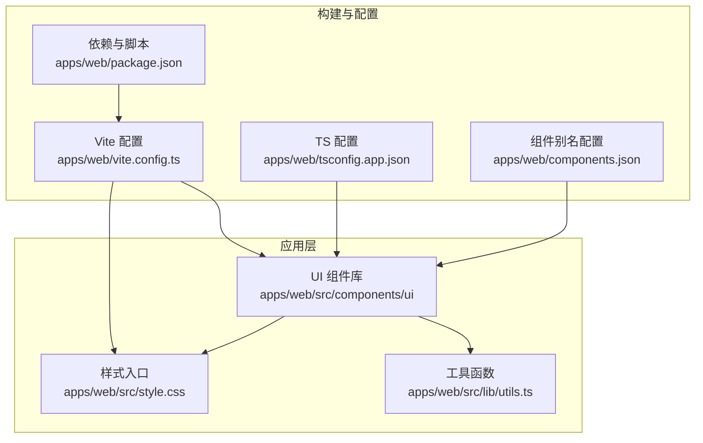
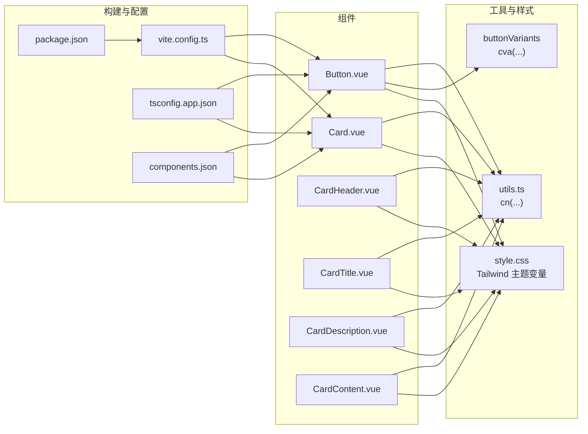
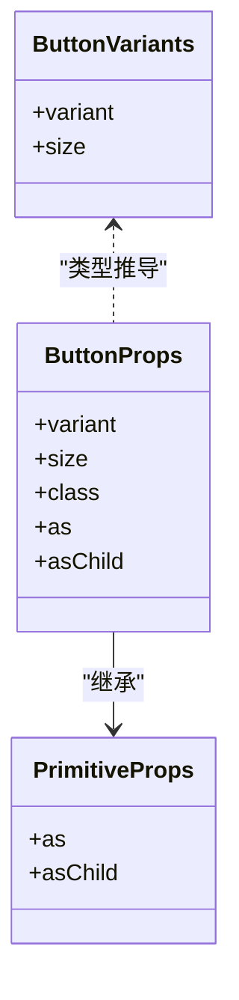
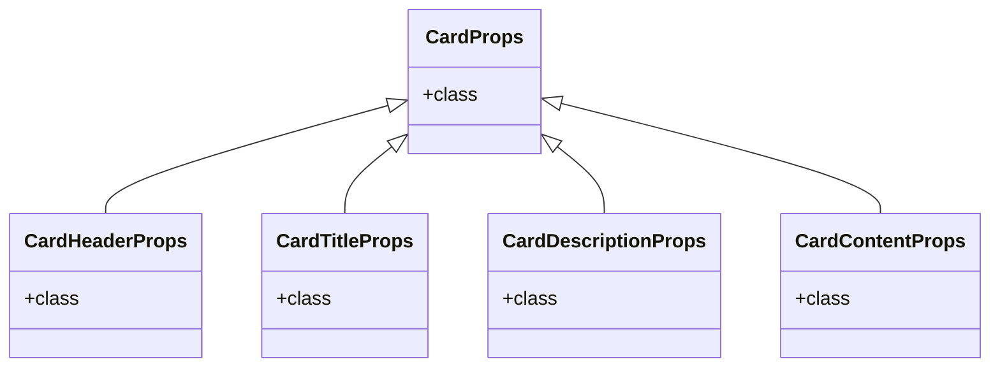
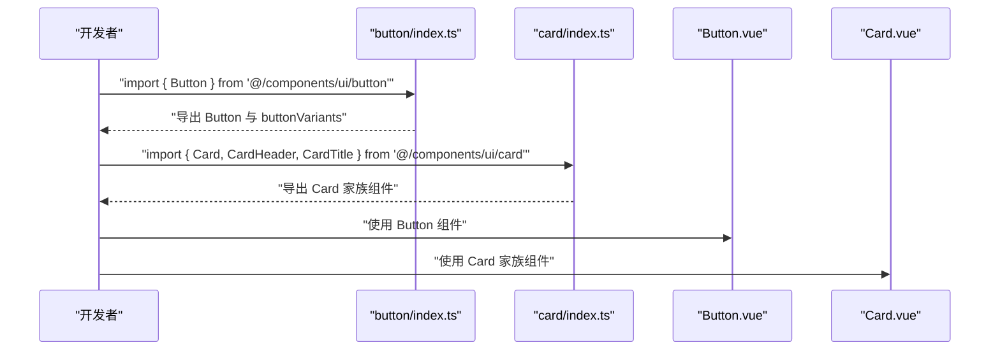
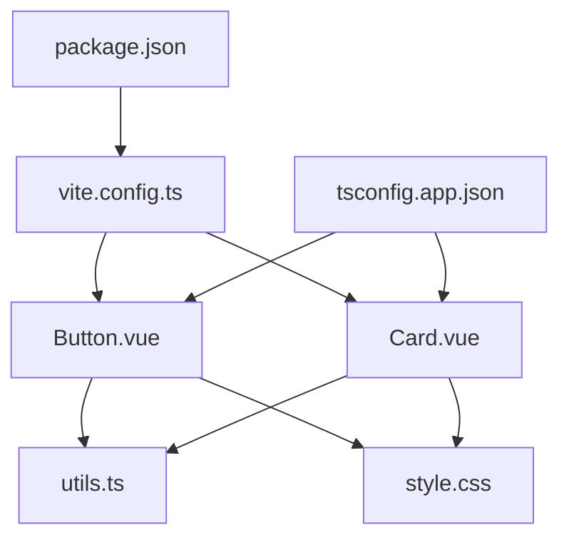

# 前端组件开发

<cite>
**本文引用的文件**
- [apps/web/src/components/ui/button/Button.vue](file://apps/web/src/components/ui/button/Button.vue)
- [apps/web/src/components/ui/button/index.ts](file://apps/web/src/components/ui/button/index.ts)
- [apps/web/src/components/ui/card/Card.vue](file://apps/web/src/components/ui/card/Card.vue)
- [apps/web/src/components/ui/card/CardHeader.vue](file://apps/web/src/components/ui/card/CardHeader.vue)
- [apps/web/src/components/ui/card/CardTitle.vue](file://apps/web/src/components/ui/card/CardTitle.vue)
- [apps/web/src/components/ui/card/CardDescription.vue](file://apps/web/src/components/ui/card/CardDescription.vue)
- [apps/web/src/components/ui/card/CardContent.vue](file://apps/web/src/components/ui/card/CardContent.vue)
- [apps/web/src/components/ui/card/index.ts](file://apps/web/src/components/ui/card/index.ts)
- [apps/web/src/lib/utils.ts](file://apps/web/src/lib/utils.ts)
- [apps/web/src/style.css](file://apps/web/src/style.css)
- [apps/web/vite.config.ts](file://apps/web/vite.config.ts)
- [apps/web/package.json](file://apps/web/package.json)
- [apps/web/tsconfig.app.json](file://apps/web/tsconfig.app.json)
- [apps/web/components.json](file://apps/web/components.json)
</cite>

## 目录
1. [引言](#引言)
2. [项目结构](#项目结构)
3. [核心组件](#核心组件)
4. [架构总览](#架构总览)
5. [详细组件分析](#详细组件分析)
6. [依赖关系分析](#依赖关系分析)
7. [性能与可维护性建议](#性能与可维护性建议)
8. [故障排查指南](#故障排查指南)
9. [结论](#结论)
10. [附录](#附录)

## 引言
本文件面向在 Vue3 组合式 API 与 TypeScript 环境下开发 UI 组件的工程师，围绕 Button 与 Card 两个典型组件，系统讲解组件结构、props 定义、事件触发机制、样式集成（TailwindCSS 原子化）、按需导出（index.ts）、TypeScript 接口定义、插槽（slot）与动态类名绑定、响应式数据流、热重载调试以及无障碍（a11y）实践。文中所有技术细节均基于仓库现有实现进行归纳总结，确保读者能直接复用到实际项目中。

## 项目结构
本项目采用“功能域+分层”的组织方式：
- 组件集中在 apps/web/src/components/ui 下，按功能拆分子目录（如 button、card），每个子目录包含组件文件与统一的 index.ts 导出入口。
- 样式通过 TailwindCSS 与自定义 CSS 变量、工具类共同构建主题体系。
- 构建与开发由 Vite 驱动，配合自动导入与组件自动注册插件，提升开发效率。
- 类名合并工具 cn 提供了对 Tailwind 冲突类名的智能合并能力。

图表来源
- [apps/web/src/components/ui/button/Button.vue](file://apps/web/src/components/ui/button/Button.vue#L1-L30)
- [apps/web/src/components/ui/card/Card.vue](file://apps/web/src/components/ui/card/Card.vue#L1-L18)
- [apps/web/src/lib/utils.ts](file://apps/web/src/lib/utils.ts#L1-L9)
- [apps/web/src/style.css](file://apps/web/src/style.css#L1-L265)
- [apps/web/vite.config.ts](file://apps/web/vite.config.ts#L1-L37)
- [apps/web/package.json](file://apps/web/package.json#L1-L53)
- [apps/web/tsconfig.app.json](file://apps/web/tsconfig.app.json#L1-L23)
- [apps/web/components.json](file://apps/web/components.json#L1-L21)

章节来源
- [apps/web/vite.config.ts](file://apps/web/vite.config.ts#L1-L37)
- [apps/web/package.json](file://apps/web/package.json#L1-L53)
- [apps/web/tsconfig.app.json](file://apps/web/tsconfig.app.json#L1-L23)
- [apps/web/components.json](file://apps/web/components.json#L1-L21)

## 核心组件
本节聚焦 Button 与 Card 的设计模式与实现要点，帮助你快速理解如何在 Vue3 + TypeScript 中规范地开发 UI 组件。

- Button 组件
  - 使用组合式 API 与 TypeScript，通过 withDefaults 为原生属性提供默认值，保证语义化标签与可访问性。
  - 通过 Primitive 组件与 reka-ui 的 PrimitiveProps 实现语义化标签透传，便于无障碍与可组合性。
  - 使用 cva 生成变体类名，结合 cn 合并用户传入的 class，实现“默认样式 + 用户覆盖”的灵活策略。
  - 支持插槽 slot，用于承载按钮内容（文本或图标等）。

- Card 组件族
  - Card 作为容器，负责基础边框、背景与阴影；其余子组件（Header、Title、Description、Content）各自承担语义化与排版职责。
  - 每个子组件均通过 cn 合并 props.class，保持一致的扩展性与可定制性。
  - 通过统一的 index.ts 导出，支持按需引入与 Tree Shaking。

章节来源
- [apps/web/src/components/ui/button/Button.vue](file://apps/web/src/components/ui/button/Button.vue#L1-L30)
- [apps/web/src/components/ui/button/index.ts](file://apps/web/src/components/ui/button/index.ts#L1-L37)
- [apps/web/src/components/ui/card/Card.vue](file://apps/web/src/components/ui/card/Card.vue#L1-L18)
- [apps/web/src/components/ui/card/CardHeader.vue](file://apps/web/src/components/ui/card/CardHeader.vue#L1-L16)
- [apps/web/src/components/ui/card/CardTitle.vue](file://apps/web/src/components/ui/card/CardTitle.vue#L1-L16)
- [apps/web/src/components/ui/card/CardDescription.vue](file://apps/web/src/components/ui/card/CardDescription.vue#L1-L16)
- [apps/web/src/components/ui/card/CardContent.vue](file://apps/web/src/components/ui/card/CardContent.vue#L1-L16)
- [apps/web/src/components/ui/card/index.ts](file://apps/web/src/components/ui/card/index.ts#L1-L5)

## 架构总览
下图展示了组件与工具、样式、构建之间的交互关系，体现“组件 -> 工具 -> 样式 -> 构建”的单向依赖链路，确保样式与类名合并逻辑集中管理，降低耦合度。

图表来源
- [apps/web/src/components/ui/button/Button.vue](file://apps/web/src/components/ui/button/Button.vue#L1-L30)
- [apps/web/src/components/ui/button/index.ts](file://apps/web/src/components/ui/button/index.ts#L1-L37)
- [apps/web/src/components/ui/card/Card.vue](file://apps/web/src/components/ui/card/Card.vue#L1-L18)
- [apps/web/src/components/ui/card/CardHeader.vue](file://apps/web/src/components/ui/card/CardHeader.vue#L1-L16)
- [apps/web/src/components/ui/card/CardTitle.vue](file://apps/web/src/components/ui/card/CardTitle.vue#L1-L16)
- [apps/web/src/components/ui/card/CardDescription.vue](file://apps/web/src/components/ui/card/CardDescription.vue#L1-L16)
- [apps/web/src/components/ui/card/CardContent.vue](file://apps/web/src/components/ui/card/CardContent.vue#L1-L16)
- [apps/web/src/lib/utils.ts](file://apps/web/src/lib/utils.ts#L1-L9)
- [apps/web/src/style.css](file://apps/web/src/style.css#L1-L265)
- [apps/web/vite.config.ts](file://apps/web/vite.config.ts#L1-L37)
- [apps/web/package.json](file://apps/web/package.json#L1-L53)
- [apps/web/tsconfig.app.json](file://apps/web/tsconfig.app.json#L1-L23)
- [apps/web/components.json](file://apps/web/components.json#L1-L21)

## 详细组件分析

### Button 组件分析
- 组件结构
  - 使用 script setup 与 TypeScript，通过 withDefaults 为原生属性设置默认值，确保渲染为语义化按钮元素。
  - 通过 Primitive 与 PrimitiveProps 透传原生属性，增强可访问性与可组合性。
- Props 定义
  - 继承 PrimitiveProps，支持 as、asChild 等原生语义化属性。
  - 新增 variant、size、class 等可选属性，用于控制外观与尺寸。
- 事件触发机制
  - 当前 Button.vue 未显式声明 emits，但通过 Primitive 透传原生事件（如 click、keydown 等），可直接在父组件监听。
- 样式集成
  - 使用 buttonVariants 生成变体类名，结合 cn 合并用户传入的 class，实现“默认样式 + 用户覆盖”。
  - 变体包含多种视觉风格与尺寸，满足不同场景需求。
- 插槽与动态类名
  - 使用默认插槽承载内容；通过 :class 动态绑定 cn(...) 结果，实现响应式类名更新。
- TypeScript 接口
  - Props 接口继承 PrimitiveProps 并扩展自身字段，确保类型安全。
  - 通过 VariantProps 从 cva 推导出 ButtonVariants 类型，避免手写重复类型。

图表来源
- [apps/web/src/components/ui/button/Button.vue](file://apps/web/src/components/ui/button/Button.vue#L1-L30)
- [apps/web/src/components/ui/button/index.ts](file://apps/web/src/components/ui/button/index.ts#L1-L37)

章节来源
- [apps/web/src/components/ui/button/Button.vue](file://apps/web/src/components/ui/button/Button.vue#L1-L30)
- [apps/web/src/components/ui/button/index.ts](file://apps/web/src/components/ui/button/index.ts#L1-L37)

### Card 组件族分析
- 组件结构
  - Card 作为根容器，负责基础边框、背景与阴影。
  - 子组件分别承担头部、标题、描述与内容区域的语义化与排版职责。
- Props 定义
  - 所有子组件均接收 class 属性，用于扩展样式。
- 样式集成
  - 通过 cn 合并内置类名与用户传入 class，保持一致的扩展性。
- 插槽与动态类名
  - 默认插槽承载内容；:class 动态绑定实现响应式类名。
- TypeScript 接口
  - Props 接口简单明确，仅包含 class 字段，便于扩展与维护。

图表来源
- [apps/web/src/components/ui/card/Card.vue](file://apps/web/src/components/ui/card/Card.vue#L1-L18)
- [apps/web/src/components/ui/card/CardHeader.vue](file://apps/web/src/components/ui/card/CardHeader.vue#L1-L16)
- [apps/web/src/components/ui/card/CardTitle.vue](file://apps/web/src/components/ui/card/CardTitle.vue#L1-L16)
- [apps/web/src/components/ui/card/CardDescription.vue](file://apps/web/src/components/ui/card/CardDescription.vue#L1-L16)
- [apps/web/src/components/ui/card/CardContent.vue](file://apps/web/src/components/ui/card/CardContent.vue#L1-L16)

章节来源
- [apps/web/src/components/ui/card/Card.vue](file://apps/web/src/components/ui/card/Card.vue#L1-L18)
- [apps/web/src/components/ui/card/CardHeader.vue](file://apps/web/src/components/ui/card/CardHeader.vue#L1-L16)
- [apps/web/src/components/ui/card/CardTitle.vue](file://apps/web/src/components/ui/card/CardTitle.vue#L1-L16)
- [apps/web/src/components/ui/card/CardDescription.vue](file://apps/web/src/components/ui/card/CardDescription.vue#L1-L16)
- [apps/web/src/components/ui/card/CardContent.vue](file://apps/web/src/components/ui/card/CardContent.vue#L1-L16)

### 组件导出与按需引入
- Button
  - 在 index.ts 中导出 Button 组件，并导出 buttonVariants 与其类型定义，便于外部按需引入与类型推导。
- Card
  - 在 index.ts 中导出 Card、CardHeader、CardTitle、CardDescription、CardContent，形成卡片组件族的统一入口。

图表来源
- [apps/web/src/components/ui/button/index.ts](file://apps/web/src/components/ui/button/index.ts#L1-L37)
- [apps/web/src/components/ui/card/index.ts](file://apps/web/src/components/ui/card/index.ts#L1-L5)

章节来源
- [apps/web/src/components/ui/button/index.ts](file://apps/web/src/components/ui/button/index.ts#L1-L37)
- [apps/web/src/components/ui/card/index.ts](file://apps/web/src/components/ui/card/index.ts#L1-L5)

### 样式与主题体系
- 类名合并工具 cn
  - 通过 clsx 与 tailwind-merge 实现类名冲突的智能合并，避免 Tailwind 重复类导致的覆盖问题。
- 主题变量与 Tailwind
  - style.css 中定义了丰富的 CSS 变量与自定义工具类，配合 Tailwind 使用，形成统一的主题体系。
  - 组件内部通过 cn 合并内置类名与用户传入 class，实现主题与样式的解耦。
- 变体系统
  - Button 通过 cva 定义 variant 与 size 的变体，结合 Tailwind 原子化类名，实现高内聚、低耦合的样式策略。

章节来源
- [apps/web/src/lib/utils.ts](file://apps/web/src/lib/utils.ts#L1-L9)
- [apps/web/src/style.css](file://apps/web/src/style.css#L1-L265)
- [apps/web/src/components/ui/button/index.ts](file://apps/web/src/components/ui/button/index.ts#L1-L37)

### 开发流程与热重载调试
- 开发服务器
  - 使用 Vite 启动 dev 脚本，支持热重载与模块热替换，提升迭代效率。
- 自动导入与组件注册
  - Vite 插件自动导入 Vue 与路由 API，组件自动注册减少样板代码。
- 别名与路径解析
  - 通过 tsconfig 与 vite.config 的 alias，统一 @/* 路径，简化导入路径。
- 组件别名与工具函数
  - components.json 中配置了组件别名与工具函数路径，便于在模板中正确解析。

章节来源
- [apps/web/vite.config.ts](file://apps/web/vite.config.ts#L1-L37)
- [apps/web/package.json](file://apps/web/package.json#L1-L53)
- [apps/web/tsconfig.app.json](file://apps/web/tsconfig.app.json#L1-L23)
- [apps/web/components.json](file://apps/web/components.json#L1-L21)

### 无障碍（a11y）与键盘导航
- 语义化标签与原生属性
  - Button 通过 Primitive 与 PrimitiveProps 透传原生属性（如 as、asChild），确保渲染为正确的语义化元素，利于屏幕阅读器识别。
- 键盘可达性
  - 通过 Primitive 透传原生事件（如 click、keydown），父组件可在需要时绑定键盘事件处理逻辑，确保键盘可达性。
- 视觉反馈与焦点
  - Button 的变体中包含 focus-visible 相关类名，提供清晰的焦点指示，改善键盘用户的体验。
- 建议
  - 对于需要键盘操作的组件，建议在父组件中补充键盘事件监听与状态管理，确保可访问性完整。

章节来源
- [apps/web/src/components/ui/button/Button.vue](file://apps/web/src/components/ui/button/Button.vue#L1-L30)
- [apps/web/src/components/ui/button/index.ts](file://apps/web/src/components/ui/button/index.ts#L1-L37)

## 依赖关系分析
- 组件对工具与样式的依赖
  - Button 与 Card 家族均依赖 utils.ts 的 cn 函数与 style.css 的主题变量，形成稳定的样式基础设施。
- 构建与运行时依赖
  - Vite 配置启用 TailwindCSS 插件、自动导入与组件自动注册，提升开发体验。
  - package.json 中声明了 Vue、Tailwind、class-variance-authority、clsx、tailwind-merge 等关键依赖。
- TypeScript 严格模式
  - tsconfig.app.json 启用严格模式与未使用检查，有助于在开发阶段发现潜在问题。

图表来源
- [apps/web/src/components/ui/button/Button.vue](file://apps/web/src/components/ui/button/Button.vue#L1-L30)
- [apps/web/src/components/ui/card/Card.vue](file://apps/web/src/components/ui/card/Card.vue#L1-L18)
- [apps/web/src/lib/utils.ts](file://apps/web/src/lib/utils.ts#L1-L9)
- [apps/web/src/style.css](file://apps/web/src/style.css#L1-L265)
- [apps/web/vite.config.ts](file://apps/web/vite.config.ts#L1-L37)
- [apps/web/package.json](file://apps/web/package.json#L1-L53)
- [apps/web/tsconfig.app.json](file://apps/web/tsconfig.app.json#L1-L23)

章节来源
- [apps/web/src/components/ui/button/Button.vue](file://apps/web/src/components/ui/button/Button.vue#L1-L30)
- [apps/web/src/components/ui/card/Card.vue](file://apps/web/src/components/ui/card/Card.vue#L1-L18)
- [apps/web/src/lib/utils.ts](file://apps/web/src/lib/utils.ts#L1-L9)
- [apps/web/src/style.css](file://apps/web/src/style.css#L1-L265)
- [apps/web/vite.config.ts](file://apps/web/vite.config.ts#L1-L37)
- [apps/web/package.json](file://apps/web/package.json#L1-L53)
- [apps/web/tsconfig.app.json](file://apps/web/tsconfig.app.json#L1-L23)

## 性能与可维护性建议
- 按需引入与 Tree Shaking
  - 通过各组件目录下的 index.ts 导出，结合打包器的 Tree Shaking，减少未使用代码体积。
- 类名合并策略
  - 使用 cn 合并类名，避免重复类导致的样式冲突与冗余计算。
- 变体系统
  - 使用 cva 管理变体，集中定义样式规则，降低维护成本。
- 组件职责单一
  - Card 家族按语义拆分，职责清晰，便于复用与测试。

[本节为通用建议，不直接分析具体文件]

## 故障排查指南
- 样式未生效
  - 检查 style.css 是否被正确引入，确认 TailwindCSS 插件已启用。
  - 确认 cn 合并顺序：用户传入 class 应位于末尾，以确保覆盖默认样式。
- 类名冲突
  - 使用 cn 合并类名，避免重复定义相同属性的类。
- TypeScript 报错
  - 确保 tsconfig.app.json 的 strict 模式与路径别名配置正确。
- 组件未按需引入
  - 检查各 index.ts 的导出是否完整，确保打包器支持 Tree Shaking。

章节来源
- [apps/web/src/lib/utils.ts](file://apps/web/src/lib/utils.ts#L1-L9)
- [apps/web/src/style.css](file://apps/web/src/style.css#L1-L265)
- [apps/web/vite.config.ts](file://apps/web/vite.config.ts#L1-L37)
- [apps/web/tsconfig.app.json](file://apps/web/tsconfig.app.json#L1-L23)

## 结论
本项目在 Vue3 + TypeScript 环境下，通过组合式 API、cva 变体系统、cn 类名合并与 Tailwind 原子化样式，形成了高内聚、低耦合且易于扩展的 UI 组件体系。Button 与 Card 家族体现了清晰的职责划分、一致的扩展点与良好的可访问性基础。借助 Vite 的热重载与自动导入机制，开发体验高效流畅。建议在后续扩展中继续遵循“组件单一职责 + 变体集中管理 + 类名合并策略”的原则，持续提升可维护性与一致性。

[本节为总结性内容，不直接分析具体文件]

## 附录
- 快速上手步骤
  - 在对应组件目录创建新组件与 index.ts 导出。
  - 使用 utils.ts 的 cn 合并类名，结合 cva 或 Tailwind 原子化类名。
  - 通过 Primitive 与 PrimitiveProps 透传原生属性，确保可访问性。
  - 在父组件中使用按需引入，验证热重载与样式效果。
- 参考文件
  - Button 组件与变体定义：[apps/web/src/components/ui/button/Button.vue](file://apps/web/src/components/ui/button/Button.vue#L1-L30)、[apps/web/src/components/ui/button/index.ts](file://apps/web/src/components/ui/button/index.ts#L1-L37)
  - Card 组件族与导出：[apps/web/src/components/ui/card/Card.vue](file://apps/web/src/components/ui/card/Card.vue#L1-L18)、[apps/web/src/components/ui/card/CardHeader.vue](file://apps/web/src/components/ui/card/CardHeader.vue#L1-L16)、[apps/web/src/components/ui/card/CardTitle.vue](file://apps/web/src/components/ui/card/CardTitle.vue#L1-L16)、[apps/web/src/components/ui/card/CardDescription.vue](file://apps/web/src/components/ui/card/CardDescription.vue#L1-L16)、[apps/web/src/components/ui/card/CardContent.vue](file://apps/web/src/components/ui/card/CardContent.vue#L1-L16)、[apps/web/src/components/ui/card/index.ts](file://apps/web/src/components/ui/card/index.ts#L1-L5)
  - 工具与样式：[apps/web/src/lib/utils.ts](file://apps/web/src/lib/utils.ts#L1-L9)、[apps/web/src/style.css](file://apps/web/src/style.css#L1-L265)
  - 构建与配置：[apps/web/vite.config.ts](file://apps/web/vite.config.ts#L1-L37)、[apps/web/package.json](file://apps/web/package.json#L1-L53)、[apps/web/tsconfig.app.json](file://apps/web/tsconfig.app.json#L1-L23)、[apps/web/components.json](file://apps/web/components.json#L1-L21)