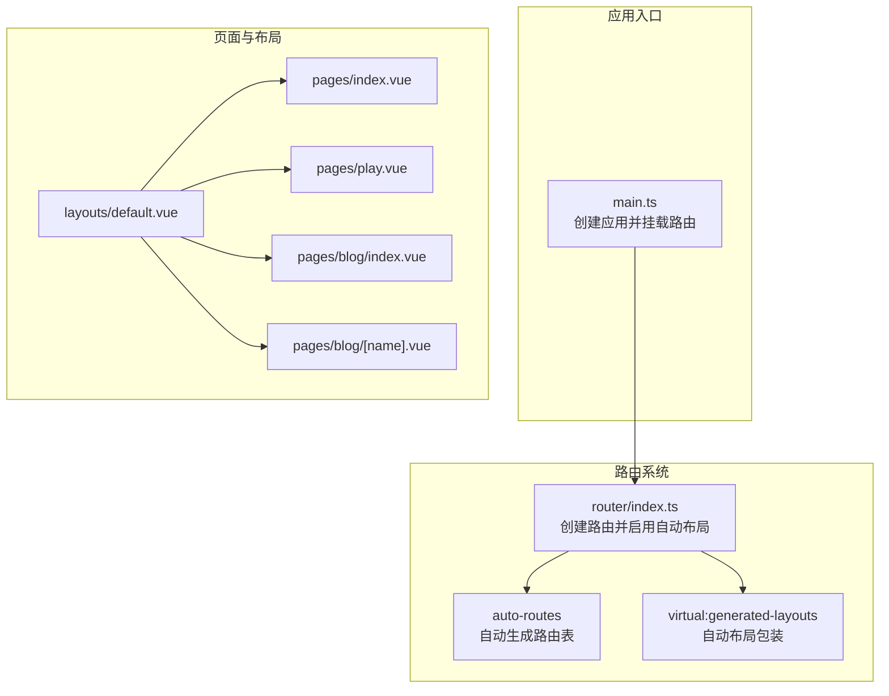
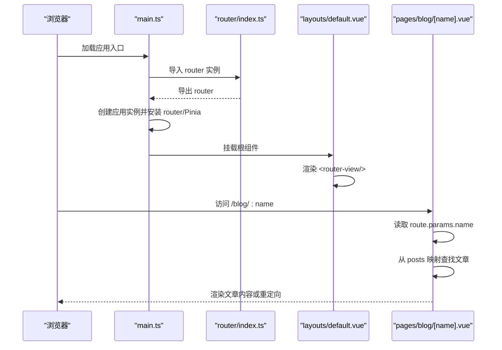
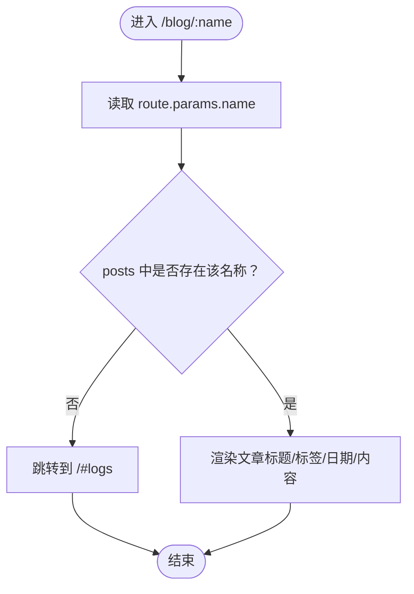
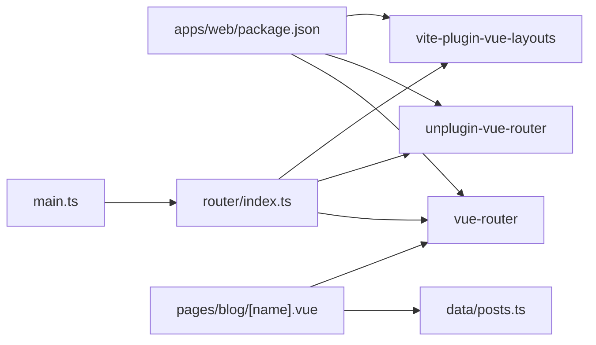

# 前端路由配置

<cite>
**本文引用的文件**
- [apps/web/src/router/index.ts](file://apps/web/src/router/index.ts)
- [apps/web/src/main.ts](file://apps/web/src/main.ts)
- [apps/web/src/pages/play.vue](file://apps/web/src/pages/play.vue)
- [apps/web/src/pages/blog/[name].vue](file://apps/web/src/pages/blog/[name].vue)
- [apps/web/src/pages/blog/index.vue](file://apps/web/src/pages/blog/index.vue)
- [apps/web/src/pages/index.vue](file://apps/web/src/pages/index.vue)
- [apps/web/src/layouts/default.vue](file://apps/web/src/layouts/default.vue)
- [apps/web/src/data/posts.ts](file://apps/web/src/data/posts.ts)
- [apps/web/package.json](file://apps/web/package.json)
</cite>

## 目录
1. [简介](#简介)
2. [项目结构](#项目结构)
3. [核心组件](#核心组件)
4. [架构总览](#架构总览)
5. [详细组件分析](#详细组件分析)
6. [依赖关系分析](#依赖关系分析)
7. [性能考量](#性能考量)
8. [故障排查指南](#故障排查指南)
9. [结论](#结论)
10. [附录](#附录)

## 简介
本文件围绕基于 Vue Router 的前端路由系统展开，重点分析 apps/web/src/router/index.ts 中的路由注册逻辑，说明如何新增页面路由与嵌套路由；以 play.vue 与 blog/[name].vue 为例演示动态路由参数的使用；指导如何设置路由守卫进行权限控制或加载状态管理；解释懒加载（lazy loading）的实现机制及其对性能的优化作用；并给出与 main.ts 中应用初始化的完整集成方式。

## 项目结构
- 路由入口位于 apps/web/src/router/index.ts，使用 vue-router/auto-routes 生成路由表并通过 virtual:generated-layouts 自动布局。
- 页面组件位于 apps/web/src/pages 下，包含首页、模拟页、博客列表与动态文章页等。
- 布局组件位于 apps/web/src/layouts/default.vue，作为全局布局容器，内部通过 <router-view /> 渲染当前路由内容。
- 应用初始化位于 apps/web/src/main.ts，创建应用实例并挂载路由与状态管理。

图表来源
- [apps/web/src/router/index.ts](file://apps/web/src/router/index.ts#L1-L14)
- [apps/web/src/main.ts](file://apps/web/src/main.ts#L1-L17)
- [apps/web/src/layouts/default.vue](file://apps/web/src/layouts/default.vue#L70-L75)
- [apps/web/src/pages/index.vue](file://apps/web/src/pages/index.vue#L1-L428)
- [apps/web/src/pages/play.vue](file://apps/web/src/pages/play.vue#L1-L298)
- [apps/web/src/pages/blog/index.vue](file://apps/web/src/pages/blog/index.vue#L1-L69)
- [apps/web/src/pages/blog/[name].vue](file://apps/web/src/pages/blog/[name].vue#L1-L78)

章节来源
- [apps/web/src/router/index.ts](file://apps/web/src/router/index.ts#L1-L14)
- [apps/web/src/main.ts](file://apps/web/src/main.ts#L1-L17)
- [apps/web/src/layouts/default.vue](file://apps/web/src/layouts/default.vue#L70-L75)

## 核心组件
- 路由器创建与热更新
  - 使用 createRouter 与 createWebHistory 创建基于浏览器历史记录的路由实例。
  - 通过 vue-router/auto-routes 导入 routes 并用 virtual:generated-layouts 的 setupLayouts 包装，实现自动布局。
  - 在开发模式下检测 import.meta.hot，调用 handleHotUpdate(router) 支持热更新。
- 应用初始化
  - main.ts 中创建应用实例，安装路由与 Pinia 插件，最后挂载到 DOM。
- 全局布局
  - default.vue 作为顶层布局，内部通过 <router-view /> 渲染当前匹配的页面组件。

章节来源
- [apps/web/src/router/index.ts](file://apps/web/src/router/index.ts#L1-L14)
- [apps/web/src/main.ts](file://apps/web/src/main.ts#L1-L17)
- [apps/web/src/layouts/default.vue](file://apps/web/src/layouts/default.vue#L70-L75)

## 架构总览
下面的序列图展示了从应用初始化到页面渲染的关键流程，以及动态路由参数在博客文章页中的使用。

图表来源
- [apps/web/src/main.ts](file://apps/web/src/main.ts#L1-L17)
- [apps/web/src/router/index.ts](file://apps/web/src/router/index.ts#L1-L14)
- [apps/web/src/layouts/default.vue](file://apps/web/src/layouts/default.vue#L70-L75)
- [apps/web/src/pages/blog/[name].vue](file://apps/web/src/pages/blog/[name].vue#L1-L78)
- [apps/web/src/data/posts.ts](file://apps/web/src/data/posts.ts#L1-L153)

## 详细组件分析

### 路由注册与自动布局
- 自动路由
  - 通过导入 vue-router/auto-routes 的 routes，结合目录约定自动生成路由表。
- 自动布局
  - 使用 virtual:generated-layouts 的 setupLayouts(routes) 将页面组件包裹到默认布局中，无需在每个页面单独引入布局。
- 热更新支持
  - 在开发环境下监听 import.meta.hot，调用 handleHotUpdate(router) 实现路由变更的热替换。

章节来源
- [apps/web/src/router/index.ts](file://apps/web/src/router/index.ts#L1-L14)

### 新增页面路由与嵌套路由
- 新增页面路由
  - 在 apps/web/src/pages 下新增 .vue 文件即可被 auto-routes 自动识别为新路由。
  - 若需自定义路径或命名空间，可在路由配置中显式声明（当前项目使用自动路由，无需手动维护）。
- 嵌套路由
  - 默认布局通过 <router-view /> 渲染子路由内容，形成父子级嵌套关系。
  - 若需要更复杂的嵌套层级，可借助虚拟布局或在页面内再嵌套 <router-view />。

章节来源
- [apps/web/src/router/index.ts](file://apps/web/src/router/index.ts#L1-L14)
- [apps/web/src/layouts/default.vue](file://apps/web/src/layouts/default.vue#L70-L75)

### 动态路由参数：以 blog/[name].vue 为例
- 参数读取
  - 使用 useRoute 获取当前路由对象，通过 route.params 读取动态段 name。
- 数据映射
  - 通过 posts 映射根据 name 查找对应文章；若不存在则重定向至指定锚点。
- 页面渲染
  - 文章标题、标签、日期与内容通过 MarkdownRender 渲染。

图表来源
- [apps/web/src/pages/blog/[name].vue](file://apps/web/src/pages/blog/[name].vue#L1-L78)
- [apps/web/src/data/posts.ts](file://apps/web/src/data/posts.ts#L1-L153)

章节来源
- [apps/web/src/pages/blog/[name].vue](file://apps/web/src/pages/blog/[name].vue#L1-L78)
- [apps/web/src/data/posts.ts](file://apps/web/src/data/posts.ts#L1-L153)

### 权限控制与加载状态管理（路由守卫）
- 全局前置守卫
  - 可在 router/index.ts 中扩展全局前置守卫，用于登录校验、角色判断、加载状态提示等。
- 路由独享守卫
  - 在具体路由配置中添加 beforeEnter，实现页面级权限控制。
- 组件内守卫
  - 在页面组件中使用导航相关的生命周期钩子或组合式 API，在进入/离开时执行加载状态切换或数据预取。
- 加载状态建议
  - 在守卫中设置 loading 状态，配合骨架屏或进度条提升用户体验。

（本节为通用实践说明，未直接分析具体代码文件）

### 懒加载（Lazy Loading）与性能优化
- 实现机制
  - 使用动态 import() 将大型页面拆分为独立 chunk，按需加载，减少首屏体积。
- 与自动路由的结合
  - 若使用自动路由，可通过配置让某些页面走懒加载策略（例如在路由配置中对特定页面使用动态导入）。
- 性能收益
  - 降低初始包体大小，缩短首屏渲染时间；提升交互流畅度，改善用户体验。
- 与路由守卫协作
  - 在懒加载完成后，再执行权限校验与数据预取，避免不必要的网络请求。

（本节为通用实践说明，未直接分析具体代码文件）

### 与 main.ts 的集成方式
- 应用初始化
  - main.ts 导入 router 实例并调用 app.use(router)，随后挂载到 DOM。
- 根组件
  - main.ts 创建应用时以 RouterView 作为根组件，确保 <router-view /> 能正确渲染当前路由页面。
- 状态管理
  - 同时安装 Pinia 插件，便于在路由守卫与页面组件中共享状态。

章节来源
- [apps/web/src/main.ts](file://apps/web/src/main.ts#L1-L17)
- [apps/web/src/router/index.ts](file://apps/web/src/router/index.ts#L1-L14)

## 依赖关系分析
- 路由相关依赖
  - vue-router：核心路由库。
  - unplugin-vue-router：支持自动路由与目录约定。
  - vite-plugin-vue-layouts：提供虚拟布局能力，与 setupLayouts 配合使用。
- 应用初始化依赖
  - main.ts 依赖 router/index.ts 提供的 router 实例。
- 页面依赖
  - blog/[name].vue 依赖 posts 数据映射与 Markdown 渲染组件。
  - play.vue 依赖 UI 组件与客户端状态存储（通过 composables/useClient）。

图表来源
- [apps/web/package.json](file://apps/web/package.json#L1-L53)
- [apps/web/src/main.ts](file://apps/web/src/main.ts#L1-L17)
- [apps/web/src/router/index.ts](file://apps/web/src/router/index.ts#L1-L14)
- [apps/web/src/pages/blog/[name].vue](file://apps/web/src/pages/blog/[name].vue#L1-L78)
- [apps/web/src/data/posts.ts](file://apps/web/src/data/posts.ts#L1-L153)

章节来源
- [apps/web/package.json](file://apps/web/package.json#L1-L53)
- [apps/web/src/main.ts](file://apps/web/src/main.ts#L1-L17)
- [apps/web/src/router/index.ts](file://apps/web/src/router/index.ts#L1-L14)

## 性能考量
- 首屏优化
  - 使用懒加载拆分大页面，减少初始下载体积。
- 路由切换体验
  - 在守卫中加入轻量加载指示，避免白屏。
- 资源预取
  - 对即将访问的页面进行预加载或预取，提升切换速度。
- 图片与媒体
  - 在 play.vue 中对图片资源进行懒加载与占位符处理，避免阻塞渲染。

（本节为通用实践说明，未直接分析具体代码文件）

## 故障排查指南
- 路由不生效
  - 检查 main.ts 是否正确安装 router 实例并挂载。
  - 确认 router/index.ts 中是否导出 router 并在开发环境下启用了热更新。
- 动态路由 404
  - 在 blog/[name].vue 中确认 route.params.name 类型转换与 posts 映射键一致。
  - 若文章不存在，组件会重定向到 /#logs，请检查链接与映射。
- 布局不显示
  - 确认 default.vue 中存在 <router-view />，且页面未显式覆盖布局。
- 热更新异常
  - 开发环境下确保 import.meta.hot 可用，必要时重启开发服务器。

章节来源
- [apps/web/src/main.ts](file://apps/web/src/main.ts#L1-L17)
- [apps/web/src/router/index.ts](file://apps/web/src/router/index.ts#L1-L14)
- [apps/web/src/pages/blog/[name].vue](file://apps/web/src/pages/blog/[name].vue#L1-L78)
- [apps/web/src/layouts/default.vue](file://apps/web/src/layouts/default.vue#L70-L75)

## 结论
本项目采用自动路由与自动布局相结合的方式，简化了路由配置与页面组织。通过在 router/index.ts 中统一创建路由并在 main.ts 中完成初始化，实现了清晰的职责分离。动态路由参数在 blog/[name].vue 中得到良好示范，配合数据映射与守卫可进一步完善权限与错误处理。结合懒加载与加载状态管理，可显著提升首屏性能与用户体验。

## 附录
- 新增页面步骤
  - 在 apps/web/src/pages 下新增 .vue 文件，自动路由会将其纳入路由表。
  - 如需自定义路径或命名空间，可在路由配置中补充。
- 嵌套路由建议
  - 使用默认布局的 <router-view /> 实现父子级嵌套；复杂场景可考虑在页面内再次嵌套 <router-view />。
- 动态路由最佳实践
  - 在组件内严格校验 route.params，缺失时进行友好重定向或回退。
  - 对映射数据进行边界检查，避免未定义键导致的渲染异常。