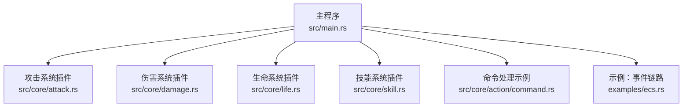
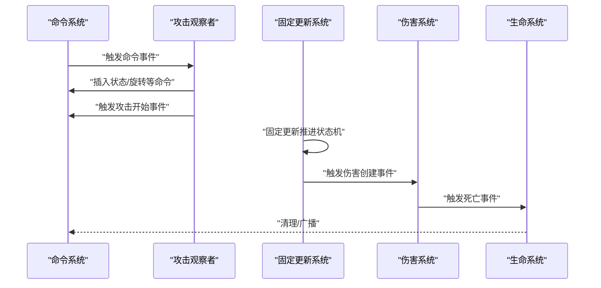
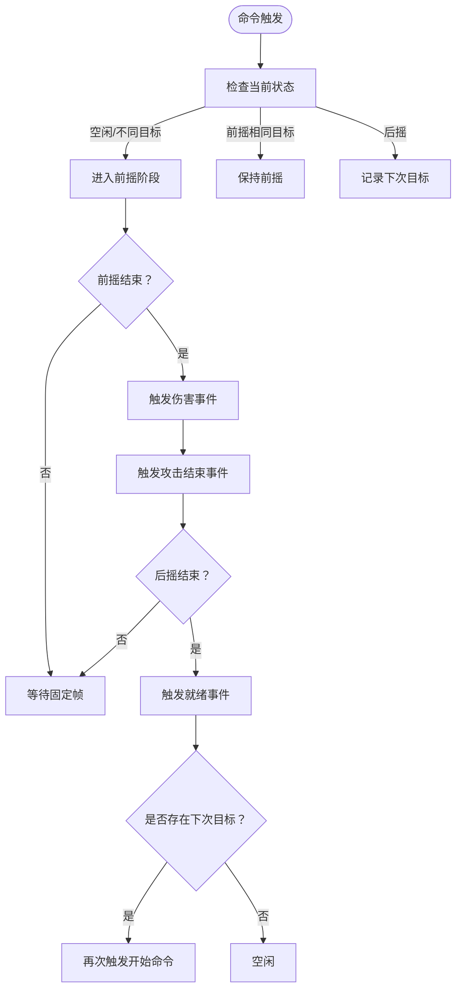
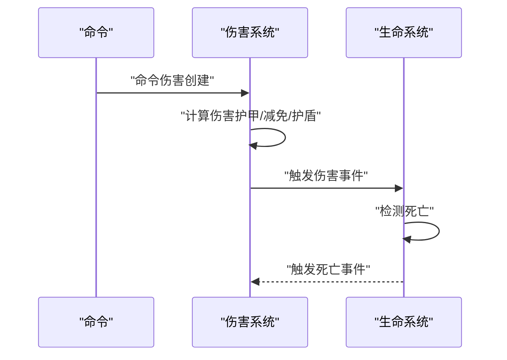
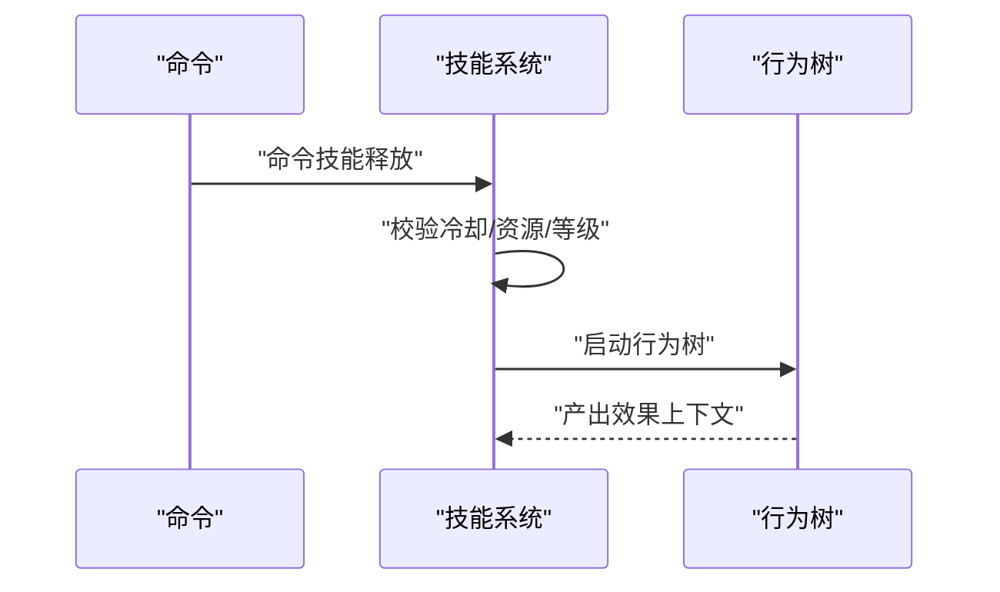
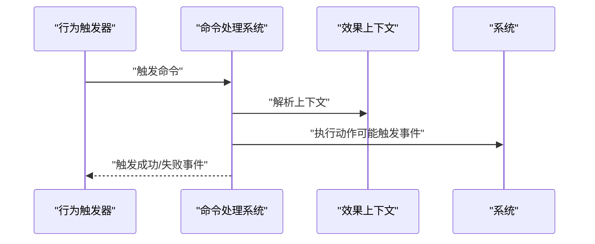
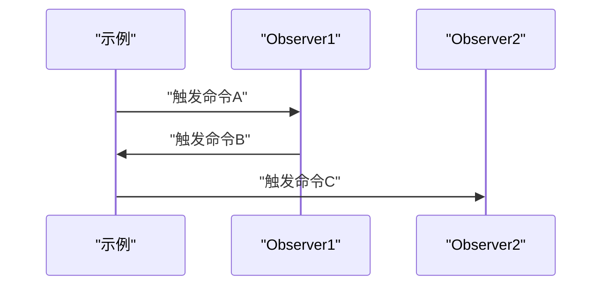
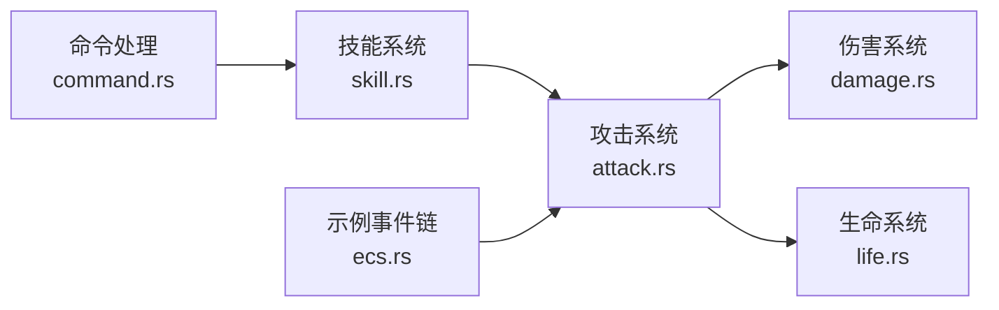

# 事件驱动通信

<cite>
**本文引用的文件**
- [main.rs](file://src/main.rs)
- [attack.rs](file://src/core/attack.rs)
- [damage.rs](file://src/core/damage.rs)
- [life.rs](file://src/core/life.rs)
- [skill.rs](file://src/core/skill.rs)
- [command.rs](file://src/core/action/command.rs)
- [ecs.rs](file://examples/ecs.rs)
- [attack_test.rs](file://tests/attack.rs)
- [pipeline.rs](file://src/core/base/pipeline.rs)
</cite>

## 目录
1. [简介](#简介)
2. [项目结构](#项目结构)
3. [核心组件](#核心组件)
4. [架构总览](#架构总览)
5. [详细组件分析](#详细组件分析)
6. [依赖关系分析](#依赖关系分析)
7. [性能考量](#性能考量)
8. [故障排查指南](#故障排查指南)
9. [结论](#结论)
10. [附录](#附录)

## 简介
本篇文档聚焦于如何在Bevy中通过事件系统（Event）实现跨系统通信。我们将结合项目中的真实实现，系统讲解：
- 如何定义自定义事件（如攻击事件、技能事件等）
- 如何在一个系统中发送事件（使用Commands.trigger或封装的EntityCommandsTrigger）
- 如何在另一个系统中接收并处理事件（使用Observer或系统参数）
- 事件队列的生命周期、线程安全与适用场景（解耦高频更新系统与响应式逻辑）
- 常见陷阱与调试建议

## 项目结构
本仓库采用模块化组织，核心逻辑集中在src/core目录下，围绕“命令-事件-观察者”的模式构建。主程序入口负责注册插件与运行App；战斗、伤害、生命、技能等子系统分别以插件形式注册Observer与System。

图表来源
- [main.rs](file://src/main.rs#L56-L114)
- [attack.rs](file://src/core/attack.rs#L12-L24)
- [damage.rs](file://src/core/damage.rs#L7-L17)
- [life.rs](file://src/core/life.rs#L1-L14)
- [skill.rs](file://src/core/skill.rs#L1-L24)
- [command.rs](file://src/core/action/command.rs#L1-L20)
- [ecs.rs](file://examples/ecs.rs#L103-L128)

章节来源
- [main.rs](file://src/main.rs#L56-L114)

## 核心组件
- 自定义事件类型：通过派生宏定义，如攻击事件、伤害事件、技能事件等，均以EntityEvent形式出现，便于作为Observer触发源。
- 发送事件：通过Commands.trigger或封装的EntityCommandsTrigger::try_trigger将事件入队，由Bevy在下一帧统一处理。
- 接收事件：通过On<T>触发器在Observer中捕获事件，或在系统中使用EventReader读取事件流。
- 插件注册：各子系统以Plugin形式注册Observer与System，形成清晰的职责边界。

章节来源
- [attack.rs](file://src/core/attack.rs#L78-L111)
- [damage.rs](file://src/core/damage.rs#L37-L56)
- [life.rs](file://src/core/life.rs#L16-L31)
- [skill.rs](file://src/core/skill.rs#L94-L101)
- [attack.rs](file://src/core/attack.rs#L432-L441)

## 架构总览
下面的序列图展示了从命令到事件再到观察者的典型流程，以攻击系统为例：

图表来源
- [attack.rs](file://src/core/attack.rs#L220-L278)
- [attack.rs](file://src/core/attack.rs#L361-L429)
- [damage.rs](file://src/core/damage.rs#L291-L360)
- [life.rs](file://src/core/life.rs#L39-L66)

## 详细组件分析

### 攻击事件与状态机
- 定义的事件包括：命令类（开始、重置、停止）、事件类（开始、结束、就绪）。
- 观察者根据命令更新状态机，推进到前摇/后摇阶段，并在合适时机触发事件。
- 固定更新系统基于状态机推进，最终触发伤害与结束事件，再回到“就绪”状态。

图表来源
- [attack.rs](file://src/core/attack.rs#L220-L278)
- [attack.rs](file://src/core/attack.rs#L361-L429)
- [attack.rs](file://src/core/attack.rs#L407-L441)

章节来源
- [attack.rs](file://src/core/attack.rs#L78-L111)
- [attack.rs](file://src/core/attack.rs#L220-L278)
- [attack.rs](file://src/core/attack.rs#L361-L429)
- [attack.rs](file://src/core/attack.rs#L407-L441)

### 伤害事件与事件链
- 命令事件触发后，系统计算伤害并触发事件；若生命值归零，进一步触发死亡事件。
- 这体现了事件链路：命令 -> 事件 -> 事件 -> …，便于解耦不同关注点。

图表来源
- [damage.rs](file://src/core/damage.rs#L291-L360)
- [life.rs](file://src/core/life.rs#L39-L66)

章节来源
- [damage.rs](file://src/core/damage.rs#L37-L56)
- [damage.rs](file://src/core/damage.rs#L291-L360)
- [life.rs](file://src/core/life.rs#L16-L31)
- [life.rs](file://src/core/life.rs#L39-L66)

### 技能事件与行为树
- 技能释放通过命令事件触发，系统校验冷却、资源与等级后，启动行为树并生成效果上下文。
- 行为树节点可进一步触发其他事件，形成复杂交互。

图表来源
- [skill.rs](file://src/core/skill.rs#L101-L177)

章节来源
- [skill.rs](file://src/core/skill.rs#L94-L101)
- [skill.rs](file://src/core/skill.rs#L101-L177)

### 命令处理与事件触发
- 命令处理模块通过行为触发器接收命令，解析上下文后决定下一步动作，并可能触发成功/失败事件。
- 这体现了命令与事件之间的桥接作用。

图表来源
- [command.rs](file://src/core/action/command.rs#L17-L63)

章节来源
- [command.rs](file://src/core/action/command.rs#L1-L20)
- [command.rs](file://src/core/action/command.rs#L17-L63)

### 示例：事件链路（ecs.rs）
- 示例展示了两个命令事件串联，通过Observer依次触发，体现事件驱动的解耦特性。

图表来源
- [ecs.rs](file://examples/ecs.rs#L103-L128)

章节来源
- [ecs.rs](file://examples/ecs.rs#L103-L128)

## 依赖关系分析
- 攻击系统依赖：命令、状态、伤害、动画/特效等资源；通过事件与伤害系统解耦。
- 伤害系统依赖：健康、护甲、护盾、减免等组件；通过事件与生命系统解耦。
- 技能系统依赖：资源加载、行为树、冷却管理；通过事件与其他系统解耦。
- 命令处理模块依赖：行为触发器上下文、团队/目标查询等。

图表来源
- [attack.rs](file://src/core/attack.rs#L12-L24)
- [damage.rs](file://src/core/damage.rs#L7-L17)
- [life.rs](file://src/core/life.rs#L1-L14)
- [skill.rs](file://src/core/skill.rs#L1-L24)
- [command.rs](file://src/core/action/command.rs#L1-L20)
- [ecs.rs](file://examples/ecs.rs#L103-L128)

章节来源
- [attack.rs](file://src/core/attack.rs#L12-L24)
- [damage.rs](file://src/core/damage.rs#L7-L17)
- [life.rs](file://src/core/life.rs#L1-L14)
- [skill.rs](file://src/core/skill.rs#L1-L24)
- [command.rs](file://src/core/action/command.rs#L1-L20)
- [ecs.rs](file://examples/ecs.rs#L103-L128)

## 性能考量
- 事件入队与统一处理：通过Commands.queue_handled与trigger将事件延迟到下一帧处理，避免在高频更新中产生额外开销。
- 固定更新与实时更新分离：将状态推进放在FixedUpdate，响应逻辑放在Update或Observer，降低耦合与抖动。
- 请求缓冲与流水线：提供请求缓冲与清理系统，避免事件风暴导致的性能问题。

章节来源
- [attack.rs](file://src/core/attack.rs#L432-L441)
- [pipeline.rs](file://src/core/base/pipeline.rs#L57-L120)

## 故障排查指南
- 事件未被及时处理
  - 症状：事件在固定帧推进后才被消费，导致视觉与逻辑不同步。
  - 建议：将关键响应逻辑放入Update或使用EventReader逐帧读取，确保与渲染帧一致。
  - 参考：攻击系统在固定帧推进状态，但响应逻辑可在Update中消费事件。

- 事件重复消费
  - 症状：同一帧内多次触发相同事件导致重复处理。
  - 建议：使用请求缓冲与清理系统，或在Observer中进行幂等判断。

- 事件丢失
  - 症状：某些Observer未注册或事件类型不匹配。
  - 建议：确认插件注册顺序与事件类型一致性；使用日志定位缺失的Observer。

- 状态竞态
  - 症状：多个Observer同时修改同一实体状态。
  - 建议：将状态变更集中到单一Observer或使用请求缓冲，按阶段有序处理。

- 调试建议
  - 使用日志宏输出事件流转路径，定位事件未到达或重复触发的位置。
  - 在测试中模拟边界条件（如后摇期间取消、目标切换等），验证状态机正确性。

章节来源
- [attack_test.rs](file://tests/attack.rs#L579-L630)
- [attack.rs](file://src/core/attack.rs#L361-L429)
- [pipeline.rs](file://src/core/base/pipeline.rs#L57-L120)

## 结论
通过事件系统，项目实现了命令-事件-观察者的清晰分层，既保证了高频更新的稳定性，又使响应逻辑具备良好的可扩展性与可维护性。建议在以下场景优先采用事件驱动：
- 解耦高频率更新系统与响应式逻辑
- 实现跨系统协作（如攻击触发伤害、伤害触发死亡）
- 构建可组合的行为树与效果链路

## 附录
- 关键实现位置索引
  - 攻击事件定义与触发：[attack.rs](file://src/core/attack.rs#L78-L111), [attack.rs](file://src/core/attack.rs#L407-L441)
  - 伤害事件与链路：[damage.rs](file://src/core/damage.rs#L37-L56), [damage.rs](file://src/core/damage.rs#L291-L360)
  - 生命事件与清理：[life.rs](file://src/core/life.rs#L16-L31), [life.rs](file://src/core/life.rs#L39-L66)
  - 技能事件与行为树：[skill.rs](file://src/core/skill.rs#L94-L101), [skill.rs](file://src/core/skill.rs#L101-L177)
  - 命令处理与事件桥接：[command.rs](file://src/core/action/command.rs#L17-L63)
  - 示例事件链路：[ecs.rs](file://examples/ecs.rs#L103-L128)
  - 请求缓冲与流水线：[pipeline.rs](file://src/core/base/pipeline.rs#L57-L120)