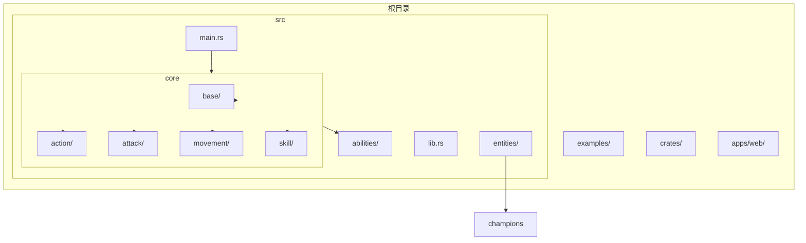
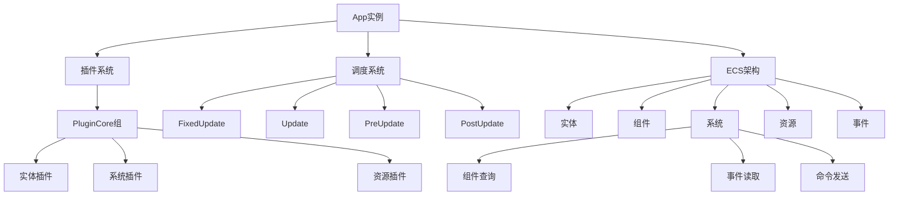
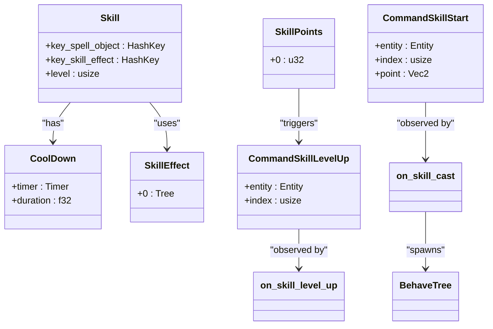
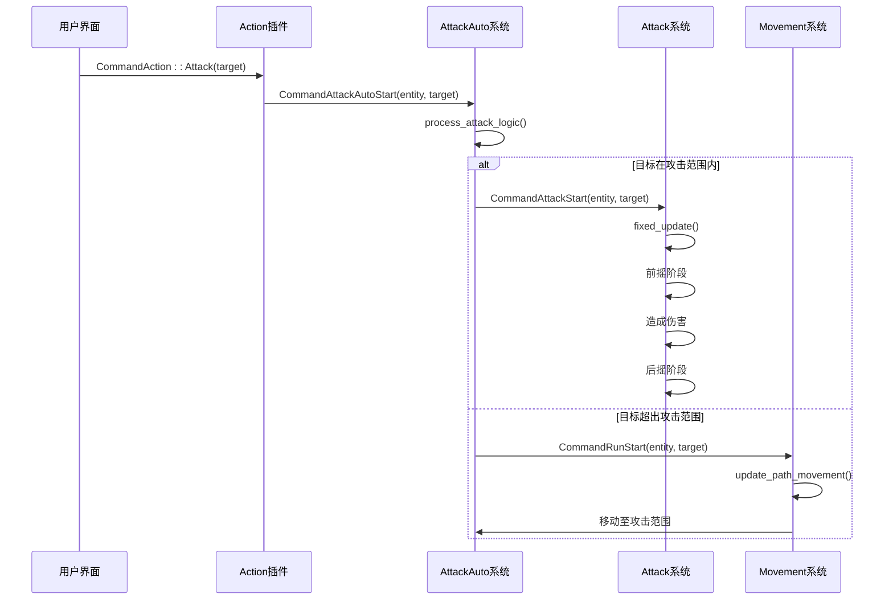
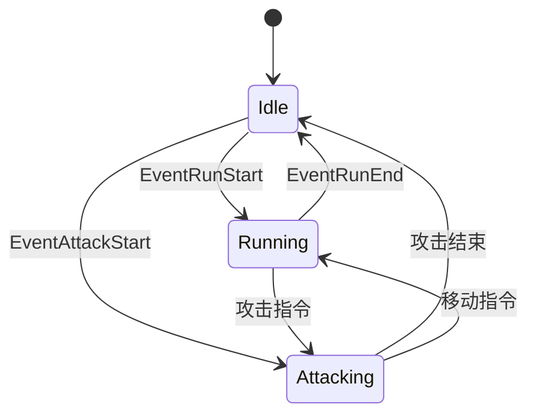
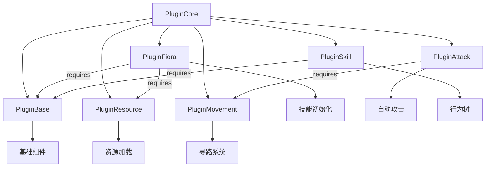

# 开发新游戏插件

<cite>
**本文档引用的文件**  
- [main.rs](file://src/main.rs)
- [lib.rs](file://src/lib.rs)
- [ecs.rs](file://examples/ecs.rs)
- [attack.rs](file://examples/attack.rs)
- [skill.rs](file://src/core/skill.rs)
- [action.rs](file://src/core/action.rs)
- [base.rs](file://src/core/base.rs)
- [attack.rs](file://src/core/attack.rs)
- [attack_auto.rs](file://src/core/attack_auto.rs)
- [movement.rs](file://src/core/movement.rs)
- [state.rs](file://src/core/base/state.rs)
- [position.rs](file://src/core/base/position.rs)
- [fiora.rs](file://src/entities/champions/fiora.rs)
</cite>

## 目录
1. [简介](#简介)
2. [项目结构](#项目结构)
3. [核心组件](#核心组件)
4. [架构概述](#架构概述)
5. [详细组件分析](#详细组件分析)
6. [依赖分析](#依赖分析)
7. [性能考虑](#性能考虑)
8. [故障排除指南](#故障排除指南)
9. [结论](#结论)

## 简介
本文档旨在为基于Bevy ECS架构的游戏项目提供全面的开发指南，指导开发者如何创建新的游戏逻辑插件，例如实现全新的技能系统或AI行为树。通过分析现有代码库，我们将详细介绍插件结构定义、组件设计、系统函数编写、事件驱动通信、模块化设计原则以及性能优化策略。

## 项目结构
本项目采用模块化设计，主要分为`crates/`外部库、`examples/`示例代码、`src/`核心源码和`apps/web/`前端应用四大部分。游戏核心逻辑位于`src/`目录下，遵循ECS（实体-组件-系统）架构模式，包含`abilities/`技能模块、`core/`核心系统、`entities/`游戏实体等子模块。插件注册在`src/main.rs`中完成，通过`App::add_plugins()`方法将各个功能模块集成到主应用中。

**Diagram sources**
- [main.rs](file://src/main.rs#L1-L115)
- [lib.rs](file://src/lib.rs#L1-L59)

**Section sources**
- [main.rs](file://src/main.rs#L1-L115)
- [lib.rs](file://src/lib.rs#L1-L59)

## 核心组件
本项目的核心组件围绕Bevy ECS架构构建，主要包括插件系统、组件定义、系统函数和事件机制。插件通过实现`Plugin` trait来注册系统和资源，组件作为数据载体附加到实体上，系统函数在特定调度阶段处理游戏逻辑，事件则用于跨系统通信。例如，技能系统通过`Skill`组件存储技能数据，`on_skill_cast`系统处理技能释放逻辑，并通过`CommandSkillStart`事件触发。

**Section sources**
- [main.rs](file://src/main.rs#L1-L115)
- [skill.rs](file://src/core/skill.rs#L1-L248)
- [action.rs](file://src/core/action.rs#L1-L97)

## 架构概述
系统采用分层的ECS架构，以`App`为核心容器，通过插件机制组织功能模块。各插件在`PluginCore`组中声明，并在`main.rs`中注册。系统按调度阶段（如`FixedUpdate`、`Update`）执行，确保逻辑顺序正确。数据流通过组件在实体间传递，系统通过查询访问相关组件，事件实现松耦合通信。这种设计实现了高内聚低耦合，便于扩展和维护。

**Diagram sources**
- [main.rs](file://src/main.rs#L1-L115)
- [ecs.rs](file://examples/ecs.rs#L1-L129)
- [lib.rs](file://src/lib.rs#L1-L59)

## 详细组件分析
### 技能系统分析
技能系统实现了完整的技能释放、升级和冷却机制。通过`Skill`组件存储技能配置，`CoolDown`组件管理冷却时间，`CommandSkillStart`事件触发技能释放流程。系统通过观察者模式响应事件，在`on_skill_cast`函数中验证蓝量、检查冷却状态并执行行为树。技能升级遵循等级限制规则，确保游戏平衡性。

#### 类图

**Diagram sources**
- [skill.rs](file://src/core/skill.rs#L1-L248)

**Section sources**
- [skill.rs](file://src/core/skill.rs#L1-L248)
- [fiora.rs](file://src/entities/champions/fiora.rs#L1-L159)

### 攻击系统分析
攻击系统实现了自动攻击、移动攻击和攻击状态管理。`AttackAuto`组件标记自动攻击目标，`CommandAttackAutoStart`事件触发攻击逻辑。系统在`FixedPreUpdate`阶段检查目标距离，超出范围时触发移动，进入范围时开始攻击。攻击状态机（`AttackState`）管理前摇和后摇阶段，确保攻击节奏符合游戏设计。

#### 序列图

**Diagram sources**
- [attack_auto.rs](file://src/core/attack_auto.rs#L1-L155)
- [attack.rs](file://src/core/attack.rs#L1-L442)

**Section sources**
- [attack_auto.rs](file://src/core/attack_auto.rs#L1-L155)
- [attack.rs](file://src/core/attack.rs#L1-L442)

### 状态管理系统分析
状态管理系统通过`State`组件跟踪实体当前行为状态（空闲、奔跑、攻击）。系统监听`EventRunStart`、`EventRunEnd`和`EventAttackStart`等事件，自动更新状态。这种设计实现了状态的集中管理，避免了状态不一致问题，为AI决策和动画播放提供了可靠的状态依据。

#### 状态图

**Diagram sources**
- [state.rs](file://src/core/base/state.rs#L1-L53)

**Section sources**
- [state.rs](file://src/core/base/state.rs#L1-L53)

## 依赖分析
项目采用清晰的依赖管理策略，通过`plugin_group!`宏定义插件组，明确声明插件间的依赖关系。核心系统（如`PluginBase`、`PluginResource`）优先加载，实体插件（如`PluginFiora`、`PluginMinion`）随后注册，确保基础组件和资源就绪。系统间依赖通过`.before()`和`.after()`方法显式声明，保证执行顺序正确。

**Diagram sources**
- [lib.rs](file://src/lib.rs#L1-L59)
- [main.rs](file://src/main.rs#L1-L115)

**Section sources**
- [lib.rs](file://src/lib.rs#L1-L59)
- [main.rs](file://src/main.rs#L1-L115)

## 性能考虑
项目在性能优化方面采取了多项措施：使用`FixedUpdate`调度确保游戏逻辑的确定性；通过组件查询的过滤条件减少不必要的遍历；采用事件驱动机制降低系统耦合度；在路径计算中使用平方距离避免开方运算。建议新插件遵循相同原则，如减少查询范围、使用缓冲机制、避免在热路径中进行昂贵计算。

**Section sources**
- [attack_auto.rs](file://src/core/attack_auto.rs#L1-L155)
- [movement.rs](file://src/core/movement.rs#L1-L445)

## 故障排除指南
调试时可利用日志输出跟踪关键事件，如技能释放、攻击状态变化等。对于复杂逻辑，可添加可视化调试组件，如寻路路径显示。确保事件监听器正确注册，系统调度阶段设置合理。当遇到性能问题时，使用性能分析工具定位瓶颈，重点关注高频执行的系统函数和复杂查询。

**Section sources**
- [logging.rs](file://src/logging.rs)
- [navigation.rs](file://src/core/navigation/navigation.rs)

## 结论
本指南详细阐述了基于Bevy ECS架构开发新游戏插件的完整流程。通过分析现有代码，我们展示了如何定义插件结构、设计组件、编写系统函数、使用事件通信以及遵循模块化设计原则。开发者应充分利用项目提供的基础设施，如行为树、资源管理、事件系统等，同时注意性能优化和调试技巧，以高效开发高质量的游戏功能。