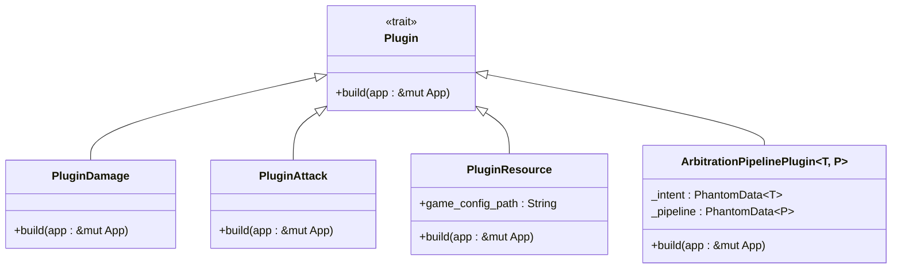
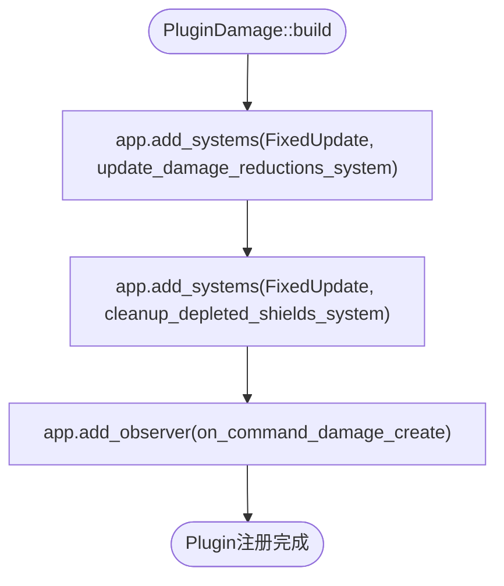
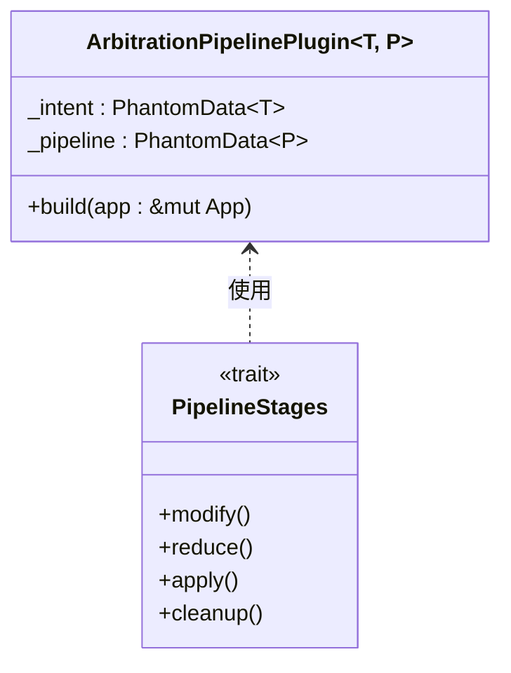

# 插件结构定义

<cite>
**本文档中引用的文件**  
- [src/lib.rs](file://src/lib.rs)
- [src/main.rs](file://src/main.rs)
- [src/core/damage.rs](file://src/core/damage.rs)
- [src/core/attack.rs](file://src/core/attack.rs)
- [src/core/base/pipeline.rs](file://src/core/base/pipeline.rs)
- [src/core/resource.rs](file://src/core/resource.rs)
</cite>

## 目录
1. [引言](#引言)
2. [Bevy插件系统概述](#bevy插件系统概述)
3. [核心插件结构分析](#核心插件结构分析)
4. [定义新插件的步骤](#定义新插件的步骤)
5. [插件集成与主应用流程](#插件集成与主应用流程)
6. [默认派生与泛型插件设计模式](#默认派生与泛型插件设计模式)
7. [插件独立性与可复用性原则](#插件独立性与可复用性原则)
8. [结论](#结论)

## 引言

在Bevy游戏引擎中，插件系统是实现功能模块化和代码解耦的核心机制。本指南将详细解释如何定义一个新的Bevy插件结构，通过分析现有代码库中的`PluginDamage`、`PluginAttack`等示例，展示插件的创建、实现和集成方法。我们将重点介绍如何实现`Plugin` trait、使用`build`方法注册系统和资源，以及如何通过`App::add_plugins`将插件集成到主应用流程中。

## Bevy插件系统概述

Bevy的插件系统允许开发者将功能模块化为独立的插件，每个插件可以注册相关的系统（Systems）、资源（Resources）和组件（Components）。这种设计模式提高了代码的可维护性和可复用性，使得不同的功能模块可以独立开发和测试。

在本项目中，插件系统被广泛应用于各种游戏机制的实现，如伤害计算、攻击系统、动画控制等。通过插件系统，开发者可以轻松地添加或移除功能模块，而不会影响其他部分的代码。

## 核心插件结构分析

通过对代码库的分析，我们可以看到多个核心插件的实现，如`PluginDamage`、`PluginAttack`等。这些插件都遵循相同的结构模式：定义一个结构体，实现`Plugin` trait，并在`build`方法中注册相关的系统和资源。



**Diagram sources**
- [src/core/damage.rs](file://src/core/damage.rs#L6-L17)
- [src/core/attack.rs](file://src/core/attack.rs#L12-L23)
- [src/core/resource.rs](file://src/core/resource.rs#L30-L35)
- [src/core/base/pipeline.rs](file://src/core/base/pipeline.rs#L24-L58)

**Section sources**
- [src/core/damage.rs](file://src/core/damage.rs#L6-L17)
- [src/core/attack.rs](file://src/core/attack.rs#L12-L23)
- [src/core/resource.rs](file://src/core/resource.rs#L30-L35)
- [src/core/base/pipeline.rs](file://src/core/base/pipeline.rs#L24-L58)

## 定义新插件的步骤

### 创建插件结构体

首先，创建一个实现`Plugin` trait的结构体。通常，这个结构体是空的，因为它主要用于组织相关的系统和资源。

```rust
pub struct MyNewPlugin;
```

### 实现Plugin trait

接下来，为结构体实现`Plugin` trait，并在`build`方法中注册系统、添加资源、初始化组件。

```rust
impl Plugin for MyNewPlugin {
    fn build(&self, app: &mut App) {
        // 在这里注册系统、添加资源、初始化组件
    }
}
```

### 注册系统和资源

在`build`方法中，使用`app`参数来注册系统、添加资源和初始化组件。例如，`PluginDamage`插件在`build`方法中注册了两个系统和一个观察器：



**Diagram sources**
- [src/core/damage.rs](file://src/core/damage.rs#L10-L17)

**Section sources**
- [src/core/damage.rs](file://src/core/damage.rs#L10-L17)

## 插件集成与主应用流程

### 在主应用中集成插件

在`src/main.rs`中，通过`App::add_plugins`将插件集成到主应用流程中。例如，`PluginDamage`插件被添加到应用中：

```rust
app.add_plugins(PluginDamage);
```

### 插件组的使用

项目中还使用了插件组（Plugin Group）来组织相关的插件。`PluginCore`结构体通过`plugin_group!`宏定义了一个插件组，包含了多个核心插件：

```mermaid
graph TD
PluginCore[PluginCore] --> PluginFioraPassive[PluginFioraPassive]
PluginCore --> PluginFioraE[PluginFioraE]
PluginCore --> PluginFioraR[PluginFioraR]
PluginCore --> PluginBarrack[PluginBarrack]
PluginCore --> PluginChampion[PluginChampion]
PluginCore --> PluginCharacter[PluginCharacter]
PluginCore --> PluginDebugSphere[PluginDebugSphere]
PluginCore --> PluginMinion[PluginMinion]
PluginCore --> PluginTurret[PluginTurret]
PluginCore --> PluginAction[PluginAction]
PluginCore --> PluginAnimation[PluginAnimation]
PluginCore --> PluginAttack[PluginAttack]
PluginCore --> PluginAttackAuto[PluginAttackAuto]
PluginCore --> PluginAggro[PluginAggro]
PluginCore --> PluginBase[PluginBase]
PluginCore --> PluginCamera[PluginCamera]
PluginCore --> PluginController[PluginController]
PluginCore --> PluginCooldown[PluginCooldown]
PluginCore --> PluginDamage[PluginDamage]
PluginCore --> PluginGame[PluginGame]
PluginCore --> PluginLife[PluginLife]
PluginCore --> PluginLifetime[PluginLifetime]
PluginCore --> PluginMap[PluginMap]
PluginCore --> PluginMovement[PluginMovement]
PluginCore --> PluginNavigaton[PluginNavigaton]
PluginCore --> PluginParticle[PluginParticle]
PluginCore --> PluginResource[PluginResource]
PluginCore --> PluginRotate[PluginRotate]
PluginCore --> PluginRun[PluginRun]
PluginCore --> PluginSkill[PluginSkill]
PluginCore --> PluginSkin[PluginSkin]
PluginCore --> PluginState[PluginState]
PluginCore --> PluginUI[PluginUI]
```



**Diagram sources**
- [src/lib.rs](file://src/lib.rs#L15-L58)
- [src/main.rs](file://src/main.rs#L16-L54)

**Section sources**
- [src/lib.rs](file://src/lib.rs#L15-L58)
- [src/main.rs](file://src/main.rs#L16-L54)

## 默认派生与泛型插件设计模式

### 默认派生的使用

许多插件结构体使用了`#[derive(Default)]`宏，这使得插件可以方便地创建默认实例。例如，`PluginDamage`和`PluginAttack`都使用了默认派生：

```rust
#[derive(Default)]
pub struct PluginDamage;
```

### 泛型插件的设计模式

`ArbitrationPipelinePlugin`是一个泛型插件的示例，它使用了泛型参数来提高插件的灵活性和可复用性。这种设计模式允许插件处理不同类型的数据和事件。



**Diagram sources**
- [src/core/base/pipeline.rs](file://src/core/base/pipeline.rs#L24-L58)

**Section sources**
- [src/core/base/pipeline.rs](file://src/core/base/pipeline.rs#L24-L58)

## 插件独立性与可复用性原则

### 插件的独立性

每个插件都应该尽可能地独立，避免直接修改核心模块。这样可以确保插件的可维护性和可测试性。例如，`PluginDamage`插件只负责伤害计算相关的系统和资源，而不涉及其他游戏机制。

### 插件的可复用性

通过使用泛型和默认派生，插件可以更容易地在不同的项目中复用。例如，`ArbitrationPipelinePlugin`可以用于处理不同类型的数据和事件，而`PluginDamage`可以轻松地集成到任何需要伤害计算的项目中。

## 结论

通过本指南，我们详细介绍了如何定义一个新的Bevy插件结构，包括创建结构体、实现`Plugin` trait、注册系统和资源，以及将插件集成到主应用流程中。我们还分析了默认派生和泛型插件的设计模式，强调了插件的独立性和可复用性原则。这些最佳实践将帮助开发者创建高效、可维护和可复用的Bevy插件。