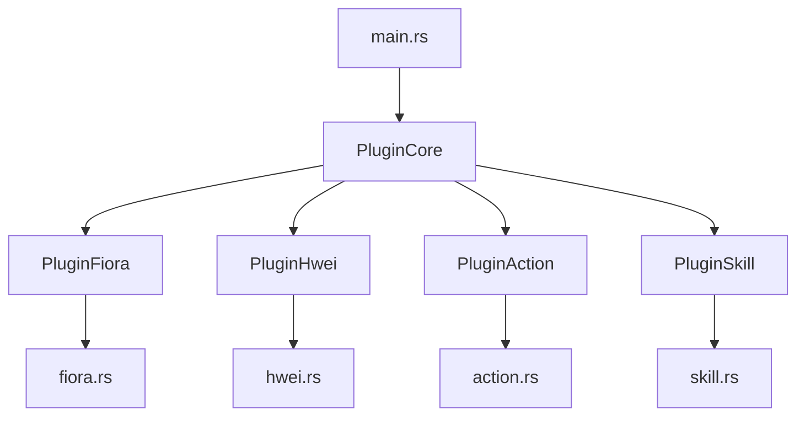
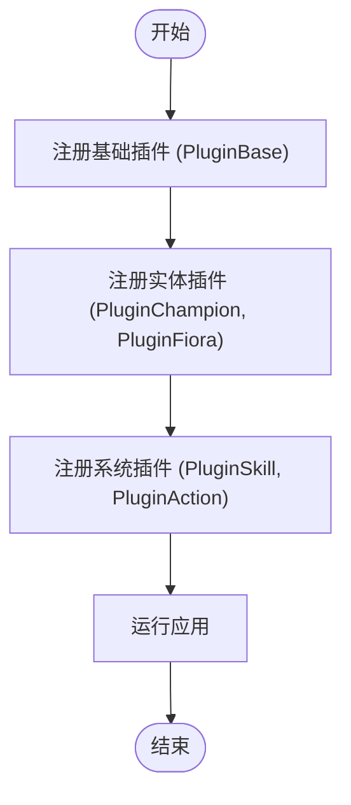
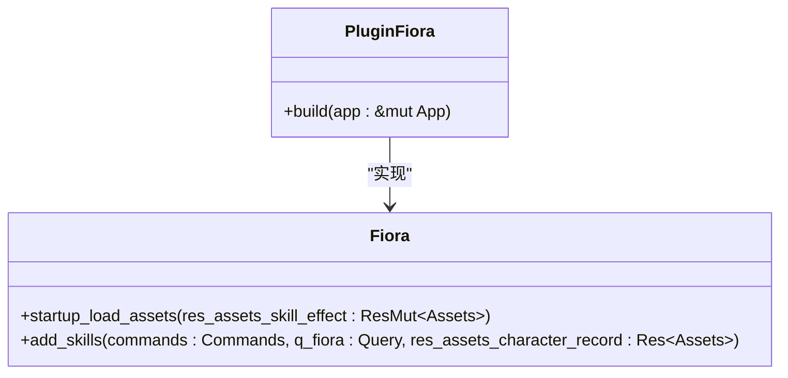

# 模块化与集成最佳实践

<cite>
**本文档引用的文件**  
- [main.rs](file://src/main.rs)
- [lib.rs](file://src/lib.rs)
- [fiora.rs](file://src/entities/champions/fiora.rs)
- [hwei.rs](file://src/entities/champions/hwei.rs)
- [fiora_passive.rs](file://src/abilities/fiora_passive.rs)
- [fiora_e.rs](file://src/abilities/fiora_e.rs)
- [fiora_r.rs](file://src/abilities/fiora_r.rs)
- [base.rs](file://src/core/base.rs)
- [action.rs](file://src/core/action.rs)
- [skill.rs](file://src/core/skill.rs)
- [champion.rs](file://src/entities/champion.rs)
</cite>

## 目录
1. [引言](#引言)
2. [项目结构与模块化设计](#项目结构与模块化设计)
3. [核心组件分析](#核心组件分析)
4. [插件注册与依赖管理](#插件注册与依赖管理)
5. [英雄专属插件的垂直功能划分](#英雄专属插件的垂直功能划分)
6. [推荐的交互模式](#推荐的交互模式)
7. [错误示例与重构方案](#错误示例与重构方案)
8. [复杂插件的代码组织建议](#复杂插件的代码组织建议)
9. [结论](#结论)

## 引言
本文档旨在为`moon-lol`项目制定详细的开发规范，指导如何保持新插件的模块化与低耦合。通过分析现有代码库，特别是`PluginFiora`、`PluginHwei`等英雄专属插件的设计，阐述功能垂直划分的优势。文档将提供在`src/main.rs`中组织插件注册顺序的建议，确保依赖关系正确，并包含错误示例分析及重构方案。

## 项目结构与模块化设计
项目采用Rust语言和Bevy游戏引擎，通过插件（Plugin）机制实现功能的模块化。核心功能被划分为多个独立的模块，如`core`、`entities`、`abilities`等，每个模块负责特定领域的逻辑。这种设计使得代码易于维护和扩展。

**图表来源**
- [main.rs](file://src/main.rs#L16-L53)
- [fiora.rs](file://src/entities/champions/fiora.rs#L19-L26)
- [hwei.rs](file://src/entities/champions/hwei.rs#L12-L19)
- [action.rs](file://src/core/action.rs#L24-L41)
- [skill.rs](file://src/core/skill.rs#L11-L24)

**本节来源**
- [main.rs](file://src/main.rs#L1-L115)
- [lib.rs](file://src/lib.rs#L1-L59)

## 核心组件分析
项目的核心组件包括英雄实体、技能系统、动作系统等。英雄实体通过组件（Component）来定义其属性和行为，如`Champion`、`Fiora`、`Hwei`等。技能系统通过`Skill`组件和`SkillEffect`资源来管理技能的施放和效果。

**本节来源**
- [champion.rs](file://src/entities/champion.rs#L5-L8)
- [fiora.rs](file://src/entities/champions/fiora.rs#L28-L31)
- [hwei.rs](file://src/entities/champions/hwei.rs#L21-L24)
- [skill.rs](file://src/core/skill.rs#L58-L72)

## 插件注册与依赖管理
在`src/main.rs`中，所有插件通过`add_plugins`方法按顺序注册。正确的注册顺序对于确保依赖关系正确至关重要。例如，`PluginBase`应先于依赖其组件的插件注册。

**图表来源**
- [main.rs](file://src/main.rs#L76-L114)

**本节来源**
- [main.rs](file://src/main.rs#L76-L114)

## 英雄专属插件的垂直功能划分
`PluginFiora`和`PluginHwei`等英雄专属插件通过功能垂直划分，实现了高度的模块化。每个插件负责特定英雄的技能和行为，避免了代码的重复和耦合。

### Fiora插件分析
`PluginFiora`负责Fiora英雄的技能加载和初始化。它通过`startup_load_assets`系统加载技能效果，并通过`add_skills`系统为Fiora实体添加技能。

**图表来源**
- [fiora.rs](file://src/entities/champions/fiora.rs#L19-L26)

**本节来源**
- [fiora.rs](file://src/entities/champions/fiora.rs#L19-L159)

### Hwei插件分析
`PluginHwei`与`PluginFiora`类似，负责Hwei英雄的技能加载和初始化。这种垂直划分使得每个英雄的逻辑独立，易于维护和扩展。

**本节来源**
- [hwei.rs](file://src/entities/champions/hwei.rs#L12-L120)

## 推荐的交互模式
为保持模块化与低耦合，推荐通过事件、资源或共享组件进行交互，避免直接访问或修改其他插件的内部状态。

### 事件驱动交互
通过Bevy的事件系统（Event）实现插件间的通信。例如，`on_damage_create`系统监听`EventDamageCreate`事件，处理伤害逻辑。

**本节来源**
- [fiora_passive.rs](file://src/abilities/fiora_passive.rs#L29-L31)
- [fiora_r.rs](file://src/abilities/fiora_r.rs#L22-L23)

### 资源共享
通过资源（Resource）共享数据。例如，`FioraVitalLastDirection`资源用于存储Fiora被动技能的方向信息。

**本节来源**
- [fiora_passive.rs](file://src/abilities/fiora_passive.rs#L33-L36)

## 错误示例与重构方案
### 循环依赖
循环依赖是模块化设计中的常见问题。例如，插件A依赖插件B，而插件B又依赖插件A，导致无法正确初始化。

**重构方案**：通过引入中间层或事件系统，打破循环依赖。例如，将共享逻辑提取到独立的插件中，或通过事件进行通信。

### 过度查询全局实体
过度查询全局实体会导致性能问题和耦合度增加。例如，在系统中频繁查询所有实体，而不是通过事件或资源进行通信。

**重构方案**：使用事件系统或资源来减少对全局实体的查询。例如，通过事件通知相关系统，而不是主动查询。

**本节来源**
- [fiora_passive.rs](file://src/abilities/fiora_passive.rs#L77-L231)
- [fiora_r.rs](file://src/abilities/fiora_r.rs#L57-L120)

## 复杂插件的代码组织建议
对于复杂的插件，建议使用功能目录（如`src/plugins/my_feature/`）组织代码结构。例如，将`PluginFiora`的相关代码组织在`src/abilities/fiora/`目录下，包括`fiora_passive.rs`、`fiora_e.rs`、`fiora_r.rs`等文件。

**本节来源**
- [fiora_passive.rs](file://src/abilities/fiora_passive.rs)
- [fiora_e.rs](file://src/abilities/fiora_e.rs)
- [fiora_r.rs](file://src/abilities/fiora_r.rs)

## 结论
通过遵循本文档的开发规范，可以有效保持新插件的模块化与低耦合。推荐通过事件、资源或共享组件进行交互，避免直接访问或修改其他插件的内部状态。结合项目中`PluginFiora`、`PluginHwei`等英雄专属插件的设计，功能垂直划分的优势显而易见。在`src/main.rs`中合理组织插件注册顺序，确保依赖关系正确，是维护项目稳定性的关键。