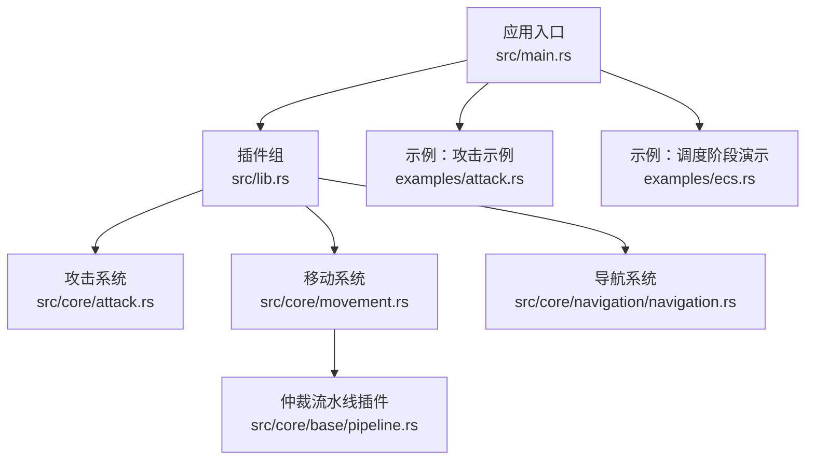
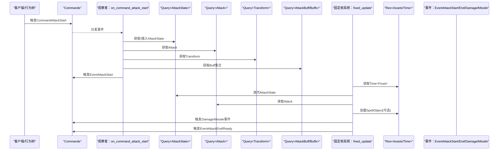
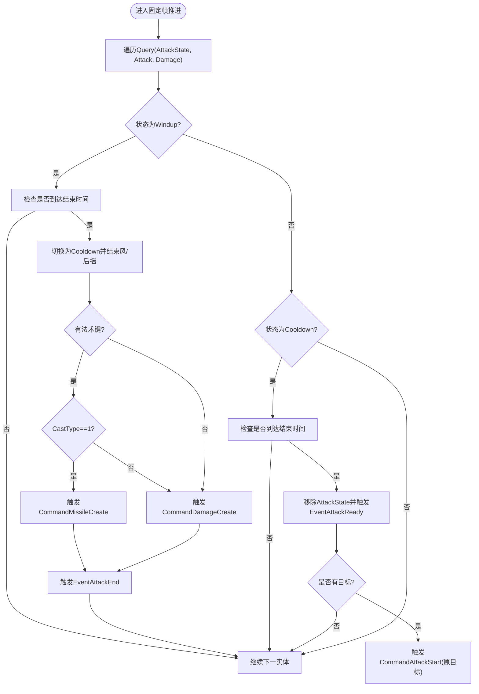
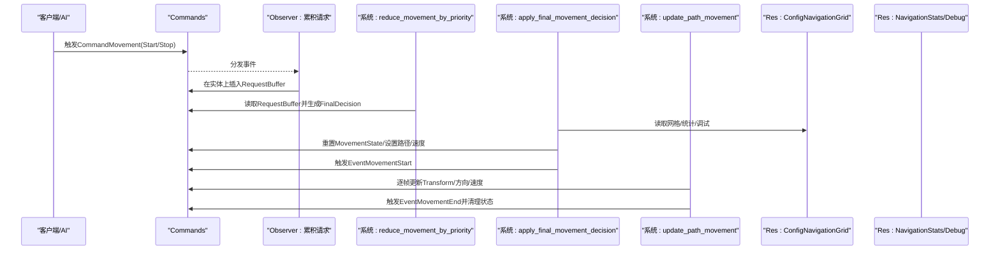
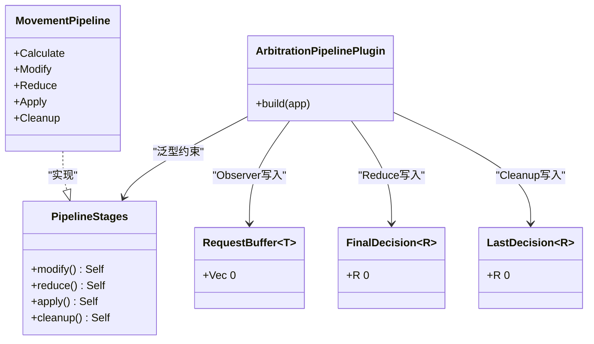
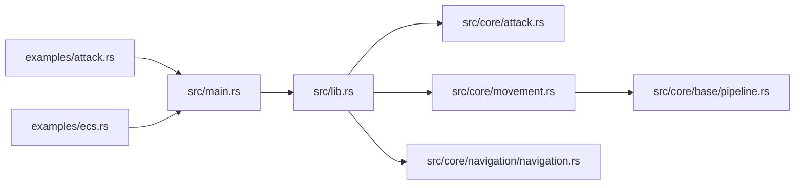

# 系统函数编写

<cite>
**本文引用的文件**
- [src/core/attack.rs](file://src/core/attack.rs)
- [src/core/movement.rs](file://src/core/movement.rs)
- [src/core/base/pipeline.rs](file://src/core/base/pipeline.rs)
- [src/core/navigation/navigation.rs](file://src/core/navigation/navigation.rs)
- [src/main.rs](file://src/main.rs)
- [src/lib.rs](file://src/lib.rs)
- [examples/attack.rs](file://examples/attack.rs)
- [examples/ecs.rs](file://examples/ecs.rs)
</cite>

## 目录
1. [引言](#引言)
2. [项目结构](#项目结构)
3. [核心组件](#核心组件)
4. [架构总览](#架构总览)
5. [详细组件分析](#详细组件分析)
6. [依赖关系分析](#依赖关系分析)
7. [性能考虑](#性能考虑)
8. [故障排查指南](#故障排查指南)
9. [结论](#结论)

## 引言
本技术文档聚焦于如何在Bevy ECS中编写“系统函数（System）”以处理游戏逻辑。我们将结合仓库中的攻击与移动系统，系统性讲解：
- 系统在Bevy调度中的作用与阶段选择（如Update、FixedUpdate、FixedPostUpdate等）
- 如何定义不同类型的系统函数：无参数系统、资源访问系统、组件查询系统
- 如何在系统中使用Query、Res、Commands等参数
- 如何通过系统集（SystemSet）与.before()/after()管理执行顺序
- 如何利用ArbitrationPipeline模式进行事件仲裁与流水线化
- 性能优化建议：缩小查询范围、使用Changed过滤器、避免不必要的资源加载

## 项目结构
本项目采用多crate与模块化的组织方式，核心游戏逻辑集中在src目录下的多个模块中，系统函数主要分布在：
- 攻击系统：src/core/attack.rs
- 移动系统：src/core/movement.rs
- 通用流水线与仲裁：src/core/base/pipeline.rs
- 导航可视化与统计：src/core/navigation/navigation.rs
- 应用入口与插件装配：src/main.rs、src/lib.rs
- 示例程序：examples/attack.rs、examples/ecs.rs

图表来源
- [src/main.rs](file://src/main.rs#L56-L114)
- [src/lib.rs](file://src/lib.rs#L15-L58)
- [src/core/attack.rs](file://src/core/attack.rs#L12-L24)
- [src/core/movement.rs](file://src/core/movement.rs#L18-L33)
- [src/core/base/pipeline.rs](file://src/core/base/pipeline.rs#L46-L63)
- [src/core/navigation/navigation.rs](file://src/core/navigation/navigation.rs#L10-L36)
- [examples/attack.rs](file://examples/attack.rs#L9-L45)
- [examples/ecs.rs](file://examples/ecs.rs#L1-L34)

章节来源
- [src/main.rs](file://src/main.rs#L56-L114)
- [src/lib.rs](file://src/lib.rs#L15-L58)

## 核心组件
- 攻击系统（Attack System）
  - 定义了攻击组件、状态机与相关事件，使用FixedUpdate驱动状态推进，并通过观察者响应命令事件。
  - 关键点：使用Res<Time<Fixed>>、Query、Commands、事件触发与状态切换。
- 移动系统（Movement System）
  - 定义Movement、MovementState、MovementAction等组件与事件；通过ArbitrationPipeline在FixedPostUpdate阶段分阶段执行“仲裁—应用—更新”的流水线。
  - 关键点：使用SystemSet、in_set、RequestBuffer/LastDecision/ FinalDecision组件进行跨帧仲裁。
- 仲裁流水线（Arbitration Pipeline）
  - 通用插件，将同一类事件按modify/reduce/apply/cleanup四个阶段组织，支持优先级仲裁与结果缓存。
- 导航系统（Navigation System）
  - 提供A*寻路、路径优化、占用格计算与可视化；在不同阶段注册系统以保证统计与可视化正确输出。

章节来源
- [src/core/attack.rs](file://src/core/attack.rs#L12-L24)
- [src/core/movement.rs](file://src/core/movement.rs#L18-L33)
- [src/core/base/pipeline.rs](file://src/core/base/pipeline.rs#L14-L22)
- [src/core/navigation/navigation.rs](file://src/core/navigation/navigation.rs#L10-L36)

## 架构总览
下面的序列图展示了“攻击系统”的典型调用链：外部命令触发→观察者接收→插入状态→固定帧推进状态→产生伤害或导弹事件。

图表来源
- [src/core/attack.rs](file://src/core/attack.rs#L220-L319)
- [src/core/attack.rs](file://src/core/attack.rs#L361-L430)

章节来源
- [src/core/attack.rs](file://src/core/attack.rs#L220-L319)
- [src/core/attack.rs](file://src/core/attack.rs#L361-L430)

## 详细组件分析

### 攻击系统（Attack System）
- 系统类型与阶段
  - 固定帧推进：FixedUpdate中执行fixed_update，驱动AttackState状态机推进。
  - 观察者：On<CommandAttackStart/Reset/Stop/EventDead>在任意帧接收命令并触发状态变化。
- 参数使用
  - Res<Time<Fixed>>：用于获取当前固定帧时间，判断风/后摇结束。
  - Query：获取Attack、AttackState、Transform、AttackBuff、Buffs等组件。
  - Commands：触发旋转、伤害、导弹、事件等。
  - Res<Assets<SpellObject>>：按需加载法术对象以决定是直接造成伤害还是发射导弹。
- 状态机
  - Windup（前摇）→Cooldown（后摇）→移除状态并触发Ready；若仍有目标则自动再次发起攻击。
- 事件与命令
  - CommandAttackStart/Reset/Stop、EventAttackStart/End/Ready、EventDead等事件贯穿整个流程。

图表来源
- [src/core/attack.rs](file://src/core/attack.rs#L361-L430)

章节来源
- [src/core/attack.rs](file://src/core/attack.rs#L12-L24)
- [src/core/attack.rs](file://src/core/attack.rs#L220-L319)
- [src/core/attack.rs](file://src/core/attack.rs#L361-L430)

### 移动系统（Movement System）
- 系统类型与阶段
  - 插件构建时在FixedPostUpdate中注册流水线：Reduce（仲裁）→Apply（应用）→Update（更新位移）。
  - 使用ArbitrationPipelinePlugin将同一类命令按modify/reduce/apply/cleanup四个阶段组织。
- 参数使用
  - Commands：触发事件、插入/移除组件。
  - Query：包含Without/Maybe/Option等组合，减少无效查询开销。
  - Res：读取Time<Fixed>、ConfigNavigationGrid、NavigationStats、NavigationDebug等。
- 流水线设计
  - RequestBuffer：收集同一帧内多个命令，避免重复处理。
  - FinalDecision/LastDecision：仲裁后的最终决策，跨帧缓存。
  - MovementPipeline：Reduce/Apply/Cleanup三个阶段，分别对应仲裁、应用与清理。
- 关键流程
  - reduce_movement_by_priority：按优先级仲裁多个命令，生成FinalDecision。
  - apply_final_movement_decision：根据仲裁结果规划路径或设置路径/速度，触发开始事件。
  - update_path_movement：按固定帧步进移动，更新方向/速度，完成后触发结束事件并清理状态。

图表来源
- [src/core/movement.rs](file://src/core/movement.rs#L248-L301)
- [src/core/movement.rs](file://src/core/movement.rs#L303-L438)
- [src/core/movement.rs](file://src/core/movement.rs#L144-L246)
- [src/core/base/pipeline.rs](file://src/core/base/pipeline.rs#L46-L63)

章节来源
- [src/core/movement.rs](file://src/core/movement.rs#L18-L33)
- [src/core/movement.rs](file://src/core/movement.rs#L144-L246)
- [src/core/movement.rs](file://src/core/movement.rs#L248-L301)
- [src/core/movement.rs](file://src/core/movement.rs#L303-L438)
- [src/core/base/pipeline.rs](file://src/core/base/pipeline.rs#L46-L63)

### 仲裁流水线（Arbitration Pipeline）通用模式
- 设计要点
  - 通过Observer累积同一实体上的多个同类型事件到RequestBuffer。
  - 在Reduce阶段按策略（如优先级）选择最终决策并写入FinalDecision。
  - Apply阶段消费FinalDecision并执行业务逻辑。
  - Cleanup阶段将FinalDecision复制到LastDecision并清理，便于下一帧比较。
- 适用场景
  - 多来源命令冲突（如移动、攻击、旋转等）的仲裁。
  - 需要跨帧缓存决策结果的场景。

图表来源
- [src/core/base/pipeline.rs](file://src/core/base/pipeline.rs#L14-L22)
- [src/core/base/pipeline.rs](file://src/core/base/pipeline.rs#L24-L44)
- [src/core/base/pipeline.rs](file://src/core/base/pipeline.rs#L46-L63)
- [src/core/movement.rs](file://src/core/movement.rs#L91-L113)

章节来源
- [src/core/base/pipeline.rs](file://src/core/base/pipeline.rs#L14-L22)
- [src/core/base/pipeline.rs](file://src/core/base/pipeline.rs#L46-L63)
- [src/core/movement.rs](file://src/core/movement.rs#L91-L113)

### 导航系统（Navigation System）
- 系统类型与阶段
  - First/Last：初始化与收尾统计打印。
  - PreUpdate/Update/Last：预处理占用格、更新Y轴高度、可视化A*与移动路径。
- 参数使用
  - Res<ConfigNavigationGrid>：读取/写入网格占用、调试信息。
  - Query<With/Without>：仅查询带特定组件的实体，降低扫描范围。
  - Res<NavigationStats/Debug>：统计与可视化开关。
- 关键算法
  - A*寻路、直线可视检测、路径优化（漏斗算法）、最近可达格查找。

章节来源
- [src/core/navigation/navigation.rs](file://src/core/navigation/navigation.rs#L10-L36)
- [src/core/navigation/navigation.rs](file://src/core/navigation/navigation.rs#L464-L551)
- [src/core/navigation/navigation.rs](file://src/core/navigation/navigation.rs#L552-L695)

## 依赖关系分析
- 插件装配
  - src/main.rs与src/lib.rs通过插件组统一注册各功能插件，包括攻击、移动、导航、动画、粒子等。
- 系统注册与阶段
  - 攻击系统：FixedUpdate推进状态。
  - 移动系统：FixedPostUpdate中按SystemSet分阶段执行。
  - 导航系统：在多个阶段注册系统以保证统计与可视化正确。
- 示例程序
  - examples/attack.rs展示如何通过插件装配与窗口配置启动应用。
  - examples/ecs.rs展示各阶段的系统执行顺序与手动时间步长控制。

图表来源
- [src/main.rs](file://src/main.rs#L56-L114)
- [src/lib.rs](file://src/lib.rs#L15-L58)
- [src/core/attack.rs](file://src/core/attack.rs#L12-L24)
- [src/core/movement.rs](file://src/core/movement.rs#L18-L33)
- [src/core/base/pipeline.rs](file://src/core/base/pipeline.rs#L46-L63)
- [src/core/navigation/navigation.rs](file://src/core/navigation/navigation.rs#L10-L36)
- [examples/attack.rs](file://examples/attack.rs#L9-L45)
- [examples/ecs.rs](file://examples/ecs.rs#L1-L34)

章节来源
- [src/main.rs](file://src/main.rs#L56-L114)
- [src/lib.rs](file://src/lib.rs#L15-L58)
- [examples/ecs.rs](file://examples/ecs.rs#L1-L34)

## 性能考虑
- 缩小查询范围
  - 使用Without/With/Option/Maybe等限定查询条件，避免全量扫描。
  - 对于移动系统，使用Without<MovementBlock>减少无效实体处理。
- 使用Changed过滤器
  - 在导航可视化系统中，通过资源/网格的is_changed()判断是否需要重绘，避免每帧重建可视化。
- 减少资源加载开销
  - 攻击系统按需加载SpellObject，避免在每帧都进行昂贵的资源查询。
- 事件仲裁与批处理
  - 使用RequestBuffer在FixedPostUpdate阶段集中处理命令，减少多次处理同一实体的开销。
- 固定帧推进
  - 将物理/移动/状态推进放在FixedUpdate/FixedPostUpdate，确保逻辑与渲染解耦，提升稳定性与可预测性。

章节来源
- [src/core/movement.rs](file://src/core/movement.rs#L144-L246)
- [src/core/navigation/navigation.rs](file://src/core/navigation/navigation.rs#L552-L695)
- [src/core/attack.rs](file://src/core/attack.rs#L361-L430)

## 故障排查指南
- 攻击状态异常
  - 症状：攻击状态不切换或重复触发。
  - 排查：确认CommandAttackStart/Reset/Stop是否正确触发；检查AttackState是否存在且目标一致；查看fixed_update中状态切换逻辑。
- 移动路径不生效
  - 症状：实体不动或路径错误。
  - 排查：确认CommandMovement已进入RequestBuffer；检查reduce_movement_by_priority是否选择了更高优先级命令；核对apply_final_movement_decision是否成功规划路径并设置MovementState。
- 导航可视化不更新
  - 症状：A*可视化不刷新。
  - 排查：确认NavigationDebug.enabled为true；检查update_visualization_astar中is_changed()与grid.is_changed()判断；确认网格占用与路径点已更新。
- 调度顺序问题
  - 症状：某些系统早/晚执行导致逻辑依赖失败。
  - 排查：使用SystemSet与in_set划分阶段；必要时通过.before()/after()微调；参考examples/ecs.rs验证阶段顺序。

章节来源
- [src/core/attack.rs](file://src/core/attack.rs#L220-L319)
- [src/core/attack.rs](file://src/core/attack.rs#L361-L430)
- [src/core/movement.rs](file://src/core/movement.rs#L248-L301)
- [src/core/movement.rs](file://src/core/movement.rs#L303-L438)
- [src/core/navigation/navigation.rs](file://src/core/navigation/navigation.rs#L552-L695)
- [examples/ecs.rs](file://examples/ecs.rs#L1-L34)

## 结论
- 系统函数应围绕“职责单一、阶段明确、参数最小化”设计。
- 使用FixedUpdate/FixedPostUpdate等阶段分离“输入仲裁/应用/推进”，配合SystemSet与ArbitrationPipeline实现稳定可维护的流水线。
- 通过Changed过滤、缩小查询范围、按需加载资源等方式显著提升性能。
- 借助示例程序与调试资源（如NavigationDebug）快速定位调度与逻辑问题。