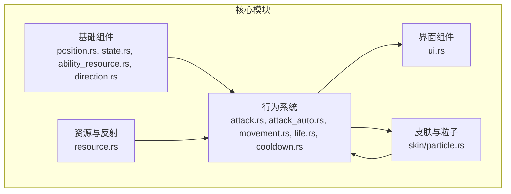
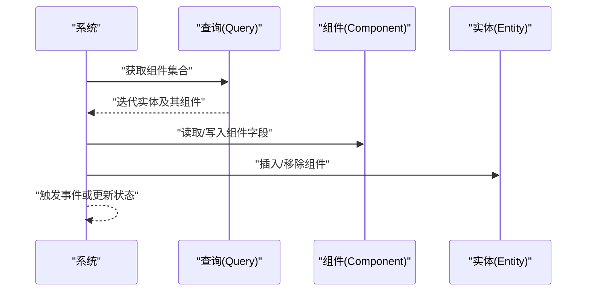
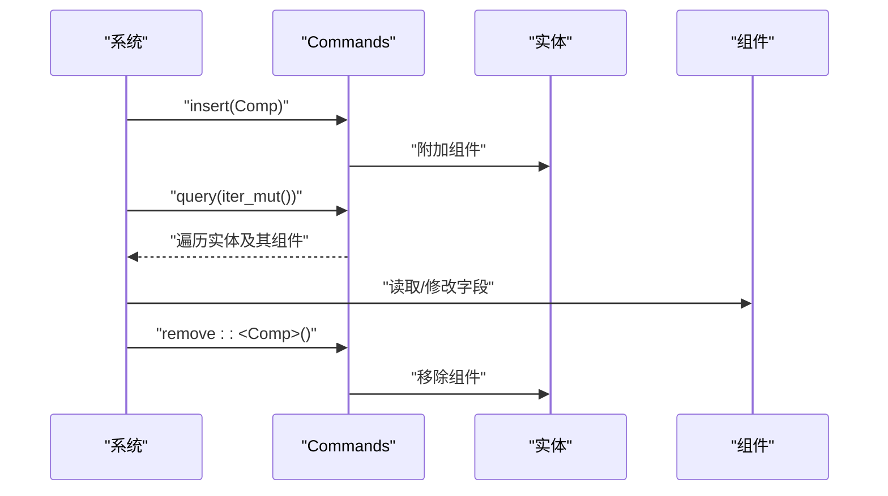
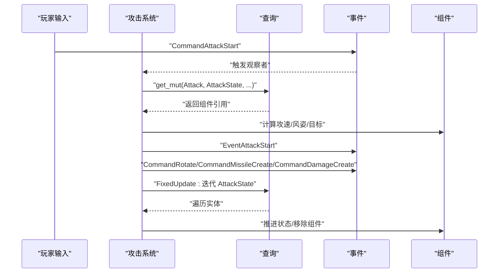
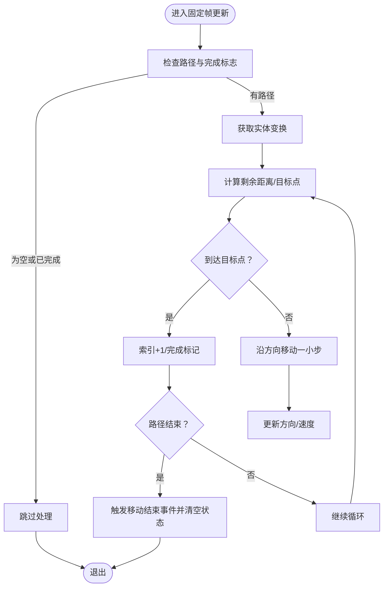
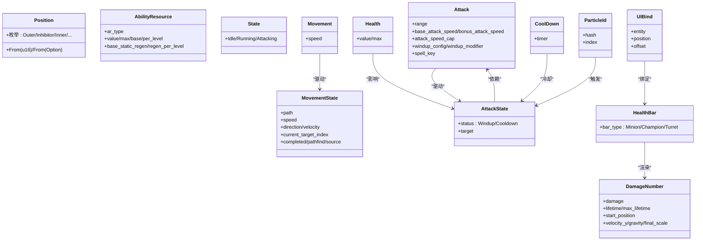
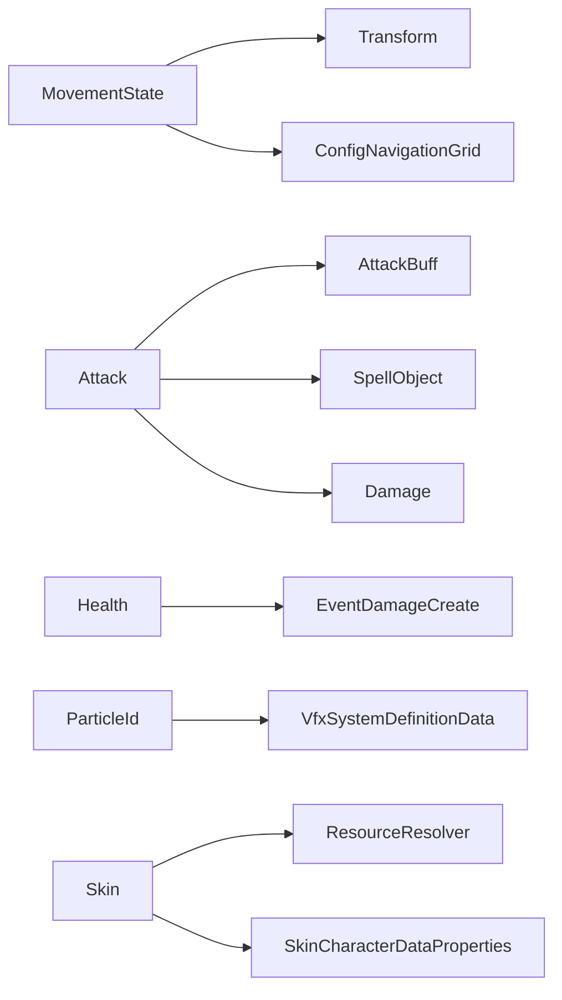

# 组件设计与实现

<cite>
**本文引用的文件列表**
- [position.rs](file://src/core/base/position.rs)
- [ability_resource.rs](file://src/core/base/ability_resource.rs)
- [state.rs](file://src/core/base/state.rs)
- [direction.rs](file://src/core/base/direction.rs)
- [movement.rs](file://src/core/movement.rs)
- [attack.rs](file://src/core/attack.rs)
- [attack_auto.rs](file://src/core/attack_auto.rs)
- [life.rs](file://src/core/life.rs)
- [cooldown.rs](file://src/core/cooldown.rs)
- [particle.rs](file://src/core/particle.rs)
- [skin/particle.rs](file://src/core/skin/particle.rs)
- [resource.rs](file://src/core/resource.rs)
- [ui.rs](file://src/core/ui.rs)
</cite>

## 目录
1. [引言](#引言)
2. [项目结构](#项目结构)
3. [核心组件](#核心组件)
4. [架构总览](#架构总览)
5. [详细组件分析](#详细组件分析)
6. [依赖关系分析](#依赖关系分析)
7. [性能考量](#性能考量)
8. [故障排查指南](#故障排查指南)
9. [结论](#结论)

## 引言
本篇文档面向希望为 Moon LOL 游戏引擎开发“新插件”的开发者，系统讲解如何基于 ECS（实体-组件-系统）模式设计与实现自定义组件（Component）。我们将从组件作为“数据载体”的角色出发，结合仓库中的真实组件示例，说明如何使用 #[derive(Component)] 宏定义结构体，如何选择字段与数据类型、如何设置默认值，以及如何将组件附加到实体并在系统中通过查询（Query）访问。同时，我们总结最佳实践，包括保持组件轻量、单一职责，以及合理使用 Clone、Default 等 trait 的场景。

## 项目结构
本项目采用 Bevy 引擎的 ECS 架构，核心逻辑集中在 src/core 下，按功能域拆分模块：
- base：基础数据组件（位置、状态、方向、资源等）
- action：行为相关（攻击、移动、伤害等）
- skin：皮肤与粒子资源绑定
- ui：界面相关组件
- resource：资源加载与反射应用

下面给出一个概念性的项目结构图，帮助理解模块边界与职责划分。

[本图为概念性示意，不对应具体源码文件映射，故无图表来源]

## 核心组件
本节聚焦于“组件”这一数据载体角色，结合仓库中的真实组件，说明字段选择、数据类型与默认值策略。

- Position（枚举组件）
  - 作用：标识单位所处的区域位置（外野、抑制器、内线、基地炮塔等）
  - 字段与类型：枚举项 + 默认分支；提供 From<u16>/From<Option<u16>> 转换
  - 默认值：通过 #[default] 指定默认枚举值
  - 参考路径：[position.rs](file://src/core/base/position.rs#L1-L35)

- AbilityResource（资源组件）
  - 作用：承载可施放资源（如法力、能量、炮塔资源、营地资源）及其动态参数
  - 字段与类型：枚举类型 + 数值型字段（当前值、最大值、基础值、每级成长、静态回蓝、每级回蓝成长）
  - 默认值：组件本身未显式 Default，但枚举类型有 From<u8>/From<Option<u8>> 转换
  - 参考路径：[ability_resource.rs](file://src/core/base/ability_resource.rs#L1-L41)

- State（状态组件）
  - 作用：描述实体的当前状态（空闲、移动、攻击）
  - 字段与类型：枚举 + Default
  - 默认值：Idle
  - 参考路径：[state.rs](file://src/core/base/state.rs#L16-L23)

- Direction（方向工具）
  - 作用：提供方向判断工具函数（左、右、上、下）
  - 字段与类型：枚举 + 工具函数
  - 默认值：无
  - 参考路径：[direction.rs](file://src/core/base/direction.rs#L1-L29)

- Movement/MovementState（移动组件）
  - 作用：驱动寻路与位移，包含路径、速度、方向、目标索引、完成标记等
  - 字段与类型：结构体 + 枚举 + 事件
  - 默认值：MovementState::default()
  - 参考路径：[movement.rs](file://src/core/movement.rs#L35-L53)

- Attack/AttackState（攻击组件）
  - 作用：描述攻击范围、攻速、风姿（前摇/后摇）、目标与状态
  - 字段与类型：结构体 + 枚举 + 事件
  - 默认值：Attack::new/from_legacy 提供构造器
  - 参考路径：[attack.rs](file://src/core/attack.rs#L26-L77)

- Health（生命组件）
  - 作用：实体血量与最大值
  - 字段与类型：结构体 + 事件
  - 默认值：通过构造器 Health::new 设置
  - 参考路径：[life.rs](file://src/core/life.rs#L16-L22)

- CoolDown（冷却组件）
  - 作用：通用冷却计时器
  - 字段与类型：计时器
  - 默认值：默认构造
  - 参考路径：[cooldown.rs](file://src/core/cooldown.rs#L14-L19)

- ParticleId（粒子组件）
  - 作用：绑定粒子系统定义与索引
  - 字段与类型：哈希键 + 索引
  - 默认值：无
  - 参考路径：[particle.rs](file://src/core/particle.rs#L93-L114)

- UIBind/HealthBar/DamageNumber（UI 组件）
  - 作用：UI 元素与实体的绑定、血条类型、伤害数字
  - 字段与类型：结构体 + 枚举
  - 默认值：部分组件提供 Default
  - 参考路径：[ui.rs](file://src/core/ui.rs#L85-L126)

**章节来源**
- file://src/core/base/position.rs#L1-L35
- file://src/core/base/ability_resource.rs#L1-L41
- file://src/core/base/state.rs#L16-L23
- file://src/core/base/direction.rs#L1-L29
- file://src/core/movement.rs#L35-L53
- file://src/core/attack.rs#L26-L77
- file://src/core/life.rs#L16-L22
- file://src/core/cooldown.rs#L14-L19
- file://src/core/particle.rs#L93-L114
- file://src/core/ui.rs#L85-L126

## 架构总览
下图展示了 ECS 的典型交互：系统通过 Query 访问组件，触发事件或插入/移除组件，从而驱动实体状态变化。

[本图为概念性示意，不对应具体源码文件映射，故无图表来源]

## 详细组件分析

### 组件定义与派生宏
- #[derive(Component)]：为结构体赋予组件身份，使其可被实体持有
- #[derive(Default)]：为组件提供默认构造，便于初始化
- #[derive(Clone)]：支持复制语义，适合轻量数据
- #[derive(Debug, PartialEq, Eq, Hash)]：便于调试、比较与哈希
- #[derive(Serialize, Deserialize)]：支持序列化/反序列化，便于持久化与网络传输
- #[derive(Reflect)]：配合资源反射，实现运行时类型信息与克隆行为控制

示例参考：
- Position：[position.rs](file://src/core/base/position.rs#L1-L35)
- AbilityResource：[ability_resource.rs](file://src/core/base/ability_resource.rs#L1-L41)
- State：[state.rs](file://src/core/base/state.rs#L16-L23)
- Movement/MovementState：[movement.rs](file://src/core/movement.rs#L35-L53)
- Attack/AttackState：[attack.rs](file://src/core/attack.rs#L26-L77)
- Health：[life.rs](file://src/core/life.rs#L16-L22)
- CoolDown：[cooldown.rs](file://src/core/cooldown.rs#L14-L19)
- ParticleId：[particle.rs](file://src/core/particle.rs#L93-L114)
- UIBind/HealthBar/DamageNumber：[ui.rs](file://src/core/ui.rs#L85-L126)

**章节来源**
- file://src/core/base/position.rs#L1-L35
- file://src/core/base/ability_resource.rs#L1-L41
- file://src/core/base/state.rs#L16-L23
- file://src/core/movement.rs#L35-L53
- file://src/core/attack.rs#L26-L77
- file://src/core/life.rs#L16-L22
- file://src/core/cooldown.rs#L14-L19
- file://src/core/particle.rs#L93-L114
- file://src/core/ui.rs#L85-L126

### 组件附加到实体与查询访问
- 插入组件
  - 在系统中通过 Commands 对实体进行 insert，将组件附加到实体
  - 示例：皮肤加载完成后向实体插入 Skin 组件
    - 参考路径：[skin/skin.rs](file://src/core/skin/skin.rs#L59-L65)
- 查询访问
  - 使用 Query 获取实体及其组件，支持只读/可变访问
  - 示例：移动系统中对 Movement + MovementState 进行迭代
    - 参考路径：[movement.rs](file://src/core/movement.rs#L144-L160)
  - 示例：攻击系统中对 AttackState + Attack + Damage 进行迭代
    - 参考路径：[attack.rs](file://src/core/attack.rs#L361-L370)
- 移除组件
  - 使用 try_remove 或 remove 移除不再需要的组件
  - 示例：移动结束后清理 LastDecision
    - 参考路径：[movement.rs](file://src/core/movement.rs#L440-L444)

**章节来源**
- file://src/core/skin/skin.rs#L59-L65
- file://src/core/movement.rs#L144-L160
- file://src/core/attack.rs#L361-L370
- file://src/core/movement.rs#L440-L444

### 系统中的组件交互流程
以攻击系统为例，展示组件与事件的协作：
- 接收命令：CommandAttackStart
- 查询组件：Attack、AttackState、Transform、Buffs、AttackBuff
- 更新状态：根据 Buffs/AttackBuff 计算总攻速，设置 AttackState
- 触发事件：EventAttackStart、CommandRotate、CommandMissileCreate/CommandDamageCreate
- 固定帧更新：在 FixedUpdate 中推进 AttackState，完成前后摇切换

**图表来源**
- [attack.rs](file://src/core/attack.rs#L220-L278)
- [attack.rs](file://src/core/attack.rs#L361-L410)

**章节来源**
- file://src/core/attack.rs#L220-L278
- file://src/core/attack.rs#L361-L410

### 复杂逻辑组件的算法流程
以移动系统中的路径推进为例，展示组件驱动的决策与迭代流程：

**图表来源**
- [movement.rs](file://src/core/movement.rs#L144-L246)

**章节来源**
- file://src/core/movement.rs#L144-L246

### 组件类图（代码级）
以下类图展示关键组件之间的关系与职责分工：

**图表来源**
- [position.rs](file://src/core/base/position.rs#L1-L35)
- [ability_resource.rs](file://src/core/base/ability_resource.rs#L1-L41)
- [state.rs](file://src/core/base/state.rs#L16-L23)
- [movement.rs](file://src/core/movement.rs#L35-L53)
- [attack.rs](file://src/core/attack.rs#L26-L77)
- [life.rs](file://src/core/life.rs#L16-L22)
- [cooldown.rs](file://src/core/cooldown.rs#L14-L19)
- [particle.rs](file://src/core/particle.rs#L93-L114)
- [ui.rs](file://src/core/ui.rs#L85-L126)

## 依赖关系分析
- 组件与系统
  - MovementState/Movement 依赖 Transform 与 NavigationGrid
  - Attack/AttackState 依赖 Buffs、AttackBuff、SpellObject、Damage
  - Health 依赖 EventDamageCreate
- 组件与资源
  - ParticleId 依赖 VfxSystemDefinitionData
  - Skin 与 ResourceResolver/SkinCharacterDataProperties 协作
- 反射与资源注册
  - resource.rs 展示了通过反射注册组件并应用到实体的过程

**图表来源**
- [movement.rs](file://src/core/movement.rs#L317-L438)
- [attack.rs](file://src/core/attack.rs#L361-L410)
- [life.rs](file://src/core/life.rs#L50-L67)
- [particle.rs](file://src/core/particle.rs#L93-L114)
- [skin/particle.rs](file://src/core/skin/particle.rs#L19-L42)
- [resource.rs](file://src/core/resource.rs#L111-L138)

**章节来源**
- file://src/core/movement.rs#L317-L438
- file://src/core/attack.rs#L361-L410
- file://src/core/life.rs#L50-L67
- file://src/core/particle.rs#L93-L114
- file://src/core/skin/particle.rs#L19-L42
- file://src/core/resource.rs#L111-L138

## 性能考量
- 组件应尽量轻量且单一职责，避免在组件中存储重型数据（如大型数组、复杂对象）
- 对频繁访问的组件优先使用 Query::iter_mut，减少多次 get 调用
- 使用 Clone 仅限于轻量数据；对于大型结构，考虑通过资源句柄或索引间接访问
- 合理使用 #[derive(Default)] 与构造器，确保组件在插入时具备合理的初始状态
- 将昂贵的计算（如寻路）放在系统中按需执行，避免在每次帧中重复计算

[本节为通用建议，不直接分析具体文件，故无章节来源]

## 故障排查指南
- 组件未生效
  - 检查是否正确通过 Commands.insert 添加组件
  - 确认系统调度阶段（FixedUpdate/FixedPostUpdate）与 Query 条件匹配
  - 参考：[movement.rs](file://src/core/movement.rs#L144-L160)
- 查询不到组件
  - 确保实体确实拥有该组件；使用 Query::get_mut 返回错误时打印实体信息
  - 参考：[attack.rs](file://src/core/attack.rs#L233-L249)
- 组件状态异常
  - 检查事件触发顺序与状态机推进逻辑
  - 参考：[attack.rs](file://src/core/attack.rs#L361-L410)
- 资源加载问题
  - 检查资源键与资源表映射是否正确
  - 参考：[skin/particle.rs](file://src/core/skin/particle.rs#L19-L42)

**章节来源**
- file://src/core/movement.rs#L144-L160
- file://src/core/attack.rs#L233-L249
- file://src/core/attack.rs#L361-L410
- file://src/core/skin/particle.rs#L19-L42

## 结论
通过本篇文档，开发者可以掌握如何在 Moon LOL 中设计与实现自定义组件：明确组件的数据载体角色，合理选择字段与数据类型，利用 #[derive(Component)] 与相关 trait（Clone、Default、Serialize/Deserialize、Reflect 等）提升可维护性；并通过 Commands 与 Query 将组件与系统解耦地连接起来。遵循单一职责与轻量原则，配合事件驱动与系统流水线，能够构建清晰、可扩展的 ECS 插件体系。