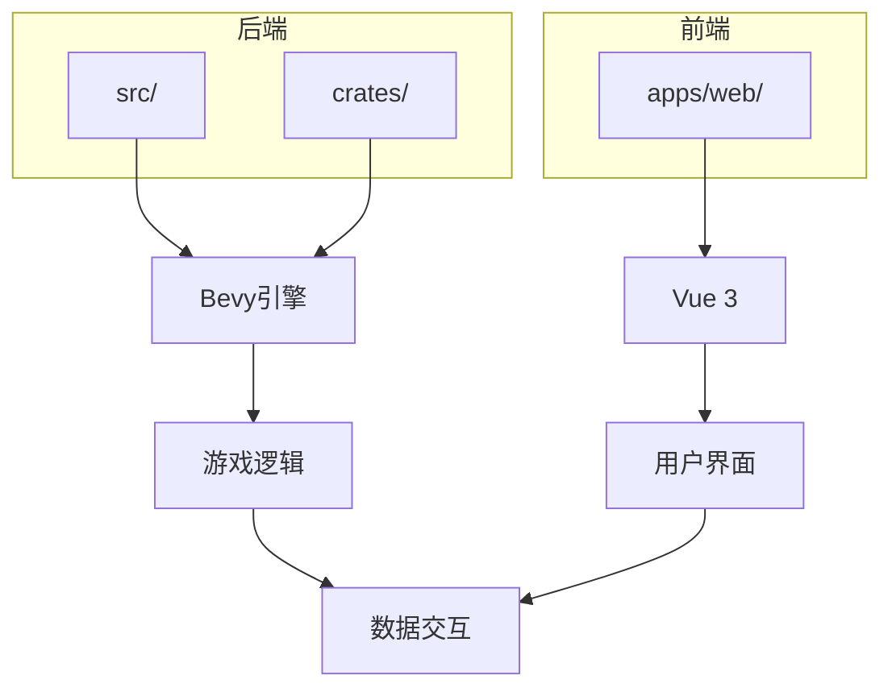
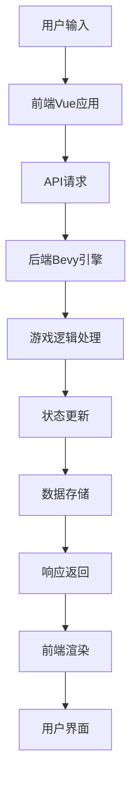
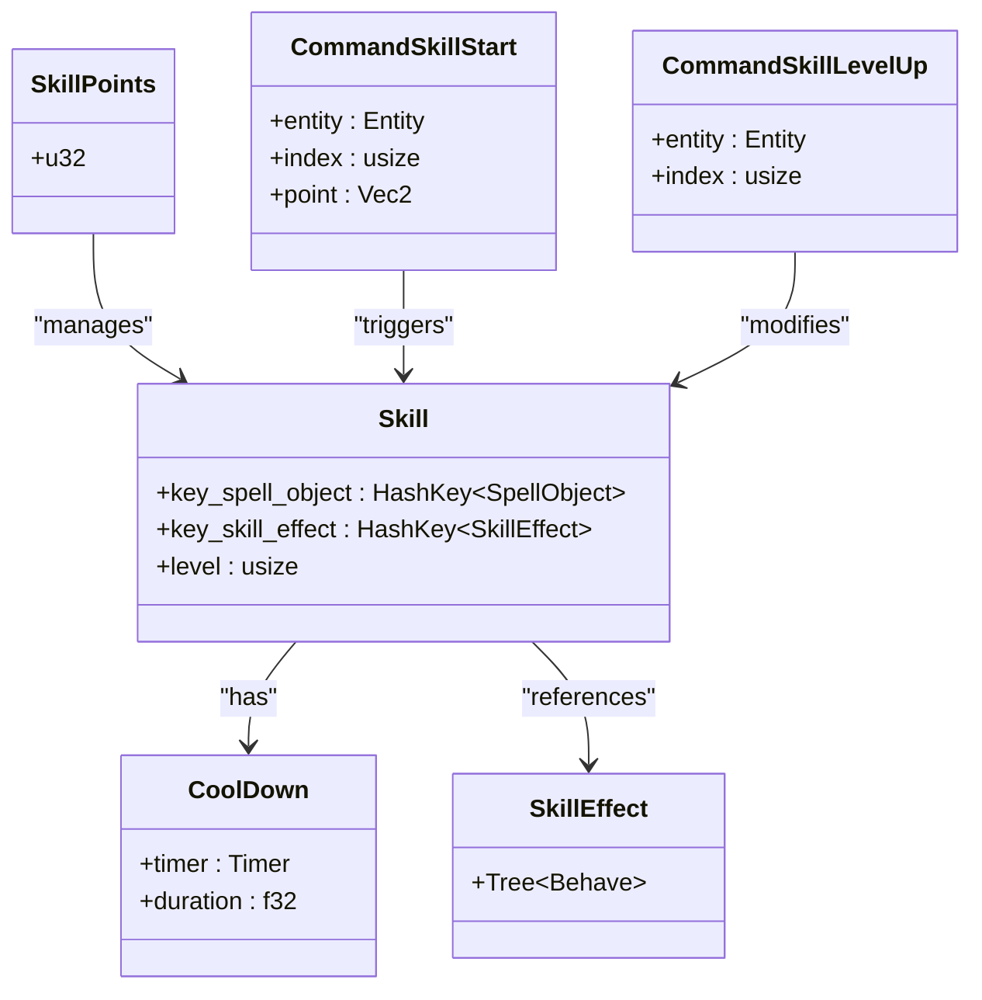
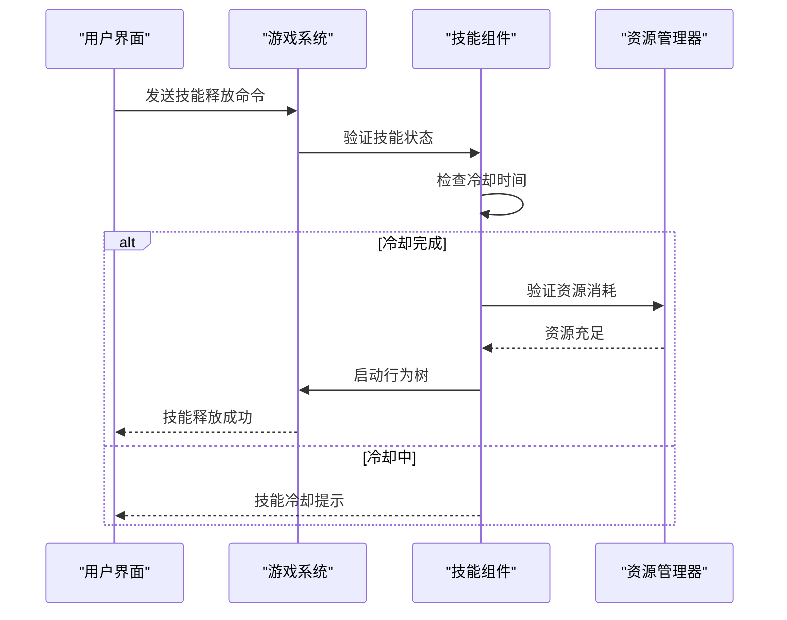
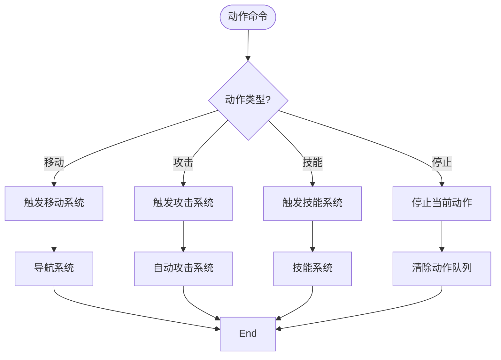
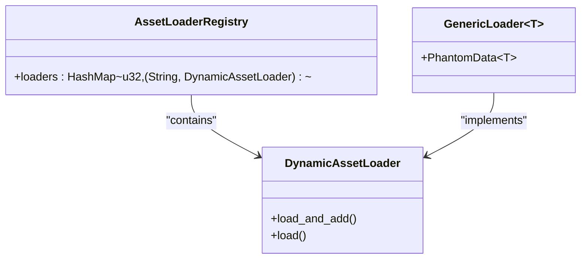
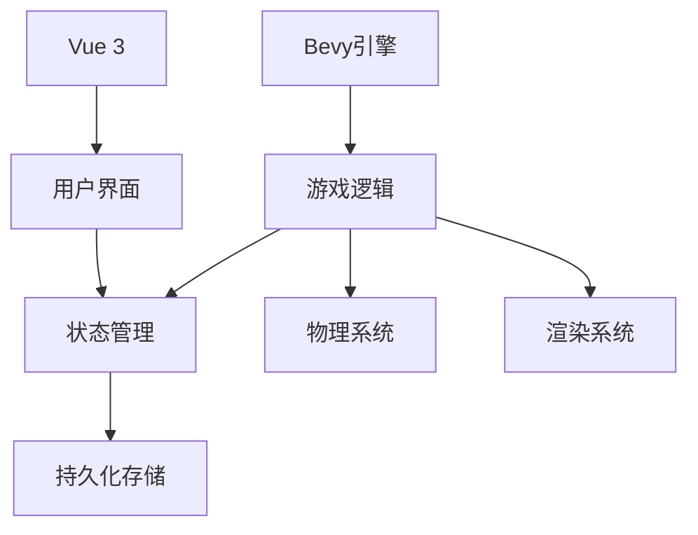

# 扩展开发

<cite>
**本文档中引用的文件**  
- [main.rs](file://src/main.rs)
- [lib.rs](file://src/lib.rs)
- [skill.rs](file://src/core/skill.rs)
- [action.rs](file://src/core/action.rs)
- [register.rs](file://crates/lol_config/src/register.rs)
- [lib.rs](file://crates/lol_config/src/lib.rs)
- [main.ts](file://apps/web/src/main.ts)
- [index.ts](file://apps/web/src/router/index.ts)
- [posts.ts](file://apps/web/src/data/posts.ts)
</cite>

## 目录
1. [简介](#简介)
2. [项目结构](#项目结构)
3. [核心组件](#核心组件)
4. [架构概述](#架构概述)
5. [详细组件分析](#详细组件分析)
6. [依赖分析](#依赖分析)
7. [性能考量](#性能考量)
8. [故障排除指南](#故障排除指南)
9. [结论](#结论)

## 简介
本指南旨在为开发者提供在现有代码库基础上进行功能扩展的全面指导。我们将深入探讨如何添加新的LoL资源类型支持、开发新的游戏插件以及扩展前端功能。通过遵循本文档中的最佳实践和代码模板，开发者可以确保新功能与现有架构无缝集成，同时保持代码的可维护性和性能。

## 项目结构
本项目采用模块化架构，分为多个主要部分：后端Rust代码、前端Vue.js应用和共享配置。后端代码位于`src/`和`crates/`目录中，使用Bevy游戏引擎构建。前端代码位于`apps/web/`目录中，基于Vue 3和Vite构建。这种分离的架构允许前后端独立开发和部署，同时通过清晰的接口进行通信。

**Diagram sources**
- [Cargo.toml](file://Cargo.toml)
- [vite.config.ts](file://apps/web/vite.config.ts)

**Section sources**
- [Cargo.toml](file://Cargo.toml)
- [package.json](file://apps/web/package.json)

## 核心组件
项目的核心组件包括游戏实体系统、技能系统、动作系统和资源加载系统。这些组件通过Bevy的ECS（实体-组件-系统）架构紧密协作。`PluginSkill`负责管理技能的释放和升级，`PluginAction`处理各种游戏动作，而`AssetLoaderRegistry`则负责加载和管理游戏资源。

**Section sources**
- [lib.rs](file://src/lib.rs)
- [skill.rs](file://src/core/skill.rs)
- [action.rs](file://src/core/action.rs)

## 架构概述
系统采用分层架构设计，从底层的数据处理到上层的用户交互都有明确的职责划分。后端使用Bevy引擎处理游戏逻辑和物理模拟，前端使用Vue.js框架构建响应式用户界面。两者通过标准化的API进行通信，确保了系统的可扩展性和可维护性。

**Diagram sources**
- [main.ts](file://apps/web/src/main.ts)
- [main.rs](file://src/main.rs)

## 详细组件分析

### 技能系统分析
技能系统是游戏核心机制的重要组成部分，负责管理英雄技能的释放、冷却和升级。系统通过事件驱动的方式处理技能相关操作，确保了高内聚低耦合的设计原则。

#### 类图

**Diagram sources**
- [skill.rs](file://src/core/skill.rs)

#### 序列图

**Diagram sources**
- [skill.rs](file://src/core/skill.rs)

**Section sources**
- [skill.rs](file://src/core/skill.rs)

### 动作系统分析
动作系统负责处理角色的各种行为，包括移动、攻击和特殊技能。系统通过观察者模式监听事件，并触发相应的动作执行。

#### 流程图

**Diagram sources**
- [action.rs](file://src/core/action.rs)

**Section sources**
- [action.rs](file://src/core/action.rs)

### 资源加载系统分析
资源加载系统负责管理游戏资源的加载和注册，支持多种资源类型的动态加载。

#### 类图

**Diagram sources**
- [register.rs](file://crates/lol_config/src/register.rs)

**Section sources**
- [register.rs](file://crates/lol_config/src/register.rs)

## 依赖分析
项目依赖关系清晰，各模块之间通过明确定义的接口进行交互。后端核心依赖Bevy游戏引擎，前端依赖Vue 3框架，两者通过API进行松耦合通信。

**Diagram sources**
- [Cargo.toml](file://Cargo.toml)
- [package.json](file://apps/web/package.json)

**Section sources**
- [Cargo.toml](file://Cargo.toml)
- [package.json](file://apps/web/package.json)

## 性能考量
在扩展开发时，需要特别关注性能影响。建议使用异步加载避免阻塞主线程，合理使用对象池减少内存分配，以及优化渲染批次提高绘制效率。对于复杂的计算任务，可以考虑使用Web Workers或Rust的异步运行时进行处理。

## 故障排除指南
常见问题包括资源加载失败、事件监听器未触发和状态同步错误。建议使用调试工具检查事件流，验证资源路径的正确性，并确保系统按正确顺序初始化。对于前端问题，可以使用浏览器开发者工具检查网络请求和组件状态。

**Section sources**
- [logging.rs](file://src/logging.rs)
- [debug.go](file://debug/debug.go#L15-L40)

## 结论
通过遵循本文档中的指导原则，开发者可以有效地扩展游戏功能，同时保持代码质量和系统性能。建议在开发新功能时，始终参考现有架构模式，确保新代码与整体设计保持一致。定期进行代码审查和性能测试，有助于维护项目的长期可维护性。