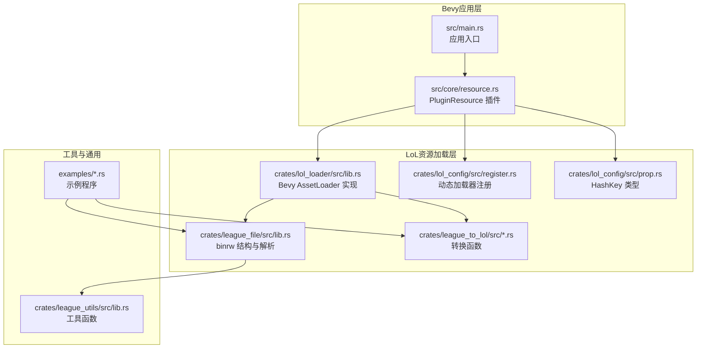
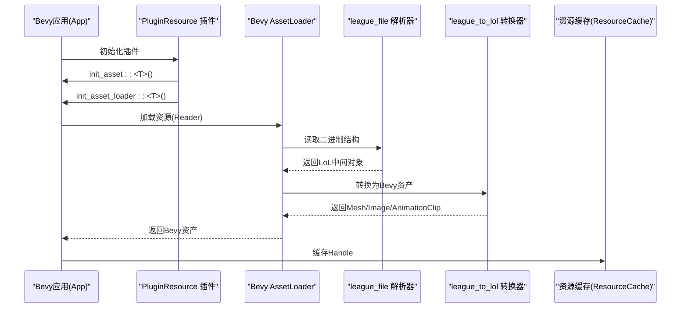
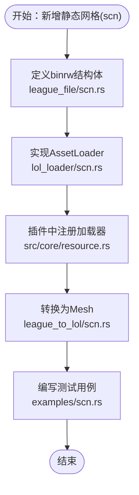
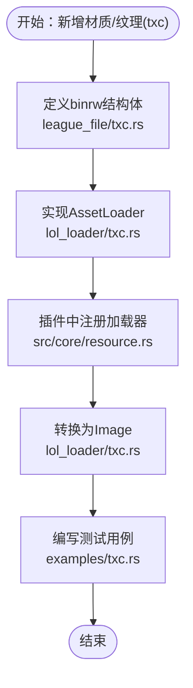
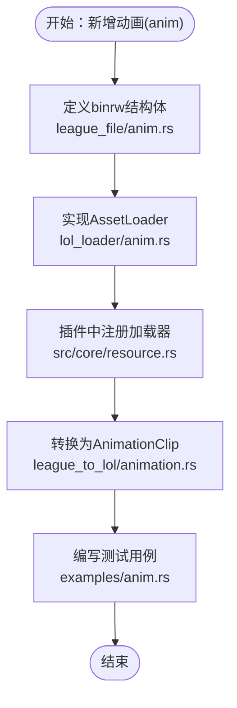
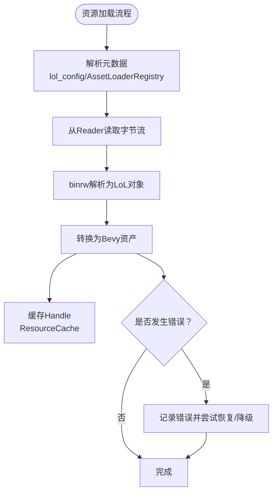
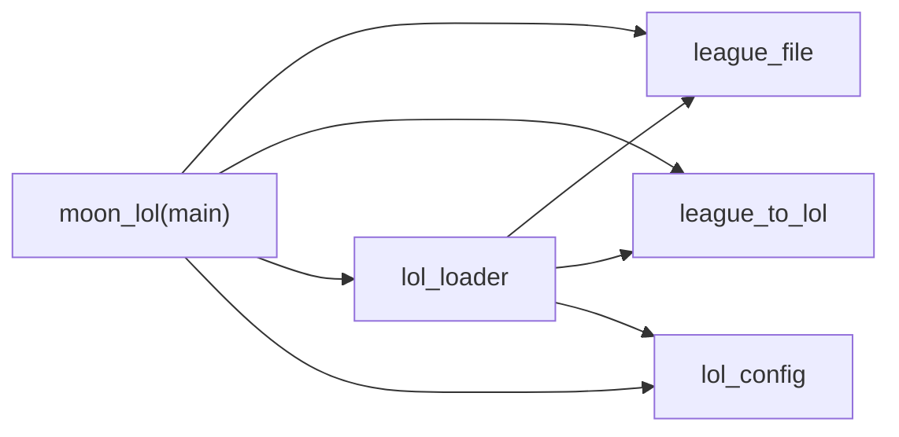

# 添加新资源类型

<cite>
**本文引用的文件**
- [src/main.rs](file://src/main.rs)
- [Cargo.toml](file://Cargo.toml)
- [crates/lol_loader/src/lib.rs](file://crates/lol_loader/src/lib.rs)
- [crates/league_file/src/lib.rs](file://crates/league_file/src/lib.rs)
- [crates/league_file/src/mesh_static.rs](file://crates/league_file/src/mesh_static.rs)
- [crates/league_file/src/texture.rs](file://crates/league_file/src/texture.rs)
- [crates/league_file/src/animation.rs](file://crates/league_file/src/animation.rs)
- [crates/league_to_lol/src/mesh_static.rs](file://crates/league_to_lol/src/mesh_static.rs)
- [crates/league_to_lol/src/animation.rs](file://crates/league_to_lol/src/animation.rs)
- [crates/lol_config/src/register.rs](file://crates/lol_config/src/register.rs)
- [crates/lol_config/src/prop.rs](file://crates/lol_config/src/prop.rs)
- [crates/league_utils/src/lib.rs](file://crates/league_utils/src/lib.rs)
- [src/core/resource.rs](file://src/core/resource.rs)
- [examples/texture.rs](file://examples/texture.rs)
- [examples/shader_convert.rs](file://examples/shader_convert.rs)
</cite>

## 目录
1. [简介](#简介)
2. [项目结构](#项目结构)
3. [核心组件](#核心组件)
4. [架构总览](#架构总览)
5. [详细组件分析](#详细组件分析)
6. [依赖关系分析](#依赖关系分析)
7. [性能考量](#性能考量)
8. [故障排查指南](#故障排查指南)
9. [结论](#结论)
10. [附录](#附录)

## 简介
本指南面向希望为《英雄联盟》游戏框架扩展支持新资源文件类型的开发者。目标是在现有体系上新增一种新的LoL资源类型（例如新的模型、材质或动画格式），并使其无缝接入Bevy资产系统。我们将分步骤说明：
- 在crates/league_file中新增解析模块或扩展现有模块，使用binrw定义二进制结构体与读取逻辑；
- 实现自定义AssetLoader trait，使其能被Bevy识别并注册；
- 在src/main.rs或相关插件中完成加载器注册；
- 编写资源转换逻辑，将原始LoL资源转换为Bevy可渲染的Mesh、Texture或AnimationClip等类型；
- 解释资源元数据、缓存策略与错误恢复机制；
- 提供单元测试思路与示例路径，参考examples/中的测试用例。

## 项目结构
该仓库采用多crate工作区组织，核心与资源加载相关的模块分布如下：
- crates/league_file：定义LoL二进制资源的binrw结构与解析逻辑（如scb、tex、anm等）。
- crates/league_to_lol：提供从LoL中间表示到Bevy资源的转换函数（如mesh_static_to_bevy_mesh、load_animation_file）。
- crates/lol_loader：实现Bevy AssetLoader trait，将LoL资源加载为Bevy资产（Mesh、Image、AnimationClip等）。
- crates/lol_config：Bevy资产注册与动态加载器注册（GenericLoader、AssetLoaderRegistry）。
- src/core/resource.rs：Bevy插件中初始化资产类型、注册加载器、资源缓存与事件驱动的属性加载流程。
- examples/：包含纹理解析与着色器转换的示例程序，便于理解二进制读取与转换流程。

图表来源
- [src/main.rs](file://src/main.rs#L56-L114)
- [src/core/resource.rs](file://src/core/resource.rs#L35-L73)
- [crates/lol_loader/src/lib.rs](file://crates/lol_loader/src/lib.rs#L1-L120)
- [crates/league_file/src/lib.rs](file://crates/league_file/src/lib.rs#L1-L20)
- [crates/league_to_lol/src/mesh_static.rs](file://crates/league_to_lol/src/mesh_static.rs#L1-L75)
- [crates/lol_config/src/register.rs](file://crates/lol_config/src/register.rs#L1-L109)
- [crates/lol_config/src/prop.rs](file://crates/lol_config/src/prop.rs#L1-L61)
- [crates/league_utils/src/lib.rs](file://crates/league_utils/src/lib.rs#L58-L117)
- [examples/texture.rs](file://examples/texture.rs#L1-L19)
- [examples/shader_convert.rs](file://examples/shader_convert.rs#L1-L29)

章节来源
- [src/main.rs](file://src/main.rs#L56-L114)
- [Cargo.toml](file://Cargo.toml#L1-L63)

## 核心组件
- Bevy AssetLoader实现：在lol_loader中已有多种资源类型的AssetLoader实现，包括静态网格、纹理、骨骼、地图几何、动画剪辑与着色器TOC等。这些实现展示了如何从Reader读取字节流、解析binrw结构、转换为Bevy资产并返回。
- LoL二进制解析：league_file通过binrw定义了LeagueMeshStatic、LeagueTexture、AnimationFile等结构，确保与LoL原生格式严格对齐。
- 资源转换：league_to_lol提供mesh_static_to_bevy_mesh、load_animation_file等函数，将LoL中间表示转换为Bevy Mesh、AnimationClip等。
- 动态加载器注册：lol_config提供GenericLoader与AssetLoaderRegistry，支持按类型名哈希注册并动态加载League Properties中的条目。
- 插件注册与初始化：src/core/resource.rs在PluginResource中完成init_asset::<T>()、init_asset_loader::<T>()、资源缓存与事件系统注册。

章节来源
- [crates/lol_loader/src/lib.rs](file://crates/lol_loader/src/lib.rs#L1-L120)
- [crates/league_file/src/mesh_static.rs](file://crates/league_file/src/mesh_static.rs#L1-L182)
- [crates/league_file/src/texture.rs](file://crates/league_file/src/texture.rs#L1-L135)
- [crates/league_file/src/animation.rs](file://crates/league_file/src/animation.rs#L1-L200)
- [crates/league_to_lol/src/mesh_static.rs](file://crates/league_to_lol/src/mesh_static.rs#L1-L75)
- [crates/league_to_lol/src/animation.rs](file://crates/league_to_lol/src/animation.rs#L1-L120)
- [crates/lol_config/src/register.rs](file://crates/lol_config/src/register.rs#L1-L109)
- [src/core/resource.rs](file://src/core/resource.rs#L35-L73)

## 架构总览
下面的序列图展示了从Bevy应用启动到资源加载与转换的关键流程，包括属性加载、动态注册与资源缓存。

图表来源
- [src/core/resource.rs](file://src/core/resource.rs#L35-L73)
- [crates/lol_loader/src/lib.rs](file://crates/lol_loader/src/lib.rs#L1-L120)
- [crates/league_file/src/mesh_static.rs](file://crates/league_file/src/mesh_static.rs#L1-L182)
- [crates/league_to_lol/src/mesh_static.rs](file://crates/league_to_lol/src/mesh_static.rs#L1-L75)
- [src/core/resource.rs](file://src/core/resource.rs#L208-L230)

## 详细组件分析

### 新增资源类型：静态网格(scn)解析与加载
目标：为新的静态网格文件(.scn)添加解析与加载支持。

- 步骤一：在league_file中新增解析模块
  - 在crates/league_file/src/下新增scn.rs，使用binrw定义二进制结构体，遵循现有模式（如Magic、版本断言、字段映射等）。
  - 参考现有结构体风格：[LeagueMeshStatic](file://crates/league_file/src/mesh_static.rs#L73-L128)、[LeagueTexture](file://crates/league_file/src/texture.rs#L1-L60)。
  - 导出模块并在lib.rs中公开：[league_file/src/lib.rs](file://crates/league_file/src/lib.rs#L1-L20)。

- 步骤二：实现Bevy AssetLoader
  - 在crates/lol_loader/src/lib.rs中新增LeagueLoaderScn，实现AssetLoader trait，load函数中读取Reader字节流，解析为LeagueScn，再调用转换函数生成Mesh。
  - 参考现有实现：[LeagueLoaderMeshStatic](file://crates/lol_loader/src/lib.rs#L224-L250)、[mesh_static_to_bevy_mesh](file://crates/league_to_lol/src/mesh_static.rs#L1-L75)。

- 步骤三：在插件中注册
  - 在src/core/resource.rs中调用app.init_asset_loader::<LeagueLoaderScn>()与extensions声明。
  - 参考现有注册：[init_asset_loader::<...>](file://src/core/resource.rs#L46-L53)。

- 步骤四：资源转换
  - 若LeagueScn与LeagueMeshStatic差异较大，可在league_to_lol中新增转换函数，或将scn转换为中间表示后再转Mesh。
  - 参考转换模式：[mesh_static_to_bevy_mesh](file://crates/league_to_lol/src/mesh_static.rs#L1-L75)。

- 步骤五：单元测试
  - 可仿照examples/texture.rs的模式，编写scn解析与转换的测试程序，验证读取与生成Mesh的正确性。
  - 示例参考：[examples/texture.rs](file://examples/texture.rs#L1-L19)。

图表来源
- [crates/league_file/src/lib.rs](file://crates/league_file/src/lib.rs#L1-L20)
- [crates/lol_loader/src/lib.rs](file://crates/lol_loader/src/lib.rs#L224-L250)
- [src/core/resource.rs](file://src/core/resource.rs#L46-L53)
- [crates/league_to_lol/src/mesh_static.rs](file://crates/league_to_lol/src/mesh_static.rs#L1-L75)
- [examples/texture.rs](file://examples/texture.rs#L1-L19)

章节来源
- [crates/league_file/src/lib.rs](file://crates/league_file/src/lib.rs#L1-L20)
- [crates/lol_loader/src/lib.rs](file://crates/lol_loader/src/lib.rs#L224-L250)
- [src/core/resource.rs](file://src/core/resource.rs#L46-L53)
- [crates/league_to_lol/src/mesh_static.rs](file://crates/league_to_lol/src/mesh_static.rs#L1-L75)
- [examples/texture.rs](file://examples/texture.rs#L1-L19)

### 新增资源类型：材质/纹理(txc)解析与加载
目标：为新的材质/纹理文件(.txc)添加解析与加载支持。

- 步骤一：在league_file中新增解析模块
  - 在crates/league_file/src/下新增txc.rs，使用binrw定义二进制结构体，解析纹理元数据与mipmap数据。
  - 参考现有纹理解析：[LeagueTexture](file://crates/league_file/src/texture.rs#L1-L135)。

- 步骤二：实现Bevy AssetLoader
  - 在crates/lol_loader/src/lib.rs中新增LeagueLoaderTxc，实现AssetLoader trait，load函数中解析为LeagueTxc，构造Image与TextureDescriptor。
  - 参考现有纹理加载：[LeagueLoaderImage](file://crates/lol_loader/src/lib.rs#L252-L331)。

- 步骤三：在插件中注册
  - 在src/core/resource.rs中调用app.init_asset_loader::<LeagueLoaderTxc>()与extensions声明。
  - 参考现有注册：[init_asset_loader::<...>](file://src/core/resource.rs#L46-L53)。

- 步骤四：资源转换
  - 将LeagueTxc转换为Bevy Image，注意格式映射与sRGB处理。
  - 参考转换模式：[LeagueLoaderImage](file://crates/lol_loader/src/lib.rs#L252-L331)。

- 步骤五：单元测试
  - 可仿照examples/texture.rs的模式，编写txc解析与转换的测试程序。
  - 示例参考：[examples/texture.rs](file://examples/texture.rs#L1-L19)。

图表来源
- [crates/league_file/src/texture.rs](file://crates/league_file/src/texture.rs#L1-L135)
- [crates/lol_loader/src/lib.rs](file://crates/lol_loader/src/lib.rs#L252-L331)
- [src/core/resource.rs](file://src/core/resource.rs#L46-L53)
- [examples/texture.rs](file://examples/texture.rs#L1-L19)

章节来源
- [crates/league_file/src/texture.rs](file://crates/league_file/src/texture.rs#L1-L135)
- [crates/lol_loader/src/lib.rs](file://crates/lol_loader/src/lib.rs#L252-L331)
- [src/core/resource.rs](file://src/core/resource.rs#L46-L53)
- [examples/texture.rs](file://examples/texture.rs#L1-L19)

### 新增资源类型：动画(anim)解析与加载
目标：为新的动画文件(.anim)添加解析与加载支持。

- 步骤一：在league_file中新增解析模块
  - 在crates/league_file/src/下新增anim.rs，使用binrw定义二进制结构体，解析动画帧与关节信息。
  - 参考现有动画解析：[AnimationFile](file://crates/league_file/src/animation.rs#L1-L60)、[CompressedData](file://crates/league_file/src/animation.rs#L47-L97)、[UncompressedDataV5](file://crates/league_file/src/animation.rs#L225-L275)。

- 步骤二：实现Bevy AssetLoader
  - 在crates/lol_loader/src/lib.rs中新增LeagueLoaderAnim，实现AssetLoader trait，load函数中解析为AnimationFile，再调用load_animation_file生成AnimationClip。
  - 参考现有动画加载：[LeagueLoaderAnimationClip](file://crates/lol_loader/src/lib.rs#L333-L398)、[load_animation_file](file://crates/league_to_lol/src/animation.rs#L1-L120)。

- 步骤三：在插件中注册
  - 在src/core/resource.rs中调用app.init_asset_loader::<LeagueLoaderAnim>()与extensions声明。
  - 参考现有注册：[init_asset_loader::<...>](file://src/core/resource.rs#L46-L53)。

- 步骤四：资源转换
  - 使用league_to_lol提供的load_animation_file将LoL动画转换为AnimationClip曲线。
  - 参考转换模式：[load_animation_file](file://crates/league_to_lol/src/animation.rs#L1-L120)。

- 步骤五：单元测试
  - 可仿照examples/texture.rs的模式，编写anim解析与转换的测试程序。
  - 示例参考：[examples/texture.rs](file://examples/texture.rs#L1-L19)。

图表来源
- [crates/league_file/src/animation.rs](file://crates/league_file/src/animation.rs#L1-L200)
- [crates/lol_loader/src/lib.rs](file://crates/lol_loader/src/lib.rs#L333-L398)
- [crates/league_to_lol/src/animation.rs](file://crates/league_to_lol/src/animation.rs#L1-L120)
- [src/core/resource.rs](file://src/core/resource.rs#L46-L53)
- [examples/texture.rs](file://examples/texture.rs#L1-L19)

章节来源
- [crates/league_file/src/animation.rs](file://crates/league_file/src/animation.rs#L1-L200)
- [crates/lol_loader/src/lib.rs](file://crates/lol_loader/src/lib.rs#L333-L398)
- [crates/league_to_lol/src/animation.rs](file://crates/league_to_lol/src/animation.rs#L1-L120)
- [src/core/resource.rs](file://src/core/resource.rs#L46-L53)
- [examples/texture.rs](file://examples/texture.rs#L1-L19)

### 资源元数据、缓存策略与错误恢复
- 元数据与类型注册
  - 通过lol_config的AssetLoaderRegistry与GenericLoader，按类型名哈希注册并动态加载League Properties中的条目。
  - 参考：[AssetLoaderRegistry](file://crates/lol_config/src/register.rs#L1-L109)、[HashKey](file://crates/lol_config/src/prop.rs#L1-L61)。

- 资源缓存
  - ResourceCache提供图像与网格的简单缓存，避免重复加载。
  - 参考：[ResourceCache](file://src/core/resource.rs#L208-L230)。

- 错误恢复
  - lol_loader中定义了统一的Error枚举，覆盖Io、Bincode、BinRead等错误类型，便于在加载失败时进行恢复或降级。
  - 参考：[Error](file://crates/lol_loader/src/lib.rs#L31-L45)。

图表来源
- [crates/lol_loader/src/lib.rs](file://crates/lol_loader/src/lib.rs#L31-L45)
- [crates/lol_config/src/register.rs](file://crates/lol_config/src/register.rs#L1-L109)
- [src/core/resource.rs](file://src/core/resource.rs#L208-L230)

章节来源
- [crates/lol_loader/src/lib.rs](file://crates/lol_loader/src/lib.rs#L31-L45)
- [crates/lol_config/src/register.rs](file://crates/lol_config/src/register.rs#L1-L109)
- [src/core/resource.rs](file://src/core/resource.rs#L208-L230)

## 依赖关系分析
- crate间依赖
  - moon_lol依赖多个crates，其中league_file、league_to_lol、lol_loader、lol_config等与资源加载密切相关。
  - 参考：[Cargo.toml](file://Cargo.toml#L1-L63)。

- 关键导入关系
  - lol_loader依赖league_file、league_to_lol、lol_config等，用于解析LoL二进制、转换为Bevy资产与注册动态加载器。
  - 参考：[lol_loader/src/lib.rs](file://crates/lol_loader/src/lib.rs#L1-L30)。

图表来源
- [Cargo.toml](file://Cargo.toml#L1-L63)
- [crates/lol_loader/src/lib.rs](file://crates/lol_loader/src/lib.rs#L1-L30)

章节来源
- [Cargo.toml](file://Cargo.toml#L1-L63)
- [crates/lol_loader/src/lib.rs](file://crates/lol_loader/src/lib.rs#L1-L30)

## 性能考量
- 二进制解析优化
  - 使用binrw的按需读取与计算字段，减少不必要的拷贝与分支判断。
  - 参考：[LeagueMeshStatic.build_faces](file://crates/league_file/src/mesh_static.rs#L130-L181)。

- 资源转换效率
  - Mesh转换时一次性预分配容量，避免多次扩容；仅在需要时插入顶点色属性。
  - 参考：[mesh_static_to_bevy_mesh](file://crates/league_to_lol/src/mesh_static.rs#L1-L75)。

- 缓存命中
  - ResourceCache通过路径映射Handle，避免重复加载同一资源。
  - 参考：[ResourceCache](file://src/core/resource.rs#L208-L230)。

- 异步加载
  - Bevy AssetLoader异步读取字节流，结合binrw解析，适合大文件场景。
  - 参考：[LeagueLoaderImage.load](file://crates/lol_loader/src/lib.rs#L262-L326)。

## 故障排查指南
- 常见错误类型
  - Io错误：文件不存在或读取失败。
  - Bincode错误：序列化/反序列化问题。
  - BinRead错误：二进制格式断言失败或字段解析异常。
  - 参考：[Error](file://crates/lol_loader/src/lib.rs#L31-L45)。

- 排查步骤
  - 使用examples/texture.rs类似的模式，先单独读取并打印结构体，确认binrw解析是否成功。
  - 参考：[examples/texture.rs](file://examples/texture.rs#L1-L19)。

- 错误恢复
  - 在插件中捕获错误并记录上下文，必要时降级为默认资源或跳过加载。
  - 参考：[lol_config/错误上下文](file://crates/league_property/src/types.rs#L1-L158)。

章节来源
- [crates/lol_loader/src/lib.rs](file://crates/lol_loader/src/lib.rs#L31-L45)
- [examples/texture.rs](file://examples/texture.rs#L1-L19)
- [crates/league_property/src/types.rs](file://crates/league_property/src/types.rs#L1-L158)

## 结论
通过以上步骤，可以在现有框架基础上快速扩展新的LoL资源类型。关键在于：
- 使用binrw准确定义二进制结构；
- 实现Bevy AssetLoader并将LoL中间表示转换为Bevy资产；
- 在插件中完成init_asset与init_asset_loader注册；
- 借助动态加载器与资源缓存提升加载效率；
- 通过单元测试与错误恢复保障稳定性。

## 附录
- 示例程序参考
  - 纹理解析示例：[examples/texture.rs](file://examples/texture.rs#L1-L19)
  - 着色器转换示例：[examples/shader_convert.rs](file://examples/shader_convert.rs#L1-L29)