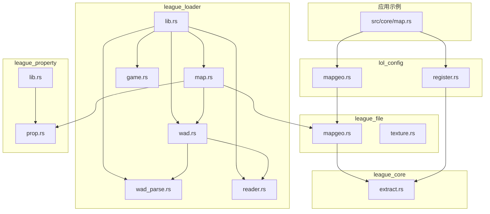
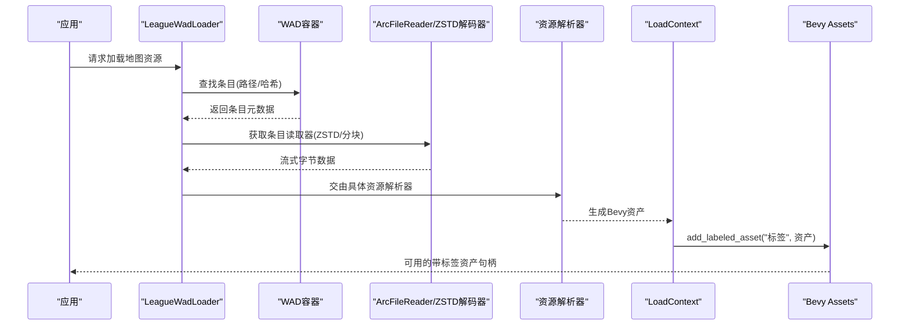
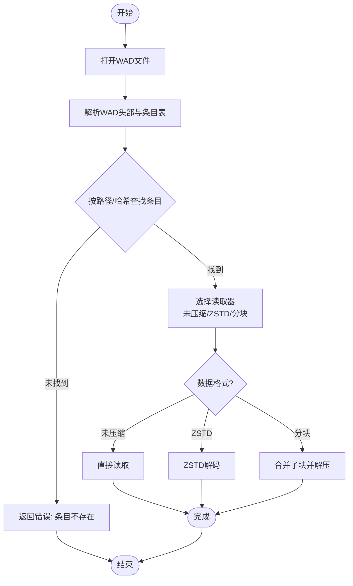
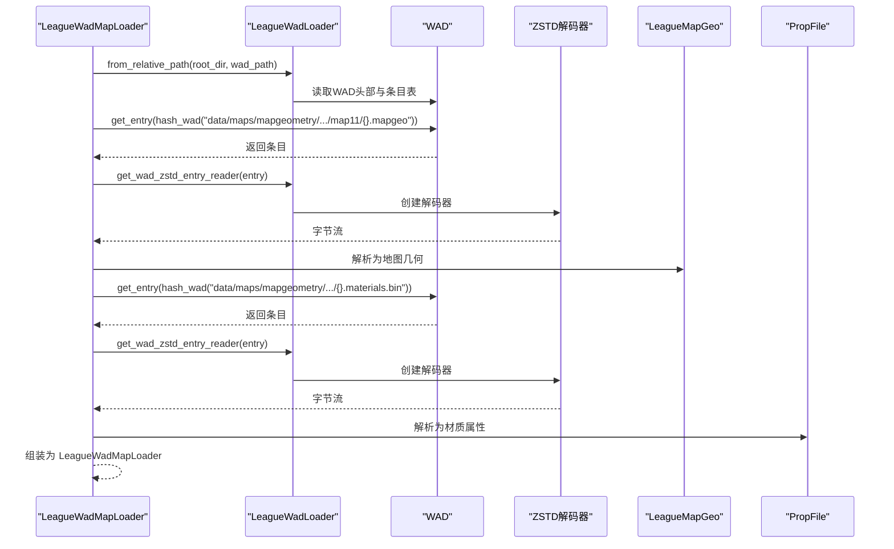
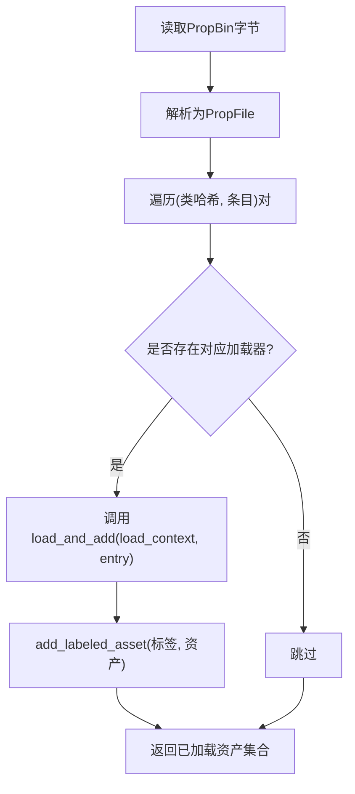
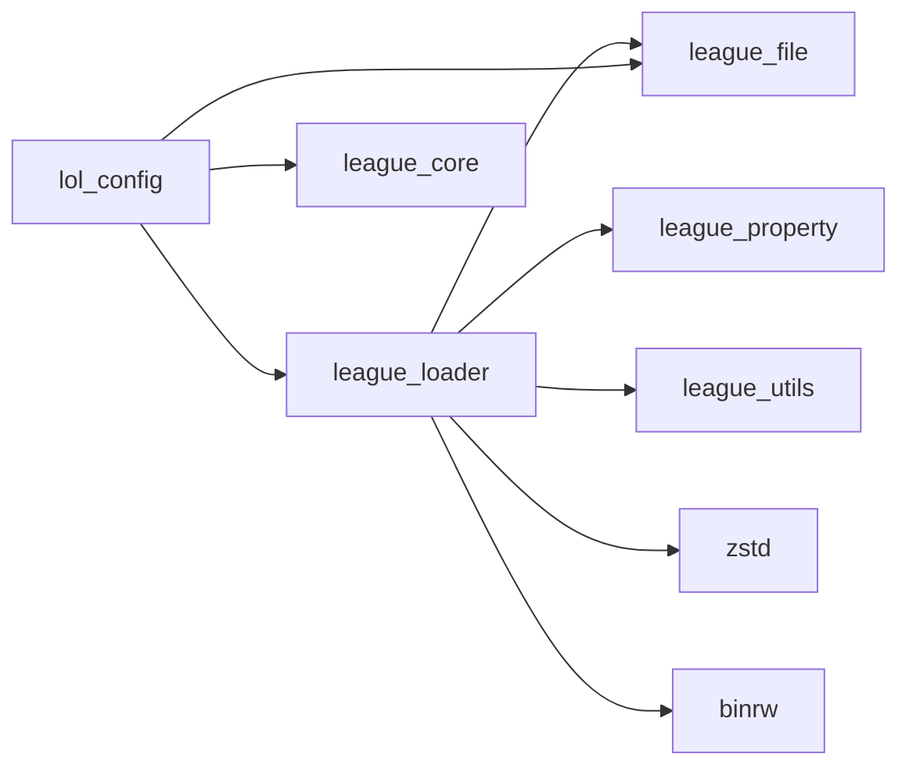

# 自定义资产加载器实现

<cite>
**本文引用的文件**
- [crates/league_loader/src/lib.rs](file://crates/league_loader/src/lib.rs)
- [crates/league_loader/src/map.rs](file://crates/league_loader/src/map.rs)
- [crates/league_loader/src/wad.rs](file://crates/league_loader/src/wad.rs)
- [crates/league_loader/src/wad_parse.rs](file://crates/league_loader/src/wad_parse.rs)
- [crates/league_loader/src/reader.rs](file://crates/league_loader/src/reader.rs)
- [crates/league_loader/src/game.rs](file://crates/league_loader/src/game.rs)
- [crates/league_file/src/mapgeo.rs](file://crates/league_file/src/mapgeo.rs)
- [crates/league_file/src/texture.rs](file://crates/league_file/src/texture.rs)
- [crates/league_property/src/lib.rs](file://crates/league_property/src/lib.rs)
- [crates/league_property/src/prop.rs](file://crates/league_property/src/prop.rs)
- [crates/league_core/src/extract.rs](file://crates/league_core/src/extract.rs)
- [crates/lol_config/src/register.rs](file://crates/lol_config/src/register.rs)
- [crates/lol_config/src/mapgeo.rs](file://crates/lol_config/src/mapgeo.rs)
- [src/core/map.rs](file://src/core/map.rs)
</cite>

## 目录
1. [简介](#简介)
2. [项目结构](#项目结构)
3. [核心组件](#核心组件)
4. [架构总览](#架构总览)
5. [详细组件分析](#详细组件分析)
6. [依赖关系分析](#依赖关系分析)
7. [性能考量](#性能考量)
8. [故障排查指南](#故障排查指南)
9. [结论](#结论)
10. [附录：完整实现模板与最佳实践](#附录完整实现模板与最佳实践)

## 简介
本技术指南面向希望在Bevy中基于`league_loader` crate实现自定义资产加载器的开发者，重点围绕地图资源加载流程展开，以`map.rs`中的地图容器加载为例，系统讲解如何解析WAD容器文件并提取`MapContainer`数据；详细说明`LoadContext`如何添加带标签的资产（labeled asset）；以及如何处理嵌套资源依赖（如地图引用的材质、网格等）。文档还将结合`wad.rs`与`wad_parse.rs`中的二进制解析逻辑，展示从原始字节流到结构化Bevy资源的完整转换过程，并提供`impl AssetLoader for LeagueMapLoader`的完整代码模板与最佳实践，涵盖错误处理、异步加载状态管理与进度报告。

## 项目结构
- 资产加载器位于`crates/league_loader/src/`，负责WAD容器读取、条目解码、子块合并与路径哈希查找。
- 地图几何与材质等具体资源类型定义在`crates/league_file/src/`与`crates/league_core/src/`。
- 属性二进制文件（PropBin）解析在`crates/league_property/src/`。
- Bevy侧注册与动态加载机制在`crates/lol_config/src/`。
- 示例地图加载流程在`src/core/map.rs`中体现。



图表来源
- [crates/league_loader/src/lib.rs](file://crates/league_loader/src/lib.rs#L1-L27)
- [crates/league_loader/src/map.rs](file://crates/league_loader/src/map.rs#L1-L53)
- [crates/league_loader/src/wad.rs](file://crates/league_loader/src/wad.rs#L1-L147)
- [crates/league_loader/src/wad_parse.rs](file://crates/league_loader/src/wad_parse.rs#L1-L101)
- [crates/league_loader/src/reader.rs](file://crates/league_loader/src/reader.rs#L1-L64)
- [crates/league_loader/src/game.rs](file://crates/league_loader/src/game.rs#L1-L97)
- [crates/league_file/src/mapgeo.rs](file://crates/league_file/src/mapgeo.rs#L1-L342)
- [crates/league_file/src/texture.rs](file://crates/league_file/src/texture.rs#L1-L135)
- [crates/league_property/src/lib.rs](file://crates/league_property/src/lib.rs#L1-L33)
- [crates/league_property/src/prop.rs](file://crates/league_property/src/prop.rs#L1-L63)
- [crates/league_core/src/extract.rs](file://crates/league_core/src/extract.rs#L1837-L1855)
- [crates/lol_config/src/register.rs](file://crates/lol_config/src/register.rs#L1-L87)
- [crates/lol_config/src/mapgeo.rs](file://crates/lol_config/src/mapgeo.rs#L1-L7)
- [src/core/map.rs](file://src/core/map.rs#L49-L216)

章节来源
- [crates/league_loader/src/lib.rs](file://crates/league_loader/src/lib.rs#L1-L27)
- [crates/league_loader/src/map.rs](file://crates/league_loader/src/map.rs#L1-L53)
- [crates/league_loader/src/wad.rs](file://crates/league_loader/src/wad.rs#L1-L147)
- [crates/league_loader/src/wad_parse.rs](file://crates/league_loader/src/wad_parse.rs#L1-L101)
- [crates/league_loader/src/reader.rs](file://crates/league_loader/src/reader.rs#L1-L64)
- [crates/league_loader/src/game.rs](file://crates/league_loader/src/game.rs#L1-L97)
- [crates/league_file/src/mapgeo.rs](file://crates/league_file/src/mapgeo.rs#L1-L342)
- [crates/league_file/src/texture.rs](file://crates/league_file/src/texture.rs#L1-L135)
- [crates/league_property/src/lib.rs](file://crates/league_property/src/lib.rs#L1-L33)
- [crates/league_property/src/prop.rs](file://crates/league_property/src/prop.rs#L1-L63)
- [crates/league_core/src/extract.rs](file://crates/league_core/src/extract.rs#L1837-L1855)
- [crates/lol_config/src/register.rs](file://crates/lol_config/src/register.rs#L1-L87)
- [crates/lol_config/src/mapgeo.rs](file://crates/lol_config/src/mapgeo.rs#L1-L7)
- [src/core/map.rs](file://src/core/map.rs#L49-L216)

## 核心组件
- WAD容器解析与读取
  - 解析WAD头部、条目表与数据格式，支持未压缩、ZSTD压缩、重定向与分块读取。
  - 提供按路径或哈希获取条目读取器的能力。
- 地图资源加载
  - 通过WAD加载器定位并读取地图几何与材质属性文件，构建`MapContainer`与相关资源。
- 属性二进制（PropBin）解析
  - 将二进制属性文件解析为可迭代的类与条目集合，用于后续动态加载。
- Bevy侧注册与动态加载
  - 通过注册表将类型名映射到加载器，支持在运行时按条目加载并添加带标签的资产。

章节来源
- [crates/league_loader/src/wad_parse.rs](file://crates/league_loader/src/wad_parse.rs#L1-L101)
- [crates/league_loader/src/wad.rs](file://crates/league_loader/src/wad.rs#L1-L147)
- [crates/league_loader/src/map.rs](file://crates/league_loader/src/map.rs#L1-L53)
- [crates/league_property/src/prop.rs](file://crates/league_property/src/prop.rs#L1-L63)
- [crates/lol_config/src/register.rs](file://crates/lol_config/src/register.rs#L1-L87)

## 架构总览
下图展示了从WAD容器到Bevy资产的端到端流程：WAD解析器定位条目，按需解码（ZSTD/分块），随后由具体的资源加载器将字节流转换为Bevy资产，并通过`LoadContext`添加带标签的资产，最终被上层系统消费。



图表来源
- [crates/league_loader/src/wad.rs](file://crates/league_loader/src/wad.rs#L59-L127)
- [crates/league_loader/src/wad_parse.rs](file://crates/league_loader/src/wad_parse.rs#L1-L101)
- [crates/league_loader/src/reader.rs](file://crates/league_loader/src/reader.rs#L1-L64)
- [crates/league_file/src/mapgeo.rs](file://crates/league_file/src/mapgeo.rs#L1-L342)
- [crates/lol_config/src/register.rs](file://crates/lol_config/src/register.rs#L40-L67)

## 详细组件分析

### 组件A：WAD容器与条目读取
- 功能要点
  - 从WAD头部读取条目表，支持按路径或哈希查询条目。
  - 支持多种数据格式：未压缩、ZSTD压缩、重定向、分块。
  - 分块读取时根据子块表顺序拼接数据，必要时进行ZSTD解压。
- 关键接口
  - `from_relative_path`: 基于根目录与相对路径打开WAD并解析头部。
  - `get_wad_zstd_entry_reader`: 获取ZSTD解码后的读取器。
  - `get_wad_entry_reader_by_hash`: 按哈希返回条目读取器。
  - `read_chunked_entry`: 合并多个子块并解压。
- 错误处理
  - 条目不存在、子块索引越界、不支持的数据格式等均会抛出错误。



图表来源
- [crates/league_loader/src/wad.rs](file://crates/league_loader/src/wad.rs#L21-L127)
- [crates/league_loader/src/wad_parse.rs](file://crates/league_loader/src/wad_parse.rs#L1-L101)
- [crates/league_loader/src/reader.rs](file://crates/league_loader/src/reader.rs#L1-L64)

章节来源
- [crates/league_loader/src/wad.rs](file://crates/league_loader/src/wad.rs#L1-L147)
- [crates/league_loader/src/wad_parse.rs](file://crates/league_loader/src/wad_parse.rs#L1-L101)
- [crates/league_loader/src/reader.rs](file://crates/league_loader/src/reader.rs#L1-L64)

### 组件B：地图资源加载（MapContainer）
- 目标
  - 从WAD中加载地图几何（`LeagueMapGeo`）与材质属性（`PropFile`），并组合为`MapContainer`。
- 步骤
  - 使用`LeagueWadLoader::from_relative_path`打开指定WAD。
  - 通过`wad.get_entry(hash)`定位地图几何与材质属性文件。
  - 使用`get_wad_zstd_entry_reader`读取并解析为结构化对象。
  - 将`PropFile`中的条目按类型分组，准备后续动态加载。
- 关键点
  - 地图几何文件通常以`.mapgeo`结尾，材质属性文件以`.materials.bin`结尾。
  - 使用`hash_wad`计算路径哈希，确保跨平台一致性。



图表来源
- [crates/league_loader/src/map.rs](file://crates/league_loader/src/map.rs#L1-L53)
- [crates/league_loader/src/wad.rs](file://crates/league_loader/src/wad.rs#L59-L127)
- [crates/league_file/src/mapgeo.rs](file://crates/league_file/src/mapgeo.rs#L1-L342)
- [crates/league_property/src/prop.rs](file://crates/league_property/src/prop.rs#L1-L63)

章节来源
- [crates/league_loader/src/map.rs](file://crates/league_loader/src/map.rs#L1-L53)
- [crates/league_file/src/mapgeo.rs](file://crates/league_file/src/mapgeo.rs#L1-L342)
- [crates/league_property/src/prop.rs](file://crates/league_property/src/prop.rs#L1-L63)

### 组件C：属性二进制（PropBin）解析与动态加载
- 目标
  - 将属性二进制文件解析为条目集合，按类型分组，供动态加载器使用。
- 关键接口
  - `PropFile::iter_class_hash_and_entry`: 迭代(类哈希, 条目)对。
  - `from_entry/from_entry_unwrap`: 将条目反序列化为具体类型。
- 动态加载
  - 通过`AssetLoaderRegistry`将类型名映射到加载器，使用`load_and_add`在`LoadContext`中添加带标签的资产。



图表来源
- [crates/league_property/src/prop.rs](file://crates/league_property/src/prop.rs#L1-L63)
- [crates/league_property/src/lib.rs](file://crates/league_property/src/lib.rs#L1-L33)
- [crates/lol_config/src/register.rs](file://crates/lol_config/src/register.rs#L40-L67)

章节来源
- [crates/league_property/src/prop.rs](file://crates/league_property/src/prop.rs#L1-L63)
- [crates/league_property/src/lib.rs](file://crates/league_property/src/lib.rs#L1-L33)
- [crates/lol_config/src/register.rs](file://crates/lol_config/src/register.rs#L1-L87)

### 组件D：Bevy侧注册与带标签资产
- 目标
  - 在Bevy初始化阶段注册各类资产，使`LoadContext`能够通过`add_labeled_asset`添加带标签的资产。
- 关键点
  - `init_asset`初始化资产类型。
  - `GenericLoader::load_and_add`将条目反序列化为具体资产并添加带标签的资产。
  - `MapContainer`、`StaticMaterialDef`等类型均作为Bevy资产参与加载链路。

```mermaid
classDiagram
class AssetLoaderRegistry {
+register<T>()
+loaders : HashMap<u32, (String, DynamicAssetLoader)>
}
class DynamicAssetLoader {
+load_and_add(load_context, entry) UntypedHandle
+load(world, hash, handle) UntypedHandle
}
class GenericLoader~T~ {
+load_and_add(...)
+load(...)
}
class MapContainer
class StaticMaterialDef
AssetLoaderRegistry --> DynamicAssetLoader : "持有"
DynamicAssetLoader <|.. GenericLoader : "实现"
GenericLoader --> MapContainer : "反序列化并添加"
GenericLoader --> StaticMaterialDef : "反序列化并添加"
```

图表来源
- [crates/lol_config/src/register.rs](file://crates/lol_config/src/register.rs#L1-L87)
- [crates/league_core/src/extract.rs](file://crates/league_core/src/extract.rs#L1837-L1855)

章节来源
- [crates/lol_config/src/register.rs](file://crates/lol_config/src/register.rs#L1-L87)
- [crates/league_core/src/extract.rs](file://crates/league_core/src/extract.rs#L1837-L1855)

## 依赖关系分析
- 模块耦合
  - `league_loader`依赖`binrw`、`zstd`、`league_utils`、`league_core`、`league_file`、`league_property`。
  - `league_file`导出地图几何、纹理等资源类型，供`league_loader`解析后使用。
  - `league_property`提供属性二进制解析能力，驱动动态加载。
  - `lol_config`负责Bevy资产注册与动态加载器注册。
- 外部依赖
  - Bevy的`AssetLoader`、`LoadContext`、`Assets`等API贯穿整个加载链路。
- 循环依赖
  - 当前模块间无循环导入，各模块职责清晰。



图表来源
- [crates/league_loader/src/lib.rs](file://crates/league_loader/src/lib.rs#L1-L27)
- [crates/lol_config/src/register.rs](file://crates/lol_config/src/register.rs#L1-L87)

章节来源
- [crates/league_loader/src/lib.rs](file://crates/league_loader/src/lib.rs#L1-L27)
- [crates/lol_config/src/register.rs](file://crates/lol_config/src/register.rs#L1-L87)

## 性能考量
- I/O与解压
  - 优先使用ZSTD解码器进行流式解压，避免一次性读入大文件导致内存峰值过高。
  - 对分块条目，按顺序合并并解压，减少重复I/O。
- 内存管理
  - 使用`ArcFileReader`与`NoSeek`包装器，避免不必要的seek操作。
  - 对大型资源（如纹理、网格）建议延迟加载或按需解码。
- 并发与缓存
  - 利用Bevy的异步加载特性，将耗时任务放入后台线程。
  - 对常用资源建立缓存，避免重复解析与解码。

## 故障排查指南
- 常见错误
  - 条目未找到：检查路径大小写与哈希是否正确。
  - 子块索引越界：确认WAD子块表与条目元数据一致。
  - 不支持的数据格式：当前实现不支持重定向与gzip格式。
- 排查步骤
  - 验证WAD头部版本与条目计数。
  - 使用`get_wad_entry_by_path/get_wad_entry_by_hash`确认条目存在。
  - 对ZSTD/分块条目，分别测试解码路径与合并逻辑。
- 日志与调试
  - 在关键节点打印条目哈希、偏移、大小与目标大小，便于定位问题。

章节来源
- [crates/league_loader/src/wad.rs](file://crates/league_loader/src/wad.rs#L43-L127)
- [crates/league_loader/src/wad_parse.rs](file://crates/league_loader/src/wad_parse.rs#L1-L101)

## 结论
通过`league_loader`提供的WAD解析与读取能力，结合`league_file`与`league_property`的资源类型定义，开发者可以高效地在Bevy中实现自定义资产加载器。`LoadContext`的带标签资产机制与`lol_config`的动态加载注册体系，使得地图资源加载具备良好的扩展性与可维护性。遵循本文的流程与最佳实践，可在保证性能的前提下，稳定地完成从WAD容器到Bevy资产的转换。

## 附录：完整实现模板与最佳实践

### 实现模板：`impl AssetLoader for LeagueMapLoader`
以下为`LeagueMapLoader`的实现模板与关键步骤说明，请根据实际需求替换类型与路径：
- 类型与导入
  - 导入`bevy::asset::{AssetLoader, LoadContext}`与`bevy::asset::io::Reader`。
  - 导入`league_loader`中的`LeagueWadLoader`、`LeagueWadEntry`、`WadDataFormat`。
  - 导入`league_file`中的`LeagueMapGeo`与`ConfigMapGeo`。
  - 导入`league_property`中的`PropFile`与`from_entry`。
  - 导入`league_core`中的`MapContainer`、`StaticMaterialDef`等。
- 异步加载流程
  - 读取输入字节流至缓冲区。
  - 解析为`LeagueMapGeo`或`PropFile`等中间结构。
  - 使用`LoadContext::add_labeled_asset`添加带标签的资产。
  - 对嵌套资源（材质、网格）通过`from_entry`反序列化并递归加载。
- 错误处理
  - 包装IO、解析与自定义错误，统一返回`Error`类型。
  - 对条目缺失、格式不支持等情况给出明确提示。
- 进度报告
  - 在长耗时阶段调用`LoadContext::progress`更新加载进度。
- 完整模板位置
  - 参考以下路径以获取具体实现位置与上下文：
    - [crates/league_loader/src/map.rs](file://crates/league_loader/src/map.rs#L1-L53)
    - [crates/league_loader/src/wad.rs](file://crates/league_loader/src/wad.rs#L59-L127)
    - [crates/league_file/src/mapgeo.rs](file://crates/league_file/src/mapgeo.rs#L1-L342)
    - [crates/league_property/src/prop.rs](file://crates/league_property/src/prop.rs#L1-L63)
    - [crates/lol_config/src/register.rs](file://crates/lol_config/src/register.rs#L40-L67)

### 最佳实践清单
- 路径与哈希
  - 使用`hash_wad`计算路径哈希，确保跨平台一致性。
- 数据格式
  - 优先使用ZSTD压缩条目；分块条目需按顺序合并并解压。
- 带标签资产
  - 为每个子资源分配唯一标签，便于后续检索与替换。
- 嵌套依赖
  - 先加载父资源（如`MapContainer`），再按需加载子资源（材质、网格）。
- 错误与回退
  - 对缺失条目或损坏数据，提供默认值或降级方案。
- 性能优化
  - 使用流式解码与增量解析，避免一次性加载大文件。
  - 对重复资源进行缓存与去重。