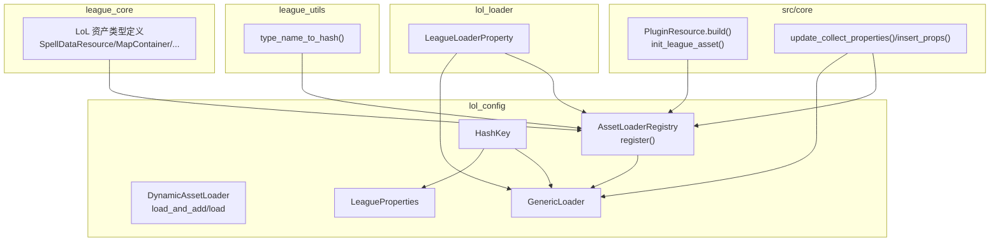
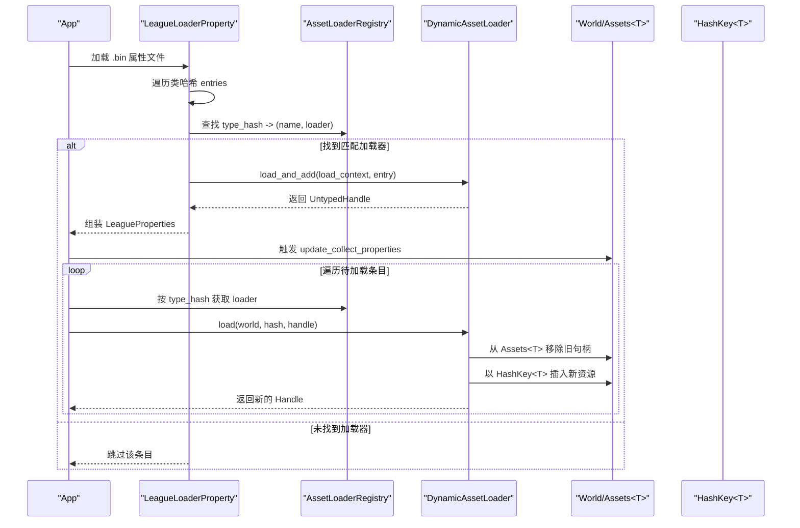
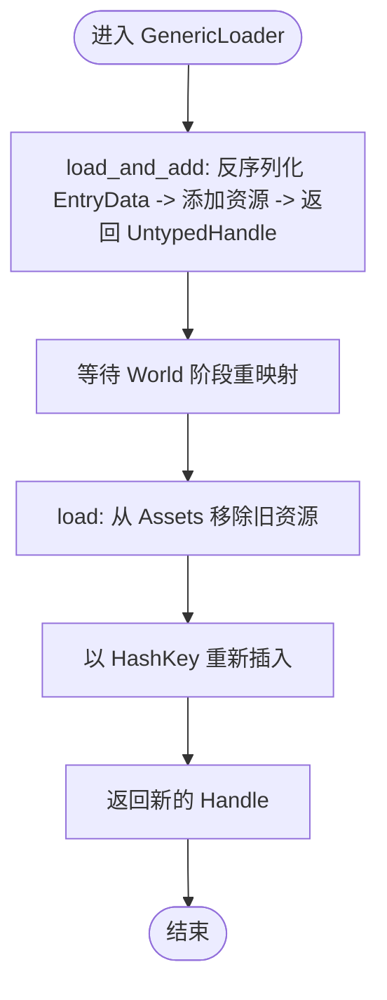
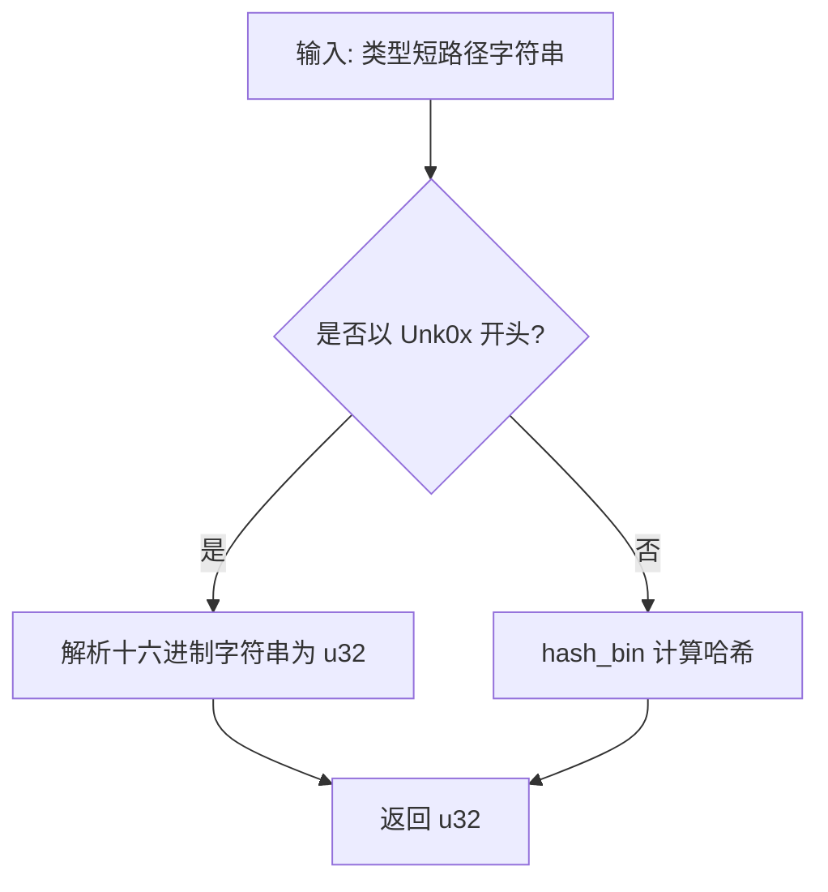
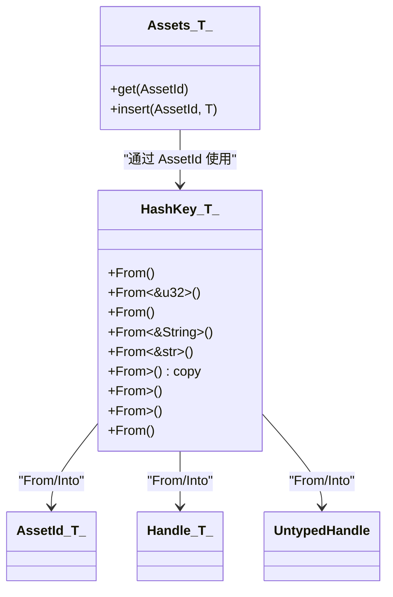
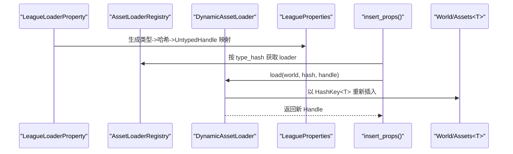
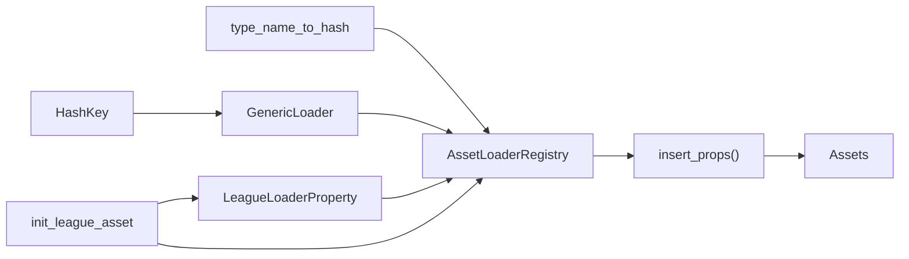

# 资产注册与类型管理

<cite>
**本文引用的文件**
- [crates/lol_config/src/register.rs](file://crates/lol_config/src/register.rs)
- [crates/lol_config/src/prop.rs](file://crates/lol_config/src/prop.rs)
- [crates/league_utils/src/lib.rs](file://crates/league_utils/src/lib.rs)
- [crates/lol_loader/src/lib.rs](file://crates/lol_loader/src/lib.rs)
- [src/core/resource.rs](file://src/core/resource.rs)
- [crates/league_core/src/extract.rs](file://crates/league_core/src/extract.rs)
</cite>

## 目录
1. [简介](#简介)
2. [项目结构](#项目结构)
3. [核心组件](#核心组件)
4. [架构总览](#架构总览)
5. [详细组件分析](#详细组件分析)
6. [依赖关系分析](#依赖关系分析)
7. [性能考量](#性能考量)
8. [故障排查指南](#故障排查指南)
9. [结论](#结论)
10. [附录：示例与最佳实践](#附录示例与最佳实践)

## 简介
本文件围绕 LoL（英雄联盟）资源加载体系中的“资产注册与类型管理”主题，系统阐述以下内容：
- 通过 AssetLoaderRegistry 实现动态资产加载器的注册与分发；
- DynamicAssetLoader trait 的设计与 GenericLoader<T> 对 load_and_add 与 load 方法的实现逻辑；
- type_name_to_hash 如何将 Rust 类型名映射为 u32 哈希，用于高效查找；
- init_league_asset 在 App 启动时批量注册 LoL 特定资产类型；
- 如何为新资产类型调用 AssetLoaderRegistry::register<T>；
- HashKey<T> 的作用及其与 Bevy Handle<T> 系统的集成，确保资源在 World 中的唯一性与可追溯性。

## 项目结构
该功能主要分布在以下模块：
- lol_config：负责资产注册表、动态加载器、类型键与属性聚合；
- league_utils：提供类型名到哈希的转换工具；
- lol_loader：Bevy 资产加载器实现，负责从二进制属性文件中解析并触发注册表分发；
- league_core：LoL 资产类型定义（如 SpellDataResource、MapContainer 等）；
- src/core/resource：应用启动流程，初始化资产与加载器，驱动属性文件加载与资源重映射。



图表来源
- [crates/lol_config/src/register.rs](file://crates/lol_config/src/register.rs#L20-L109)
- [crates/lol_config/src/prop.rs](file://crates/lol_config/src/prop.rs#L1-L153)
- [crates/league_utils/src/lib.rs](file://crates/league_utils/src/lib.rs#L136-L143)
- [crates/lol_loader/src/lib.rs](file://crates/lol_loader/src/lib.rs#L46-L92)
- [src/core/resource.rs](file://src/core/resource.rs#L44-L304)
- [crates/league_core/src/extract.rs](file://crates/league_core/src/extract.rs#L1844-L1854)

章节来源
- [crates/lol_config/src/register.rs](file://crates/lol_config/src/register.rs#L20-L109)
- [crates/lol_config/src/prop.rs](file://crates/lol_config/src/prop.rs#L1-L153)
- [crates/league_utils/src/lib.rs](file://crates/league_utils/src/lib.rs#L136-L143)
- [crates/lol_loader/src/lib.rs](file://crates/lol_loader/src/lib.rs#L46-L92)
- [src/core/resource.rs](file://src/core/resource.rs#L44-L304)
- [crates/league_core/src/extract.rs](file://crates/league_core/src/extract.rs#L1844-L1854)

## 核心组件
- AssetLoaderRegistry：维护类型哈希到加载器实例的映射，提供 register<T>() 便捷注册方法。
- DynamicAssetLoader：定义两类加载能力：load_and_add（在加载上下文中直接添加资源并返回 UntypedHandle），load（在 World 中将已加载资源按 HashKey 重新插入并返回 Handle）。
- GenericLoader<T>：为任意实现了 Asset + DeserializeOwned + TypePath + Send + Sync + 'static 的类型提供默认加载实现。
- HashKey<T>：轻量类型参数化的 u32 键，支持与 Bevy AssetId/Handle/UntypedHandle 的互转，保证资源唯一性与可追溯性。
- type_name_to_hash：将类型短路径字符串映射为 u32 哈希，作为注册表与属性文件中的类型标识。
- init_league_asset：在 App 启动阶段批量初始化 LoL 资产类型，确保 Bevy 资产系统就绪。
- LeagueLoaderProperty：Bevy 资产加载器，读取属性二进制文件，遍历类哈希，查询注册表并分发给对应加载器。

章节来源
- [crates/lol_config/src/register.rs](file://crates/lol_config/src/register.rs#L20-L109)
- [crates/lol_config/src/prop.rs](file://crates/lol_config/src/prop.rs#L1-L153)
- [crates/league_utils/src/lib.rs](file://crates/league_utils/src/lib.rs#L136-L143)
- [crates/lol_loader/src/lib.rs](file://crates/lol_loader/src/lib.rs#L46-L92)
- [src/core/resource.rs](file://src/core/resource.rs#L44-L62)

## 架构总览
下图展示了从属性文件加载到资源最终在 World 中以 HashKey 重映射的关键流程。



图表来源
- [crates/lol_loader/src/lib.rs](file://crates/lol_loader/src/lib.rs#L46-L92)
- [crates/lol_config/src/register.rs](file://crates/lol_config/src/register.rs#L20-L109)
- [src/core/resource.rs](file://src/core/resource.rs#L286-L304)

章节来源
- [crates/lol_loader/src/lib.rs](file://crates/lol_loader/src/lib.rs#L46-L92)
- [crates/lol_config/src/register.rs](file://crates/lol_config/src/register.rs#L20-L109)
- [src/core/resource.rs](file://src/core/resource.rs#L286-L304)

## 详细组件分析

### 组件一：AssetLoaderRegistry 与 DynamicAssetLoader
- 注册机制：register<T>() 将类型短路径字符串经 type_name_to_hash 映射为 u32，作为注册表键；同时保存类型名称与 GenericLoader<T> 实例。
- 分发机制：在属性文件加载后，根据条目中的类型哈希查找加载器，先执行 load_and_add 添加资源，再在 World 中执行 load 完成重映射。

```mermaid
classDiagram
class AssetLoaderRegistry {
+loaders : HashMap<u32, (String, Box<dyn DynamicAssetLoader>)>
+register<T>()
}
class DynamicAssetLoader {
<<interface>>
+load_and_add(load_context, entry) UntypedHandle
+load(world, hash, handle) UntypedHandle
}
class GenericLoader_T_ {
+load_and_add(...)
+load(...)
}
AssetLoaderRegistry --> GenericLoader_T_ : "注册时绑定"
GenericLoader_T_ ..|> DynamicAssetLoader : "实现"
```

图表来源
- [crates/lol_config/src/register.rs](file://crates/lol_config/src/register.rs#L20-L109)

章节来源
- [crates/lol_config/src/register.rs](file://crates/lol_config/src/register.rs#L20-L109)

### 组件二：GenericLoader<T> 的实现逻辑
- load_and_add：从 EntryData 反序列化为具体资产类型，交由 LoadContext 添加带标签的资源，返回 UntypedHandle。
- load：从 World 的 Assets<T> 中移除旧句柄对应的资源，以 HashKey<T> 作为新键重新插入，返回新的 Handle。



图表来源
- [crates/lol_config/src/register.rs](file://crates/lol_config/src/register.rs#L48-L67)

章节来源
- [crates/lol_config/src/register.rs](file://crates/lol_config/src/register.rs#L48-L67)

### 组件三：type_name_to_hash 的映射策略
- 当类型名为“Unk0x...”格式时，直接解析十六进制字符串为 u32；
- 否则使用 hash_bin 对类型短路径字符串进行哈希计算，得到稳定的 u32 值。
- 该哈希值用于：
  - 注册表键（注册时）；
  - 属性文件中类哈希的匹配（加载时）；
  - LeagueProperties 的类型维度索引（存储时）。



图表来源
- [crates/league_utils/src/lib.rs](file://crates/league_utils/src/lib.rs#L136-L143)

章节来源
- [crates/league_utils/src/lib.rs](file://crates/league_utils/src/lib.rs#L136-L143)

### 组件四：init_league_asset 的批量注册
- 在 App 启动阶段调用，预先初始化一批 LoL 资产类型，使 Bevy 资产系统对这些类型就绪，避免运行时首次访问导致的延迟或错误。
- 典型类型包括：SpellDataResource、MapContainer、StaticMaterialDef、SkinCharacterDataProperties、SpellObject、MapPlaceableContainer、Unk0xad65d8c4、VfxSystemDefinitionData、CharacterRecord、ResourceResolver、UiElementIconData、UiElementRegionData、BuffData、BarracksConfig、AnimationGraphData、UiElementEffectAnimationData、UiElementGroupButtonData 等。

章节来源
- [crates/lol_config/src/register.rs](file://crates/lol_config/src/register.rs#L69-L87)
- [src/core/resource.rs](file://src/core/resource.rs#L44-L62)

### 组件五：HashKey<T> 与 Bevy Handle<T> 的集成
- HashKey<T> 是一个轻量包装，内部持有 u32，用于资源键的类型安全表示；
- 提供 From/Into 实现，将 HashKey<T> 与 Bevy 的 AssetId<T>、Handle<T>、UntypedHandle 进行互转；
- 在 GenericLoader<T>::load 中，使用 HashKey<T>::from(hash) 作为新键，确保资源在 World 中以稳定且可追溯的方式存储。



图表来源
- [crates/lol_config/src/prop.rs](file://crates/lol_config/src/prop.rs#L1-L106)

章节来源
- [crates/lol_config/src/prop.rs](file://crates/lol_config/src/prop.rs#L1-L106)

### 组件六：属性文件加载与资源重映射流程
- LeagueLoaderProperty：读取 .bin 文件，遍历每个类哈希，查询注册表并调用 load_and_add，构建 LeagueProperties；
- update_collect_properties/insert_props：从 LeagueProperties 收集待加载条目，按 type_hash 再次查询注册表，调用 loader.load 完成资源重映射。



图表来源
- [crates/lol_loader/src/lib.rs](file://crates/lol_loader/src/lib.rs#L46-L92)
- [src/core/resource.rs](file://src/core/resource.rs#L286-L304)

章节来源
- [crates/lol_loader/src/lib.rs](file://crates/lol_loader/src/lib.rs#L46-L92)
- [src/core/resource.rs](file://src/core/resource.rs#L286-L304)

## 依赖关系分析
- 注册表依赖：
  - type_name_to_hash：用于将类型短路径映射为 u32；
  - GenericLoader<T>：作为所有注册类型的默认加载器实现；
  - HashKey<T>：作为资源键的类型安全载体。
- 加载器依赖：
  - LeagueLoaderProperty：读取属性文件，驱动注册表分发；
  - Bevy Assets<T>：实际存储资源，配合 HashKey<T> 完成重映射。
- 应用启动依赖：
  - init_league_asset：确保 Bevy 资产系统对 LoL 类型就绪；
  - PluginResource.build：初始化各类加载器与资源，触发属性文件加载与重映射。



图表来源
- [crates/league_utils/src/lib.rs](file://crates/league_utils/src/lib.rs#L136-L143)
- [crates/lol_config/src/register.rs](file://crates/lol_config/src/register.rs#L20-L109)
- [crates/lol_loader/src/lib.rs](file://crates/lol_loader/src/lib.rs#L46-L92)
- [src/core/resource.rs](file://src/core/resource.rs#L44-L62)

章节来源
- [crates/league_utils/src/lib.rs](file://crates/league_utils/src/lib.rs#L136-L143)
- [crates/lol_config/src/register.rs](file://crates/lol_config/src/register.rs#L20-L109)
- [crates/lol_loader/src/lib.rs](file://crates/lol_loader/src/lib.rs#L46-L92)
- [src/core/resource.rs](file://src/core/resource.rs#L44-L62)

## 性能考量
- 哈希映射：type_name_to_hash 与 hash_bin 提供 O(1) 级别的类型/字符串到 u32 的映射，注册与查找均为常数时间复杂度。
- 资源重映射：load_and_add 与 load 的组合避免了重复反序列化，仅在 World 阶段做一次键替换，减少内存占用与拷贝成本。
- 批量处理：init_league_asset 在启动阶段完成类型初始化，降低运行时开销。
- 并发安全：DynamicAssetLoader trait 限定为 Send + Sync，适配多线程加载场景。

## 故障排查指南
- 注册失败：检查类型是否满足 Asset + DeserializeOwned + TypePath + Send + Sync + 'static 约束；确认 short_type_path 是否可识别。
- 类型哈希不匹配：确认属性文件中的类哈希与 type_name_to_hash 的结果一致；若类型名包含 Unk0x 前缀，需确保十六进制格式正确。
- 资源未出现：检查 LeagueLoaderProperty 是否成功遍历条目并调用 load_and_add；随后确认 insert_props 是否被调度执行。
- 重映射异常：核对 GenericLoader<T>::load 的键替换逻辑，确保 HashKey<T>::from(hash) 与 Assets<T> 的 AssetId<T> 互转无误。

章节来源
- [crates/lol_config/src/register.rs](file://crates/lol_config/src/register.rs#L48-L67)
- [crates/lol_loader/src/lib.rs](file://crates/lol_loader/src/lib.rs#L46-L92)
- [src/core/resource.rs](file://src/core/resource.rs#L286-L304)

## 结论
该体系通过 AssetLoaderRegistry 与 DynamicAssetLoader 的解耦设计，结合 type_name_to_hash 的稳定哈希与 HashKey<T> 的类型安全键，实现了 LoL 资产的动态注册、统一分发与高效重映射。init_league_asset 在启动阶段完成类型初始化，确保运行时加载的稳定性与一致性。整体架构清晰、扩展性强，便于新增资产类型与加载器。

## 附录：示例与最佳实践

### 新增资产类型的注册步骤
- 步骤一：确保目标类型实现必要的 trait（Asset、DeserializeOwned、TypePath、Send、Sync、'static）。
- 步骤二：在应用启动时调用注册表的 register<T>() 方法，将类型加入注册表。
- 步骤三：在属性文件加载流程中，确保 LeagueLoaderProperty 能正确遍历并分发到对应加载器。
- 步骤四：在 World 阶段，insert_props 会自动按类型哈希查找加载器并完成重映射。

参考路径
- [crates/lol_config/src/register.rs](file://crates/lol_config/src/register.rs#L26-L37)
- [crates/lol_loader/src/lib.rs](file://crates/lol_loader/src/lib.rs#L46-L92)
- [src/core/resource.rs](file://src/core/resource.rs#L286-L304)

### 为新资产类型调用 AssetLoaderRegistry::register<T>
- 在应用构建阶段（例如 PluginResource.build 或自定义初始化函数）中，调用 registry.register::<YourType>() 即可完成注册。
- 若类型来自 league_core，请确保已在 init_league_asset 中初始化该类型，以便 Bevy 资产系统就绪。

参考路径
- [crates/lol_config/src/register.rs](file://crates/lol_config/src/register.rs#L26-L37)
- [crates/lol_config/src/register.rs](file://crates/lol_config/src/register.rs#L69-L87)

### LoL 特定资产类型示例
- SpellDataResource：法术数据资源；
- MapContainer：地图容器；
- StaticMaterialDef：静态材质定义；
- MapPlaceableContainer：地图放置物容器；
- CharacterRecord：角色记录；
- 其他类型详见 league_core 的 extract.rs 中的定义。

参考路径
- [crates/league_core/src/extract.rs](file://crates/league_core/src/extract.rs#L1844-L1854)
- [crates/league_core/src/extract.rs](file://crates/league_core/src/extract.rs#L2517-L2550)
- [crates/lol_config/src/register.rs](file://crates/lol_config/src/register.rs#L69-L87)