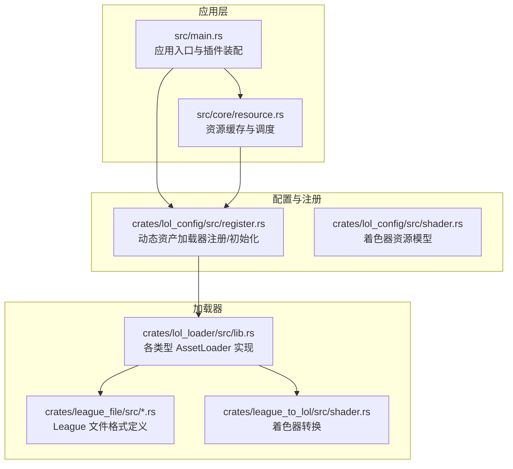
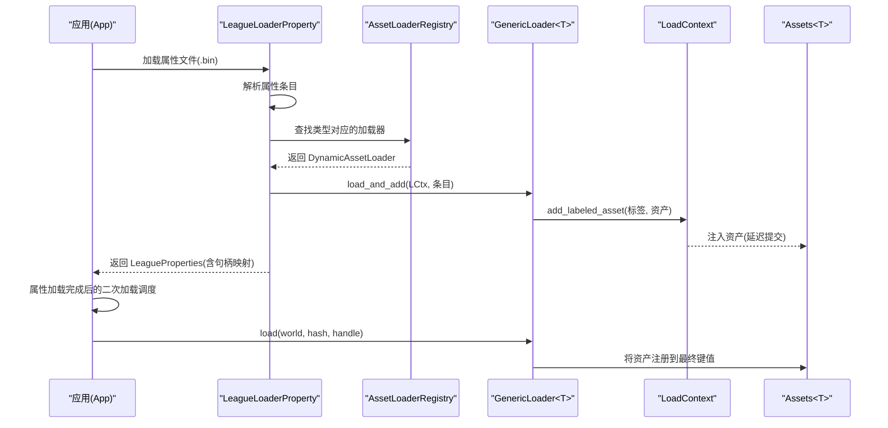
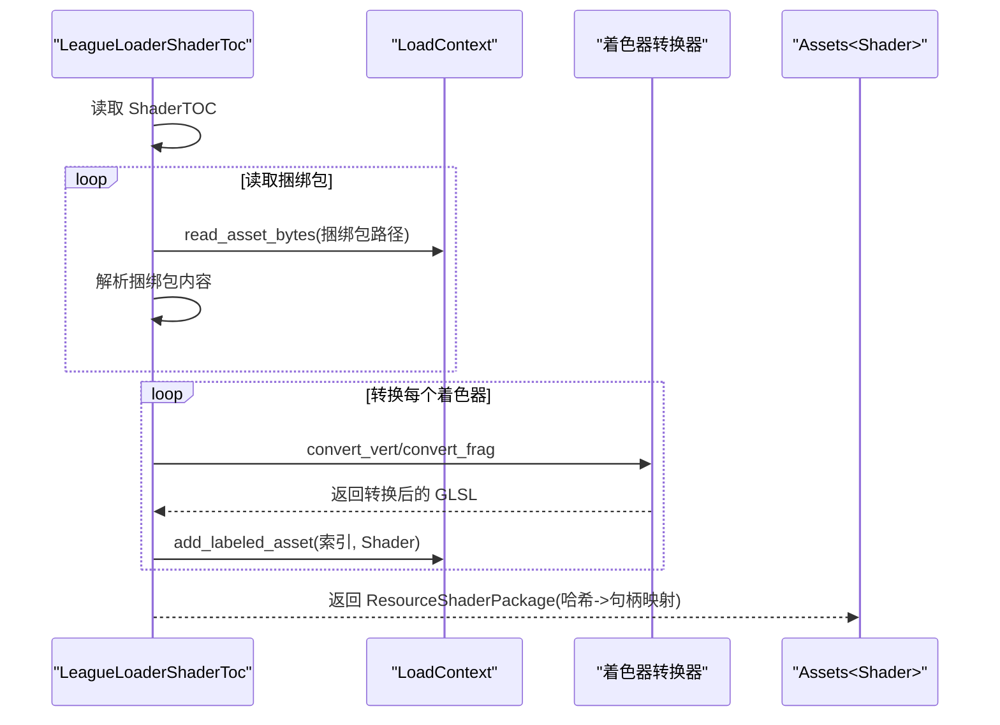
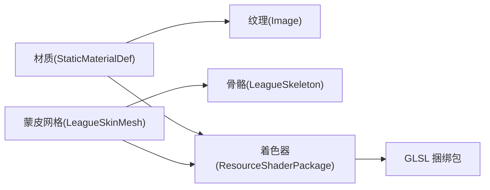

# 资源依赖与生命周期管理

<cite>
**本文引用的文件**
- [crates/lol_loader/src/lib.rs](file://crates/lol_loader/src/lib.rs)
- [crates/lol_config/src/register.rs](file://crates/lol_config/src/register.rs)
- [crates/lol_config/src/shader.rs](file://crates/lol_config/src/shader.rs)
- [crates/league_file/src/shader.rs](file://crates/league_file/src/shader.rs)
- [crates/league_file/src/texture.rs](file://crates/league_file/src/texture.rs)
- [crates/league_file/src/skeleton.rs](file://crates/league_file/src/skeleton.rs)
- [crates/league_to_lol/src/shader.rs](file://crates/league_to_lol/src/shader.rs)
- [src/main.rs](file://src/main.rs)
- [src/core/resource.rs](file://src/core/resource.rs)
- [examples/extract_shader.rs](file://examples/extract_shader.rs)
</cite>

## 目录
1. [引言](#引言)
2. [项目结构](#项目结构)
3. [核心组件](#核心组件)
4. [架构总览](#架构总览)
5. [详细组件分析](#详细组件分析)
6. [依赖关系分析](#依赖关系分析)
7. [性能考量](#性能考量)
8. [故障排查指南](#故障排查指南)
9. [结论](#结论)

## 引言
本文件聚焦于 LoL 项目在 Bevy 资产系统中的资源依赖与生命周期管理，围绕材质引用纹理、模型引用骨骼等典型依赖关系展开，并以着色器资源加载为例，系统说明如何在 load 过程中通过 LoadContext 声明对其他资源的依赖，确保加载顺序正确。文档还梳理了从 LoadContext 创建、元数据解析、异步读取、依赖解析到最终通过 add_labeled_asset 注入资产池的完整流程；结合 App::init_asset::<T>() 的调用时机，阐明插件初始化阶段与资源加载阶段的协同关系；最后提供调试资源加载死锁或循环依赖的实用技巧。

## 项目结构
LoL 项目采用多 crate 分层组织，其中与资源加载直接相关的核心模块包括：
- lol_loader：实现各类 AssetLoader，负责从 League 格式文件中解析并产出 Bevy 资产（图像、网格、动画、着色器包等），并在 load 中使用 LoadContext 声明依赖。
- lol_config：注册动态资产加载器、初始化资产类型、维护类型哈希映射。
- league_file：定义 League 文件格式的数据结构（如 ShaderTOC、纹理、骨骼等），为解析提供依据。
- league_to_lol：提供着色器转换工具（顶点/像素着色器代码重写），用于适配 Bevy 的 Shader 系统。
- src/main.rs：应用入口，负责构建 App 并添加插件。
- src/core/resource.rs：资源缓存与加载调度，负责在属性文件加载后触发具体资产的二次加载与注册。

图表来源
- [src/main.rs](file://src/main.rs#L56-L114)
- [crates/lol_config/src/register.rs](file://crates/lol_config/src/register.rs#L69-L110)
- [crates/lol_loader/src/lib.rs](file://crates/lol_loader/src/lib.rs#L1-L200)
- [crates/league_file/src/shader.rs](file://crates/league_file/src/shader.rs#L1-L58)
- [crates/league_file/src/texture.rs](file://crates/league_file/src/texture.rs#L1-L135)
- [crates/league_file/src/skeleton.rs](file://crates/league_file/src/skeleton.rs#L92-L234)
- [crates/league_to_lol/src/shader.rs](file://crates/league_to_lol/src/shader.rs#L1-L207)
- [src/core/resource.rs](file://src/core/resource.rs#L200-L327)

章节来源
- [src/main.rs](file://src/main.rs#L56-L114)
- [crates/lol_config/src/register.rs](file://crates/lol_config/src/register.rs#L69-L110)
- [crates/lol_loader/src/lib.rs](file://crates/lol_loader/src/lib.rs#L1-L200)

## 核心组件
- 动态资产加载器注册与初始化
  - 通过 AssetLoaderRegistry 维护类型哈希到加载器的映射，并在 init_league_asset 中对多种资产类型进行初始化，确保 Bevy 在使用这些资产前已准备好加载管线。
- 各类 AssetLoader
  - LeagueLoaderProperty：解析属性文件，按类型分发给对应 DynamicAssetLoader，使用 LoadContext.add_labeled_asset 注入资产。
  - LeagueLoaderImage：读取 TEX 文件，构造 Image 并通过 LoadContext.add_labeled_asset 注入。
  - LeagueLoaderShaderToc：解析 ShaderTOC，异步读取打包的 GLSL 捆绑包，转换并注入多个 Shader，形成 ResourceShaderPackage。
  - 其他 Loader（网格、静态网格、骨骼、动画等）均遵循类似的模式：异步读取、解析、构造 Bevy 资产并通过 LoadContext 注入。
- 资源缓存与调度
  - 在属性文件加载完成后，通过 insert_props 系统触发具体资产的二次加载与注册，将资产句柄从临时存储迁移到最终的 Assets 资源中。

章节来源
- [crates/lol_config/src/register.rs](file://crates/lol_config/src/register.rs#L1-L110)
- [crates/lol_loader/src/lib.rs](file://crates/lol_loader/src/lib.rs#L56-L87)
- [crates/lol_loader/src/lib.rs](file://crates/lol_loader/src/lib.rs#L252-L331)
- [crates/lol_loader/src/lib.rs](file://crates/lol_loader/src/lib.rs#L400-L501)
- [src/core/resource.rs](file://src/core/resource.rs#L200-L327)

## 架构总览
下图展示了从属性文件到具体资产的加载路径，以及在 LoadContext 中声明依赖、异步读取与注入资产的总体流程。

图表来源
- [crates/lol_loader/src/lib.rs](file://crates/lol_loader/src/lib.rs#L56-L87)
- [crates/lol_config/src/register.rs](file://crates/lol_config/src/register.rs#L40-L87)
- [src/core/resource.rs](file://src/core/resource.rs#L286-L304)

## 详细组件分析

### 着色器资源加载与依赖声明（以 LeagueLoaderShaderToc 为例）
- 元数据解析
  - 读取 ShaderTOC，确定着色器类型（顶点/像素）、基础宏定义、打包数量与哈希表等。
- 异步读取与转换
  - 逐个读取捆绑包（_0、_100、_200…），提取 GLSL 内容；对结构体进行统一化处理；根据 shader_type 选择顶点或像素转换器。
- 依赖声明与注入
  - 使用 LoadContext.add_labeled_asset 为每个转换后的 Shader 注入命名标签，形成 Shader 句柄列表。
  - 根据 ShaderTOC 中的哈希与索引，建立最终的 ResourceShaderPackage 映射。
- 生命周期要点
  - 在 load 中仅注入“候选 Shader”，最终的资源注册由属性文件加载后的二次加载流程完成。

图表来源
- [crates/lol_loader/src/lib.rs](file://crates/lol_loader/src/lib.rs#L400-L501)
- [crates/league_file/src/shader.rs](file://crates/league_file/src/shader.rs#L1-L58)
- [crates/league_to_lol/src/shader.rs](file://crates/league_to_lol/src/shader.rs#L66-L148)
- [crates/league_to_lol/src/shader.rs](file://crates/league_to_lol/src/shader.rs#L150-L207)

章节来源
- [crates/lol_loader/src/lib.rs](file://crates/lol_loader/src/lib.rs#L400-L501)
- [crates/league_file/src/shader.rs](file://crates/league_file/src/shader.rs#L1-L58)
- [crates/league_to_lol/src/shader.rs](file://crates/league_to_lol/src/shader.rs#L1-L207)

### 图像资源加载与依赖注入
- 读取 TEX 文件，构造 Image 与 sRGB Image，使用 LoadContext.add_labeled_asset 注入。
- 该过程体现了在单次 load 中同时产出多个相关资产（例如 sRGB 与非 sRGB）并以不同标签区分。

章节来源
- [crates/lol_loader/src/lib.rs](file://crates/lol_loader/src/lib.rs#L252-L331)
- [crates/league_file/src/texture.rs](file://crates/league_file/src/texture.rs#L1-L135)

### 材质与纹理依赖关系
- 材质定义中包含纹理采样器与参数，材质资源与纹理资源之间存在显式依赖。
- 在 LeagueLoaderProperty 中，按类型分发给对应 DynamicAssetLoader，最终通过 add_labeled_asset 注入，保证材质与纹理的加载顺序。

章节来源
- [crates/lol_config/src/register.rs](file://crates/lol_config/src/register.rs#L1-L110)
- [crates/lol_loader/src/lib.rs](file://crates/lol_loader/src/lib.rs#L56-L87)

### 骨骼与蒙皮网格依赖关系
- 骨骼资源（skeleton）定义了关节层级、局部变换与影响索引；蒙皮网格（skinned mesh）引用骨骼并使用 inverse bind pose 进行顶点变形。
- 在渲染粒子或蒙皮网格时，会基于骨骼资源计算骨骼矩阵数组并传入着色器 uniform。

章节来源
- [crates/league_file/src/skeleton.rs](file://crates/league_file/src/skeleton.rs#L92-L234)
- [src/core/resource.rs](file://src/core/resource.rs#L242-L286)

### 应用初始化与资源加载协同
- App::init_asset::<T>() 在插件初始化阶段调用，确保 Bevy 已知并准备加载指定类型的资产。
- 属性文件加载完成后，通过 insert_props 系统触发具体资产的二次加载与注册，将资产句柄从临时存储迁移到最终的 Assets 资源中。

章节来源
- [crates/lol_config/src/register.rs](file://crates/lol_config/src/register.rs#L69-L87)
- [src/core/resource.rs](file://src/core/resource.rs#L286-L304)
- [src/main.rs](file://src/main.rs#L56-L114)

## 依赖关系分析
- 资源间依赖链
  - 材质依赖纹理：材质定义中包含纹理采样器名称与路径，最终通过纹理加载器产出 Image 并被材质引用。
  - 模型依赖骨骼：蒙皮网格依赖骨骼资源提供的 inverse bind pose 与关节层级，渲染时需先加载骨骼。
  - 着色器依赖 GLSL 捆绑包：ShaderTOC 指向多个捆绑包，加载时需要异步读取并转换。
- 依赖声明与加载顺序
  - 在 LeagueLoaderShaderToc 中，通过 LoadContext.add_labeled_asset 为每个 Shader 注入命名标签，形成可索引的句柄集合；最终通过属性文件的二次加载流程完成资源注册。
  - 在 LeagueLoaderProperty 中，按类型分发给 DynamicAssetLoader，使用 add_labeled_asset 注入，确保材质、纹理等资源的加载顺序。
- 循环依赖风险
  - 若材质依赖纹理，而纹理又间接依赖材质，可能形成循环；应避免在纹理转换或材质解析中引入相互引用。
  - 若多个 Shader 互相 import 或依赖同一组外部资源，应在转换阶段统一处理，避免运行时循环依赖。

图表来源
- [crates/lol_config/src/register.rs](file://crates/lol_config/src/register.rs#L1-L110)
- [crates/lol_loader/src/lib.rs](file://crates/lol_loader/src/lib.rs#L400-L501)
- [crates/league_file/src/skeleton.rs](file://crates/league_file/src/skeleton.rs#L92-L234)
- [crates/league_file/src/texture.rs](file://crates/league_file/src/texture.rs#L1-L135)

## 性能考量
- 异步读取与批量注入
  - LeagueLoaderProperty 与 LeagueLoaderShaderToc 均采用异步读取与批量注入策略，减少主线程阻塞。
- 资源复用与缓存
  - ResourceCache 提供图像与网格的缓存，避免重复加载。
- 转换成本控制
  - 着色器转换在加载阶段完成，避免运行时开销；同时对结构体进行统一化处理，减少重复解析。

章节来源
- [crates/lol_loader/src/lib.rs](file://crates/lol_loader/src/lib.rs#L56-L87)
- [crates/lol_loader/src/lib.rs](file://crates/lol_loader/src/lib.rs#L400-L501)
- [src/core/resource.rs](file://src/core/resource.rs#L200-L230)

## 故障排查指南
- 死锁与循环依赖定位
  - 现象：资源加载卡住、长时间无响应。
  - 排查步骤：
    - 检查是否存在相互依赖（材质依赖纹理，纹理又依赖材质）。
    - 检查 ShaderTOC 与捆绑包是否完整，确保 read_asset_bytes 能正常返回。
    - 在转换阶段避免对自身 import 的循环引用。
- 调试技巧
  - 使用日志输出当前加载的类型与路径，确认属性文件是否正确分发到对应加载器。
  - 在 insert_props 系统中打印类型哈希与属性哈希，验证二次加载是否执行。
  - 对着色器转换器增加边界检查与错误提示，定位转换失败的具体行号。
- 示例参考
  - ShaderTOC 与捆绑包读取流程、着色器转换流程、属性文件分发与二次加载流程均可作为调试断点。

章节来源
- [crates/lol_loader/src/lib.rs](file://crates/lol_loader/src/lib.rs#L400-L501)
- [crates/lol_loader/src/lib.rs](file://crates/lol_loader/src/lib.rs#L56-L87)
- [src/core/resource.rs](file://src/core/resource.rs#L286-L304)
- [examples/extract_shader.rs](file://examples/extract_shader.rs#L99-L156)

## 结论
LoL 项目在 Bevy 资产系统中通过动态加载器注册、LoadContext 的依赖声明与批量注入、以及属性文件驱动的二次加载机制，实现了材质-纹理、模型-骨骼、着色器-捆绑包等复杂依赖关系的有序管理。配合资源缓存与异步读取，整体具备良好的性能与可维护性。在实际开发中，应特别关注循环依赖与转换阶段的健壮性，确保资源加载稳定可靠。