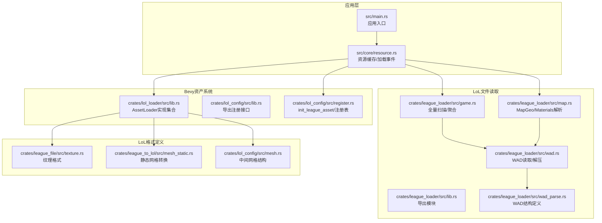
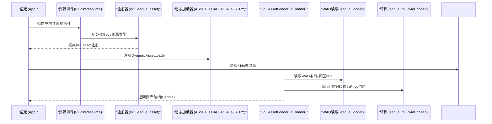
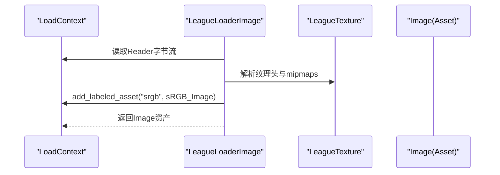
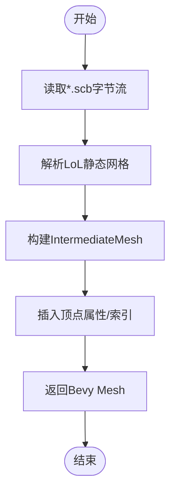
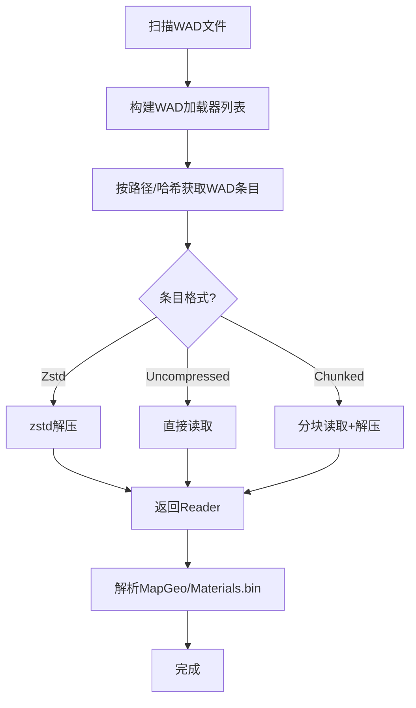
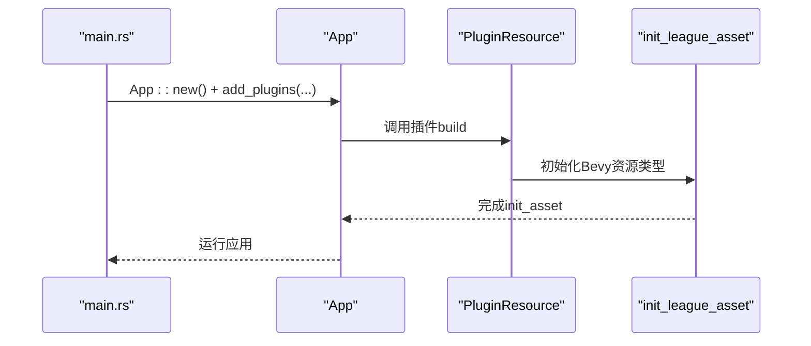
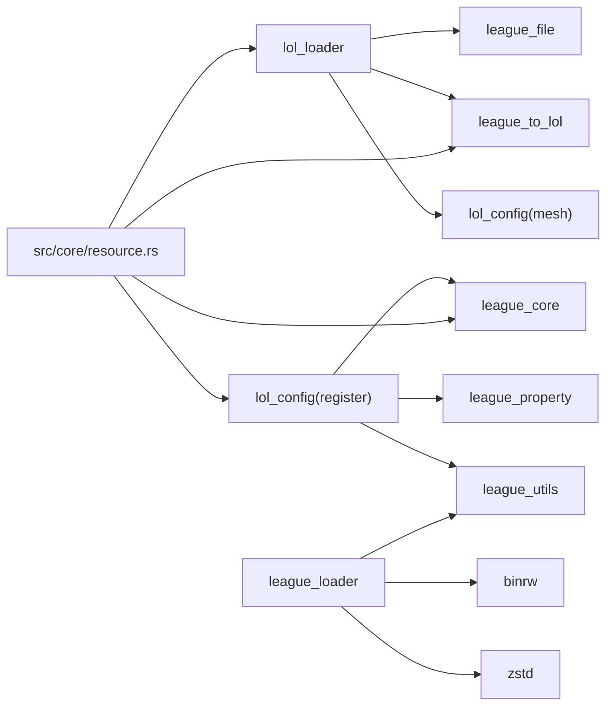

# 资源加载

<cite>
**本文引用的文件**
- [src/main.rs](file://src/main.rs)
- [crates/lol_config/src/register.rs](file://crates/lol_config/src/register.rs)
- [crates/lol_loader/src/lib.rs](file://crates/lol_loader/src/lib.rs)
- [crates/lol_config/src/lib.rs](file://crates/lol_config/src/lib.rs)
- [crates/league_loader/src/lib.rs](file://crates/league_loader/src/lib.rs)
- [crates/league_loader/src/map.rs](file://crates/league_loader/src/map.rs)
- [crates/league_loader/src/game.rs](file://crates/league_loader/src/game.rs)
- [crates/league_loader/src/wad.rs](file://crates/league_loader/src/wad.rs)
- [crates/league_loader/src/wad_parse.rs](file://crates/league_loader/src/wad_parse.rs)
- [crates/league_file/src/texture.rs](file://crates/league_file/src/texture.rs)
- [crates/lol_config/src/mesh.rs](file://crates/lol_config/src/mesh.rs)
- [crates/league_to_lol/src/mesh_static.rs](file://crates/league_to_lol/src/mesh_static.rs)
- [src/core/resource.rs](file://src/core/resource.rs)
</cite>

## 目录
1. [简介](#简介)
2. [项目结构](#项目结构)
3. [核心组件](#核心组件)
4. [架构总览](#架构总览)
5. [详细组件分析](#详细组件分析)
6. [依赖关系分析](#依赖关系分析)
7. [性能考量](#性能考量)
8. [故障排查指南](#故障排查指南)
9. [结论](#结论)
10. [附录](#附录)

## 简介
本指南面向希望将解析后的LoL资源集成到Bevy引擎资产系统中的开发者，围绕以下目标展开：
- 实现自定义 AssetLoader trait，支持新资源类型的异步加载；
- 解释 App::init_asset::<T>() 与 App::add_asset::<T>() 在应用启动阶段的调用时机与注册流程；
- 讲解资源加载器的生命周期：load 方法实现、LoadContext 使用、元数据处理；
- 结合 league_loader 模块（如 map.rs、game.rs）展示如何将原始数据包装为 Bevy 的 Handle<Mesh>、Handle<Image> 或自定义资源类型；
- 提供完整的 impl AssetLoader 代码模板与依赖资源（如材质引用纹理）处理建议；
- 指导资产路径配置、监听加载事件以及处理加载失败的重试机制。

## 项目结构
该仓库采用多crate组织方式，其中与LoL资源加载密切相关的模块如下：
- lol_loader：Bevy AssetLoader 实现集合，负责将LoL二进制资源转换为Bevy资产（Mesh、Image、AnimationClip、Shader等）。
- lol_config：Bevy资源类型注册与动态加载器注册，包含 init_league_asset 与 AssetLoaderRegistry。
- league_loader：LoL WAD/WAD.CLIENT/WAD.SUBCHUNKTOC 文件的读取与解析，提供从WAD中提取数据的能力。
- league_file：LoL文件格式的binrw定义（如纹理、静态网格、骨骼、动画等）。
- league_to_lol：LoL中间表示与Bevy Mesh/Image的转换工具。
- src/core/resource.rs：应用侧资源缓存、加载事件与超时控制，以及将动态加载器注册到Bevy资产系统。



图表来源
- [src/main.rs](file://src/main.rs#L76-L114)
- [src/core/resource.rs](file://src/core/resource.rs#L30-L154)
- [crates/lol_loader/src/lib.rs](file://crates/lol_loader/src/lib.rs#L46-L501)
- [crates/lol_config/src/register.rs](file://crates/lol_config/src/register.rs#L69-L109)
- [crates/league_loader/src/game.rs](file://crates/league_loader/src/game.rs#L14-L97)
- [crates/league_loader/src/map.rs](file://crates/league_loader/src/map.rs#L17-L53)
- [crates/league_loader/src/wad.rs](file://crates/league_loader/src/wad.rs#L15-L147)
- [crates/league_loader/src/wad_parse.rs](file://crates/league_loader/src/wad_parse.rs#L1-L101)
- [crates/league_file/src/texture.rs](file://crates/league_file/src/texture.rs#L1-L62)
- [crates/league_to_lol/src/mesh_static.rs](file://crates/league_to_lol/src/mesh_static.rs#L31-L68)
- [crates/lol_config/src/mesh.rs](file://crates/lol_config/src/mesh.rs#L42-L309)

章节来源
- [src/main.rs](file://src/main.rs#L76-L114)
- [crates/lol_config/src/lib.rs](file://crates/lol_config/src/lib.rs#L1-L18)

## 核心组件
- 自定义 AssetLoader 实现：在 lol_loader 中实现了多种 AssetLoader（如 LeagueLoaderProperty、LeagueLoaderMesh、LeagueLoaderImage、LeagueLoaderAnimationClip、LeagueLoaderShaderToc、LeagueLoaderMapgeo、LeagueLoaderSkeleton、LeagueLoaderMeshStatic），分别对应不同扩展名与资源类型。
- 动态加载器注册：lol_config 提供 AssetLoaderRegistry 与 init_league_asset，用于在应用启动时注册Bevy资源类型与对应的动态加载器。
- WAD读取与解析：league_loader 提供 LeagueWadLoader、LeagueLoader 等，负责扫描WAD文件、解析WAD头与条目、按需解压zstd子块、读取压缩/未压缩/分块数据。
- 原始数据到Bevy资产的转换：通过 league_to_lol 与 lol_config 的中间结构，将LoL网格、纹理、骨骼、动画等转换为Bevy Mesh、Image、AnimationClip、Shader等。

章节来源
- [crates/lol_loader/src/lib.rs](file://crates/lol_loader/src/lib.rs#L46-L501)
- [crates/lol_config/src/register.rs](file://crates/lol_config/src/register.rs#L20-L109)
- [crates/league_loader/src/lib.rs](file://crates/league_loader/src/lib.rs#L1-L27)
- [crates/league_loader/src/game.rs](file://crates/league_loader/src/game.rs#L14-L97)
- [crates/league_loader/src/map.rs](file://crates/league_loader/src/map.rs#L17-L53)
- [crates/league_loader/src/wad.rs](file://crates/league_loader/src/wad.rs#L15-L147)
- [crates/league_loader/src/wad_parse.rs](file://crates/league_loader/src/wad_parse.rs#L1-L101)

## 架构总览
下图展示了从应用启动到资源加载完成的关键交互流程，包括 AssetLoader 的注册、WAD数据读取、资源转换与Bevy资产服务器的集成。



图表来源
- [src/core/resource.rs](file://src/core/resource.rs#L30-L154)
- [crates/lol_config/src/register.rs](file://crates/lol_config/src/register.rs#L69-L109)
- [crates/lol_loader/src/lib.rs](file://crates/lol_loader/src/lib.rs#L46-L501)
- [crates/league_loader/src/wad.rs](file://crates/league_loader/src/wad.rs#L59-L147)

## 详细组件分析

### 组件A：Bevy资源初始化与动态加载器注册
- init_league_asset：在应用启动时调用，为所有需要的Bevy资源类型执行 init_asset，确保资产服务器已知这些类型。
- AssetLoaderRegistry：维护“类型哈希 -> (类型名, DynamicAssetLoader)”映射；GenericLoader<T> 实现 load_and_add 与 load 两个阶段，前者在加载上下文中添加带标签的资产，后者在世界中将资产替换为基于哈希的稳定键。

```mermaid
classDiagram
class AssetLoaderRegistry {
+loaders : HashMap<u32, (String, Box<dyn DynamicAssetLoader>)>
+register<T>()
}
class DynamicAssetLoader {
<<interface>>
+load_and_add(load_context, entry) UntypedHandle
+load(world, hash, handle) UntypedHandle
}
class GenericLoader_T {
-PhantomData<T>
+load_and_add(...)
+load(...)
}
AssetLoaderRegistry --> DynamicAssetLoader : "持有"
GenericLoader_T ..|> DynamicAssetLoader
```

图表来源
- [crates/lol_config/src/register.rs](file://crates/lol_config/src/register.rs#L20-L109)

章节来源
- [crates/lol_config/src/register.rs](file://crates/lol_config/src/register.rs#L20-L109)

### 组件B：LoL资源到Bevy资产的转换（以图像为例）
- LeagueLoaderImage：实现 AssetLoader，从*.tex读取纹理数据，构造Bevy Image与TextureDescriptor，必要时提供sRGB变体并通过 load_context.add_labeled_asset 添加到资产服务器。
- LeagueTexture：由 league_file 定义，描述LoL纹理格式、尺寸、mipmap等信息。



图表来源
- [crates/lol_loader/src/lib.rs](file://crates/lol_loader/src/lib.rs#L252-L331)
- [crates/league_file/src/texture.rs](file://crates/league_file/src/texture.rs#L1-L62)

章节来源
- [crates/lol_loader/src/lib.rs](file://crates/lol_loader/src/lib.rs#L252-L331)
- [crates/league_file/src/texture.rs](file://crates/league_file/src/texture.rs#L1-L62)

### 组件C：静态网格与中间网格结构
- LeagueLoaderMeshStatic：读取*.scb，转换为Bevy Mesh。
- 中间网格结构 IntermediateMesh：在 lol_config 中定义，用于跨模块传递网格数据；mesh_static.rs 展示了如何将LoL静态网格转换为Bevy Mesh。



图表来源
- [crates/lol_loader/src/lib.rs](file://crates/lol_loader/src/lib.rs#L224-L250)
- [crates/lol_config/src/mesh.rs](file://crates/lol_config/src/mesh.rs#L42-L309)
- [crates/league_to_lol/src/mesh_static.rs](file://crates/league_to_lol/src/mesh_static.rs#L31-L68)

章节来源
- [crates/lol_loader/src/lib.rs](file://crates/lol_loader/src/lib.rs#L224-L250)
- [crates/lol_config/src/mesh.rs](file://crates/lol_config/src/mesh.rs#L42-L309)
- [crates/league_to_lol/src/mesh_static.rs](file://crates/league_to_lol/src/mesh_static.rs#L31-L68)

### 组件D：WAD读取与MapGeo/Materials解析
- LeagueLoader：扫描根目录下的WAD文件，聚合多个WADLoader，提供按路径/哈希读取条目的能力。
- LeagueWadLoader：打开WAD文件，解析WAD头与条目，支持zstd解压、分块读取、子块索引查询。
- LeagueWadMapLoader：从指定WAD中提取MapGeo与Materials.bin，便于后续地图渲染与材质绑定。



图表来源
- [crates/league_loader/src/game.rs](file://crates/league_loader/src/game.rs#L14-L97)
- [crates/league_loader/src/wad.rs](file://crates/league_loader/src/wad.rs#L59-L147)
- [crates/league_loader/src/map.rs](file://crates/league_loader/src/map.rs#L17-L53)
- [crates/league_loader/src/wad_parse.rs](file://crates/league_loader/src/wad_parse.rs#L1-L101)

章节来源
- [crates/league_loader/src/game.rs](file://crates/league_loader/src/game.rs#L14-L97)
- [crates/league_loader/src/wad.rs](file://crates/league_loader/src/wad.rs#L59-L147)
- [crates/league_loader/src/map.rs](file://crates/league_loader/src/map.rs#L17-L53)
- [crates/league_loader/src/wad_parse.rs](file://crates/league_loader/src/wad_parse.rs#L1-L101)

### 组件E：应用启动与资源注册时机
- 应用入口在 main.rs 中创建 App 并添加插件；资源插件 PluginResource 在其 build 阶段调用 init_league_asset，确保所有Bevy资源类型在资产系统中注册。
- 之后，应用侧可通过 AssetServer 加载*.bin等资源，由 LeagueLoaderProperty 驱动动态加载器注册表，逐类反序列化并添加资产。



图表来源
- [src/main.rs](file://src/main.rs#L76-L114)
- [src/core/resource.rs](file://src/core/resource.rs#L30-L154)
- [crates/lol_config/src/register.rs](file://crates/lol_config/src/register.rs#L69-L87)

章节来源
- [src/main.rs](file://src/main.rs#L76-L114)
- [src/core/resource.rs](file://src/core/resource.rs#L30-L154)
- [crates/lol_config/src/register.rs](file://crates/lol_config/src/register.rs#L69-L87)

## 依赖关系分析
- lol_loader 依赖 league_file（LoL格式定义）、league_to_lol（转换工具）、lol_config（中间网格结构）。
- lol_config 依赖 league_core（Bevy资源类型）、league_property（属性文件解析）、league_utils（类型名哈希）。
- league_loader 依赖 binrw、zstd、league_utils（WAD路径哈希）。
- src/core/resource.rs 依赖 lol_loader、lol_config、league_to_lol、lol_core，负责资源缓存、加载事件与动态加载器触发。



图表来源
- [crates/lol_loader/src/lib.rs](file://crates/lol_loader/src/lib.rs#L1-L501)
- [crates/lol_config/src/register.rs](file://crates/lol_config/src/register.rs#L1-L109)
- [crates/league_loader/src/lib.rs](file://crates/league_loader/src/lib.rs#L1-L27)
- [src/core/resource.rs](file://src/core/resource.rs#L1-L154)

章节来源
- [crates/lol_loader/src/lib.rs](file://crates/lol_loader/src/lib.rs#L1-L501)
- [crates/lol_config/src/register.rs](file://crates/lol_config/src/register.rs#L1-L109)
- [crates/league_loader/src/lib.rs](file://crates/league_loader/src/lib.rs#L1-L27)
- [src/core/resource.rs](file://src/core/resource.rs#L1-L154)

## 性能考量
- WAD分块读取：LeagueWadLoader 支持分块读取与zstd解压，避免一次性解压大文件导致内存峰值过高。
- 异步加载：AssetLoader 的 load 方法使用异步读取，配合Bevy资产服务器的并发加载能力，提升整体吞吐。
- 中间网格结构：IntermediateMesh 减少重复转换开销，便于在多个子网格间共享属性。
- 纹理格式：仅在需要时提供sRGB变体，避免不必要的格式转换与复制。

[本节为通用指导，不直接分析具体文件]

## 故障排查指南
- WAD条目不存在：当按路径/哈希无法找到条目时会报错；检查WAD路径与哈希是否正确。
- 条目格式不支持：WAD条目可能为重定向或gzip格式，当前实现不支持；需扩展支持或预处理。
- 分块索引越界：子块索引超出范围会导致异常；检查WAD子块表与条目first_subchunk_index。
- 纹理格式不匹配：仅支持BC1/BC3等特定格式；若遇到其他格式，需扩展转换逻辑。
- 动态加载器缺失：若*.bin中出现未注册的类型哈希，将跳过该类；确保 init_league_asset 已注册对应类型。

章节来源
- [crates/league_loader/src/wad.rs](file://crates/league_loader/src/wad.rs#L130-L147)
- [crates/league_loader/src/wad_parse.rs](file://crates/league_loader/src/wad_parse.rs#L62-L82)
- [crates/league_loader/src/map.rs](file://crates/league_loader/src/map.rs#L17-L53)
- [crates/league_file/src/texture.rs](file://crates/league_file/src/texture.rs#L1-L62)
- [crates/lol_config/src/register.rs](file://crates/lol_config/src/register.rs#L20-L38)

## 结论
通过上述组件与流程，LoL资源得以高效、可扩展地集成到Bevy资产系统中。关键在于：
- 在应用启动阶段完成资源类型与动态加载器的注册；
- 使用 AssetLoader 将LoL二进制资源转换为Bevy资产；
- 利用WAD读取与分块解压机制处理大体量资源；
- 通过中间网格结构与转换工具保证数据一致性与性能。

[本节为总结性内容，不直接分析具体文件]

## 附录

### 附录A：实现自定义 AssetLoader 的步骤与模板
- 步骤
  - 定义资源类型（实现 Asset + TypePath + DeserializeOwned 等）；
  - 在 init_league_asset 中调用 app.init_asset::<T>()；
  - 在 AssetLoaderRegistry 中注册 GenericLoader<T>；
  - 实现 AssetLoader trait 的 load 方法，使用 Reader 异步读取字节流，解析为中间结构，再转换为Bevy资产；
  - 使用 LoadContext.add_labeled_asset 添加资产，返回资产句柄；
  - 对于*.bin等复合资源，遍历属性文件条目，按类型哈希查找动态加载器并逐项加载。
- 模板参考
  - LeagueLoaderProperty.load：读取*.bin，遍历条目，调用动态加载器注册表进行反序列化与添加。
  - LeagueLoaderImage.load：读取*.tex，构造Image与sRGB变体，通过LoadContext添加。
  - LeagueLoaderMeshStatic.load：读取*.scb，转换为Bevy Mesh。
  - LeagueLoaderMapgeo.load：读取*.mapgeo，解析子网格与材质名，转换为中间网格并记录包围盒。
  - LeagueLoaderAnimationClip.load：读取*.anm，构建AnimationClip曲线。
  - LeagueLoaderShaderToc.load：读取*.glsl与打包chunk，生成Shader并建立哈希到句柄的映射。

章节来源
- [crates/lol_loader/src/lib.rs](file://crates/lol_loader/src/lib.rs#L46-L501)
- [crates/lol_config/src/register.rs](file://crates/lol_config/src/register.rs#L69-L109)

### 附录B：App::init_asset 与 App::add_asset 的调用时机与注册流程
- 调用时机：在应用启动阶段，由 PluginResource 的 build 方法调用 init_league_asset，确保所有Bevy资源类型在资产系统中注册。
- 注册流程：init_league_asset 逐一调用 app.init_asset::<T>()；随后 AssetLoaderRegistry.register<T>() 将类型哈希与 GenericLoader<T> 绑定，以便后续动态加载。

章节来源
- [src/core/resource.rs](file://src/core/resource.rs#L30-L154)
- [crates/lol_config/src/register.rs](file://crates/lol_config/src/register.rs#L69-L109)

### 附录C：资源加载器生命周期与 LoadContext 使用
- 生命周期
  - 资源发现：应用侧通过 AssetServer.load 触发 AssetLoader；
  - 加载阶段：load 方法异步读取字节流，解析为中间结构；
  - 上下文阶段：使用 LoadContext.add_labeled_asset 添加资产；
  - 后处理阶段：动态加载器的 load 方法将资产替换为基于哈希的稳定键。
- 元数据处理
  - *.bin：遍历属性文件条目，按类型哈希选择对应动态加载器；
  - *.mapgeo：解析子网格与材质名，记录包围盒；
  - *.tex：根据格式选择TextureFormat，构造Image与sRGB变体。

章节来源
- [crates/lol_loader/src/lib.rs](file://crates/lol_loader/src/lib.rs#L46-L501)
- [crates/lol_config/src/register.rs](file://crates/lol_config/src/register.rs#L40-L67)

### 附录D：将原始数据包装为 Bevy Handle<Mesh>、Handle<Image> 或自定义资源
- Handle<Mesh>：LeagueLoaderMeshStatic 将LoL静态网格转换为Bevy Mesh；IntermediateMesh 提供中间表示，mesh_static.rs 展示属性插入与索引构建。
- Handle<Image>：LeagueLoaderImage 将LoL纹理转换为Bevy Image，必要时提供sRGB变体。
- 自定义资源：通过 lol_config 中的中间结构与 league_to_lol 的转换工具，将LoL网格、骨骼、动画等转换为Bevy资源类型。

章节来源
- [crates/lol_loader/src/lib.rs](file://crates/lol_loader/src/lib.rs#L224-L331)
- [crates/lol_config/src/mesh.rs](file://crates/lol_config/src/mesh.rs#L42-L309)
- [crates/league_to_lol/src/mesh_static.rs](file://crates/league_to_lol/src/mesh_static.rs#L31-L68)

### 附录E：资产路径配置、监听加载事件与重试机制
- 资产路径配置：通过 AssetServer.load 指定*.bin/*.scb/*.tex/*.mapgeo/*.anm/*.glsl等路径；对于*.glsl，按约定命名加载打包chunk。
- 监听加载事件：应用侧可使用 Loading 组件与定时器系统监控加载进度与超时。
- 重试机制：当前实现未内置自动重试；可在应用侧捕获加载错误后，延迟重试或回退策略。

章节来源
- [src/core/resource.rs](file://src/core/resource.rs#L187-L327)
- [crates/lol_loader/src/lib.rs](file://crates/lol_loader/src/lib.rs#L46-L501)