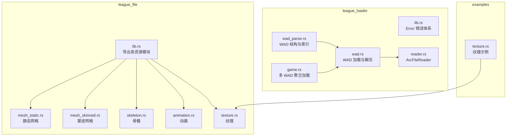
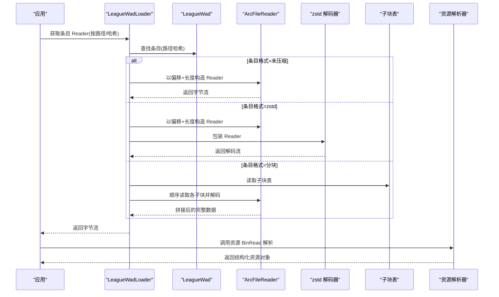
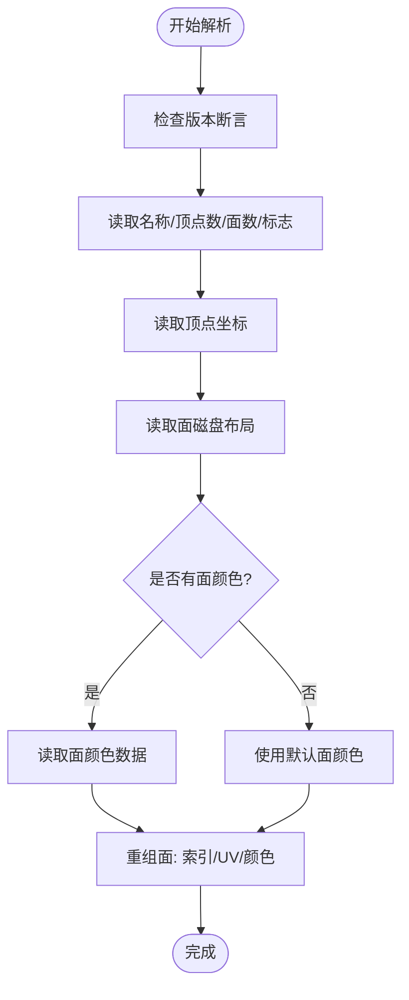
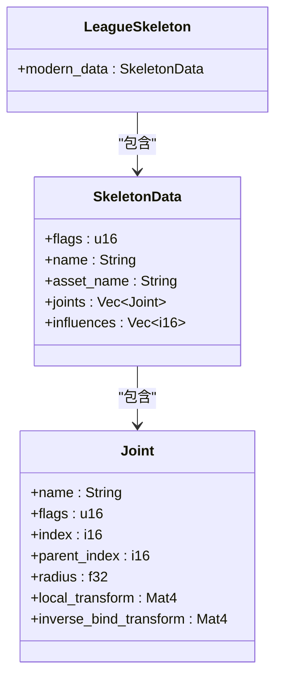
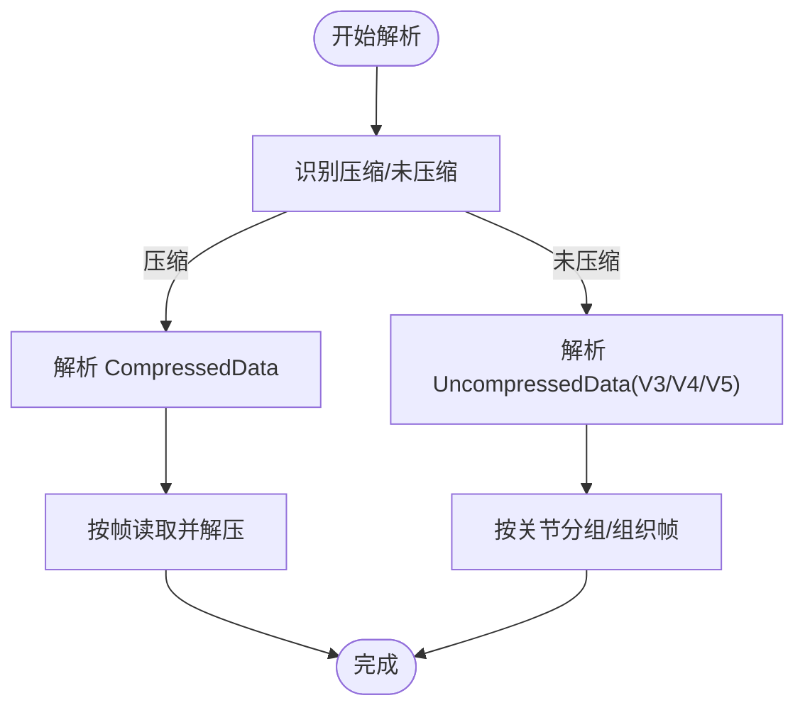
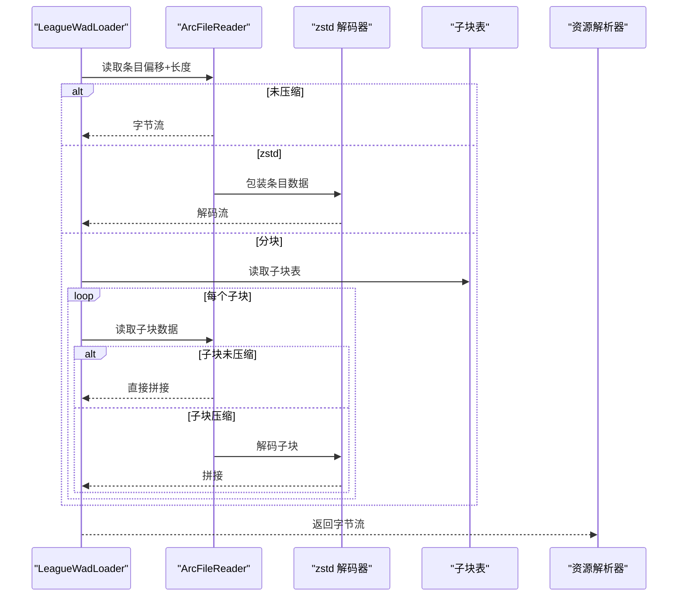
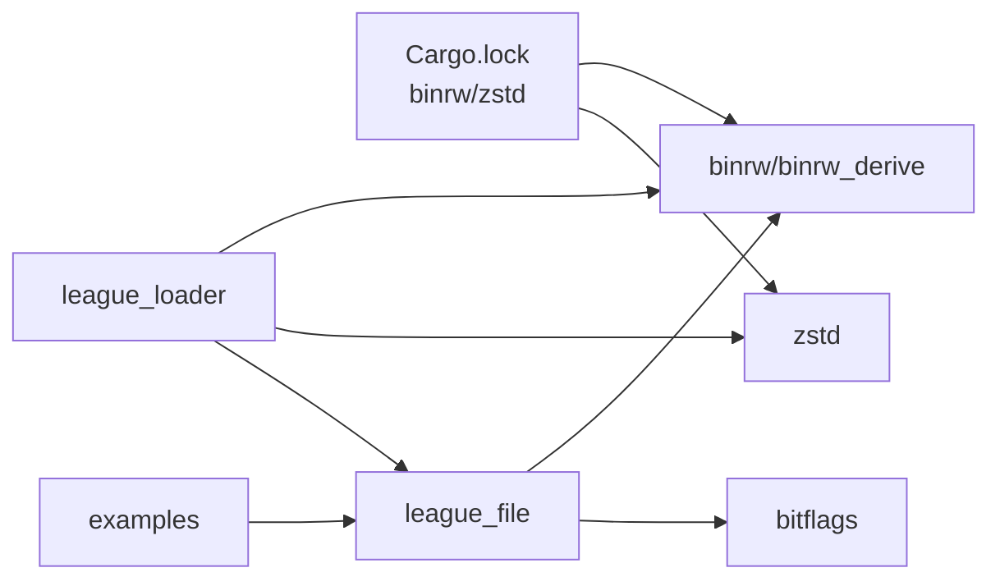

# 资源解析

<cite>
**本文引用的文件列表**
- [crates/league_file/src/lib.rs](file://crates/league_file/src/lib.rs)
- [crates/league_file/src/mesh_static.rs](file://crates/league_file/src/mesh_static.rs)
- [crates/league_file/src/mesh_skinned.rs](file://crates/league_file/src/mesh_skinned.rs)
- [crates/league_file/src/skeleton.rs](file://crates/league_file/src/skeleton.rs)
- [crates/league_file/src/animation.rs](file://crates/league_file/src/animation.rs)
- [crates/league_file/src/texture.rs](file://crates/league_file/src/texture.rs)
- [crates/league_loader/src/lib.rs](file://crates/league_loader/src/lib.rs)
- [crates/league_loader/src/wad_parse.rs](file://crates/league_loader/src/wad_parse.rs)
- [crates/league_loader/src/wad.rs](file://crates/league_loader/src/wad.rs)
- [crates/league_loader/src/reader.rs](file://crates/league_loader/src/reader.rs)
- [crates/league_loader/src/game.rs](file://crates/league_loader/src/game.rs)
- [examples/texture.rs](file://examples/texture.rs)
- [Cargo.lock](file://Cargo.lock)
</cite>

## 目录
1. [简介](#简介)
2. [项目结构](#项目结构)
3. [核心组件](#核心组件)
4. [架构总览](#架构总览)
5. [详细组件分析](#详细组件分析)
6. [依赖关系分析](#依赖关系分析)
7. [性能考量](#性能考量)
8. [故障排查指南](#故障排查指南)
9. [结论](#结论)
10. [附录：新增资源类型开发指南](#附录新增资源类型开发指南)

## 简介
本文件面向希望解析《英雄联盟》二进制资源的开发者，系统性讲解如何使用 binrw 库解析 .skn、.skl、.anm 等资源文件；详解 WAD 文件索引与数据块定位、解压流程；给出自定义二进制格式解析的实践路径（字节序、对齐、嵌套结构、条件字段）；并结合错误处理与示例程序，帮助你独立提取并验证资源数据，同时指导如何为新资源类型扩展解析器并与现有架构兼容。

## 项目结构
- league_file：定义各类资源的二进制结构与 BinRead/BinWrite 派生实现，覆盖静态网格、蒙皮网格、骨骼、动画、纹理等。
- league_loader：负责 WAD 文件解析、索引读取、数据块定位与解压（zstd、分块），以及统一的资源读取接口。
- examples：包含简单示例，演示如何读取纹理资源。

图表来源
- [crates/league_file/src/lib.rs](file://crates/league_file/src/lib.rs#L1-L20)
- [crates/league_loader/src/wad_parse.rs](file://crates/league_loader/src/wad_parse.rs#L1-L101)
- [crates/league_loader/src/wad.rs](file://crates/league_loader/src/wad.rs#L1-L147)
- [crates/league_loader/src/reader.rs](file://crates/league_loader/src/reader.rs#L1-L64)
- [crates/league_loader/src/game.rs](file://crates/league_loader/src/game.rs#L1-L97)
- [examples/texture.rs](file://examples/texture.rs#L1-L19)

章节来源
- [crates/league_file/src/lib.rs](file://crates/league_file/src/lib.rs#L1-L20)
- [crates/league_loader/src/lib.rs](file://crates/league_loader/src/lib.rs#L1-L27)

## 核心组件
- 资源结构与派生实现
  - 静态网格：LeagueMeshStatic，包含版本校验、顶点/面/颜色/包围盒等字段，使用 #[br(assert)]、#[br(if)]、#[br(map)]、#[br(calc)] 等特性处理条件与映射。
  - 蒙皮网格：LeagueSkinnedMesh，支持不同 major 版本下的范围、顶点声明、索引/顶点缓冲区等。
  - 骨骼：LeagueSkeleton，现代与传统两种数据格式，支持相对字符串偏移、关节变换矩阵计算。
  - 动画：AnimationFile（压缩/未压缩），包含帧时间解压、向量/四元数解码、跳跃缓存等。
  - 纹理：LeagueTexture，格式枚举、mipmap 解析、块大小与块计数计算。
- WAD 解析与读取
  - LeagueWad：WAD 头部、条目数量、条目索引（路径哈希到条目）。
  - LeagueWadEntry/WadDataFormat：条目偏移、尺寸、目标尺寸、数据格式（未压缩、gzip、重定向、zstd、分块）。
  - LeagueWadLoader：按路径或哈希获取条目 Reader，支持 zstd 解码与分块聚合。
  - ArcFileReader：基于 Arc<File> 的只读 Reader，支持按起始偏移读取与有限 Seek。
- 错误处理
  - league_loader::Error：集成 thiserror，统一包装 io::Error、binrw::Error 与自定义错误消息。

章节来源
- [crates/league_file/src/mesh_static.rs](file://crates/league_file/src/mesh_static.rs#L1-L182)
- [crates/league_file/src/mesh_skinned.rs](file://crates/league_file/src/mesh_skinned.rs#L1-L119)
- [crates/league_file/src/skeleton.rs](file://crates/league_file/src/skeleton.rs#L1-L341)
- [crates/league_file/src/animation.rs](file://crates/league_file/src/animation.rs#L1-L485)
- [crates/league_file/src/texture.rs](file://crates/league_file/src/texture.rs#L1-L135)
- [crates/league_loader/src/wad_parse.rs](file://crates/league_loader/src/wad_parse.rs#L1-L101)
- [crates/league_loader/src/wad.rs](file://crates/league_loader/src/wad.rs#L1-L147)
- [crates/league_loader/src/reader.rs](file://crates/league_loader/src/reader.rs#L1-L64)
- [crates/league_loader/src/lib.rs](file://crates/league_loader/src/lib.rs#L1-L27)

## 架构总览
WAD 文件解析流程（从磁盘到资源对象）：
- 读取 WAD 头与索引，建立路径哈希到条目的映射。
- 根据条目格式选择读取策略：未压缩、zstd 解码、分块聚合。
- 将条目数据交给对应资源模块的 BinRead 实现进行解析。

图表来源
- [crates/league_loader/src/wad.rs](file://crates/league_loader/src/wad.rs#L1-L147)
- [crates/league_loader/src/wad_parse.rs](file://crates/league_loader/src/wad_parse.rs#L1-L101)
- [crates/league_loader/src/reader.rs](file://crates/league_loader/src/reader.rs#L1-L64)

## 详细组件分析

### 静态网格（LeagueMeshStatic）
- 关键特性
  - 版本断言：通过 #[br(assert(...))] 校验 major/minor 组合。
  - 条件字段：根据标志位决定是否读取顶点颜色、面颜色等。
  - 映射与计算：字符串读取、UV 重组、索引类型转换、颜色默认值合并。
- 数据流
  - 从磁盘布局读取顶点、面、颜色等，再在内存中组装为 StaticMeshFace。
- 典型用途
  - 读取 .skn 静态网格资源，构建渲染所需的顶点/索引/UV/颜色数据。

图表来源
- [crates/league_file/src/mesh_static.rs](file://crates/league_file/src/mesh_static.rs#L1-L182)

章节来源
- [crates/league_file/src/mesh_static.rs](file://crates/league_file/src/mesh_static.rs#L1-L182)

### 蒙皮网格（LeagueSkinnedMesh）
- 关键特性
  - 多版本兼容：major=0/2/4，minor=1；major=4 时支持顶点声明解析。
  - 条件字段：根据 major 决定 ranges、flags、bounding box/sphere 等字段是否存在。
  - 计算字段：index_count/vertex_count 由可选字段计算得到；顶点类型由 size/type 推导。
- 数据流
  - 读取索引/顶点缓冲区，按顶点声明大小解析每条顶点记录。

章节来源
- [crates/league_file/src/mesh_skinned.rs](file://crates/league_file/src/mesh_skinned.rs#L1-L119)

### 骨骼（LeagueSkeleton）
- 关键特性
  - 现代与传统两种数据格式，通过 format_token 与 pre_assert 判定。
  - 相对字符串偏移：RelativeString 在指定偏移处读取空终止字符串并恢复位置。
  - 变换矩阵：本地变换与逆绑定变换由平移/缩放/旋转组合计算。
- 数据流
  - 读取关节列表、影响权重，转换为通用 SkeletonData 结构。

图表来源
- [crates/league_file/src/skeleton.rs](file://crates/league_file/src/skeleton.rs#L1-L341)

章节来源
- [crates/league_file/src/skeleton.rs](file://crates/league_file/src/skeleton.rs#L1-L341)

### 动画（AnimationFile）
- 关键特性
  - 压缩/未压缩两类文件头，分别解析 CompressedData/UncompressedData。
  - 压缩帧：时间、关节索引与类型、三通道压缩值，解压为 Vec3/Quat。
  - 未压缩：V3/V4/V5 版本差异，palette 与帧组织方式不同。
  - 跳跃缓存：根据帧数选择 u16/u32 存储。
- 数据流
  - 读取帧与 palette，按关节组织或直接返回帧序列。

图表来源
- [crates/league_file/src/animation.rs](file://crates/league_file/src/animation.rs#L1-L485)

章节来源
- [crates/league_file/src/animation.rs](file://crates/league_file/src/animation.rs#L1-L485)

### 纹理（LeagueTexture）
- 关键特性
  - 格式枚举：ETC1/ETC2/EAC、BC1/BC3、BGRA8。
  - Mipmap 解析：根据 flags 和格式计算块数与块大小，逐级读取。
  - 类型与标志：LeagueTextureType、LeagueTextureFlags。
- 数据流
  - 读取宽高、格式、类型、标志后，按层级读取 mipmaps。

章节来源
- [crates/league_file/src/texture.rs](file://crates/league_file/src/texture.rs#L1-L135)

### WAD 解析与读取（WAD 文件）
- 索引读取（WadIndex）
  - LeagueWad：读取主次版本、填充、条目数量，将条目数组转为 HashMap<u64, LeagueWadEntry>。
  - LeagueWadEntry：包含路径哈希、偏移、尺寸、目标尺寸、数据格式、重复标记、子块索引等。
  - WadDataFormat：枚举未压缩/gzip/重定向/zstd/分块，分块格式通过低4位编码块数。
- 数据块定位与解压
  - 未压缩：直接按偏移+长度构造 Reader。
  - zstd：对条目数据进行 zstd 流解码。
  - 分块：先读取子块表（.subchunktoc），按顺序读取各子块，若子块 size!=target_size 则按 zstd 解码，否则直接拼接。
- 读取器
  - ArcFileReader：基于 Arc<File> 的只读 Reader，支持按起始偏移读取，限制 Seek 能力。
- 错误处理
  - league_loader::Error：统一包装 io::Error、binrw::Error 与自定义消息。

图表来源
- [crates/league_loader/src/wad.rs](file://crates/league_loader/src/wad.rs#L1-L147)
- [crates/league_loader/src/wad_parse.rs](file://crates/league_loader/src/wad_parse.rs#L1-L101)
- [crates/league_loader/src/reader.rs](file://crates/league_loader/src/reader.rs#L1-L64)

章节来源
- [crates/league_loader/src/wad_parse.rs](file://crates/league_loader/src/wad_parse.rs#L1-L101)
- [crates/league_loader/src/wad.rs](file://crates/league_loader/src/wad.rs#L1-L147)
- [crates/league_loader/src/reader.rs](file://crates/league_loader/src/reader.rs#L1-L64)
- [crates/league_loader/src/lib.rs](file://crates/league_loader/src/lib.rs#L1-L27)

## 依赖关系分析
- 外部依赖
  - binrw 与 binrw_derive：提供 #[binread]、#[br(...)] 等派生宏与读取选项。
  - zstd：用于条目 zstd 解码。
  - bitflags：用于位标志类型。
- 内部模块耦合
  - league_file 各模块通过导出统一在 lib.rs 汇聚。
  - league_loader 依赖 league_file 的资源结构进行解析。
  - examples 仅依赖 league_file 的公开结构进行最小化示例。

图表来源
- [Cargo.lock](file://Cargo.lock#L1769-L1818)
- [crates/league_loader/src/lib.rs](file://crates/league_loader/src/lib.rs#L1-L27)
- [crates/league_file/src/lib.rs](file://crates/league_file/src/lib.rs#L1-L20)

章节来源
- [Cargo.lock](file://Cargo.lock#L1769-L1818)
- [crates/league_loader/src/lib.rs](file://crates/league_loader/src/lib.rs#L1-L27)

## 性能考量
- I/O 优化
  - 使用 ArcFileReader 与 Arc<File> 减少拷贝，避免重复打开文件。
  - 分块读取时按子块顺序拼接，减少不必要的 seek。
- 解压策略
  - zstd 流解码按需进行，避免一次性解压整个条目。
  - 子块未压缩时直接拼接，减少额外解压步骤。
- 资源解析
  - 条件字段与计算字段尽量在解析阶段一次性完成，避免运行时重复计算。
  - 静态网格与蒙皮网格的缓冲区读取采用固定大小计数，减少分支判断。

[本节为通用建议，无需特定文件来源]

## 故障排查指南
- 常见错误类型
  - WAD 条目不存在：通过 Error::Io 包装 NotFound。
  - 版本断言失败：binrw::Error::AssertFail 或 panic（内部断言）。
  - 不支持的条目格式：当前实现对 gzip/重定向格式抛出异常。
- 定位问题
  - 检查路径哈希是否正确（小写、无前缀）。
  - 确认条目格式与实现支持情况（zstd/分块）。
  - 核对版本断言与条件字段是否满足。
- 示例验证
  - 使用 examples/texture.rs 读取纹理资源，确认格式解析与 mipmap 读取正常。

章节来源
- [crates/league_loader/src/lib.rs](file://crates/league_loader/src/lib.rs#L1-L27)
- [crates/league_loader/src/wad.rs](file://crates/league_loader/src/wad.rs#L120-L147)
- [crates/league_file/src/mesh_static.rs](file://crates/league_file/src/mesh_static.rs#L70-L120)
- [examples/texture.rs](file://examples/texture.rs#L1-L19)

## 结论
通过 binrw 的强类型派生宏与 league_loader 的 WAD 抽象，本项目实现了对《英雄联盟》常见资源（静态网格、蒙皮网格、骨骼、动画、纹理）的稳定解析。WAD 的索引与解压流程清晰，错误处理统一，便于扩展新的资源类型。建议在新增解析器时遵循现有模式：使用 #[br(...)] 特性表达字节序、对齐、条件与映射，结合 ArcFileReader 与 zstd 解码器，确保与现有架构兼容。

[本节为总结，无需特定文件来源]

## 附录：新增资源类型开发指南
- 设计原则
  - 使用 #[binread] 与 #[br(...)] 表达字段布局与行为（字节序、对齐、条件、映射、断言、计算）。
  - 将磁盘布局与内存布局分离，必要时引入中间结构并在 #[br(calc)] 中完成转换。
  - 对齐与填充：使用 #[br(pad_before)]、#[br(temp)]、#[br(if)] 等控制读取顺序与条件。
  - 条件字段：根据版本号或标志位决定字段存在性与解析方式。
  - 错误处理：优先使用断言与错误包装，避免 panic；在 loader 层统一转换为 Error。
- 开发步骤
  1) 在 league_file/src 下新增模块，定义资源结构与 BinRead 实现。
  2) 在 league_file/src/lib.rs 导出新模块。
  3) 在 league_loader 中按需扩展条目格式支持（如需要新的解压/定位逻辑）。
  4) 编写最小示例（参考 examples/texture.rs）验证解析结果。
  5) 在 examples 或测试中加入边界场景（版本断言、缺失字段、异常格式）。
- 参考实现
  - 静态网格：版本断言、条件字段、映射与计算。
  - 骨骼：相对字符串偏移、变换矩阵计算。
  - 动画：压缩解码、跳转缓存、帧组织。
  - 纹理：格式枚举、mipmap 计算。

章节来源
- [crates/league_file/src/mesh_static.rs](file://crates/league_file/src/mesh_static.rs#L1-L182)
- [crates/league_file/src/skeleton.rs](file://crates/league_file/src/skeleton.rs#L1-L341)
- [crates/league_file/src/animation.rs](file://crates/league_file/src/animation.rs#L1-L485)
- [crates/league_file/src/texture.rs](file://crates/league_file/src/texture.rs#L1-L135)
- [crates/league_file/src/lib.rs](file://crates/league_file/src/lib.rs#L1-L20)
- [examples/texture.rs](file://examples/texture.rs#L1-L19)