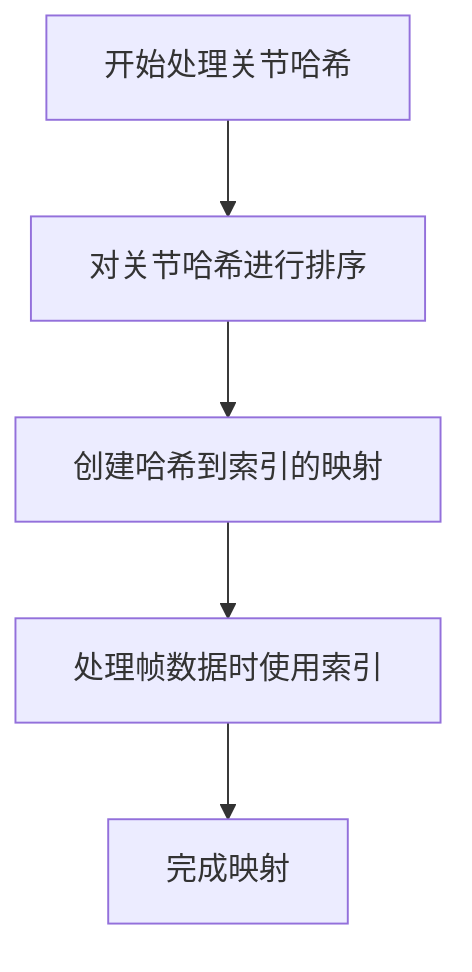
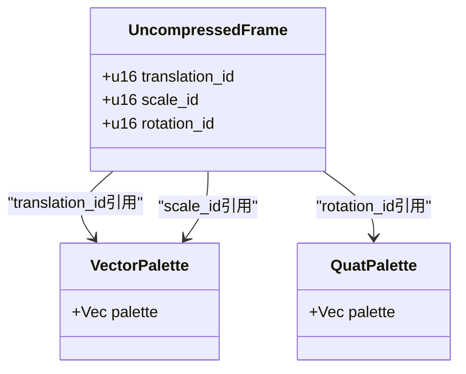
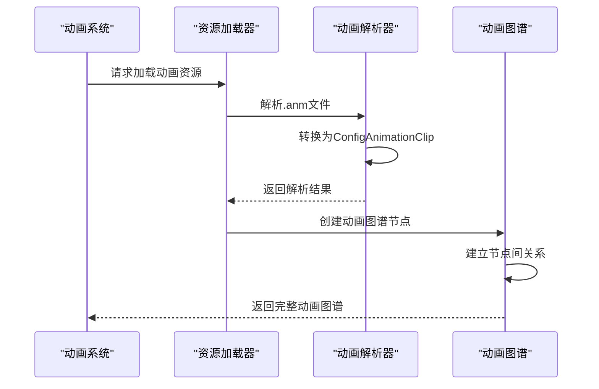

# 动画数据转换

<cite>
**本文档引用的文件**   
- [animation.rs](file://crates/league_file/src/animation.rs)
- [animation.rs](file://crates/lol_config/src/animation.rs)
- [animation.rs](file://crates/league_to_lol/src/animation.rs)
- [animation.rs](file://src/core/skin/animation.rs)
- [extract.rs](file://crates/league_core/src/extract.rs)
</cite>

## 目录
1. [简介](#简介)
2. [动画文件格式解析](#动画文件格式解析)
3. [ConfigAnimationClip结构转换](#configanimationclip结构转换)
4. [关节哈希与索引映射](#关节哈希与索引映射)
5. [时间戳计算方法](#时间戳计算方法)
6. [调色板解压缩机制](#调色板解压缩机制)
7. [动画图谱数据加载](#动画图谱数据加载)
8. [扩展支持建议](#扩展支持建议)

## 简介
本文档深入解析LoL动画文件（.anm）到Bevy兼容的`ConfigAnimationClip`结构的转换过程。涵盖压缩与非压缩动画格式的差异化处理逻辑，详细说明帧数据按关节分类存储为平移、旋转、缩放关键帧序列的实现方式。

## 动画文件格式解析

LoL动画文件支持两种主要格式：压缩动画（Compressed）和非压缩动画（Uncompressed）。文件通过魔数标识格式类型，`r3d2canm`表示压缩格式，`r3d2anmd`表示非压缩格式。

压缩动画格式（CompressedData）包含以下核心字段：
- `joint_count`: 关节数量
- `frame_count`: 帧数量
- `duration`: 动画总时长
- `fps`: 帧率
- `joint_hashes`: 关节哈希值数组
- `frames`: 压缩帧数据数组

非压缩动画格式支持V3-V5版本，其中V5版本包含：
- `track_count`: 轨道数量
- `frame_count`: 帧数量
- `frame_duration`: 帧持续时间
- `joint_hashes`: 关节哈希值
- `vector_palette`: 向量调色板
- `quat_palette`: 四元数调色板
- `frames`: 非压缩帧数据

**Section sources**
- [animation.rs](file://crates/league_file/src/animation.rs#L11-L275)

## ConfigAnimationClip结构转换

`ConfigAnimationClip`结构是Bevy引擎兼容的动画剪辑配置，包含以下字段：
- `fps`: 帧率
- `duration`: 动画持续时间
- `joint_hashes`: 关节哈希值数组
- `translates`: 平移关键帧序列
- `rotations`: 旋转关键帧序列
- `scales`: 缩放关键帧序列

转换过程根据动画格式类型分别处理：

对于压缩动画，逐帧解析`CompressedFrame`数据，根据`transform_type`将数据分类存储到对应的关节通道中。每个帧包含关节ID、变换类型和压缩值，通过解压缩函数还原为实际的平移、旋转或缩放值。

对于非压缩动画V3-V5版本，使用调色板机制进行解压缩。帧数据中的ID引用调色板中的实际值，通过索引查找还原完整动画数据。

**Section sources**
- [animation.rs](file://crates/lol_config/src/animation.rs#L4-L12)
- [animation.rs](file://crates/league_to_lol/src/animation.rs#L34-L227)

## 关节哈希与索引映射

关节哈希（joint_hashes）是关节名称的哈希值数组，用于唯一标识每个关节。在非压缩V3和V4版本中，关节哈希需要进行排序和索引映射：



**Diagram sources**
- [animation.rs](file://crates/league_to_lol/src/animation.rs#L86-L93)

排序确保了关节数据的有序存储，而哈希到索引的映射表允许快速查找对应关节的数据位置。V5版本直接使用预定义的关节哈希顺序，无需额外排序。

## 时间戳计算方法

时间戳的计算方法根据动画格式有所不同：

对于压缩动画，使用`decompress_time`函数计算时间戳：
```rust
pub fn decompress_time(time: u16, duration: f32) -> f32 {
    time as f32 * ONE_OVER_USHORT_MAX * duration
}
```

对于非压缩V3版本，时间戳基于帧率计算：
```rust
let time = time_idx as f32 / fps;
```

对于非压缩V4和V5版本，时间戳基于帧持续时间计算：
```rust
let time = time_idx as f32 * data.frame_duration;
```

动画总时长的计算也因版本而异：
- V3: `(frame_count-1) / fps`
- V4/V5: `frame_duration * (frame_count-1)`

**Section sources**
- [animation.rs](file://crates/league_file/src/animation.rs#L449-L451)
- [animation.rs](file://crates/league_to_lol/src/animation.rs#L79-L84)

## 调色板解压缩机制

调色板机制是LoL动画文件的核心压缩技术，包含四元数调色板（quat_palette）和向量调色板（vector_palette）。

四元数调色板存储所有旋转关键帧的四元数值。`decompress_quat`函数将3个u16值解压缩为完整的四元数，通过位操作提取索引和分量值，然后计算缺失的第四个分量以确保单位长度。

向量调色板存储平移和缩放关键帧的向量值。解压缩时使用最小值和最大值范围，将归一化的u16值还原为实际的Vec3值。

在非压缩V3版本中，向量调色板有一个特殊设计：索引0固定为`Vec3::ONE`，平移数据从索引1开始存储，这优化了缩放值的存储效率。



**Diagram sources**
- [animation.rs](file://crates/league_file/src/animation.rs#L438-L444)
- [animation.rs](file://crates/league_file/src/animation.rs#L463-L483)

## 动画图谱数据加载

`load_animation_file`函数是动画文件加载的核心入口，由`league_to_lol` crate提供。该函数被`update_skin_animation_spawn`系统调用，作为资源加载流程的一部分。

动画图谱（AnimationGraphData）包含复杂的动画状态机结构，通过`EnumClipData`枚举定义多种节点类型：
- `AtomicClipData`: 原子动画剪辑
- `ConditionFloatClipData`: 浮点条件节点
- `SelectorClipData`: 选择器节点
- `SequencerClipData`: 序列节点
- `ConditionBoolClipData`: 布尔条件节点

`load_animation_map`函数解析`AnimationGraphData`，构建哈希到节点的映射关系，并处理混合数据（blend_data）。混合数据用于定义动画之间的过渡行为，支持时间混合和过渡剪辑混合两种模式。



**Diagram sources**
- [animation.rs](file://src/core/skin/animation.rs#L50-L85)
- [animation.rs](file://crates/league_to_lol/src/animation.rs#L10-L32)

## 扩展支持建议

为支持新的动画版本或自定义插值模式，建议采用以下扩展策略：

1. **版本兼容性**: 在`UncompressedData`枚举中添加新的版本变体，使用`pre_assert`确保版本号匹配。

2. **插值模式**: 扩展`UncompressedFrame`结构，添加插值类型字段，支持线性、贝塞尔、样条等不同插值算法。

3. **自定义调色板**: 引入压缩级别参数，允许在文件大小和动画质量之间进行权衡。

4. **元数据支持**: 在`ConfigAnimationClip`中添加自定义元数据字段，存储动画标签、循环点等附加信息。

5. **错误处理**: 增强`load_animation_file`函数的错误处理能力，提供详细的解析错误信息，便于调试和修复损坏的动画文件。

**Section sources**
- [animation.rs](file://crates/league_file/src/animation.rs#L216-L223)
- [animation.rs](file://crates/lol_config/src/animation.rs#L4-L12)