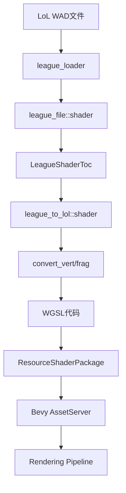
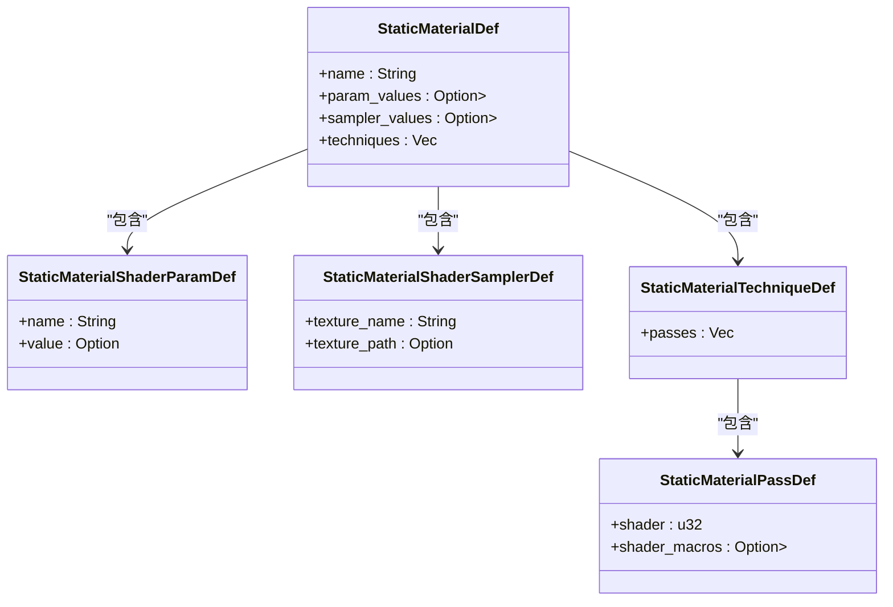
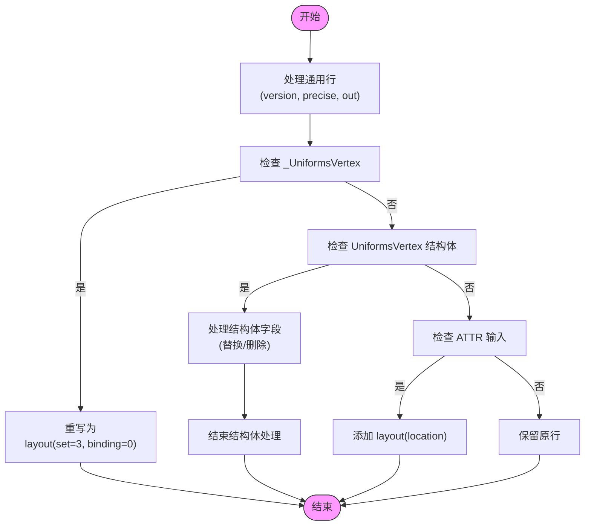
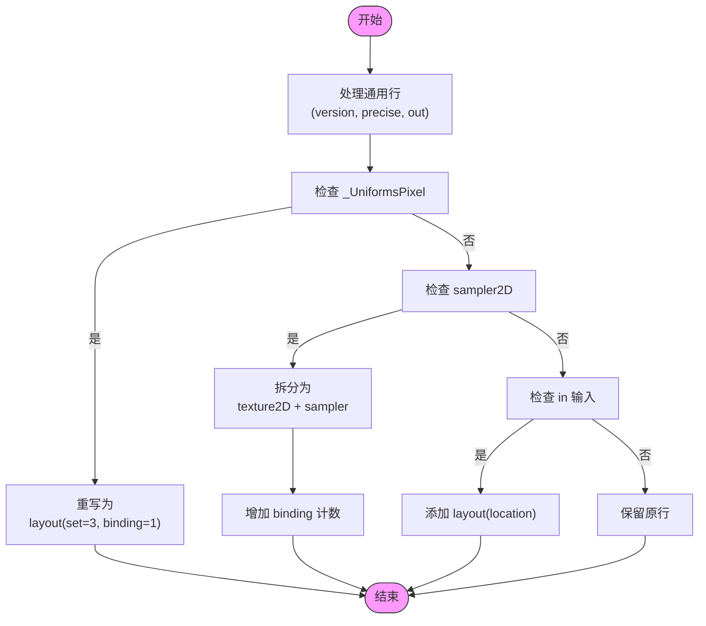
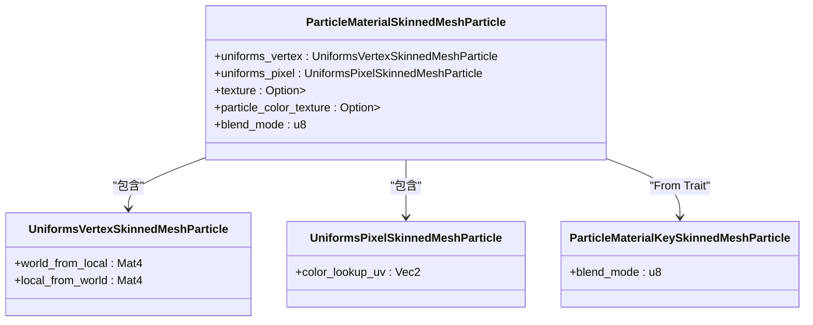
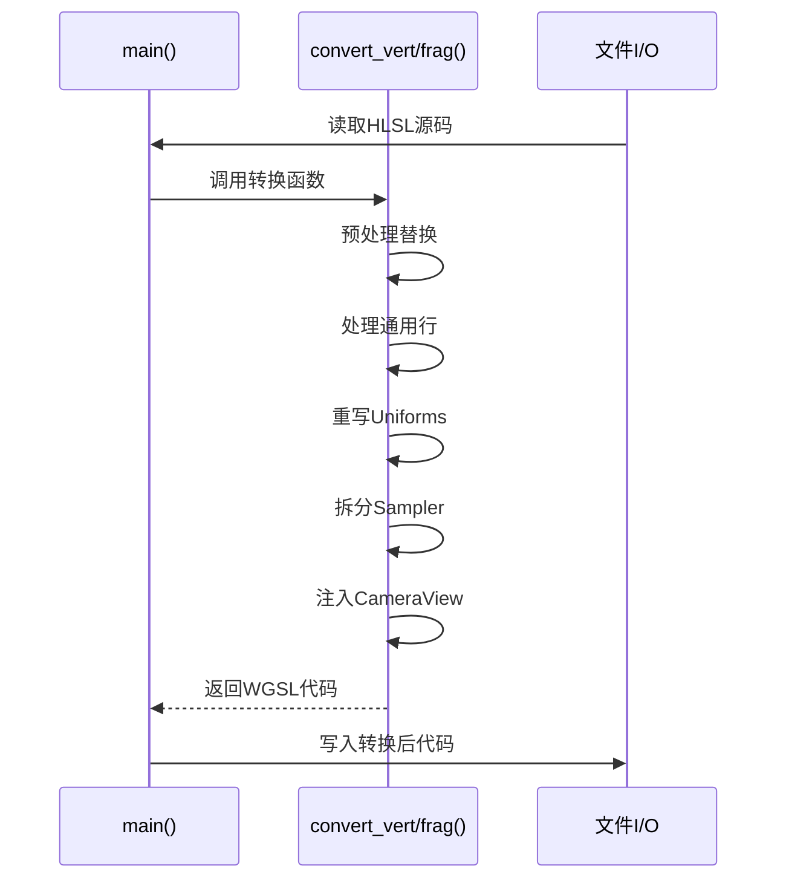
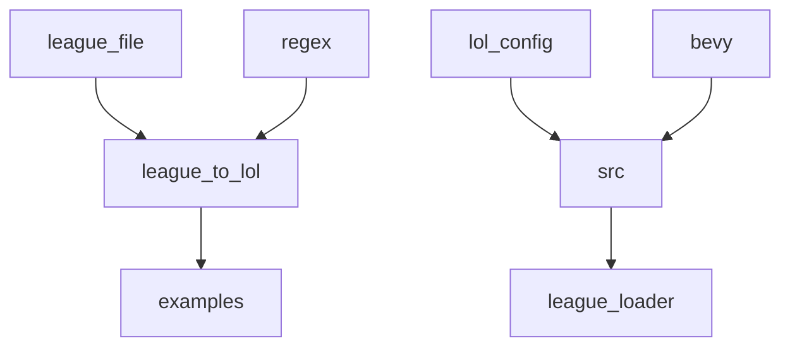

# 材质与着色器转换

<cite>
**本文档引用文件**  
- [shader.rs](file://crates/league_file/src/shader.rs)
- [shader.rs](file://crates/league_to_lol/src/shader.rs)
- [shader.rs](file://crates/lol_config/src/shader.rs)
- [shader_convert.rs](file://examples/shader_convert.rs)
- [shader.rs](file://src/core/resource/shader.rs)
- [extract.rs](file://crates/league_core/src/extract.rs)
- [particle.rs](file://src/core/particle/skinned_mesh/particle.rs)
- [mesh.rs](file://src/core/particle/particle/mesh.rs)
- [unlit_decal.rs](file://src/core/particle/environment/unlit_decal.rs)
- [emitter.rs](file://src/core/particle/emitter.rs)
</cite>

## 目录
1. [简介](#简介)
2. [项目结构](#项目结构)
3. [核心组件](#核心组件)
4. [架构概述](#架构概述)
5. [详细组件分析](#详细组件分析)
6. [依赖分析](#依赖分析)
7. [性能考虑](#性能考虑)
8. [故障排除指南](#故障排除指南)
9. [结论](#结论)

## 简介
本文档系统阐述了《英雄联盟》（LoL）专有着色器参数如何映射到Bevy渲染管线中的材质属性。重点说明了`shader.rs`中定义的转换规则，包括法线贴图、高光强度、自发光等PBR参数的提取与重映射方法。文档描述了如何解析LoL材质标识符并生成对应的Bevy标准材质（StandardMaterial）或自定义着色器参数集。结合`examples/shader_convert.rs`中的实际用例，展示了从原始资源到可渲染材质的完整转换链路。同时讨论了如何处理LoL特有的渲染效果（如技能特效着色器）在Bevy中的近似模拟，并提供了调试工具建议和未来扩展方向。

## 项目结构
项目采用分层架构，核心功能模块化分布在`crates`目录下。`league_file`负责解析LoL原始二进制文件，`league_to_lol`负责转换逻辑，`lol_config`定义了Bevy资产结构，而`src`目录下的核心模块则负责运行时的资源加载与渲染。着色器处理流程贯穿多个模块，从文件解析、代码转换到最终的材质实例化。

**Section sources**
- [project_structure](file://project_structure)

## 核心组件
核心组件包括`league_file::shader`模块，用于解析LoL着色器元数据；`league_to_lol::shader`模块，负责HLSL到WGSL的语法转换；以及`lol_config::shader`模块，定义了Bevy中着色器包的资产结构。`src/core/resource/shader.rs`则管理着色器资源的加载与更新流程。

**Section sources**
- [crates/league_file/src/shader.rs](file://crates/league_file/src/shader.rs#L1-L58)
- [crates/league_to_lol/src/shader.rs](file://crates/league_to_lol/src/shader.rs#L1-L207)
- [crates/lol_config/src/shader.rs](file://crates/lol_config/src/shader.rs#L1-L12)
- [src/core/resource/shader.rs](file://src/core/resource/shader.rs#L1-L57)

## 架构概述
系统架构遵循“解析-转换-加载-渲染”的数据流。首先，`league_loader`从WAD文件中提取着色器二进制数据，由`league_file`解析为`LeagueShaderToc`等结构。随后，`league_to_lol`模块利用`convert_vert`和`convert_frag`函数将HLSL代码转换为符合Bevy要求的WGSL代码。转换后的着色器被封装为`ResourceShaderPackage`资产，由Bevy的`AssetServer`加载，并通过`startup_load_shaders`和`update_shaders`系统最终注入到渲染管线中。

**Diagram sources**
- [crates/league_loader/src/lib.rs](file://crates/league_loader/src/lib.rs)
- [crates/league_file/src/shader.rs](file://crates/league_file/src/shader.rs#L6-L28)
- [crates/league_to_lol/src/shader.rs](file://crates/league_to_lol/src/shader.rs#L66-L207)
- [crates/lol_config/src/shader.rs](file://crates/lol_config/src/shader.rs#L5-L8)
- [src/core/resource/shader.rs](file://src/core/resource/shader.rs#L15-L57)

## 详细组件分析

### LoL着色器参数到Bevy材质的映射
LoL的材质参数通过`StaticMaterialDef`结构体进行描述，其中`param_values`字段包含`StaticMaterialShaderParamDef`，用于存储如法线强度、高光强度等PBR参数。这些参数在转换过程中，会根据其`name`字段映射到Bevy的`StandardMaterial`属性或自定义材质的Uniforms结构体中。例如，名为`g_NormalScale`的参数会被提取并用于设置法线贴图的缩放。

#### 参数提取与重映射方法

**Diagram sources**
- [crates/league_core/src/extract.rs](file://crates/league_core/src/extract.rs#L2803-L2867)

**Section sources**
- [crates/league_core/src/extract.rs](file://crates/league_core/src/extract.rs#L2803-L2867)

### 着色器代码转换规则
`league_to_lol::shader`模块中的`ShaderRewriter`结构体是代码转换的核心。它通过`convert_vert`和`convert_frag`函数处理顶点和片段着色器。

#### 顶点着色器转换流程

**Diagram sources**
- [crates/league_to_lol/src/shader.rs](file://crates/league_to_lol/src/shader.rs#L66-L148)

#### 片段着色器转换流程

**Diagram sources**
- [crates/league_to_lol/src/shader.rs](file://crates/league_to_lol/src/shader.rs#L150-L207)

### 自定义材质与渲染管线集成
对于Bevy标准材质无法覆盖的LoL特有效果，系统通过定义自定义材质结构体来实现。例如，`ParticleMaterialSkinnedMeshParticle`和`ParticleMaterialMesh`等结构体，通过`#[derive(AsBindGroup)]`宏自动生成着色器绑定组，将Uniforms和纹理资源传递给着色器。

#### 自定义材质结构

**Diagram sources**
- [src/core/particle/skinned_mesh/particle.rs](file://src/core/particle/skinned_mesh/particle.rs#L43-L90)
- [src/core/particle/particle/mesh.rs](file://src/core/particle/particle/mesh.rs#L43-L92)

**Section sources**
- [src/core/particle/skinned_mesh/particle.rs](file://src/core/particle/skinned_mesh/particle.rs#L43-L90)
- [src/core/particle/particle/mesh.rs](file://src/core/particle/particle/mesh.rs#L43-L92)

### 完整转换链路示例
`examples/shader_convert.rs`提供了一个独立的转换工具，演示了从文件读取到代码转换再到文件写入的完整流程。该示例直接调用了`league_to_lol`库中的转换函数，是理解转换过程的绝佳入口。

**Diagram sources**
- [examples/shader_convert.rs](file://examples/shader_convert.rs#L1-L29)

**Section sources**
- [examples/shader_convert.rs](file://examples/shader_convert.rs#L1-L29)

## 依赖分析
系统依赖关系清晰，`league_to_lol`模块依赖`league_file`来获取原始着色器数据，同时依赖`regex`库进行代码模式匹配。`src`核心模块依赖`lol_config`来定义资产类型，并依赖Bevy框架进行渲染。`examples`目录下的示例则依赖`league_to_lol`库进行功能演示。

**Diagram sources**
- [Cargo.toml](file://Cargo.toml)
- [crates/league_to_lol/Cargo.toml](file://crates/league_to_lol/Cargo.toml)
- [crates/lol_config/Cargo.toml](file://crates/lol_config/Cargo.toml)

**Section sources**
- [Cargo.toml](file://Cargo.toml)
- [crates/league_to_lol/Cargo.toml](file://crates/league_to_lol/Cargo.toml)
- [crates/lol_config/Cargo.toml](file://crates/lol_config/Cargo.toml)

## 性能考虑
着色器转换过程主要在资源加载阶段完成，对运行时性能影响较小。通过`ResourceShaderPackage`的哈希映射机制，避免了重复编译和加载。对于复杂的材质，建议在编辑器中预先转换，以减少游戏启动时的加载时间。自定义材质的`blend_mode`等字段被用作`MaterialPipelineKey`，可以有效减少渲染状态的频繁切换。

## 故障排除指南
当遇到材质渲染异常时，首先应检查`examples/shader_convert.rs`的转换输出，确认WGSL代码是否正确。其次，验证`param_values`中的参数名称是否与着色器期望的Uniform名称匹配。对于粒子效果，需检查`emitter.rs`中材质实例化的逻辑，确保纹理和Uniforms被正确赋值。使用Bevy的`RenderDoc`插件可以捕获渲染帧，对比原始LoL效果与转换后效果的差异。

**Section sources**
- [src/core/particle/emitter.rs](file://src/core/particle/emitter.rs#L577-L598)
- [src/core/particle/environment/unlit_decal.rs](file://src/core/particle/environment/unlit_decal.rs#L95-L132)

## 结论
本系统成功实现了LoL专有着色器到Bevy渲染管线的转换。通过解析`StaticMaterialDef`中的参数和宏定义，利用`league_to_lol`模块进行代码重写，并结合自定义材质结构，能够准确地再现LoL的视觉效果。未来可扩展支持动态着色器生成，根据运行时参数实时编译着色器变体，以支持更复杂的动态材质效果。