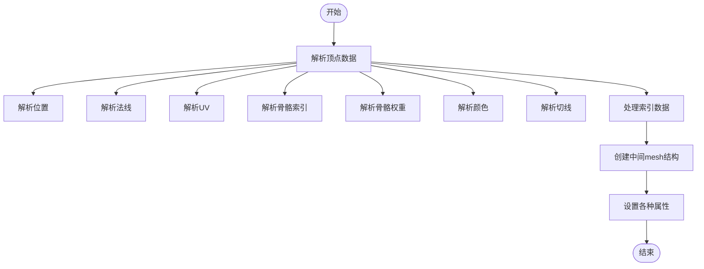
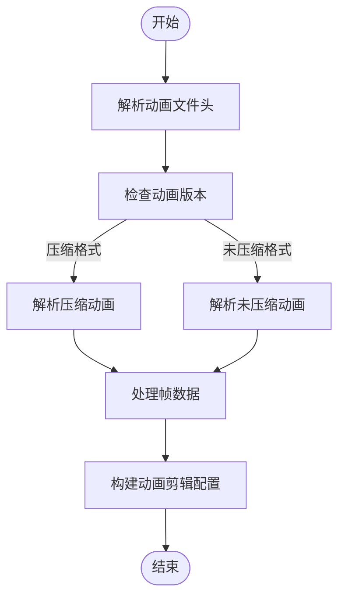
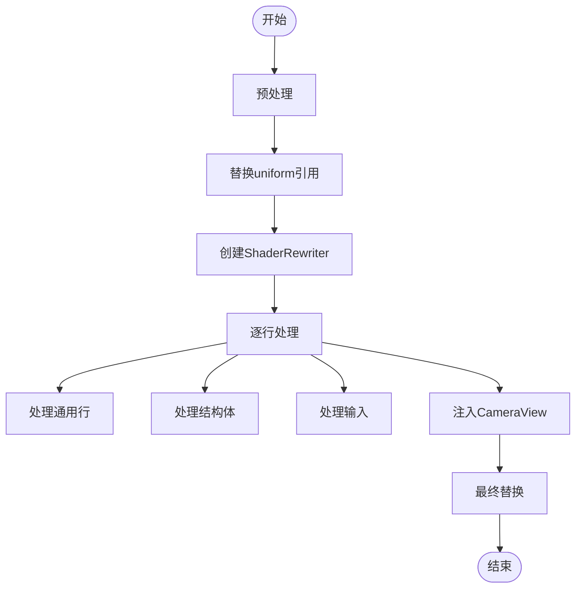
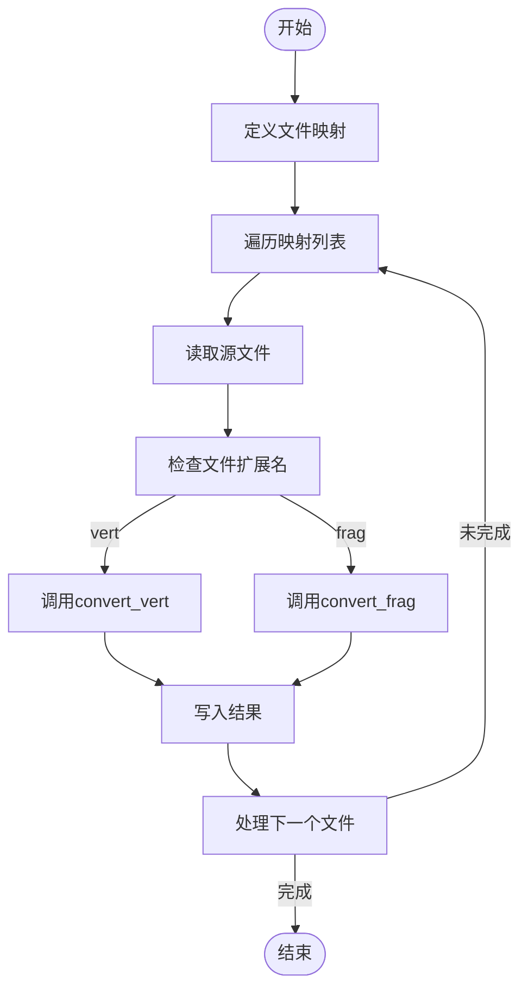

# 资源转换

<cite>
**本文档引用的文件**
- [mesh_static.rs](file://crates/league_to_lol/src/mesh_static.rs)
- [skin_mesh.rs](file://crates/league_to_lol/src/skin_mesh.rs)
- [animation.rs](file://crates/league_to_lol/src/animation.rs)
- [shader.rs](file://crates/league_to_lol/src/shader.rs)
- [shader_convert.rs](file://examples/shader_convert.rs)
- [mesh.rs](file://crates/lol_config/src/mesh.rs)
- [mesh_static.rs](file://crates/league_file/src/mesh_static.rs)
- [mesh_skinned.rs](file://crates/league_file/src/mesh_skinned.rs)
- [animation.rs](file://crates/league_file/src/animation.rs)
- [utils.rs](file://crates/league_to_lol/src/utils.rs)
</cite>

## 目录
1. [简介](#简介)
2. [静态网格转换](#静态网格转换)
3. [骨骼网格转换](#骨骼网格转换)
4. [动画数据转换](#动画数据转换)
5. [着色器转换](#着色器转换)
6. [性能优化建议](#性能优化建议)
7. [实际转换流程示例](#实际转换流程示例)

## 简介
本文档详细说明了如何将解析后的LoL专有资源转换为Bevy引擎可渲染的通用格式。重点描述了`league_to_lol` crate中的转换逻辑，包括网格、动画和着色器的转换过程。

## 静态网格转换

`league_to_lol` crate中的`mesh_static.rs`文件实现了将LoL的`.skn`文件转换为Bevy引擎的`bevy::render::mesh::Mesh`的功能。转换过程主要包括顶点缓冲区、索引缓冲区和材质属性的映射。

转换函数`mesh_static_to_bevy_mesh`首先计算顶点数量，然后准备展开后的顶点属性向量，包括位置、UV坐标和顶点颜色（如果存在）。接着遍历所有面，展开顶点数据，并创建索引。最后，创建Bevy Mesh并插入所有属性。

**Section sources**
- [mesh_static.rs](file://crates/league_to_lol/src/mesh_static.rs#L6-L74)
- [mesh_static.rs](file://crates/league_file/src/mesh_static.rs#L77-L182)

## 骨骼网格转换

骨骼网格的转换通过`skin_mesh.rs`文件中的`skinned_mesh_to_intermediate`函数实现。该函数处理包含骨骼动画的网格，解析顶点数据和索引数据，并创建中间mesh结构。

转换过程包括：
1. 计算顶点数据范围
2. 解析顶点数据，包括位置、法线、UV、骨骼索引、骨骼权重、颜色和切线
3. 处理索引数据
4. 创建中间mesh结构并设置各种属性

**Diagram sources**
- [skin_mesh.rs](file://crates/league_to_lol/src/skin_mesh.rs#L4-L144)
- [mesh_skinned.rs](file://crates/league_file/src/mesh_skinned.rs#L49-L119)

**Section sources**
- [skin_mesh.rs](file://crates/league_to_lol/src/skin_mesh.rs#L4-L144)
- [mesh_skinned.rs](file://crates/league_file/src/mesh_skinned.rs#L49-L119)

## 动画数据转换

动画数据的转换通过`animation.rs`文件中的`load_animation_file`函数实现。该函数处理不同版本的动画文件，包括压缩和未压缩格式。

转换过程包括：
1. 解析动画文件头信息
2. 根据动画版本选择相应的解析逻辑
3. 处理帧数据，包括旋转、平移和缩放
4. 构建动画剪辑配置

**Diagram sources**
- [animation.rs](file://crates/league_to_lol/src/animation.rs#L34-L227)
- [animation.rs](file://crates/league_file/src/animation.rs#L14-L485)

**Section sources**
- [animation.rs](file://crates/league_to_lol/src/animation.rs#L34-L227)
- [animation.rs](file://crates/league_file/src/animation.rs#L14-L485)

## 着色器转换

着色器转换通过`shader.rs`文件中的`convert_vert`和`convert_frag`函数实现。这些函数将LoL的着色器代码转换为Bevy引擎兼容的格式。

转换规则包括：
1. 版本号替换为`#version 450`
2. 处理uniform引用，如`mProj`替换为`camera_view.clip_from_world`
3. 注入CameraView结构体
4. 处理sampler2D，拆分为texture2D和sampler

**Diagram sources**
- [shader.rs](file://crates/league_to_lol/src/shader.rs#L66-L206)
- [shader.rs](file://crates/league_file/src/shader.rs#L9-L58)

**Section sources**
- [shader.rs](file://crates/league_to_lol/src/shader.rs#L66-L206)
- [shader.rs](file://crates/league_file/src/shader.rs#L9-L58)

## 性能优化建议

在资源转换过程中，可以采取以下性能优化策略：

1. **顶点缓存优化**：在处理静态网格时，通过展开顶点数据来优化顶点缓存的使用。
2. **LOD支持**：根据距离动态选择不同细节级别的网格，减少远距离物体的渲染开销。
3. **批处理策略**：将使用相同材质的多个网格合并为一个批次进行渲染，减少绘制调用次数。
4. **内存管理**：预分配向量容量，避免频繁的内存分配和复制操作。

## 实际转换流程示例

`examples/shader_convert.rs`文件展示了实际的转换流程和调试方法。该示例程序读取源着色器文件，根据文件扩展名选择相应的转换函数，然后将转换结果写入目标文件。

转换流程如下：
1. 定义源文件和目标文件的映射列表
2. 遍历映射列表
3. 读取源文件内容
4. 根据文件扩展名选择转换函数
5. 执行转换
6. 写入目标文件

**Diagram sources**
- [shader_convert.rs](file://examples/shader_convert.rs#L5-L28)

**Section sources**
- [shader_convert.rs](file://examples/shader_convert.rs#L5-L28)
- [utils.rs](file://crates/league_to_lol/src/utils.rs#L38-L76)