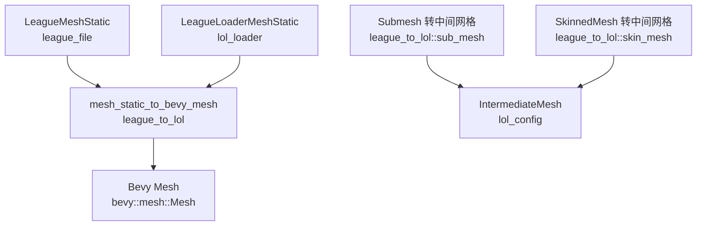
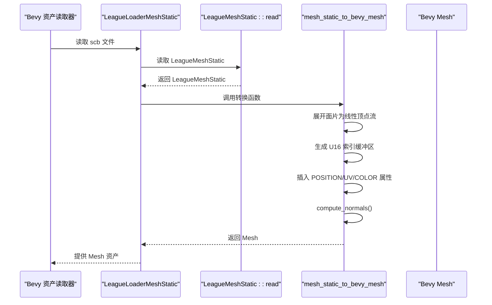
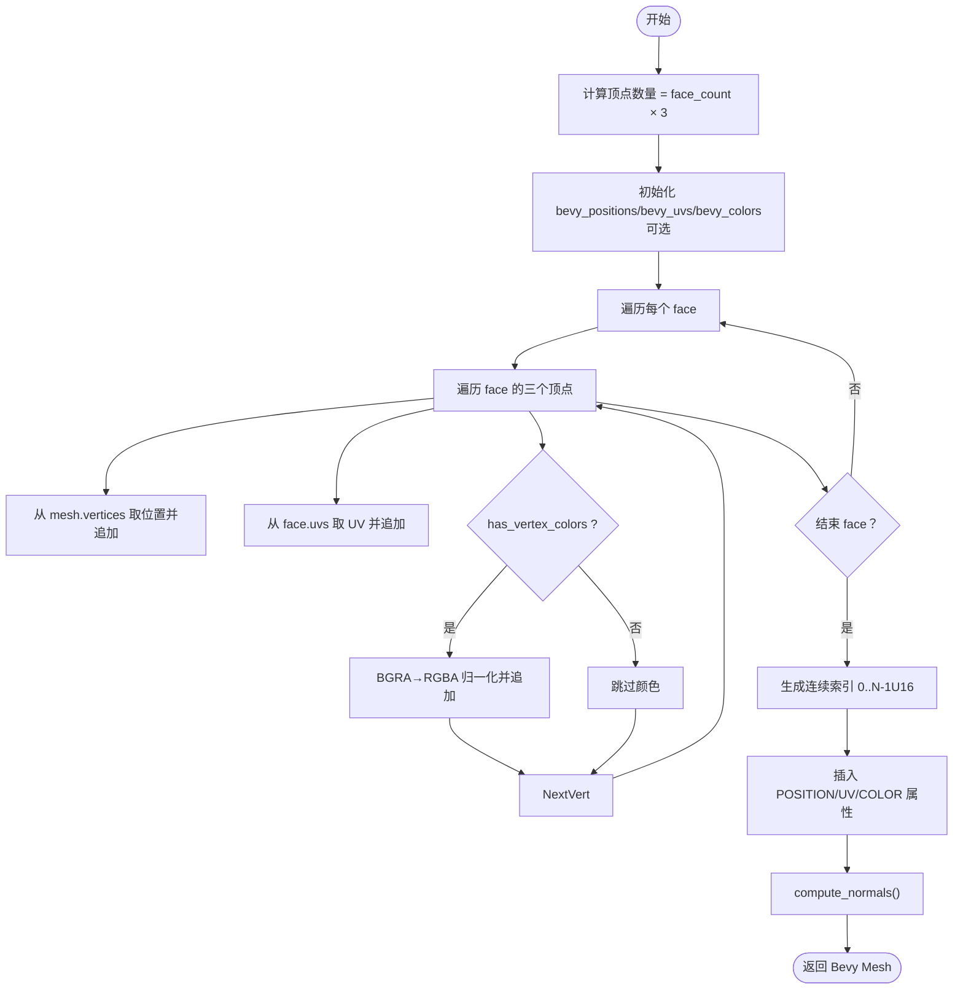
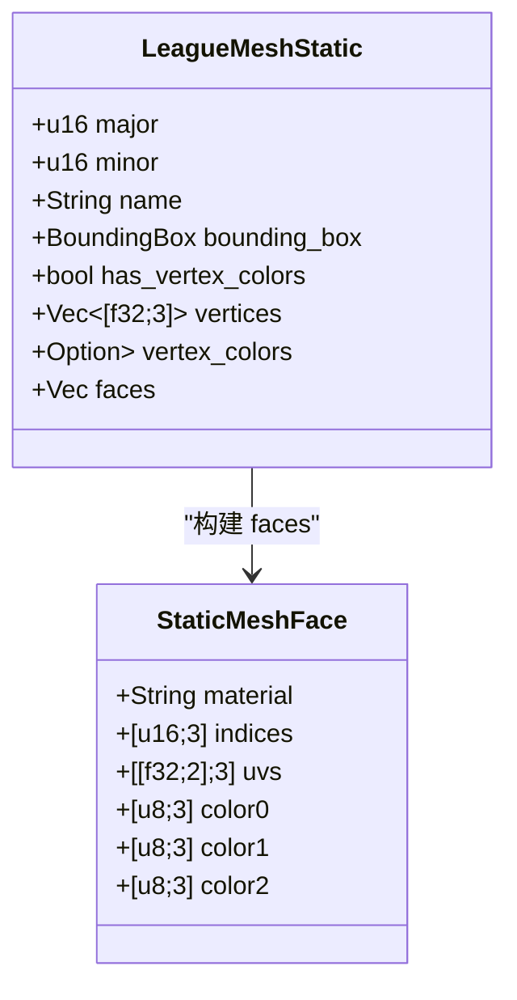
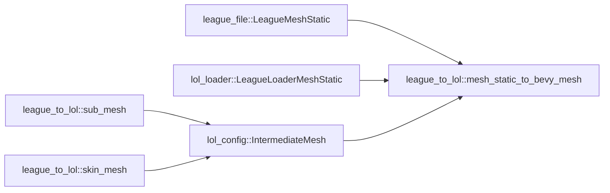

# 静态模型转换

<cite>
**本文引用的文件**
- [mesh_static.rs](file://crates/league_to_lol/src/mesh_static.rs)
- [mesh_static.rs](file://crates/league_file/src/mesh_static.rs)
- [lib.rs](file://crates/lol_loader/src/lib.rs)
- [sub_mesh.rs](file://crates/league_to_lol/src/sub_mesh.rs)
- [skin_mesh.rs](file://crates/league_to_lol/src/skin_mesh.rs)
- [mesh.rs](file://crates/lol_config/src/mesh.rs)
</cite>

## 目录
1. [简介](#简介)
2. [项目结构](#项目结构)
3. [核心组件](#核心组件)
4. [架构概览](#架构概览)
5. [详细组件分析](#详细组件分析)
6. [依赖关系分析](#依赖关系分析)
7. [性能考量](#性能考量)
8. [故障排查指南](#故障排查指南)
9. [结论](#结论)
10. [附录](#附录)

## 简介
本文件面向希望将 LoL 静态网格文件（.skn，内部以 LeagueMeshStatic 表示）转换为 Bevy 引擎可用的 bevy::render::mesh::Mesh 的开发者。文档围绕 mesh_static_to_bevy_mesh 函数的实现逻辑进行深入剖析，涵盖：
- 顶点位置、UV 坐标、顶点颜色（BGRA 转 RGBA 并归一化）的提取与处理
- 面片（face）数据展开为线性顶点流的过程
- 索引缓冲区的生成策略
- 法线计算的自动补全机制及其对渲染效果的影响
- 输入 LeagueMeshStatic 到输出 Bevy Mesh 的完整流程
- 性能优化建议（顶点缓存对齐、批量处理相似网格等）
- 测试用例中使用的示例资源路径及其验证逻辑

## 项目结构
与静态网格转换相关的关键模块分布如下：
- league_file：定义并解析 LeagueMeshStatic 文件格式，包含顶点、面片、UV、顶点色等字段
- league_to_lol：提供 mesh_static_to_bevy_mesh 转换函数，将 LeagueMeshStatic 转为 Bevy Mesh
- lol_loader：Bevy 资产加载器，负责将 scb 文件读入并调用转换函数
- league_to_lol::sub_mesh：处理 MapGeo 静态网格（非 skn）的子网格拆分与重映射
- league_to_lol::skin_mesh：处理带骨骼的动态网格（skinned mesh），展示法线、切线、颜色等属性的读取与转换
- lol_config：中间网格结构与校验（如顶点数一致性）

图表来源
- [mesh_static.rs](file://crates/league_to_lol/src/mesh_static.rs#L1-L75)
- [mesh_static.rs](file://crates/league_file/src/mesh_static.rs#L76-L181)
- [lib.rs](file://crates/lol_loader/src/lib.rs#L224-L250)
- [sub_mesh.rs](file://crates/league_to_lol/src/sub_mesh.rs#L1-L78)
- [skin_mesh.rs](file://crates/league_to_lol/src/skin_mesh.rs#L1-L144)
- [mesh.rs](file://crates/lol_config/src/mesh.rs#L202-L237)

章节来源
- [mesh_static.rs](file://crates/league_to_lol/src/mesh_static.rs#L1-L75)
- [mesh_static.rs](file://crates/league_file/src/mesh_static.rs#L76-L181)
- [lib.rs](file://crates/lol_loader/src/lib.rs#L224-L250)

## 核心组件
- LeagueMeshStatic：定义静态网格的数据结构，包含顶点、面片、UV、顶点色等字段，以及构建面片的逻辑
- mesh_static_to_bevy_mesh：将 LeagueMeshStatic 展开为线性顶点流，生成索引，插入属性并计算法线
- LeagueLoaderMeshStatic：Bevy 资产加载器，读取 scb 文件并调用 mesh_static_to_bevy_mesh
- IntermediateMesh：中间网格结构，用于 MapGeo 子网格的重映射与属性校验
- SkinnedMesh 转换：展示法线、切线、颜色等属性的读取与 BGRA→RGBA 归一化流程

章节来源
- [mesh_static.rs](file://crates/league_file/src/mesh_static.rs#L76-L181)
- [mesh_static.rs](file://crates/league_to_lol/src/mesh_static.rs#L1-L75)
- [lib.rs](file://crates/lol_loader/src/lib.rs#L224-L250)
- [sub_mesh.rs](file://crates/league_to_lol/src/sub_mesh.rs#L1-L78)
- [skin_mesh.rs](file://crates/league_to_lol/src/skin_mesh.rs#L1-L144)
- [mesh.rs](file://crates/lol_config/src/mesh.rs#L202-L237)

## 架构概览
下面的序列图展示了从 scb 文件到 Bevy Mesh 的完整流程，包括文件解析、转换与法线计算。

图表来源
- [lib.rs](file://crates/lol_loader/src/lib.rs#L224-L250)
- [mesh_static.rs](file://crates/league_to_lol/src/mesh_static.rs#L1-L75)
- [mesh_static.rs](file://crates/league_file/src/mesh_static.rs#L76-L181)

## 详细组件分析

### mesh_static_to_bevy_mesh 实现逻辑
该函数将 LeagueMeshStatic 展开为线性顶点流并生成 Bevy Mesh，具体步骤如下：
- 顶点位置提取：遍历每个面的三个顶点，按全局顶点索引从 mesh.vertices 中取出位置并追加到 bevy_positions
- UV 坐标提取：UV 直接存储在面结构中，按顺序追加到 bevy_uvs
- 顶点颜色（BGRA→RGBA 归一化）：若源网格包含顶点色，则从 mesh.vertex_colors 中按全局索引取出 BGRA 字节，转换为 RGBA 浮点并归一化后追加到 bevy_colors
- 面片展开为线性顶点流：每个面贡献三个顶点，因此顶点总数为 face_count × 3
- 索引缓冲区生成策略：由于已完全展开为线性顶点流，索引为连续的 0..N-1 序列，使用 U16 类型
- 插入属性：将 POSITION、UV、COLOR（可选）插入到 Mesh 中
- 法线计算：调用 compute_normals() 自动补全法线

图表来源
- [mesh_static.rs](file://crates/league_to_lol/src/mesh_static.rs#L1-L75)

章节来源
- [mesh_static.rs](file://crates/league_to_lol/src/mesh_static.rs#L1-L75)

### 输入 LeagueMeshStatic 的数据结构与读取
LeagueMeshStatic 定义了静态网格的文件布局，包括：
- 版本检查、名称、包围盒、标志位
- 是否包含顶点色（has_vertex_colors）
- 顶点数组 vertices
- 顶点色数组 vertex_colors（可选）
- 面片 faces：由磁盘布局 StaticMeshFaceDisk 重建为内存结构 StaticMeshFace，包含材料名、索引、UV 和面颜色（可选）

图表来源
- [mesh_static.rs](file://crates/league_file/src/mesh_static.rs#L76-L181)

章节来源
- [mesh_static.rs](file://crates/league_file/src/mesh_static.rs#L76-L181)

### 索引缓冲区生成策略
- 展开策略：mesh_static_to_bevy_mesh 将每个面的三个顶点展开为线性顶点流，避免重复顶点
- 索引策略：由于已展开，索引为连续整数序列，使用 U16 类型，确保索引上限与顶点数匹配
- 适用场景：适用于静态网格（无共享顶点）或需要独立顶点属性的场景；若需共享顶点，应采用 MapGeo 的子网格重映射策略

章节来源
- [mesh_static.rs](file://crates/league_to_lol/src/mesh_static.rs#L53-L71)
- [sub_mesh.rs](file://crates/league_to_lol/src/sub_mesh.rs#L1-L78)

### 法线计算的自动补全机制
- mesh_static_to_bevy_mesh 在插入属性后调用 compute_normals()，自动基于三角形面片计算法线
- 影响：对于平滑着色，法线会基于面法线插值；对于锐利边缘，可能需要手动提供法线或使用子网格拆分策略
- 对比：MapGeo 子网格重映射支持显式法线（parse_vertex_data），可避免自动补全导致的平滑效果

章节来源
- [mesh_static.rs](file://crates/league_to_lol/src/mesh_static.rs#L72-L74)
- [sub_mesh.rs](file://crates/league_to_lol/src/sub_mesh.rs#L80-L150)

### 顶点颜色（BGRA→RGBA）与归一化
- 来源：mesh.vertex_colors（BGRA 字节）
- 转换：按通道顺序 BGRA→RGBA，并除以 255.0 归一化到 [0,1]
- 插入：仅当 has_vertex_colors 为真时插入 Mesh::ATTRIBUTE_COLOR

章节来源
- [mesh_static.rs](file://crates/league_to_lol/src/mesh_static.rs#L13-L49)
- [skin_mesh.rs](file://crates/league_to_lol/src/skin_mesh.rs#L82-L93)

### 与 MapGeo 子网格重映射的对比
- LeagueMeshStatic：直接展开为线性顶点流，适合静态网格
- MapGeo 子网格：先解析全局顶点属性（位置、法线、UV），再按子网格索引范围重映射，保留共享顶点，减少内存占用
- 选择建议：若网格较大且共享顶点较多，优先使用子网格重映射；若追求简单与一致性，可使用静态网格展开

章节来源
- [sub_mesh.rs](file://crates/league_to_lol/src/sub_mesh.rs#L1-L78)
- [sub_mesh.rs](file://crates/league_to_lol/src/sub_mesh.rs#L80-L150)

### 示例资源路径与测试验证
- 测试用例中使用的示例资源路径：ASSETS/Characters/Fiora/Skins/Base/Particles/Fiora_Base_W_sphere.scb
- 加载流程：LeagueLoaderMeshStatic 读取 scb 文件并调用 mesh_static_to_bevy_mesh
- 验证逻辑：断言输出 Mesh 的 PrimitiveTopology 为 TriangleList

章节来源
- [mesh_static.rs](file://crates/league_to_lol/src/mesh_static.rs#L77-L98)
- [lib.rs](file://crates/lol_loader/src/lib.rs#L224-L250)

## 依赖关系分析
- mesh_static_to_bevy_mesh 依赖 league_file::LeagueMeshStatic 的数据结构
- LeagueLoaderMeshStatic 依赖 mesh_static_to_bevy_mesh 完成资产加载
- IntermediateMesh 用于 MapGeo 子网格重映射，强调顶点数一致性校验
- skin_mesh 展示了法线、切线、颜色等属性的标准读取与转换流程

图表来源
- [mesh_static.rs](file://crates/league_to_lol/src/mesh_static.rs#L1-L75)
- [mesh_static.rs](file://crates/league_file/src/mesh_static.rs#L76-L181)
- [lib.rs](file://crates/lol_loader/src/lib.rs#L224-L250)
- [sub_mesh.rs](file://crates/league_to_lol/src/sub_mesh.rs#L1-L78)
- [skin_mesh.rs](file://crates/league_to_lol/src/skin_mesh.rs#L1-L144)
- [mesh.rs](file://crates/lol_config/src/mesh.rs#L202-L237)

章节来源
- [mesh_static.rs](file://crates/league_to_lol/src/mesh_static.rs#L1-L75)
- [mesh_static.rs](file://crates/league_file/src/mesh_static.rs#L76-L181)
- [lib.rs](file://crates/lol_loader/src/lib.rs#L224-L250)
- [sub_mesh.rs](file://crates/league_to_lol/src/sub_mesh.rs#L1-L78)
- [skin_mesh.rs](file://crates/league_to_lol/src/skin_mesh.rs#L1-L144)
- [mesh.rs](file://crates/lol_config/src/mesh.rs#L202-L237)

## 性能考量
- 顶点缓存对齐与内存布局
  - 展开策略：mesh_static_to_bevy_mesh 已将顶点属性按线性顺序排列，有利于 GPU 缓存命中
  - 建议：在导出阶段尽量保持属性顺序一致（POSITION→UV→COLOR），减少跨属性访问
- 索引类型选择
  - 当顶点数超过 65535 时，应切换为 U32 索引；当前实现使用 U16，需注意上限
- 批量处理相似网格
  - 对于大量相同拓扑的静态网格，可复用 Mesh 或合并为批次渲染，减少状态切换
- 自动法线计算成本
  - compute_normals() 会在运行时计算法线，若网格较大，可考虑预计算并显式提供法线（参考 MapGeo 子网格重映射）
- 颜色通道转换
  - BGRA→RGBA 归一化为每顶点常量开销，可在批处理时向量化优化

章节来源
- [mesh_static.rs](file://crates/league_to_lol/src/mesh_static.rs#L53-L74)
- [sub_mesh.rs](file://crates/league_to_lol/src/sub_mesh.rs#L80-L150)

## 故障排查指南
- 顶点数不一致
  - IntermediateMesh 对顶点属性长度进行严格校验，若出现异常，检查是否正确展开或重映射
- 法线缺失或方向异常
  - 若使用 mesh_static_to_bevy_mesh，确认 compute_normals() 是否被调用；若需要锐利边缘，考虑子网格重映射或手动提供法线
- 颜色通道错误
  - 确认 has_vertex_colors 与 vertex_colors 是否匹配；颜色通道应为 BGRA→RGBA 归一化
- 索引溢出
  - 当顶点数超过 65535 时，需改用 U32 索引；当前实现使用 U16，超出将导致渲染错误

章节来源
- [mesh.rs](file://crates/lol_config/src/mesh.rs#L202-L237)
- [mesh_static.rs](file://crates/league_to_lol/src/mesh_static.rs#L53-L74)
- [skin_mesh.rs](file://crates/league_to_lol/src/skin_mesh.rs#L82-L93)

## 结论
mesh_static_to_bevy_mesh 提供了从 LeagueMeshStatic 到 Bevy Mesh 的直接转换路径，具备以下特点：
- 简洁高效：线性展开与连续索引，易于集成
- 功能完备：支持位置、UV、顶点色（BGRA→RGBA 归一化）、自动法线计算
- 易于扩展：可按需添加切线、关节权重等属性
- 适用场景：静态网格或无需共享顶点的场景；若需共享顶点与更精细的法线控制，可参考 MapGeo 子网格重映射方案

## 附录
- 示例资源路径：ASSETS/Characters/Fiora/Skins/Base/Particles/Fiora_Base_W_sphere.scb
- 加载入口：LeagueLoaderMeshStatic
- 关键实现路径：
  - [mesh_static_to_bevy_mesh](file://crates/league_to_lol/src/mesh_static.rs#L1-L75)
  - [LeagueMeshStatic 定义与构建](file://crates/league_file/src/mesh_static.rs#L76-L181)
  - [Bevy 资产加载器](file://crates/lol_loader/src/lib.rs#L224-L250)
  - [MapGeo 子网格重映射](file://crates/league_to_lol/src/sub_mesh.rs#L1-L78)
  - [中间网格结构与校验](file://crates/lol_config/src/mesh.rs#L202-L237)