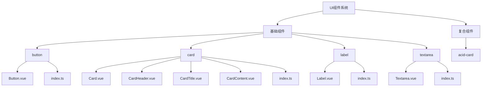
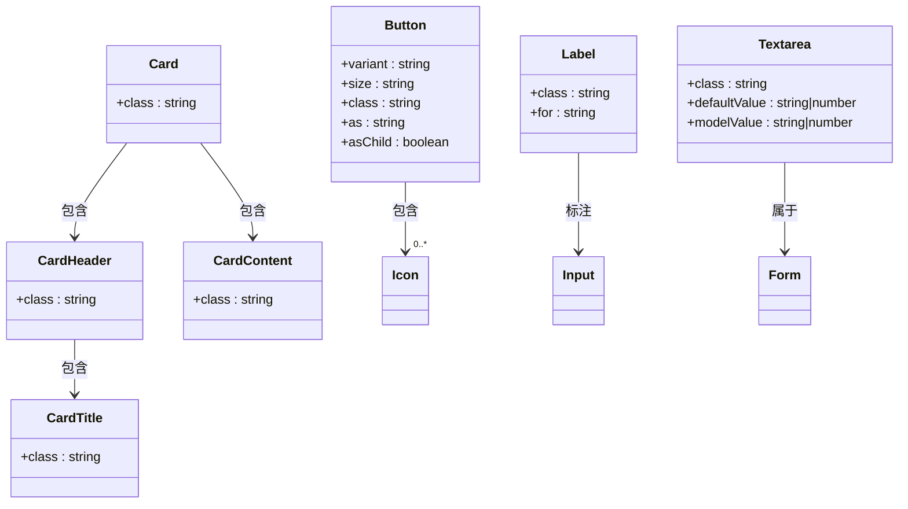
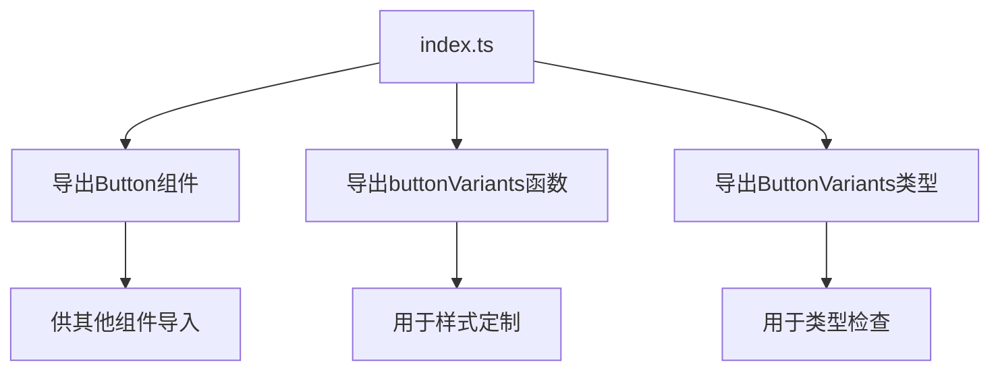
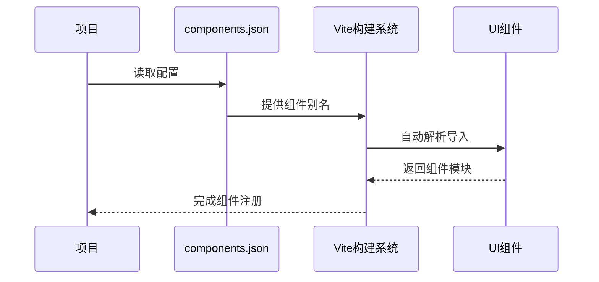
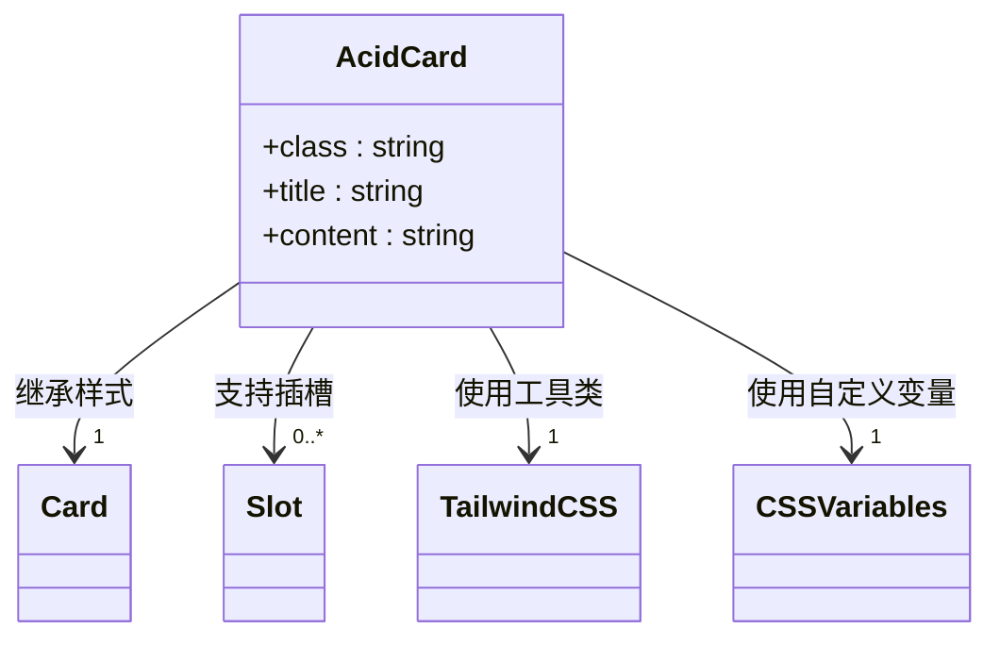
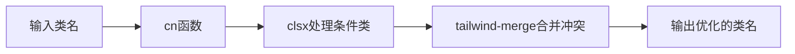
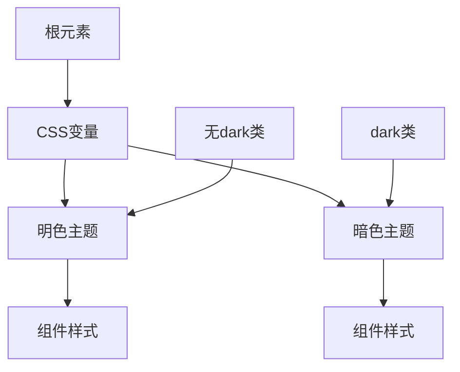
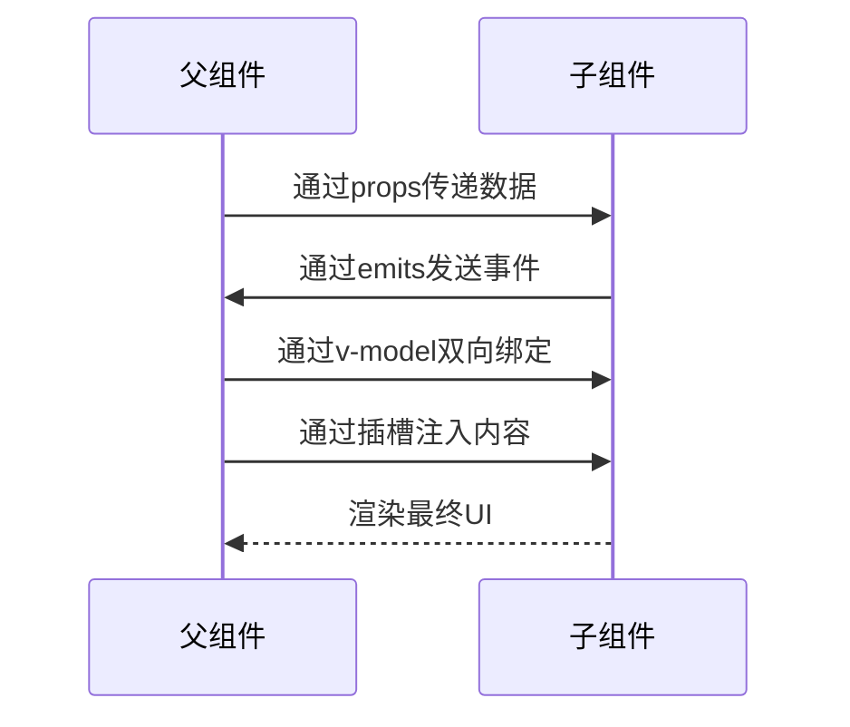

# UI组件系统

<cite>
**本文档中引用的文件**  
- [Button.vue](file://apps/web/src/components/ui/button/Button.vue)
- [button/index.ts](file://apps/web/src/components/ui/button/index.ts)
- [Card.vue](file://apps/web/src/components/ui/card/Card.vue)
- [CardHeader.vue](file://apps/web/src/components/ui/card/CardHeader.vue)
- [CardTitle.vue](file://apps/web/src/components/ui/card/CardTitle.vue)
- [CardContent.vue](file://apps/web/src/components/ui/card/CardContent.vue)
- [card/index.ts](file://apps/web/src/components/ui/card/index.ts)
- [Label.vue](file://apps/web/src/components/ui/label/Label.vue)
- [Textarea.vue](file://apps/web/src/components/ui/textarea/Textarea.vue)
- [acid-card.vue](file://apps/web/src/components/ui/acid-card.vue)
- [components.json](file://apps/web/components.json)
- [utils.ts](file://apps/web/src/lib/utils.ts)
- [style.css](file://apps/web/src/style.css)
</cite>

## 目录
1. [简介](#简介)
2. [项目结构](#项目结构)
3. [核心UI组件](#核心ui组件)
4. [原子化组件设计模式](#原子化组件设计模式)
5. [模块化导出机制](#模块化导出机制)
6. [自动注册系统](#自动注册系统)
7. [acid-card复合组件](#acid-card复合组件)
8. [TailwindCSS样式系统](#tailwindcss样式系统)
9. [可复用性与通信机制](#可复用性与通信机制)
10. [结论](#结论)

## 简介
本项目采用基于Vue3的原子化组件设计模式，构建了一套现代化的UI组件系统。系统以button、card、label、textarea等基础组件为核心，通过index.ts实现模块化导出，并利用components.json实现自动注册。特别设计了acid-card.vue这一自定义复合组件，展现了独特的视觉风格和功能特性。整个系统充分利用TailwindCSS进行样式构建，支持响应式布局和暗色主题适配。

## 项目结构
UI组件系统位于`apps/web/src/components/ui/`目录下，采用原子化设计原则组织文件结构。每个基础组件（如button、card、label等）都拥有独立的子目录，包含组件实现文件和index.ts导出文件。系统还包含一个特殊的acid-card.vue组件，作为复合组件的示例。

**Diagram sources**
- [apps/web/src/components/ui/button/Button.vue](file://apps/web/src/components/ui/button/Button.vue)
- [apps/web/src/components/ui/card/Card.vue](file://apps/web/src/components/ui/card/Card.vue)
- [apps/web/src/components/ui/label/Label.vue](file://apps/web/src/components/ui/label/Label.vue)
- [apps/web/src/components/ui/textarea/Textarea.vue](file://apps/web/src/components/ui/textarea/Textarea.vue)

**Section sources**
- [apps/web/src/components/ui/](file://apps/web/src/components/ui/)

## 核心UI组件

### 按钮组件
按钮组件（Button.vue）是系统中最基础的交互元素，支持多种变体和尺寸。通过`buttonVariants`函数定义了default、destructive、outline、secondary、ghost和acid六种样式变体，以及default、sm、lg、icon等不同尺寸。

**Section sources**
- [apps/web/src/components/ui/button/Button.vue](file://apps/web/src/components/ui/button/Button.vue)
- [apps/web/src/components/ui/button/index.ts](file://apps/web/src/components/ui/button/index.ts)

### 卡片组件
卡片组件（Card.vue）采用复合设计模式，由多个子组件构成：CardHeader、CardTitle、CardDescription和CardContent。这种设计允许灵活组合卡片的不同部分，提高组件的可复用性。

**Section sources**
- [apps/web/src/components/ui/card/Card.vue](file://apps/web/src/components/ui/card/Card.vue)
- [apps/web/src/components/ui/card/CardHeader.vue](file://apps/web/src/components/ui/card/CardHeader.vue)
- [apps/web/src/components/ui/card/CardTitle.vue](file://apps/web/src/components/ui/card/CardTitle.vue)
- [apps/web/src/components/ui/card/CardContent.vue](file://apps/web/src/components/ui/card/CardContent.vue)

### 标签组件
标签组件（Label.vue）主要用于表单元素的标注，具有良好的可访问性特性。组件通过`reactiveOmit`工具函数处理属性传递，确保非class属性能够正确传递给底层元素。

**Section sources**
- [apps/web/src/components/ui/label/Label.vue](file://apps/web/src/components/ui/label/Label.vue)

### 文本域组件
文本域组件（Textarea.vue）实现了v-model双向绑定，使用`useVModel`组合式函数管理模型值。组件支持defaultValue和modelValue属性，提供了完整的表单控件功能。

**Section sources**
- [apps/web/src/components/ui/textarea/Textarea.vue](file://apps/web/src/components/ui/textarea/Textarea.vue)

## 原子化组件设计模式
本项目采用原子化设计模式，将UI分解为最基本的"原子"组件，然后组合成更复杂的"分子"和"有机体"。这种设计模式提高了组件的可复用性和维护性。

**Diagram sources**
- [apps/web/src/components/ui/button/Button.vue](file://apps/web/src/components/ui/button/Button.vue)
- [apps/web/src/components/ui/card/Card.vue](file://apps/web/src/components/ui/card/Card.vue)
- [apps/web/src/components/ui/label/Label.vue](file://apps/web/src/components/ui/label/Label.vue)
- [apps/web/src/components/ui/textarea/Textarea.vue](file://apps/web/src/components/ui/textarea/Textarea.vue)

**Section sources**
- [apps/web/src/components/ui/button/Button.vue](file://apps/web/src/components/ui/button/Button.vue)
- [apps/web/src/components/ui/card/Card.vue](file://apps/web/src/components/ui/card/Card.vue)
- [apps/web/src/components/ui/label/Label.vue](file://apps/web/src/components/ui/label/Label.vue)
- [apps/web/src/components/ui/textarea/Textarea.vue](file://apps/web/src/components/ui/textarea/Textarea.vue)

## 模块化导出机制
每个组件目录通过index.ts文件实现模块化导出，这是系统可维护性的关键。导出机制不仅提供了简洁的导入路径，还集中管理了组件的API。

### 按钮导出机制
按钮组件的index.ts文件不仅导出组件本身，还导出了样式变体函数和类型定义，形成了完整的API包。

**Diagram sources**
- [apps/web/src/components/ui/button/index.ts](file://apps/web/src/components/ui/button/index.ts)

**Section sources**
- [apps/web/src/components/ui/button/index.ts](file://apps/web/src/components/ui/button/index.ts)

### 卡片导出机制
卡片组件采用命名导出方式，将Card及其子组件分别导出，允许使用者按需导入所需组件，优化打包体积。

**Section sources**
- [apps/web/src/components/ui/card/index.ts](file://apps/web/src/components/ui/card/index.ts)

### 其他组件导出
标签和文本域组件采用默认导出方式，简化了常用组件的导入语法。

**Section sources**
- [apps/web/src/components/ui/label/index.ts](file://apps/web/src/components/ui/label/index.ts)
- [apps/web/src/components/ui/textarea/index.ts](file://apps/web/src/components/ui/textarea/index.ts)

## 自动注册系统
系统通过components.json文件实现组件的自动注册，这是基于shadcn-vue框架的特性。该配置文件定义了项目样式、TypeScript支持、TailwindCSS配置等全局设置。

**Diagram sources**
- [apps/web/components.json](file://apps/web/components.json)

**Section sources**
- [apps/web/components.json](file://apps/web/components.json)

## acid-card复合组件
acid-card.vue是一个自定义的复合组件，体现了项目独特的视觉设计语言。该组件融合了Y2K美学和赛博朋克风格，具有鲜明的视觉特征。

### 设计目的
acid-card的设计目的是创建一个具有强烈视觉冲击力的卡片组件，适用于游戏相关应用的特定场景。它突破了传统卡片组件的保守设计，采用了大胆的色彩和动态效果。

### 视觉特性
组件具有以下视觉特性：
- 酸性色彩方案（lime green, pink, black）
- 网格背景纹理
- 发光效果和阴影
- 噪点叠加层
- 滚动动画效果

**Diagram sources**
- [apps/web/src/components/ui/acid-card.vue](file://apps/web/src/components/ui/acid-card.vue)

**Section sources**
- [apps/web/src/components/ui/acid-card.vue](file://apps/web/src/components/ui/acid-card.vue)

## TailwindCSS样式系统
项目充分利用TailwindCSS进行样式构建，实现了高效的开发流程和灵活的样式定制。

### 样式合并工具
通过`cn`工具函数实现样式合并，该函数结合了clsx和tailwind-merge的功能，确保类名的正确性和去重。

**Diagram sources**
- [apps/web/src/lib/utils.ts](file://apps/web/src/lib/utils.ts)

**Section sources**
- [apps/web/src/lib/utils.ts](file://apps/web/src/lib/utils.ts)

### 响应式布局
系统通过TailwindCSS的响应式前缀（如md:）实现响应式布局，确保组件在不同设备上都有良好的显示效果。

### 暗色主题适配
项目通过CSS变量和dark类实现暗色主题适配。在style.css中定义了完整的明暗色板，组件通过引用这些变量实现主题切换。

**Diagram sources**
- [apps/web/src/style.css](file://apps/web/src/style.css)

**Section sources**
- [apps/web/src/style.css](file://apps/web/src/style.css)

## 可复用性与通信机制

### 可复用性设计
组件系统通过以下方式确保高可复用性：
- 原子化设计：将UI分解为最小可复用单元
- 属性驱动：通过props控制组件行为和外观
- 插槽机制：提供内容分发能力

### 插槽使用方式
所有组件都支持默认插槽，部分组件还支持具名插槽。插槽机制允许父组件向子组件注入内容，实现高度灵活的组合。

### 父子通信机制
组件通过标准的Vue通信机制与父组件交互：
- Props：父组件向子组件传递数据
- Events：子组件向父组件发送事件
- v-model：实现双向绑定
- 插槽：父组件向子组件注入内容

**Diagram sources**
- [apps/web/src/components/ui/button/Button.vue](file://apps/web/src/components/ui/button/Button.vue)
- [apps/web/src/components/ui/textarea/Textarea.vue](file://apps/web/src/components/ui/textarea/Textarea.vue)

**Section sources**
- [apps/web/src/components/ui/button/Button.vue](file://apps/web/src/components/ui/button/Button.vue)
- [apps/web/src/components/ui/textarea/Textarea.vue](file://apps/web/src/components/ui/textarea/Textarea.vue)

## 结论
moon-lol项目的UI组件系统展示了基于Vue3的现代化组件设计实践。通过原子化设计模式、模块化导出机制和自动注册系统，构建了一个高效、可维护的UI组件库。TailwindCSS的深度集成提供了灵活的样式定制能力，而acid-card等自定义组件则体现了项目的独特视觉风格。整个系统在可复用性、可访问性和响应式设计方面都达到了较高水平，为项目提供了坚实的UI基础。