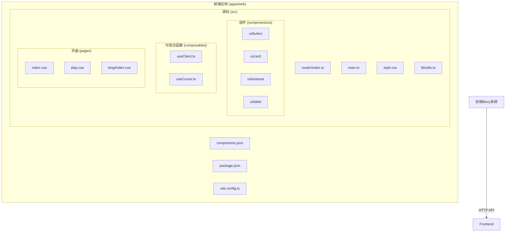
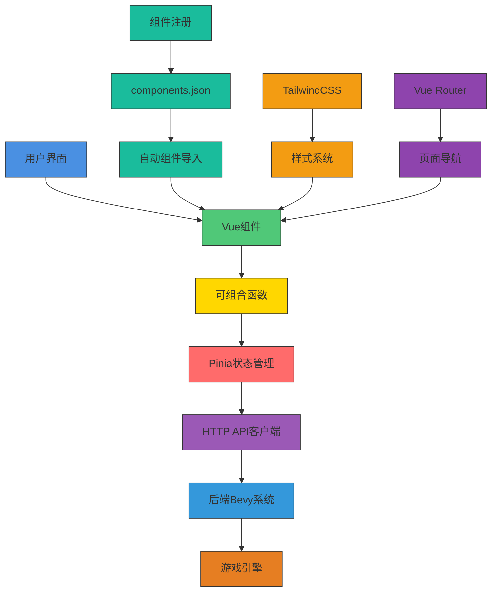
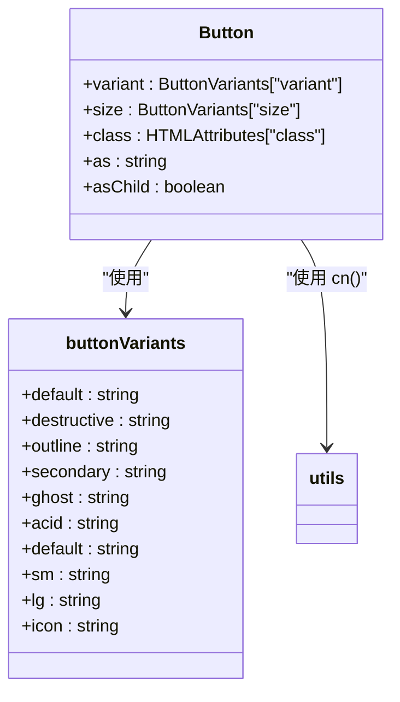
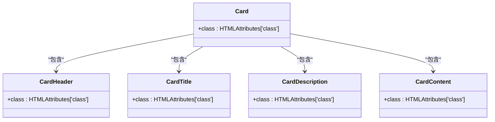
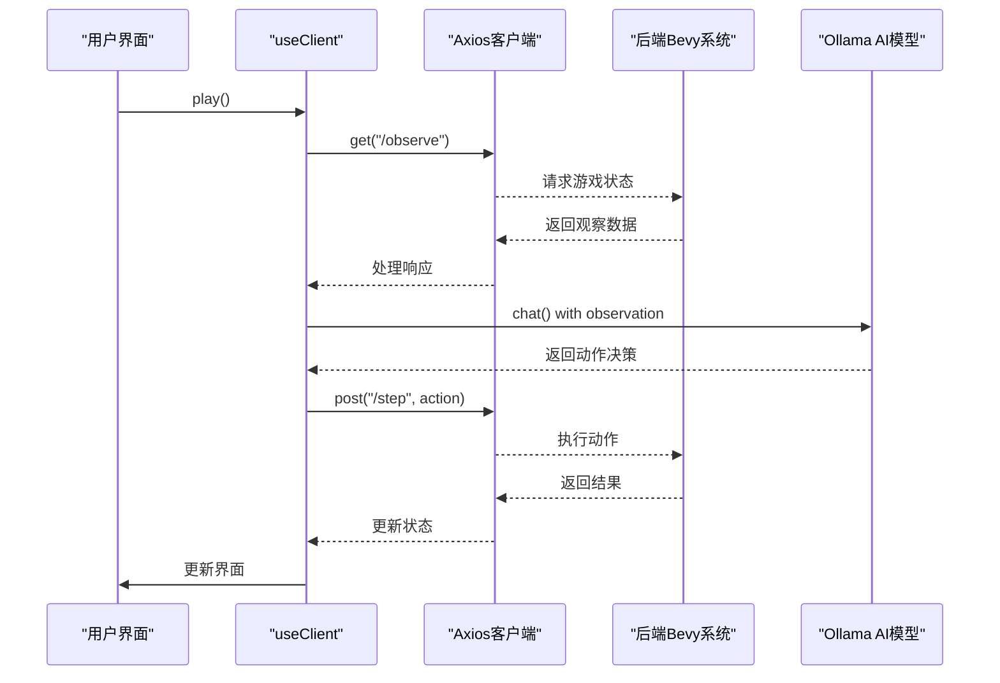
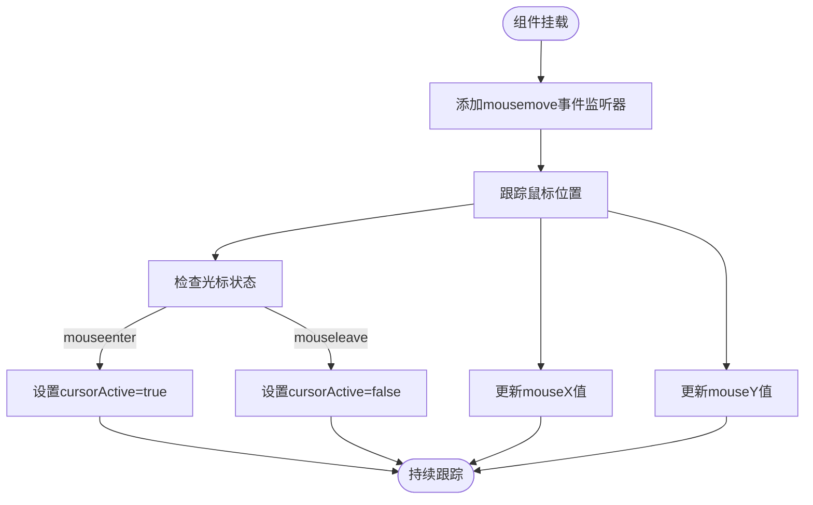
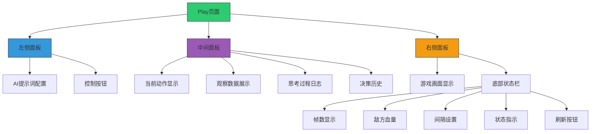
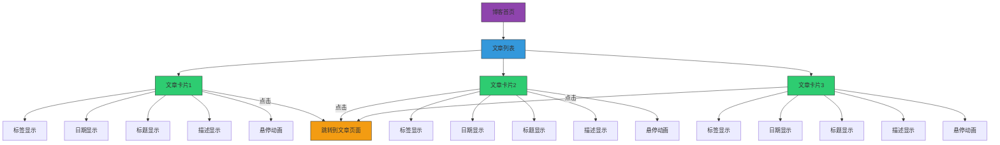

# 前端组件架构

<cite>
**本文档引用的文件**   
- [main.ts](file://apps/web/src/main.ts)
- [router/index.ts](file://apps/web/src/router/index.ts)
- [composables/useClient.ts](file://apps/web/src/composables/useClient.ts)
- [composables/useCursor.ts](file://apps/web/src/composables/useCursor.ts)
- [components.json](file://apps/web/components.json)
- [components/ui/button/Button.vue](file://apps/web/src/components/ui/button/Button.vue)
- [components/ui/button/index.ts](file://apps/web/src/components/ui/button/index.ts)
- [components/ui/card/Card.vue](file://apps/web/src/components/ui/card/Card.vue)
- [components/ui/card/index.ts](file://apps/web/src/components/ui/card/index.ts)
- [components/ui/textarea/index.ts](file://apps/web/src/components/ui/textarea/index.ts)
- [pages/play.vue](file://apps/web/src/pages/play.vue)
- [pages/blog/index.vue](file://apps/web/src/pages/blog/index.vue)
- [lib/utils.ts](file://apps/web/src/lib/utils.ts)
- [style.css](file://apps/web/src/style.css)
- [package.json](file://apps/web/package.json)
</cite>

## 目录
1. [项目结构](#项目结构)
2. [核心组件](#核心组件)
3. [架构概述](#架构概述)
4. [详细组件分析](#详细组件分析)
5. [依赖分析](#依赖分析)
6. [性能考虑](#性能考虑)
7. [故障排除指南](#故障排除指南)
8. [结论](#结论)

## 项目结构

moon-lol项目的前端架构采用模块化设计，位于`apps/web/`目录下，遵循Vue 3组合式API的最佳实践。项目结构清晰地分离了关注点，包含组件、可组合函数、页面、路由和样式等关键部分。UI组件被组织在`components/ui/`目录中，每个组件都有独立的子目录和`index.ts`导出文件，便于模块化导入。可组合函数存放在`composables/`目录中，用于实现逻辑复用。页面组件位于`pages/`目录，通过Vue Router进行路由管理。整体结构体现了高内聚、低耦合的设计原则，支持可维护性和可扩展性。

**Diagram sources**
- [components.json](file://apps/web/components.json#L1-L22)
- [package.json](file://apps/web/package.json#L1-L53)

**Section sources**
- [main.ts](file://apps/web/src/main.ts#L1-L17)
- [router/index.ts](file://apps/web/src/router/index.ts#L1-L14)

## 核心组件

前端架构的核心组件包括基于Vue 3组合式API的UI组件、状态管理机制和路由系统。UI组件如按钮、卡片等采用shadcn-vue模式构建，通过`components.json`配置文件进行注册和管理。状态管理通过Pinia实现，结合`useClient`可组合函数与后端Bevy系统进行数据交互。路由系统基于Vue Router 4，采用自动路由生成机制，支持基于文件系统的路由配置。TailwindCSS被深度集成用于样式构建，通过`style.css`文件定义了独特的酸性主题（acid theme）和自定义动画效果。

**Section sources**
- [composables/useClient.ts](file://apps/web/src/composables/useClient.ts#L1-L232)
- [composables/useCursor.ts](file://apps/web/src/composables/useCursor.ts#L1-L40)
- [style.css](file://apps/web/src/style.css#L1-L265)

## 架构概述

moon-lol前端架构采用分层设计模式，实现了前端组件与后端Bevy系统的解耦。架构的核心是Vue 3的组合式API，它允许开发者将逻辑组织为可复用的"可组合函数"（composables）。前端通过HTTP API与后端交互，使用Axios进行HTTP请求，实现了数据的观察（observe）、动作执行（step）和状态同步。UI组件通过清晰的props接口与可组合函数通信，实现了关注点分离。整个架构支持热更新和开发时的快速反馈，通过Vite构建工具实现了高效的开发体验。

**Diagram sources**
- [main.ts](file://apps/web/src/main.ts#L1-L17)
- [router/index.ts](file://apps/web/src/router/index.ts#L1-L14)
- [composables/useClient.ts](file://apps/web/src/composables/useClient.ts#L1-L232)

## 详细组件分析

### UI组件分析

#### 按钮组件分析
按钮组件（Button）是前端架构中的基础UI元素，采用shadcn-vue的设计模式。组件通过`cva`（class-variance-authority）库定义了多种变体（variants）和尺寸（sizes），支持默认、破坏性、轮廓、次要、幽灵和酸性等多种样式。组件使用`<script setup>`语法糖和TypeScript，确保了类型安全。通过`cn`工具函数合并TailwindCSS类名，实现了样式的灵活组合。组件的导出机制通过`index.ts`文件实现，遵循了模块化设计的最佳实践。

**Diagram sources**
- [components/ui/button/Button.vue](file://apps/web/src/components/ui/button/Button.vue#L1-L30)
- [components/ui/button/index.ts](file://apps/web/src/components/ui/button/index.ts#L1-L37)

#### 卡片组件分析
卡片组件（Card）是一组相关UI组件的集合，包括Card、CardHeader、CardTitle、CardDescription和CardContent。这种设计模式支持灵活的内容布局，同时保持了视觉一致性。主Card组件定义了基础的容器样式，包括圆角、边框、背景色和阴影效果。其他子组件则负责特定区域的布局和样式。这种组合式设计允许开发者根据需要自由组合卡片的各个部分，提高了组件的复用性和灵活性。

**Diagram sources**
- [components/ui/card/Card.vue](file://apps/web/src/components/ui/card/Card.vue#L1-L18)
- [components/ui/card/index.ts](file://apps/web/src/components/ui/card/index.ts#L1-L5)

### 可组合函数分析

#### useClient可组合函数分析
`useClient`是前端架构中的核心可组合函数，负责管理与后端Bevy系统的通信。该函数使用Pinia定义了一个名为`client`的状态存储，包含了游戏状态、AI决策、动作执行等关键数据。通过Axios与后端HTTP API进行交互，实现了观察（/observe）、步骤执行（/step）和渲染（/render）等操作。函数还集成了Ollama AI模型，用于生成游戏决策，体现了AI驱动的游戏玩法设计。

**Diagram sources**
- [composables/useClient.ts](file://apps/web/src/composables/useClient.ts#L1-L232)
- [pages/play.vue](file://apps/web/src/pages/play.vue#L1-L298)

#### useCursor可组合函数分析
`useCursor`可组合函数实现了鼠标光标位置的跟踪功能。该函数使用Vue的响应式API（ref）创建了`mouseX`、`mouseY`和`cursorActive`等响应式数据。通过监听`mousemove`、`mouseenter`和`mouseleave`事件，实时更新光标位置和状态。这种设计模式将光标逻辑封装为可复用的组合式函数，可以在多个组件中轻松使用，体现了组合式API的优势。

**Diagram sources**
- [composables/useCursor.ts](file://apps/web/src/composables/useCursor.ts#L1-L40)

### 页面组件分析

#### play页面分析
`play.vue`页面是前端应用的核心交互界面，展示了AI驱动的游戏玩法。页面采用三栏布局：左侧为AI配置和状态面板，中间为AI决策监控，右侧为游戏视图。页面通过`useClientStore`导入状态，实现了与后端系统的实时交互。UI组件如按钮、标签和文本区域被统一使用，确保了视觉一致性。页面还包含了自定义的CSS动画和滚动条样式，增强了用户体验。

**Diagram sources**
- [pages/play.vue](file://apps/web/src/pages/play.vue#L1-L298)

#### 博客页面分析
`blog/index.vue`页面展示了项目的技术文档和开发日志。页面采用响应式网格布局，适配不同屏幕尺寸。通过`useRouter`实现页面导航，点击文章卡片可跳转到相应博客页面。页面使用了自定义的字体和动画效果，如悬停时的平滑过渡和指示箭头动画，提升了交互体验。文章数据以静态数组形式定义，便于维护和扩展。

**Diagram sources**
- [pages/blog/index.vue](file://apps/web/src/pages/blog/index.vue#L1-L69)

**Section sources**
- [pages/play.vue](file://apps/web/src/pages/play.vue#L1-L298)
- [pages/blog/index.vue](file://apps/web/src/pages/blog/index.vue#L1-L69)

## 依赖分析

前端架构的依赖关系清晰地展示了各组件之间的交互。核心依赖包括Vue 3、Pinia、Vue Router和TailwindCSS等。通过`package.json`文件管理项目依赖，确保了依赖版本的一致性。`components.json`文件作为shadcn-vue的配置文件，定义了组件库的样式和别名，实现了组件的自动注册和导入。`vite.config.ts`配置了Vite构建工具，支持高效的开发服务器和生产构建。

```mermaid
graph TD
A[Vue 3] --> B[组合式API]
A --> C[响应式系统]
A --> D[组件系统]
E[Pinia] --> F[状态管理]
F --> G[useClient]
F --> H[持久化状态]
I[Vue Router] --> J[页面导航]
J --> K[自动路由]
L[TailwindCSS] --> M[实用优先样式]
M --> N[响应式设计]
M --> O[自定义主题]
P[shadcn-vue] --> Q[UI组件库]
Q --> R[按钮]
Q --> S[卡片]
Q --> T[标签]
U[Vite] --> V[开发服务器]
U --> W[生产构建]
U --> X[热更新]
style A fill:#41B883,stroke:#333
style E fill:#FF6B6B,stroke:#333
style I fill:#8E44AD,stroke:#333
style L fill:#38BDF8,stroke:#333
style P fill:#000000,stroke:#333
style U fill:#6C757D,stroke:#333
```

**Diagram sources**
- [package.json](file://apps/web/package.json#L1-L53)
- [components.json](file://apps/web/components.json#L1-L22)
- [vite.config.ts](file://apps/web/vite.config.ts)

**Section sources**
- [package.json](file://apps/web/package.json#L1-L53)
- [components.json](file://apps/web/components.json#L1-L22)

## 性能考虑

前端架构在性能方面进行了多方面的优化。首先，通过Vite构建工具实现了快速的冷启动和热模块替换，极大地提升了开发体验。其次，采用Tree-shaking和代码分割技术，确保生产构建的包体积最小化。状态管理通过Pinia的模块化设计，避免了不必要的状态更新。UI组件的设计考虑了渲染性能，避免了深层嵌套和复杂的响应式依赖。HTTP请求通过合理的缓存策略和错误处理机制，确保了与后端交互的稳定性和效率。

## 故障排除指南

当遇到前端架构相关问题时，可以参考以下常见问题的解决方案：

1. **组件未正确注册**：检查`components.json`文件的配置是否正确，确保组件路径和别名设置无误。
2. **样式未生效**：确认`style.css`文件已正确导入，检查TailwindCSS类名是否拼写正确。
3. **路由无法访问**：验证页面文件是否位于`pages/`目录下，检查文件命名是否符合Vue Router的约定。
4. **状态更新异常**：检查Pinia store的定义是否正确，确保在组件中正确使用`useStore`。
5. **HTTP请求失败**：确认后端服务正在运行，检查`.env.development`文件中的API基础URL配置。

**Section sources**
- [main.ts](file://apps/web/src/main.ts#L1-L17)
- [style.css](file://apps/web/src/style.css#L1-L265)
- [.env.development](file://apps/web/.env.development)

## 结论

moon-lol前端组件架构展示了现代Vue 3应用的最佳实践。通过组合式API、Pinia状态管理、Vue Router和TailwindCSS的深度集成，构建了一个可维护、可扩展且用户体验优秀的前端系统。架构设计充分考虑了与后端Bevy系统的解耦，通过清晰的HTTP API进行数据交互。组件化设计和可组合函数的使用，提高了代码的复用性和可测试性。整体架构在可维护性、响应式设计和开发者体验方面都表现出色，为项目的持续发展奠定了坚实的基础。