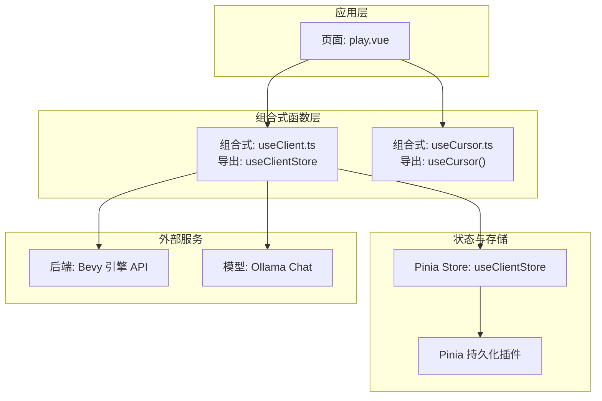
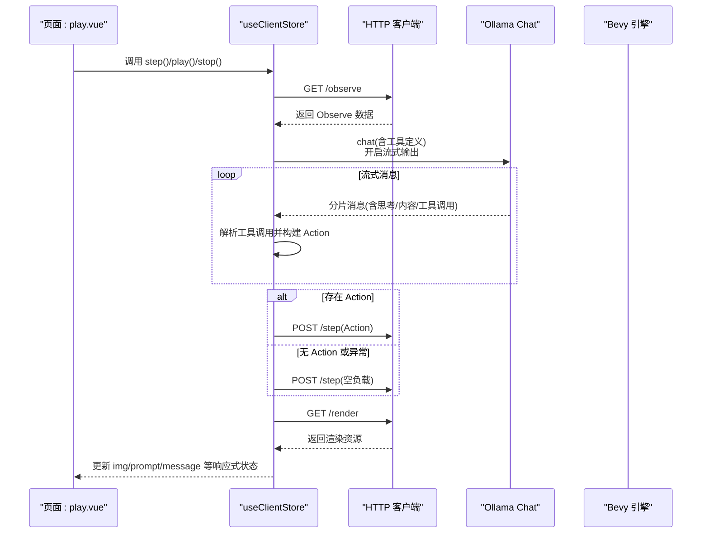
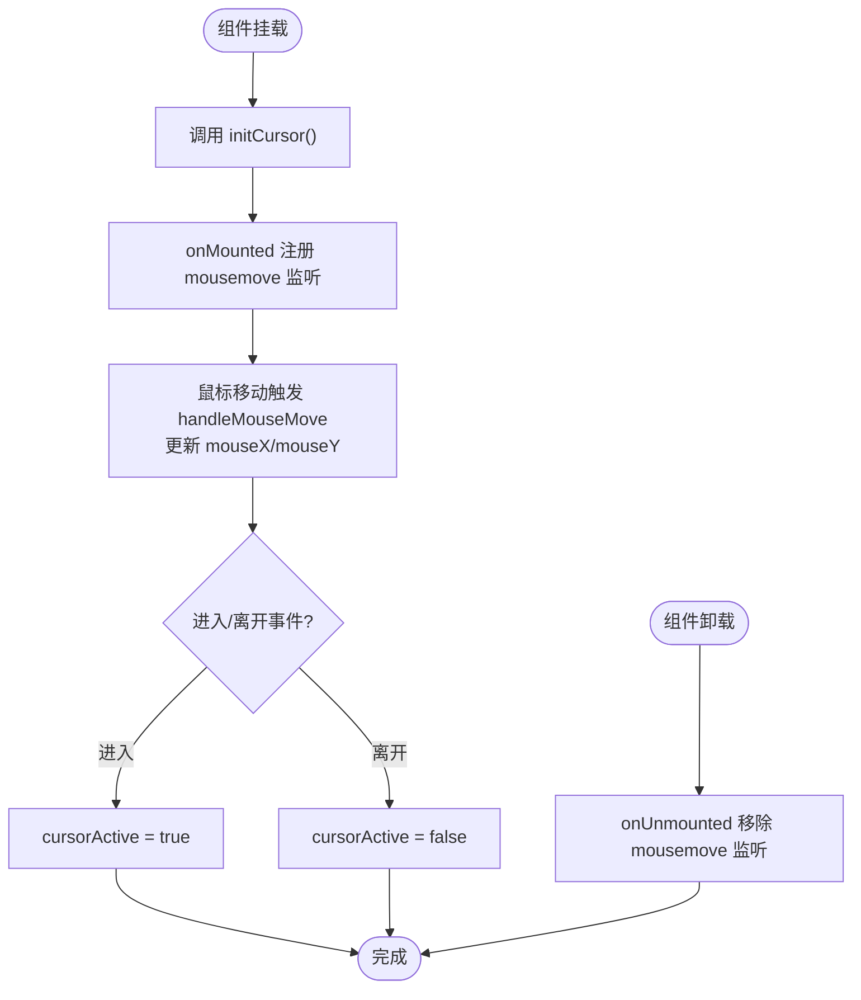
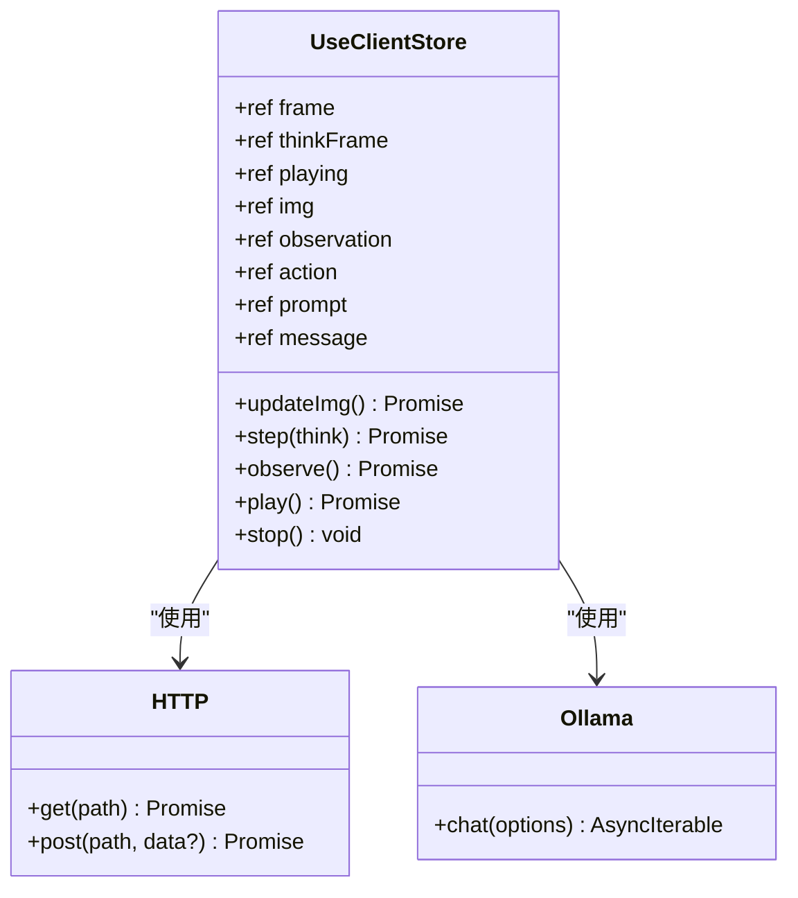
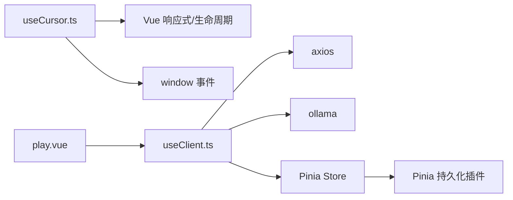

# 组合式函数（Composables）

<cite>
**本文引用的文件**
- [useClient.ts](file://apps/web/src/composables/useClient.ts)
- [useCursor.ts](file://apps/web/src/composables/useCursor.ts)
- [play.vue](file://apps/web/src/pages/play.vue)
- [main.ts](file://apps/web/src/main.ts)
</cite>

## 目录
1. [简介](#简介)
2. [项目结构](#项目结构)
3. [核心组件](#核心组件)
4. [架构总览](#架构总览)
5. [详细组件分析](#详细组件分析)
6. [依赖关系分析](#依赖关系分析)
7. [性能考量](#性能考量)
8. [故障排查指南](#故障排查指南)
9. [结论](#结论)
10. [附录](#附录)

## 简介
本文件聚焦 moon-lol 项目中的两个核心组合式函数（Composables）：useClient.ts 与 useCursor.ts。前者封装了与后端 Bevy 引擎交互的 HTTP 通信逻辑，负责观测游戏状态、生成智能决策并通过工具函数驱动游戏步进；后者提供全局鼠标位置与激活状态的响应式追踪，基于 onMounted/onUnmounted 生命周期安全地注册与移除 DOM 事件。本文将从系统架构、数据流、处理逻辑、集成点与错误处理等方面进行深入解析，并给出在组件中安全调用这些 Composables 的最佳实践。

## 项目结构
- 组合式函数位于 apps/web/src/composables 目录，分别提供 useClient.ts 与 useCursor.ts。
- 页面 play.vue 使用 useClientStore 并展示 AI 思维、观察数据、决策日志与实时渲染等界面。
- main.ts 初始化 Pinia 并启用持久化插件，为 useClientStore 的持久化提供基础。

图表来源
- [play.vue](file://apps/web/src/pages/play.vue#L228-L235)
- [useClient.ts](file://apps/web/src/composables/useClient.ts#L107-L231)
- [main.ts](file://apps/web/src/main.ts#L1-L17)

章节来源
- [play.vue](file://apps/web/src/pages/play.vue#L228-L235)
- [useClient.ts](file://apps/web/src/composables/useClient.ts#L107-L231)
- [main.ts](file://apps/web/src/main.ts#L1-L17)

## 核心组件
- useClientStore（来自 useClient.ts）：定义并暴露一组响应式状态与方法，用于与后端交互、驱动 AI 决策与渲染更新。
- useCursor（来自 useCursor.ts）：提供全局鼠标位置与激活状态的响应式变量，并在组件挂载/卸载阶段安全地绑定/解绑事件。

章节来源
- [useClient.ts](file://apps/web/src/composables/useClient.ts#L107-L231)
- [useCursor.ts](file://apps/web/src/composables/useCursor.ts#L1-L39)

## 架构总览
useClient.ts 通过 axios 创建 HTTP 客户端，结合 Ollama 的流式对话能力，将后端返回的观测数据转换为可执行的动作，再通过 /step 推送至后端。同时，它维护帧计数、思考间隔、播放状态与图像缓存等状态，供页面实时展示。useCursor.ts 则在全局范围内追踪鼠标位置与激活状态，确保在组件生命周期内正确注册与移除事件监听器。

图表来源
- [useClient.ts](file://apps/web/src/composables/useClient.ts#L62-L105)
- [useClient.ts](file://apps/web/src/composables/useClient.ts#L157-L204)
- [useClient.ts](file://apps/web/src/composables/useClient.ts#L152-L155)

## 详细组件分析

### useCursor.ts：全局鼠标轨迹追踪
- 响应式变量
  - mouseX、mouseY：记录当前鼠标屏幕坐标。
  - cursorActive：指示光标是否处于激活状态（进入容器区域）。
- 事件绑定与生命周期
  - 在 onMounted 中注册 window 的 mousemove 事件，更新坐标。
  - 在 onUnmounted 中移除 mousemove 事件，避免内存泄漏与重复监听。
  - 提供 handleMouseEnter/handleMouseLeave 以切换 cursorActive。
  - 提供 initCursor 方法，内部封装 onMounted/onUnmounted 的事件注册/移除逻辑，便于按需初始化。
- 使用建议
  - 在需要全局鼠标位置或激活状态的组件中调用 useCursor()，并在组件卸载时确保事件被清理。
  - 若仅需局部区域的鼠标事件，可在具体元素上直接绑定事件，避免不必要的全局监听。

图表来源
- [useCursor.ts](file://apps/web/src/composables/useCursor.ts#L1-L39)

章节来源
- [useCursor.ts](file://apps/web/src/composables/useCursor.ts#L1-L39)

### useClient.ts：与后端 Bevy 引擎的 HTTP 通信与 AI 驱动
- 外部依赖与环境
  - axios：创建带 baseURL 的 HTTP 客户端。
  - ollama：流式对话与工具调用解析。
  - defineStore：Pinia Store 定义。
  - import.meta.env.VITE_BASE_URL：后端服务地址。
- 类型与工具
  - Entity、Vec2、Action、Observe：定义游戏状态与动作的数据结构。
  - tools：声明可用的工具函数（Attack、Move、Nothing），用于指导模型输出符合规范的动作。
- 关键方法与流程
  - getObservation：GET /observe 获取当前游戏观测数据。
  - getAction：通过 Ollama chat 发起流式对话，解析分片消息中的工具调用，构造 Action。
  - updateImg：GET /render 并附加时间戳参数以绕过浏览器缓存，更新 img 响应式状态。
  - step：按 think 参数决定是否进行思考（获取观测、生成动作、推送 /step），否则直接 /step。
  - play/_play/stop：循环调度，按 thinkFrame 间隔触发 step，维护 frame 计数与 playing 状态。
  - observe：调试用途，打印观测数据。
- 状态与持久化
  - 响应式状态：frame、thinkFrame、playing、img、observation、action、prompt、message。
  - 持久化：通过 Pinia 持久化插件，仅持久化 prompt 字段，便于用户自定义提示词。

图表来源
- [useClient.ts](file://apps/web/src/composables/useClient.ts#L107-L231)
- [useClient.ts](file://apps/web/src/composables/useClient.ts#L62-L105)
- [useClient.ts](file://apps/web/src/composables/useClient.ts#L152-L204)

章节来源
- [useClient.ts](file://apps/web/src/composables/useClient.ts#L1-L231)

## 依赖关系分析
- useClient.ts
  - 依赖 axios、ollama、pinia（defineStore）、环境变量 import.meta.env.VITE_BASE_URL。
  - 与后端 API 约定：/observe、/step、/render。
  - 与 Pinia 持久化插件协作，持久化 prompt。
- useCursor.ts
  - 依赖 Vue 响应式与生命周期钩子（ref、onMounted、onUnmounted）。
  - 依赖 window 全局事件对象。
- 页面 play.vue
  - 通过 useClientStore() 获取 store 实例，绑定按钮与状态显示，驱动 AI 执行与图像刷新。

图表来源
- [useCursor.ts](file://apps/web/src/composables/useCursor.ts#L1-L39)
- [useClient.ts](file://apps/web/src/composables/useClient.ts#L1-L231)
- [play.vue](file://apps/web/src/pages/play.vue#L228-L235)
- [main.ts](file://apps/web/src/main.ts#L1-L17)

章节来源
- [useCursor.ts](file://apps/web/src/composables/useCursor.ts#L1-L39)
- [useClient.ts](file://apps/web/src/composables/useClient.ts#L1-L231)
- [play.vue](file://apps/web/src/pages/play.vue#L228-L235)
- [main.ts](file://apps/web/src/main.ts#L1-L17)

## 性能考量
- useClientStore
  - 流式对话（Ollama chat）会产生持续的消息分片，注意在 UI 层合理截断或节流文本拼接，避免频繁重渲染。
  - /render 图像更新添加时间戳参数以绕过缓存，但频繁刷新会增加网络与渲染压力，建议在需要时手动触发。
  - thinkFrame 控制思考频率，可根据实际帧率与推理耗时调整，平衡“思考”与“执行”的节奏。
- useCursor
  - mousemove 事件在全局窗口注册，事件回调中仅更新少量响应式变量，开销较低；但仍建议在不需要时移除监听，避免潜在性能问题。

[本节为通用性能建议，不直接分析具体文件]

## 故障排查指南
- useClientStore
  - 错误处理：当生成动作失败或网络异常时，step 会回退为发送空动作的 /step 请求，保证系统继续推进。
  - 观测数据为空：检查 /observe 是否可达，确认后端服务状态与 CORS 配置。
  - 模型调用失败：检查 Ollama 服务连通性与模型名称一致性。
  - 图像不更新：确认 /render 可访问，并检查时间戳参数是否生效。
- useCursor
  - 事件未移除：若组件卸载后仍出现异常行为，检查是否调用了 initCursor 并确保 onUnmounted 生效。
  - 光标状态异常：确认 handleMouseEnter/handleMouseLeave 的触发条件与容器区域一致。

章节来源
- [useClient.ts](file://apps/web/src/composables/useClient.ts#L170-L184)
- [useCursor.ts](file://apps/web/src/composables/useCursor.ts#L21-L29)

## 结论
- useCursor.ts 提供轻量级、跨组件复用的全局鼠标追踪能力，通过生命周期钩子确保事件安全绑定与释放。
- useClient.ts 将后端观测、模型推理与动作执行串联为闭环，配合 Pinia 持久化与响应式状态，为页面提供了可视化的 AI 驱动体验。
- 在组件中使用时，建议遵循生命周期管理、错误兜底与状态节流的最佳实践，以获得稳定与高性能的用户体验。

[本节为总结性内容，不直接分析具体文件]

## 附录

### 在组件中安全调用最佳实践
- useClientStore
  - 在页面 mounted 后再触发 play()，避免在 SSR 或首屏渲染期间发起网络请求。
  - 对 message 进行节流拼接，避免高频重渲染。
  - 使用 thinkFrame 与 playing 状态控制 AI 推理频率，防止过度占用资源。
  - 对 /observe 与 /step 的错误进行统一捕获与回退处理。
- useCursor
  - 在组件挂载时调用 initCursor，确保 onMounted/onUnmounted 成对出现。
  - 仅在需要时启用全局 mousemove 监听，避免影响页面性能。
  - 对 cursorActive 的使用应与容器区域的 enter/leave 事件保持一致，避免误判。

章节来源
- [useClient.ts](file://apps/web/src/composables/useClient.ts#L157-L204)
- [useCursor.ts](file://apps/web/src/composables/useCursor.ts#L21-L29)
- [play.vue](file://apps/web/src/pages/play.vue#L228-L235)