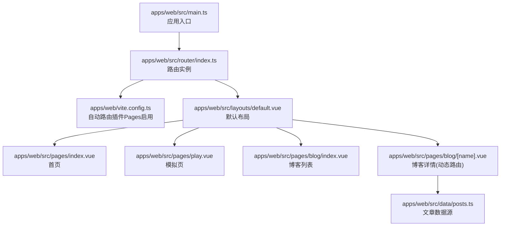
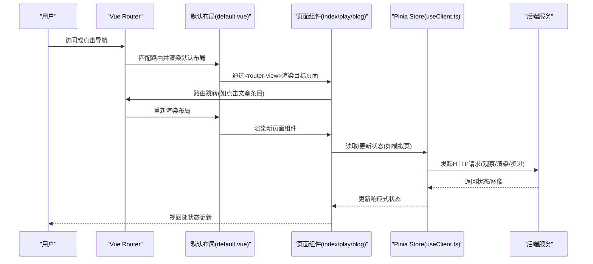
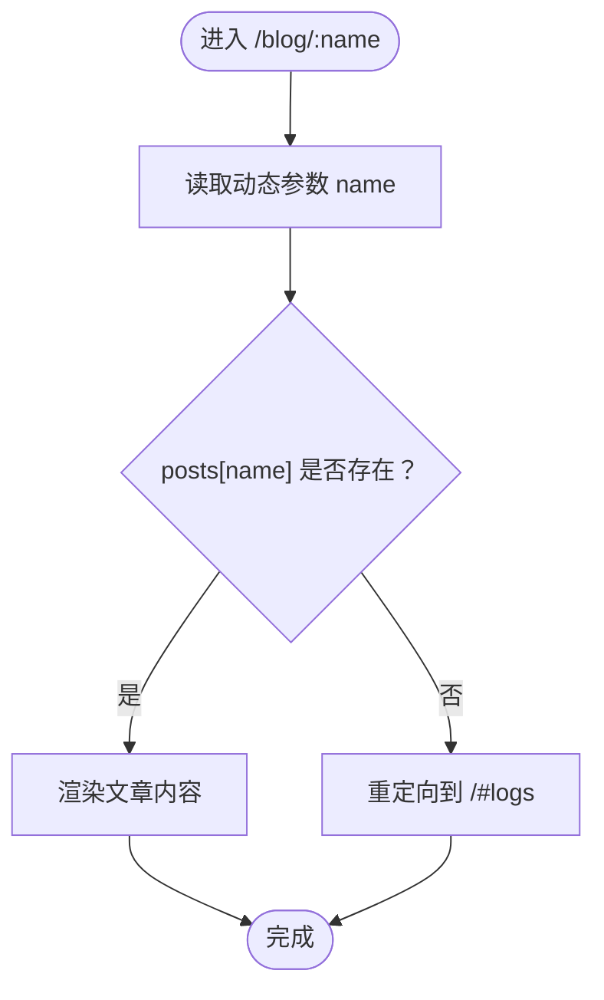
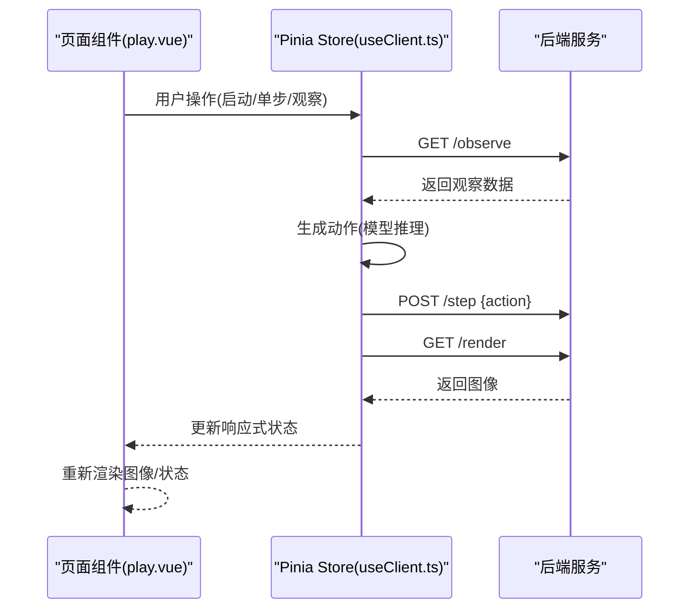
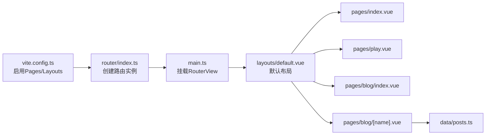

# 路由与导航

<cite>
**本文引用的文件**
- [apps/web/src/router/index.ts](file://apps/web/src/router/index.ts)
- [apps/web/vite.config.ts](file://apps/web/vite.config.ts)
- [apps/web/src/main.ts](file://apps/web/src/main.ts)
- [apps/web/src/layouts/default.vue](file://apps/web/src/layouts/default.vue)
- [apps/web/src/pages/index.vue](file://apps/web/src/pages/index.vue)
- [apps/web/src/pages/play.vue](file://apps/web/src/pages/play.vue)
- [apps/web/src/pages/blog/index.vue](file://apps/web/src/pages/blog/index.vue)
- [apps/web/src/pages/blog/[name].vue](file://apps/web/src/pages/blog/[name].vue)
- [apps/web/src/data/posts.ts](file://apps/web/src/data/posts.ts)
- [apps/web/src/composables/useClient.ts](file://apps/web/src/composables/useClient.ts)
</cite>

## 目录
1. [简介](#简介)
2. [项目结构](#项目结构)
3. [核心组件](#核心组件)
4. [架构总览](#架构总览)
5. [详细组件分析](#详细组件分析)
6. [依赖分析](#依赖分析)
7. [性能考虑](#性能考虑)
8. [故障排查指南](#故障排查指南)
9. [结论](#结论)

## 简介
本文件聚焦 moon-lol 前端的路由系统，围绕基于 Vue Router 的自动路由配置展开，系统性说明：
- 路由表结构与懒加载策略
- 页面组件与路由映射关系（index.vue、play.vue、blog 下的静态与动态路由）
- 动态路由参数解析机制（[name].vue）
- 导航历史管理与 URL 查询参数处理
- 路由变化如何触发后端资源加载与状态更新，实现前后端状态同步

## 项目结构
moon-lol 前端采用 Vite + Vue 3 + Vue Router 自动路由插件的组合，通过 unplugin-vue-router 自动生成路由表，并结合 vite-plugin-vue-layouts 为页面自动装配默认布局。应用入口在 main.ts 中挂载 RouterView 并注册 router 与 Pinia。

图表来源
- [apps/web/src/main.ts](file://apps/web/src/main.ts#L1-L17)
- [apps/web/src/router/index.ts](file://apps/web/src/router/index.ts#L1-L14)
- [apps/web/vite.config.ts](file://apps/web/vite.config.ts#L1-L37)
- [apps/web/src/layouts/default.vue](file://apps/web/src/layouts/default.vue#L1-L187)
- [apps/web/src/pages/index.vue](file://apps/web/src/pages/index.vue#L1-L428)
- [apps/web/src/pages/play.vue](file://apps/web/src/pages/play.vue#L1-L298)
- [apps/web/src/pages/blog/index.vue](file://apps/web/src/pages/blog/index.vue#L1-L69)
- [apps/web/src/pages/blog/[name].vue](file://apps/web/src/pages/blog/[name].vue#L1-L78)
- [apps/web/src/data/posts.ts](file://apps/web/src/data/posts.ts#L1-L153)

章节来源
- [apps/web/src/main.ts](file://apps/web/src/main.ts#L1-L17)
- [apps/web/src/router/index.ts](file://apps/web/src/router/index.ts#L1-L14)
- [apps/web/vite.config.ts](file://apps/web/vite.config.ts#L1-L37)

## 核心组件
- 路由实例与自动路由
  - 使用 createRouter 与 createWebHistory 创建路由实例，通过 vue-router/auto-routes 导入 routes，并用 virtual:generated-layouts 的 setupLayouts 为路由表装配默认布局。
  - 启用热更新支持，开发环境下监听模块热替换并更新路由。
- 默认布局
  - default.vue 提供统一头部、导航、页脚与主内容区，主内容区通过 <router-view /> 渲染当前匹配的页面组件。
- 页面组件
  - index.vue：首页，包含导航点击跳转至博客文章的交互。
  - play.vue：模拟页，通过 Pinia Store 与后端交互，实现“观察-思考-执行-渲染”的闭环。
  - blog/index.vue：博客列表页，点击条目跳转到动态路由。
  - blog/[name].vue：博客详情页，解析动态路由参数并从数据源加载对应文章。
- 文章数据源
  - posts.ts 定义文章字典，键名为动态路由参数 name 对应的标识符。

章节来源
- [apps/web/src/router/index.ts](file://apps/web/src/router/index.ts#L1-L14)
- [apps/web/src/layouts/default.vue](file://apps/web/src/layouts/default.vue#L1-L187)
- [apps/web/src/pages/index.vue](file://apps/web/src/pages/index.vue#L1-L428)
- [apps/web/src/pages/play.vue](file://apps/web/src/pages/play.vue#L1-L298)
- [apps/web/src/pages/blog/index.vue](file://apps/web/src/pages/blog/index.vue#L1-L69)
- [apps/web/src/pages/blog/[name].vue](file://apps/web/src/pages/blog/[name].vue#L1-L78)
- [apps/web/src/data/posts.ts](file://apps/web/src/data/posts.ts#L1-L153)

## 架构总览
路由系统与页面组件、状态管理、后端接口之间的交互如下：

图表来源
- [apps/web/src/layouts/default.vue](file://apps/web/src/layouts/default.vue#L1-L187)
- [apps/web/src/pages/index.vue](file://apps/web/src/pages/index.vue#L1-L428)
- [apps/web/src/pages/play.vue](file://apps/web/src/pages/play.vue#L1-L298)
- [apps/web/src/composables/useClient.ts](file://apps/web/src/composables/useClient.ts#L1-L232)

## 详细组件分析

### 路由表与懒加载策略
- 自动路由
  - 通过 unplugin-vue-router 的 Pages 插件在构建时扫描 pages 目录，自动生成路由表 routes，并在运行时由 vue-router/auto-routes 导入。
  - 路由表经由 virtual:generated-layouts 的 setupLayouts 装配默认布局，无需手动在路由配置中重复声明 layout。
- 历史模式
  - 使用 createWebHistory，支持标准 URL 路径与浏览器前进后退。
- 热更新
  - 开发环境下监听 import.meta.hot，调用 handleHotUpdate(router) 实现路由热替换，提升开发体验。
- 懒加载
  - 自动路由生成的页面组件默认按需加载；若需要更细粒度的懒加载，可在页面组件内部使用动态 import 或在路由元信息中配置懒加载策略（本项目未显式配置，遵循自动路由默认行为）。

章节来源
- [apps/web/src/router/index.ts](file://apps/web/src/router/index.ts#L1-L14)
- [apps/web/vite.config.ts](file://apps/web/vite.config.ts#L1-L37)

### 页面与路由映射
- 首页
  - 路由路径：根路径 "/"
  - 组件：index.vue
  - 行为：提供导航点击，点击文章条目通过 router.push 跳转到博客详情页。
- 模拟页
  - 路由路径："/play"
  - 组件：play.vue
  - 行为：通过 Pinia Store 与后端交互，实现“观察-思考-执行-渲染”闭环。
- 博客列表
  - 路由路径："/blog"
  - 组件：blog/index.vue
  - 行为：展示文章列表，点击条目跳转到动态路由。
- 博客详情（动态路由）
  - 路由路径："/blog/:name"
  - 组件：blog/[name].vue
  - 参数：动态参数 name
  - 行为：解析参数，从 posts 数据源加载对应文章；若不存在则回退到首页锚点。

章节来源
- [apps/web/src/pages/index.vue](file://apps/web/src/pages/index.vue#L1-L428)
- [apps/web/src/pages/play.vue](file://apps/web/src/pages/play.vue#L1-L298)
- [apps/web/src/pages/blog/index.vue](file://apps/web/src/pages/blog/index.vue#L1-L69)
- [apps/web/src/pages/blog/[name].vue](file://apps/web/src/pages/blog/[name].vue#L1-L78)
- [apps/web/src/data/posts.ts](file://apps/web/src/data/posts.ts#L1-L153)

### 动态路由参数解析与回退
- 参数解析
  - 在 [name].vue 中通过 useRoute 获取 params，将动态参数 name 转换为字符串后作为键访问 posts 数据源。
- 回退策略
  - 若 posts[name] 不存在，则通过 useRouter.push 将用户重定向到首页锚点，避免 404 或空白页面。
- URL 查询参数
  - 本项目未在动态路由中使用查询参数；若后续需要，可在路由守卫或组件中通过 useRoute.query 读取并处理。

图表来源
- [apps/web/src/pages/blog/[name].vue](file://apps/web/src/pages/blog/[name].vue#L1-L78)
- [apps/web/src/data/posts.ts](file://apps/web/src/data/posts.ts#L1-L153)

章节来源
- [apps/web/src/pages/blog/[name].vue](file://apps/web/src/pages/blog/[name].vue#L1-L78)
- [apps/web/src/data/posts.ts](file://apps/web/src/data/posts.ts#L1-L153)

### 导航历史管理与 URL 查询参数
- 历史管理
  - 使用 createWebHistory，浏览器前进/后退按钮可正常工作；页面组件通过 router.push 或 <router-link> 触发导航。
- 查询参数
  - 本项目未显式使用路由查询参数；若需要，可在组件中通过 useRoute.query 读取，或在路由守卫中处理。

章节来源
- [apps/web/src/router/index.ts](file://apps/web/src/router/index.ts#L1-L14)
- [apps/web/src/pages/index.vue](file://apps/web/src/pages/index.vue#L1-L428)
- [apps/web/src/pages/blog/index.vue](file://apps/web/src/pages/blog/index.vue#L1-L69)

### 路由守卫
- 权限控制
  - 本项目未实现全局或局部路由守卫；如需权限校验，可在路由元信息中添加字段并在导航守卫中检查。
- 导航拦截
  - 可在路由守卫中对特定路径进行拦截或重定向，例如未登录用户禁止访问 /play。

章节来源
- [apps/web/src/router/index.ts](file://apps/web/src/router/index.ts#L1-L14)

### 前后端状态同步与资源加载
- 观察-思考-执行-渲染闭环
  - 模拟页通过 Pinia Store 与后端交互：先请求观察数据，再基于模型生成动作，最后提交动作并刷新渲染图像。
  - 图像刷新通过向后端发起渲染请求，并在 URL 上附加时间戳参数以绕过缓存。
- 路由变化对状态的影响
  - 路由切换本身不直接触发后端请求；但页面组件在挂载或交互时主动发起请求，从而实现状态更新与资源加载。
  - 例如：点击文章条目后，[name].vue 读取参数并渲染文章；模拟页在用户操作时主动拉取状态并刷新图像。

图表来源
- [apps/web/src/pages/play.vue](file://apps/web/src/pages/play.vue#L1-L298)
- [apps/web/src/composables/useClient.ts](file://apps/web/src/composables/useClient.ts#L1-L232)

章节来源
- [apps/web/src/pages/play.vue](file://apps/web/src/pages/play.vue#L1-L298)
- [apps/web/src/composables/useClient.ts](file://apps/web/src/composables/useClient.ts#L1-L232)

## 依赖分析
- 自动路由与布局
  - vite.config.ts 启用 Pages 与 Layouts 插件，使路由表与布局自动装配成为可能。
- 路由实例
  - router/index.ts 仅负责创建路由实例与热更新，不包含业务路由配置，降低耦合度。
- 入口与挂载
  - main.ts 仅挂载 RouterView 并注册 router 与 Pinia，职责单一，便于维护。

图表来源
- [apps/web/vite.config.ts](file://apps/web/vite.config.ts#L1-L37)
- [apps/web/src/router/index.ts](file://apps/web/src/router/index.ts#L1-L14)
- [apps/web/src/main.ts](file://apps/web/src/main.ts#L1-L17)
- [apps/web/src/layouts/default.vue](file://apps/web/src/layouts/default.vue#L1-L187)
- [apps/web/src/pages/blog/[name].vue](file://apps/web/src/pages/blog/[name].vue#L1-L78)
- [apps/web/src/data/posts.ts](file://apps/web/src/data/posts.ts#L1-L153)

章节来源
- [apps/web/vite.config.ts](file://apps/web/vite.config.ts#L1-L37)
- [apps/web/src/router/index.ts](file://apps/web/src/router/index.ts#L1-L14)
- [apps/web/src/main.ts](file://apps/web/src/main.ts#L1-L17)

## 性能考虑
- 自动路由按需加载
  - 自动路由生成的页面组件默认按需加载，减少首屏体积，提升加载速度。
- 布局装配
  - 通过虚拟模块 setupLayouts 装配默认布局，避免重复声明 layout，降低配置成本。
- 图像缓存绕过
  - 模拟页在刷新图像时附加时间戳参数，避免浏览器缓存导致图像不更新。
- 状态持久化
  - Pinia 使用持久化插件保存部分状态，减少用户重复设置的成本。

章节来源
- [apps/web/src/router/index.ts](file://apps/web/src/router/index.ts#L1-L14)
- [apps/web/src/pages/play.vue](file://apps/web/src/pages/play.vue#L1-L298)
- [apps/web/src/composables/useClient.ts](file://apps/web/src/composables/useClient.ts#L1-L232)

## 故障排查指南
- 动态路由 404
  - 症状：访问 /blog/xxx 无内容或空白。
  - 排查：确认 posts.ts 中是否存在对应的键名；确认 [name].vue 中参数解析逻辑正确；确认路由已生成。
- 图像不更新
  - 症状：点击刷新后图像仍为旧图。
  - 排查：确认 /render 接口可用；确认时间戳参数附加成功；确认后端渲染接口返回最新图像。
- 导航异常
  - 症状：点击导航无效或历史记录异常。
  - 排查：确认使用 createWebHistory；确认未在组件中误用 hash 模式；检查 <router-link> 与 router.push 的使用是否正确。
- 权限控制缺失
  - 症状：未登录用户可访问受保护页面。
  - 排查：在路由元信息中添加权限字段，并在导航守卫中进行校验与重定向。

章节来源
- [apps/web/src/pages/blog/[name].vue](file://apps/web/src/pages/blog/[name].vue#L1-L78)
- [apps/web/src/data/posts.ts](file://apps/web/src/data/posts.ts#L1-L153)
- [apps/web/src/pages/play.vue](file://apps/web/src/pages/play.vue#L1-L298)
- [apps/web/src/router/index.ts](file://apps/web/src/router/index.ts#L1-L14)

## 结论
moon-lol 的前端路由系统以 Vue Router 自动路由为核心，配合默认布局与简洁的页面组件，实现了清晰的路由映射与良好的开发体验。动态路由参数解析与回退策略保证了用户体验的连续性；页面组件通过 Pinia Store 与后端交互，形成稳定的“观察-思考-执行-渲染”闭环，实现前后端状态同步。未来可在路由元信息中扩展权限控制，并按需引入查询参数处理与更精细的懒加载策略，进一步完善路由体系。