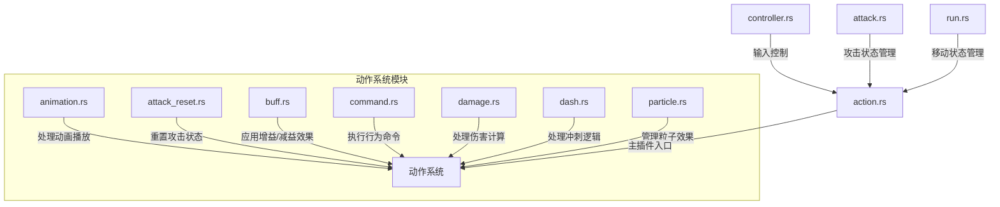
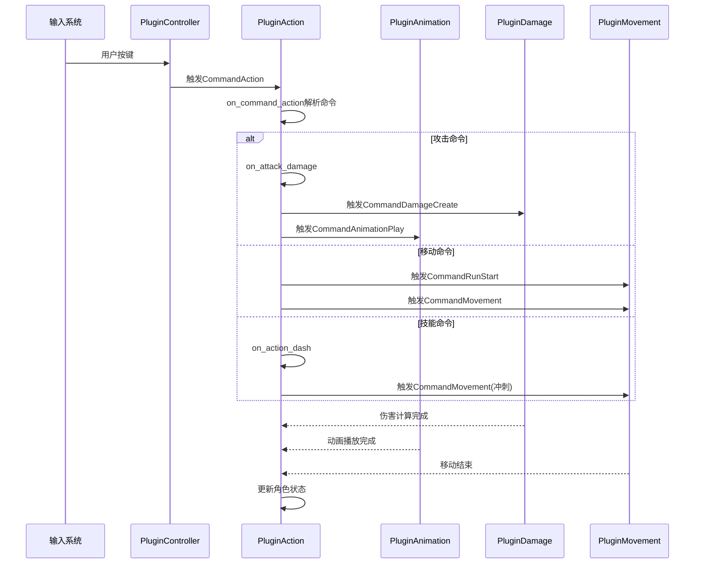
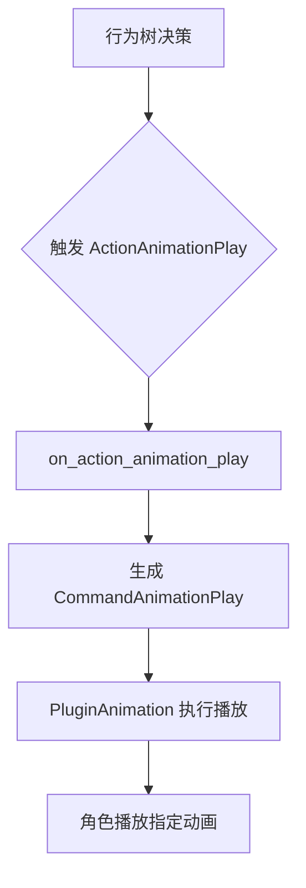
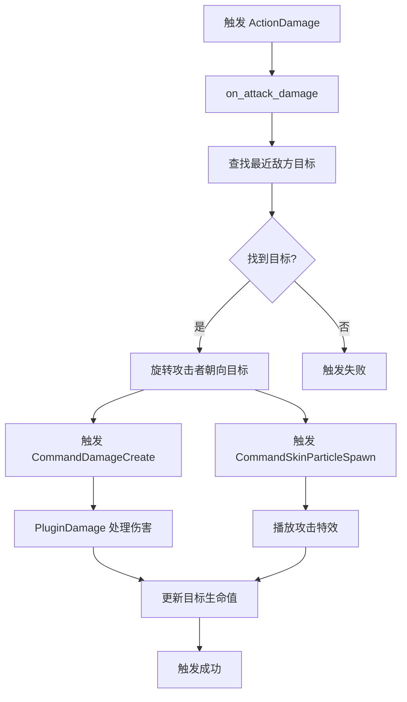
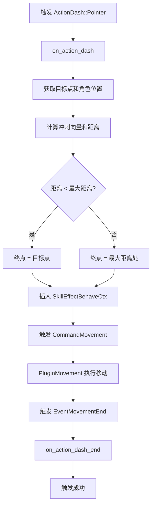
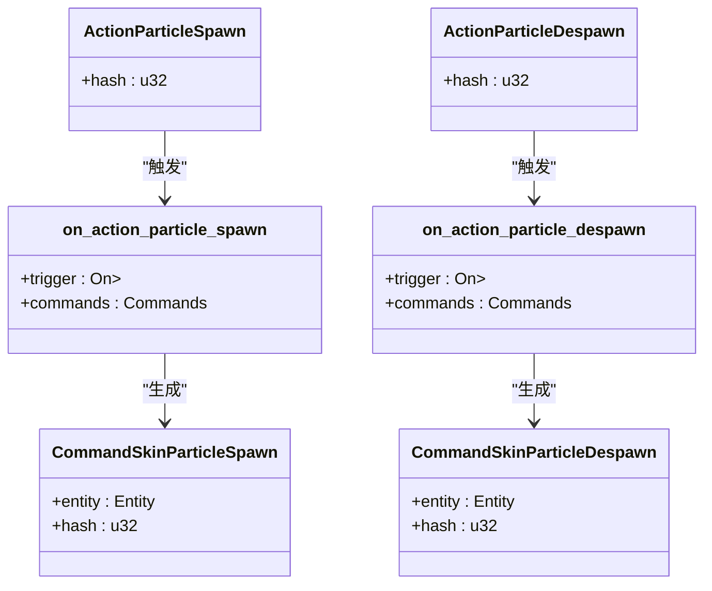

# 动作系统插件

<cite>
**本文档中引用的文件**  
- [action.rs](file://src/core/action.rs)
- [command.rs](file://src/core/action/command.rs)
- [animation.rs](file://src/core/action/animation.rs)
- [damage.rs](file://src/core/action/damage.rs)
- [buff.rs](file://src/core/action/buff.rs)
- [attack_reset.rs](file://src/core/action/attack_reset.rs)
- [dash.rs](file://src/core/action/dash.rs)
- [particle.rs](file://src/core/action/particle.rs)
- [controller.rs](file://src/core/controller.rs)
- [attack.rs](file://src/core/attack.rs)
- [run.rs](file://src/core/run.rs)
- [base/state.rs](file://src/core/base/state.rs)
- [lib.rs](file://src/lib.rs)
- [core.rs](file://src/core.rs)
</cite>

## 目录
1. [简介](#简介)
2. [项目结构](#项目结构)
3. [核心组件](#核心组件)
4. [架构概述](#架构概述)
5. [详细组件分析](#详细组件分析)
6. [依赖分析](#依赖分析)
7. [性能考虑](#性能考虑)
8. [故障排除指南](#故障排除指南)
9. [结论](#结论)

## 简介
本文件深入解析了 `PluginAction` 插件在 `moon-lol` 项目中的实现机制。该插件基于 Bevy ECS（实体-组件-系统）架构，负责管理游戏角色的动作行为，包括动画触发、伤害计算、位移执行等核心功能。通过分析 `src/core/action/` 目录下的各个模块，我们将详细阐述每个子系统的职责与交互方式，并说明系统如何响应输入命令来驱动实体状态变更。此外，文档还将探讨动作系统的生命周期管理、并发处理策略以及与其他插件（如 `PluginAnimation`、`PluginDamage`）的协作关系。

## 项目结构
`PluginAction` 插件位于 `src/core/action/` 目录下，是整个游戏核心逻辑的重要组成部分。该目录采用模块化设计，将不同的动作行为分解为独立的子系统，每个子系统负责特定的功能。这种设计提高了代码的可维护性和可扩展性。



**Diagram sources**  
- [action.rs](file://src/core/action.rs#L1-L97)
- [controller.rs](file://src/core/controller.rs#L1-L132)

**Section sources**  
- [action.rs](file://src/core/action.rs#L1-L97)
- [controller.rs](file://src/core/controller.rs#L1-L132)

## 核心组件
`PluginAction` 的核心在于其通过 Bevy 的观察者模式（Observer Pattern）来响应各种行为事件。插件在 `build` 方法中注册了多个观察者函数，这些函数监听特定的行为触发事件，并执行相应的命令。主要的核心组件包括：
- **动作命令处理**：`on_command_action` 函数将高层的 `Action` 命令（如攻击、移动）转换为底层的具体命令（如 `CommandAttackAutoStart`）。
- **行为观察者**：各个 `on_action_*` 函数（如 `on_action_animation_play`, `on_action_damage`）负责监听行为树（Behavior Tree）触发的具体动作，并将其转化为游戏世界的实际效果。
- **状态管理**：通过与 `PluginState` 等其他插件的协作，维护角色的当前状态（如 `Idle`, `Running`, `Attacking`）。

**Section sources**  
- [action.rs](file://src/core/action.rs#L24-L96)
- [base/state.rs](file://src/core/base/state.rs#L5-L52)

## 架构概述
`PluginAction` 在整个游戏架构中扮演着“行为执行中枢”的角色。它接收来自控制器（`PluginController`）的输入命令，也接收来自行为树（bevy_behave）的AI决策命令。插件将这些命令解析并分发给相应的子系统，最终通过触发 `Command` 类事件来驱动其他插件（如 `PluginAnimation`, `PluginDamage`, `PluginMovement`）完成具体的工作。



**Diagram sources**  
- [action.rs](file://src/core/action.rs#L27-L41)
- [controller.rs](file://src/core/controller.rs#L53-L131)
- [attack.rs](file://src/core/attack.rs#L15-L23)
- [run.rs](file://src/core/run.rs#L8-L15)

## 详细组件分析
本节将深入分析 `src/core/action/` 目录下的各个子系统。

### 动画子系统分析
`animation.rs` 模块负责处理与动画播放相关的动作。当行为树决定播放一个动画时，它会触发一个 `BehaveTrigger<ActionAnimationPlay>` 事件。`on_action_animation_play` 函数监听此事件，并将其转换为 `CommandAnimationPlay` 命令，该命令最终由 `PluginAnimation` 插件处理。



**Diagram sources**  
- [animation.rs](file://src/core/action/animation.rs#L1-L27)

**Section sources**  
- [animation.rs](file://src/core/action/animation.rs#L1-L27)

### 伤害计算子系统分析
`damage.rs` 模块是处理攻击伤害的核心。`on_attack_damage` 函数在攻击动作触发时被调用。它首先查找最近的敌方目标，然后旋转攻击者朝向目标，并最终触发 `CommandDamageCreate` 和 `CommandSkinParticleSpawn` 命令，分别用于造成伤害和播放攻击特效。



**Diagram sources**  
- [damage.rs](file://src/core/action/damage.rs#L1-L65)

**Section sources**  
- [damage.rs](file://src/core/action/damage.rs#L1-L65)

### 位移与冲刺子系统分析
`dash.rs` 模块实现了角色的冲刺机制。`on_action_dash` 函数处理 `ActionDash::Pointer` 类型的冲刺，它根据技能效果上下文（`SkillEffectContext`）中的目标点计算冲刺的终点，并通过 `CommandMovement` 命令启动高速移动。`on_action_dash_end` 函数则在移动结束后被调用，以通知行为树冲刺动作已完成。



**Diagram sources**  
- [dash.rs](file://src/core/action/dash.rs#L1-L74)

**Section sources**  
- [dash.rs](file://src/core/action/dash.rs#L1-L74)

### 粒子效果子系统分析
`particle.rs` 模块负责管理角色皮肤上的粒子效果。`ActionParticleSpawn` 和 `ActionParticleDespawn` 两个结构体分别用于触发粒子的生成和销毁。对应的处理函数会将这些行为转换为 `CommandSkinParticleSpawn` 和 `CommandSkinParticleDespawn` 命令。



**Diagram sources**  
- [particle.rs](file://src/core/action/particle.rs#L1-L45)

**Section sources**  
- [particle.rs](file://src/core/action/particle.rs#L1-L45)

### 增益/减益与命令执行子系统分析
`buff.rs` 和 `command.rs` 模块提供了更高级的行为执行能力。`buff.rs` 允许通过一个可变的 `BundleSpawner` 函数来动态地为实体添加组件（如增益效果）。`command.rs` 则利用行为树的上下文（`BehaveTrigger`）来查找目标并执行复杂的命令逻辑。

```mermaid
flowchart TD
A[触发 ActionBuffSpawn] --> B[on_action_buff_spawn]
B --> C[获取 BundleSpawner]
C --> D[调用 spawner(entity)]
D --> E[为实体添加新组件]
E --> F[触发成功]
G[触发 ActionCommand] --> H[on_action_command]
H --> I[获取技能效果上下文]
I --> J[查找最近敌方目标]
J --> K{找到目标?}
K --> |是| L[执行 BundleSpawner]
K --> |否| M[触发失败]
L --> N[触发成功]
```

**Diagram sources**  
- [buff.rs](file://src/core/action/buff.rs#L1-L22)
- [command.rs](file://src/core/action/command.rs#L1-L63)

**Section sources**  
- [buff.rs](file://src/core/action/buff.rs#L1-L22)
- [command.rs](file://src/core/action/command.rs#L1-L63)

## 依赖分析
`PluginAction` 插件与多个其他核心插件紧密协作，形成了一个复杂但有序的系统网络。

```mermaid
graph TD
A[PluginAction] --> B[PluginController]
A --> C[PluginAnimation]
A --> D[PluginDamage]
A --> E[PluginMovement]
A --> F[PluginSkin]
A --> G[PluginAttack]
A --> H[PluginRun]
A --> I[PluginState]
B --> A : CommandAction
C <-- A : CommandAnimationPlay
D <-- A : CommandDamageCreate
E <-- A : CommandMovement
F <-- A : CommandSkinParticle*
G <-- A : CommandAttack*
H <-- A : CommandRun*
I <-- A : State 更新
```

**Diagram sources**  
- [lib.rs](file://src/lib.rs#L15-L57)
- [action.rs](file://src/core/action.rs#L19-L22)
- [base/state.rs](file://src/core/base/state.rs#L3-L4)

**Section sources**  
- [lib.rs](file://src/lib.rs#L15-L57)

## 性能考虑
`PluginAction` 的设计充分考虑了性能。通过使用 Bevy 的 ECS 架构和观察者模式，系统能够高效地处理大量并发的动作事件。所有动作处理函数都设计得尽可能轻量，复杂的逻辑（如寻路、伤害计算）被委托给专门的系统在 `FixedUpdate` 或 `Update` 阶段处理，避免了在关键路径上的阻塞。此外，使用 `Entity` 和 `Hash` 值进行快速查找，也保证了运行时的效率。

## 故障排除指南
在调试与 `PluginAction` 相关的问题时，可以遵循以下步骤：
1.  **检查命令是否被正确触发**：确认 `CommandAction` 或相应的 `BehaveTrigger` 事件是否被成功发出。
2.  **验证观察者是否注册**：确保 `PluginAction` 的 `build` 方法被正确调用，所有 `on_action_*` 观察者都已添加到应用中。
3.  **检查目标查找逻辑**：对于涉及目标查找的功能（如伤害、命令执行），检查 `Query` 是否能正确获取到目标实体及其组件（如 `Transform`, `Team`）。
4.  **查看日志输出**：代码中包含 `debug!` 宏，可用于追踪攻击状态的变更、移动的开始与结束等关键事件。

**Section sources**  
- [action.rs](file://src/core/action.rs#L58-L96)
- [attack.rs](file://src/core/attack.rs#L289-L291)
- [run.rs](file://src/core/run.rs#L76-L77)

## 结论
`PluginAction` 插件是 `moon-lol` 项目中一个设计精良、职责明确的核心模块。它通过 Bevy ECS 的强大功能，将角色的动作行为抽象为一系列可组合、可复用的动作（Action），并通过观察者模式实现了高效的事件驱动架构。该插件不仅处理了基础的攻击、移动和技能释放，还为更复杂的AI行为（如增益、粒子效果）提供了灵活的执行框架。其模块化的设计和清晰的依赖关系，使得整个动作系统既强大又易于维护和扩展。