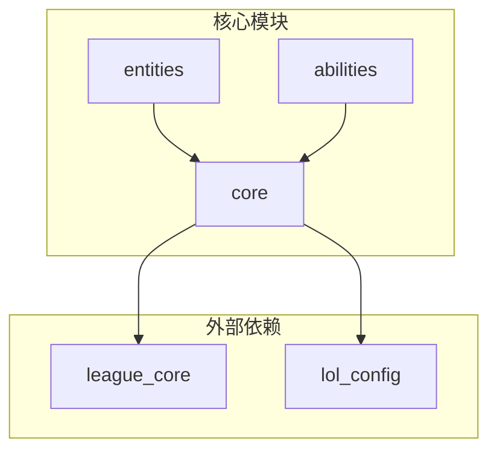
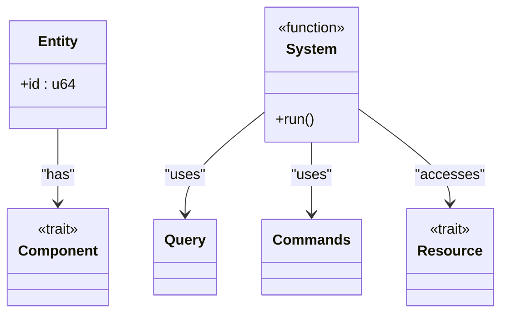
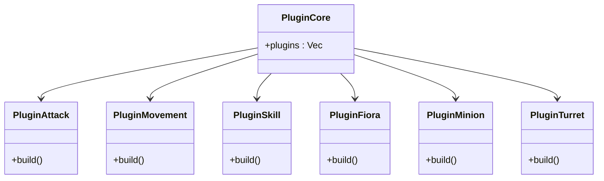
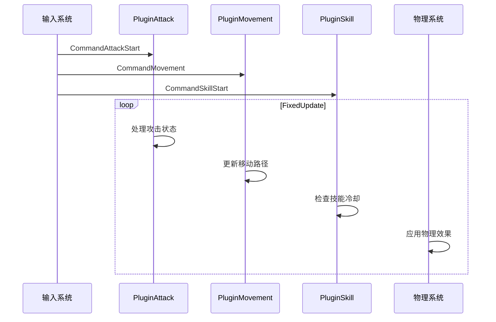
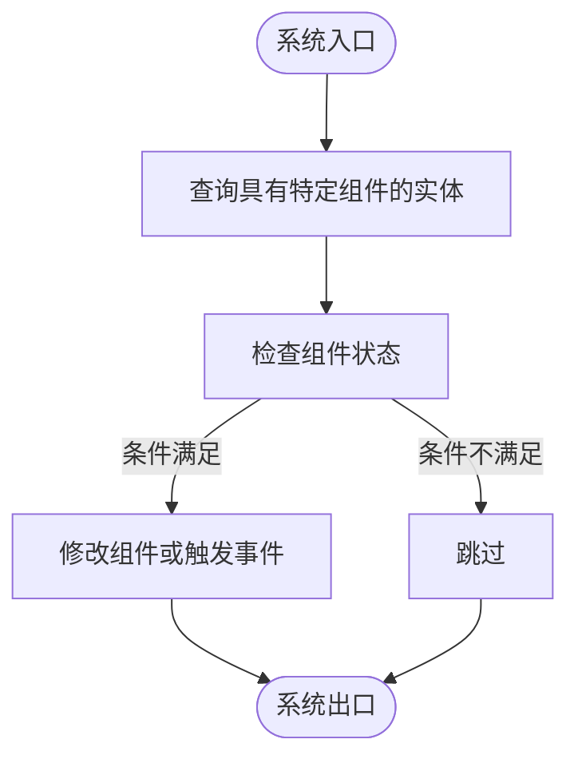

# 后端ECS架构

<cite>
**本文档中引用的文件**  
- [main.rs](file://src/main.rs)
- [lib.rs](file://src/lib.rs)
- [core.rs](file://src/core.rs)
- [entities.rs](file://src/entities.rs)
- [abilities.rs](file://src/abilities.rs)
- [attack.rs](file://src/core/attack.rs)
- [skill.rs](file://src/core/skill.rs)
- [movement.rs](file://src/core/movement.rs)
- [base.rs](file://src/core/base.rs)
- [character.rs](file://src/core/character.rs)
- [fiora.rs](file://src/entities/champions/fiora.rs)
- [minion.rs](file://src/entities/minion.rs)
- [turret.rs](file://src/entities/turret.rs)
</cite>

## 目录
1. [简介](#简介)
2. [项目结构](#项目结构)
3. [核心组件](#核心组件)
4. [ECS架构详解](#ecs架构详解)
5. [插件化模块集成](#插件化模块集成)
6. [核心系统职责与执行顺序](#核心系统职责与执行顺序)
7. [高并发与数据驱动设计](#高并发与数据驱动设计)
8. [系统查询与状态修改示例](#系统查询与状态修改示例)
9. [扩展性与维护性优势](#扩展性与维护性优势)
10. [性能瓶颈与优化策略](#性能瓶颈与优化策略)

## 简介
moon-lol项目采用Bevy引擎的ECS（实体-组件-系统）架构构建后端游戏逻辑。该架构将游戏对象的数据（组件）与行为（系统）分离，通过实体进行关联，实现了高度模块化和可扩展的游戏设计。本项目利用Bevy的插件机制，将不同功能模块如英雄、小兵、防御塔等以插件形式注册到主应用中，确保了代码的清晰组织和灵活配置。

## 项目结构
项目采用分层模块化设计，核心逻辑位于`src/`目录下，分为`core`、`entities`、`abilities`等子模块。`core`模块包含基础组件和系统，`entities`模块定义各类游戏实体，`abilities`模块实现英雄技能逻辑。外部依赖通过`crates/`目录下的独立库提供，如`league_core`和`lol_config`。前端位于`apps/web/`目录，与后端通过清晰的接口进行交互。

**Diagram sources**
- [src/main.rs](file://src/main.rs#L1-L115)
- [src/lib.rs](file://src/lib.rs#L1-L59)

**Section sources**
- [src/main.rs](file://src/main.rs#L1-L115)
- [src/lib.rs](file://src/lib.rs#L1-L59)

## 核心组件
项目的核心组件包括实体（Entity）、组件（Component）、系统（System）和资源（Resource）。实体是游戏对象的唯一标识，组件是附加到实体上的数据结构，系统是处理组件逻辑的函数，资源是全局可访问的数据。这种分离设计使得游戏逻辑高度解耦，便于维护和扩展。

**Section sources**
- [src/core.rs](file://src/core.rs#L1-L58)
- [src/entities.rs](file://src/entities.rs#L1-L18)

## ECS架构详解
Bevy的ECS架构是moon-lol项目的核心。实体作为轻量级的ID，不包含任何逻辑或数据。组件是实现`Component` trait的结构体，用于存储实体的状态。系统是接收`Query`、`Commands`、`Res`等参数的函数，用于查询、修改组件和资源。资源是实现`Resource` trait的类型，用于存储全局状态。

### 实体（Entity）
实体是游戏世界中对象的唯一标识符。在moon-lol中，英雄、小兵、防御塔等都是实体。实体本身不包含数据，而是通过组件来定义其特性。

### 组件（Component）
组件是附加到实体上的数据结构。例如，`Attack`组件包含攻击范围、攻速等属性，`Movement`组件包含移动速度信息。组件的设计遵循单一职责原则，每个组件只负责一个特定的功能。

### 系统（System）
系统是处理游戏逻辑的函数。它们通过`Query`访问具有特定组件的实体，通过`Commands`修改实体状态，通过`Res`访问全局资源。系统按预定义的顺序在固定的时间步长中执行。

### 资源（Resource）
资源是全局可访问的数据，如游戏配置、导航网格等。它们在整个应用生命周期中保持不变或缓慢变化，为系统提供必要的上下文信息。

**Diagram sources**
- [src/core/base.rs](file://src/core/base.rs#L1-L26)
- [src/core/attack.rs](file://src/core/attack.rs#L1-L442)

**Section sources**
- [src/core/base.rs](file://src/core/base.rs#L1-L26)
- [src/core/attack.rs](file://src/core/attack.rs#L1-L442)

## 插件化模块集成
项目通过`PluginCore`插件组实现功能模块的集成。`PluginCore`在`src/main.rs`中定义，包含了所有核心功能插件，如`PluginAttack`、`PluginMovement`、`PluginSkill`等。每个游戏实体类型也有对应的插件，如`PluginFiora`、`PluginMinion`、`PluginTurret`。

### PluginCore插件组
`PluginCore`是一个插件组，它将所有核心系统插件组合在一起，便于一次性注册到Bevy应用中。这种设计提高了代码的组织性和可配置性。

### 实体插件
每个实体类型都有一个对应的插件，负责注册该实体相关的系统和处理其生命周期事件。例如，`PluginFiora`负责处理菲奥娜英雄的特殊逻辑。

**Diagram sources**
- [src/main.rs](file://src/main.rs#L16-L53)
- [src/lib.rs](file://src/lib.rs#L15-L57)

**Section sources**
- [src/main.rs](file://src/main.rs#L16-L53)
- [src/lib.rs](file://src/lib.rs#L15-L57)

## 核心系统职责与执行顺序
核心系统按照特定的职责划分和执行顺序协同工作，确保游戏逻辑的正确性和高效性。

### PluginAttack系统
`PluginAttack`负责处理所有与攻击相关的逻辑，包括攻击命令的处理、攻击状态的更新、伤害的计算和应用。它通过观察`CommandAttackStart`等事件来响应攻击请求，并在`FixedUpdate`阶段更新攻击状态。

### PluginMovement系统
`PluginMovement`负责处理实体的移动逻辑，包括路径规划、移动执行和方向更新。它使用A*算法进行寻路，并通过`MovementPipeline`系统集来处理移动命令的优先级和最终决策。

### PluginSkill系统
`PluginSkill`负责处理英雄技能的释放、冷却和升级逻辑。它通过观察`CommandSkillStart`事件来响应技能释放请求，并检查蓝量和冷却时间等条件。

**Diagram sources**
- [src/core/attack.rs](file://src/core/attack.rs#L12-L24)
- [src/core/movement.rs](file://src/core/movement.rs#L15-L33)
- [src/core/skill.rs](file://src/core/skill.rs#L11-L24)

**Section sources**
- [src/core/attack.rs](file://src/core/attack.rs#L12-L24)
- [src/core/movement.rs](file://src/core/movement.rs#L15-L33)
- [src/core/skill.rs](file://src/core/skill.rs#L11-L24)

## 高并发与数据驱动设计
ECS架构天然支持高并发和数据驱动设计。系统可以并行处理具有相同组件的实体，因为它们之间没有直接的依赖关系。数据驱动设计使得游戏逻辑可以通过修改组件数据来调整，而无需修改代码。

### 并发处理
Bevy的ECS系统自动将不冲突的系统并行执行，充分利用多核CPU的性能。例如，`PluginAttack`和`PluginMovement`可以同时运行，因为它们操作的组件集合不同。

### 数据驱动
游戏平衡性调整可以通过修改组件的默认值来实现。例如，调整英雄的攻击力只需修改`Damage`组件的初始值，而无需修改任何系统代码。

**Section sources**
- [src/core/attack.rs](file://src/core/attack.rs#L27-L43)
- [src/core/movement.rs](file://src/core/movement.rs#L35-L41)

## 系统查询与状态修改示例
系统通过`Query`来访问和修改实体的组件。以下是一个典型的系统实现模式：

**Diagram sources**
- [src/core/attack.rs](file://src/core/attack.rs#L361-L430)
- [src/core/movement.rs](file://src/core/movement.rs#L144-L246)

**Section sources**
- [src/core/attack.rs](file://src/core/attack.rs#L361-L430)
- [src/core/movement.rs](file://src/core/movement.rs#L144-L246)

## 扩展性与维护性优势
ECS架构为moon-lol项目带来了显著的扩展性和维护性优势。

### 扩展性
添加新功能只需创建新的组件和系统，而不会影响现有代码。例如，添加一个新的英雄技能，只需定义新的组件和系统，然后将其注册到相应的插件中。

### 维护性
代码高度模块化，每个系统只关注特定的逻辑。组件的单一职责使得调试和测试更加容易。插件化设计使得功能可以独立开发和测试。

**Section sources**
- [src/abilities.rs](file://src/abilities.rs#L1-L8)
- [src/entities/champions/fiora.rs](file://src/entities/champions/fiora.rs)

## 性能瓶颈与优化策略
尽管ECS架构高效，但仍可能遇到性能瓶颈，特别是在处理大量实体时。

### 潜在瓶颈
- 大量实体的查询性能
- 复杂路径规划的计算开销
- 频繁的事件触发和处理

### 优化策略
- 使用`ChangeTrackers`来避免处理未变化的组件
- 对路径规划进行缓存和增量更新
- 合理使用系统集和调度器来优化执行顺序
- 利用Bevy的批处理和并行处理能力

**Section sources**
- [src/core/movement.rs](file://src/core/movement.rs#L303-L438)
- [src/core/attack.rs](file://src/core/attack.rs#L361-L430)