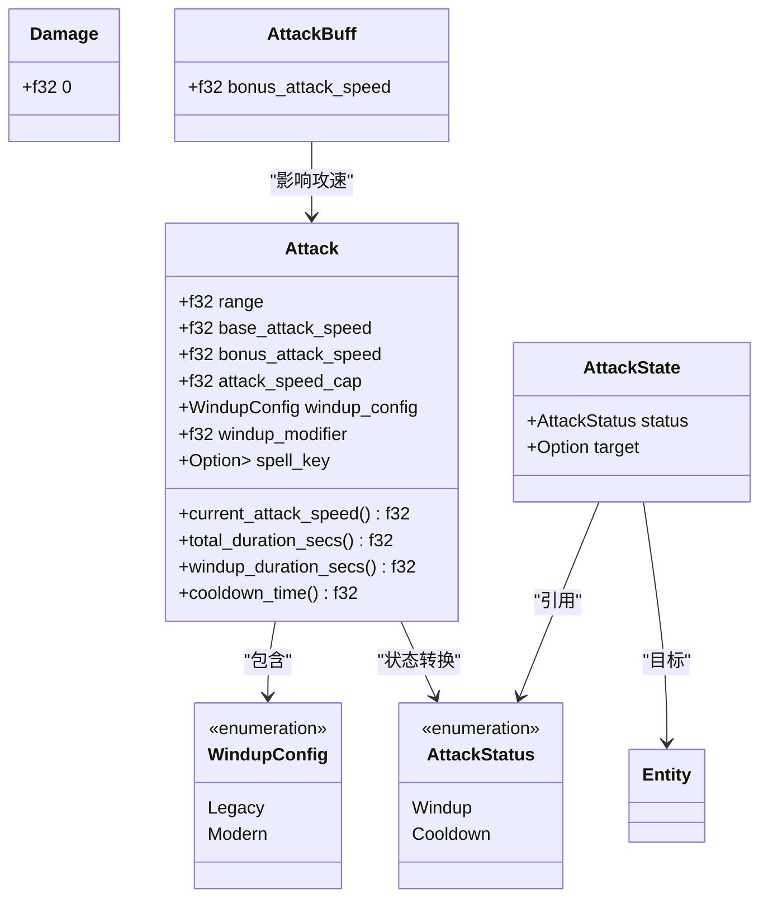
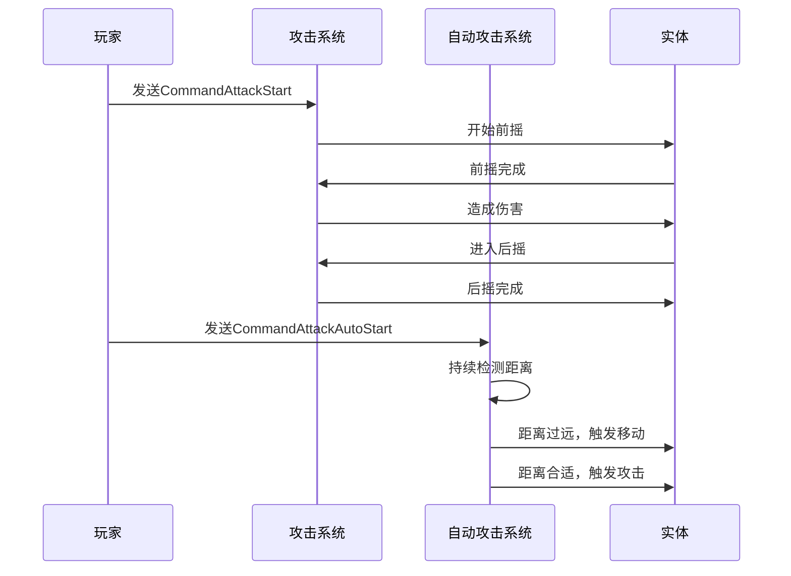
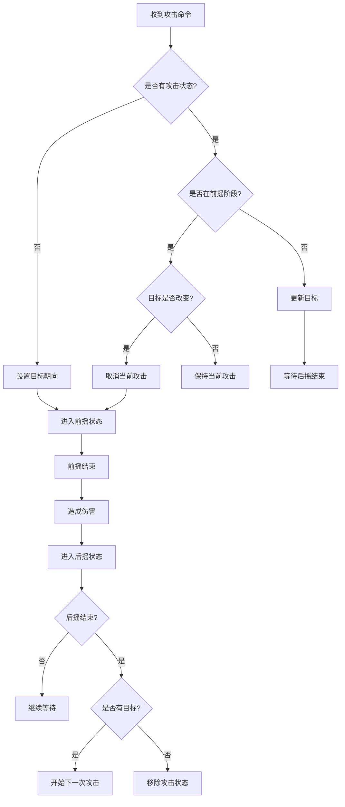
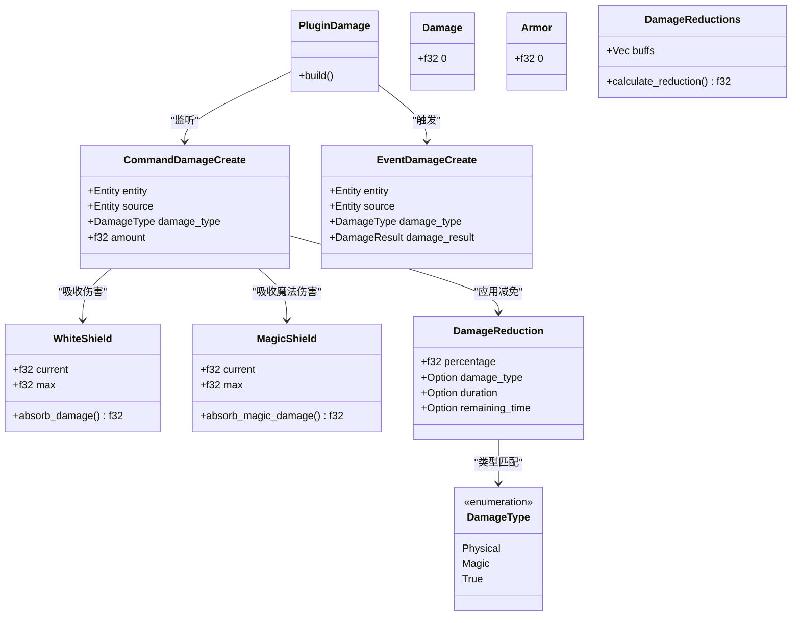
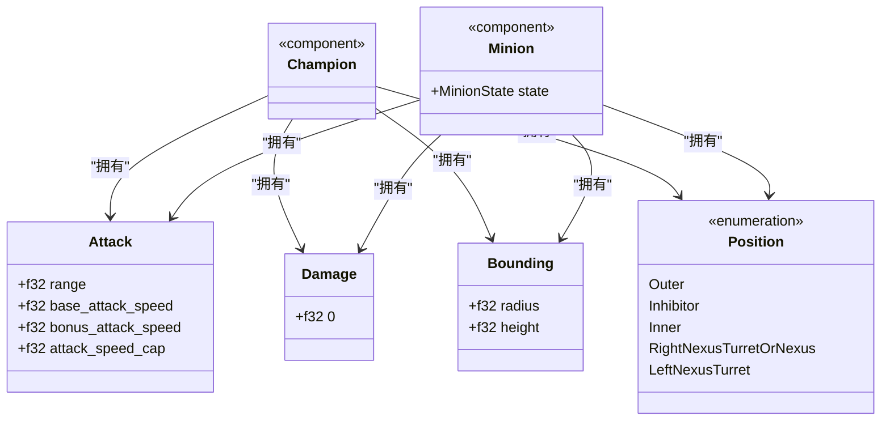
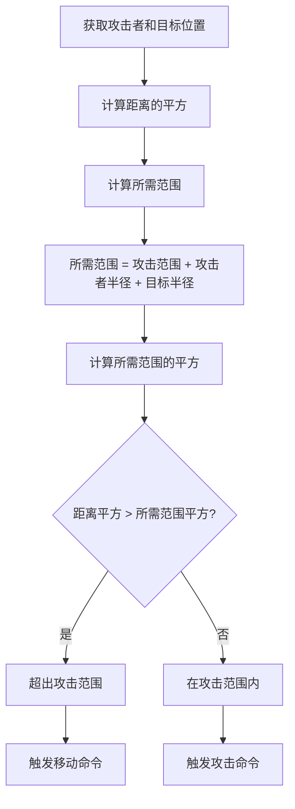
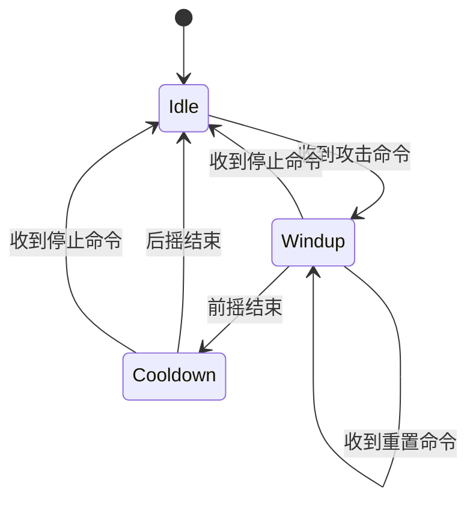

# 攻击系统插件

<cite>
**本文档中引用的文件**  
- [attack.rs](file://src/core/attack.rs)
- [attack_auto.rs](file://src/core/attack_auto.rs)
- [damage.rs](file://src/core/damage.rs)
- [action/attack_reset.rs](file://src/core/action/attack_reset.rs)
- [cooldown.rs](file://src/core/cooldown.rs)
- [action/animation.rs](file://src/core/action/animation.rs)
- [base/bounding.rs](file://src/core/base/bounding.rs)
- [base/position.rs](file://src/core/base/position.rs)
- [entities/champion.rs](file://src/entities/champion.rs)
- [entities/minion.rs](file://src/entities/minion.rs)
- [character.rs](file://src/core/character.rs)
- [skill.rs](file://src/core/skill.rs)
- [skin/animation.rs](file://src/core/skin/animation.rs)
- [crates/league_core/src/extract.rs](file://crates/league_core/src/extract.rs)
</cite>

## 目录
1. [介绍](#介绍)
2. [核心组件](#核心组件)
3. [自动攻击与手动攻击逻辑差异](#自动攻击与手动攻击逻辑差异)
4. [攻击判定与目标选择](#攻击判定与目标选择)
5. [伤害公式计算的ECS实现](#伤害公式计算的ecs实现)
6. [属性数据驱动机制](#属性数据驱动机制)
7. [攻击范围检测](#攻击范围检测)
8. [攻击冷却与重置机制](#攻击冷却与重置机制)
9. [系统集成](#系统集成)
10. [常见问题排查](#常见问题排查)

## 介绍
本文档全面阐述了Moon LOL项目中攻击系统插件的设计与实现。该系统基于ECS（实体-组件-系统）架构，实现了精确的攻击逻辑控制，包括自动攻击、手动攻击、伤害计算、冷却管理等多个方面。系统通过组件化设计实现了高度的灵活性和可扩展性，支持英雄和小兵等不同类型单位的攻击行为。

**Section sources**
- [attack.rs](file://src/core/attack.rs#L1-L442)
- [attack_auto.rs](file://src/core/attack_auto.rs#L1-L155)

## 核心组件

攻击系统的核心由多个组件构成，这些组件共同定义了攻击行为的各个方面。`Attack`组件包含了攻击的基础属性，如攻击范围、攻速、前摇配置等。`AttackState`组件用于跟踪当前的攻击状态，包括前摇和后摇阶段。`Damage`组件定义了攻击造成的伤害值。这些组件通过ECS系统协同工作，实现了完整的攻击流程。



**Diagram sources**
- [attack.rs](file://src/core/attack.rs#L27-L76)

**Section sources**
- [attack.rs](file://src/core/attack.rs#L27-L195)

## 自动攻击与手动攻击逻辑差异

自动攻击和手动攻击在实现逻辑上有显著差异。手动攻击由玩家直接触发，通过`CommandAttackStart`事件启动攻击流程。而自动攻击则由`PluginAttackAuto`插件管理，当单位处于自动攻击模式时，系统会持续检测目标是否在攻击范围内。

自动攻击的逻辑在`update_attack_auto`系统中实现，该系统在`FixedPreUpdate`阶段运行。它会检查攻击者与目标之间的距离，如果超出攻击范围，则触发移动命令；如果在攻击范围内，则触发攻击命令。这种设计使得自动攻击能够智能地在移动和攻击之间切换。



**Diagram sources**
- [attack.rs](file://src/core/attack.rs#L78-L105)
- [attack_auto.rs](file://src/core/attack_auto.rs#L85-L122)

**Section sources**
- [attack.rs](file://src/core/attack.rs#L78-L105)
- [attack_auto.rs](file://src/core/attack_auto.rs#L85-L122)

## 攻击判定与目标选择

攻击判定是攻击系统的核心功能之一。系统通过`AttackState`组件来管理攻击状态机，该状态机包含两个主要状态：前摇（Windup）和后摇（Cooldown）。当前摇阶段结束时，系统会立即触发伤害事件；当后摇阶段结束时，系统会移除攻击状态并准备下一次攻击。

目标选择逻辑在`on_command_attack_start`观察者中实现。当收到攻击命令时，系统会检查当前攻击状态。如果已经在攻击另一个目标，则会取消当前攻击并重新开始对新目标的攻击。这种设计确保了攻击目标的及时切换。



**Diagram sources**
- [attack.rs](file://src/core/attack.rs#L220-L342)

**Section sources**
- [attack.rs](file://src/core/attack.rs#L220-L342)

## 伤害公式计算的ECS实现

伤害计算系统通过ECS架构实现了高度模块化的设计。`Damage`组件存储基础伤害值，而实际的伤害计算在`on_command_damage_create`系统中完成。该系统会考虑多种因素，包括护甲、护盾、伤害减免等。

伤害计算遵循特定的优先级顺序：首先应用伤害减免，然后是白色护盾，最后是魔法护盾。真实伤害则无视所有防御机制。这种设计确保了伤害计算的准确性和一致性。



**Diagram sources**
- [damage.rs](file://src/core/damage.rs#L1-L213)

**Section sources**
- [damage.rs](file://src/core/damage.rs#L1-L213)

## 属性数据驱动机制

攻击属性通过组件系统实现数据驱动。`Attack`组件中的`base_attack_speed`和`bonus_attack_speed`字段分别表示基础攻速和额外攻速加成。总攻速通过`current_attack_speed()`方法计算，该方法会将基础攻速和额外攻速相乘，并应用攻速上限限制。

攻击力、暴击等属性通过`Damage`组件和相关的buff组件实现。这种设计使得属性计算完全由数据驱动，无需修改代码即可调整平衡性。



**Diagram sources**
- [champion.rs](file://src/entities/champion.rs#L5-L8)
- [minion.rs](file://src/entities/minion.rs#L24-L36)
- [base/bounding.rs](file://src/core/base/bounding.rs#L4-L8)
- [base/position.rs](file://src/core/base/position.rs#L4-L12)

**Section sources**
- [champion.rs](file://src/entities/champion.rs#L5-L8)
- [minion.rs](file://src/entities/minion.rs#L24-L36)

## 攻击范围检测

攻击范围检测基于`Position`和`Bounding`组件实现。系统通过计算攻击者和目标之间的距离来判断是否在攻击范围内。距离计算考虑了双方的碰撞半径，确保了判定的准确性。

在`process_attack_logic`函数中，系统使用平方距离比较来避免开方运算的性能开销。攻击范围的计算公式为：`range + attacker_radius + target_radius`，然后对结果进行平方比较。



**Diagram sources**
- [attack_auto.rs](file://src/core/attack_auto.rs#L124-L154)

**Section sources**
- [attack_auto.rs](file://src/core/attack_auto.rs#L124-L154)

## 攻击冷却与重置机制

攻击冷却机制通过`AttackState`组件中的`Cooldown`状态实现。当后摇阶段结束时，系统会自动移除攻击状态并触发`EventAttackReady`事件。攻击重置机制通过`CommandAttackReset`事件实现，该事件会立即取消当前攻击并重新开始。

攻击冷却时间通过`cooldown_time()`方法计算，该方法返回总攻击时间减去前摇时间的结果。这种设计确保了攻击节奏的准确性。



**Diagram sources**
- [attack.rs](file://src/core/attack.rs#L57-L76)

**Section sources**
- [attack.rs](file://src/core/attack.rs#L57-L76)

## 系统集成

攻击系统与`PluginCooldown`、`PluginAnimation`等其他系统紧密集成。`PluginCooldown`负责管理全局冷却时间，而`PluginAnimation`则负责播放攻击动画。

攻击系统通过`CommandRotate`事件与旋转系统集成，确保攻击者在攻击时朝向目标。通过`CommandDamageCreate`事件与伤害系统集成，实现伤害的准确计算和应用。

```mermaid
graph TB
subgraph "攻击系统"
A[PluginAttack]
B[PluginAttackAuto]
C[Attack]
D[AttackState]
end
subgraph "冷却系统"
E[PluginCooldown]
F[CoolDown]
end
subgraph "动画系统"
G[PluginAnimation]
H[CommandAnimationPlay]
end
subgraph "伤害系统"
I[PluginDamage]
J[Damage]
end
A --> E: 共享时间系统
A --> G: 触发攻击动画
A --> I: 触发伤害事件
B --> A: 触发攻击命令
```

**Diagram sources**
- [attack.rs](file://src/core/attack.rs#L15-L23)
- [cooldown.rs](file://src/core/cooldown.rs#L8-L11)
- [action/animation.rs](file://src/core/action/animation.rs#L11-L26)

**Section sources**
- [attack.rs](file://src/core/attack.rs#L15-L23)
- [cooldown.rs](file://src/core/cooldown.rs#L8-L11)
- [action/animation.rs](file://src/core/action/animation.rs#L11-L26)

## 常见问题排查

### 攻击丢失问题
攻击丢失通常由以下原因导致：
1. 目标在前摇期间移动出攻击范围
2. 攻击命令被频繁重置
3. 网络同步延迟导致状态不一致

解决方案包括优化攻击范围检测算法、减少不必要的攻击重置、增加网络预测机制等。

### 判定误差问题
判定误差可能源于：
1. 浮点数精度问题
2. 碰撞半径计算不准确
3. 时间步长不一致

通过使用平方距离比较、精确的碰撞体定义和固定时间步长更新可以有效减少判定误差。

**Section sources**
- [attack.rs](file://src/core/attack.rs#L220-L342)
- [attack_auto.rs](file://src/core/attack_auto.rs#L124-L154)
- [tests/attack.rs](file://tests/attack.rs#L93-L758)