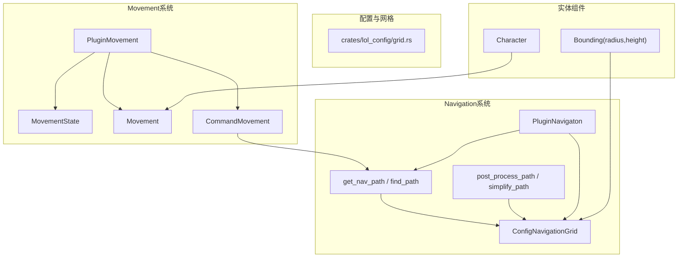
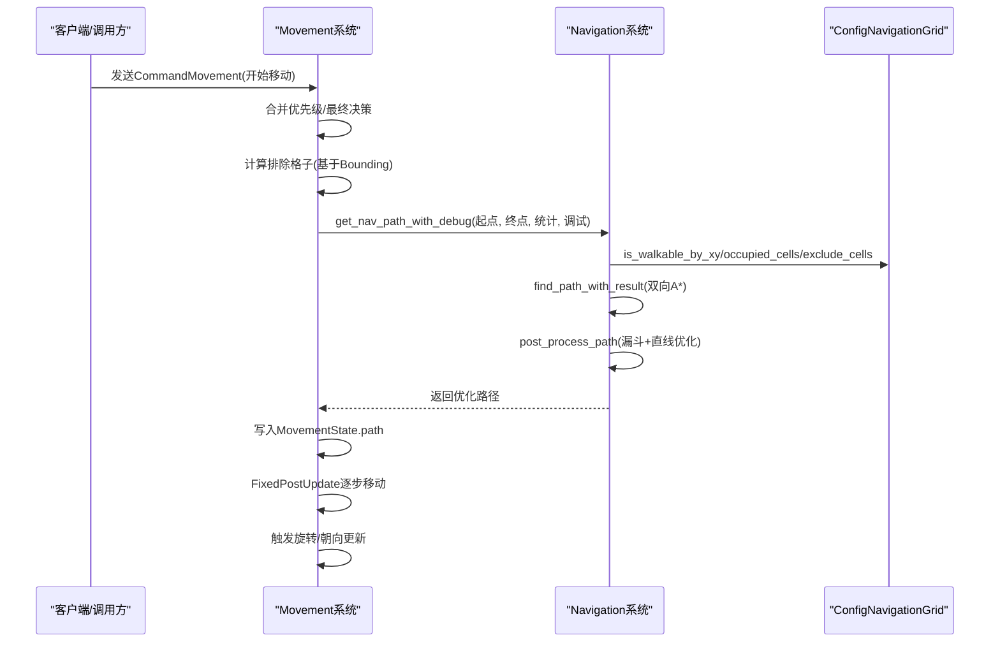
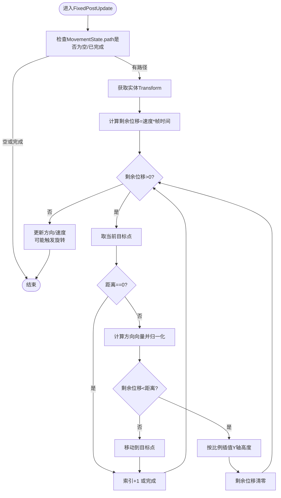
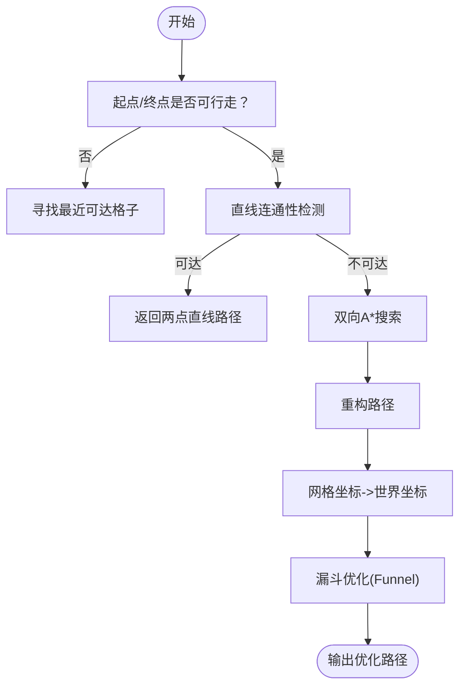
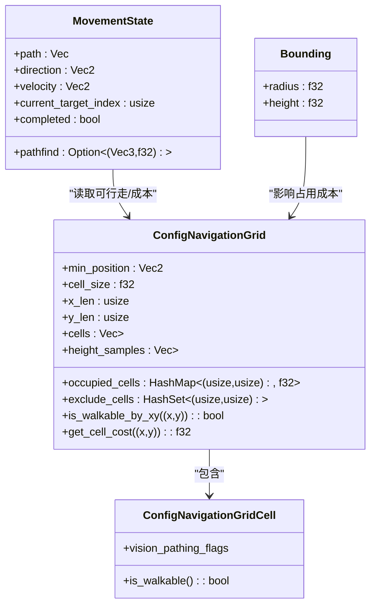
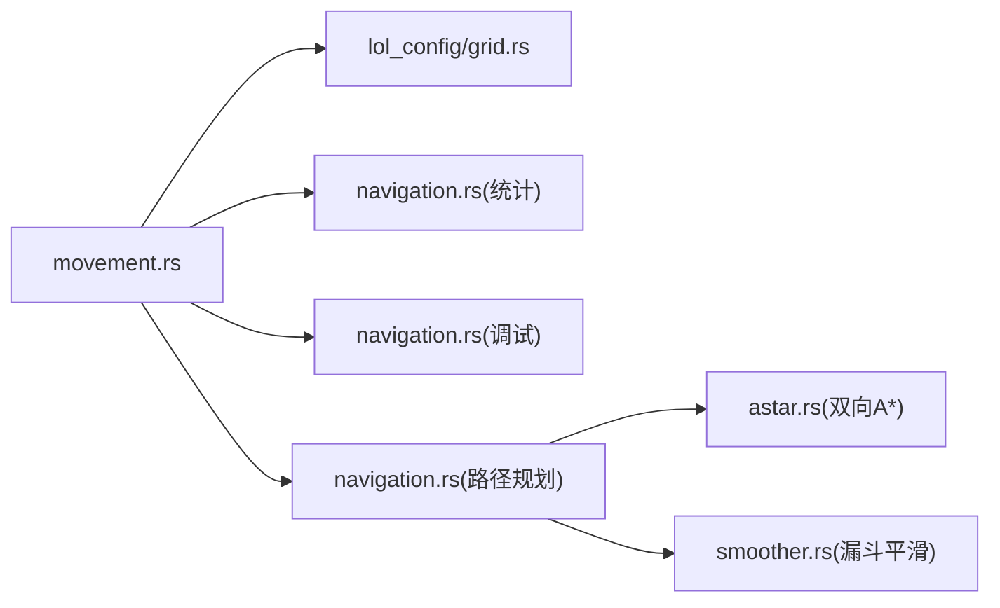

# 移动与导航系统

<cite>
**本文引用的文件**
- [movement.rs](file://src/core/movement.rs)
- [navigation.rs](file://src/core/navigation/navigation.rs)
- [astar.rs](file://src/core/navigation/astar.rs)
- [smoother.rs](file://src/core/navigation/smoother.rs)
- [grid.rs](file://crates/lol_config/src/grid.rs)
- [character.rs](file://src/core/character.rs)
- [bounding.rs](file://src/core/base/bounding.rs)
- [research_nav.rs](file://examples/research_nav.rs)
- [navigation_grid.rs](file://examples/navigation_grid.rs)
</cite>

## 目录
1. [简介](#简介)
2. [项目结构](#项目结构)
3. [核心组件](#核心组件)
4. [架构总览](#架构总览)
5. [详细组件分析](#详细组件分析)
6. [依赖关系分析](#依赖关系分析)
7. [性能考量](#性能考量)
8. [故障排查指南](#故障排查指南)
9. [结论](#结论)
10. [附录](#附录)

## 简介
本文件系统性地文档化了移动与导航系统，重点覆盖以下内容：
- 基于双向A*的路径规划在LOL地图上的实现方式
- Navigation系统与Movement系统的协同工作机制
- Entity的Position、Direction等组件如何被Movement系统更新
- 结合smoother.rs的路径平滑处理技术
- 单位响应移动命令、避障与到达目标点的流程示例
- 导航网格构建、动态障碍物处理与性能优化策略（计算频率控制与缓存）

## 项目结构
移动与导航系统由多个模块协作完成：
- Movement系统：负责接收移动命令、决策合并、路径规划触发、路径执行与朝向更新
- Navigation系统：负责导航网格资源管理、A*寻路、路径平滑、可视化调试
- 配置与网格：提供LOL地图导航网格数据结构与查询接口
- 实体组件：提供角色移动速度、包围半径、状态等基础能力

图表来源
- [movement.rs](file://src/core/movement.rs#L1-L120)
- [navigation.rs](file://src/core/navigation/navigation.rs#L1-L120)
- [astar.rs](file://src/core/navigation/astar.rs#L1-L120)
- [smoother.rs](file://src/core/navigation/smoother.rs#L1-L80)
- [grid.rs](file://crates/lol_config/src/grid.rs#L1-L80)
- [bounding.rs](file://src/core/base/bounding.rs#L1-L8)
- [character.rs](file://src/core/character.rs#L91-L122)

章节来源
- [movement.rs](file://src/core/movement.rs#L1-L120)
- [navigation.rs](file://src/core/navigation/navigation.rs#L1-L120)
- [grid.rs](file://crates/lol_config/src/grid.rs#L1-L80)

## 核心组件
- Movement系统
  - 插件：PluginMovement，注册观察者与流水线阶段
  - 组件：Movement（速度）、MovementState（路径、方向、速度、当前目标索引、完成标记、路径规划缓存）
  - 命令：CommandMovement（开始/停止移动，路径规划或直接路径）
  - 流水线：Calculate、Modify、Reduce、Apply、Cleanup
- Navigation系统
  - 插件：PluginNavigaton，初始化统计与调试资源，注册系统
  - 资源：NavigationStats（计时与计数统计）、NavigationDebug（可视化调试）
  - 函数：get_nav_path/find_path/post_process_path/optimize_path/is_path_blocked/has_line_of_sight
- 导航网格
  - ConfigNavigationGrid：网格尺寸、占用格子、排除格子、高度采样、可行走判定
  - ConfigNavigationGridCell：静态可行走标志（墙/通路）
- 实体组件
  - Bounding：包围半径与高度，用于动态障碍物成本计算
  - Movement：角色移动速度
  - Character：角色标识

章节来源
- [movement.rs](file://src/core/movement.rs#L1-L120)
- [navigation.rs](file://src/core/navigation/navigation.rs#L1-L120)
- [grid.rs](file://crates/lol_config/src/grid.rs#L1-L120)
- [bounding.rs](file://src/core/base/bounding.rs#L1-L8)
- [character.rs](file://src/core/character.rs#L91-L122)

## 架构总览
Movement系统通过事件驱动的仲裁流水线接收移动命令，决定是否需要重新规划路径；当需要时，调用Navigation系统提供的路径规划函数，后者结合双向A*与路径平滑算法生成优化路径，并将路径写入MovementState供执行阶段逐步移动。

图表来源
- [movement.rs](file://src/core/movement.rs#L303-L438)
- [navigation.rs](file://src/core/navigation/navigation.rs#L87-L200)
- [astar.rs](file://src/core/navigation/astar.rs#L57-L216)
- [smoother.rs](file://src/core/navigation/smoother.rs#L74-L183)
- [grid.rs](file://crates/lol_config/src/grid.rs#L114-L128)

## 详细组件分析

### Movement系统：命令接收、决策与执行
- 插件构建
  - 注册观察者与仲裁流水线，将移动命令按优先级合并为最终决策
- 最终决策应用
  - 当收到开始移动命令时，根据MovementWay选择路径规划或直接设置路径
  - 路径规划前先计算并注入排除格子（排除自身占有的格子）
  - 若已有路径且未变化或未被阻挡，则无需重规划
  - 触发路径规划，得到优化路径后写入MovementState
- 路径执行
  - FixedPostUpdate阶段按帧推进，逐段移动到目标点，更新方向与速度
  - 到达目标点后推进索引，直至路径完成
  - 完成时触发EventMovementEnd并清理状态
- 朝向更新
  - 根据最后一步的方向触发旋转命令，使角色朝向移动方向

图表来源
- [movement.rs](file://src/core/movement.rs#L144-L246)

章节来源
- [movement.rs](file://src/core/movement.rs#L1-L120)
- [movement.rs](file://src/core/movement.rs#L144-L246)
- [movement.rs](file://src/core/movement.rs#L303-L438)

### Navigation系统：双向A*与路径平滑
- 路径规划入口
  - get_nav_path/get_nav_path_with_debug：预处理起点/终点可达性，若直线可达则直接返回两点；否则调用双向A*
  - find_path_with_result：先双向A*，再进行路径后处理
- 双向A*
  - find_grid_path_with_result：双向扩展，惰性删除、平衡扩展、提前剪枝
  - movement_cost：基础移动成本+动态障碍物成本
  - heuristic_cost：欧几里得启发式并加微扰
- 路径后处理与平滑
  - post_process_path：将网格坐标转为世界坐标，修正首尾点，再进行直线优化
  - optimize_path：漏斗算法（Funnel）的二维实现，沿路径逐步收紧左右触手，剔除冗余点
  - smoother.rs：补充传送门构建与漏斗简化流程，支持对角移动场景下的虚拟传送门
- 可视化与调试
  - NavigationDebug：记录访问过的格子、路径格子、未优化/优化路径点
  - update_visualization_*：Bevy可视化渲染与Gizmos绘制

图表来源
- [navigation.rs](file://src/core/navigation/navigation.rs#L87-L200)
- [astar.rs](file://src/core/navigation/astar.rs#L57-L216)
- [smoother.rs](file://src/core/navigation/smoother.rs#L74-L183)

章节来源
- [navigation.rs](file://src/core/navigation/navigation.rs#L87-L200)
- [astar.rs](file://src/core/navigation/astar.rs#L57-L216)
- [smoother.rs](file://src/core/navigation/smoother.rs#L1-L183)

### 导航网格与动态障碍物
- 静态网格
  - ConfigNavigationGrid：存储网格尺寸、单元格集合、高度采样、静态可行走标志
  - ConfigNavigationGridCell：基于VisionPathingFlags判断是否为墙
- 动态障碍物
  - calculate_occupied_grid_cells：遍历带Bounding的实体，按半径投影到网格，核心区域不可通行、边缘区域按距离衰减成本
  - exclude_cells：在路径规划前将自身占有的格子加入排除集，避免自遮挡
  - occupied_cells：全局占用格子映射，参与可行走判定与成本计算
- 可行走判定
  - is_walkable_by_xy：综合静态标志、排除集、动态成本阈值

图表来源
- [grid.rs](file://crates/lol_config/src/grid.rs#L1-L128)
- [navigation.rs](file://src/core/navigation/navigation.rs#L480-L550)
- [movement.rs](file://src/core/movement.rs#L317-L419)

章节来源
- [grid.rs](file://crates/lol_config/src/grid.rs#L1-L128)
- [navigation.rs](file://src/core/navigation/navigation.rs#L464-L550)
- [movement.rs](file://src/core/movement.rs#L317-L419)

### Entity的Position、Direction组件与Movement更新
- Position组件
  - 位置枚举用于标识角色在地图中的区域（如外侧、抑制塔、内侧等），与移动系统无直接耦合
- Direction组件
  - 方向枚举用于逻辑判断（上下左右），与Movement系统无直接耦合
- Movement系统如何更新
  - 在FixedPostUpdate阶段，根据当前位移方向更新MovementState.direction与velocity
  - 当存在有效方向时，触发旋转命令以更新朝向

章节来源
- [position.rs](file://src/core/base/position.rs#L1-L35)
- [direction.rs](file://src/core/base/direction.rs#L1-L29)
- [movement.rs](file://src/core/movement.rs#L200-L246)

### 路径平滑处理技术（smoother.rs）
- 传送门构建：将网格路径转换为一系列“传送门”（左右边界），支持水平、垂直与对角移动场景
- 漏斗算法：维护左右触手，逐步收紧并输出拐点序列，去除冗余中间点
- 输出格式：将简化后的路径点旋转回世界坐标系

章节来源
- [smoother.rs](file://src/core/navigation/smoother.rs#L1-L183)

### 导航网格构建与加载
- 示例加载流程
  - research_nav.rs：演示从WAD加载导航网格并打印耗时
  - navigation_grid.rs：示例程序中启用A*可视化与交互
- 加载管线
  - league_to_lol::load_navigation_grid：解析MapContainer中的导航网格条目，构造ConfigNavigationGrid
  - crates/lol_config::grid.rs：定义ConfigNavigationGrid与ConfigNavigationGridCell

章节来源
- [research_nav.rs](file://examples/research_nav.rs#L1-L21)
- [navigation_grid.rs](file://examples/navigation_grid.rs#L1-L120)
- [grid.rs](file://crates/lol_config/src/grid.rs#L1-L151)

## 依赖关系分析
- Movement依赖
  - MovementState/Movement：角色移动参数
  - Bounding：动态障碍物成本计算
  - ConfigNavigationGrid：可行走判定、占用格子、排除格子
  - NavigationStats/NavigationDebug：统计与可视化
- Navigation依赖
  - ConfigNavigationGrid：静态与动态可行走判定
  - astar.rs：双向A*实现
  - smoother.rs：路径平滑
- 可视化依赖
  - Bevy渲染与Gizmos：用于调试路径与占用格子

图表来源
- [movement.rs](file://src/core/movement.rs#L1-L120)
- [navigation.rs](file://src/core/navigation/navigation.rs#L1-L120)
- [astar.rs](file://src/core/navigation/astar.rs#L1-L120)
- [smoother.rs](file://src/core/navigation/smoother.rs#L1-L80)
- [grid.rs](file://crates/lol_config/src/grid.rs#L1-L80)

章节来源
- [movement.rs](file://src/core/movement.rs#L1-L120)
- [navigation.rs](file://src/core/navigation/navigation.rs#L1-L120)
- [astar.rs](file://src/core/navigation/astar.rs#L1-L120)
- [smoother.rs](file://src/core/navigation/smoother.rs#L1-L80)
- [grid.rs](file://crates/lol_config/src/grid.rs#L1-L80)

## 性能考量
- 计算频率控制
  - Movement系统在FixedPostUpdate阶段按固定步长推进，避免每帧大量CPU消耗
  - 路径规划仅在必要时触发（目标变更或路径被阻挡）
- 缓存与复用
  - MovementState.pathfind缓存上次目标与时间戳，减少重复规划
  - NavigationStats统计关键路径规划与占用格子计算的耗时与次数
- 成本与启发式
  - movement_cost：将动态障碍物成本叠加到基础移动成本，避免频繁重建网格
  - heuristic_cost：轻微扰动避免同代价路径震荡
- 可视化开销
  - 可视化系统仅在NavigationDebug.enabled且资源变化时刷新，降低渲染压力

章节来源
- [movement.rs](file://src/core/movement.rs#L317-L419)
- [navigation.rs](file://src/core/navigation/navigation.rs#L1-L80)
- [astar.rs](file://src/core/navigation/astar.rs#L115-L160)

## 故障排查指南
- 寻路失败
  - 检查起点/终点是否被动态障碍物完全包围
  - 查看NavigationStats中get_nav_path_time与check_path_time，确认是否存在超时或异常
- 路径被阻挡
  - Movement系统会在FixedPostUpdate阶段检测路径剩余段是否仍可通行，若被阻挡则触发重规划
- 朝向不正确
  - Movement系统仅在存在有效方向时触发旋转，检查MovementState.velocity与direction是否更新
- 可视化调试
  - 启用NavigationDebug，观察visited_cells/path_cells/unoptimized_path/optimized_path，定位A*搜索问题

章节来源
- [movement.rs](file://src/core/movement.rs#L303-L438)
- [navigation.rs](file://src/core/navigation/navigation.rs#L1-L80)

## 结论
该移动与导航系统通过清晰的职责分离实现了高效、可调试的路径规划与执行：
- Movement系统专注命令仲裁与路径执行，保证低开销与实时性
- Navigation系统提供稳健的双向A*与路径平滑，兼顾准确性与性能
- 动态障碍物通过占用格子与排除集实现，避免自遮挡并支持多实体交互
- 可视化与统计工具便于开发调试与性能监控

## 附录
- 代码示例路径（不展示具体代码内容）
  - 移动命令触发与路径规划：[movement.rs](file://src/core/movement.rs#L303-L438)
  - 路径规划主流程（含A*与平滑）：[navigation.rs](file://src/core/navigation/navigation.rs#L87-L200)
  - 双向A*实现与成本计算：[astar.rs](file://src/core/navigation/astar.rs#L57-L216)
  - 路径平滑（漏斗算法）：[smoother.rs](file://src/core/navigation/smoother.rs#L74-L183)
  - 导航网格资源与可行走判定：[grid.rs](file://crates/lol_config/src/grid.rs#L114-L128)
  - 动态障碍物占用格子计算：[navigation.rs](file://src/core/navigation/navigation.rs#L480-L550)
  - 导航网格加载示例：[research_nav.rs](file://examples/research_nav.rs#L1-L21)
  - 导航网格可视化示例：[navigation_grid.rs](file://examples/navigation_grid.rs#L1-L120)