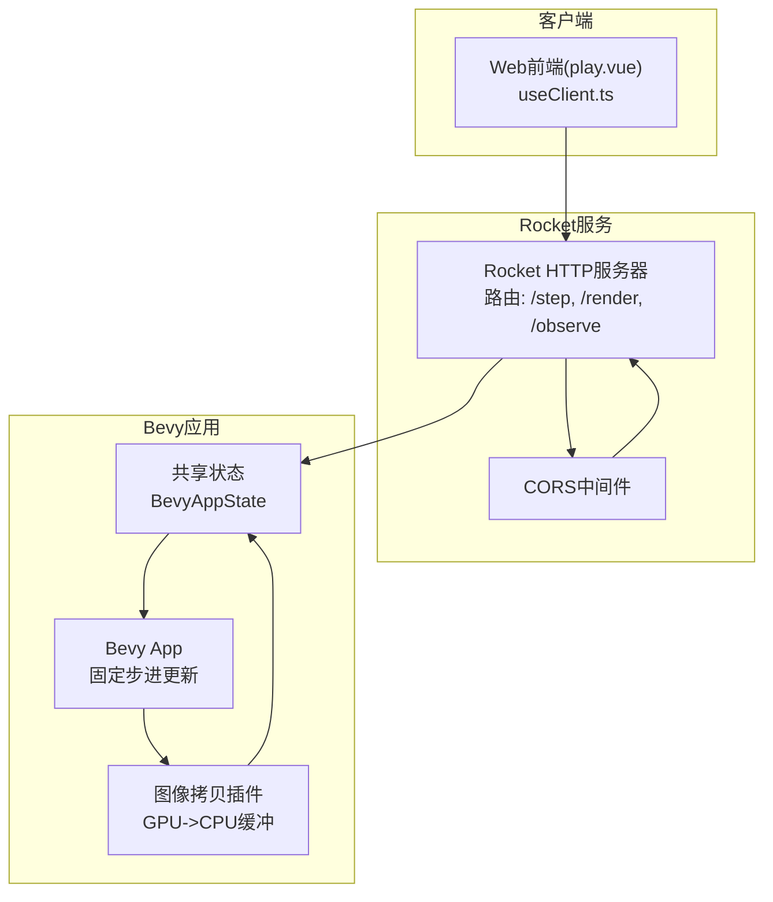
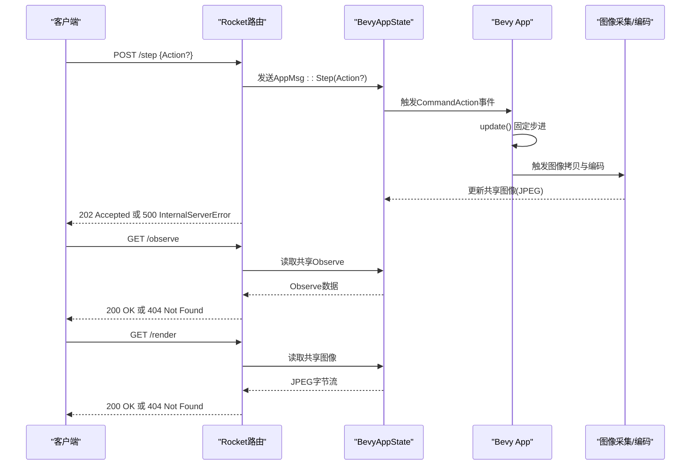
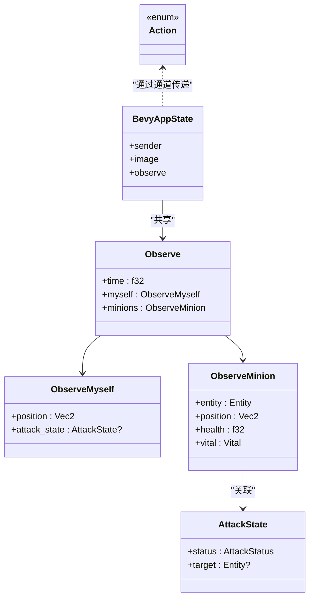

# API协议与端点规范

<cite>
**本文引用的文件列表**
- [stream.rs](file://examples/stream.rs)
- [action.rs](file://src/core/action.rs)
- [attack.rs](file://src/core/attack.rs)
- [fiora_passive.rs](file://src/abilities/fiora_passive.rs)
- [useClient.ts](file://apps/web/src/composables/useClient.ts)
- [play.vue](file://apps/web/src/pages/play.vue)
- [Cargo.toml](file://Cargo.toml)
</cite>

## 目录
1. [引言](#引言)
2. [项目结构](#项目结构)
3. [核心组件](#核心组件)
4. [架构总览](#架构总览)
5. [详细端点规范](#详细端点规范)
6. [依赖关系分析](#依赖关系分析)
7. [性能与并发特性](#性能与并发特性)
8. [故障排查与错误码](#故障排查与错误码)
9. [结论](#结论)
10. [附录：curl示例与最佳实践](#附录curl示例与最佳实践)

## 引言
本文件面向moon-lol项目中基于Rocket框架的HTTP API，系统化梳理并规范以下三个核心端点：
- /step：接收客户端动作指令，驱动Bevy游戏世界状态变更
- /render：获取当前帧渲染图像（JPEG）
- /observe：查询当前游戏状态（Observe数据结构）

文档同时解释各端点在游戏逻辑中的职责、请求/响应格式、状态共享机制（Rocket State与Bevy应用状态的桥接）、以及常见错误码与处理策略，并提供curl示例与最佳实践建议。

## 项目结构
Rocket服务与Bevy游戏引擎通过一个独立示例程序集成：Rocket负责HTTP路由与跨域配置，Bevy负责游戏逻辑与渲染；二者通过通道与共享资源进行解耦协作。

图表来源
- [stream.rs](file://examples/stream.rs#L330-L420)
- [play.vue](file://apps/web/src/pages/play.vue#L126-L141)
- [useClient.ts](file://apps/web/src/composables/useClient.ts#L152-L231)

章节来源
- [stream.rs](file://examples/stream.rs#L330-L420)
- [Cargo.toml](file://Cargo.toml#L55-L63)

## 核心组件
- Rocket路由与状态管理
  - 路由注册：/step（POST）、/render（GET）、/observe（GET）
  - CORS：允许GET/POST/OPTIONS与任意来源
  - 状态共享：通过rocket::State共享BevyAppState（包含图像与观察数据的共享容器）
- Bevy应用与状态桥接
  - 固定步进更新：手动控制Time更新节奏
  - 图像采集：通过自定义渲染图节点将渲染目标复制到CPU缓冲，再异步编码为JPEG
  - 观察数据：从世界查询玩家与敌方单位状态，封装为Observe结构
  - 动作分发：将HTTP动作通过事件触发到Bevy ECS，驱动角色行为

章节来源
- [stream.rs](file://examples/stream.rs#L286-L327)
- [stream.rs](file://examples/stream.rs#L330-L420)
- [stream.rs](file://examples/stream.rs#L422-L519)

## 架构总览
下图展示HTTP请求到游戏状态更新与图像/观察数据返回的完整流程。

图表来源
- [stream.rs](file://examples/stream.rs#L286-L327)
- [stream.rs](file://examples/stream.rs#L330-L420)
- [stream.rs](file://examples/stream.rs#L422-L519)

## 详细端点规范

### /step：动作指令端点
- 方法与路径
  - POST /step
- 请求头
  - Content-Type: application/json（当携带动作体时）
- 请求体
  - 可选JSON对象，对应Action枚举类型
  - Action枚举包含以下变体（按语义说明，具体字段名以实际序列化为准）：
    - Attack(Entity)：对指定实体发起攻击
    - Move(Vec2)：移动到二维位置
    - Stop：停止当前动作
    - Skill { index: usize, point: Vec2 }：释放技能于指定点
    - SkillLevelUp(usize)：升级指定技能
- 成功与错误
  - 202 Accepted：动作已成功投递至Bevy应用
  - 500 InternalServerError：内部错误（例如通道发送失败）
- 游戏逻辑作用
  - 将动作转换为CommandAction事件，驱动角色的攻击、移动、技能释放等行为
  - 该端点不直接返回图像或观察数据，仅触发状态推进

章节来源
- [stream.rs](file://examples/stream.rs#L286-L300)
- [action.rs](file://src/core/action.rs#L43-L96)

### /render：图像渲染端点
- 方法与路径
  - GET /render
- 响应
  - Content-Type: image/jpeg
  - 响应体：JPEG图像字节流
- 成功与错误
  - 200 OK：返回当前帧图像
  - 404 Not Found：图像尚未就绪（例如首帧或渲染管线尚未产生有效数据）
- 数据来源
  - 来自Bevy渲染目标的GPU纹理，经拷贝到CPU缓冲并异步编码为JPEG
  - 首次调用可能返回404，后续帧通常可正常返回

章节来源
- [stream.rs](file://examples/stream.rs#L302-L315)
- [stream.rs](file://examples/stream.rs#L422-L482)

### /observe：游戏状态查询端点
- 方法与路径
  - GET /observe
- 响应体（JSON）
  - time: f32（秒），当前时间戳
  - myself: ObserveMyself
    - position: Vec2（二维坐标）
    - attack_state: AttackState?（可选）
  - minions: ObserveMinion
    - entity: Entity（实体标识）
    - position: Vec2（二维坐标）
    - health: f32（血量）
    - vital: Vital（被动标记状态）
- 成功与错误
  - 200 OK：返回当前观察数据
  - 404 Not Found：观察数据尚未就绪（例如首次查询或查询条件不满足）

章节来源
- [stream.rs](file://examples/stream.rs#L261-L281)
- [stream.rs](file://examples/stream.rs#L317-L327)
- [attack.rs](file://src/core/attack.rs#L56-L77)
- [fiora_passive.rs](file://src/abilities/fiora_passive.rs#L41-L65)

## 依赖关系分析
- Rocket与Bevy的耦合点
  - 通过rocket::State共享BevyAppState，其中包含：
    - sender：跨线程通道，用于接收HTTP动作
    - image：共享图像（JPEG字节流）
    - observe：共享观察数据
  - Bevy应用在独立线程中运行，周期性update推进游戏逻辑，并在每帧完成后更新共享图像与观察数据
- CORS与跨域
  - 允许GET/POST/OPTIONS方法与任意来源，便于前端开发调试
- 前端集成
  - Web前端通过play.vue与useClient.ts调用上述端点，实现“思考-动作-渲染-观察”的闭环

图表来源
- [stream.rs](file://examples/stream.rs#L255-L327)
- [attack.rs](file://src/core/attack.rs#L56-L77)
- [fiora_passive.rs](file://src/abilities/fiora_passive.rs#L41-L65)
- [action.rs](file://src/core/action.rs#L43-L96)

章节来源
- [stream.rs](file://examples/stream.rs#L255-L327)
- [attack.rs](file://src/core/attack.rs#L56-L77)
- [fiora_passive.rs](file://src/abilities/fiora_passive.rs#L41-L65)
- [action.rs](file://src/core/action.rs#L43-L96)

## 性能与并发特性
- 固定步进更新
  - 使用手动时间步长，确保动作与渲染节奏稳定
- 图像采集与编码
  - GPU纹理拷贝到CPU缓冲采用异步映射与队列提交
  - JPEG编码在后台线程执行，避免阻塞主渲染管线
- 线程与通道
  - Rocket线程负责HTTP请求处理与状态读写
  - Bevy线程负责游戏逻辑与渲染，通过有界通道接收动作消息
- 并发安全
  - 图像与观察数据通过Arc<Mutex<Option<T>>>保护，避免竞态

章节来源
- [stream.rs](file://examples/stream.rs#L342-L420)
- [stream.rs](file://examples/stream.rs#L422-L482)

## 故障排查与错误码
- 404 Not Found
  - /render：图像尚未生成（首帧或渲染目标未就绪）
  - /observe：观察数据尚未生成（查询不到玩家或目标实体）
- 500 InternalServerError
  - /step：通道发送失败或内部错误
- CORS问题
  - 若浏览器报跨域错误，请确认CORS配置允许相应来源与方法
- 建议排查步骤
  - 确认Bevy应用线程正常运行且每帧update推进
  - 检查图像通道是否能接收到数据
  - 检查查询实体是否存在（玩家与目标）
  - 检查网络连通性与端口占用

章节来源
- [stream.rs](file://examples/stream.rs#L302-L327)
- [stream.rs](file://examples/stream.rs#L330-L420)

## 结论
本API协议以简洁明确的三端点覆盖了RL训练与演示所需的核心能力：动作输入、实时渲染与状态观测。通过Rocket与Bevy的解耦设计，既保证了前端交互的低延迟，也确保了游戏逻辑的稳定性与可扩展性。建议在生产环境中进一步完善错误日志、限流与健康检查，并根据业务需求扩展更多观测维度。

## 附录：curl示例与最佳实践
- curl示例
  - 发送动作（无动作体）
    - curl -X POST http://localhost:8000/step -H "Content-Type: application/json" -d '{}'
  - 发送动作（含具体动作）
    - curl -X POST http://localhost:8000/step -H "Content-Type: application/json" -d '{"Move":[100,200]}'
  - 查询观察数据
    - curl http://localhost:8000/observe
  - 获取图像
    - curl -o frame.jpg http://localhost:8000/render
- 最佳实践
  - /render建议轮询或使用长轮询，避免频繁请求导致带宽浪费
  - /observe适合按需查询，避免高频拉取
  - /step建议合并动作，减少请求次数
  - 在高并发场景下，建议增加限流与重试策略
  - 前端应处理404与500错误，给出友好提示

章节来源
- [useClient.ts](file://apps/web/src/composables/useClient.ts#L152-L231)
- [play.vue](file://apps/web/src/pages/play.vue#L126-L141)