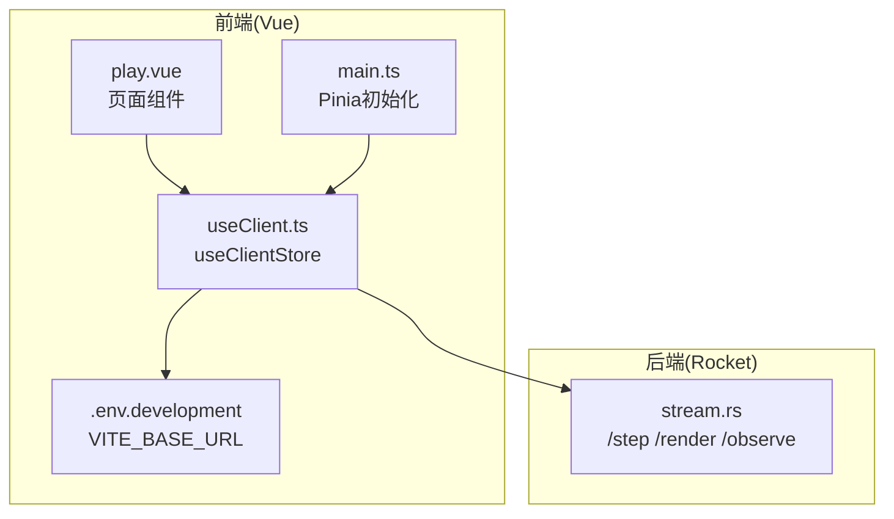
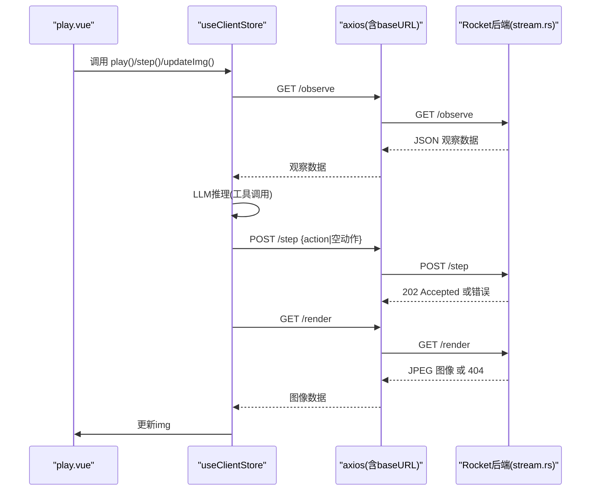
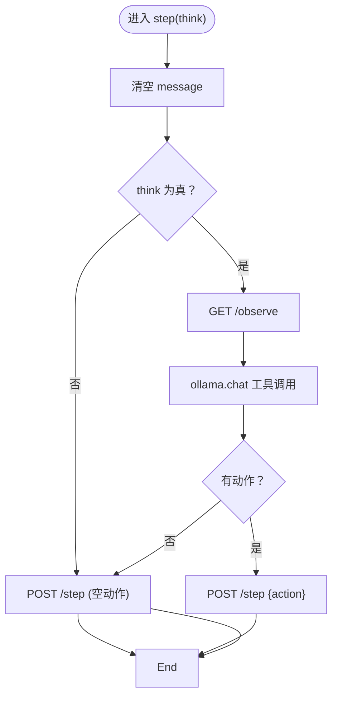
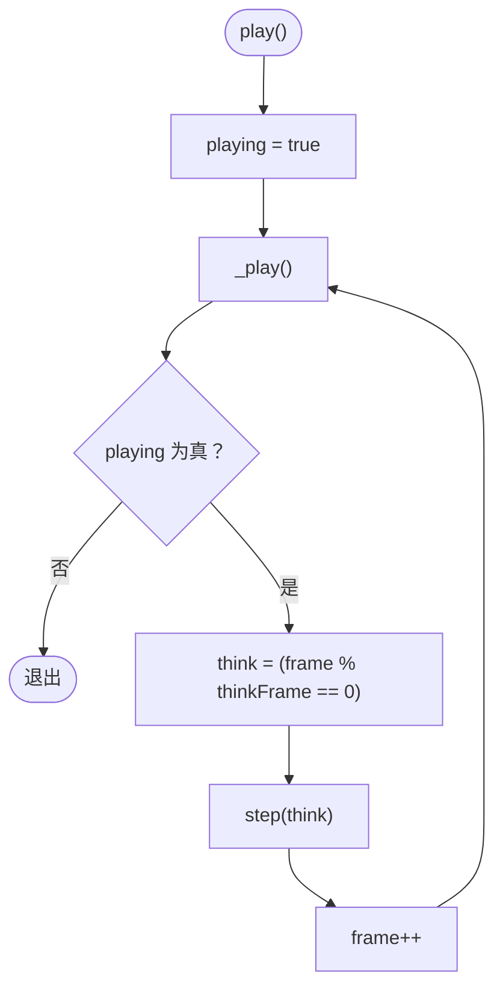
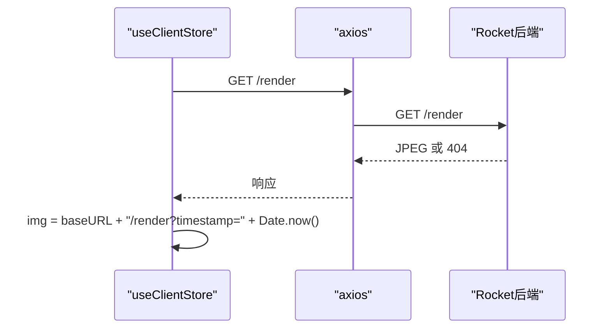
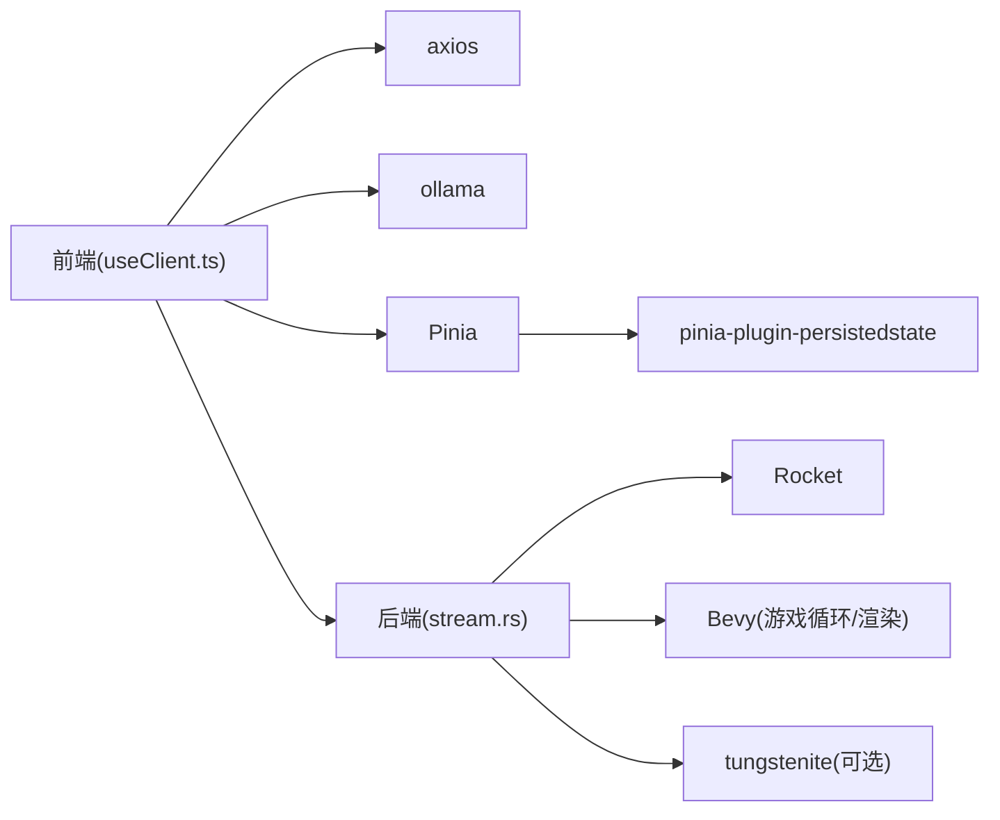

# 客户端通信模式与错误处理

<cite>
**本文引用的文件**
- [useClient.ts](file://apps/web/src/composables/useClient.ts)
- [play.vue](file://apps/web/src/pages/play.vue)
- [.env.development](file://apps/web/.env.development)
- [main.ts](file://apps/web/src/main.ts)
- [stream.rs](file://examples/stream.rs)
- [posts.ts](file://apps/web/src/data/posts.ts)
</cite>

## 目录
1. [引言](#引言)
2. [项目结构](#项目结构)
3. [核心组件](#核心组件)
4. [架构总览](#架构总览)
5. [详细组件分析](#详细组件分析)
6. [依赖关系分析](#依赖关系分析)
7. [性能考量](#性能考量)
8. [故障排查指南](#故障排查指南)
9. [结论](#结论)
10. [附录](#附录)

## 引言
本文聚焦于前端Vue应用中useClient.ts的通信逻辑实现，系统性解析其如何封装对后端API（/step、/render、/observe）的调用，包括axios实例配置、请求重试机制（如step失败时发送空动作）、状态同步策略；解释updateImg函数通过时间戳参数绕过浏览器缓存获取最新渲染图像的技巧；阐述play循环中基于帧率的决策频率控制（thinkFrame）；并结合代码说明如何处理网络延迟与API返回404的情况，最后讨论WebSocket长连接替代方案的可行性与集成路径。

## 项目结构
前端Vue应用位于apps/web目录，核心通信逻辑集中在composables/useClient.ts中，页面play.vue消费该store并与后端交互。后端示例服务位于examples/stream.rs，提供HTTP接口（/step、/render、/observe）以及Bevy游戏引擎的渲染与观察数据。

图表来源
- [useClient.ts](file://apps/web/src/composables/useClient.ts#L1-L231)
- [play.vue](file://apps/web/src/pages/play.vue#L1-L298)
- [.env.development](file://apps/web/.env.development#L1-L1)
- [main.ts](file://apps/web/src/main.ts#L1-L17)
- [stream.rs](file://examples/stream.rs#L286-L327)

章节来源
- [useClient.ts](file://apps/web/src/composables/useClient.ts#L1-L231)
- [play.vue](file://apps/web/src/pages/play.vue#L1-L298)
- [.env.development](file://apps/web/.env.development#L1-L1)
- [main.ts](file://apps/web/src/main.ts#L1-L17)

## 核心组件
- axios实例与基础URL
  - 使用import.meta.env.VITE_BASE_URL作为基础URL，创建axios实例用于统一请求。
  - baseURL来源于.env.development，开发环境下默认指向本地8000端口。
- useClientStore
  - 状态：frame、thinkFrame、playing、img、observation、action、prompt、message。
  - 方法：updateImg、step、observe、play、stop；内部包含递归_play循环。
- 页面play.vue
  - 绑定按钮与状态显示，调用useClientStore的方法驱动AI与渲染。

章节来源
- [useClient.ts](file://apps/web/src/composables/useClient.ts#L1-L231)
- [play.vue](file://apps/web/src/pages/play.vue#L1-L298)
- [.env.development](file://apps/web/.env.development#L1-L1)

## 架构总览
前端通过HTTP轮询与后端交互，后端基于Rocket提供REST接口，同时在后台线程中驱动Bevy游戏循环，采集图像与观察数据并通过共享资源暴露给HTTP接口。

图表来源
- [useClient.ts](file://apps/web/src/composables/useClient.ts#L152-L204)
- [stream.rs](file://examples/stream.rs#L286-L327)

## 详细组件分析

### axios实例与基础URL配置
- 基础URL来自VITE_BASE_URL，开发环境默认为http://localhost:8000。
- axios实例用于统一发起HTTP请求，避免硬编码路径。
- 页面play.vue通过store.updateImg直接访问/render接口，随后在img上拼接timestamp参数以强制刷新缓存。

章节来源
- [.env.development](file://apps/web/.env.development#L1-L1)
- [useClient.ts](file://apps/web/src/composables/useClient.ts#L1-L12)
- [useClient.ts](file://apps/web/src/composables/useClient.ts#L152-L155)
- [play.vue](file://apps/web/src/pages/play.vue#L126-L140)

### useClientStore：封装API调用与状态管理
- 状态字段
  - frame：全局帧计数，配合thinkFrame控制思考频率。
  - thinkFrame：思考帧间隔，默认10帧，决定每多少帧才进行一次LLM推理。
  - playing：播放开关，控制递归_play循环。
  - img：渲染图像URL，带timestamp参数。
  - observation/action/prompt/message：观察数据、动作、提示词与推理输出。
- 关键方法
  - updateImg：先GET /render，再将img指向带timestamp的URL，从而绕过浏览器缓存。
  - step：核心决策流程
    - think为true时：先GET /observe，再调用ollama.chat进行工具化推理，提取Attack/Move/Nothing动作，若有动作则POST /step；若发生异常，则回退发送空动作POST /step。
    - think为false时：直接POST /step（空动作）。
  - observe：仅GET /observe并打印结果。
  - play/_play：递归循环，按thinkFrame判定是否进行推理，每次step后frame++，直到playing=false。
  - stop：关闭playing，中断循环。

图表来源
- [useClient.ts](file://apps/web/src/composables/useClient.ts#L157-L184)

章节来源
- [useClient.ts](file://apps/web/src/composables/useClient.ts#L107-L231)

### play循环与thinkFrame决策频率控制
- play()设置playing=true并启动递归_play()。
- _play()中根据frame % thinkFrame == 0决定是否进行推理（think=true），否则仅执行空动作（think=false）。
- 每次step后frame自增，循环继续，直至playing=false。

图表来源
- [useClient.ts](file://apps/web/src/composables/useClient.ts#L191-L204)

章节来源
- [useClient.ts](file://apps/web/src/composables/useClient.ts#L191-L204)

### updateImg：绕过浏览器缓存获取最新图像
- 先GET /render，确保后端已有图像数据。
- 将img指向baseURL/render并附加timestamp参数，使浏览器每次请求都视为新资源，从而强制刷新缓存。

图表来源
- [useClient.ts](file://apps/web/src/composables/useClient.ts#L152-L155)
- [stream.rs](file://examples/stream.rs#L302-L315)

章节来源
- [useClient.ts](file://apps/web/src/composables/useClient.ts#L152-L155)

### 错误处理与404兼容
- /render与/Observation在数据未就绪时返回404，前端需具备容错能力：
  - /render 404：updateImg不会立即赋值img，页面显示“等待游戏数据...”，用户可手动点击刷新。
  - /observe 404：step在try块中捕获异常，回退发送空动作POST /step，避免因观察数据缺失导致AI停摆。
- 该策略确保在网络延迟或后端尚未准备好的情况下，系统仍能继续推进。

章节来源
- [useClient.ts](file://apps/web/src/composables/useClient.ts#L170-L184)
- [stream.rs](file://examples/stream.rs#L302-L327)
- [play.vue](file://apps/web/src/pages/play.vue#L126-L140)

### WebSocket长连接替代方案：可行性与集成路径
- 现状：当前采用HTTP轮询（/observe、/render、/step），页面通过定时刷新与store.updateImg实现近实时展示。
- WebSocket优势：降低轮询开销、减少延迟、支持双向事件推送（如图像流、观察快照）。
- 可行性评估：
  - 后端Rocket未内置WebSocket路由，但存在tungstenite依赖项，具备扩展WebSocket的能力。
  - 前端Vue与ollama SDK均支持WebSocket流式消息，便于集成。
- 集成建议路径（概念性步骤）：
  1. 在后端stream.rs中新增WebSocket路由，建立与前端的持久连接。
  2. 在后端循环中，将每帧的图像与观察数据通过WebSocket推送至前端。
  3. 在前端useClient.ts中，切换到WebSocket订阅模式，移除/updateImg轮询，改为接收WebSocket消息更新img与observation。
  4. 保留/step接口用于显式动作提交，或通过WebSocket通道发送动作。
  5. 在play循环中，根据WebSocket事件决定是否进行推理，而非固定thinkFrame。
- 注意事项：
  - 需要处理连接断开、重连与背压问题。
  - WebSocket消息格式与HTTP响应格式需统一，保证前后端一致的解码逻辑。

章节来源
- [posts.ts](file://apps/web/src/data/posts.ts#L40-L48)
- [Cargo.lock](file://Cargo.lock#L6580-L6595)
- [stream.rs](file://examples/stream.rs#L286-L327)
- [useClient.ts](file://apps/web/src/composables/useClient.ts#L152-L204)

## 依赖关系分析
- 前端依赖
  - axios：统一HTTP请求，配合baseURL。
  - ollama：工具化推理，支持流式输出与工具调用。
  - Pinia：状态管理，持久化存储prompt。
- 后端依赖
  - Rocket：提供REST接口。
  - Bevy：游戏循环与渲染，后台线程编码图像并写入共享资源。
  - tungstenite：WebSocket库（存在依赖，可选用于后续扩展）。

图表来源
- [useClient.ts](file://apps/web/src/composables/useClient.ts#L1-L231)
- [main.ts](file://apps/web/src/main.ts#L1-L17)
- [stream.rs](file://examples/stream.rs#L286-L327)
- [Cargo.lock](file://Cargo.lock#L6580-L6595)

章节来源
- [useClient.ts](file://apps/web/src/composables/useClient.ts#L1-L231)
- [main.ts](file://apps/web/src/main.ts#L1-L17)
- [stream.rs](file://examples/stream.rs#L286-L327)
- [Cargo.lock](file://Cargo.lock#L6580-L6595)

## 性能考量
- 轮询频率与thinkFrame
  - thinkFrame控制推理频率，避免每帧都进行昂贵的LLM推理，平衡延迟与智能度。
- 图像缓存绕过
  - 通过timestamp参数强制刷新，确保图像新鲜度，但可能增加带宽消耗。
- 后端渲染与编码
  - 后端在独立线程中去除行填充、编码为JPEG并写入共享资源，减少主线程阻塞。
- 建议
  - 可根据网络状况动态调整thinkFrame。
  - 对于高频图像流，考虑WebSocket推送或服务端压缩策略。

章节来源
- [useClient.ts](file://apps/web/src/composables/useClient.ts#L110-L112)
- [useClient.ts](file://apps/web/src/composables/useClient.ts#L152-L155)
- [stream.rs](file://examples/stream.rs#L422-L479)

## 故障排查指南
- /render返回404
  - 现象：页面显示“等待游戏数据...”。
  - 处理：调用store.updateImg刷新，或确认后端渲染线程已启动并写入图像。
- /observe返回404
  - 现象：step抛出异常并回退发送空动作。
  - 处理：等待后端观察数据就绪，或手动点击“观察”按钮验证接口可用性。
- 网络延迟导致画面滞后
  - 现象：图像更新不及时。
  - 处理：适当降低thinkFrame以提升推理频率，或考虑WebSocket推送。
- WebSocket集成问题
  - 现象：连接失败或消息丢失。
  - 处理：检查后端WebSocket路由与心跳机制，前端实现重连与背压控制。

章节来源
- [useClient.ts](file://apps/web/src/composables/useClient.ts#L152-L184)
- [stream.rs](file://examples/stream.rs#L302-L327)
- [play.vue](file://apps/web/src/pages/play.vue#L126-L140)

## 结论
useClient.ts通过清晰的状态机与API封装，实现了对后端REST接口的稳健调用。其核心特性包括：
- axios实例统一配置与baseURL管理；
- step方法在异常时自动回退为空动作，增强鲁棒性；
- thinkFrame控制推理频率，平衡性能与智能；
- updateImg通过timestamp绕过缓存，保障图像实时性；
- play循环递归推进，配合playing开关实现可控的自动化运行。

对于未来演进，WebSocket具备显著优势，可在现有HTTP基础上平滑迁移，进一步降低延迟并提升交互体验。

## 附录
- 环境变量
  - VITE_BASE_URL：开发环境后端地址，默认http://localhost:8000。
- 页面交互
  - play.vue提供按钮控制play/stop、单步执行、观察数据查看与图像刷新。

章节来源
- [.env.development](file://apps/web/.env.development#L1-L1)
- [play.vue](file://apps/web/src/pages/play.vue#L1-L298)