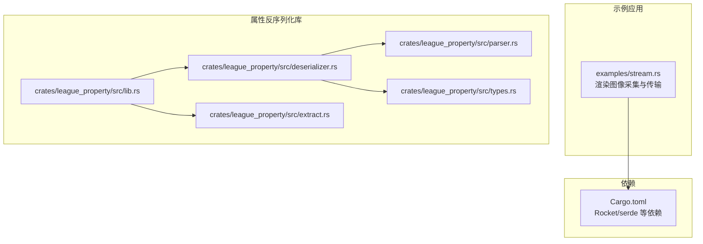
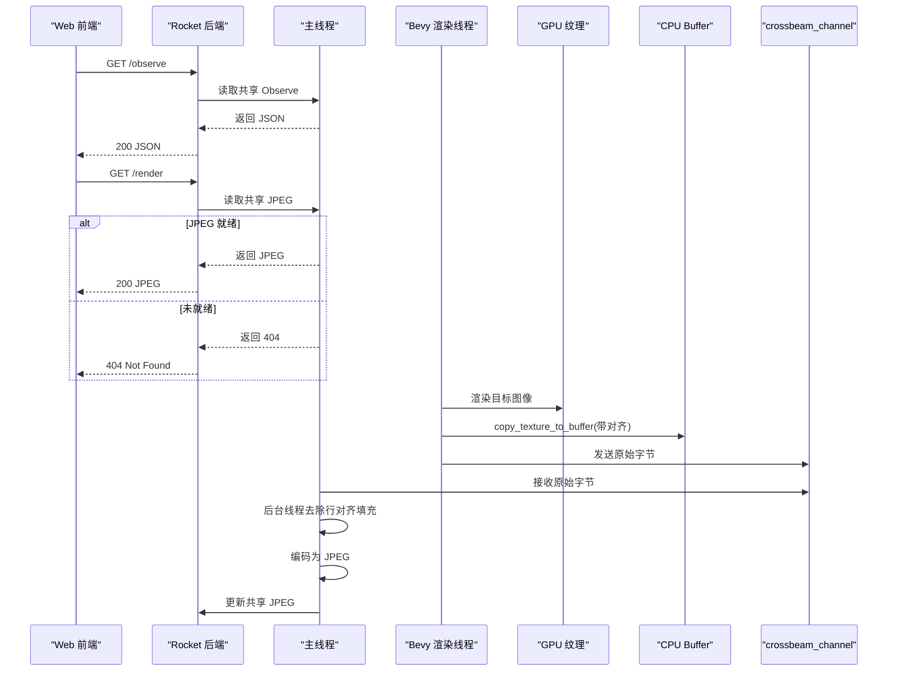
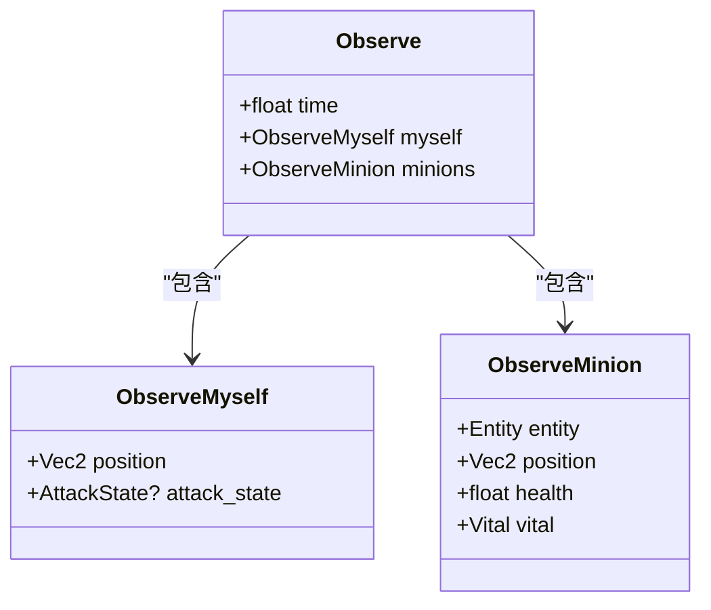
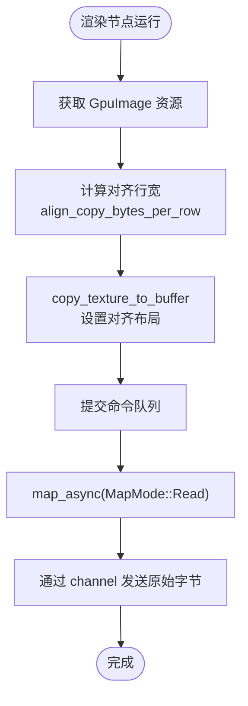
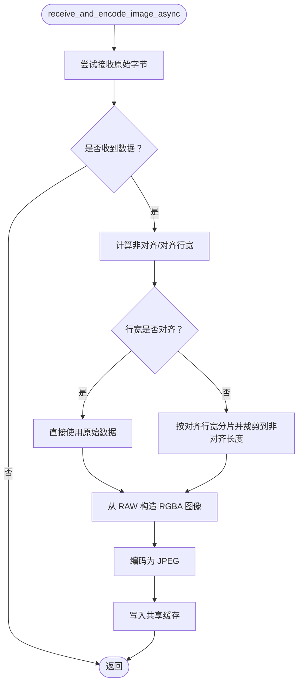
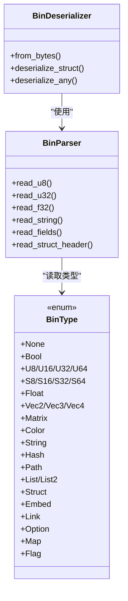
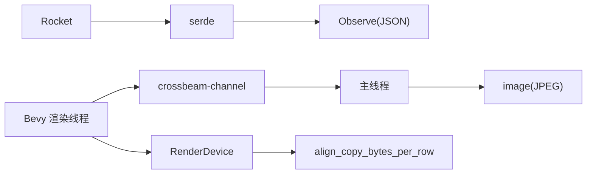

# 数据序列化与传输机制

<cite>
**本文引用的文件**
- [examples/stream.rs](file://examples/stream.rs)
- [crates/league_property/src/deserializer.rs](file://crates/league_property/src/deserializer.rs)
- [crates/league_property/src/parser.rs](file://crates/league_property/src/parser.rs)
- [crates/league_property/src/types.rs](file://crates/league_property/src/types.rs)
- [crates/league_property/src/extract.rs](file://crates/league_property/src/extract.rs)
- [crates/league_property/src/lib.rs](file://crates/league_property/src/lib.rs)
- [Cargo.toml](file://Cargo.toml)
</cite>

## 目录
1. [简介](#简介)
2. [项目结构](#项目结构)
3. [核心组件](#核心组件)
4. [架构总览](#架构总览)
5. [详细组件分析](#详细组件分析)
6. [依赖关系分析](#依赖关系分析)
7. [性能考量](#性能考量)
8. [故障排查指南](#故障排查指南)
9. [结论](#结论)

## 简介
本文件聚焦 moon-lol 项目中“前后端之间”的数据序列化与二进制传输机制，围绕以下目标展开：
- 解析 serde 在 Observe 结构体上的序列化应用，以及前端如何以 JSON 形式获取该观测数据。
- 描述 Bevy 渲染线程如何通过 ImageCopier 组件将 GPU 纹理数据复制到 CPU 可访问 Buffer，并通过 crossbeam_channel 跨线程传递。
- 解释 receive_and_encode_image_async 函数如何在后台线程将 RGBA 原始数据去除行对齐填充后编码为 JPEG 格式。
- 讨论二进制大块数据传输的性能考量，包括 RenderDevice::align_copy_bytes_per_row 的对齐策略与异步处理避免阻塞主循环的设计。

## 项目结构
本仓库采用多 crate 的工作区组织方式，其中与本文主题直接相关的核心模块如下：
- examples/stream.rs：包含渲染管线中的图像采集、跨线程传输与后台编码逻辑，以及 Rocket 后端服务接口。
- crates/league_property：提供二进制属性数据的反序列化能力，用于演示 serde 的使用场景（如 JSON 序列化）。
- 其他 crates：提供游戏资源加载、配置与工具等，不直接影响本文关注的数据序列化与传输路径。

图表来源
- [examples/stream.rs](file://examples/stream.rs#L1-L120)
- [crates/league_property/src/lib.rs](file://crates/league_property/src/lib.rs#L1-L32)
- [crates/league_property/src/deserializer.rs](file://crates/league_property/src/deserializer.rs#L1-L103)
- [crates/league_property/src/parser.rs](file://crates/league_property/src/parser.rs#L53-L195)
- [crates/league_property/src/types.rs](file://crates/league_property/src/types.rs#L1-L158)
- [crates/league_property/src/extract.rs](file://crates/league_property/src/extract.rs#L109-L157)
- [Cargo.toml](file://Cargo.toml#L1-L63)

章节来源
- [Cargo.toml](file://Cargo.toml#L1-L63)

## 核心组件
- Observe 结构体与 serde 序列化
  - Observe 是一个由 serde::Serialize/Deserialize 注解标记的结构体，用于封装观测信息（时间、自身状态、小兵信息），并通过 Rocket 的 JSON 序列化接口对外暴露。
  - 前端通过 GET /observe 获取该 JSON 数据，实现前后端观测数据的同步。
- ImageCopier 与 GPU→CPU Buffer 复制
  - ImageCopier 组件持有 GPU 纹理句柄与 CPU Buffer，渲染阶段通过命令编码器将 GPU 图像拷贝至 Buffer，并设置行对齐参数以满足硬件要求。
- 跨线程传输与后台编码
  - 使用 crossbeam_channel 在渲染世界与主线程之间传递原始图像字节；receive_and_encode_image_async 在后台线程去除行对齐填充并编码为 JPEG，再写回共享缓存供前端拉取。

章节来源
- [examples/stream.rs](file://examples/stream.rs#L255-L327)
- [examples/stream.rs](file://examples/stream.rs#L134-L227)
- [examples/stream.rs](file://examples/stream.rs#L229-L253)
- [examples/stream.rs](file://examples/stream.rs#L422-L482)

## 架构总览
下图展示了从前端请求到后端返回 JPEG 的完整流程，以及渲染线程与主线程之间的协作关系。

图表来源
- [examples/stream.rs](file://examples/stream.rs#L229-L253)
- [examples/stream.rs](file://examples/stream.rs#L302-L315)
- [examples/stream.rs](file://examples/stream.rs#L422-L482)

## 详细组件分析

### Observe 结构体与 serde 序列化
- 结构定义
  - Observe 包含时间戳、自身状态与小兵观测信息，均标注了 serde 的 Serialize/Deserialize，便于 JSON 序列化与反序列化。
- 前端交互
  - Rocket 提供 /observe 接口，直接返回 Json<Observe>，前端可直接消费。
- 与二进制属性反序列化的对比
  - league_property 提供基于二进制格式的反序列化实现（BinType、BinParser、BinDeserializer），用于内部资源数据的高效解析；而 Observe 面向外部 API，采用 JSON 更易集成。

图表来源
- [examples/stream.rs](file://examples/stream.rs#L261-L281)

章节来源
- [examples/stream.rs](file://examples/stream.rs#L261-L281)
- [examples/stream.rs](file://examples/stream.rs#L317-L327)

### Bevy 渲染线程：ImageCopier 与 Buffer 对齐
- ImageCopier 初始化
  - 根据目标尺寸与像素大小计算对齐后的每行字节数，创建可映射读取的 Buffer。
- 渲染阶段复制
  - 通过命令编码器将 GPU 纹理拷贝到 Buffer，并设置 TexelCopyBufferLayout 的 bytes_per_row 为对齐值，确保硬件读取正确性。
- 跨线程传递
  - 使用 crossbeam_channel 发送原始字节，主线程接收后进入后台线程处理。

图表来源
- [examples/stream.rs](file://examples/stream.rs#L134-L160)
- [examples/stream.rs](file://examples/stream.rs#L174-L227)
- [examples/stream.rs](file://examples/stream.rs#L229-L253)

章节来源
- [examples/stream.rs](file://examples/stream.rs#L134-L160)
- [examples/stream.rs](file://examples/stream.rs#L174-L227)
- [examples/stream.rs](file://examples/stream.rs#L229-L253)

### 后台线程：去除行对齐填充与 JPEG 编码
- 接收与校验
  - 从 MainWorldReceiver 接收原始字节，若为空则跳过。
- 行对齐处理
  - 计算非对齐行宽与对齐行宽，若不一致，则按对齐行宽分片取出非对齐行宽长度的数据，拼接为最终的 RGBA 原始数据。
- 编码为 JPEG
  - 使用 image crate 的 JPEG 编码器将 RGBA 图像编码为 JPEG 流，并写入共享缓存供前端拉取。

图表来源
- [examples/stream.rs](file://examples/stream.rs#L422-L482)

章节来源
- [examples/stream.rs](file://examples/stream.rs#L422-L482)

### 二进制属性反序列化（serde 之外的序列化）
虽然本文重点是 Observe 的 JSON 序列化与图像传输，但 league_property 展示了另一种二进制序列化方案：
- 类型系统与解析器
  - BinType 定义了基础与复合类型的二进制表示；BinParser 负责从字节流中读取具体值；BinDeserializer 实现 serde 的反序列化接口，将二进制数据映射为 Rust 结构体或枚举。
- 生成与合并
  - extract 模块根据输入数据自动推断结构与枚举集合，生成可 derive Serialize/Deserialize 的 Rust 类型定义，便于后续 serde 序列化。

图表来源
- [crates/league_property/src/types.rs](file://crates/league_property/src/types.rs#L120-L158)
- [crates/league_property/src/parser.rs](file://crates/league_property/src/parser.rs#L53-L195)
- [crates/league_property/src/deserializer.rs](file://crates/league_property/src/deserializer.rs#L1-L103)

章节来源
- [crates/league_property/src/lib.rs](file://crates/league_property/src/lib.rs#L1-L32)
- [crates/league_property/src/deserializer.rs](file://crates/league_property/src/deserializer.rs#L1-L103)
- [crates/league_property/src/parser.rs](file://crates/league_property/src/parser.rs#L150-L195)
- [crates/league_property/src/types.rs](file://crates/league_property/src/types.rs#L1-L158)
- [crates/league_property/src/extract.rs](file://crates/league_property/src/extract.rs#L109-L157)

## 依赖关系分析
- Rocket 与 serde
  - Rocket 提供 JSON 序列化/反序列化能力，配合 serde 的 Serialize/Deserialize 注解，简化了 /observe 接口的实现。
- image 与 JPEG 编码
  - image crate 提供 JPEG 编码器，用于将 RGBA 原始数据编码为 JPEG 流。
- crossbeam-channel
  - 在渲染世界与主线程之间传递原始图像字节，避免阻塞渲染循环。
- Bevy 渲染设备
  - RenderDevice::align_copy_bytes_per_row 保证拷贝时的行对齐，提高 GPU→CPU 传输效率与兼容性。

图表来源
- [Cargo.toml](file://Cargo.toml#L44-L63)
- [examples/stream.rs](file://examples/stream.rs#L302-L315)
- [examples/stream.rs](file://examples/stream.rs#L422-L482)

章节来源
- [Cargo.toml](file://Cargo.toml#L44-L63)
- [examples/stream.rs](file://examples/stream.rs#L302-L315)
- [examples/stream.rs](file://examples/stream.rs#L422-L482)

## 性能考量
- Buffer 对齐策略
  - 使用 RenderDevice::align_copy_bytes_per_row 计算对齐行宽，避免因行对齐不足导致的 GPU 读取异常或性能下降。
- 异步处理避免阻塞
  - 渲染线程通过 map_async 异步映射 Buffer，主线程在后台线程进行去填充与 JPEG 编码，避免阻塞主循环。
- 大块数据传输
  - 原始图像数据量较大，采用分片裁剪与一次性编码的方式减少内存占用与拷贝次数。
- 前端拉取模式
  - /render 接口采用拉取模式，前端按需获取 JPEG，降低服务器压力。

章节来源
- [examples/stream.rs](file://examples/stream.rs#L134-L160)
- [examples/stream.rs](file://examples/stream.rs#L229-L253)
- [examples/stream.rs](file://examples/stream.rs#L422-L482)

## 故障排查指南
- /observe 返回 404
  - 当共享 Observe 尚未生成时，后端会返回 404。确认主线程已调用 get_observe 并更新共享缓存。
- /render 返回 404
  - 当共享 JPEG 尚未生成或为空时，后端返回 404。检查 receive_and_encode_image_async 是否成功去除行对齐并编码。
- 行对齐问题
  - 若图像出现横向条纹或尺寸异常，检查 align_copy_bytes_per_row 的计算与 TexelCopyBufferLayout 的 bytes_per_row 设置。
- 传输阻塞
  - 若渲染卡顿，确认 map_async 的等待与 unmap 的调用顺序正确，避免长时间占用 GPU 资源。

章节来源
- [examples/stream.rs](file://examples/stream.rs#L302-L315)
- [examples/stream.rs](file://examples/stream.rs#L422-L482)
- [examples/stream.rs](file://examples/stream.rs#L229-L253)

## 结论
moon-lol 项目在前后端数据传输方面采用了清晰的分层设计：
- 观测数据通过 serde JSON 暴露，便于前端集成；
- 渲染图像通过 ImageCopier 与对齐策略保障 GPU→CPU 传输的稳定性；
- 使用 crossbeam_channel 与后台线程完成去填充与 JPEG 编码，避免阻塞主循环；
- 二进制属性反序列化（league_property）展示了另一种高效的序列化路径，适用于内部资源数据的解析与生成。