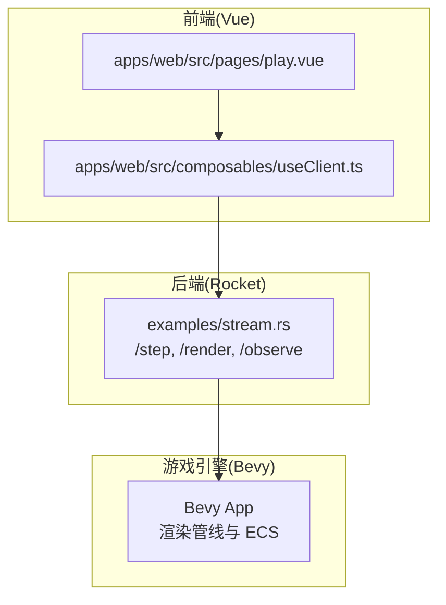
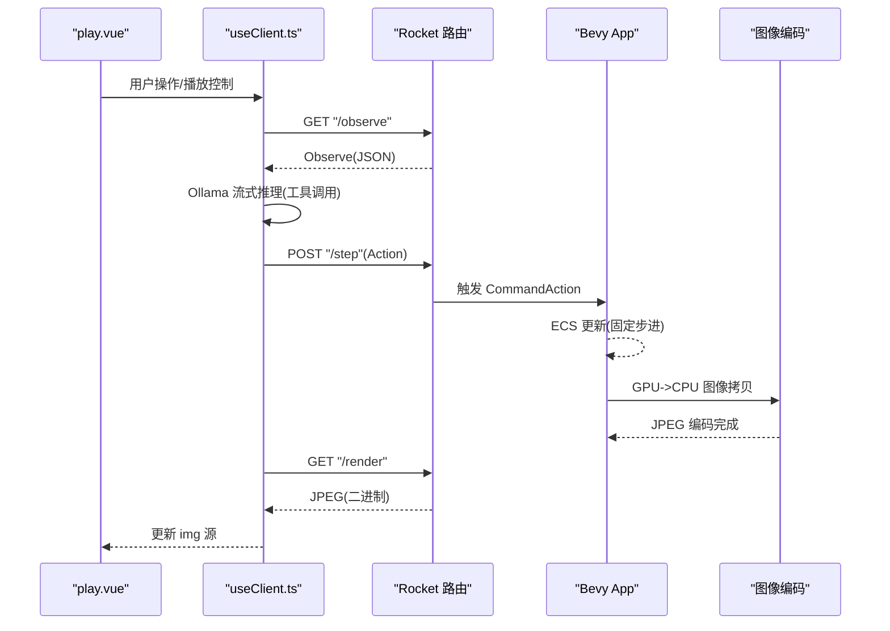
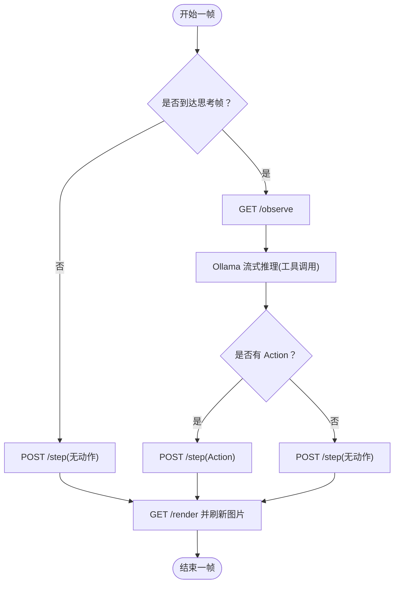
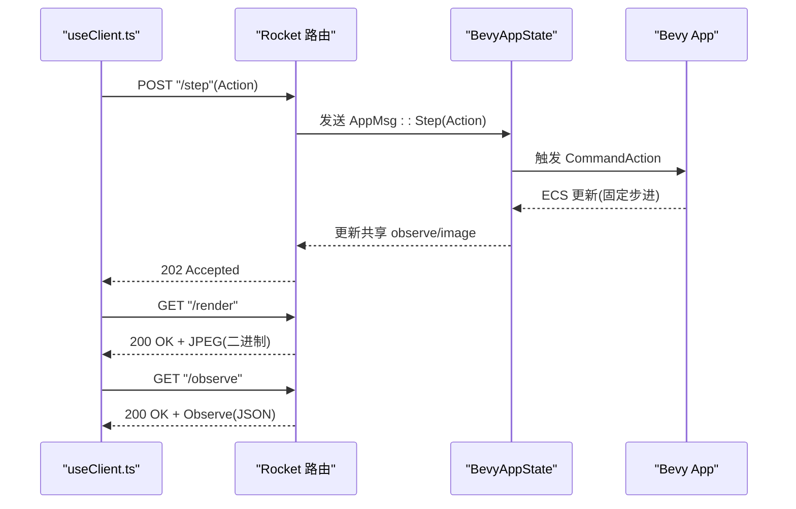
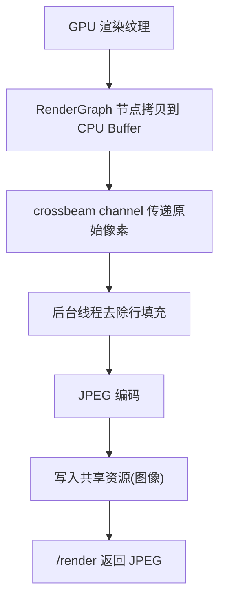
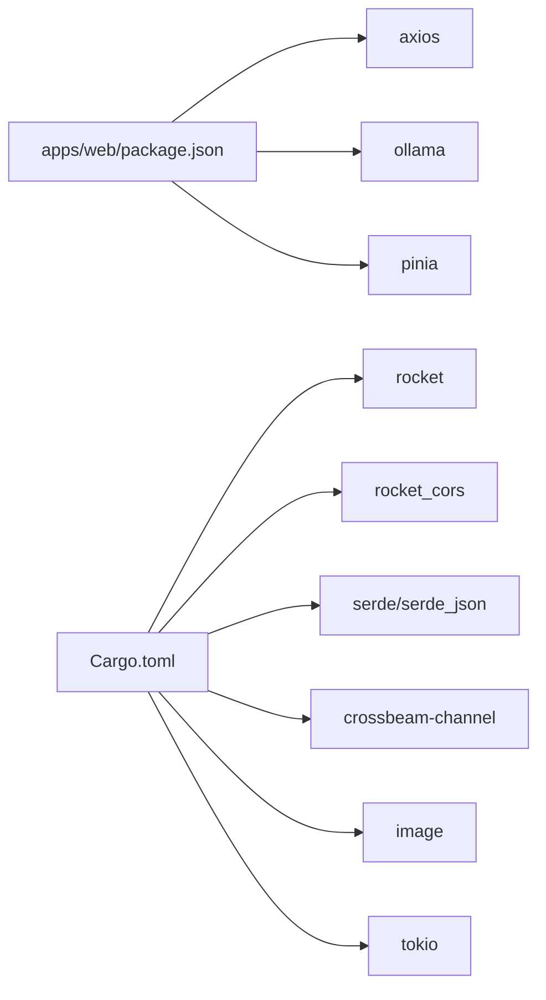

# 数据流与通信机制

<cite>
**本文引用的文件**
- [useClient.ts](file://apps/web/src/composables/useClient.ts)
- [stream.rs](file://examples/stream.rs)
- [main.rs](file://src/main.rs)
- [action.rs](file://src/core/action.rs)
- [attack.rs](file://src/core/attack.rs)
- [play.vue](file://apps/web/src/pages/play.vue)
- [Cargo.toml](file://Cargo.toml)
- [package.json](file://apps/web/package.json)
</cite>

## 目录
1. [引言](#引言)
2. [项目结构](#项目结构)
3. [核心组件](#核心组件)
4. [架构总览](#架构总览)
5. [详细组件分析](#详细组件分析)
6. [依赖关系分析](#依赖关系分析)
7. [性能考量](#性能考量)
8. [故障排查指南](#故障排查指南)
9. [结论](#结论)
10. [附录](#附录)

## 引言
本文件聚焦 moon-lol 项目中“前端 Vue 应用与后端 Bevy 引擎”的实时通信机制，围绕基于 Rocket 框架实现的 HTTP API（/step、/render、/observe）进行深入解析。内容涵盖：
- 请求-响应数据格式设计与 serde 序列化处理
- 二进制图像数据传输优化策略（GPU->CPU->JPEG 编码）
- 基于 examples/stream.rs 的服务端流式处理逻辑
- 通信延迟、数据一致性与错误重试机制的设计思路
- 客户端 useClient.ts 中 API 调用的完整示例与最佳实践
- WebSocket 替代方案的可行性与实现路径

## 项目结构
moon-lol 采用多 crate 的 Rust 工作区组织，前端 Vue 应用位于 apps/web，后端游戏逻辑与 Rocket 服务由 examples/stream.rs 提供。核心通信通过 HTTP API 完成，前端以 axios 发起请求，后端以 Rocket 路由暴露接口，Bevy 负责渲染与游戏状态更新。

图表来源
- [useClient.ts](file://apps/web/src/composables/useClient.ts#L1-L232)
- [stream.rs](file://examples/stream.rs#L286-L327)
- [play.vue](file://apps/web/src/pages/play.vue#L1-L298)

章节来源
- [useClient.ts](file://apps/web/src/composables/useClient.ts#L1-L232)
- [stream.rs](file://examples/stream.rs#L286-L327)
- [play.vue](file://apps/web/src/pages/play.vue#L1-L298)

## 核心组件
- 前端客户端 useClient.ts
  - 提供 axios 实例与 baseURL 配置
  - 定义 Action、Observe 类型
  - 实现 /step、/render、/observe 的调用流程
  - 集成 Ollama 流式推理，按 chunk 解析工具调用并生成 Action
  - 控制循环 play()/step()，帧计数与思考间隔

- 后端 Rocket 路由
  - /step: 接收 Action 并转发至 Bevy ECS
  - /render: 返回 JPEG 图像
  - /observe: 返回游戏观察数据 Observe

- Bevy 游戏状态
  - 通过 ECS 组件与事件驱动 Action 执行
  - 通过 GPU->CPU 图像拷贝与 JPEG 编码输出

章节来源
- [useClient.ts](file://apps/web/src/composables/useClient.ts#L1-L232)
- [stream.rs](file://examples/stream.rs#L286-L327)
- [action.rs](file://src/core/action.rs#L43-L96)
- [attack.rs](file://src/core/attack.rs#L44-L105)

## 架构总览
下图展示从前端到后端再到游戏引擎的数据流与控制流。

图表来源
- [useClient.ts](file://apps/web/src/composables/useClient.ts#L152-L205)
- [stream.rs](file://examples/stream.rs#L286-L327)
- [action.rs](file://src/core/action.rs#L43-L96)
- [attack.rs](file://src/core/attack.rs#L233-L277)

## 详细组件分析

### 前端 useClient.ts 通信流程
- /observe
  - 调用 GET /observe，返回 Observe 对象，包含时间戳、自身位置与攻击状态、敌方小兵信息等
  - 在 play 循环中按 thinkFrame 周期性拉取，作为 AI 推理输入
- /step
  - 若存在 Action，则 POST /step(Action)
  - 若无 Action，仍会 POST /step 以推进游戏步进
  - 错误捕获：若推理或网络异常，回退为无动作步进
- /render
  - 调用 GET /render 获取 JPEG 图像
  - 通过 img URL 带上时间戳参数，避免浏览器缓存

图表来源
- [useClient.ts](file://apps/web/src/composables/useClient.ts#L152-L205)

章节来源
- [useClient.ts](file://apps/web/src/composables/useClient.ts#L1-L232)
- [play.vue](file://apps/web/src/pages/play.vue#L1-L298)

### 后端 Rocket 路由与数据模型
- /step
  - 接收 Action(JSON) 并通过 crossbeam channel 发送 AppMsg::Step
  - 成功返回 Accepted；发送失败返回 InternalServerError
- /render
  - 从共享资源读取 JPEG 图像字节，返回 Content-Type: image/jpeg
  - 若图像未就绪，返回 Not Found
- /observe
  - 从共享资源读取 Observe，返回 JSON
  - 若未就绪，返回 Not Found

图表来源
- [stream.rs](file://examples/stream.rs#L286-L327)
- [stream.rs](file://examples/stream.rs#L336-L403)

章节来源
- [stream.rs](file://examples/stream.rs#L286-L327)
- [stream.rs](file://examples/stream.rs#L336-L403)

### 游戏状态序列化与推送
- Observe 数据结构
  - 包含时间戳、自身位置与攻击状态、敌方小兵实体、位置、血量与 Vital 等
  - 通过 serde 进行序列化，供前端消费
- Action 数据结构
  - 支持 Attack、Move、Stop、Skill、SkillLevelUp 等枚举变体
  - 通过 serde JSON 传输，后端转换为 ECS 事件 CommandAction
- 图像流式推送
  - Bevy 使用 RenderGraph 节点将 GPU 图像拷贝到 CPU Buffer
  - 通过 crossbeam channel 将原始像素数据传给主线程
  - 后台线程去除行填充并编码为 JPEG，写入共享资源供 /render 返回

图表来源
- [stream.rs](file://examples/stream.rs#L174-L227)
- [stream.rs](file://examples/stream.rs#L229-L253)
- [stream.rs](file://examples/stream.rs#L422-L482)

章节来源
- [stream.rs](file://examples/stream.rs#L261-L281)
- [stream.rs](file://examples/stream.rs#L422-L482)

### 通信延迟、一致性与错误重试
- 延迟控制
  - 前端通过 thinkFrame 控制推理频率，降低网络与推理开销
  - /render 采用带时间戳的 URL，避免缓存导致的旧帧显示
- 数据一致性
  - /observe 与 /render 读取共享资源，需确保在同一次 ECS 更新周期内生成
  - 后端在每次 update 结束后更新 observe 与图像，保证前后一致
- 错误重试
  - 前端在推理或网络异常时回退为无动作步进，保证系统可用性
  - /render 未就绪返回 404，前端可稍后重试或提示用户刷新

章节来源
- [useClient.ts](file://apps/web/src/composables/useClient.ts#L152-L205)
- [stream.rs](file://examples/stream.rs#L378-L403)

### 客户端 API 调用示例（路径指引）
- 获取观察数据
  - 路径: GET /observe
  - 返回: Observe(JSON)
  - 示例: [useClient.ts](file://apps/web/src/composables/useClient.ts#L62-L65)
- 发送动作
  - 路径: POST /step
  - 负载: Action(JSON)
  - 示例: [useClient.ts](file://apps/web/src/composables/useClient.ts#L179-L180)
- 获取渲染图像
  - 路径: GET /render
  - 返回: JPEG(二进制)
  - 示例: [useClient.ts](file://apps/web/src/composables/useClient.ts#L152-L155)

章节来源
- [useClient.ts](file://apps/web/src/composables/useClient.ts#L62-L65)
- [useClient.ts](file://apps/web/src/composables/useClient.ts#L152-L180)

### WebSocket 替代方案（可行性与实现路径）
- 可行性
  - 优势：更低延迟、持续双向流、更自然的“流式”体验
  - 需要：后端 Rocket 需支持 WebSocket，前端引入 ws 客户端
- 实现路径
  - 后端
    - 在 examples/stream.rs 中新增 WebSocket 路由，向客户端推送 /observe 与 /render
    - 保持现有 /step 作为命令入口，或改为 WS 命令
  - 前端
    - 在 useClient.ts 中建立 ws 连接，订阅 observe 与图像流
    - 保留 /step 的 HTTP 调用用于显式动作提交
- 注意事项
  - 与现有 /render 的二进制 JPEG 传输不同，WS 可以直接传输二进制帧
  - 需要处理连接断开、重连与背压

[本节为概念性建议，不直接映射具体源码文件]

## 依赖关系分析
- 前端依赖
  - axios: HTTP 客户端
  - ollama: 流式推理与工具调用
  - pinia: 状态管理
- 后端依赖
  - rocket: Web 框架与路由
  - rocket_cors: 跨域支持
  - serde/serde_json: JSON 序列化
  - crossbeam-channel: 线程间消息传递
  - image: JPEG 编码
  - tokio: 异步运行时

图表来源
- [package.json](file://apps/web/package.json#L1-L53)
- [Cargo.toml](file://Cargo.toml#L1-L63)

章节来源
- [package.json](file://apps/web/package.json#L1-L53)
- [Cargo.toml](file://Cargo.toml#L1-L63)

## 性能考量
- 图像传输优化
  - GPU->CPU 拷贝与 JPEG 编码在后台线程执行，避免阻塞主线程
  - 行填充去除与内存拷贝尽量一次性完成，减少中间分配
- 网络与推理
  - thinkFrame 控制推理频率，平衡延迟与吞吐
  - /render 使用时间戳参数避免缓存，确保前端看到最新帧
- ECS 固定步进
  - 后端以固定时间步长更新，保证物理与动画一致性

[本节提供通用指导，不直接分析具体文件]

## 故障排查指南
- /render 返回 404
  - 可能原因：图像尚未生成或编码失败
  - 建议：稍后重试 GET /render；检查后台线程是否成功去除行填充并编码
  - 参考: [stream.rs](file://examples/stream.rs#L302-L315)
- /observe 返回 404
  - 可能原因：ECS 查询不到所需组件
  - 建议：确认 Controller、Transform、Health、Vital 等组件是否存在
  - 参考: [stream.rs](file://examples/stream.rs#L317-L327)
- /step 返回 500
  - 可能原因：crossbeam channel 发送失败
  - 建议：检查后端线程是否仍在运行，通道容量是否足够
  - 参考: [stream.rs](file://examples/stream.rs#L286-L300)
- 前端推理异常
  - 可能原因：Ollama 流式响应解析失败
  - 建议：降级为无动作步进，检查工具函数定义与参数
  - 参考: [useClient.ts](file://apps/web/src/composables/useClient.ts#L67-L105)

章节来源
- [stream.rs](file://examples/stream.rs#L286-L327)
- [useClient.ts](file://apps/web/src/composables/useClient.ts#L67-L105)

## 结论
moon-lol 通过 Rocket 暴露简洁的 HTTP API，结合 Bevy 的 ECS 与渲染管线，实现了从前端到游戏引擎的高效数据流与控制流。/step、/render、/observe 三者协同工作，既满足了低延迟的交互需求，又通过 serde 与 JPEG 编码保障了数据与媒体的高效传输。未来可在保持现有 API 的基础上，引入 WebSocket 以进一步降低延迟并提供更自然的流式体验。

## 附录
- 关键类型与组件
  - Action: [action.rs](file://src/core/action.rs#L49-L56)
  - AttackState/AttackStatus: [attack.rs](file://src/core/attack.rs#L57-L76)
  - Observe/ObserveMyself/ObserveMinion: [stream.rs](file://examples/stream.rs#L261-L281)