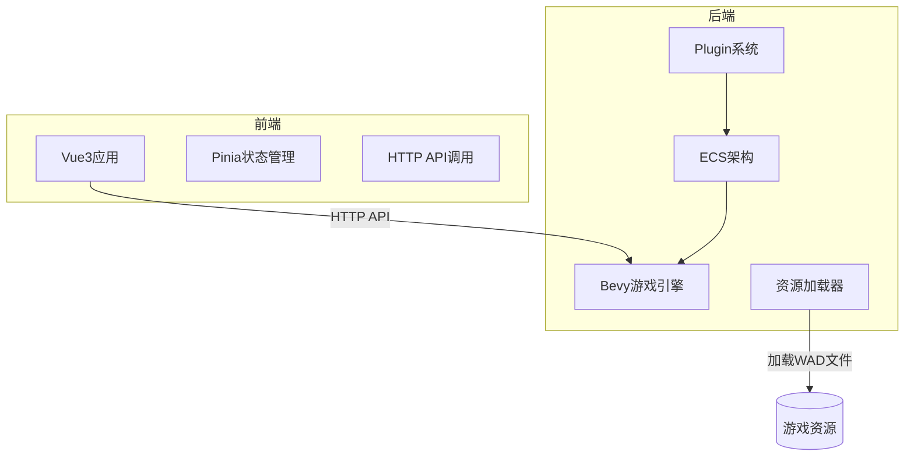
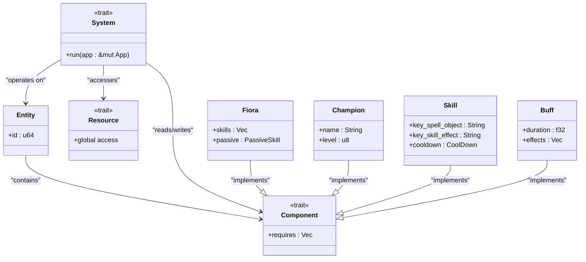
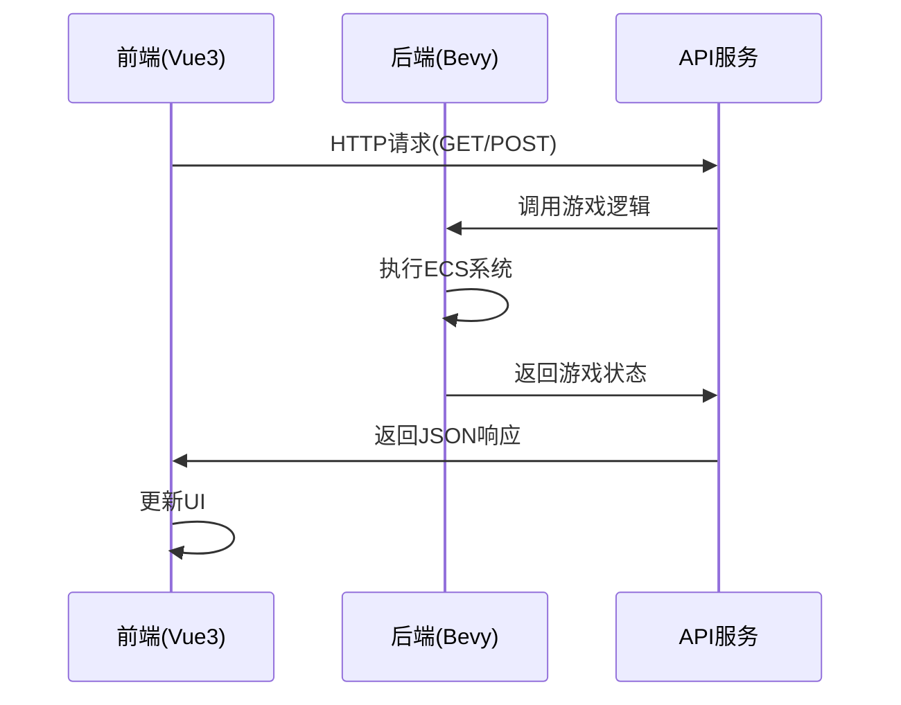
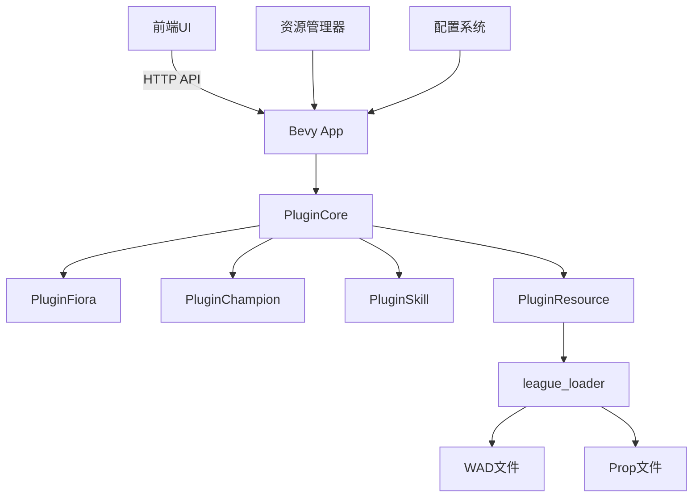
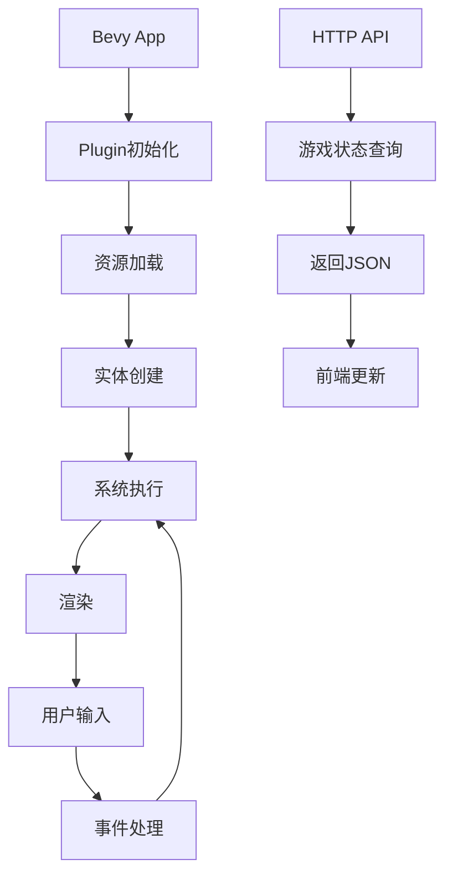
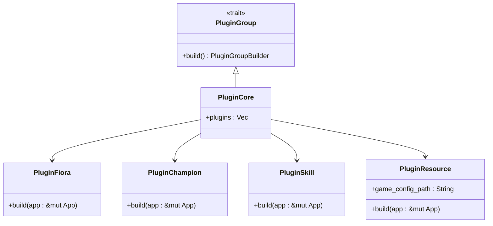

# 架构设计

<cite>
**本文档引用的文件**  
- [main.rs](file://src/main.rs)
- [lib.rs](file://src/lib.rs)
- [Cargo.toml](file://Cargo.toml)
- [game.rs](file://crates/league_loader/src/game.rs)
- [fiora.rs](file://src/entities/champions/fiora.rs)
- [base.rs](file://src/core/base.rs)
- [shader.rs](file://src/core/resource/shader.rs)
- [lib.rs](file://crates/league_loader/src/lib.rs)
- [lib.rs](file://crates/lol_config/src/lib.rs)
- [main.ts](file://apps/web/src/main.ts)
- [package.json](file://apps/web/package.json)
</cite>

## 目录
1. [简介](#简介)
2. [项目结构](#项目结构)
3. [核心架构](#核心架构)
4. [ECS架构详解](#ecs架构详解)
5. [前后端通信机制](#前后端通信机制)
6. [系统上下文图](#系统上下文图)
7. [组件交互图](#组件交互图)
8. [插件化设计](#插件化设计)
9. [技术选型分析](#技术选型分析)
10. [结论](#结论)

## 简介
moon-lol项目是一个基于Rust和Bevy游戏引擎的英雄联盟模拟器，采用前后端分离架构。后端使用Bevy引擎实现游戏逻辑，前端使用Vue3构建用户界面。本架构设计文档详细描述了系统的整体架构、ECS设计模式、前后端通信机制以及技术选型背后的决策。

## 项目结构
项目采用多模块工作区结构，包含前端Web应用和多个Rust crate。主要目录包括：
- `apps/web/`: Vue3前端应用
- `crates/`: 可复用的Rust库模块
- `src/`: 主要游戏逻辑和Bevy应用
- `examples/`: 示例代码
- `tests/`: 测试代码

**系统架构图**

**图示来源**
- [main.ts](file://apps/web/src/main.ts)
- [main.rs](file://src/main.rs)

**本节来源**
- [Cargo.toml](file://Cargo.toml)
- [package.json](file://apps/web/package.json)

## 核心架构
moon-lol项目采用前后端分离架构，后端基于Bevy游戏引擎构建，使用ECS（实体-组件-系统）架构模式。前端使用Vue3框架，通过HTTP API与后端进行通信。这种架构设计实现了关注点分离，提高了开发效率和系统可维护性。

**本节来源**
- [main.rs](file://src/main.rs)
- [main.ts](file://apps/web/src/main.ts)

## ECS架构详解
Bevy引擎的核心是ECS架构模式，它将游戏对象分解为实体（Entity）、组件（Component）和系统（System），并使用资源（Resource）管理全局状态。

### 实体（Entity）
实体是游戏世界中的基本对象标识符，本身不包含数据，而是作为组件的容器。例如，`Fiora`结构体被定义为一个组件，附加到实体上表示一个 Fiora 角色。

### 组件（Component）
组件是数据的容器，描述实体的特定方面。在moon-lol中，组件包括：
- `Fiora`: 表示Fiora角色的组件
- `Champion`: 表示冠军角色的通用组件
- `Skill`: 技能组件
- `Buff`: 增益效果组件

### 系统（System）
系统是处理逻辑的函数，操作具有特定组件组合的实体。系统在固定的时间步长中执行，确保游戏逻辑的一致性。例如，`startup_load_assets`系统在启动时加载Fiora技能的资源。

### 资源（Resource）
资源是全局可访问的数据，用于存储跨系统共享的状态。例如，`ResourceShaderHandles`资源管理着色器句柄，`Assets`资源管理器存储加载的游戏资源。

**图示来源**
- [fiora.rs](file://src/entities/champions/fiora.rs)
- [base.rs](file://src/core/base.rs)

**本节来源**
- [lib.rs](file://src/lib.rs)
- [core.rs](file://src/core.rs)

## 前后端通信机制
前端Vue3应用通过HTTP API与后端Bevy应用进行通信。后端使用Rocket框架提供RESTful接口，前端使用Axios库发起HTTP请求。

**图示来源**
- [main.ts](file://apps/web/src/main.ts)
- [server.rs](file://src/server.rs)

**本节来源**
- [package.json](file://apps/web/package.json)
- [Cargo.toml](file://Cargo.toml)

## 系统上下文图

**图示来源**
- [main.rs](file://src/main.rs)
- [game.rs](file://crates/league_loader/src/game.rs)

## 组件交互图

**图示来源**
- [main.rs](file://src/main.rs)
- [lib.rs](file://crates/league_loader/src/lib.rs)

## 插件化设计
项目采用插件化设计，通过`PluginGroup`实现功能模块化。`PluginCore`结构体定义了所有核心插件，包括角色插件、技能插件、系统插件等。

**图示来源**
- [lib.rs](file://src/lib.rs)
- [main.rs](file://src/main.rs)

**本节来源**
- [lib.rs](file://src/lib.rs)

## 技术选型分析
### Bevy引擎优势
- **数据驱动架构**: ECS模式天然适合游戏开发
- **高性能**: Rust语言保证了内存安全和高性能
- **模块化**: 插件系统支持功能扩展
- **跨平台**: 支持多种平台部署

### Rust语言考量
- **内存安全**: 编译时检查避免常见内存错误
- **性能**: 零成本抽象，接近C++的性能
- **并发安全**: 所有权系统防止数据竞争
- **生态系统**: 丰富的crate库支持

### 前后端分离影响
- **开发效率**: 前后端团队可以并行开发
- **可维护性**: 关注点分离，代码更清晰
- **可扩展性**: 可以独立扩展前后端
- **技术栈灵活性**: 可以选择最适合的技术

**本节来源**
- [Cargo.toml](file://Cargo.toml)
- [package.json](file://apps/web/package.json)

## 结论
moon-lol项目通过采用Bevy引擎的ECS架构和前后端分离设计，构建了一个高性能、可扩展的游戏模拟器。ECS模式使得游戏逻辑清晰、易于扩展，插件化设计支持功能模块化，前后端分离提高了开发效率。Rust语言的选择确保了系统的性能和安全性，Vue3前端提供了现代化的用户界面。这种架构设计为项目的长期发展奠定了坚实的基础。