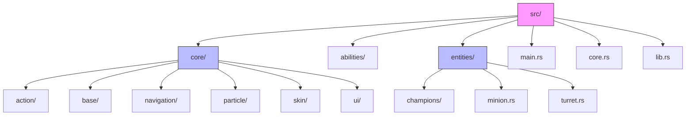
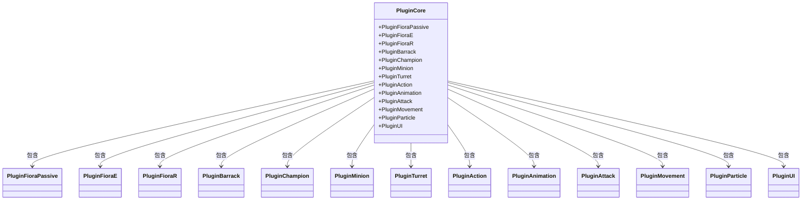
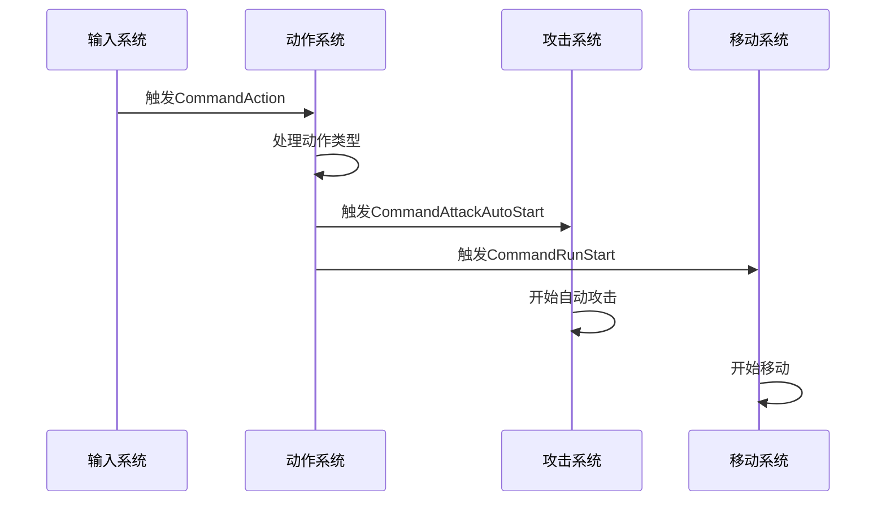
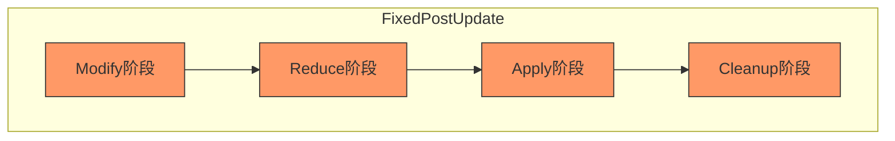

# ECS架构与插件系统

<cite>
**本文档引用的文件**   
- [main.rs](file://src/main.rs)
- [core.rs](file://src/core.rs)
- [lib.rs](file://src/lib.rs)
- [controller.rs](file://src/core/controller.rs)
- [action.rs](file://src/core/action.rs)
- [base/state.rs](file://src/core/base/state.rs)
- [cooldown.rs](file://src/core/cooldown.rs)
- [base/pipeline.rs](file://src/core/base/pipeline.rs)
- [particle.rs](file://src/core/particle.rs)
- [skin/particle.rs](file://src/core/skin/particle.rs)
- [resource.rs](file://src/core/resource.rs)
- [register.rs](file://crates/lol_config/src/register.rs)
</cite>

## 目录
1. [项目结构](#项目结构)
2. [Bevy应用初始化与插件注册](#bevy应用初始化与插件注册)
3. [核心插件组PluginCore解析](#核心插件组plugincore解析)
4. [系统、组件与资源的交互模式](#系统组件与资源的交互模式)
5. [命令缓冲在跨系统通信中的作用](#命令缓冲在跨系统通信中的作用)
6. [插件化设计的模块解耦优势](#插件化设计的模块解耦优势)
7. [功能定制与特性开关](#功能定制与特性开关)
8. [自定义系统调度与并行执行](#自定义系统调度与并行执行)
9. [依赖管理最佳实践](#依赖管理最佳实践)

## 项目结构

项目采用典型的Rust工作区结构，包含多个crates和应用模块。ECS核心逻辑位于`src/`目录下，遵循功能模块化组织。



**图示来源**
- [main.rs](file://src/main.rs)
- [core.rs](file://src/core.rs)

**本节来源**
- [main.rs](file://src/main.rs)
- [core.rs](file://src/core.rs)

## Bevy应用初始化与插件注册

项目通过`main.rs`文件中的`main()`函数启动Bevy应用。应用初始化采用显式插件注册方式，而非使用`PluginCore`插件组批量注册，以实现更精细的控制。

```rust
let mut app = App::new();
app.add_plugins(DefaultPlugins);
// 显式逐个添加核心插件...
app.run();
```

此初始化过程首先创建`App`实例，然后添加Bevy默认插件集，最后通过`add_plugins()`方法逐个注册自定义功能插件，最终调用`run()`启动应用循环。

**本节来源**
- [main.rs](file://src/main.rs#L76-L114)

## 核心插件组PluginCore解析

`PluginCore`是一个通过`plugin_group!`宏定义的插件组，集中管理了游戏的所有功能插件。该插件组在`lib.rs`和`main.rs`中均有定义，包含三大类插件：

1. **英雄专属插件**: `PluginFioraPassive`, `PluginFioraE`, `PluginFioraR`等
2. **实体类型插件**: `PluginBarrack`, `PluginChampion`, `PluginMinion`, `PluginTurret`等
3. **功能系统插件**: `PluginAction`, `PluginAnimation`, `PluginAttack`, `PluginMovement`等

每个插件都实现了Bevy的`Plugin` trait，在`build()`方法中注册相关的系统、资源和事件处理器。



**图示来源**
- [lib.rs](file://src/lib.rs#L15-L58)
- [main.rs](file://src/main.rs#L16-L54)

**本节来源**
- [lib.rs](file://src/lib.rs#L15-L58)
- [main.rs](file://src/main.rs#L16-L54)

## 系统、组件与资源的交互模式

项目遵循ECS（实体-组件-系统）架构范式，三者通过Bevy的ECS框架紧密协作。

**组件（Component）** 作为数据标记附加到实体上，如`Controller`组件存储玩家输入配置：

```rust
#[derive(Component, Reflect)]
pub struct Controller {
    attack_key: KeyCode,
    stop_key: KeyCode,
    skill_key_map: HashMap<usize, KeyCode>,
}
```

**系统（System）** 是无状态的函数，通过查询特定组件的实体来执行逻辑。例如`on_key_pressed`系统处理用户输入：

```rust
pub fn on_key_pressed(
    mut commands: Commands,
    res_input: Res<ButtonInput<KeyCode>>,
    q_controller: Query<(Entity, &Team, &Controller)>,
) {
    // 处理按键输入并触发相应动作
}
```

**资源（Resource）** 是全局单例数据，通过`Res<T>`或`ResMut<T>`访问。如`LeagueProperties`资源存储游戏配置。

三者交互通过Bevy的查询系统实现，系统可以同时访问组件、资源和命令队列，形成完整的数据处理闭环。

**本节来源**
- [controller.rs](file://src/core/controller.rs)
- [action.rs](file://src/core/action.rs)
- [base/state.rs](file://src/core/base/state.rs)

## 命令缓冲在跨系统通信中的作用

命令缓冲（Commands）是Bevy ECS中实现跨系统安全通信的核心机制。由于系统并行执行，直接修改世界状态会导致数据竞争，因此Bevy采用命令模式延迟执行实体操作。

在本项目中，命令缓冲广泛用于事件驱动的系统交互。例如`CommandAction`事件触发后，`on_command_action`系统使用`commands.trigger()`分发下游命令：

```rust
fn on_command_action(trigger: On<CommandAction>, mut commands: Commands) {
    match trigger.action {
        Action::Attack(target) => {
            commands.trigger(CommandAttackAutoStart { entity, target });
        }
        Action::Move(target) => {
            commands.trigger(CommandRunStart { entity, target: RunTarget::Position(target) });
        }
        // ...其他动作
    }
}
```

这种模式实现了松耦合的系统通信，上游系统只需发出命令，下游系统监听并处理，无需直接依赖。



**图示来源**
- [action.rs](file://src/core/action.rs#L43-L97)
- [controller.rs](file://src/core/controller.rs#L53-L132)

**本节来源**
- [action.rs](file://src/core/action.rs#L43-L97)
- [controller.rs](file://src/core/controller.rs#L53-L132)

## 插件化设计的模块解耦优势

项目的插件化设计实现了高度的模块解耦，每个功能模块封装为独立的`Plugin`，具有以下优势：

1. **关注点分离**: 每个插件负责单一功能，如`PluginController`仅处理输入，`PluginCooldown`仅管理冷却
2. **可组合性**: 插件可以灵活组合，通过`add_plugins()`按需加载
3. **可测试性**: 每个插件可独立测试，无需加载整个游戏系统
4. **可维护性**: 功能修改局限在单个插件内，降低变更风险

例如`PluginState`插件仅负责状态管理，通过监听事件更新`State`组件：

```rust
impl Plugin for PluginState {
    fn build(&self, app: &mut App) {
        app.add_observer(on_run_start);
        app.add_observer(on_run_end);
        app.add_observer(on_command_attack_start);
    }
}
```

这种设计使得状态逻辑与具体动作解耦，任何系统都可以通过触发事件来改变实体状态。

**本节来源**
- [base/state.rs](file://src/core/base/state.rs)
- [cooldown.rs](file://src/core/cooldown.rs)
- [controller.rs](file://src/core/controller.rs)

## 功能定制与特性开关

项目通过Rust的特性（features）和条件编译实现功能定制。在`main.rs`中，部分插件被注释掉，实现功能开关：

```rust
// app.add_plugins(PluginParticle);
// app.add_plugins(PluginUI);
```

此外，通过插件配置参数实现运行时定制，如`PluginResource`接受游戏配置路径：

```rust
app.add_plugins(PluginResource {
    game_config_path: "games/null.ron".to_owned(),
});
```

在`crates/lol_config/src/register.rs`中，`init_league_asset`函数注册了多种资源类型，通过条件编译可选择性初始化特定资源，实现按需加载。

**本节来源**
- [main.rs](file://src/main.rs#L102-L111)
- [resource.rs](file://src/core/resource.rs)
- [register.rs](file://crates/lol_config/src/register.rs#L69-L87)

## 自定义系统调度与并行执行

项目利用Bevy的系统调度器实现精确的执行顺序控制。通过`add_systems()`指定系统执行阶段，如`PreUpdate`、`FixedUpdate`等。

`PluginController`将输入处理系统置于`PreUpdate`阶段，确保在每帧早期处理用户输入：

```rust
app.add_systems(PreUpdate, on_key_pressed);
```

`PluginCooldown`将冷却更新系统置于`FixedUpdate`阶段，确保以固定时间步长更新：

```rust
app.add_systems(FixedUpdate, fixed_update_cooldown);
```

对于复杂的处理流水线，项目实现了仲裁管道模式，通过`ArbitrationPipelinePlugin`定义了`modify`、`reduce`、`apply`、`cleanup`四个阶段：

```rust
app.configure_sets(
    FixedPostUpdate,
    (P::modify(), P::reduce(), P::apply(), P::cleanup()).chain(),
);
```

这确保了系统按预定义顺序执行，避免了竞态条件。



**图示来源**
- [base/pipeline.rs](file://src/core/base/pipeline.rs)
- [cooldown.rs](file://src/core/cooldown.rs)

**本节来源**
- [base/pipeline.rs](file://src/core/base/pipeline.rs)
- [cooldown.rs](file://src/core/cooldown.rs)

## 依赖管理最佳实践

项目遵循Bevy的依赖管理最佳实践，通过以下方式确保系统执行的正确性：

1. **显式依赖声明**: 使用`in_set()`和`before()`/`after()`明确系统依赖
2. **阶段分离**: 将相关系统分组到合适的执行阶段
3. **事件驱动**: 使用事件而非直接调用实现系统间通信
4. **资源管理**: 通过`init_asset()`和`add_observer()`正确初始化资源

在`base/pipeline.rs`中，`ArbitrationPipelinePlugin`通过`configure_sets()`建立阶段间的顺序依赖，确保`cleanup`阶段在`apply`阶段之后执行。

**本节来源**
- [base/pipeline.rs](file://src/core/base/pipeline.rs)
- [register.rs](file://crates/lol_config/src/register.rs)