# 实体架构与组件模型

<cite>
**本文档引用的文件**
- [fiora.rs](file://src/entities/champions/fiora.rs)
- [riven.rs](file://src/entities/champions/riven.rs)
- [champion.rs](file://src/entities/champion.rs)
- [base.rs](file://src/core/base.rs)
- [position.rs](file://src/core/base/position.rs)
- [level.rs](file://src/core/base/level.rs)
- [state.rs](file://src/core/base/state.rs)
- [fiora_passive.rs](file://src/abilities/fiora_passive.rs)
- [barrack.rs](file://src/entities/barrack.rs)
- [turret.rs](file://src/entities/turret.rs)
- [nexus.rs](file://src/entities/nexus.rs)
- [minion.rs](file://src/entities/minion.rs)
- [config.rs](file://src/core/config.rs)
</cite>

## 目录
1. [简介](#简介)
2. [实体类型与组件模型](#实体类型与组件模型)
3. [基础组件系统](#基础组件系统)
4. [英雄实体实现](#英雄实体实现)
5. [通用实体实现](#通用实体实现)
6. [组件关系图](#组件关系图)
7. [实体初始化流程](#实体初始化流程)
8. [配置驱动的行为参数化](#配置驱动的行为参数化)

## 简介
本文档全面介绍游戏项目中各类游戏对象的Rust结构体定义及其在Bevy ECS中的组件化组织方式。系统性地分析了英雄、防御塔、小兵、基地等核心游戏实体的架构设计，重点阐述了Fiora、Riven等具体英雄的实现机制，包括其专属能力组件、基础属性组件以及状态机的集成模式。文档还解释了`Base`组件集合作为通用属性容器的设计理念与复用机制，阐明了实体初始化流程、组件组合策略以及配置数据如何驱动实体行为参数化。

## 实体类型与组件模型
游戏中的各类实体通过Bevy ECS框架进行建模，每个实体由一组组件构成，这些组件定义了实体的行为、状态和属性。项目中的主要实体类型包括英雄（Champion）、防御塔（Turret）、小兵（Minion）和基地（Nexus）等。

### 英雄实体
英雄实体是游戏中最复杂的实体类型，它们不仅具有基础属性，还拥有独特的技能和被动能力。每个英雄都有一个对应的Rust结构体，该结构体实现了`Component` trait，使其可以作为Bevy ECS中的组件使用。

### 防御塔实体
防御塔实体负责自动攻击进入其攻击范围的敌方单位。它们具有固定的攻击范围和生命值，当被摧毁时会触发游戏事件。

### 小兵实体
小兵实体是自动在地图上移动并攻击敌方建筑和单位的AI控制实体。它们遵循预定义的路径，并根据游戏进程升级其属性。

### 基地实体
基地实体是游戏中的关键目标，代表每个队伍的主基地。摧毁敌方基地是赢得游戏的主要目标。

**实体类型与组件模型**
- [fiora.rs](file://src/entities/champions/fiora.rs)
- [riven.rs](file://src/entities/champions/riven.rs)
- [champion.rs](file://src/entities/champion.rs)
- [barrack.rs](file://src/entities/barrack.rs)
- [turret.rs](file://src/entities/turret.rs)
- [nexus.rs](file://src/entities/nexus.rs)
- [minion.rs](file://src/entities/minion.rs)

## 基础组件系统
基础组件系统提供了所有游戏实体共享的通用属性和行为。这些组件被组织在`src/core/base`目录下，通过`base.rs`文件统一导出。

### 位置组件
位置组件（Position）定义了实体在游戏世界中的位置状态。它是一个枚举类型，包含了从外塔到基地的不同位置层级。

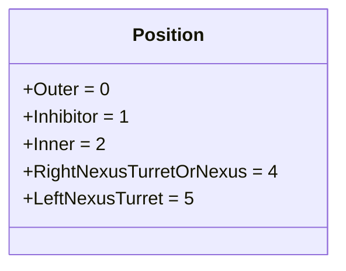

**图示来源**
- [position.rs](file://src/core/base/position.rs)

### 等级组件
等级组件（Level）管理实体的经验值和等级。它包含了当前等级、当前经验值和升级所需经验值等字段，并提供了添加经验值的方法。

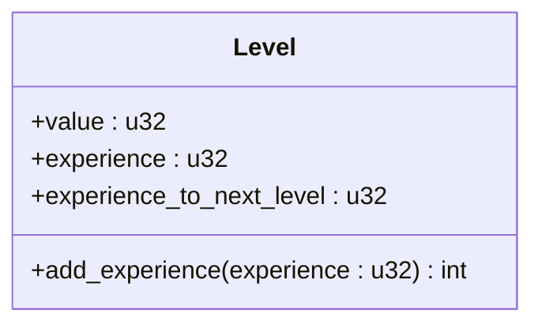

**图示来源**
- [level.rs](file://src/core/base/level.rs)

### 状态组件
状态组件（State）跟踪实体的当前行为状态，如空闲、移动或攻击。它通过事件监听器在接收到相应事件时更新状态。

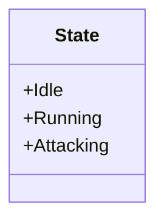

**图示来源**
- [state.rs](file://src/core/base/state.rs)

**基础组件系统**
- [base.rs](file://src/core/base.rs)
- [position.rs](file://src/core/base/position.rs)
- [level.rs](file://src/core/base/level.rs)
- [state.rs](file://src/core/base/state.rs)

## 英雄实体实现
英雄实体的实现展示了如何通过组件组合来构建复杂的游戏对象。以Fiora和Riven为例，分析其组件化组织方式。

### Fiora英雄实现
Fiora英雄通过`PluginFiora`插件进行注册，该插件在游戏启动时加载资产并在固定更新周期内添加技能。

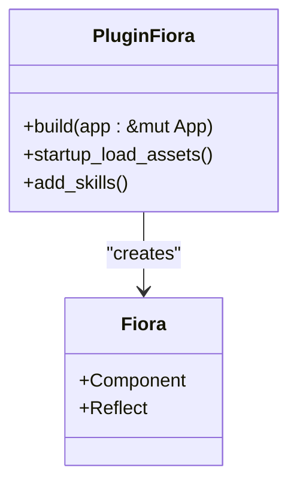

**图示来源**
- [fiora.rs](file://src/entities/champions/fiora.rs)

### Riven英雄实现
Riven英雄的实现与Fiora类似，通过`PluginRiven`插件进行注册和初始化。

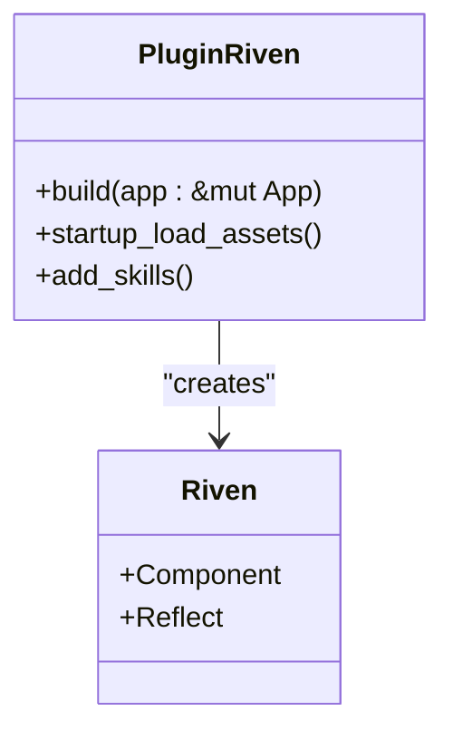

**图示来源**
- [riven.rs](file://src/entities/champions/riven.rs)

### 专属能力组件
英雄的专属能力通过独立的组件实现，如Fiora的被动技能组件`AbilityFioraPassive`。

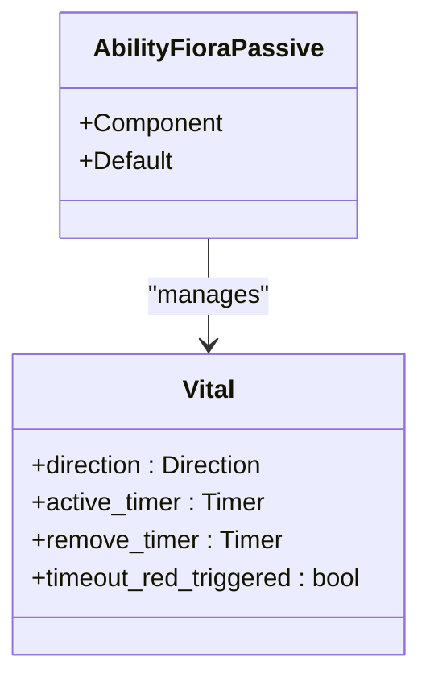

**图示来源**
- [fiora_passive.rs](file://src/abilities/fiora_passive.rs)

**英雄实体实现**
- [fiora.rs](file://src/entities/champions/fiora.rs)
- [riven.rs](file://src/entities/champions/riven.rs)
- [fiora_passive.rs](file://src/abilities/fiora_passive.rs)

## 通用实体实现
通用实体的实现展示了如何通过组件组合来构建不同类型的游戏对象。

### 兵营实体
兵营实体（Barrack）负责生成小兵。它包含多个计时器来管理小兵的生成周期和属性升级。

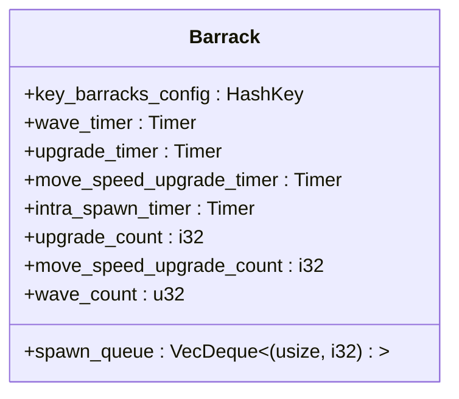

**图示来源**
- [barrack.rs](file://src/entities/barrack.rs)

### 防御塔实体
防御塔实体（Turret）具有固定的攻击范围，当发现仇恨目标时会自动发起攻击。

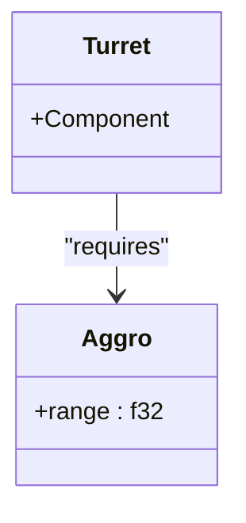

**图示来源**
- [turret.rs](file://src/entities/turret.rs)

### 小兵实体
小兵实体（Minion）具有不同的类型（近战、远程、攻城等），并遵循预定义的路径移动。

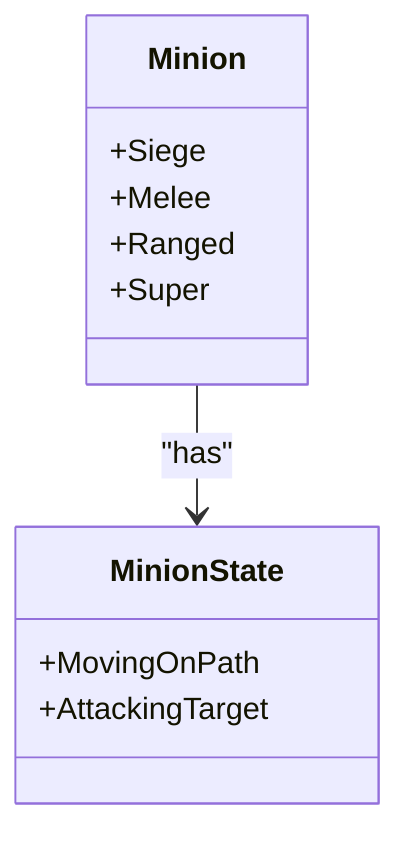

**图示来源**
- [minion.rs](file://src/entities/minion.rs)

**通用实体实现**
- [barrack.rs](file://src/entities/barrack.rs)
- [turret.rs](file://src/entities/turret.rs)
- [minion.rs](file://src/entities/minion.rs)
- [nexus.rs](file://src/entities/nexus.rs)

## 组件关系图
以下UML类图展示了核心实体的组件构成关系。

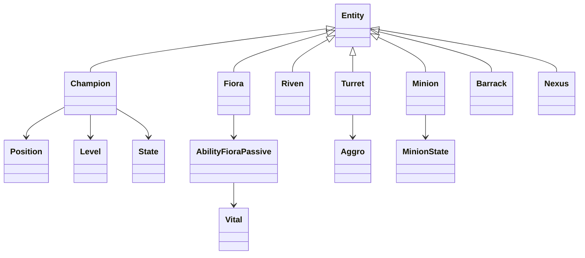

**图示来源**
- [champion.rs](file://src/entities/champion.rs)
- [fiora.rs](file://src/entities/champions/fiora.rs)
- [riven.rs](file://src/entities/champions/riven.rs)
- [turret.rs](file://src/entities/turret.rs)
- [minion.rs](file://src/entities/minion.rs)
- [barrack.rs](file://src/entities/barrack.rs)
- [nexus.rs](file://src/entities/nexus.rs)

## 实体初始化流程
实体的初始化流程遵循标准的Bevy ECS模式，通过插件系统在游戏启动时注册和配置实体。

### 插件注册
每个实体类型都有一个对应的插件，该插件在`build`方法中注册系统和资源。

### 资产加载
在`Startup`阶段，插件会加载实体所需的资产，如技能效果、动画等。

### 技能添加
在`FixedUpdate`阶段，插件会为实体添加相应的技能和被动能力。

### 组件组合
通过`with_related`方法，将多个组件组合到同一个实体上，形成完整的实体定义。

**实体初始化流程**
- [fiora.rs](file://src/entities/champions/fiora.rs)
- [riven.rs](file://src/entities/champions/riven.rs)
- [barrack.rs](file://src/entities/barrack.rs)

## 配置驱动的行为参数化
游戏实体的行为参数化通过配置文件驱动，确保游戏平衡性和可调整性。

### 游戏配置
全局游戏配置定义了基础的游戏参数，如游戏帧率和取消宽限期。

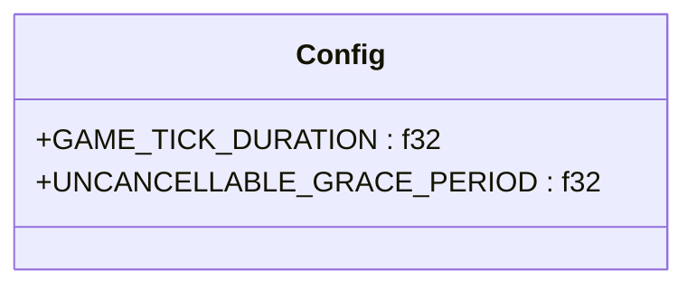

**图示来源**
- [config.rs](file://src/core/config.rs)

### 实体配置
每个实体类型都有其特定的配置，如兵营的生成间隔、小兵的属性升级曲线等。

### 动态调整
通过配置文件，可以在不修改代码的情况下调整实体的行为参数，便于游戏平衡性调整和测试。

**配置驱动的行为参数化**
- [config.rs](file://src/core/config.rs)
- [barrack.rs](file://src/entities/barrack.rs)