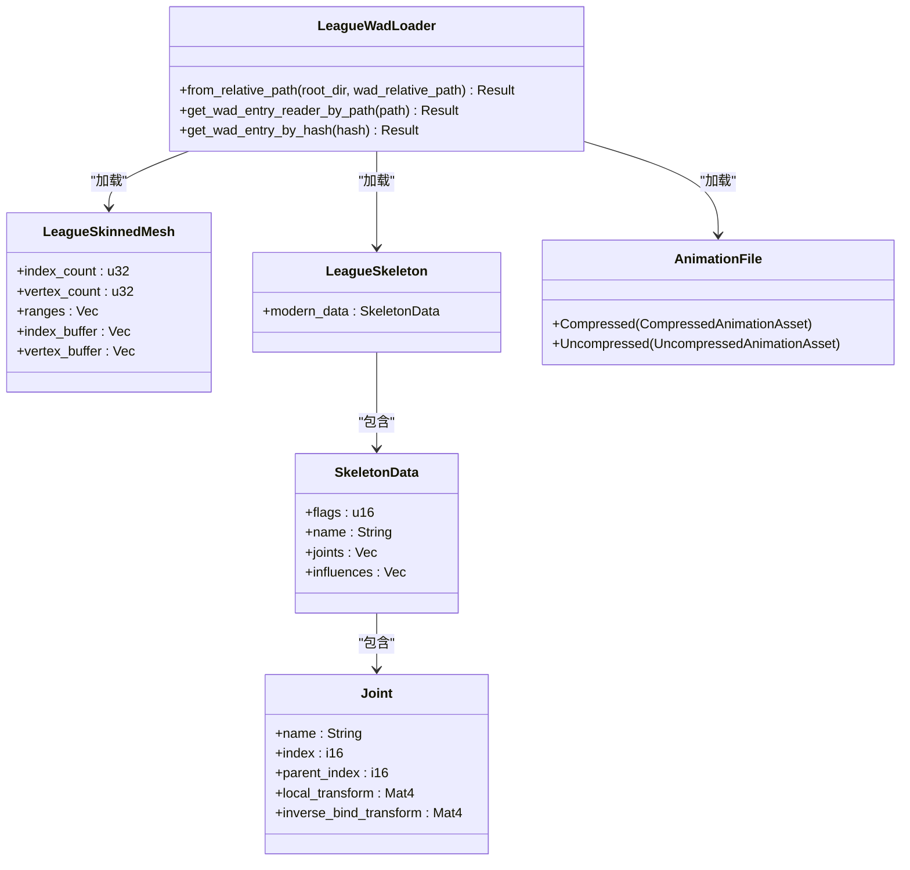
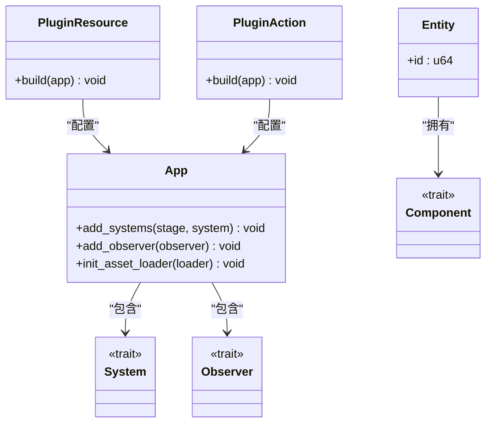
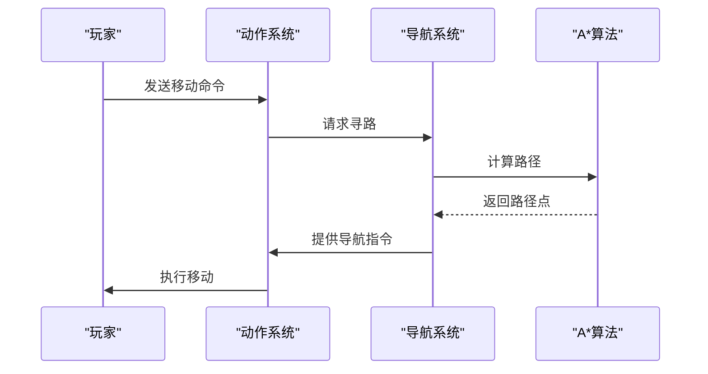
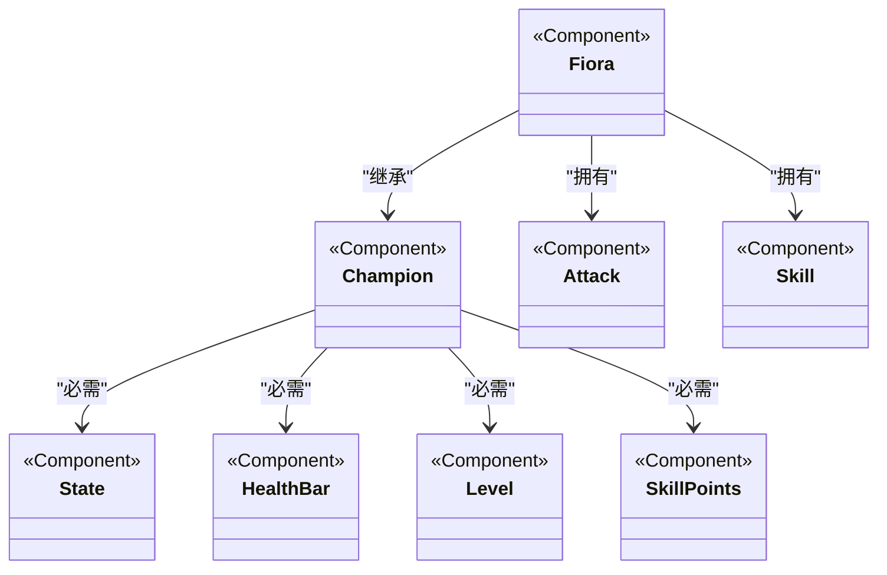
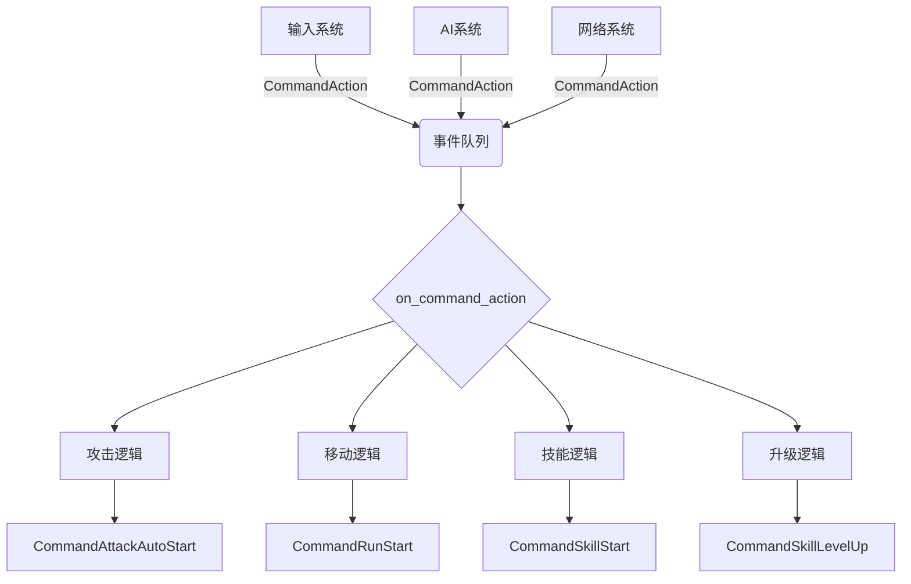

# 核心模块详解

<cite>
**本文档引用的文件**  
- [animation.rs](file://crates/league_file/src/animation.rs)
- [mesh_skinned.rs](file://crates/league_file/src/mesh_skinned.rs)
- [skeleton.rs](file://crates/league_file/src/skeleton.rs)
- [wad.rs](file://crates/league_loader/src/wad.rs)
- [resource.rs](file://src/core/resource.rs)
- [action.rs](file://src/core/action.rs)
- [astar.rs](file://src/core/navigation/astar.rs)
- [navigation.rs](file://src/core/navigation/navigation.rs)
- [particle.rs](file://src/core/particle/particle.rs)
- [champion.rs](file://src/entities/champion.rs)
- [fiora.rs](file://src/entities/champions/fiora.rs)
- [lib.rs](file://crates/league_file/src/lib.rs)
- [lib.rs](file://crates/league_loader/src/lib.rs)
- [lib.rs](file://crates/lol_config/src/lib.rs)
</cite>

## 目录
1. [资源系统](#资源系统)
2. [ECS架构设计](#ecs架构设计)
3. [游戏逻辑系统](#游戏逻辑系统)
4. [实体定义与组件构成](#实体定义与组件构成)
5. [事件驱动机制](#事件驱动机制)

## 资源系统

本项目通过自定义的资源加载器实现对LoL游戏资源文件（.skn, .skl, .anm等）的解析和转换。核心实现位于`crates/league_file`和`crates/league_loader`模块中，使用`binrw`库进行二进制数据的读取和解析。

资源加载流程从`src/core/resource.rs`中的`PluginResource`插件开始，在应用启动时初始化各种资源类型和加载器。系统支持多种资源类型，包括动画、网格、骨架、纹理等，并通过Bevy引擎的资产系统进行管理。

对于动画文件（.anm），系统实现了对压缩和非压缩格式的完整解析。`crates/league_file/src/animation.rs`文件定义了`AnimationFile`枚举，能够识别"r3d2canm"（压缩）和"r3d2anmd"（非压缩）两种魔数标识的动画文件。解析过程包括时间轴解压缩、变换数据解码和关键帧重建等步骤。

皮肤网格（.skn）文件的解析由`crates/league_file/src/mesh_skinned.rs`实现。该文件定义了`LeagueSkinnedMesh`结构体，能够读取包含顶点缓冲区、索引缓冲区和骨骼影响信息的网格数据。系统支持不同版本的网格格式，并能根据顶点声明类型（基本、带颜色、带切线）进行正确的数据解析。

骨架（.skl）文件的解析在`crates/league_file/src/skeleton.rs`中实现。`LeagueSkeleton`结构体能够读取现代和传统两种格式的骨架数据，包含关节层次结构、局部变换和逆绑定变换等信息。这些数据对于实现角色的骨骼动画至关重要。

资源加载器通过WAD文件系统访问游戏资源。`crates/league_loader/src/wad.rs`实现了对WAD存档文件的读取，支持Zstd压缩和分块加载。加载器能够根据资源路径或哈希值定位并读取特定的资源条目，为上层系统提供原始数据流。



**图示来源**
- [wad.rs](file://crates/league_loader/src/wad.rs)
- [mesh_skinned.rs](file://crates/league_file/src/mesh_skinned.rs)
- [skeleton.rs](file://crates/league_file/src/skeleton.rs)
- [animation.rs](file://crates/league_file/src/animation.rs)

**本节来源**
- [resource.rs](file://src/core/resource.rs#L1-L328)
- [lib.rs](file://crates/league_file/src/lib.rs#L1-L20)
- [lib.rs](file://crates/league_loader/src/lib.rs#L1-L27)

## ECS架构设计

本项目采用Bevy引擎的ECS（实体-组件-系统）架构模式，将游戏对象的数据和行为分离。核心架构在`src/core.rs`中定义，通过模块化的方式组织各种系统和组件。

ECS架构的核心思想是将游戏世界中的对象分解为实体（Entity）、组件（Component）和系统（System）。实体是唯一的标识符，组件是纯数据的容器，系统则是处理特定类型组件的逻辑函数。这种设计模式提高了代码的可维护性和性能。

在本项目中，`PluginResource`、`PluginAction`等插件类负责在应用启动时注册各种系统和资源。每个插件通过实现`Plugin` trait的`build`方法来配置应用，包括添加系统到特定的调度阶段、初始化资源和注册资产加载器等。

组件系统通过Bevy的反射机制实现动态类型处理。例如，在`src/core/resource.rs`中，系统能够根据类型注册表动态地应用组件到实体上。这种设计使得配置数据（如角色配置）可以灵活地转换为运行时的游戏对象。

观察者模式被广泛用于事件处理。系统通过`add_observer`方法注册对特定事件的响应，当事件触发时，相应的处理函数会被调用。这种方式实现了松耦合的事件驱动架构，避免了复杂的直接调用关系。



**图示来源**
- [resource.rs](file://src/core/resource.rs#L30-L154)
- [action.rs](file://src/core/action.rs#L24-L41)
- [core.rs](file://src/core.rs#L1-L58)

**本节来源**
- [core.rs](file://src/core.rs#L1-L58)
- [resource.rs](file://src/core/resource.rs#L30-L154)
- [action.rs](file://src/core/action.rs#L24-L41)

## 游戏逻辑系统

游戏逻辑系统由多个子系统组成，包括动作系统、导航系统、粒子系统和皮肤渲染系统。这些系统通过ECS架构协同工作，实现复杂的游戏行为。

### 动作系统

动作系统处理角色的各种行为，如攻击、移动和技能释放。`src/core/action.rs`中的`CommandAction`事件是动作系统的核心，它定义了角色可以执行的各种动作，包括攻击、移动、停止、释放技能和技能升级。

系统通过观察者模式响应这些命令事件，并触发相应的具体动作。例如，当收到`Action::Attack`命令时，系统会触发`CommandAttackAutoStart`事件，启动自动攻击流程。这种分层的事件处理机制使得动作逻辑清晰且易于扩展。

### 导航系统

导航系统基于A*寻路算法实现，位于`src/core/navigation`目录下。系统将游戏地图划分为网格，每个网格单元具有可通行性属性，用于计算最优路径。

`astar.rs`文件实现了A*算法的核心逻辑，包括开放列表、关闭列表和启发式函数。`navigation.rs`文件则负责将寻路结果转换为实际的移动指令，并处理路径平滑等后处理操作。



**图示来源**
- [action.rs](file://src/core/action.rs#L43-L97)
- [navigation.rs](file://src/core/navigation/navigation.rs)
- [astar.rs](file://src/core/navigation/astar.rs)

### 粒子系统

粒子系统负责处理游戏中的视觉特效，如技能释放效果、环境粒子等。系统位于`src/core/particle`目录下，支持多种粒子类型和渲染模式。

粒子系统通过组件化设计实现灵活性，不同的粒子效果可以通过组合不同的组件来创建。系统支持粒子的生命周期管理、运动轨迹计算和碰撞检测等功能。

### 皮肤渲染系统

皮肤渲染系统处理角色外观的显示，包括网格、材质和动画的同步。系统通过`src/core/skin`模块实现，能够加载和应用不同的皮肤资源。

系统支持骨骼动画的播放和混合，能够实现流畅的动作过渡。皮肤渲染与角色逻辑分离，使得同一角色可以拥有多种外观表现。

**本节来源**
- [action.rs](file://src/core/action.rs#L1-L97)
- [astar.rs](file://src/core/navigation/astar.rs)
- [navigation.rs](file://src/core/navigation/navigation.rs)
- [particle.rs](file://src/core/particle/particle.rs)

## 实体定义与组件构成

游戏中的实体通过组件组合来定义其特性和行为。核心实体定义位于`src/entities`目录下，包括英雄、防御塔等游戏对象。

### 英雄实体

英雄实体的基类定义在`src/entities/champion.rs`中，通过`Champion`组件标记。该组件使用Bevy的反射系统进行注册，并要求实体具有状态、血条、等级和技能点等必需组件。

```rust
#[derive(Component, Reflect, Default)]
#[reflect(Component)]
#[require(State, HealthBar = HealthBar { bar_type: HealthBarType::Champion }, Level = Level { value: 1, experience: 0, experience_to_next_level: 280 }, SkillPoints)]
pub struct Champion;
```

具体英雄类型通过继承和扩展基类来实现。以菲奥娜为例，`src/entities/champions/fiora.rs`文件定义了`Fiora`组件，并在`PluginFiora`插件中注册了其特有的技能和行为。

菲奥娜的技能系统通过行为树（behave!宏）定义，每个技能对应一个技能效果（SkillEffect）。系统在启动时加载这些技能配置，并在游戏运行时根据玩家输入触发相应的技能行为。

### 组件构成

组件系统采用组合优于继承的设计原则。实体的功能由其所拥有的组件集合决定，而不是通过类继承层次结构。

例如，一个可攻击的英雄实体需要拥有`Champion`、`Attack`、`Skill`等组件。系统通过查询具有特定组件组合的实体来执行相应的逻辑，这种设计提高了系统的灵活性和可扩展性。



**图示来源**
- [champion.rs](file://src/entities/champion.rs#L1-L16)
- [fiora.rs](file://src/entities/champions/fiora.rs#L1-L159)

**本节来源**
- [champion.rs](file://src/entities/champion.rs#L1-L16)
- [fiora.rs](file://src/entities/champions/fiora.rs#L1-L159)

## 事件驱动机制

事件驱动机制是本项目实现游戏状态变更的核心。系统通过命令-响应模式实现松耦合的组件通信，避免了直接的函数调用和依赖。

### 命令系统

`CommandAction`事件是游戏逻辑的统一入口，定义在`src/core/action.rs`中。该事件包含目标实体和要执行的动作，通过Bevy的事件系统进行广播。

```rust
#[derive(EntityEvent)]
pub struct CommandAction {
    pub entity: Entity,
    pub action: Action,
}
```

动作类型通过枚举定义，包括攻击、移动、技能释放等基本操作。这种设计使得输入处理、AI决策和网络同步等不同来源的指令可以统一处理。

### 事件处理

系统通过观察者模式监听和处理命令事件。`on_command_action`函数是主要的事件处理器，根据不同的动作类型触发相应的具体命令。

例如，移动动作会触发`CommandRunStart`和`CommandAttackAutoStop`等一系列子命令，实现移动时停止攻击的逻辑。这种分层的命令处理机制使得复杂的行为可以由简单的原子操作组合而成。

事件驱动架构的优势在于：
1. **松耦合**：发送者和接收者不需要直接引用对方
2. **可扩展性**：可以轻松添加新的事件处理器而不影响现有代码
3. **调试友好**：事件流可以被记录和回放，便于问题排查
4. **并发安全**：Bevy的事件系统保证了线程安全的事件传递



**图示来源**
- [action.rs](file://src/core/action.rs#L43-L97)

**本节来源**
- [action.rs](file://src/core/action.rs#L43-L97)