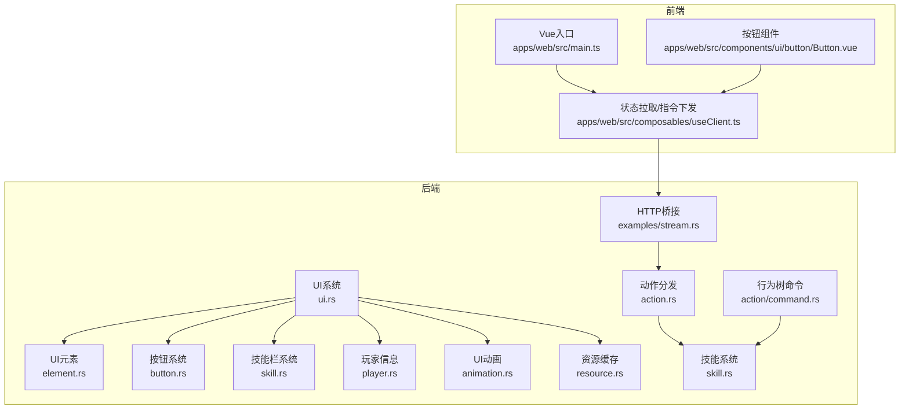
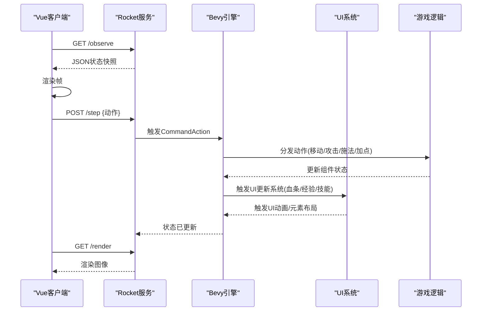
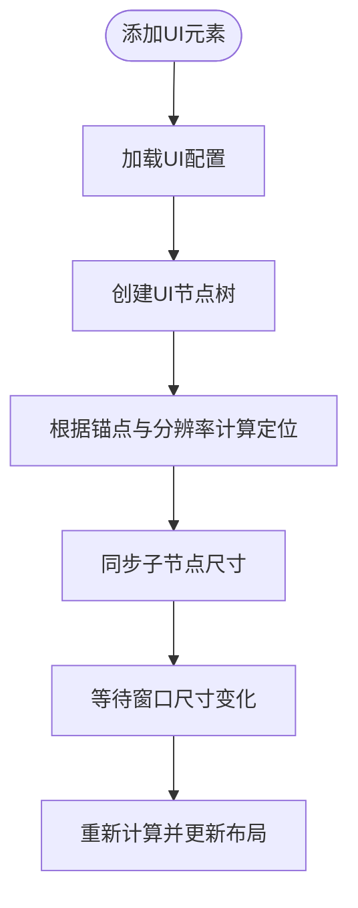
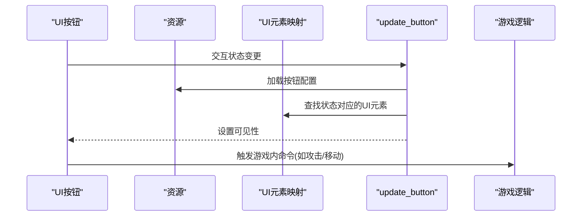
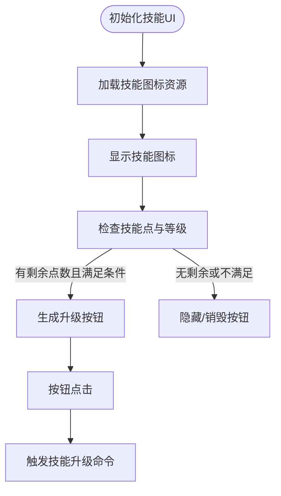
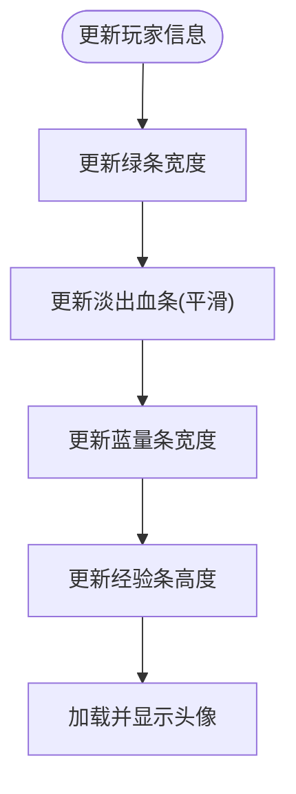
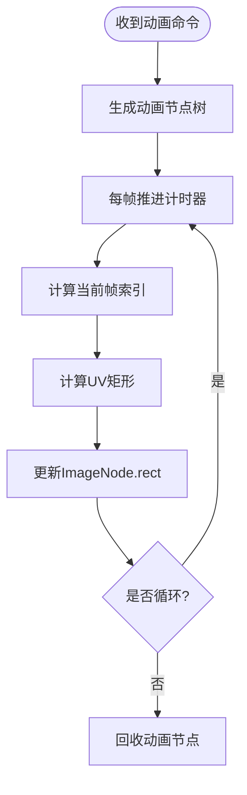
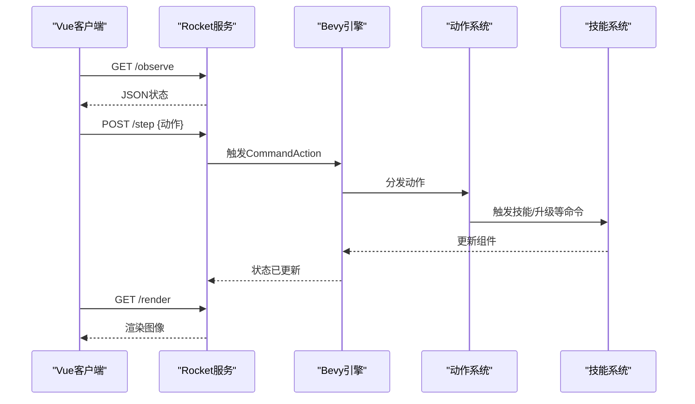
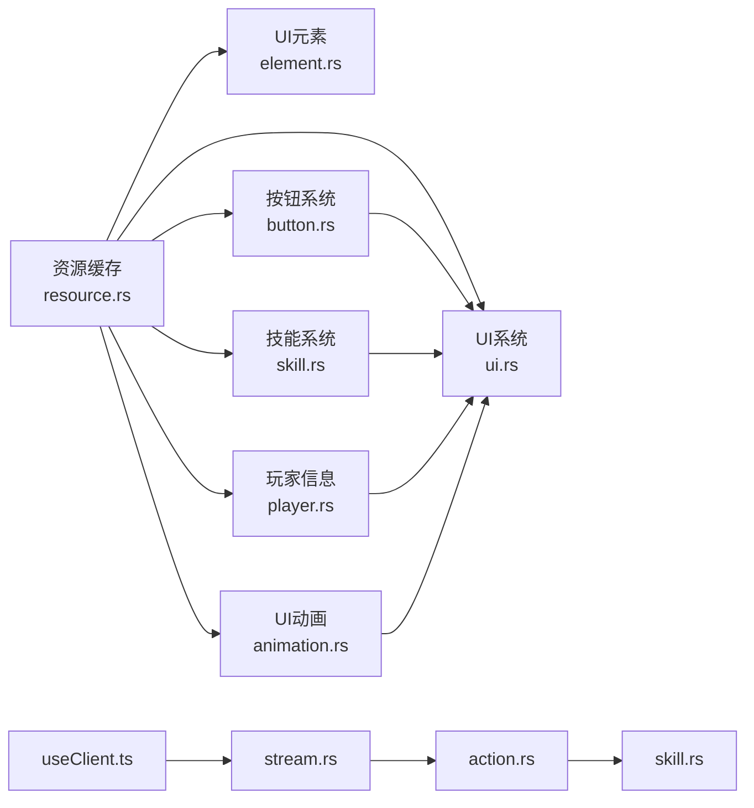

# UI交互系统

<cite>
**本文引用的文件**
- [ui.rs](file://src/core/ui.rs)
- [element.rs](file://src/core/ui/element.rs)
- [button.rs](file://src/core/ui/button.rs)
- [skill.rs](file://src/core/ui/skill.rs)
- [player.rs](file://src/core/ui/player.rs)
- [animation.rs](file://src/core/ui/animation.rs)
- [action.rs](file://src/core/action.rs)
- [command.rs](file://src/core/action/command.rs)
- [skill.rs](file://src/core/skill.rs)
- [resource.rs](file://src/core/resource.rs)
- [stream.rs](file://examples/stream.rs)
- [useClient.ts](file://apps/web/src/composables/useClient.ts)
- [main.ts](file://apps/web/src/main.ts)
- [Button.vue](file://apps/web/src/components/ui/button/Button.vue)
</cite>

## 目录
1. [简介](#简介)
2. [项目结构](#项目结构)
3. [核心组件](#核心组件)
4. [架构总览](#架构总览)
5. [详细组件分析](#详细组件分析)
6. [依赖关系分析](#依赖关系分析)
7. [性能考量](#性能考量)
8. [故障排查指南](#故障排查指南)
9. [结论](#结论)
10. [附录](#附录)

## 简介
本文件深入解析游戏内UI交互系统的实现机制，覆盖UI元素、按钮、技能栏与玩家信息显示等模块。系统采用Bevy ECS驱动，通过事件总线在UI层与游戏逻辑层之间传递指令；同时，前端Vue应用通过HTTP接口拉取状态并渲染画面，形成“后端驱动状态、前端负责展示”的解耦架构。文档还提供UI组件开发、事件绑定与响应式更新的最佳实践，并给出UI延迟与状态不同步问题的调试方案。

## 项目结构
UI系统位于后端Rust工程中，使用Bevy渲染UI节点树；前端Vue应用负责状态拉取与界面渲染。关键路径如下：
- 后端UI系统：src/core/ui.rs、src/core/ui/element.rs、src/core/ui/button.rs、src/core/ui/skill.rs、src/core/ui/player.rs、src/core/ui/animation.rs
- 前端Vue组件：apps/web/src/components/ui/button/Button.vue
- 前端状态拉取与调度：apps/web/src/composables/useClient.ts
- 后端与前端通信桥接：examples/stream.rs
- 资源缓存与加载：src/core/resource.rs
- 行为树与动作分发：src/core/action.rs、src/core/action/command.rs、src/core/skill.rs

图表来源
- [ui.rs](file://src/core/ui.rs#L1-L63)
- [element.rs](file://src/core/ui/element.rs#L1-L78)
- [button.rs](file://src/core/ui/button.rs#L1-L52)
- [skill.rs](file://src/core/ui/skill.rs#L1-L80)
- [player.rs](file://src/core/ui/player.rs#L1-L35)
- [animation.rs](file://src/core/ui/animation.rs#L1-L46)
- [resource.rs](file://src/core/resource.rs#L156-L230)
- [action.rs](file://src/core/action.rs#L58-L96)
- [command.rs](file://src/core/action/command.rs#L1-L63)
- [skill.rs](file://src/core/skill.rs#L94-L177)
- [stream.rs](file://examples/stream.rs#L286-L328)
- [useClient.ts](file://apps/web/src/composables/useClient.ts#L1-L120)
- [main.ts](file://apps/web/src/main.ts#L1-L17)
- [Button.vue](file://apps/web/src/components/ui/button/Button.vue#L1-L30)

章节来源
- [ui.rs](file://src/core/ui.rs#L1-L63)
- [element.rs](file://src/core/ui/element.rs#L1-L78)
- [button.rs](file://src/core/ui/button.rs#L1-L52)
- [skill.rs](file://src/core/ui/skill.rs#L1-L80)
- [player.rs](file://src/core/ui/player.rs#L1-L35)
- [animation.rs](file://src/core/ui/animation.rs#L1-L46)
- [resource.rs](file://src/core/resource.rs#L156-L230)
- [action.rs](file://src/core/action.rs#L58-L96)
- [command.rs](file://src/core/action/command.rs#L1-L63)
- [skill.rs](file://src/core/skill.rs#L94-L177)
- [stream.rs](file://examples/stream.rs#L286-L328)
- [useClient.ts](file://apps/web/src/composables/useClient.ts#L1-L120)
- [main.ts](file://apps/web/src/main.ts#L1-L17)
- [Button.vue](file://apps/web/src/components/ui/button/Button.vue#L1-L30)

## 核心组件
- UI系统插件与状态机：初始化UI状态、注册系统与观察者，统一管理UI生命周期与事件。
- UI元素：按配置加载UI元素，支持窗口尺寸变化与定位适配。
- 按钮：基于交互状态切换可见的UI元素，触发游戏内事件。
- 技能栏：动态生成技能升级按钮，绑定点击事件并下发技能升级指令。
- 玩家信息：根据角色状态更新血条、蓝量、经验条与头像。
- UI动画：按帧率驱动UI特效动画，支持循环播放与结束回收。
- 资源缓存：集中管理图片与网格资源，避免重复加载。
- 前后端通信：Rocket服务暴露/step、/render、/observe接口，前端通过Axios轮询状态并下发指令。

章节来源
- [ui.rs](file://src/core/ui.rs#L1-L63)
- [element.rs](file://src/core/ui/element.rs#L1-L78)
- [button.rs](file://src/core/ui/button.rs#L1-L52)
- [skill.rs](file://src/core/ui/skill.rs#L1-L80)
- [player.rs](file://src/core/ui/player.rs#L1-L35)
- [animation.rs](file://src/core/ui/animation.rs#L1-L46)
- [resource.rs](file://src/core/resource.rs#L156-L230)
- [stream.rs](file://examples/stream.rs#L286-L328)
- [useClient.ts](file://apps/web/src/composables/useClient.ts#L1-L120)

## 架构总览
后端以Bevy为核心，UI系统通过事件总线与游戏逻辑解耦。前端Vue应用仅负责可视化与用户交互，通过HTTP接口与后端交互，形成“后端驱动状态、前端渲染”的模式。

图表来源
- [stream.rs](file://examples/stream.rs#L286-L328)
- [action.rs](file://src/core/action.rs#L58-L96)
- [ui.rs](file://src/core/ui.rs#L1-L63)
- [player.rs](file://src/core/ui/player.rs#L1-L35)
- [skill.rs](file://src/core/ui/skill.rs#L87-L149)

## 详细组件分析

### UI元素系统（element.rs）
- 加载与初始化：启动阶段触发加载UI配置，完成后进入Loaded状态。
- 布局适配：监听窗口尺寸变化，按锚点与分辨率计算元素绝对定位与宽高。
- 事件绑定：为UI元素注册点击观察者，便于后续扩展交互。
- 子节点同步：当父节点尺寸变化时，同步子节点尺寸以保持UI贴图正确缩放。

图表来源
- [element.rs](file://src/core/ui/element.rs#L35-L78)
- [element.rs](file://src/core/ui/element.rs#L149-L205)
- [element.rs](file://src/core/ui/element.rs#L207-L241)
- [element.rs](file://src/core/ui/element.rs#L243-L272)

章节来源
- [element.rs](file://src/core/ui/element.rs#L1-L78)
- [element.rs](file://src/core/ui/element.rs#L149-L205)
- [element.rs](file://src/core/ui/element.rs#L207-L241)
- [element.rs](file://src/core/ui/element.rs#L243-L272)

### 按钮系统（button.rs）
- 按钮装配：根据配置启用按钮，生成可交互的UI节点。
- 交互状态：根据鼠标悬停、按下、恢复状态切换对应UI元素的可见性。
- 事件下发：将交互事件映射为游戏内的命令，驱动后续逻辑。

图表来源
- [button.rs](file://src/core/ui/button.rs#L32-L52)
- [button.rs](file://src/core/ui/button.rs#L54-L108)
- [button.rs](file://src/core/ui/button.rs#L110-L171)

章节来源
- [button.rs](file://src/core/ui/button.rs#L1-L52)
- [button.rs](file://src/core/ui/button.rs#L54-L108)
- [button.rs](file://src/core/ui/button.rs#L110-L171)

### 技能栏系统（skill.rs）
- 技能图标：根据角色技能列表动态设置技能图标。
- 升级按钮：根据等级与技能点生成/销毁技能升级按钮，并绑定点击事件下发升级指令。
- 条件控制：遵循规则（如6级解锁大招、低等级限制加点数量）。

图表来源
- [skill.rs](file://src/core/ui/skill.rs#L1-L80)
- [skill.rs](file://src/core/ui/skill.rs#L87-L149)

章节来源
- [skill.rs](file://src/core/ui/skill.rs#L1-L80)
- [skill.rs](file://src/core/ui/skill.rs#L87-L149)

### 玩家信息系统（player.rs）
- 血条：即时更新绿色血条宽度。
- 血条淡出：平滑过渡的淡出血条，避免突变。
- 蓝量：更新蓝量条宽度并显示。
- 经验：根据当前经验值与下一级所需经验更新经验条高度。
- 头像：根据皮肤资源加载头像并显示。

图表来源
- [player.rs](file://src/core/ui/player.rs#L16-L35)
- [player.rs](file://src/core/ui/player.rs#L37-L60)
- [player.rs](file://src/core/ui/player.rs#L62-L128)
- [player.rs](file://src/core/ui/player.rs#L130-L152)
- [player.rs](file://src/core/ui/player.rs#L154-L193)

章节来源
- [player.rs](file://src/core/ui/player.rs#L16-L35)
- [player.rs](file://src/core/ui/player.rs#L37-L60)
- [player.rs](file://src/core/ui/player.rs#L62-L128)
- [player.rs](file://src/core/ui/player.rs#L130-L152)
- [player.rs](file://src/core/ui/player.rs#L154-L193)

### UI动画系统（animation.rs）
- 动画启动：接收UI动画命令，按配置生成动画节点树。
- 帧驱动：按帧率推进动画帧索引，计算UV矩形并更新ImageNode。
- 循环与回收：支持循环播放；非循环动画播放完毕后自动回收。

图表来源
- [animation.rs](file://src/core/ui/animation.rs#L1-L46)
- [animation.rs](file://src/core/ui/animation.rs#L48-L108)

章节来源
- [animation.rs](file://src/core/ui/animation.rs#L1-L46)
- [animation.rs](file://src/core/ui/animation.rs#L48-L108)

### 前后端数据同步（apps/web + examples/stream.rs）
- 前端通过Axios定期请求/observe获取游戏状态快照，渲染图像与UI。
- 前端通过POST /step下发动作（移动、攻击、施法、加点等），后端转换为游戏内命令并执行。
- Rocket服务在固定循环中调用Bevy.update，确保状态与渲染同步。

图表来源
- [useClient.ts](file://apps/web/src/composables/useClient.ts#L1-L120)
- [stream.rs](file://examples/stream.rs#L286-L328)
- [action.rs](file://src/core/action.rs#L58-L96)
- [skill.rs](file://src/core/skill.rs#L94-L177)

章节来源
- [useClient.ts](file://apps/web/src/composables/useClient.ts#L1-L120)
- [stream.rs](file://examples/stream.rs#L286-L328)
- [action.rs](file://src/core/action.rs#L58-L96)
- [skill.rs](file://src/core/skill.rs#L94-L177)

## 依赖关系分析
- UI系统依赖资源缓存与配置加载，确保UI元素与动画资源可用。
- 按钮与技能系统依赖UI元素映射表，通过键值查找对应UI节点。
- 前端通过HTTP接口与后端交互，动作经由行为树与命令系统驱动游戏状态变更。

图表来源
- [resource.rs](file://src/core/resource.rs#L156-L230)
- [ui.rs](file://src/core/ui.rs#L1-L63)
- [element.rs](file://src/core/ui/element.rs#L1-L78)
- [button.rs](file://src/core/ui/button.rs#L1-L52)
- [skill.rs](file://src/core/ui/skill.rs#L1-L80)
- [player.rs](file://src/core/ui/player.rs#L1-L35)
- [animation.rs](file://src/core/ui/animation.rs#L1-L46)
- [useClient.ts](file://apps/web/src/composables/useClient.ts#L1-L120)
- [stream.rs](file://examples/stream.rs#L286-L328)
- [action.rs](file://src/core/action.rs#L58-L96)
- [skill.rs](file://src/core/skill.rs#L94-L177)

章节来源
- [resource.rs](file://src/core/resource.rs#L156-L230)
- [ui.rs](file://src/core/ui.rs#L1-L63)
- [element.rs](file://src/core/ui/element.rs#L1-L78)
- [button.rs](file://src/core/ui/button.rs#L1-L52)
- [skill.rs](file://src/core/ui/skill.rs#L1-L80)
- [player.rs](file://src/core/ui/player.rs#L1-L35)
- [animation.rs](file://src/core/ui/animation.rs#L1-L46)
- [useClient.ts](file://apps/web/src/composables/useClient.ts#L1-L120)
- [stream.rs](file://examples/stream.rs#L286-L328)
- [action.rs](file://src/core/action.rs#L58-L96)
- [skill.rs](file://src/core/skill.rs#L94-L177)

## 性能考量
- UI元素布局：窗口尺寸变化时批量重算，建议减少不必要的UI层级与频繁的父子尺寸同步。
- 动画帧率：按帧率推进计时器，避免过高的FPS导致CPU占用上升；非循环动画及时回收。
- 资源缓存：统一管理图片与网格资源，避免重复加载；对热路径资源预加载。
- 前后端同步：前端轮询频率与后端固定更新周期需平衡，避免过度请求与渲染压力。

[本节为通用指导，无需列出具体文件来源]

## 故障排查指南
- UI元素不可见
  - 检查UI元素映射表是否正确加载，确认键值哈希一致。
  - 确认UI元素初始可见性与状态切换逻辑。
- 按钮无响应
  - 检查交互查询是否正确匹配UIButton组件。
  - 确认状态映射表存在对应元素键值。
- 技能升级按钮异常
  - 检查技能点与等级条件是否满足；确认按钮实体已生成并绑定点击事件。
- 血条/经验/蓝量不更新
  - 确认UI元素键名与映射一致；检查命令触发与节点尺寸更新流程。
- UI动画不播放
  - 检查动画命令是否触发；确认帧率参数与UV计算逻辑。
- 前后端状态不同步
  - 检查/observe与/step接口是否正常；确认前端轮询间隔与后端update节奏匹配。
  - 若出现延迟，适当降低前端轮询频率或优化后端update负载。

章节来源
- [element.rs](file://src/core/ui/element.rs#L1-L78)
- [button.rs](file://src/core/ui/button.rs#L110-L171)
- [skill.rs](file://src/core/ui/skill.rs#L87-L149)
- [player.rs](file://src/core/ui/player.rs#L16-L35)
- [animation.rs](file://src/core/ui/animation.rs#L48-L108)
- [stream.rs](file://examples/stream.rs#L286-L328)
- [useClient.ts](file://apps/web/src/composables/useClient.ts#L1-L120)

## 结论
该UI交互系统以Bevy ECS为核心，通过事件总线实现UI与游戏逻辑的松耦合；前端Vue应用通过HTTP接口进行状态拉取与指令下发，形成清晰的职责边界。通过资源缓存、动画帧驱动与条件化的UI更新，系统在保证表现力的同时兼顾性能与可维护性。建议在大型UI场景中进一步优化布局计算与资源加载策略，并完善前端与后端的同步策略以降低延迟与抖动。

[本节为总结性内容，无需列出具体文件来源]

## 附录
- UI组件开发最佳实践
  - 使用UI元素映射表集中管理键值，避免硬编码字符串。
  - 在UI系统中统一处理布局与尺寸同步，减少跨模块重复逻辑。
  - 对高频更新的UI（如血条）采用平滑插值与最小化重绘。
- 事件绑定与响应式更新
  - 使用观察者模式处理UI交互事件，将UI事件转换为游戏内命令。
  - 通过命令驱动系统更新UI，避免直接修改UI节点状态。
- 前端Vue组件集成
  - 将按钮等UI组件与useClient.ts的状态管理结合，确保指令下发与状态拉取的一致性。
  - 对复杂交互（如技能升级）在前端进行前置校验，减少无效请求。

[本节为通用指导，无需列出具体文件来源]