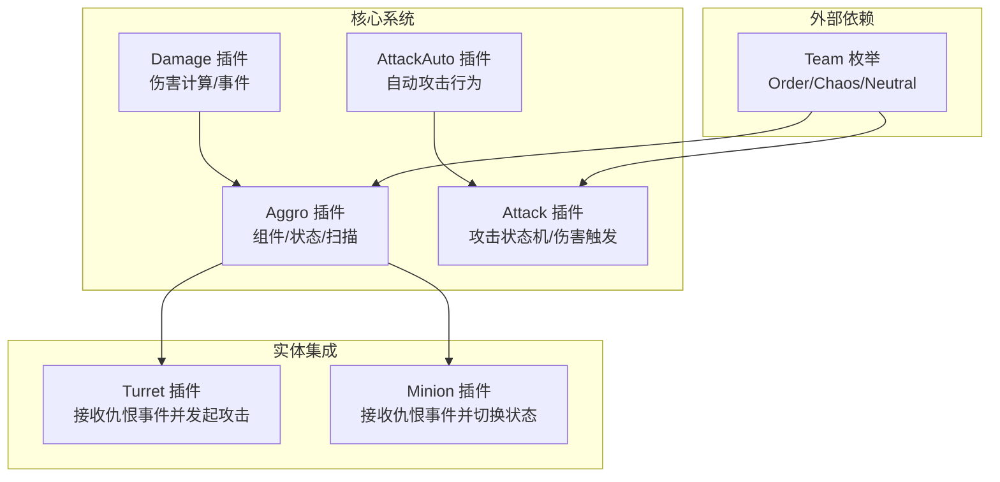
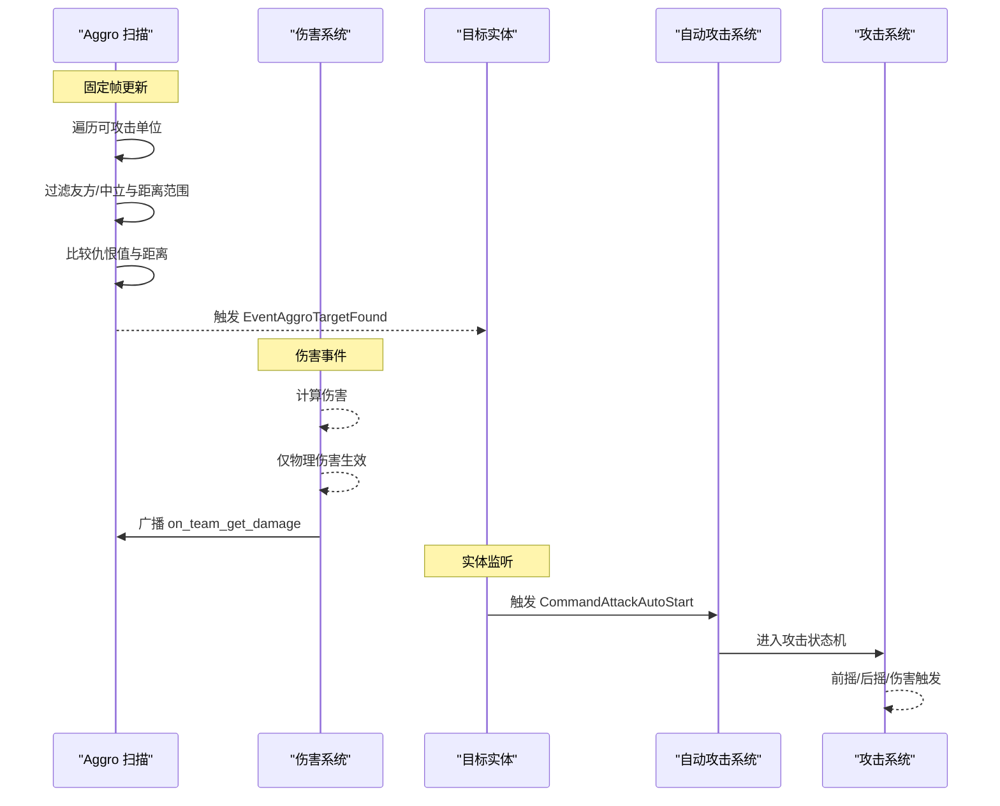
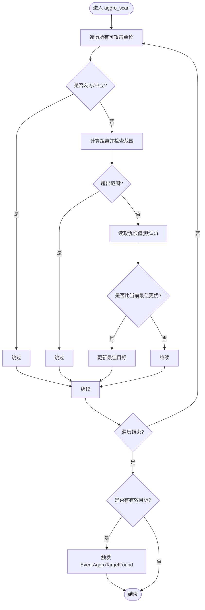
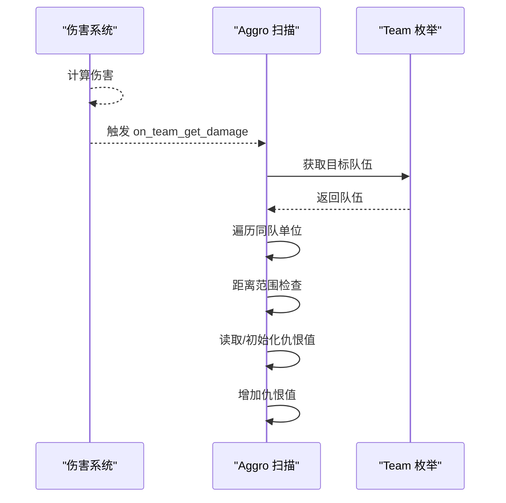
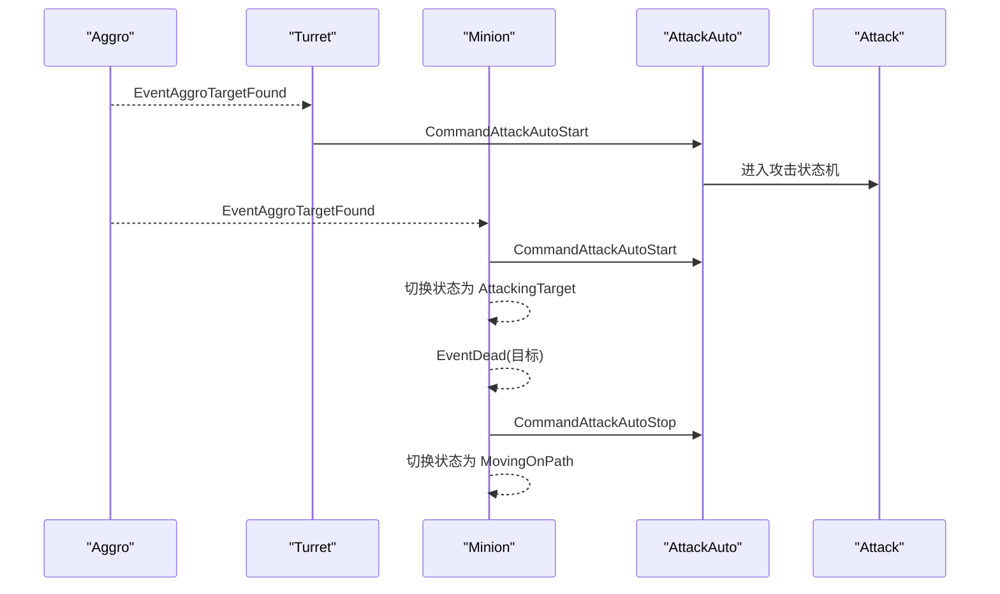
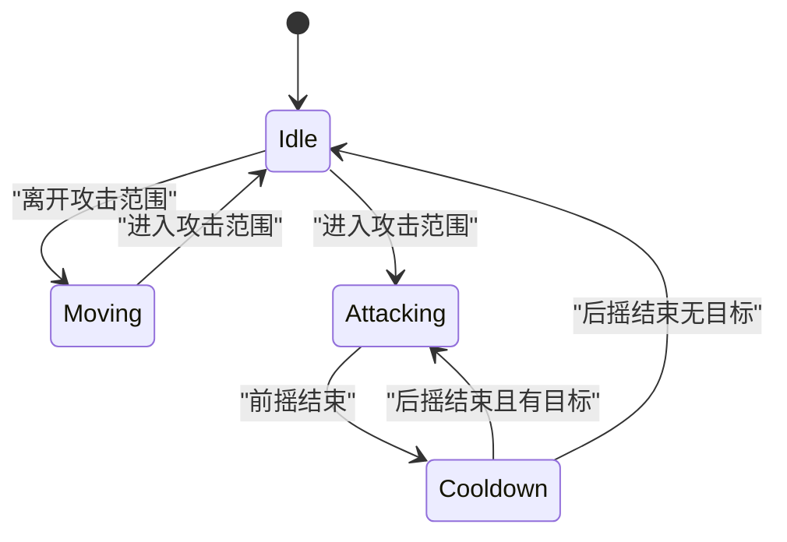
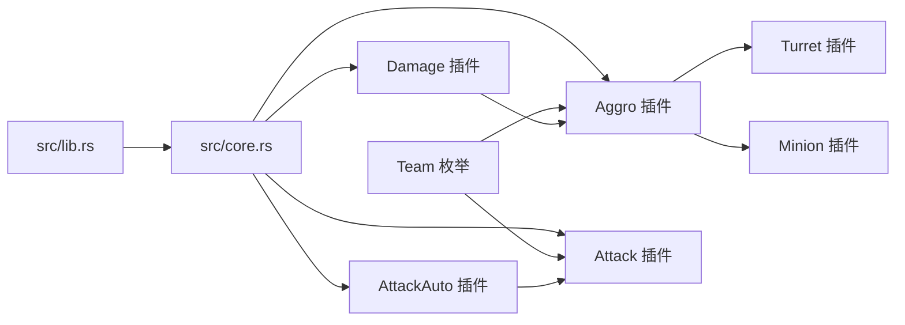

# 仇恨系统

<cite>
**本文引用的文件**
- [Cargo.toml](file://Cargo.toml)
- [src/lib.rs](file://src/lib.rs)
- [src/core.rs](file://src/core.rs)
- [src/core/aggro.rs](file://src/core/aggro.rs)
- [src/core/attack_auto.rs](file://src/core/attack_auto.rs)
- [src/core/attack.rs](file://src/core/attack.rs)
- [src/core/damage.rs](file://src/core/damage.rs)
- [src/entities/turret.rs](file://src/entities/turret.rs)
- [src/entities/minion.rs](file://src/entities/minion.rs)
- [crates/lol_core/src/team.rs](file://crates/lol_core/src/team.rs)
</cite>

## 目录
1. [简介](#简介)
2. [项目结构](#项目结构)
3. [核心组件](#核心组件)
4. [架构总览](#架构总览)
5. [详细组件分析](#详细组件分析)
6. [依赖关系分析](#依赖关系分析)
7. [性能考量](#性能考量)
8. [故障排查指南](#故障排查指南)
9. [结论](#结论)

## 简介
本章节概述仇恨系统的设计目标与在游戏中的作用。仇恨系统负责：
- 基于范围与仇恨值选择攻击目标；
- 当友方单位受到物理伤害时，附近单位对伤害来源建立仇恨；
- 目标死亡时清理仇恨列表；
- 将仇恨目标转化为自动攻击行为，驱动后续攻击流程。

该系统通过固定帧更新扫描、事件驱动更新仇恨值，并通过事件广播将目标传递给具体实体（如炮台、兵线）以发起自动攻击。

## 项目结构
围绕仇恨系统的关键模块分布如下：
- 核心系统与组件：src/core/aggro.rs 定义仇恨组件、状态与扫描逻辑；src/core/attack_auto.rs 提供自动攻击行为；src/core/attack.rs 提供攻击状态机与伤害触发；src/core/damage.rs 提供伤害计算与事件。
- 实体集成：src/entities/turret.rs 与 src/entities/minion.rs 接收仇恨目标事件并启动自动攻击或切换状态。
- 团队枚举：crates/lol_core/src/team.rs 定义敌我中立三方团队，用于过滤目标与范围判定。

图表来源
- [src/core/aggro.rs](file://src/core/aggro.rs#L1-L133)
- [src/core/attack_auto.rs](file://src/core/attack_auto.rs#L1-L155)
- [src/core/attack.rs](file://src/core/attack.rs#L1-L442)
- [src/core/damage.rs](file://src/core/damage.rs#L1-L367)
- [src/entities/turret.rs](file://src/entities/turret.rs#L1-L34)
- [src/entities/minion.rs](file://src/entities/minion.rs#L1-L175)
- [crates/lol_core/src/team.rs](file://crates/lol_core/src/team.rs#L1-L32)

章节来源
- [Cargo.toml](file://Cargo.toml#L1-L63)
- [src/lib.rs](file://src/lib.rs#L1-L59)
- [src/core.rs](file://src/core.rs#L1-L58)

## 核心组件
- Aggro 组件：携带仇恨范围，决定扫描半径。
- AggroState 组件：维护一个 Entity->f32 的仇恨映射，键为目标实体，值为仇恨分数。
- EventAggroTargetFound：当扫描选出最佳目标时广播的事件，携带实体与目标。
- CommandAttackAutoStart/CommandAttackAutoStop：驱动自动攻击的命令，由仇恨目标事件转换而来。
- Attack/AttackState：提供攻击状态机与伤害触发，配合自动攻击形成完整攻击链。
- Damage/DamageType：提供伤害类型与伤害计算，仇恨系统仅对物理伤害建立仇恨。

章节来源
- [src/core/aggro.rs](file://src/core/aggro.rs#L1-L133)
- [src/core/attack_auto.rs](file://src/core/attack_auto.rs#L1-L155)
- [src/core/attack.rs](file://src/core/attack.rs#L1-L442)
- [src/core/damage.rs](file://src/core/damage.rs#L1-L367)

## 架构总览
仇恨系统的工作流分为三个阶段：
1) 仇恨扫描：在固定帧更新中遍历所有可攻击单位，按范围与仇恨值选择最优目标，触发事件。
2) 仇恨变更：监听伤害事件，仅对物理伤害在范围内建立仇恨。
3) 行为执行：实体监听仇恨事件，启动自动攻击或切换状态。

图表来源
- [src/core/aggro.rs](file://src/core/aggro.rs#L36-L133)
- [src/core/damage.rs](file://src/core/damage.rs#L1-L367)
- [src/core/attack_auto.rs](file://src/core/attack_auto.rs#L1-L155)
- [src/core/attack.rs](file://src/core/attack.rs#L1-L442)
- [src/entities/turret.rs](file://src/entities/turret.rs#L1-L34)
- [src/entities/minion.rs](file://src/entities/minion.rs#L1-L175)

## 详细组件分析

### 仇恨扫描与目标选择
- 扫描逻辑在 FixedPostUpdate 阶段执行，遍历所有带 Aggro 与 AggroState 的实体，对每个可攻击单位进行范围与仇恨值判断。
- 过滤条件：
  - 不攻击友方与中立单位；
  - 距离不超过 Aggro.range；
  - 优先级：仇恨值更高者优先；若仇恨相同，则选择更近者。
- 结果：若找到有效目标，触发 EventAggroTargetFound，携带实体与目标。

图表来源
- [src/core/aggro.rs](file://src/core/aggro.rs#L36-L86)

章节来源
- [src/core/aggro.rs](file://src/core/aggro.rs#L36-L86)

### 仇恨值变更：物理伤害建立仇恨
- 仅当伤害类型为物理伤害时生效；
- 遍历所有同队且在范围内的单位，对其仇恨值累加固定增量；
- 仇恨值来源于 AggroState.aggros 映射，不存在键则视为 0。

图表来源
- [src/core/aggro.rs](file://src/core/aggro.rs#L88-L124)
- [src/core/damage.rs](file://src/core/damage.rs#L1-L367)
- [crates/lol_core/src/team.rs](file://crates/lol_core/src/team.rs#L1-L32)

章节来源
- [src/core/aggro.rs](file://src/core/aggro.rs#L88-L124)
- [src/core/damage.rs](file://src/core/damage.rs#L1-L367)
- [crates/lol_core/src/team.rs](file://crates/lol_core/src/team.rs#L1-L32)

### 目标死亡清理：移除仇恨
- 当任意实体死亡时，遍历所有 AggroState，删除对应死亡实体的仇恨项，避免幽灵目标持续被攻击。

章节来源
- [src/core/aggro.rs](file://src/core/aggro.rs#L126-L132)

### 实体接收仇恨事件并发起自动攻击
- 炮台（Turret）：监听 EventAggroTargetFound，若实体为炮台则触发 CommandAttackAutoStart。
- 兵线（Minion）：监听 EventAggroTargetFound，若处于移动路径状态则切换为攻击目标并触发 CommandAttackAutoStart；监听死亡事件，若当前攻击目标死亡则停止自动攻击并回到移动路径状态。

图表来源
- [src/entities/turret.rs](file://src/entities/turret.rs#L1-L34)
- [src/entities/minion.rs](file://src/entities/minion.rs#L1-L175)
- [src/core/attack_auto.rs](file://src/core/attack_auto.rs#L1-L155)
- [src/core/attack.rs](file://src/core/attack.rs#L1-L442)

章节来源
- [src/entities/turret.rs](file://src/entities/turret.rs#L1-L34)
- [src/entities/minion.rs](file://src/entities/minion.rs#L1-L175)

### 自动攻击与攻击状态机
- 自动攻击：当进入攻击范围时开始攻击，离开范围时停止攻击并移动靠近。
- 攻击状态机：前摇（Windup）与后摇（Cooldown），在前摇阶段不重复触发攻击；后摇完成后若仍有目标则继续攻击。

图表来源
- [src/core/attack_auto.rs](file://src/core/attack_auto.rs#L85-L155)
- [src/core/attack.rs](file://src/core/attack.rs#L1-L442)

章节来源
- [src/core/attack_auto.rs](file://src/core/attack_auto.rs#L1-L155)
- [src/core/attack.rs](file://src/core/attack.rs#L1-L442)

## 依赖关系分析
- 插件注册：src/lib.rs 与 src/core.rs 将 Aggro、AttackAuto、Attack、Damage 等插件统一导出，确保系统协同工作。
- 团队依赖：lol_core::Team 用于区分敌我中立，直接影响仇恨扫描与仇恨变更逻辑。
- 事件耦合：Aggro 与 Damage 通过事件解耦；Aggro 与实体通过事件解耦；最终通过 AttackAuto 与 Attack 形成闭环。

图表来源
- [src/lib.rs](file://src/lib.rs#L1-L59)
- [src/core.rs](file://src/core.rs#L1-L58)
- [crates/lol_core/src/team.rs](file://crates/lol_core/src/team.rs#L1-L32)

章节来源
- [src/lib.rs](file://src/lib.rs#L1-L59)
- [src/core.rs](file://src/core.rs#L1-L58)
- [crates/lol_core/src/team.rs](file://crates/lol_core/src/team.rs#L1-L32)

## 性能考量
- 扫描复杂度：对每个带 Aggro 的实体遍历所有可攻击单位，时间复杂度 O(N×M)，其中 N 为带 Aggro 的实体数，M 为可攻击单位总数。建议：
  - 控制 Aggro 实体数量（如仅在关键单位启用）；
  - 合理设置 Aggro.range，避免过大范围导致无效遍历；
  - 在实体密集场景中考虑空间索引或分组查询。
- 仇恨值存储：使用 HashMap 存储仇恨，查找/插入均摊 O(1)，但需注意频繁死亡导致的键删除开销。
- 自动攻击判定：使用平方距离避免开方运算，减少浮点计算成本；前摇阶段跳过重复攻击逻辑，降低系统压力。

[本节为通用性能建议，不直接分析具体文件]

## 故障排查指南
- 未选择目标
  - 检查 Aggro.range 是否过小或位置异常；
  - 确认目标是否为敌方且非中立；
  - 确认 AggroState 是否存在且未被清理。
- 仇恨值未增长
  - 确认伤害类型为物理伤害；
  - 确认伤害事件在范围内触发；
  - 检查 AggroState 是否正确初始化。
- 目标死亡后仍被攻击
  - 确认 EventDead 是否在死亡实体上触发；
  - 检查 AggroState 清理逻辑是否执行。
- 自动攻击不生效
  - 确认实体监听了 EventAggroTargetFound；
  - 检查 AttackAuto/Attack 插件是否加载；
  - 确认实体在攻击范围内时才触发攻击。

章节来源
- [src/core/aggro.rs](file://src/core/aggro.rs#L88-L133)
- [src/entities/turret.rs](file://src/entities/turret.rs#L1-L34)
- [src/entities/minion.rs](file://src/entities/minion.rs#L1-L175)
- [src/core/attack_auto.rs](file://src/core/attack_auto.rs#L1-L155)
- [src/core/attack.rs](file://src/core/attack.rs#L1-L442)

## 结论
仇恨系统通过“扫描—变更—执行”的三段式设计，实现了对敌方目标的智能选择与行为驱动。其核心优势在于：
- 事件驱动解耦，易于扩展至更多实体类型；
- 以物理伤害为唯一仇恨来源，符合多数策略类游戏设定；
- 与自动攻击与攻击状态机无缝衔接，形成完整的战斗闭环。

建议在大规模场景中结合空间索引与范围裁剪进一步优化性能，并在调试阶段关注事件触发顺序与范围参数配置。